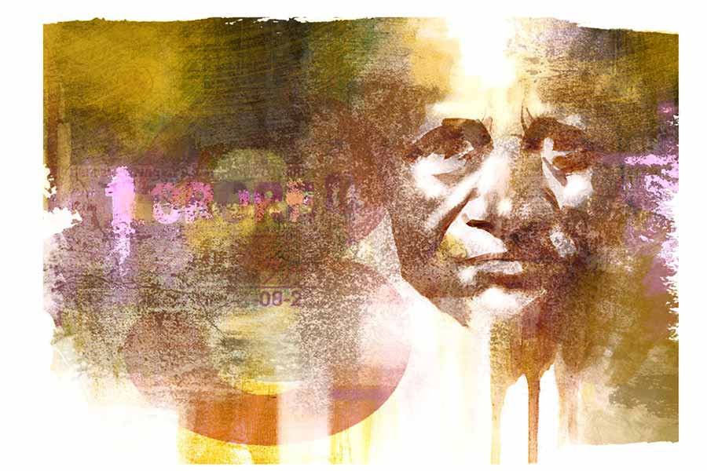

 
 <h1 align=center>লটারি</h1>
<h2 align=center>সুদীপ জোয়ারদার</h2> 

অনেক বার বলেছে ওর দরকার নেই। তবু ছেলেটা যেন আজ নাছোড়বান্দা। টিকিটের গোছা বাড়িয়ে ধরে বলেই চলেছে, “কাটুন না কাকু একটা নববর্ষ বাম্পার! কালই খেলা!”

এ বার কি ধমক দিতে হবে ছেলেটাকে? লটারির টিকিট বিভাস কোনও কালেই কাটে না। এ ছেলেটা গাড়িতে নতুনও নয়। তাই ব্যাপারটা ওর অজানা থাকার কথা নয়। তবু আজ এত মরিয়া কেন? বিভাস খুব যে অর্থবান, তা নয়। কিন্তু লটারি কেটে ভাগ্য ফেরাতে ও নারাজ। আর তা ছাড়া এই নেশা বড় সর্বনাশা। বাবাকে দেখেছে এই নেশার খপ্পরে পড়ে মাইনের টাকা নয়ছয় করতে। লটারির ব্যাপারে তাই সে বরাবর খুব সতর্ক।

“এত করে বলছে যখন, নিয়েই নিন একটা!” পাশে বসা আধচেনা সহযাত্রীটি বলে ওঠেন। বিভাস রেগে যায় ভদ্রলোকের কথা শুনে। উনি একটা টিকিট নিয়েছেন বলে বিভাসকেও নিতে হবে নাকি!

কোনও মতে মেজাজ সামলে বিভাস বলেছে, “আমি লটারির টিকিট কাটি না দাদা!”

বছর আঠেরো বয়স হবে ছেলেটার। এখনও সে ভাবে দাড়ি-গোঁফ ওঠেনি। এই বয়সেই কেমন রোজগারে নেমে পড়েছে! কে জানে, হয়তো বাধ্য হয়েই। কিন্তু নেমেই যখন পড়েছে, তখন আরও অর্থকরী কায়িক শ্রমের কাজ থাকতে লটারিতে কেন, বুঝতে পারে না বিভাস।

ছেলেটা অবশ্য এখন চলে গেছে কম্পার্টমেন্টের অন্য দিকে। বিভাস তাকিয়ে দেখে, একই ভাবে অন্য যাত্রীদেরও টিকিট গছাতে চাইছে ছেলেটা। আগেও তো দেখেছে ওকে। এ রকম তো করে না! আজ কি খুব তাড়া আছে ওর, খুব তাড়া! অন্য কাজের, অথবা বাড়ি ফেরার!

তাড়ার কথা মনে হতেই আর এক জনের ছবি চোখের সামনে ভেসে উঠল বিভাসের। সব কিছুতেই তাড়া ছিল ছেলেটার। খেতে বসে তাড়া, রাস্তা দিয়ে চলতে গিয়ে তাড়া, ওর সঙ্গে কখনও বাজারে গেলে তাড়া। ওর মা বলত, “সব কাজ তুই কি ঘোড়ায় জিন দিয়ে করিস?”

হাসত ছেলেটা, “পরীক্ষা আর পড়ার চাপ কি স্থির হতে দেয় আজকালকার ছেলেদের?”

বিভাস পার্সটা বার করল। বার করে দেখে নিল অর্কর ছবিটা। প্রায় এক বছর হতে চলল। এখনও ছবিটা দেখলেই মনে হয় এই বুঝি অর্ক হেসে উঠবে, হাত নাড়বে, বাবা বলে ডেকে উঠবে! দীর্ঘশ্বাস পড়ে বিভাসের।

লটারিওয়ালা ছেলেটা এখনও রয়েছে কম্পার্টমেন্টে। ডাকবে কি? টিকিটটা কাটলে আবার পাশের সহযাত্রীটির চোখ সরু হয়ে যেতে পারে। উনি তো বিভাসের এখনকার মনের ঝাঁকুনিটা বুঝবেন না। মনে মনে হয়তো বলবেন, ‘তখন অত ঢঙের কী দরকার ছিল!’

তা যে যা বুঝুক, বলুক। বিভাস ওর নীতির বিরুদ্ধে গিয়ে ডেকেই বসল ছেলেটাকে, “দে একটা বেছে। পাব তো রে?”

স্মার্ট হতে হালকা হেসে একটু রসিকতাও করল।

ছেলেটাও বেশ রসিক। পাল্টা দিল, “গ্যারান্টি পাবেন। এক কোটি না হলেও একশো-দু’শো! কাকু তিনটে আছে, নিয়ে নিন না সব ক’টা!" ছেলেটার গলায় অনুনয়।

“বাবা, একটা বাইক কিনে দাও না!” বুকে বেজে উঠল একটা ফেলে-আসা, পুরনো অনুনয়।

তিরিশ টাকা দিয়ে বিভাস টিকিট তিনটে নিয়েই নিল।

সরকারি স্কুল হলে চৈত্র সংক্রান্তিতে ছুটি থাকত। ওর বেসরকারি স্কুলের অত ছুটি-খয়রাত নেই। আজকের দিনেও ইউনিট টেস্ট রেখেছে। আগামী কাল অবশ্য ছুটি। টিকিটটা পার্সে রেখে ঘড়ি দেখল বিভাস। ট্রেনটা আজ লেটে চলছে। সাড়ে দশটা বেজে যাবে স্কুলে পৌঁছতে। রাস্তায় জ্যামে পড়লে আরও দেরি। দশটা পঁয়তাল্লিশে স্কুলে ঢোকার নিয়ম। পারবে তো যেতে! বিভাস একটু টেনশনে পড়ল।

সামনে দাঁড়িয়ে আছে বছর কুড়ির এক তরুণী। একই সঙ্গে উঠেও বসার জায়গা পায়নি। দুটো সিটের মাঝে ঢুকলে অনেক সময় পাওয়া যায়। কিন্তু আজ পাবে কি?

চলাচলের রাস্তায় দাঁড়ালে বার বার লোকের গুঁতো খেতে হয়। তবু বিভাস কখনও দুই সিটের মাঝখানে ঢোকে না। দু’দিকে বসে থাকা লোকজনের হাঁটুর মধ্যে দাঁড়ানো আরও অস্বস্তিকর মনে হয়। মেয়েটা কিন্তু ও ভাবে স্বচ্ছন্দেই দাঁড়িয়ে আছে। উঠে ওকে বসতে দেবে কি?

বসার কথা বলবে-বলবে করছে, এমন সময় মেয়েটা পরের স্টেশন আসতেই নেমে গেল। অনেক ক্ষণ পরে পা-টা একটু মেলে বসার সুযোগ এল এ বার। কিন্তু পা-টা মেলতেই কী যেন একটা ঠেকল পায়ে। একটু ঝুঁকে তাকিয়ে দেখল, ছোট্ট একটা লেডিজ় পার্স। নিশ্চয়ই মেয়েটার!

উল্টো দিকের সেই সহযাত্রীটিও টের পেয়েছেন পার্সটার অস্তিত্ব। বললেন, “গাড়িটাও তো ছেড়ে দিল! নেমে যে দিয়ে আসা যাবে তারও উপায় নেই!”

“এত ক্ষণে গেটও পেরিয়ে গিয়েছে। গাড়ি না ছাড়লেও পেতাম না!” বিভাস পার্সটা কুড়িয়ে হতাশ গলায় বলল।

“আপনি রেখে দিন দাদা। আপনি ডেলি প্যাসেঞ্জার। মেয়েটাকেও যেতে দেখেছি এই ট্রেনে। কলেজ-টলেজে হয়তো পড়ে। দিয়ে দিতে পারবেন।”

আশপাশের সকলের অনুরোধে কী করবে বুঝতে পারল না বিভাস। গাড়ি থেকে তাড়াহুড়ো করে নামতে গিয়ে এক বার মোবাইল খুইয়েছিল অর্ক। মোবাইলটা কিন্তু পাওয়া গিয়েছিল। বিভাসেরই বয়সি এক অচেনা ভদ্রলোক মোবাইলটা কুড়িয়ে পেয়েছিলেন। তার পর ফোন করে খবর পাঠিয়ে ফেরত দিয়েছিলেন।

বিভাস মেয়েটার পার্সটা ব্যাগে ঢুকিয়ে রাখল।

স্কুলে পৌঁছল একেবারে কাঁটায় কাঁটায়। গিয়ে দেখল আঠেরো, মানে ওল্ড বিল্ডিংয়ের দোতলার কোণের ঘরে গার্ড পড়েছে। এ ঘরে সব এইটের ছাত্র। মানে একটু বড়। প্রথম থেকেই কড়া গার্ড দিতে হবে। না হলে পেয়ে বসবে। এমনিতে প্রাইভেট স্কুলে ছাত্ররা বেশ ডিসিপ্লিনড। তবু সুযোগ পেলে তার সদ্ব্যবহার কি আর কেউ করবে না!
কড়া গার্ড মানে চেয়ারে বসা চলবে না। চেয়ারে বসলে পিছন অবধি নজর করা যায় না। চেয়ারে বসছিলও না বিভাস। ঘণ্টাখানেক এ ভাবেই পার করল। না, ছেলেগুলো লিখছে ঠিক ভাবেই। আটান্ন পার করল। এই বয়সে সারা ক্ষণ কি দাঁড়ানো যায়! চেয়ারটাকে আর অবহেলা করতে পারল না।

চেয়ারে বসতে না বসতেই বিকট আওয়াজ। এ কী অঘটন! পায়ের ঠিক সামনে ভেঙে পড়েছে উপরের সিলিং ফ্যানটা! যেন ওর চেয়ারে বসার অপেক্ষাতেই ছিল ওটা। ছেলেগুলো স্তব্ধ। বিভাস নির্বাক।

“স্যর, লাগেনি তো আপনার?” স্তব্ধতা কাটিয়ে দ্বিতীয় বেঞ্চের কোণের ছেলেটা শুধোল।

লেগেছে কি? ছেলেটা বলার পরে যেন টের পেল যন্ত্রণাটা। আরে! ফ্যানের ব্লেডে হাঁটুর নীচে কেটেও তো গেছে অনেকটা! সহকর্মীরা আওয়াজ পেয়ে ছুটে এসেছে। ওকে ধরে এক জন স্টাফরুমে নিয়ে এসে বসায়। এক চুল এ দিক-ও দিক হলে আজ আর দেখতে হত না। ‘সিলিং ফ্যান ভেঙে শিক্ষকের মৃত্যু’— খবরের কাগজের এক কোণে ঠাঁই করে নিত সংবাদটা।

চোর পালালে পুলিশ আসে। এ ক্ষেত্রেও তাই হল। বেসরকারি স্কুল হলে কী হবে, সারা বছর এ সবের দেখভাল নেই মোটেই। এখন ইমেজ রক্ষা করতে শুরু হল কর্তৃপক্ষের লোকদেখানি তৎপরতা।

এ সবে বিভাসের কী আসে যায়! আজ কী হতে পারত সেটা ভেবেই ও শিউরে উঠছে। ফ্যানের ব্লেডে জখম পা-টায় ওষুধ লাগিয়ে ব্যান্ডেজ করে দিয়েছে এক জন। তীব্র না হলেও বেশ ব্যথা পায়ে।

“ট্রেনে যেতে পারবেন তো? নাকি গাড়ি ভাড়া করে দেব?” প্রিন্সিপাল জিজ্ঞেস করলেন।

“দরকার নেই। চলে যাব।”

“বাড়িতে কি ফোন করেছেন?”

“না করিনি। আতঙ্কিত হবে খামোখা। গিয়েই বলব।”

ট্রেনের দেরি নেই খুব একটা। পরীক্ষাও শেষ। ট্রেনের যাত্রী আরও দু’জন শিক্ষক। তাঁদের সঙ্গে টোটোতে গিয়ে উঠল বিভাস। দশ টাকা ভাড়া। খুচরো আছে কি?

পার্সটা বার করল। আছে একটা দশ টাকা। টাকাটার সঙ্গে লেপ্টে থাকা লটারির টিকিটগুলো দেখে বেশ মজাই লাগল। কাল খেলা। আর আজকেই প্রাণটা চলে যেতে যেতে ফিরে পেল। এটা তো লটারি পাওয়ারই শামিল!

বাড়ি এসেও ট্রমা কাটল না অনেক ক্ষণ। ফ্যানের নীচে বসতে ভয় করছে। রিমিকে শুধু ঘটনাটা খুলে বলেছে। আর কোনও কথা বলতেও ইচ্ছে হচ্ছে না। কাছের ওষুধের দোকানটা থেকে একটা টেটভ্যাক নিয়ে এল। এসে বিছানায় শুল টানটান হয়ে।

“রাতে কী খাবে?” রিমি ঘরে উঁকি দিয়ে জিজ্ঞেস করল।

“যা খাই, রুটি। তুমি?”

“আমি আজ আর কিছু খাব না!”

“রাতে কোনও দিন খাও, কোনও দিন খাও না। এ ভাবে শরীর নষ্ট
করছ কেন?”

“কী করব! আমার যে কিছুই ভাল লাগে না। দিনটা যেমন তেমন, রাত্রি হলেই ওর সব স্মৃতি বুকের উপর চেপে বসে। তুমি কেন যে ওকে সব কথা জানাতে গেলে?”

“আমি ইচ্ছে করে কি জানিয়েছি? অনূর্ধ্ব আঠেরোতে নির্বাচিত হয়েও ক্রিকেটের অত বড় সুযোগটা ফস্কে যাচ্ছিল বার্থ সার্টিফিকেট ডিজিটাল না থাকায়। ডিজিটাল করতে গিয়েই তো জেনে গেল সব। কিন্তু ওর যে এতে এত রিঅ্যাকশন হবে তা সত্যিই বুঝতে পারিনি!”

“সবই আমাদের কপাল!” রিমির গলা বুজে এল।

বিভাসেরও একটা লম্বা শ্বাস পড়ল। এক বছর আগেও এই সময়টায় কত ব্যস্ততা! সারা ঘরে কত ছাত্রের ভিড়! এইচ এস-এর ফিজ়িক্সের টিউটর হিসাবে নামও ছিল বেশ। ছেলেটা চলে যাওয়ার পরে সব ত্যাগ করেছে। কার জন্য বাড়তি রোজগার করবে ও, কার জন্য!

কলেজপড়ুয়া মেয়েটার পার্সের কথাটা ভুলেই গিয়েছিল। এটা আবার মেয়েটাকে ফেরত দিতে হবে! কিন্তু মেয়েটার দেখা যদি না পায়! পার্সে কি ফোন নম্বর বা ঠিকানা আছে? মোবাইল থাকলে কেউ কি পার্সে রাখে এ সব কিছু! দেখে মনে হয়েছিল পার্সটায় হয়তো কিছু টাকাপয়সা আছে। আর হয়তো কোনও দরকারি কাগজ। খুলে দেখবে কি? যদি ঠিকানা-টিকানা…

ব্যাগ থেকে মেয়েটার পার্স বার করল। টাকা আছে, তবে বেশি নয়। গুনে দেখল, ষাট টাকা। ভিতরে কোনও কাগজ নেই। কিন্তু সামনে প্লাস্টিকের আচ্ছাদনে রয়েছে একটা। মনে হচ্ছে কোনও রসিদ।

টানতেই বেরিয়ে এল কাগজটা। পুরনো রসিদই একটা। কিন্তু রসিদে কী চাপা রয়েছে এটা! উত্তেজিত হয়ে বিছানায় উঠে বসল বিভাস। চিৎকার করে ডাকল, “রিমি!”

“কী হয়েছে কী?” বিভাসের শরীরের কোনও সমস্যা ভেবে ছুটে এল রিমি।

“দেখো দেখো! যেন রাধা কৃষ্ণ পাশাপাশি!” দেখায় বিভাস।

“ছবিতে অর্কর পাশে কে এটা?”

বিভাস রিমিকে বলল ট্রেনের ঘটনা। শুনে রিমি জিজ্ঞেস করল, “ও কি জানে কোথায় আছে অর্ক?”

“জানি না। কাল হয়তো ওকে পাব না, কিন্তু পরের দিন, ঈশ্বর করুন যেন দেখা পাই ওর, দেখা পেলে জিজ্ঞেস করব!”

রিমি বলে, “কাল নববর্ষ না হলেই ভাল হত! এখন একটা দিন অপেক্ষা করাই কঠিন!”

এই অবস্থায় রাতে ঘুমোনোও মুশকিল। দু’জনেই এ পাশ-ও পাশ করছে। ওকে ছাড়া ওদের ছ’শো তিরিশ স্কোয়ারফুটের ফ্ল্যাটটা যে অন্ধকার, তা কি অর্ক জানে? জানলে কি অমন করে একটা চিঠি লিখে এত দিনের সব মায়া-ভালবাসা ঠেলে চলে যেতে পারত!

বিভাসের বালিশ ভেজে গরম অশ্রুতে। পাশে রিমিরও যে তাই, অনুমান করতে পারে। আর ওই মেয়েটা, অর্কর ছবিটা যে পার্সে বয়ে বেড়ায়, যোগাযোগ না থাকলে তারও তো চার পাশটায় এ রকমই অন্ধকার!

সকালে বিভাসের ঘুম ভাঙল রিমির উত্তেজিত কণ্ঠে, “দেখো তো এটা কী? কী অদ্ভুত সমাপতন!”

চোখ পরিষ্কার করে বিভাস ফোনের মেসেজটায় চোখ রাখল। শরীর রীতিমতো কাঁপছে বিভাসের।
ও পড়ে চলল।

“বাবা, আমি জানি তোমাদের কাছে আমি কী, কতখানি! তখন ততটা না বুঝলেও আজ খুব স্পষ্ট বুঝেছি। আমি হোমের সুপারভাইজ়ারের কাছে অনেক কেঁদেকেটে কিছুটা আভাস পেয়েছিলাম। তার পর নিরন্তর অনুসন্ধানে খুঁজে পেয়েছি নিজের শিকড়। আমার জমানো টাকা খরচ করে শিকড়ের কাছে পৌঁছতে অসুবিধেও হয়নি। জেনেছি, আমার যখন তিন বছর বয়স, কুম্ভমেলায় হারিয়ে গেছিলাম মায়ের হাত খসে। আমার শিকড় খুঁজে পেয়ে আমি আনন্দিত হয়েছি নিশ্চিত, কিন্তু প্রাণ যে কাঁদছে তোমাদেরই জন্য। মাকে বোলো, তার কৃষ্ণ মথুরা খুঁজে পেলেও মন পড়ে আছে বৃন্দাবনে! আমি ফিরে আসছি কয়েক দিনের মধ্যেই। এটা আমার নতুন নম্বর— অর্ক।”

“কৃষ্ণ, আমার কৃষ্ণ ফিরবে! আবার সেই আগের মতো হবে সব কিছু!” অনেক দিন পর নিজের দেওয়া ডাকনামটা ধরে ফুঁপিয়ে উঠল রিমি।

নববর্ষের পরের সকালে মেয়েটার জন্য স্টেশনে দাঁড়িয়েছিল বিভাস। লটারির ছেলেটা স্টেশনের শেডের নীচে বসে কাগজে লটারির ফলাফল দেখছে। বিভাসকে দেখতে পেয়ে পাংশুমুখে বলে উঠল, “কাকু, একটাও ওঠেনি আমার টিকিটে!”

বিভাস হাসল। কে বলল ওর লটারিতে ওঠেনি! ওর বিভাসকে দেওয়া তিন টিকিটেই তো তিনটে প্রাইজ় উঠেছে! ফার্স্ট, সেকেন্ড, থার্ড। সব পুরস্কার কি আর টাকার অঙ্কে হয়!

পুরস্কারগুলো ক্রম অনুসারে সাজাল বিভাস। প্রথমত কৃষ্ণের প্রত্যাবর্তন-সংবাদ, দ্বিতীয়ত রাধা আবিষ্কার আর তৃতীয়ত ওর প্রাণ রক্ষা পাওয়া। তবে বিভাসের তিন নম্বর পুরস্কারটা শুধু আক্ষরিক এবং একার নয়। কারণ, শুকিয়ে যাওয়া দু’টি গাছেই যে আজ প্রাণের হিল্লোল!

