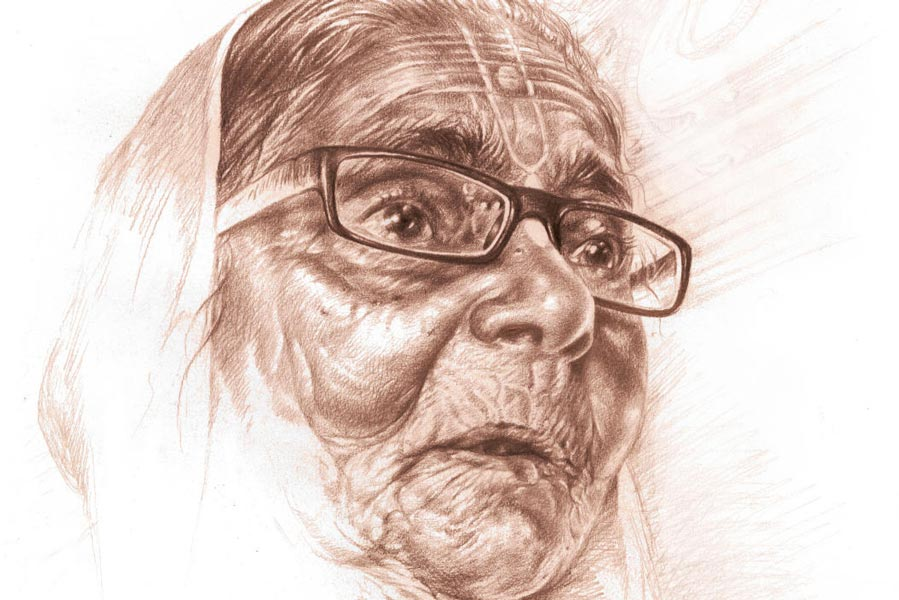

 
 <h1 align=center>লবণাক্ত</h1>
<h2 align=center>অভিজিৎ বেরা</h2> গল্পের শুরু লোকাল ট্রেনের এই কামরায়। ওই যে দেখছেন ঠাকুমাটি, বয়স আন্দাজ আশি ছুঁয়েছে, তাঁকে দিয়ে। তিনি একটা বোঁচকা উপরে তুলতে হিমশিম খাচ্ছেন। কেউ সাহায্য করতে এগিয়ে আসছে না। অগত্যা তিনি সেটিকে দু’হাতে বুকে আঁকড়ে দাঁড়িয়ে রয়েছেন দুই সিটের মাঝে। খুব ভিড় ট্রেনে। চলন্ত ট্রেনে এই বয়সে এত বড় একটা বোঁচকা সামলে দাঁড়ানো সম্ভব? প্রায়ই তিনি পাশের জনের গায়ে ধাক্কা খাচ্ছেন। আর পাশের জন চেঁচিয়ে উঠছে, “ও ঠাকুমা ঠিক করে দাঁড়ান!”

সামনে বসা লোকটি এত ক্ষণ মোবাইলে খুটখুট করছিল। সে মুখ তুলে বৃদ্ধাটিকে দেখল। সাধারণ চেহারা। রোগা। সাদা থান পরনে। মুখে বলিরেখা। চোখে সাধারণ চশমা। কপালে তিলক আঁকা। সাদা চুলের পিছনে ঝুঁটিখোঁপা। লোকটি সিট ছেড়ে উঠে দাঁড়াল, “মাসিমা, এখানে বসুন। ব্যাগটা দিন। আমি উপরে তুলে দিচ্ছি।”

বৃদ্ধার মুখে আলো ফুটে উঠল। লোকটির ঝিম কালো চেহারা। মোটা গোঁফ। বয়স আন্দাজ চল্লিশ। সে ব্যাগটি উপরে তুলে দিল।   

“কত দূর?” 

“বর্ধমান।”

“সঙ্গে কেউ নেই?”

“না বাবা। মেয়ে এসে স্টেশনে ছেড়ে গেছে।”

“এই বয়সে একা বেরিয়েছেন! তার উপর এত বড় ব্যাগ। বর্ধমানে নেমে কোথায় যাবেন?”

“রায়নগর যাব বাবা। কালনা গেট পেরিয়ে যেতে হবে।”

“সেও তো দূর। কী করে যাবেন?”

“ট্রেকারে। গোপাল আসবে নিতে। আমার নাতি।”

“আচ্ছা...” বলে লোকটি ফের মোবাইল ঘাঁটতে লাগল।

“তুমি কত দূর যাবে বাবা?”

“আমি? আমিও বর্ধমানেই যাব।”

“আমাকেও নামিয়ে দেবে বাবা?”

“হ্যাঁ, দেব,” লোকটি উদাসীন গলায় উত্তর দিল। ট্রেন একটা ছোট্ট স্টেশনে থেমেছে। লোকজনের হুড়োহুড়ি। চেঁচামেচি। ঠেলাঠেলি।

ভদ্রমহিলা হাত দিয়ে ফের লোকটিকে ডাকলেন, “এক বার একটু ব্যাগটা নামিয়ে দেবে বাবা? ওই গোপালকে একটু বলে দিতাম স্টেশনে আসতে।”

লোকটি বোঁচকাটি নামিয়ে দিল। বৃদ্ধা ব্যাগ থেকে একটা ছোট ডায়েরি বার করলেন। তাতে অনেক নম্বর লেখা। একটা দেখিয়ে বললেন, “এই নম্বরে একটা ফোন করে দেবে?”

লোকটি দেখল, আঁকাবাঁকা অক্ষরে ডায়েরিতে কতগুলো নম্বর লেখা। সে ডায়াল করল। রিং হচ্ছে।

“হ্যালো।”

“কে গোপাল?”

“হ্যাঁ, বলছি।”

“নিন, কথা বলুন।”

লোকটি ফোন এগিয়ে দেয় বৃদ্ধাটির দিকে।

“আমি ঠাকুমা বলছি রে। ট্রেনে চেপেছি। তুই চলে আসিস স্টেশনে।”

বলে ফোনটি এগিয়ে দিল লোকটির দিকে। লোকটি ফোন কানে নিয়ে বলল, “আপনি এগারোটা নাগাদ আসুন। প্ল্যাটফর্মে দাঁড়াবেন।”

“দাদা, শুনুন না... আমি কোথায় খুঁজব প্ল্যাটফর্মে? তার চেয়ে বাইরে গেটে দাঁড়ালে ভাল হত না?”

“আচ্ছা ঠিক আছে।” লোকটি একটু বিরক্তই হল। এই বোঁচকা নিয়ে ফ্লাইওভার পেরিয়ে বেরোতে হবে।

*****

ট্রেন প্ল্যাটফর্মে ঢুকছে। মোটে সাড়ে দশটা বাজে। ভালই টেনেছে ট্রেনটা। বিফোর টাইমে ঢুকিয়ে দিয়েছে। মহিলাকে নামিয়ে দিয়ে যেতে দেরি হবে না আর। সে তাকিয়ে দেখে, বৃদ্ধা ঘুমিয়ে পড়েছে। সে ঘাড় বেঁকিয়ে ব্যাগখানা দেখল। নিয়ে পালালে কেউ ধরতেও পারবে না। ভেবে খুব হাসল মনে মনে। বৃদ্ধাকে মৃদু ঠেলা দিল, “মাসিমা উঠুন। বর্ধমান এসে গেছে।” 

ভদ্রমহিলা গভীর ঘুম থেকে জেগে উঠলেন, “এসে গেছে বাছা? চোখটা লেগে গিয়েছিল। গোপালকে একটা ফোন করলে হয় না?”

“করব। বাইরে বেরোই আগে।”

ট্রেন থেমে গেছে। লোকজন নামতে শুরু করেছে। লোকটি বৃদ্ধার ব্যাগটি নীচে নামিয়ে কাঁধে ঝুলিয়ে নিল। বেশ ভারী। তার পর বাঁ হাতে ভদ্রমহিলাকে ধরে নীচে নামাল। প্রচণ্ড ভিড়। প্ল্যাটফর্মে ঠেলাঠেলি। সিঁড়ি দিয়ে ওভারব্রিজে উঠতে হবে। হেঁটে এক নম্বর প্ল্যাটফর্মে নেমে বাইরে বেরিয়ে গেট। এত বড় বোঁচকা নিয়ে হাঁটা মুশকিল। সে বৃদ্ধার হাত ছেড়ে দিল। “মাসিমা, আপনি আমার পিছন-পিছন আসুন।”

লোকটি ভিড় ঠেলে এগিয়ে গেল। বৃদ্ধা হিমশিম খাচ্ছেন। তাঁর চোখ ঝাপসা হয়ে আসছে। যতটা পারছেন লোকটির পিছন পিছন আসছেন। কে যে কোথা থেকে গুঁতো মেরে ঢুকে পড়ছে, সামলে তাল রাখা মুশকিল। সিঁড়ি দিয়ে ওঠার সময়ও তিনি লোকটাকে দেখতে পেয়েছিলেন। উপরে উঠে আর দেখতে পেলেন না। চার দিকে শুধু মাথা আর মাথা। কোথায় সেই লোকটি, আর কোথায়ই বা তাঁর বোঁচকা। ভিতরটা ভয়ে কেঁপে উঠল। গলা শুকিয়ে আসছে। তিনি এ দিক-ও দিক তাকাতে তাকাতে ভিড়ের সঙ্গে হাঁটতে লাগলেন। ভিড় এক নম্বর প্ল্যাটফর্মের দিকে নামতে শুরু করেছে। হঠাৎ লোকটি যেন মাটি ফুঁড়ে তার সামনে এসে দাঁড়াল, “কোথায় চলে গেছিলেন? বললাম যে পিছন-পিছন আসতে?”

বৃদ্ধা যেন প্রাণ ফিরে পেলেন। তার হাত ধরে বললেন, “আর এগিয়ো না বাবা। তাল রাখতে পারছি না।”

“আচ্ছা, তা হলে আমার সঙ্গে সঙ্গেই আসুন।”

বৃদ্ধাটি তার বাম হাত ধরে ধীরে ধীরে নীচে নামতে লাগলেন। এক নম্বর প্ল্যাটফর্মে ভিড় একটু কম। লোকটি আর বৃদ্ধা বাইরে বেরিয়ে গেটের মুখে এসে দাঁড়াল।

*****

“আমি তো সবে স্ট্যান্ড পেরোচ্ছি। আপনি তো বললেন এগারোটা।”

“ট্রেন তো বিফোর টাইম।”

“আচ্ছা, আপনি দাঁড়ান। দশ মিনিটে আসছি।”

বৃদ্ধাটি ব্যাগ খুলে কী একটা খুঁজছেন।

“কী খুঁজছেন মাসিমা?”

“বড্ড খিদে পেয়েছে বাবা। বিস্কুটের কৌটোটা কোথায় যে গেল।”

“দাঁড়ান, আমি দেখছি।”

লোকটি হাঁটু মুড়ে বসে ব্যাগ হাতড়াতে লাগল। পুরনো শাড়ি-চাদর আর নানা রকমের কৌটো। নীচের দিকে একটা প্লাস্টিকের বয়ামে বিস্কুট। টেনে বার করে আনল ওটা।

“এই যে মাসিমা...”

বৃদ্ধাটি যেন চাঁদ পেলেন, “তুমি না থাকলে যে কী হত!” তার পর দুটো বিস্কুট লোকটির দিকে এগিয়ে দেয়।

“আমি খাব না মাসিমা। ভাত খেয়ে বেরিয়েছি। আপনি খান।”

“খাবে না বাবা? আচ্ছা বেশ...” একটা জলের বোতল বের করে বিস্কুটগুলো ধুয়ে খেতে লাগলেন।

লোকটি অস্থির ভাবে এ দিক-ও দিক দেখতে লাগল। মিনিট তিন-চারের মধ্যেই সাদামাটা চেহারার অল্পবয়সি একটা ছেলে এসে সামনে দাঁড়াল। বৃদ্ধাটি লোকটির গায়ে মাথায় হাত বুলিয়ে বলল, “তা হলে চলি বাবা। খুব ভাল থাকবে। খুব উন্নতি হবে। আমি গুরুদেবের কাছে সব সময় তোমার মঙ্গল কামনা করব।”

লোকটি কিছু বলল না। হাবভাবে তাড়াহুড়ো। ওরা চলে যেতে লোকটি মোবাইল বার করে ঘড়ি দেখল। হাতে কিছুটা সময় আছে এখনও।

*****

“ও গোপাল! আমার মানিব্যাগ কই?”

“আমি কী জানি! আমি তো ব্যাগ তুলে সোজা ট্রেকারে চেপেছি। ভাল করে দেখো। থাকবে কোথাও।”

“না না! সব জায়গা দেখেছি। ওই ছেলেটাই নিল নাকি রে! হায় হায়, এ আমার কী সর্বনাশ হল রে। ছেলেটাকে কত আদর করে এলাম। আর সেই কি না...”

“কত টাকা ছিল?”

“তোর পিসি হাজার টাকা দিয়েছিল। তোর বাবা দিল রাহাখরচ বাবদ আরও হাজার। বাকি আমার নিজের টাকা। মোট তিন-সাড়ে তিন হাজার টাকা মতো হবে রে গোপাল!”

“আর দুঃখ করে কী হবে! যা হওয়ার তো হয়ে গেছে। দিনকাল ভাল নয় ঠাকুমা। কাউকে আর বিশ্বাস করা যায় না।”

বৃদ্ধার গলার সুর চড়ায় ওঠে, “তখনই আমার সন্দেহ হয়েছিল! কেউ সিট ছাড়ল না, তুই কেন ছাড়লি! এখন বুঝেছি বদ মতলব ছিল। গুরুদেব, এ তুমি কোন বিপদে ফেললে গুরুদেব?”

“আঃ ঠাকুমা! তুমি থামবে? লোকটাকে দেখেই তো আমার কেমন যেন লাগছিল। কী রকম গুন্ডা-গুন্ডা চেহারা। কালো মোষের মতো রং। আর তেমনি মোটা একটা গোঁফ।”

“সিটে বসতে দিয়ে মন গলিয়ে দিয়েছিল। তখন বুঝতে পারিনি।”

“তুমি যে সিটে বসেছিলে, তখন ব্যাগটা কোথায় ছিল?”

“ও তো ব্যাগটা ওপরে তুলে রেখে দিয়েছিল।”

পাশের লোকটি বোধ হয় স্কুলটিচার। কোলে ব্যাগ। চোখে চশমা। তিনি জিজ্ঞেস করলেন, “আর আপনি কী করছিলেন? নজর রেখেছিলেন ব্যাগে?”

“আমি তো কখন ঘুমিয়ে পড়েছি বাছা। বর্ধমান ঢুকতে সে-ই তো আমায় জাগিয়ে দিল।”

“তখনই কালপ্রিট কাজটা হাসিল করেছে,” সিদ্ধান্ত ভদ্রলোকের।

গোপাল বলল, “আর ট্রেন থেকে নামার পর?”

“নেমে সে-ই ব্যাগ নিয়ে সিঁড়িতে উঠল। নামল। গেটের বাইরে এসে নামিয়ে রাখল। গেটের বাইরে আমি যখন তোর অপেক্ষা করছিলাম, তখন খুব খিদে লাগছিল। বিস্কুটের কৌটোটা খুঁজে পাচ্ছিলাম না। ও তখন ব্যাগ হাতড়ে ওটা বার করে দিয়েছিল।”

পাশের লোকটি বলে উঠল, “তা হলে তো ক্লিয়ার কেস। তখনই সরিয়ে নিয়েছে মানিব্যাগটা।”

গোপাল বলল, “ঠাকমা, রাস্তাঘাটে এ রকম অজানা অচেনা লোককে কেউ ব্যাগ খুলে দেখায়? তোমার চুরি হবে না তো কার হবে?”

পাশের লোকটি বলল, “তাও তো অল্পের ওপর দিয়ে গেছে। এক কাজ করুন। থানায় যান। একটা কমপ্লেন লজ করে আসুন।”

“ও গোপাল কী করবি রে?”

“ঠাকমা এখন বাড়ি চলো। বাবা-কাকার সঙ্গে কথা বলে ওবেলা কিছু একটা করা যাবে। ভাড়াটা আমিই দিয়ে দিচ্ছি এখন।”

বৃদ্ধাটি তারস্বরে কপাল চাপড়াতে চাপড়াতে চলেছেন, “হরি হে! রাধামাধব! কোনও দিন কারও অনিষ্ট করিনি। এত বড় সর্বনাশ কেন করলে আমার? কত আশীর্বাদ করলাম ছেলেটাকে। গুরুদেবের কাছে প্রার্থনা করব বললাম।”

ট্রেকারের ড্রাইভার বলে উঠল “তা গিয়ে করুন না এ বার। ভাল করে করুন। ওদের উন্নতি হোক। এখন তো চোর-পকেটমারদের জমানা।”

সবাই হেসে উঠল তার কথায়।

বৃদ্ধা সমানে কেঁদেই চলেছেন, “রক্ষে করুন গুরুদেব। এ বিপদ থেকে আমাকে রক্ষে করুন।”

পাশের লোকটি আবার বলে উঠল, “ভাল কথা বলছি। থানায় যাও। এখনও সময় আছে। টাকাটা পেলেও পেতে পারো।” 

হঠাৎ একটা ফোন বেজে উঠল। চেনা রিংটোন। গোপাল প্যান্টের পকেটে হাত দিল। তারই ফোন। একটা অচেনা নম্বর। আরে, সেই লোকটার নম্বর না? শেষ তিনটে ডিজিট তিন চার পাঁচ।

সে চেঁচিয়ে বলল, “লোকটা ফোন করছে। সবাই চুপ করুন।”

নিমেষের মধ্যে শোরগোল থেমে গেল। ড্রাইভার স্টার্ট বন্ধ করে তাকিয়ে রইল ওর দিকে। সবার মুখ থমথমে। ঠাকুমার কান্না বন্ধ।

গোপাল ফোন ধরে, “হ্যালো...”

“হ্যাঁ, আমি বলছি। ট্রেনে আপনার ঠাকুমার সঙ্গে এলাম।”

“হ্যাঁ, বুঝতে পেরেছি। বলুন।”

“আপনার ঠাকুমা টাকার পার্স ফেলে গেছেন। বোধহয় ব্যাগ খোলার সময় পড়ে গেছে। আপনারা যাওয়ার পরে দেখলাম।”

গোপাল ফোনে হাত চাপা দিয়ে ফিসফিস করে বলল, “মানিব্যাগ পাওয়া গেছে।”

ট্রেকারে সবার মুখ উজ্জ্বল হয়ে উঠল। ঠাকুমা দু’বার কপালে মাথা ঠেকিয়ে তাঁর গুরুদেবকে প্রণাম করলেন। গোপাল আবার বলল, “আচ্ছা, ওটা কী করে পাব?”

“আমি কার্জন গেটে দাঁড়িয়ে আছি। গণেশ ভান্ডারের সামনে। এখন আসতে পারবে?”

“হ্যাঁ, পারব। আপনি দাঁড়ান।”

“ওকে। দেরি কোরো না ভাই...” ফোনটা কেটে গেল।

পাশের মাস্টারমশাই বললেন “কী কথা হল”?

“মানিব্যাগটা রাস্তায় পড়ে ছিল। এক্ষুনি বলল আসতে। কার্জন গেটে দাঁড়িয়ে আছে। ড্রাইভারদা আমাদের নামিয়ে দিন।”

ড্রাইভার গাড়ি স্টার্ট করে বলল, “গাড়ি ঘুরিয়ে নিচ্ছি। যার তাড়া আছে নেমে যেতে পারে।”

তার পর চেঁচিয়ে হেল্পারকে বলল, “মাখন, পিছনটা দেখ। গাড়ি ব্যাক করব।”

মাস্টারমশাই বললেন, “হ্যাঁ হ্যাঁ, চলো ভাই। ক্লাইম্যাক্সটা নিজের চোখে দেখেই যাই।”

ট্রেকারের বাকি যাত্রীরাও বলল, “হ্যাঁ হ্যাঁ। চলো।”

*****

গণেশ ভান্ডারের সামনে গিয়ে দেখা গেল একটা বাইকে বসে লোকটি সিগারেট টানছে। অস্থির ভাবে এ দিক-ও দিক দেখছে। ট্রেকার পাশ ঘেঁষে দাঁড়াতেই গোপাল লাফিয়ে নামল। লোকটি সিগারেট ফেলে এগিয়ে এল। পকেট থেকে মানিব্যাগটা বার করে বৃদ্ধাটির হাতে দিয়ে বলল, “মাসিমা, এই যে আপনার পার্স। দেখে নিন সব ঠিক আছে কি না।”

বৃদ্ধা হাতে নিয়ে খুলে দেখলেন টাকা, ট্রেনের টিকিট, ডায়েরি, ওষুধ, কিছু খুচরো কাগজ। সব ঠিকই আছে।

“আচ্ছা চলি তবে। আমার দেরি হয়ে যাচ্ছে।”

ট্রেকারের সমস্ত যাত্রী চুপ। সবাই ওকে দেখছে। গোপাল ট্রেকারে উঠে সিটে বসতেই লোকটি আবার ঘুরে দাঁড়াল। ড্রাইভারের দিকে ইশারা করে বলল, “এক মিনিট দাদা,” বলেই নিজের পার্স বার করে একটা একশো টাকার নোট বৃদ্ধাটির হাতে গুঁজে দিয়ে বলল, “মাসিমা, মিষ্টি কিনে খাবেন। আবার কবে দেখা হবে না হবে। আশীর্বাদ করুন, যেন জীবনে বড় হতে পারি।”

বৃদ্ধা আর কোনও কথা বলতে পারলেন না। টাকাটা হাতে ধরে ঠকঠক করে কাঁপতে লাগলেন। তাঁর দু’চোখ দিয়ে অবিশ্রান্ত ঝরনার জল গড়িয়ে পড়তে লাগল। এই ঝরনার জলের স্বাদ বড় লবণাক্ত।