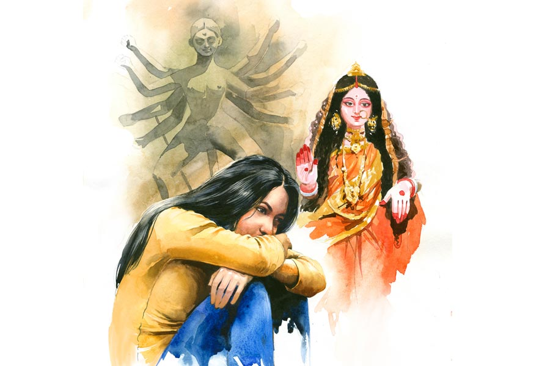

 
 <h1 align=center>লাবণ্যে পূর্ণ কোজাগরী</h1>
<h2 align=center>সুদীপ বন্দ্যোপাধ্যায়</h2> ওই যে ছোট স্টুডিয়ো, আধো-অন্ধকারে পড়ে আছে— ক’দিন আগেও ছিল সরগরম কাজকর্ম নিয়ে। তার মালিকের ফাঁড়া জ্যোতিষসার্থক করে তুলেছে করোনা ঠিক দু’বছর আগে। প্লাস্টিকের ব্যাগবন্দি করুণাবাবুর দেহ নিয়ে চলে গিয়েছিল ওরা। স্টুডিয়োর এক পাশে ঝাঁকড়া ওই শিউলি গাছ, সে রাতেও টুপটাপ ঝরিয়েছে ক্ষণজন্মা আগমনী ফুল আর সঙ্গে একটা-দু’টো শুঁয়োপোকা।

করুণাবাবুরা শিল্পী। কয়েক প্রজন্ম ধরে। পূর্ববঙ্গ থেকে এসে প্রথমে কলোনি, পরে পেনেটির গঙ্গাতীরে ছোট্ট মাটিঘর। সে ঘর অবশ্য পরে পাকা হল, সংসারও গড়াল। পেশা একই রইল। মাটি। মৃৎপ্রতিমা। অবশ্য ক’জন চটকলেও নিয়েছিল কাজ। সে চটকল আজ আর নেই।

এক মেয়ে, দুই ছেলে করুণাবাবুর। বৌ যক্ষ্মারোগে গত বহু দিন। ছেলেরাই বড়, তারা ঘরে খায়, মোষ তাড়ায় বনে। আসলে, রাজনীতি করে। যখন যে পার্টি আসে, তারা তার উলঙ্গ সৈনিক।

কালক্রমে শিল্পী বলে দাম মেলায় বায়না হত, হয়েছে স্টুডিয়ো। সঙ্গী বলতে মেয়ে দূর্বা, নবীন উড়ুক্কু পাখি, হাত লাগাত বাবার কাজেও। ক্রমে ক্রমে শিখে নিয়ে নিজেই এক দিন নিল আস্ত-আস্ত প্রতিমার ভার। করুণাবাবুও খুশি। দুঃখ শুধু, সব সামলে এমএ করা হল না দূর্বার।

সে দূর্বাই বসে আছে স্থির পাথর, স্টুডিয়োয়, আধো-অন্ধকারে আজ, একা। হলুদ বালবের আলো যেটুকু দেখাচ্ছে, তাতে তাকে ছাড়া চোখে পড়ছে আরও দুই লোক। এক জন দোমেটে দুর্গা। বায়না-বাতিল হয়ে পড়ে আছে এখানেই। কমিটির সেক্রেটারি দুম করে মরে গিয়ে এ দুর্গার দুর্ভাগ্য ডেকেছে। বোসপাড়া কমিটির পুজো বন্ধ হয়েছে এ বার। স্টুডিয়োয় দুর্গা ছাড়া দূর্বার আর এক সঙ্গী সুসজ্জিতা মা-লক্ষ্মী প্রতিমা— আজ কোজাগরী, আর এ প্রতিমা দূর্বারই ঘরের— পুজো সন্ধেবেলা, বাকি প্রতিমারা ইতিমধ্যেমণ্ডপে আসীন।

চার দিকে সরঞ্জাম ছড়িয়ে-ছিটিয়ে, কিছু সাফসুতরো হয়নি করাও। দূর্বারও বিষণ্ণ লাগে করুণাবাবুর মতো— প্রতি বার সেও বুঝতে পারে— বিসর্জন সেই দিনই হয়ে যায়, যে দিন ওই যত্নে গড়া রঙিন প্রতিমা নিয়ে চলে যায় কমিটির লোক। মনে হয়, এত দিন খান-বারো দুর্গা কেন পরিবার নিয়ে বসে স্টুডিয়োয় পরিবার হল! দু’দিনের আত্মীয়তা, বন্ধুভাব, তার পরে সকলেই ছেড়ে যায় কেন! প্রত্যেকেরই কিসের এত তাড়া! যেমন গিয়েছে চলে দূর্বার প্রেমিক তাকে ছেড়ে। দু’পা দূরে বাড়ি, রোজ দেখতে পায় দূর্বা তাকে। দেখতে পায়, তার শিবুদা ঝাঁ-চকচকে টোটো নামিয়েছে। আরও দেখে, সে টোটোয় আবির্ভূতা রোজ রাতে এ পাড়ারই নতুন শিবানী।

দোমেটে দুর্গার দিকে একদৃষ্টে চেয়ে আছে মেয়ে। বয়স সাতাশ হবে, অচঞ্চল দেহ তার গ্রিসের পাত্রের মতো কিটসের কবিতা। আসলে সে চেয়ে আছে দুর্গার বুকের দিকে, সেখানে কী করে যেন জেগেছে ধানের চারা, নবাঙ্কুর সবুজ পতাকা। হয়তো খড়ের থেকে কিংবা কোনও পাখিরই ছলনা। হামেশাই হয় এ সব মাটির প্রতিমাগাত্রে। চারা-ঘাস, আগেও দেখেছে। তার বাবা সঙ্গে সঙ্গে উপড়ে ফেলে দিত— বলত, রেখে দিলে ফাটলই বাড়ে, মা! না, দূর্বা ফেলে না দূর্বা, ফেলেনি এ ধানচারাও। তারই দিকে একদৃষ্টে তাকিয়ে। মনে মনে হাসছে, ভাবছে— এত অঙ্গ থাকতে ধান রোপণের জায়গা পেলে না!

আমাদের ছোট নদী

হ্যাঁ, এক দিন চেনা কাশফুলের জঙ্গল মাড়িয়ে, চেনা নদীর ধার দিয়ে, চেনা গেরস্থালি পিছনে ফেলে রেখে চলে আসতে হয়েছিল। দাঙ্গা, কাটাছেঁড়ার নিদান, আবারও দাঙ্গা। তখনও মেঘ শীতের হয়ে ওঠেনি। হ্যাঁ, তখনও লাগানো হয়নি বীজতলার সব নতুন চারা। তবু এই শরতেই চণ্ডীমণ্ডপে শেষ বার পিদিম জ্বালিয়ে, পাশের বাড়ির সই বিলকিশের চোখের জলে ঠোঁট ভিজিয়ে, তাদের ছোট মেয়েটার গাল টিপে আদর করে পোঁটলাপুঁটলি নিয়ে কলকাতার ট্রেন ধরতে হাঁটা লাগাতে হয়েছিল মায়াদের। তার তখন আগে-পিছে দু’জন আর পেটে একটা। মাঝপথেই ছিটকে গিয়েছিল স্বামী, কোথায় জানে না কেউ। কলকাতায় এসেও বিশ্বাস ছিল, এক দিন সব ঠিক হয়ে যাবে। সব পাখি ঘরে ফেরে, তারা ফিরবে না! এক দিন ঠিক ফের ফেরা যাবে চেনা পুকুরটার কাছে, চেনা গোয়ালের সামনে, চেনা শিউলি গাছের পাশে। এক দিন নিশ্চয়ই ফিরে আসবে স্বামীও। দেশ-গাঁ আবার এক হয়ে যাবে এক দিন। যেমন হয় বিসর্জনের পরের বছর ফের, ফের মাটি ওঠে দুর্গাদালানে। তাদেরই করতোয়া নদীর এঁটেল মাটি। খড়ও তো ঘরেরই। কুমোর আসে ছেলেপুলে নিয়ে ঠাকুর গড়তে। বুড়ো করিমচাচা হাজির হয় নতুন কাপড়ের পুঁটলি আর টেপ-ফিতে নিয়ে। নতুন পোশাকের সেই বরাত আবারও হবে নিশ্চয়ই। তাদের জীবনেও পুরনো মাটি নতুন করে উঠবেই উঠবে এক দিন।

না, হয়নি। কাশফুলের জঙ্গল ভেঙে গিয়েছিল এ পারে-ও পারে। দু’টুকরো হয়ে গিয়েছিল শরৎ, পুজো, ইদ, রমজান, চড়কের মেলা।

বিসর্জন এসে প্রতিষ্ঠাকে নিয়ে গিয়েছিল।

কত কাল রবে বলো ভারত

বিসর্জনের কলিকাতায় বেরিয়েছেন হুতোম। মোচ্ছবে ভেসেছে ভক্তি। একালের মতো মন্ত্রীসান্ত্রীদের দিয়ে ঘটা করে উদ্বোধন বা ‘অনলাইন ইনোগুরেশন’ না হলেও সেকালেও গন্যিমান্যিরা আলো করতেন বারোয়ারি পুজো বা জমিদারবাড়ি। ইংরেজ কত্তা-মেম পেলে তো আর কথাই নেই! সেই যে এক বার এক ইংরেজ শাসনকত্তার গায়ে ভেঙে পড়েছিল দুর্গাদালানের হাতে-টানা পাখা। জখম হননি তিনি, তবে বাবুগৃহটি ঐতিহাসিক হয়ে গিয়েছিল। আর সেই যে অন্য খানে অন্য এক পুজোয় ইংরেজ বড়কত্তার সামনে দশ টাকার নোটে তামাক পুরে খেয়ে চমকে দিয়েছিলেন গ্রামবাংলার এক বরেণ্য জমিদার আর পরে তাঁরই বাড়ির নীচে মিলেছিল জাল নোট ছাপার মেশিন। এঁদেরই তো ‘ইতিহাস’ বলে? সে ইতিহাস আমাদের কালেও কম কী! বাড়ির নীচের প্রকোষ্ঠে কিছু রাখতে হয় না আমাদের। আমরা উন্নতশির। অভিজাত মহল্লায় ফ্ল্যাটে-ফ্ল্যাটে ছড়িয়ে-ছিটিয়ে রাখি বস্তা-বস্তা নোটের বান্ডিল।

তো হুতোম দেখছেন, দশমীর সকালে দধিকর্মায় প্রতিমার নিরঞ্জন-পর্ব। আরতির পর বিসর্জনের বাজনা। “বামুনবাড়ির প্রতিমারা সকালেই জলসই হলেন। বড়মানুষ ও বাজে জাতির প্রতিমা পুলিশের পাস মতো বাজনা বাদ্যির সঙ্গে বিসর্জন হবেন।” ক্রমে নদীতে বিসর্জনের সময় ঘনিয়ে এল। হুতোম দেখছেন, ধীরে ধীরে কলিকাতা শহরের বড় বড় রাস্তায় ভিড় জমতে শুরু করল। “বেশ্যালয়ের বারান্দা আলাপিতে পুরে গেল।”

আলাপিতে ‘পুরে’ যায় আজও সোনাগাছি, কালীঘাট বিসর্জনের রাতে। এ বারও গিয়েছে। তবে অলি-সুহানা-পূজাদের ‘রেট’ বাড়েনি। দেশের অর্থনীতি নিত্যিনতুন ওঠাপড়ার ভেলকিনাচ দেখালেও ব্যতিক্রম ছাড়া এ ক্ষেত্রের ‘রেট’ ওঠে না বেশি। বিসর্জনের রাতে হালের আকর্ষণ শহরের নয়া-নতুন সব ডান্স বার। সারা বছর ‘ইংলিশ-কাট’, ‘বম্বে-ট্রেন্ড’ চললেও পুজোর ক’দিন, বিশেষত বিজয়ার দিনে, বেশির ভাগ পানীয়-ঠেকেই চকচকে-চুমকিমোড়া শাড়ি। জোয়ার উপহারেরও। কোনও ‘গেস্ট’ সাত পেটি চকলেট বিলি করছেন তো কেউ ওড়াচ্ছেন পঞ্চাশ-সত্তর-লাখখানেক টাকা। ব্যান্ডমাস্টার বিগলিত, প্রীত বার-মালিকও। ঘর্মাক্ত প্রতিমার ভাগ্যে অবশ্য ‘ফিক্সড ডেলি’ ছাড়া যৎসামান্য কমিশনই।

ও দিকে, হুতোমের কালে “তুরুকসোয়ার ও সার্জ্জন সঙ্গে প্রতিমারা রাস্তায় বাহার দিয়ে বেড়াতে লাগলেন— তখন ‘কার প্রতিমা উত্তম’ ‘কার সাজ ভাল’ ‘কার সরঞ্জাম সরেস’ প্রভৃতির প্রশংসারই প্রয়োজন হচ্ছে। কিন্তু হায়! ‘কার ভক্তি সরেস’ কেউ সে বিষয়ের অনুসন্ধান করে না— কর্ম্মকর্ত্তাও তার জন্য বড় কেয়ার করেন না!” গানবাজনাও বাদ যায় না। তখনকার ‘সৌখীন বাবুরা’ বড় সঙ্গীতরসিকও বটেন। তাঁরা “খ্যামটা ও বাই সঙ্গে করে বোট, পিনেস ও বজরার ছাতে বার দিয়ে বসলেন— মোসাহেব ও ওস্তাদ চাকরেরা... দু-একটা রংদার গান গাইতে লাগল... বিদায় হও মা ভগবতী, এ শহরে এসো নাকো আর/দিনে দিনে কলিকাতার মর্ম্ম দেখি চমৎকার/ জস্টিসেরা ধৰ্ম্ম-অবতার, কায়মনে কচ্চেন সুবিচার/ এদিকে ধুলোর তরে রাজপথেতে চেঁচিয়ে চেয়ে চলা ভার/... আবার গবর্নরের গুয়ে দৃষ্টি, সৃষ্টিছাড়া ব্যবহার।”

ভগবতী তো ‘বিদায়’ হলেন। রতিক্লান্তদেহবৎ কর্মকর্তারা এবে কী করিবেক? তাঁরা “নীলকণ্ঠ শঙ্খচিল উড়িয়ে... ঘট নিয়ে ঘরমুখো হলেন। কলাপাতে দুর্গানাম লিখে সিদ্ধি খেয়ে বিজয়ার উপসংহার হল... শহরটা খাঁ খাঁ কত্তে লাগল— পৌত্তলিকের মন বড়ই উদাস হল।”

হে সৌম্য বিষাদ

বিষাদ অমৃতকুম্ভ, যার সীমা নেই, তল নেই। বিষাদ এক প্রায়শ্চিত্ত, ভুল করে পুনরাচমনে। বিষাদের দেহ আছে, রংরঙিন, বিবর্তনশীল। বিষাদের মন আছে, শরীরী বিভঙ্গে ফুটে ওঠে। আবাহনই বেশি তার, বিসর্জন তুলনায় কম। এক আগমনী থেকে ছুট অন্য বিজয়ার দিকে। দু’প্রান্তেই জলঝোরা, দু’দিকেই সংসারী দেবতা। মহামারি, রাজদ্রোহ, অন্য পেশা খুঁটে অন্ন পাওয়া। ‘যেয়ো না রজনী আজি লয়ে তারাদলে’, থাক উমা। ‘যেন এ-যামিনী আর না হয় প্রভাত’, উমা কই! কে বেঁধেছে এই চক্র, কে দিয়েছে বিচ্ছেদ-নিদান? বাঙ্গালার কাব্য জুড়ে দুর্গাদের ‘পথের পাঁচালী’।

শেষ পারানির কড়ি

কুঞ্জরানিকে ভয়। ভয় তিনি সামনে এসে দাঁড়ালে। কুঞ্জরানি বাড়ির সামনে শুয়ে থাকা বাগান থেকে আপন মনে ফুল তুলতেন প্রতি ভোরেই। বর্ষার ভোরে মাথায় কচুপাতা। আশ্বিনের কুয়াশামাখা ভোরে শীত-শীত ভাব। লালপাড়-সাদাশাড়ি তখন গায়ে জড়িয়ে নিতেন গরদের পাতলা চাদর। হাতে তামার সাজি নিয়ে চাঁপাগাছের সামনে দাঁড়াতেন। ফিসফিসিয়ে কী যেন সব বলতেন। খানিক পরে টগরগাছের সঙ্গে তাঁর আলাপন। মাটিতে ছড়িয়ে থাকা শিউলি ফুল রাখতেন আলাদা বড় ঝাঁঝিতে। এই শিউলির কিছু যাবে তাঁর রাধামাধবের পায়ে। কিছুর বোঁটার রঙে রেঙে উঠবে দু’-একখানা সাদা থানের পাড়। সেই শাড়ি কাজে দেবে রাসে, ঝুলনযাত্রায়।

তত ক্ষণে বাড়ির দুর্গাদালানে ঘুম ভেঙে আলতো ছোঁয়া দিয়েছেন ঢাকি তাঁর ঢাকে। সে শব্দে ভেঙে গিয়েছে ঘুম আমাদের। আমরা যারা ছোট, তাদের বাসি কাপড় ছেড়ে টাটকা পোশাক পরার ধৈর্য নেই। কিন্তু নিয়ম ভাঙার শাস্তি আছে ঢের। তা সত্ত্বেও ভাইবোনেরা বিছানা ছেড়ে উঠে দে-ছুট দুর্গাদালানে। কুঞ্জরানির পাশ দিয়েই ছুট-ছুট-ছুট। অপাঙ্গে তাকালেন তিনি। অসন্তুষ্ট। কিন্তু এখন তিনি মানুষের সঙ্গে কথা বলেন না। রাধামাধবের পুজোর পর মুখ খোলেন। আমরা জানতাম, এটাই সেই দুর্লভ সুসময়। বাগান পেরোলেই দুর্গাদালান।

                                ছবি: কুনাল বর্মণ।
                                
                            

এ বাড়ি সাবর্ণদের। এ বংশের নানা তরফের পুজো। সব তরফেই দুর্গাদালান। বড়বাড়ি, মেজোবাড়ি, ছোটবাড়ি। মাঝে আরও কত! জমিদারির কাল গেলেও পুজোর সময়ে হাবভাব একটু বদলে যায়। অনাদি-অনন্ত থেকে যেন হাঁক ভেসে আসে আগের প্রজন্মের। দালানের পাশেই, বাড়ির চৌহদ্দিতে ঢোকার মুখে বড় তোরণদ্বার। তার উপর কয়েকটা ঘর। সেখানে বাজখাঁই-আমলের সব ইতিহাসচিহ্ন সযত্নরক্ষিত। তারই এক কোণে রাখা থাকে দুর্গাপুজোর বাসনপত্র, সরঞ্জাম। এখন সে সব দালানে, পুজোর কাজে।

ক’দিন পুজো, আরতি, দু’বেলা দালানে পাত পেড়ে ভোগ খাওয়া, কাঁসর-ঘণ্টা, ঢাক, নতুন জামা, বন্ধু মিলে হুল্লোড়— সব হয়েছে। এই টানেই ফি-বছর আসা এ বাড়িতে। তবে আর একটা টান দুর্গাদালানও। ওখানে যেন অনেক কালের কাঁসর-ঘণ্টা বেজে চলেছে। কত স্মৃতি এই দালানের! কে জানে, প্রাচীন সেই তিন জনপদ হস্তান্তরের সময় কোনও বৈঠক বসেছিল কি না এই দালানেই! খিলানে-প্রকোষ্ঠে সম্বৎসরের বাসিন্দা এই পায়রাগুলো নিশ্চয়ই তখন ছিল না। কিন্তু ছিল হয়তো ওদের পূর্বপ্রজন্মের পায়রারা! আচ্ছা, পালকিগুলো কোথায় দাঁড়িয়েছিল? ওই সামনের বলির জায়গাটায়?

না, বলি আর হয় না। এ তরফে বন্ধ বহু বছর। অন্য তরফে হত যেখানে, সেখানে এক বার নিয়ে গিয়েছিল বড়রা। মোষবলি। চার দিকে ধুনোর ধোঁয়া। গমগম করছে ঢাকের পাল। থিকথিকে ভিড়। সিঁদুরমাখা বিপুল বলিকাঠের সামনে বিশাল খড়্গ নিয়ে দাঁড়িয়ে এক জন। ‘জয়-দুর্গা জয়-দুর্গা’ রব! নেমে এল খড়্গ তার অভীষ্টে... ফিনকি দেওয়া সেই স্মৃতি আজও অবিশ্বাস্য মনে হয়!

কুঞ্জরানি দুর্গাদালানে যান না। সারা দিন তাঁর রাধামাধবকে নিয়েই কাটে। চিলেকোঠায় রাধামাধবের ঘর। সে ঘরে তিনিও থাকেন। দু’দিকের দেওয়ালে পেল্লাই কাচপাল্লার আলমারিতে ঠাসা বই। সবই প্রায় দুর্বোধ্য! কী সব কঠিন নাম তাদের, সে-বয়সে উচ্চারণও অলীক! ‘রসভাষ্য’, ‘শ্রীশ্রীউজ্জ্বলনীলমণি’, ‘দশ গীতা’, ‘মঞ্জরী স্বরূপ নিরূপণ’! কুঞ্জরানি বৈষ্ণব। এ পরিবারে বিয়ে হয়ে আসার ঢের পরে স্বামী-সন্তান ছেড়ে এক রাতে বাড়ি ছেড়ে পালিয়ে যান। দীর্ঘ বছর নিখোঁজ। অনেক পরে পাড়ার এক তীর্থযাত্রী তাঁকে দেখতে পান বৃন্দাবনে। তত দিনে তিনি ঘোর বৈষ্ণব, দীক্ষিত এবং নানা ভাষায় স্বশিক্ষিত। আরও ঢের পরে আচমকাই এক দিন ফিরে আসা সংসারে। আবারও সংসার প্রতিপালন। কিন্তু এ কুঞ্জরানি মোটেই শ্রীরামপুরের দোর্দণ্ডপ্রতাপ গাইয়ে-বাজিয়ে-অভিজাত বাড়ির মেয়ে নন।

সুর নেই কুঞ্জরানির গলায়। তবু তিনি গান। তিনি গাইলেই ভয় লাগে। ঠিক গাইলেই ভয় লাগে, তাও নয় বোধ হয়। ভয় লাগে তাঁকেই! অথচ পুজোআচ্চার সময় ছাড়া তিনি তাঁর একান্ত-আপন রান্নাঘরেই কাটান। অসামান্য সব ভোগপদ খানিক দূর থেকে এগিয়ে দেন মাংসাশী পরিবারের দিকে। গোয়ালের দেখাশোনা করেন। ছোটদের গল্পও শোনান। তবু ভয় লাগে! কেমন যেন দূরের মানুষ!

এক বার পুজোর সময়, এক দশমীর ভোরে ভাব হয়ে গিয়েছিল কুঞ্জরানির সঙ্গে। বেঁড়ে-পাকামিত্বের সুবাদে সে বার কুঞ্জরানিরও আগে ঘুম থেকে উঠে কাচা জামা পরে বাথরুমের ছোট্ট বালতি হাতে বীরবিক্রমে চলে গিয়েছিলাম বাগানে। ঠিক কুঞ্জরানির মতোই এসে দাঁড়িয়েছিলাম চাঁপা গাছের সামনে। ফিসফিস করে জানতে চেয়েছিলান— কী রে, আজ তুই ফুটিসনি?— চলে গিয়েছিলাম টগর গাছের কাছেও। বলেছিলাম— আমি দশটা, না না, একশোটা ফুল নেব।— শিউলি গাছের তলায় এসেই গোল বাধল। না, শুঁয়োপোকা নয়। ফুল কুড়োতে কুড়োতে দেখা গেল এক জোড়া পা এসে দাঁড়িয়েছে! ক্যালেন্ডারে যেমন থাকে, সুন্দর পা! কুঞ্জরানি এসে দাঁড়িয়েছেন। সারা গা থরথর করে কম্পমান তখন আমার! মুখ তুলে তাকানোর সাহস অবধি নেই! ইশারায় কুঞ্জরানি জানতে চাইলেন, এখানে কী করছি? বালতি তুলে বোঝানোর চেষ্টামাত্র সার!

চমকে দিয়ে কুঞ্জরানি বসে পড়লেন হাঁটু গেড়ে। নিজেকে আমার সমান উচ্চতার করে নিয়ে আরও চমকে দিয়ে স্পষ্ট উচ্চারণে বললেন, “ফুল তুলতে এসেছ? দালানে দেবে? কিন্তু বালতিতে কেন?” আধো আধো চেষ্টায় বললাম— না, আমি তোমায় দেব। আমি মালাও পারি। তোমার ঠাকুরকে পরাবে?— মাথা নাড়লেন কুঞ্জরানি। পরাবেন।

সেই বাথরুম-বালতির ফুলই নিয়েছিলেন তিনি। ধুয়ে গেঁথেছিলেন মালাও। পরিয়েছিলেন রাধামাধবের গলায়। আর বলেছিলেন, “বাগানে এখন নানা পোকা। এ ভাবে আসতে নেই। বুঝেছ?”

দশমীর সন্ধ্যায় বিসর্জনের দলে ছিলাম। সাবর্ণ-পুকুরেই বিসর্জন। ফিরে বিজয়ার প্রণামেও ছিলাম। নিমকি-গজা-ঘুগনিতেও। কিন্তু তখনও কাউকে বলা হয়নি, কুঞ্জরানি আমার ফুল নিয়েছেন! পেটের মধ্যে কী গুড়গুড়! রাতে রাঙাদির পাশে শুয়ে বলেছিলাম। রাঙাদি বলেছিল, ‘‘ধ্যাত! মিথ্যুক!’’

কুঞ্জরানির সঙ্গে ভাব সত্যিই জমে গিয়েছিল। আস্তে আস্তে সুযোগ হয়ে গিয়েছিল ঠাকুরঘরের বাজনায় হাত দেওয়ারও। নানা বাজনা। খোল, করতাল, ঝাঁঝর। ঝাঁঝরই তিন-চার রকমের! বেতালে বাজালেও আর রাগ করেন না কুঞ্জরানি। কে জানে, রাগ হয়তো করতেনই না কখনও!

ছোটবেলার সেই ভাব অক্ষত ছিল কলেজবেলা অবধি। সন্ধেবেলা হরিসভায় যেতেন কুঞ্জরানি। পাঠ করতে। এক দশমীর সন্ধ্যায় হাত ধরে তাঁকে হরিসভায় নিয়ে যাওয়া গেল। অশক্ত কুঞ্জরানি পাঠ শুরু করবেন। তার আগে বললেন, “আজ তোমরা এত কম কেন?” এক ভক্ত বলে উঠলেন, “আজ বিজয়া, মা! মনটা খুব খারাপ! দেখতে দেখতে কেটেইগেল পুজোটা!”

কুঞ্জরানি হাসলেন। বললেন, “মনখারাপ? বিসর্জন হয়ে গেল, তাই? শোনো বাপু, বিসর্জনে মনখারাপ নেই! বিশেষ অর্জন। শ্রীরাধার কাছে শ্রীকৃষ্ণবিচ্ছেদ যেমন! এক দিন ডেকেছিলে তাঁকে ঘটে-পটে-প্রতিমায়। অপ্রাণে প্রাণ চেয়েছিলে। আজ তো তাঁকেই ফের ফিরিয়েছ ঢের আগে! জড়কেই ভাসিয়েছ জলে! যে মন্ত্রে ঘট নড়ে, তাতে কী বলা হয়, জানো? বলা হয়— হে পরম, এসেছিলে। আবার পরমব্রহ্মে লীন হয়ে যাও। আর আবারও এসো।”

দিদিমা কুঞ্জরানি লীন হয়ে যাওয়ার পরে আর আসেননি।

ছাপিয়ে মোহন অঙ্গুলি

বিসর্জন। লোকারণ্য। মহাধুমধাম। ভক্তেরা স্লোগান দিচ্ছে— ‘জয় সিয়ারাম’।

এ ছবি হালেরই। তবে অন্য ছবি ছিল। যেখানে স্মৃতির নদী, প্রতিমা-মিছিলও। যেখানে বিষাদসন্ধ্যা, ঘামপোশাকি ভিড়। সিঁদুর-সন্দেশ ঠোঁটে প্রতিমা গম্ভীর। যেখানে দেবীর অস্ত্র খুলে নিয়ে ছুট। যেখানে রাসমঞ্চ থেকে চলছে হরির লুট। যেখানে সাঁতারবন্ধু কাঠামোর টানে। যেখানে কনুই-স্পর্শ যেখানে-সেখানে। যেখানে নদীর জলে প্রতিমার দেহ। যেখানে জীবন্ত দেবী করে না সন্দেহ। যেখানে ঢাকের বাদ্যি কান্না বেদনার। যেখানে কানের মন্ত্রে ‘এসো মা আবার’।

অদূরে মসজিদ-মাঠে দশমীর মেলা। ঘাটেই চিরকুট দিল লুকিয়ে রুমেলা। ‘কাল দুপুরে আমবাগানে! এই, এখন যাই!’ এ তো বিসর্জন নয়, আঁচে প্রতিষ্ঠাই! ফিরতিপথে মনখারাপ, সকলে নিঃঝুম। ক্লান্ত ঢাকে আলতো বোল— টেরেক-টাক-ডুম। মণ্ডপে জ্বলেছে দীপ, নির্জনে একাকী। বাকি আলো নিভুনিভু, মিষ্টিমুখ বাকি।

একটা করে রসগোল্লা, আমরা সার-সার। অনেকটা দাহের শেষে পুণ্য লোকাচার।

তখনও রাজনীতি চেটে খায়নি উৎসব। তখনও মনের ঘরে বাঁচত অনুভব। তখনও রামচন্দ্র ধ্রুব মহাকাব্যরসে— ‘বিসর্জি প্রতিমা যেন দশমী-দিবসে’।

শুধু হাসিখেলা

দেবী মর্তে এসে গয়না পরতেন জোড়াসাঁকোর শিবকৃষ্ণ দাঁয়ের বাড়িতে। এমনই ছিল সাবেক কলকেতার জনশ্রুতি। সে গয়না আসত প্যারিস থেকে। এক্কেবারে জ্যান্ত গয়না— হিরের, সোনার, রুপোর, মুক্তোর। চিক, কুন্দনমাল্য, সীতাহার, টায়রা-টিকলি, কাঁকন, ঝুমকো, বাজুবন্ধ, আংটি, পেট্টি, নূপুর, আরও কত কী! কৈলাসে নিশ্চিত এ সব মেলে না! শিবকৃষ্ণ গন্ধবণিক। তার ঠাকুদ্দা গোকুলচন্দ্র বর্ধমান থেকে কলকেতায় এসে বিরাট বাড়ি বানিয়েছিলেন। সেখানেই শুরু এই পুজোর। তবে ‘আয় তোরা দেখে যা’ অভিজ্ঞান শিবকৃষ্ণের হাত ধরেই। সাগরপার থেকে ডাক-মারফত আসত প্রতিমার সাজও। কালক্রমে যা ‘ডাকের সাজ’।

দুর্গোৎসব হত জোড়াসাঁকোর ঠাকুরবাড়িতেও। সেখানেও মহাধুমধাম। তখনও এ পরিবার ‘ব্রেম্ভো’ হয়নি। তুমুল তদারকি করতেন ইংরেজের স্নেহধন্য নামী বাণিজ্যকর্তা দ্বারকানাথ ঠাকুর। এ বাড়ির মৃন্ময়ীও সারা গায়ে গয়না পরতেন। সঙ্গে প্রহর মেনে বদলে যেত পরিবারের চিন্ময়ীদের অলঙ্কারও। সকালে সোনা তো বিকেলে জড়োয়া। দেবীর মুখ তৈরি হত দ্বারকানাথের স্ত্রীর মুখের আদলে। নতুন পোশাক বিলির জন্য থাকত বিশেষ দায়িত্বপ্রাপ্ত লোক। পুজোর ক’দিন ফি-দিনের চেয়ে ঢের বেশি ফুলের মালা, দীপের আলো, ধূপের ধোঁয়া। দেশি আতর আর বিদেশি সুগন্ধির তীব্র ঝাঁঝে প্রতি সদস্যই গন্ধগোকুল। অতিথির ঢল নামত। একই সঙ্গে চাপকানে-চাপকানে তুলনা, শাড়িতে-শাড়িতে রেষারেষি, জরিটুপিতে-জরিটুপিতে দূরত্ব আর গয়নায়-গয়নায় প্রতিস্পর্ধা। সে সবই ছিল সাবেক বাড়ির সাবেক পুজোর সাবেকি স্বাভাবিকতা।

তবে একটা বিষয় ভাবাত দ্বারকানাথকে। পাঁচ জনের চোখে ঠাকুর পরিবার খাটো হয়ে যাচ্ছে না তো! গণনজরে দাঁয়েরা এগিয়ে নয় তো! শিবকৃষ্ণদের প্রতিমা গয়না পরেই বিসর্জনে পাড়ি দিত। অবশ্য জলঝাঁপানের আগে খুলে রাখা হত গয়না। মাথায় ‘ইউরেকা’ নাচল দ্বারকানাথের। তিনিও প্যারিস থেকে আনালেন ‘আয় তোরা দেখে যা’ কিসিমের বিপুলালঙ্কার। তাতে একই সঙ্গে ধ্রুপদী আর হালফ্যাশনের ‘পারি-না’ ছোঁয়া। সেই অলঙ্কারে সেজে উঠলেন ঠাকুরবাড়ির দেবী। কিন্তু এতে নতুন কী আর হল! গয়না-বনাম-গয়না-বই-অন্য-কিছু তো নহে! না, তা হল, বিসর্জনে। দশমীর দিনে দ্বারকানাথের প্রতিমাও শোভাযাত্রা-হুহুঙ্কারে বিসর্জনের পথ ধরল। শিব দাঁয়ের প্রতিমার মতোই থামল গঙ্গার ঘাটে। বদল এখনই! দেবীতে সমর্পিত গয়না প্রতি বারের মতোই শিবকৃষ্ণ খুলে নিলেন। খুললেন না দ্বারকানাথ। গা-ভরা গয়না পরেই জলে ঝাঁপ দ্বারকাপ্রতিমার। বেচারি গঙ্গার জল! তোলপাড়! কী তোলপাড়া! বিস্ময়ে-থ ঘাটের লোকজন ঘেঁটে-ঘ! যে যা পরে ছিল, ঝাঁপ দিল জলে। গঙ্গা তখন যেন এল-ডোরাডোর সেই গুয়াটাভিটাহ্রদ! যেখানে ‘তলাতল খুঁজলে’ মিলবে ‘রত্নধন’! কিন্তু ‘হৃদয়’? হৃদয় মিলল কি?  

হৃদয় ঠাকুরবাড়িতে তখনও প্রতিপত্তির সমার্থক। গ্রাম-শহরে সেই বার্তা রটি গেল ক্রমে। দেবেন্দ্রনাথের ছাতি ছাপান্ন ইঞ্চিকেও ছাপিয়ে গেল। তবে অভাব ছিল না নিন্দুকেরও। রটল— আরে ছ্যা! ও গহনা আসলই নয়! ভিন্‌ বয়ান— রোসো বাপ! বেচারি নিন্দুকেরা যে দাঁয়ের নুন খেয়েচে!— এ সব কচালি বাদ দিলে ধন্যি-ধন্যিই কল্লে লোকে— ‘হ্যাঁ, এয়েচে বটে জমিদার একখান!’

সেই ধন্যি-ধন্যি দেখেছেন দেবেন্দ্রনাথও। একই জাঁকের পুজো, ডাকের সাজ, ঢাকের বজ্রবিঘোষণা আর অলঙ্কারের খোলামকুচিপনা। এক বার, তরুণ বয়সে, দুর্গোৎসবে বাবামশাই দ্বারকানাথের আমন্ত্রণপত্র নিয়ে গিয়েছিলেন পিতৃবন্ধু রামমোহন রায়ের বাড়ি। একেশ্বরবাদী রামমোহন হাসলেন। তবে অপারগতার কথা বলে নিরাশিলেন না বন্ধুপুত্রকে। পাঠালেন ছেলে রাধাপ্রসাদের কাছে। ছেলেপ্রসাদ বন্ধুকে মিষ্টিমুখ করিয়ে কার্যত বিদেয় করলেন।

উপনিষদের শ্লোক এই দেবেন্দ্রনাথকেই এক দিন বদলে দেবে। তিনি বিসর্জন দেবেন আশৈশব-স্মৃতিশ্লাঘার সব অহঙ্কার। পরিপূর্ণানন্দম্ মোক্ষ হয়ে উঠবে তাঁর। যদিও তার পরেও বেশ কিছু কাল জাঁকের পুজোই চলবে ঠাকুরবাড়িতে। ঠাকুরদালানে দাঁড়িয়ে তা দেখবে পরের প্রজন্মের কোনও চিরবিস্ময় নক্ষত্রও। তবে ব্রাহ্ম হওয়ার পর থেকে পুজোর সময় দেবেন্দ্রনাথ কাউকে বিরক্ত না করে পাড়ি দেবেন হিমালয়ে। কারণ, তত দিনে প্রাণের আরামে আড়ম্বরের নিরঞ্জন সুসম্পূর্ণ তাঁর জীবনে।

আলো-আঁধারির বিসর্জনযাত্রায় গগনেন্দ্রনাথ ঠাকুরে কি এই যাপন-অভিজ্ঞতারই দাবিসনদ? জানা নেই।

জানা আছে, এ-বাড়িরই এক জন এক দিন লিখবেন ‘বিসর্জন’ কাব্যনাট্য। যেখানে জয়সিংহের শোকে আনখশির বদলে যাওয়া একদা-বলিভুক পুরোহিত রঘুপতির সংলাপ লেখা হবে— “পাষাণ ভাঙিয়া গেল— জননী আমার/ এবারে দিয়েছে দেখা প্রত্যক্ষ প্রতিমা!/জননী অমৃতময়ী!” আর অপর্ণা বলবেন— ‘পিতা, চলে এসো!’

তখন তাঁর একমাত্র আশ্রয় চিন্ময়ী অপর্ণাই।

এ লেখার শুরুতে সেই স্টুডিয়োয় আনমনা বছর-সাতাশ-মেয়ে আমাদের দূর্বারও যেমন। আশ্রয় তার স্মৃতি কোজাগর।

 লক্ষ্মী যখন আসবে

‘না, বাবা! তোমায় আমি মিস করি! খুব-খুব-খুব! যেখানে গিয়েছ, খুব ভাল থেকো, সাবধানে থেকো! মাকেও বলেছি, খুব ভাল আছি, বাবা, একদম! তুমিও ভেবো না, বাবা! ডাক্তার বলেছে জানো, এ বারের রে নিলেই মরে যাবে ঘাসজঙ্গল!’

এ বারের মহালয়া। এ বারও গঙ্গায় মিশে ছিল এ-তর্পণ দ্রাব্য মন্ত্র হয়ে। মন তার মাথা ছেড়ে বুকে পান্থজন। গ্রামপতন ম্যামোগ্রামে। ওজনও কমেছে বেশ বেশি। পিজির ডাক্তার খুব বাবা-বাবা। বলেছেন, “মা, এ বার কাটতে হবে শেকড়বাকড়! বিজ্ঞান এখন স্মার্ট! শোন না রে, মা! কিচ্ছু ভয় নেই!”

শিবুদাই সঙ্গে গিয়েছিল। সব কথা জেনে তার শুকিয়েছে সরিৎসাগর।

এখনও একদৃষ্টে চেয়ে দোমেটে দুর্গার বুকে পৃথিবীর আদি চণ্ডীগান। পায়রারা ঝাপটা মেরে স্টুডিয়োর সে-ঘুম ভাঙাল। ফেরেনি হয়তো কোনও সঙ্গী, তাই দল বেঁধে খোঁজে এসেছিল। আস্তে আস্তে ওঠে দূর্বা। কাজকর্ম বাকি আছে। একটু পরে চাঁদও কোজাগর। সবার সর্বাঙ্গ দেখে। এ-চাঁদ ব্যোমকেশ বক্সী। তোরঙ্গে জীবনানন্দ তার। দূর্বা হাসল। মনে মনে। চতুর্দিকে আলগোছে তাকাল। সবই সে-আগেরই মতো। সেই দুর্গা, অবিক্রীত, দোমেটের। আর ওই লক্ষ্মীপ্রতিমাটি। আস্তে-পায়ে দূর্বা গেল নিজেরই নির্মাণ একা-দুর্গাটির কাছে। হাত বুলিয়ে দিল ধানচারায়। অঙ্কুর আমূল তুলে নিয়ে ফের আস্তে-পায়ে দাঁড়াল নিজেরই গড়া লক্ষ্মীর সম্মুখে। সুসজ্জিত প্রতিমার হাতে গোঁজা শুকনো ধানছড়া।

সে-গোছা তুলেছে দূর্বা। ধীরে ধীরে হাতে গুঁজে দিয়েছে সে উদ্ভিন্ন পতাকা সেই সবুজ চারাটি।

লক্ষ্মী জেগে রইলেন, কোজাগর দূর্বা কি ঘুমোল?