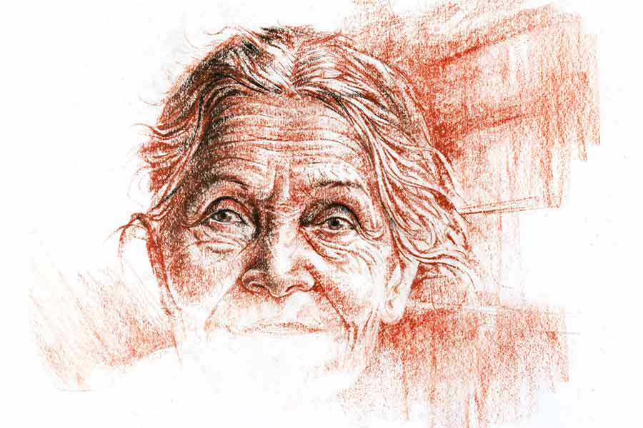

 
 <h1 align=center>লাল রক্ত নীল রক্ত</h1>
<h2 align=center>মোনালিসা চন্দ্র</h2> 

দুপুরের দু’-তিন ঘণ্টার রোদ সর্বশরীরে শুষে নেন সুমিত্রা। রোদটা চলে গেলেই মাঘের সন্ধে দ্রুত নেমে আসে যেন। দু’শো বছরের পুরনো বাড়িটা তখন কনকনে ঠান্ডা মৃত্যুপুরী। বাতে জর্জর শরীর নিয়ে সেই হিমপুরীর এক কোণে একলা নিথর পড়ে থাকেন সুমিত্রা।

একটা সময় তাঁর শ্বশুরবংশের বড় রবরবা ছিল। বেশ কয়েক পুরুষ ধরে অর্থকৌলীন্যের টিকা আঁকা ছিল বংশের কপালে। পেল্লায় এই বাড়িখানা বানিয়েছিলেন সুমিত্রার স্বামীর ঠাকুরদার ঠাকুরদা। সে কালের স্থপতিদের কেরামতি, চুন-সুরকির দম আর বংশপরম্পরায় চলে আসা যত্ন-আত্তির দৌলতে বাড়িটা মজবুত ছিল দীর্ঘদিন। এমনকি আজও এ বাড়ির একাংশ মোটামুটি বাসযোগ্য বলেই সুমিত্রার মাথার উপর ছাতটুকু রয়েছে, তবে বেশির ভাগ অংশই পড়ো-পড়ো। কুড়ি-পঁচিশ বছর আগেও এ বাড়ির রূপের ঝলক লোকের নজরে পড়ত। তার পর লক্ষ্মী যখন একেবারেই ছেড়ে গেলেন, তখন থেকে ভাঙন শুরু হল। আসলে বাড়িঘর একটু যত্ন চায়, সেই যত্নে টাকাপয়সাও লাগে, লক্ষ্মীছাড়া বাড়িতে কী করে হবে সে সব?

জমিজিরেতও সুমিত্রাদের কম ছিল না। কিন্তু জমার ঘর শূন্য হলে ক্রমাগত খরচে কুবেরের ভান্ডারও ফুরোয়। তিন দশকের লাগাতার ক্ষয়ে প্রায় সবই গেছে। বাড়ানো দূরস্থান, সম্পদ রক্ষে করার বিদ্যেটুকুও শিখতে পারেনি সুমিত্রার গর্ভকলঙ্ক শিবু। সুমিত্রার স্বামীও যে খুব করেকম্মে মানুষ ছিলেন, তা নয়। সম্পত্তি রক্ষা তিনিও করতে পারেননি। সম্পত্তি বিক্রিবাটা তিনিই শুরু করেছিলেন। তখনও যথেষ্ট ছিল বলে তেমন বোঝা যায়নি। কিন্তু ছেলেও যখন বাপের পন্থা ধরল, ক্ষয়রোগ আর লুকোনো গেল না। এখন তো এই বাড়িটুকু ছাড়া আর কিছুই নেই। এক বেলা ভাতে ভাত আর রাত্তিরে চাট্টি মুড়ি-চিনি-জলের শর্তে দিঘির তলানি ঘোলাজলটুকু টিপে টিপে খরচা করে জীবনধারণ চলে সপুত্র সুমিত্রার।

বাইরের চত্বরে পড়ে থাকা নড়বড়ে তক্তপোশটা সুমিত্রার রোদ পোহানোর আসন। বলতে লজ্জা, এ তক্তপোশ এক সময় নিচু জাতের লোকজনদের বসার কাজে লাগত। নিচু জাত অথচ সম্পন্ন দু’-চার ঘর লোক সব গাঁয়েই থাকে, পালা-পার্বণে তাদের ডাকতেও হয়, খানিক সমাদর করতেও হয়। ওদের জন্যই বাঁধা ছিল এ চৌকি। ফর্সা চাদর পেতে দৃষ্টিনন্দন করে তোলা হত তখন এ আসনকে। যদিও শাস্ত্রের বিধান, বৃহৎ কাষ্ঠে দোষ নেই, তবু ও চৌকি ছোঁওয়া বারণ ছিল বাড়ির বৌদের। নিচু দরের আসবাব বলেই চৌকিটা আজও রয়ে গেছে, দরের আসবাবপত্র সবই গেছে।

শীতঘুম ভেঙে জেগে ওঠা পোকামাকড়ের মতো হাত-পাগুলো নাড়াচাড়া করে নেন সুমিত্রা রোদ পোহানোর সময়ে। প্রাণের স্পন্দন ওই সময়েই যা জাগে তাঁর শরীরে। বাতব্যাধি জেঁকে বসে যে ভাবে বেসামাল করে তুলেছে শরীরটাকে, কিছুই আর করে উঠতে পারেন না সুমিত্রা। রোগের চিকিৎসা বলেও কিছু আর হয় না। সেই কবে শেষ বার ডাক্তার দেখিয়েছিলেন, কত বচ্ছর আগে, তার হিসাব নেই। ওষুধের সেই কাগজ দেখিয়েই, বর্ধমান গেলে আর পকেটে কিছু থাকলে দুটো-একটা ওষুধ কিনে আনে শিবু। সে ওষুধে মনরক্ষা হয় হয়তো, কাজ কিছু হয় না।

দুপুর-রোদের এই মৌতাত কিছু উপরিও দেয় সুমিত্রাকে। গোলা-গোয়াল, পুকুর-পুষ্করিণী ও দাস-দাসী ভরা অতীতের গমগমে সংসারের হারিয়ে যাওয়া কিছু ছবি কী করে যেন তখন দুলতে থাকে তাঁর চোখের সামনে। কোথা থেকে যে এসে জোটে ছবিগুলো! মাঝে মাঝে ধাঁধা লাগে সুমিত্রার। বুঝতে পারেন না কোন কালে আছেন, সে কালে নাকি এ কালে। আঙুল বাড়িয়ে ছুঁতে যান ছবিগুলো, আর অমনি বালির পুতুলের মতো ঝুরঝুর করে ঝরে যায়, ঝাপসা হয়ে মিলিয়ে যায় নজরের বাইরে। শীতের রোদের যাওয়ার তাড়া থাকে খুব। বেলা শেষ হওয়ার আগেই সে নিজের পুঁটুলি তুলে হাঁটা দিতে চায়। সে রওনা হলে ঘর-বার সব সমান হয়ে যায় সুমিত্রার। সারা দুপুর ধরে উল্টেপাল্টে রোদ খাইয়ে গরম করে নেওয়া সাত-পুরোনো শীতবস্ত্র দু’টি গায়ে চাপিয়ে নিজেকে টানতে টানতে চৌকি থেকে তুলে তিনি ঢোকেন হিমপুরীর ছোট একখানি কুঠুরিতে। সেখানে তাঁর বাকি সময়ের আশ্রয়, তেলচিটে এক বিছানা।

তবে আজ সুমিত্রার স্বপ্নেরা একটু ঘন ছিল। দেখতে না-দেখতেই চোখের সামনে থেকে হাপিস হয়ে যাচ্ছিল না। অতীতের সংসারের ছোট্ট একটি টুকরো, একটি গিনি, সেই মুহূর্তে গোঁজা ছিল সুমিত্রার ট্যাঁকে। স্বপ্নের ঘনত্বের কারণ হয়তো সেটিই। জাম-রঙা কাগজে মুড়ে একটু আগে জিনিসটা মায়ের জিম্মায় রেখে গেছে শিবু। এক খরিদ্দার মিলেছে বুঝি, তাই স্যাঁকরার ঘর থেকে পালিশ করিয়ে এনেছে। কাল হস্তান্তর হবে। সামনের ক’টা মাসের ভাত, কাপড়, সুমিত্রার সামান্য ওষুধ আর নিজের নেশার জোগানের বিষয়টা নিশ্চিত হওয়ায় খুশিয়াল শিবুর আর তর সইছিল না, সে ছুটেছিল তার চুল্লুর ঠেকে।

“জেঠিমা!”

হঠাৎ ডাকে চটকা ভাঙে সুমিত্রার। চেয়ে দেখেন, ছেলে কোলে সামনে দাঁড়িয়ে ডালিম। ঘোতন ঠাকুরপোর মেয়ে ডালিমকে দেখে নিজের অজানতেই মুখটা আলো হয়ে ওঠে সুমিত্রার। শুনেছিলেন বটে অনেক দিন পর বাপের বাড়ি এসেছে ডালিম। গাঁয়ের খবরাখবর তো তেমন আর কানে আসে না এখন। কে দেবে? সুমিত্রার খবর নিতেই কেউ আসে না! অর্থ যখন চলে যায়, তখন তার হাত ধরে চলে যায় আরও অনেক কিছু। লেখাপড়া না শিখলেও দুনিয়াদারির এ শিক্ষে হাড়ে হাড়ে হয়েছে সুমিত্রার। আইবুড়ো বেলায় গরিবের মেয়ে ছিলেন, তার উপরে বাপের ছিল আরও কয়েকটি মেয়ে, কে শেখাবে লেখাপড়া? চোখেমুখে দয়া করে শ্রী ঢেলে দিয়েছিলেন ভগবান, রংটিও দিয়েছিলেন সোনার পারা, তারই জেরে ঠাঁই জুটে গিয়েছিল বড় ঘরে। ক’টা বছর অভাবনীয় সুখভোগ কপালে লেখা ছিল, তাই সে ভোগ হয়েছে। পরে তাতে যখন ভাটার টান ধরল, কিছুমাত্র খেদ করেননি সুমিত্রা। অমন সুখভোগ যে কপালে জুটবে, তা-ই কি আশা করেছিলেন জীবনের শুরুতে? পাওয়া হারানো সবই ভাগ্যের খেলা, তাকে মেনে নিতে হয়, এটাই সার বুঝেছেন সুমিত্রা।

“এ কী চেহারা হয়েছে তোমার, জেঠিমা!” কাতর স্বর বেরিয়ে আসে ডালিমের গলা চিরে।

ছেলেবেলায় সুমিত্রার পায়ে পায়ে ঘুরত মেয়েটা। রক্তাল্পতায় এক বার মরতে বসেছিল, সুমিত্রাই তখন চিকিৎসা করিয়ে খাইয়ে-দাইয়ে সারিয়ে তুলেছিলেন তাকে। ঘোতন ঠাকুরপোদের তখন প্রবল অন্নকষ্ট। দুঃস্থ প্রতিবেশীর শিশুকন্যাটির ভার সুমিত্রা তাই তুলে নিয়েছিলেন নিজের হাতে। চাঁদপানা মুখের মেয়েটিকে ভবিষ্যতে নিজের ছেলের বৌ করবেন, এমনটাও ভাবতেন মনে মনে। তবে পাশা তো সব সময় উল্টে উল্টেই যায়। চঞ্চলা ঠাকরুনটি সুমিত্রার পুজোর আসন থেকে পাততাড়ি গুটিয়ে ঢুকলেন গিয়ে ঘোতন ঠাকুরপোদেরই বাড়ি। যাওয়ার সময় সুমিত্রার সুখ-সৌভাগ্যও বুঝি আঁচলে বেঁধে নিয়ে গেলেন। তার পর সেই সৌভাগ্য-খুঁট স্বহস্তে বেঁধে দিলেন ডালিমেরই মায়ের আঁচলে। দেখতে দেখতে আঙুল ফুলে কলাগাছ হল ঘোতন ঠাকুরপোর। কী করে যেন পঞ্চায়েতের মাথাও হয়ে গেল সে। আর কী আশ্চর্য, তার পর থেকে সুমিত্রাদের আর চিনতে পারে না ঠাকুরপো। পারে না তার বৌ-ও। তবে ডালিম পারে। বাপের বাড়ি এলে এক বার অন্তত সে দেখা করে যাবেই সুমিত্রার সঙ্গে। তবে ডালিমের বাপের বাড়ি আসাটাই কম। বর আসতে দেয় না তাকে খুব একটা।

সুমিত্রার অবস্থা দেখে তক্তপোশে বসে চোখ মোছে ডালিম।

“কে রেঁধে-বেড়ে দিচ্ছে জেঠিমা? কী করে চলছে সব?”

“কেন, শিবু আছে তো!”

“শিবুদা রান্না করে?”

শিবুদার কর্মতৎপরতা অজানা নয় ডালিমের। সে কথা স্মরণ করে কান্নায় গলা বুজে আসে তার, আর তখনই কেঁদে ওঠে কোলের খোকাটি।

সচকিত হন সুমিত্রা। তাঁর দিন গুজরানের ইতিবৃত্ত শুনতে চাওয়া একমাত্র শ্রোতাটিকে প্রকৃত বৃত্তান্ত শোনাতে ইচ্ছে করে না তাঁর। পরিবর্তে বলে ওঠেন, “ওরে দে, দাদুভাইকে এক বার কোলে দে, ভাল করে দেখি তাকে।”

অনেক চিকিৎসা করিয়ে বিয়ের বেশ ক’বছর পরে ডালিমের এই সন্তান লাভ। ছেলে না হওয়ায় শ্বশুরবাড়ি খুব যন্ত্রণা দিত ডালিমকে। অনেক দিন আগে সুমিত্রার কাছে চোখের জল ফেলতে ফেলতে এ কথা এক বার বলেছিল সে। তবে তার বর ধৈর্য ধরে নিজেদের চিকিৎসা চালিয়ে গেছে। বাপের বাড়ি কম আসার পিছনে সেই চিকিৎসারও একটা ভূমিকা ছিল। ডালিমের অশেষ কপাল, শেষ পর্যন্ত স্বামী ও শ্বশুরালয়ের হাতে পুত্রসন্তান তথা বংশের বাতি তুলে দিতে পেরেছে সে।

ডালিমের শ্বশুরবাড়িতে সেই বংশধর আনন্দ-উল্লাসের সঙ্গে সঙ্গে খানিকটা ঔদার্যের আলোও ছড়িয়েছে সম্ভবত। সপুত্র পিতৃগৃহে আসার অনুমতি পেয়েছে ডালিম। তার ব্যবসায়ী স্বামী শ্বশুরবাড়ি এসে ঘটা করে ভোজও দিয়েছে। গাঁ-ঘরের বেশির ভাগ লোকেরই নিমন্ত্রণ ছিল। সুমিত্রাদের অবশ্য ছিল না।

সংসারে হাঁড়ি না চড়ার দিনগুলোর সাক্ষী যারা থাকে, সৌভাগ্যের দিনে মানুষ সাধারণত এড়িয়ে চলতে চায় তাদের। সুমিত্রার বদান্যতায় পেটে কিল মেরে পড়ে থাকার পরিবর্তে বহু দিন পেটে দুটো অন্ন পড়েছে ঘোতনদের। এ সব স্মৃতি বড় কষ্টের স্মৃতি, মানুষ যা ভুলে যেতেই চায়। সে স্মৃতির সঙ্গে জড়িয়ে থাকা মানুষগুলোকেও তাই হয়তো লোকে জীবন থেকে ছেঁটে ফেলতে চায়। কৃতজ্ঞতার ভার বহনের চেয়ে ছেঁটে ফেলাটা অনেক সহজ কাজ। কৃতজ্ঞতার ভার বড় দুর্বহ। সে ভার বহনের শক্তি সবার থাকে না।

‘আমাদের সে দিন নেমন্তন্ন ছিল না’ কথাটা খেয়াল হতেই নিবে আসা এক আগুন সুমিত্রার রক্তে জেগে ওঠে অকস্মাৎ। সে আগুনের উৎস অধুনালুপ্ত আত্মগরিমা। হয়তো বা হারিয়ে যাওয়া অর্থকৌলীন্যের অহঙ্কারও। বাতে পঙ্গু জড়সড় দেহের কোন কোটরে এ আগুন এখনও লুকিয়ে ছিল, বুঝে উঠতে পারেন না সুমিত্রা। কিন্তু দেখতে পান অপস্রিয়মাণ রৌদ্রের কারণে যে শীতলতা নেমে আসছিল চার দিকে, তাকে ছাপিয়ে গেল সে আগুনের উত্তাপ। ক্রমশ সে উত্তাপ মস্তিষ্কে চারিয়ে গিয়ে ঘুলিয়ে দিল অতীত-বর্তমানের বোধ। ভবিষ্যৎ ভাবনাকেও বুঝি দাবিয়ে রাখল সবলে। ফলস্বরূপ, সুমিত্রার বাতে বেঁকে যাওয়া আঙুলগুলো কোমর হাতড়ে বার করে আনল জাম-রঙা কাগজের মোড়কখানা। কোলে শায়িত শিশুর বুকের উপর সেটি রেখে সুমিত্রা অতঃপর বলে উঠলেন, “নাও দাদুভাই, তোমার মুখদেখানি।”

আজ চার দিন সুমিত্রা দুপুরে বাইরে বেরোতে পারেননি। আর কোনও দিন পারবেন কি না ঈশ্বরই জানেন, তবে বেরোতে তিনি আর চান না। অন্দরমহলের এই হিম-হিম শয্যা থেকেই মিলিয়ে যেতে চান পঞ্চভূতে। দিনরাত সেই কামনাই করে চলেছেন। রোদ বিনেই গা এখন গরম তাঁর, খুবই গরম। ক্ষিপ্ত শিবুর উন্মত্ত প্রহারে সর্বাঙ্গে ক্ষতচিহ্ন আর তীব্র বেদনা, তারই তাড়সে ধুম জ্বর নিয়ে পড়ে আছেন সুমিত্রা গত চার দিন।

না, ছেলের উপর কোনও ক্রোধ বা অভিমান নেই সুমিত্রার। নেই সাধ্যাতীত উপহারদান জনিত অপরাধবোধও। তার বদলে আছে গভীর মায়া। উপার্জনহীন ছেলেকে সম্বলহীনতার দম-বন্ধ-করা গর্তে ফেলে দিয়ে যে দুঃখ তাকে দিয়েছেন, তার কারণে ছেলের প্রতি মায়া।

ও দিকে নিতাইয়ের ঠেকে বসে গলা ভেজাতে ভেজাতে শিবু তখন ভাবছে, বস্তুত, গত চার দিন ধরেই ভেবেছে, ‘ডালিমের বর লোক মোটেই খারাপ নয়। গিনিটা সে ফেরত দিলে না ঠিকই, কিন্তু গিনির দাম বাবদ যা দাবি কল্লুম, তার কিছুটা তো দিলে। চাইলে একটা পয়সাও তো না ঠেকাতেই পাত্তো! ঘোতনকাকা হলে কখন দুটো মুনিশ দিয়ে বাড়ি থেকে দূর করে দিত। জামাইটা সেখানে কতা তো কইলে, হাত উপুড়ও কল্লে। হাত উপুড় না করা অব্দি পা যদিও আমি ছাত্তুম না। তবু, তার পরেও, কিছু না ঠেকালে সত্যিই কি আমার কিছু করার ছেল? কেঁদে রাজ্যলাভ সব জায়গায় হয় না, আত্মহত্যার চমকানিতেও সকলে ভেজে না। তাইলে? আর কোন অস্তরটা ছেল, আমার হাতে, অ্যাঁ? আহা, এমন ভালমানুষটাকে বাঁচিয়ে রেখো ভগবান, বাঁচিয়ে রেখো।

