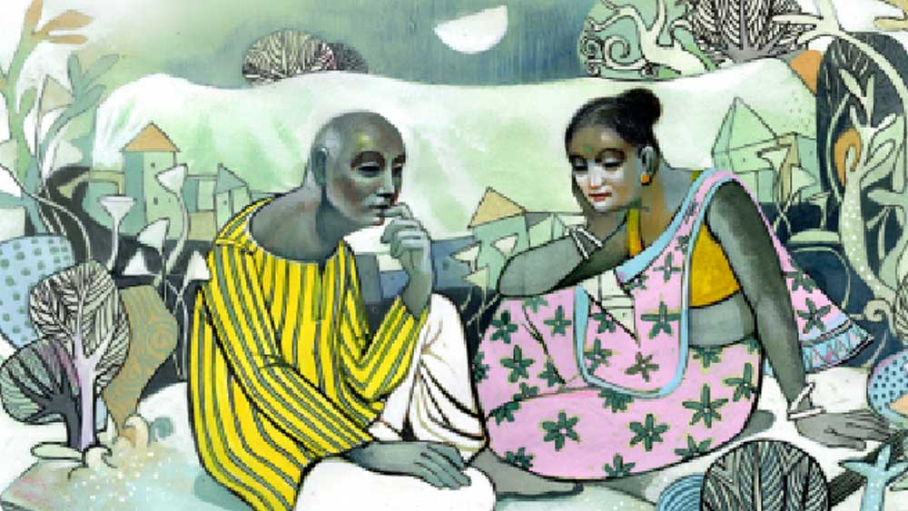

 

<h1 align=center>লিস্ট</h1>
<h2 align=center>দেবাশিস গঙ্গোপাধ্যায়</h2>
রমেন চৌধুরী বারান্দায় বসে আছেন। বয়স আশি ছুঁই ছুঁই। রাগী, খিটখিটে। চেয়ারে বসে বাগানের দিকে ভুরু কুঁচকে তাকিয়ে তিনি অপেক্ষা করছেন স্ত্রী সুরমার জন্য। দু’জন একটা লিস্ট করছেন।   রমেন সারা জীবনে যে ভাবেই হোক, প্রচুর টাকা করেছেন। যৌবনে এক বার আমেরিকা না ইউরোপে গেছিলেন। সেখান থেকে হাতি-ঘোড়া কী এনেছিলেন কে জানে, মোট কথা তাঁকে আর চাকরি-বাকরি করতে হয়নি। টাকাপয়সা থাকলে যা হয়। দাপট বাড়ে। এক সময় সে দাপট ছিল তাঁর। লোকজন সমীহ করত। এখনও তাঁর চলার মতো সম্পত্তি আছে। তাঁকে কারও কাছে হাত পাততে হয় না। তবে তাঁর দুই ছেলে তেমন দাঁড়াতে পারেনি। সারা দিন ঘরের মধ্যেই থাকে আর বৌদের সঙ্গে ফিসফিস করে। ওরা কি তাঁর মরার কথা আলোচনা করে? তাতে অবশ্য তাঁর বিন্দুমাত্র আপত্তি নেই। তিনি মরবেন। দুনিয়ার সব লোকই কখনও না কখনও মারা যাবে। তা নিয়ে আলোচনা ভাল লক্ষণ। যারা বোকা আর সেন্টিমেন্টাল, তারা এ সব কথায় ভয় পায়। তিনি ভয় কাকে বলে জানেন না।   বরং আজকাল রমেনের অন্য একটা আগ্রহ হয়েছে। তিনি মারা যাবেন। আজ নয় তো কাল। তাঁর জানার ইচ্ছে তাঁর মৃত্যুতে শ্মশানে ক’জন লোক হবে? এটা যদি তিনি দেখতে পেতেন, বেশ হত। মৃত্যুর পর ফিরে আসার গল্প বা সিনেমা আছে, তা তিনি জানেন। কিন্তু তেমন ঘটনা বাস্তবে সম্ভব নয়। ওভাবে ফিরে এসে দেখার ইচ্ছেও তাঁর নেই। তিনি বেঁচে থাকতেই বুঝে নিতে চান, তিনি মরে গেলে ক’জন লোক শ্মশানে যাবে। তিনি নিশ্চিত, তাঁর মৃত্যুর পর অনেকজনই আসবে। তারা ক’জন, তা তিনি হিসেব করতে চান। সেকারণেই তিনি ও সুরমা একটা লিস্ট করছেন। সুরমা প্রথমে নারাজ ছিলেন। একটু কান্নাকাটিও করেছিলেন। তার পর বিষয়টা বোঝার পর তিনিও নেশায় পড়েছেন। তা ছাড়া তাঁরও একটা ইচ্ছে হয়েছে।  তিনিও এরকম একটা লিস্ট করবেন।   রমেন পাত্তা দেননি। বলেছেন, “আমি তোমার চেয়ে দশ বছরের বড়। হিসেব করলে আরও এক বছর। বাবা বয়স কমিয়েছিলেন। সুতরাং আমার অনেক পরে তুমি যাবে।”   সুরমা বলেছেন, “এ রকম নাও হতে পারে।”   রমেন একটু অবজ্ঞার স্বরে বলেছেন, “সে ঠিক আছে। তোমার আবার কী লিস্ট? তোমাকে কে চেনে? ওই তোমার ছেলেরা। একটা-দুটো ওদের বন্ধু।”   সুরমা শান্ত। রমেনের দাপটে তিনি কথা বলতে পারেন না। নিরুপায় হয়ে মেনে নেন। এবং প্রতিদিন সকাল সন্ধে দু’জন মিলে ঠিক করেন। কারা আসবে বা না আসবে।   কিন্তু লিস্ট করা সমস্যার। কম্পালসারি ডিউটির মতো দুই ছেলে, দু’-চার জন রিলেটিভ নিয়ে সমস্যা নেই। তারা থাকবে। কিন্তু বন্ধুদের মধ্যে হিসেব করার সময়ে গোলমাল হয়ে যাচ্ছে। আজ মনে হচ্ছে ও আসবে, পরের দিন মনে হচ্ছে আসবে না। সুতরাং লিস্ট কোনও দিন মনঃপূত হচ্ছে না।   আজ এখনও লিস্ট করা শুরু হয়নি সুরমা আসেনি বলে। রমেন ধৈর্য রাখতে পারলেন না। তিনি সজোরে একটা হাঁক দিয়ে ডাকলেন, “গেলে কোথায়? আসতে পারছ না? তুমি আবার রান্নাঘরে ঢুকেছ? অ্যাঁ।”   সুরমা কিছুক্ষণ পরে এসে বললেন, “এই তো এসে গেছি। চলো। তা হলে শুরু করি।”   রমেন  বললেন, “হুম। লিস্ট বার করো। আগে এক বার বলো দেখি কাল শেষ কার নাম বলেছি।”   একটা ছোট খাতায় সুরমা লিস্ট করছেন। খাতাটা বার করে তিনি লিস্ট দেখে বললেন, “হেমন্ত।”   রমেন ভুরু কুঁচকে বললেন, “ছ্যা ছ্যা! হেমন্তর নাম আমি বলেছি? ও আসবে? নিজের ঠাকুমা মারা যাবার দিন ও সিনেমা দেখতে গেছিল। বাদ দাও। বাদ দাও।”   রমেন যাদের নাম বলেন সুরমা সবাইকে চেনেন না। তিনি বললেন, “তা হলে কি কেটে দেব?”   “হ্যাঁ। কেটে দাও। আচ্ছা। সৌরভকে তুমি চেনো? কী মনে হয়? শ্মশান পর্যন্ত যাবে?”   সৌরভকে চেনেন তিনি। পাড়ার ছেলে। তবে ও যাবে কি না, সে ধারণা তাঁর নেই। পাছে রমেন রেগে যান, তাই বললেন, “যাবে না কেন? সে তোমাকে ‘জেঠা জেঠা’ বলে।”   রমেন মাথা নেড়ে বললেন, “উঁহু। যাবে না। ওই যে অশোক মারা গেল যখন, দেখলাম সৌরভ এল। একটু দাঁড়াল। তার পর টুক করে কেটে পড়ল। দেখে নিয়ো আসবে না।”   সুরমা বললেন, “অশোক ঠাকুরপোর যাওয়ার সময় কিন্তু বেশ লোক হয়েছিল।”   রমেন বিরক্তির স্বরে বললেন, “যাও যাও! কত আর লোক? পঞ্চাশ? একশো? আমার দ্বিগুণ আসবে। দেখে নিয়ো!”   সুরমা কথা বাড়ালেন না। তিনি  বললেন, “সৌরভের নামটা রাখব?”   “রাখো। তা হলে কত জন হল?”   “বিয়াল্লিশ।”   রমেন বিরক্ত হয়ে বললেন, “কী যে বলো! বিয়াল্লিশ! আমি এক সপ্তাহ ধরে মোটে এই ক’টা নাম বললাম? প্রায় একশো জনের কথা বলেছি। তুমি লিখতে ভুল করেছ।”   সুরমা ভয়ে ভয়ে চুপ করে রইলেন। রমেন আরও কিছু ক্ষণ গজগজ করলেন। দু’-চারটে কথা শোনালেন। তিনি বিরক্তির স্বরে বললেন, “আবার আমাকে প্রথম থেকে বলতে হবে। ধুত!”   সুরমা সাড়াশব্দ দেন না। তিনি এক বার ভেবেছিলেন মিথ্যে কথা বলবেন। বাড়িয়ে বললে রমেন অবিশ্বাস করবেন না। কিন্তু সে সাহস তাঁর নেই।   একটু পরে রমেন আবার নাম বলতে শুরু করেন। তিনি বলেন, “বড় বেয়াই এর নাম লিখব?”   বড় বেয়াই থাকেন কৃষ্ণনগরে। ভীষণ রসিক মানুষ। তবে অত দূর আসবেন কি না বলা যায় না। তবু সুরমা গলায় সম্মতি ফুটিয়ে বললেন, “হ্যাঁ। আসবে।”   রমেন ত্যারছা চোখে তাকালেন। বেয়াইয়ের কথা বলেই কি সুরমা খুশিতে ঝলমল। তিনি তেতো গলায় বললেন, “তা তো বলবেই। তিনি তো আমার জন্য আসবেন না, লাইন ক্লিয়ার হল বলে আসবেন।”   সুরমা মৃদু গলায় প্রতিবাদ করলেন। কী যে বলেন রমেন তার ঠিক নেই।   রমেন বলেন, “ভুল কী বললাম? আমার সঙ্গে একটা কথাও নয় আর তোমাকে পেলে একদম গলে পাঁক। বুঝি না কিছু!”   সুরমা উঠে পড়ার তাল খোঁজেন। রমেন শ্বাস ফেলে বলেন, “ঠিক আছে। তা হলে নামটা রাখো।”   এমনই চলছে রোজ। আজ, কাল, পরশু। সকালের লিস্ট বিকেলে বদলে যায়। বিকেলের লিস্ট পরের দিন বদলে যায়। লিস্টের মানে কী, তা তারা নিজেরাও জানেন না। কিন্তু না করলেও কেমন ফাঁকা ফাঁকা লাগে।   ক’দিন পর আবার দু’জনের লিস্ট নিয়ে আলোচনা শুরু হল। এত দিনে সুরমার হিসেব অনুযায়ী শ্মশানযাত্রী হবে পঞ্চান্ন জন। ব্যস! অমনি লেগে গেল! রমেনের হিসেব অনুযায়ী তিনি প্রায় দেড়শো জনের নাম বলেছেন। সুরমা ভুল লিখেছে। অথবা ইচ্ছে করে সে নাম বাদ দিয়েছে। সুরমা  বললেন, “এ কী কথা বলছ? আমি ইচ্ছে করে বাদ দিচ্ছি?”   “হ্যাঁ। ইচ্ছে করে!”   “কেন?”   “তুমি হিংসুটে বলে! এত ভিড় হবে শুনে তোমার সহ্য হচ্ছে না! আমি তোমাকে হাড়ে-হাড়ে চিনি। তুমি সামনে একদম রসগোল্লার রস, পেছনে চিরতার জল। শুধু তুমি নও, তোমার বাপের বাড়ির লোকগুলোও একই ধারা।”   সুরমা চুপ করে শুনছিলেন। তিনি ভেতরে ভেতরে ক্ষুব্ধ। তিনি বিড়বিড় করে কী যেন বললেন।   রমেন বললেন, “কী বললে?”   “কিছু না।”   “শুনেছি। তুমি তোমার বোনের কথা বললে। কী রকম হিংসে দেখো তোমার! টুলু একটু আমাকে ‘জামাইবাবু-জামাইবাবু’ করে তাতে তোমার কেমন জ্বালা। আমি মরে গেলে টুলু আসবেই। লেখো লেখো। ওর নাম লেখো।”   সুরমা ঘাড় গোঁজ করে রইলেন। টুলু ওই দিন এলে খুব বিপদ। ওর কান্নার একটা অস্বাভাবিক ক্ষমতা আছে। এমন কাঁদবে যে, সে দিন পুরো ফোকাস টুলুই নিয়ে নেবে। সুরমাকে সাইড রোল করতে হবে।   সুরমা তাই লিখলেন না। এই প্রথম রমেনের বিরোধিতা করলেন। তিনি খাতা রেখে দিয়ে বললেন, “আমি আর লিখব না।”   তবে গোলমাল এক বেলার জন্য। বিকেলেই আবার দু’জনের মিলমিশ হয়ে গেল। তারা লিস্ট করতে শুরু করলেন।   রমেন বললেন, “এক কাজ করো। টুলুকে একটু পরে খবর দিয়ো। আসতে আসতে দেরি হয়ে যাবে। তোমাদের কাঁদবার সুযোগ দেবে।”   সুরমা মাথা নাড়ালেন।      কিন্তু গত দু’-তিন মাসে রমেনের সব হিসেব গোলমাল হয়ে গেছে। লিস্টের কথা মাথা থেকে উড়ে গেছে।   পৃথিবী মুখ ঢেকেছে। সুতরাং তাদেরও আজকাল তাই করতে হচ্ছে। মুখে মাস্ক, হাতে গ্লাভস। ছোট টেবিলে স্যানিটাইজ়ার। বার বার হাত ধোয়ার ব্যবস্থা। রমেনের মৃত্যু নিয়ে ভয়-ভাবনা নেই। একটু আপত্তি করেছিলেন। ধোপে টেকেনি। কিন্তু সারা দিন তিনি গজগজ করছেন করোনাভাইরাসের নামে। বাইরে বেরোলেই সারা ক্ষণ মুখে মাস্ক আর হাত ধোয়া! কোনও মানে হয় এমন রোগের? তিনি মনঃক্ষুণ্ণ হয়েছেন। টুকটাক কাগজ পড়ছেন। প্রধানমন্ত্রী, মুখ্যমন্ত্রীর মাস্ক পরা ছবি দেখছেন। টিভি দেখার অভ্যেস তাঁর নেই। লকডাউনে এক-দু’জন বিখ্যাত খেলোয়াড়, অভিনেতা, লেখকের  মৃত্যূর কথাও পড়েছেন। তাঁদের শ্মশানযাত্রী মাত্র গুটি কয়েক! খুব মন খারাপ হয়ে যায় তাঁর।   কাগজ পড়তে পড়তে তিনি আনমনা হয়ে যান। সুরমাকে ডাকেন। তিনি এসে একটু দূরেই বসেন।   রমেন মৃদু হেসে বললেন, “দূরে থাকাই ভাল, বলো?”   সুরমা কিছু বললেন না।   রমেন বললেন, “কী এক রোগ বলো দেখি! পৃথিবী কাঁপাচ্ছে! হ্যাঁ গো, ছেলে-বৌ-নাতিনাতনিরা সব নিয়ম মানছে তো?”   “সব কি আর মানছে? যতটা পারে আর কি।”   “দেখো, এখন আবার যেন বাইরে বেশি না যায়। কোথা থেকে কী ধরে ফেলবে বলা মুশকিল!”   সুরমা বললেন, “টিভিতে নানারকম কথা শুনলেই বুক কাঁপছে।”   রমেন নিঃশ্বাস ফেললেন। চট করে টেবিল থেকে কাগজ তুলে নিয়ে বললেন, “এটা দেখো। কোভিড রোগীর হাল। মারা যাবার পর তার পাশে কেউ থাকছে না। তাকে একা একাই চলে যেতে হচ্ছে।”   সুরমা কাগজ সরিয়ে দিয়ে বললেন, “জানি। একটু আগে টিভিতে দেখাচ্ছিল।”   রমেনের বুকের কাছটা কেমন যেন ধড়াস ধড়াস করে। মৃত্যু নিয়ে তাঁর চিন্তা নেই। কিন্তু এ আবার কেমন মৃত্যু! ক’দিন ধরে ভয়ে জোরে কাশতে পারছেন না। কেউ যদি কোথাও খবর দিয়ে দেয়। খুব চুপিসাড়ে কাশছেন। এখন আর কাউকে তাঁর বিশ্বাস হচ্ছে না। বাড়ির লোকই হয়তো লোক ডেকে আনল। হয়তো তাঁকে ধরে নিয়ে গেল! তাঁর করোনা পজ়িটিভ পাওয়া গেল। কী যেন বলে, তাঁকে কোয়রান্টিনে রাখল অথবা হসপিটালে ভর্তি করল! তাঁর বুকের কাছটা ভয়ে অসাড় হয়ে গেল। সেখান থেকে কি ফেরার সম্ভাবনা আছে? তিনি যদি সেখানেই মারা যান! কেউ জানবে না কোথায় তিনি গেলেন! তার আশপাশে কেউ ঘেঁষবে না। কোথায় কোন শ্মশানে তিনি দাহ হবেন, কে জানে!  তিনি বিড়বিড় করে বললেন, “এমন রোগ যদি আমার হয় সুরমা? কী হবে?”   সুরমা চমকে উঠে বললেন, “এসব কথা বলছ কেন?”   রমেন বললেন, “আমি জানি কী হবে! এই রোগ হলে একদম একা হয়ে যেতে হবে শেষ সময়ে...”   সুরমা দেখলেন। ডাকাবুকো লোকটা গুটিয়ে ছোট হয়ে গেছেন। দাপটের চিহ্নমাত্র নেই। তিনি  মৃদুস্বরে বললেন, “অত ভয় পেয়ো না।”   রমেন হাসলেন, তার পর বললেন, “তুমি ভুল করছ সুরমা। আমি ভয় পাইনি। মরার ভয় কি আমি পাই? পাই না।”   “তা হলে?”   “তা বলে এমন মৃত্যু! লোকজন নেই! একটু শোক নেই! না না। আমি ও-মৃত্যু চাই না। আমি চাই আমার মৃত্যু হোক সহজ। স্বাভাবিক। তুমি কাঁদবে। ছেলেরা কাঁদবে। প্রণাম করবে। দশটা লোক থাকবে। চাইলে কেউ ফুল দেবে। তার বদলে যদি এমন মৃত্যু হয় সুরমা? লিস্টের একশোটা লোক বাদ দাও। তুমিও থাকবে না।  আমাকে শেষবার ভয়ে দেখতেও চাইবে না। আমার গায়ে হাত-পায়ে ছেলেমেয়েরা কেউ শেষ বারের মতো হাত বোলাবে না। কী ভাবে কোথায় দাহ হল কেউ টের পাবে না। উফ! এ কী করুণ অসহায় মৃত্যু!   সুরমার চোখে জল। রমেন ঠিক বলেছেন। কী ভয়ানক নিষ্ঠুর মৃত্যু! শোক করার সাহসও কেড়ে নিয়েছে। প্রিয়জন তাঁকে ছেড়ে পালাচ্ছে। ভেবে বড় কষ্ট হচ্ছে তাঁর।   রমেন ধরা গলায় বললেন, “সহজ, স্বাভাবিক মৃত্যুর দিন কি আর ফিরে পাব না সুরমা? নাকি অসম্মানে অমর্যাদায় চলে যাব?”   সুরমা আঁতকে ওঠেন। ওই বিভীষিকার মতো মরতে তিনি চান না। ও কথা ভুলেও ভাবতে চান না। কিন্তু এর বাইরে ভাবতেও পারছেন না। তিনি বিড়বিড় করে কী বললেন বোঝা গেল না।   রমেন উদাসস্বরে বললেন, “লিস্টটা ফেলে দিয়ো সুরমা। বেঁচে থাকলে না হয় আবার করব!”         