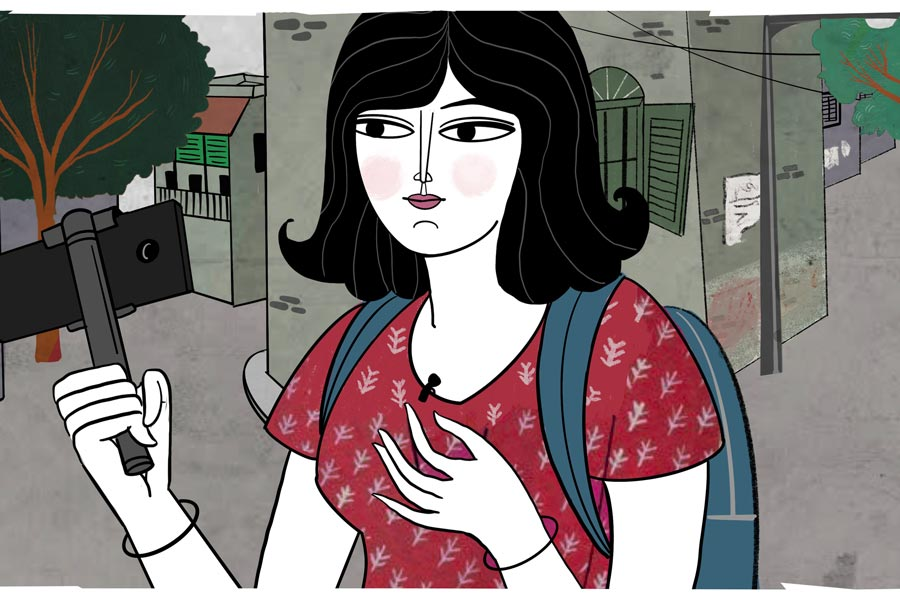

 
 <h1 align=center>শববাহকেরা</h1>
<h2 align=center>ইন্দ্রনীল সান্যাল</h2> এই কাহিনি খুব অতীতের নয়। আবার সমকালেরও নয়। ভবিষ্যতের দিকে কিছুটা হলেও এগোবে। কিস্‌সার নির্দিষ্ট কোনও ঘটনাস্থল নেই। সময়হারা ও দিশাহীন গল্পটিকে ফেলা হচ্ছে পৃথিবীর এমন এক শহরে, যেটি তত প্রাচীন নয়, কিন্তু এর মধ্যেই বুড়িয়ে গেছে। শহরের পাশ দিয়ে একটি নদী বয়ে গেছে। সেই নদীর দিকে তাকালে অলৌকিক সূর্যাস্ত দেখা যায়।

কাহিনির প্রধান চরিত্র ‘ম্যাজিকুইন’-এর বয়স সাতাশ। লো ওয়েস্ট জিনস, টিশার্ট আর স্নিকার্স পরে, পিঠে ঝোলা আর হাতে সেলফি স্টিক নিয়ে, ল্যাপেল মাইকে কথা বলতে বলতে সে হাঁটছে।

মেয়েটির আসল নাম ম্যাজিকুইন নয়। ওর আসল নাম, ধরা যাক, জোনাকি। তা হলে ম্যাজিকুইন কী? ডাকনাম না ছদ্মনাম?

উত্তর পেতে গেলে ‘থ্রি’ অ্যাপ্লিকেশনটির কথা জানতে হবে। এটি বিশ্বের এক নম্বর সোশ্যাল নেটওয়ার্কিং মিডিয়া, যাতে শুধুমাত্র তিন মিনিটের ভিডিয়ো আপলোড করা যায়। এর গ্রাহকসংখ্যা নাকি পৃথিবীর জনসংখ্যার থেকেও বেশি। হাতে একটি স্মার্টফোন থাকলে এবং তার মধ্যে আনলিমিটেড ডেটা থাকলেই, ‘অল দি ওয়ার্ল্ড ইজ় আ স্টেজ।’ থ্রি-তে নিজের প্রোফাইল খোলো আর তিন মিনিটের ভিডিয়ো স্টোরি বানিয়ে আপলোড করে দাও। গোটা দুনিয়া তোমাকে দেখবে।

তবে, সারসত্যটি হল, গোটা দুনিয়া দেখতে নয়, দেখাতে উদগ্রীব। কেউ ভিউয়ার নয়, সবাই পারফর্মার। সবাই নিজের তিন মিনিটের ভিডিয়ো বেচতে এসেছে, কিনতে কেউ আসেনি। কাজেই শুরু হয়েছে প্রতিযোগিতা, কে কত বিচিত্র স্টোরি বানাতে পারে।

ম্যাজিকুইন হল থ্রি-তে জোনাকির প্রোফাইল নেম। সে বিচিত্র সব পেশার মানুষদের সাক্ষাৎকারের ভিডিয়ো রেকর্ড করে। সেই ফুটেজ এডিট করে তিন মিনিটের স্টোরি তৈরি করে। ম্যাজিকুইনের ফ্যানের সংখ্যা দেড় লক্ষ। ম্যাজিকুইন তাদের অনুরোধ করে লাইক, শেয়ার আর কমেন্ট করতে। ফ্যানবেস বড় বলে বিভিন্ন কোম্পানি তার প্রোফাইলে বিজ্ঞাপন দেয়। সেটাই ম্যাজিকুইনের রোজগার। তার মাসিক আয় অনেক বিত্তশালীকে লজ্জায় ফেলবে।

উপার্জন বাড়াতে গেলে ফ্যানবেস বাড়াতে হয়। তার জন্যে ম্যাজিকুইন নিজের হাত, পা, বুক, পেট, মগজ আর মনন বেচেছে। ফ্যানবেস পোষার জন্য এবং নতুন ফ্যান টানার জন্য হাসি-কান্না, মুড সুইং, রাগ-অভিমান, ফেক ইমোশন— সব কিছুর বুফে নিজের প্রোফাইলে সাজিয়েছে।

ম্যাজিকুইনের বাড়ি শহরের দক্ষিণে হলেও সে এসেছে উত্তরের এক প্রাচীন রাস্তায়। হরিণীর ছন্দে হাঁটছে আর সেলফি স্টিকে ধরা মোবাইলের দিকে তাকিয়ে কথা বলছে। আসলে পরের স্টোরি আসার আগে ফ্যানদের জন্যে তিন মিনিটের টিজ়ার ছাড়ছে। হাঁটার সময় তার মুখে পড়ছে শরৎ-বিকেলের রোদ। মোবাইল ক্যামেরায় দেখা যাচ্ছে কাছিমের পিঠের মত ডুমো ডুমো কব্‌লস্টোনের রাস্তা, বৃদ্ধ দম্পতির মতো একে অপরের গায়ে হেলে পড়া পুরনো বাড়ি, সাপের খোলসের মতো বিছিয়ে থাকা বাতিল ট্রামলাইন, আগুনে পুড়ে যাওয়া নাট্যশালা। এই সব দৃশ্য হারিয়ে যাওয়া, ফুরিয়ে যাওয়া সময়ের কথা বলে, যা খুব ফোটোজেনিক। স্মৃতিবেদনার চাটনি ম্যাজিকুইনের ফ্যানেদের পছন্দ। 

মূল সড়ক থেকে শাখা রাস্তায় ঢুকে লাইভ স্ট্রিমিং বন্ধ করে মোবাইল হাতের মুঠোয় নিল ম্যাজিকুইন। এখানে রাস্তা সরু, পাঁচিলের গায়ে গত শতকের ঝুল লেগে রয়েছে। প্রত্নশহরের পাঁচিলের রং চটে জেগে উঠছে ধূসর।

এক রকম দেখতে অনেকগুলো মৃতপ্রায় বাড়ির মধ্যে নির্দিষ্ট একটি বাড়ির সামনে দাঁড়ায় ম্যাজিকুইন। পাঁজর বার-করা বাড়ির সদর দরজার মাথায় লটকানো টিনের সাইনবোর্ডে সাদাটে হরফে লেখা, ‘মেট্রো টাইপ রাইটার। পরীক্ষা প্রার্থনীয়।’

দোকান খোলা থাকলেও ভিতরটা অন্ধকার। ছায়াময় দোকানের ভিতরে একটি কাঠের কাউন্টার দেখা যাচ্ছে। 

কাউন্টারের অন্য প্রান্তে কে আছে, জানার জন্যে ভিতরে ঢুকল ম্যাজিকুইন।

*****

শরতের বিকেলে দোকানে বসে চল্লিশোর্ধ শাশ্বত একটি বিকল টাইপরাইটারের গায়ে হাত বোলাচ্ছে। বড় মায়া, বড় ভালবাসা যন্ত্রটির প্রতি।

শাশ্বতর বাবা এই শহরের একটি টাইপ মেশিন প্রস্তুতকারী সংস্থায় চাকরি করতেন। দু’দশক আগে কর্মরত অবস্থায় মারা যান। শাশ্বত তখন কারিগরি শিক্ষায় বৃত্তিমূলক প্রশিক্ষণ নিচ্ছিল। কোম্পানিটি বাবার মৃত্যুর ক্ষতিপূরণ হিসেবে শাশ্বতকে শিক্ষানবিশ কারিগর হিসেবে চাকরির প্রস্তাব দেয়। বিধবা মায়ের একমাত্র সন্তান শাশ্বত কাজটা লুফে নেয়। পরের দু’টি বছর জুড়ে কোম্পানির কারিগর হিসেবে গোটা দেশের যেখানে টাইপ মেশিন গড়বড় করত, সেখানেই শাশ্বত পৌঁছে যেত। ছেলের বাউন্ডুলেপনা দেখে মা রাগারাগি করতেন। এক সপ্তাহ দক্ষিণ দেশে থেকে দু’দিনের জন্যে বাড়ি ফিরেই ছেলে বলত, “কাল বেরিয়ে যাচ্ছি নর্থ ইস্ট। পনেরো দিন পরে ফিরব।”

মা বলতেন, “এলি কেন? দূর হয়ে যা!” পাশাপাশি থালা ভরে খাবার সাজিয়ে দিতেন। বলতেন, “কোথায় যাস, কী করিস, কী খাস— কিছুই জানতে পারি না। এ বার বিয়ে করে থিতু হ। একা একা বাড়িতে আর ভাল লাগে না।”

বিবাহ প্রস্তাব শুনে আঁতকে উঠে শাশ্বত বলে, “আমি নেশা করি না। বেপাড়াতেও যাই না। আমার গার্লফ্রেন্ডের নাম টাইপরাইটার। এর সঙ্গে আগামী পাঁচ বছর ঘর করব। তার পর বিয়ের কথা ভাবব।” 

ছেলের কথা শুনে মায়ের মন শান্ত হয়েছিল। বিয়ের জন্য আর চাপ দেননি। চুটিয়ে কাজ করছিল শাশ্বত।

সুসময় বেশি দিন থাকে না। এক বছরের মধ্যেই অশান্তির মেঘ ঘনিয়ে এল কর্মক্ষেত্রে। নতুন প্রযুক্তি এল, যার নাম ইলেকট্রনিক টাইপরাইটার।   

বন্ধ হয়ে গেল শাশ্বতর টাইপরাইটার কোম্পানি। কয়েক মাস দেরি করে মাইনে হচ্ছিল। হঠাৎ দু’মাসের মাইনে বাকি পড়ল। এক দিন সবাই অফিসে গিয়ে দেখল গেটে তালা মারা। ম্যানেজাররা গায়েব, গায়েব প্রভিডেন্ট ফান্ডের টাকাও। জানা গেল, নতুন প্রযুক্তি আসার কারণে কোম্পানি উঠে গেছে।

এ সব কয়েক দশক আগের কথা। শাশ্বতর মা মারা গেছেন। সে এখন একা। পরাজিত মানুষটি মৃত প্রযুক্তিকে ভালবেসে বেঁচে আছে। এক চিলতে দোকান আর তার বাসিন্দারাই শাশ্বতর বন্ধু। বিকল টাইপ মেশিনের সঙ্গে গল্প করে দিন কাটে শাশ্বতর। দোকানে ঢোকা মাত্র মেশিনগুলো নড়াচড়া শুরু করে। ঝাড়পোঁছ করলে খুশিতে ঝলমলায়, কথা বলে। শব্দহীন ভাষা শুনে বাতিল মেশিনের সমস্যা বোঝার চেষ্টা করে শাশ্বত।

আজও তা-ই করছিল। এমন সময় শরতের আলো আর দমকা বাতাস সঙ্গে নিয়ে দোকানে ঢুকল চোখ ধাঁধানো এক সুন্দরী। বলল, “আপনি শাশ্বত? আমি জোনাকি। আপনার সঙ্গে দরকার আছে।” 

*****

“বলুন,” জোনাকির দিকে মুখ তুলে তাকাল শাশ্বত।

ঝোলা থেকে টাইপরাইটার বের করে জোনাকি বলল, “সবাই বলে আপনি টাইপ মেশিনের জাদুকর। তাই এটা সারাতে আপনার কাছে এলাম।”

জোনাকিকে ঢুকতে দেখেই বিষণ্ণতা কেটে যাচ্ছিল শাশ্বতর। ঝুলকালি মাখা মেশিন দেখে মুখে আলো ফুটে উঠল। পরম মমতায় যন্ত্রে আঙুল বুলিয়ে বলল, “রাবার প্ল্যাটেন, রোলার নব বা পেপার গাইডে সমস্যা নেই। আসল সমস্যা রোলারে!”

“এর মধ্যে বুঝে গেলেন?” জোনাকি অবাক।

“এটাই আমার পেশা ম্যাডাম,” যত্ন আর আদর মিশিয়ে মেশিন খুলছে শাশ্বত। তুলি আর লিনেন দিয়ে পরিষ্কার করছে ভাঁজে ভাঁজে জমা ময়লা। ফিসফিস করে কথা বলছে।

সন্তর্পণে মোবাইলের ভিডিয়ো ক্যামেরা চালু করে জোনাকি। সাবজেক্ট যেন বুঝতে না পারে যে গোপনে ভিডিয়ো রেকর্ড করা হচ্ছে।  

“কী বলছেন জানতে পারি?” জিজ্ঞাসা করল জোনাকি।

“কথা!” সংক্ষিপ্ত উত্তর শাশ্বতর।

“টাইপরাইটারের সঙ্গে কথা বলছেন?” 

“আপনিও তো মোবাইলের সঙ্গে কথা বলেন।”

“আহা! এটা তো কথা বলার জন্যই তৈরি হয়েছে।”

“এখন তো কথা বলছেন না। ওটা তা হলে আমাকে দিন!”

“আপনি এর গুরুত্ব বোঝেন?” রেগে গেছে জোনাকি, “এর মাধ্যমে আমি রোজগার করি!”

“আমিও তাই করি।”

ক্রোধ ও উত্তেজনায় ব্রেক কষে জোনাকি বলল, “দুঃখিত।”

শাশ্বত বলল, “টাইপ মেশিনের সঙ্গে আমি ঘণ্টার পর ঘণ্টা কথা বলতে পারি। ওরা আমাকে সুখদুঃখের কথা বলে।”

“কেন বলে?” ভিডিয়ো ঠিকঠাক তোলার জন্য সাবজেক্টের কাছে চলে আসে জোনাকি।

“কুড়ি বছর ধরে ওদের সঙ্গে আছি। আমাকে না বললে ওরা কাকেই বা বলবে?” 

“এখন তো টাইপরাইটার তৈরিও হয় না।”

“ঠিক কথা। কিন্তু এখনও এই শহরের রাস্তার মোড়ে, আদালত চত্বরে বা সরকারি আপিসের বাইরে টাইপিস্টরা গাছতলায় চেয়ার টেবিল পেতে টাইপ করেন। আপনি তাঁদের কথা জানেন?”

সে রকম এক টাইপিস্টকে নিয়ে স্টোরি করতে গিয়েই শাশ্বতর খোঁজ পেয়েছিল জোনাকি। কথাটা এখন বলা ঠিক হবে না। জোনাকি শুধু বলল, “জানি।”

“ওঁদের মেশিন গন্ডগোল করলে এই শর্মার কাছেই আসেন!” বুক ঠুকে বলল শাশ্বত।

জোনাকি হাসল, “আপনি খুব ইন্টারেস্টিং সাবজেক্ট।”

“আমারও আপনাকে খুব ইন্টারেস্টিং লাগছে,” মাথা নিচু করে শাশ্বত বলে, “চা খাবেন?”

“আছে? খাওয়ান।”

মলিন থার্মোফ্লাস্ক খুলে কাগজের কাপে ঘোলাটে পানীয় ঢেলে এগিয়ে দেয় শাশ্বত। নিজেও এক কাপ নেয়, “আমি সারা দিন ধরে অল্প অল্প চা খাই। খিদে কম পায়।”

জোনাকির মধ্যে নানা অপরিচিত অনুভূতির জন্ম হচ্ছে। সে স্টোরি বানাতে এসেছে। কাজ শেষ করে চলে যাবে। কিন্তু এইটুকু সময়ের মধ্যেই হেরে যাওয়া মানুষটির প্রতি অদ্ভুত আকর্ষণ অনুভব করছে।

ধুত! মনে মনে হাসে জোনাকি। এ হল অ্যান্টিকের প্রতি অনুরাগ। ডাইনোসরের প্রতি মুগ্ধতা। তার বেশি কিছু নয়।

তবে মুগ্ধতা যাচ্ছে না। কমছে না অনুরাগও। শাশ্বতর মায়াময় চোখের দিকে তাকালে বুকের মধ্যে তোলপাড় হচ্ছে। আরও কিছু ক্ষণ থাকতে ইচ্ছে করছে এই ধূসর, প্রাচীন,মৃতপ্রায় বিপণিতে।

অনুভূতিকে বস্তাবন্দি করে কাজ গুছোয় জোনাকি, “আপনার বাড়িতে কে কে আছেন?”

“আমি একাই থাকি।”

“বিয়ে করেননি?” কেন এই প্রশ্নটা করল জোনাকি। জানা নেই। 

উত্তর না দিয়ে শাশ্বত বলল, “নতুন রোলার লাগাতে হবে।”

“আপনার কাছে আছে? না কি, স্পেয়ার পার্টস পাওয়া না গেলে মেশিনটা ফেলে দিতে হবে?”

“আপনার মেশিনটা খারাপ হলে কী করেন?” মোবাইলের দিকে আঙুল দেখায় শাশ্বত।  

“অন্য মোবাইল কিনি। এগুলো ইউজ় অ্যান্ড থ্রো মেশিন।” 

“বাবা-মায়ের শরীর খারাপ হলে কি তাঁদের ফেলে দিয়ে আবার নতুন বাবা-মা আনেন?”

“মেশিন আর মানুষ এক হল?” আবার রাগছে জোনাকি। 

মেশিনের গায়ে শুশ্রূষার হাত বুলিয়ে শাশ্বত বলল, “জীবনের উল্টো পিঠ হল মৃত্যু! সে তো আসবেই। কিন্তু মাঝের সময়টায় ভালবাসাবাসিহবে না?”

*****

“ঠিক বলেছেন। আমি দুঃখিত!” বলল জোনাকি। ভিডিয়োটা খুব ইন্টারেস্টিং হচ্ছে। সাবজেক্টের মুড খারাপ করা চলবে না।

জোনাকির চিন্তার মধ্যে শাশ্বত বলল, “আমার কাছে এই মেশিনের রোলার আছে!” 

জোনাকি ছদ্ম বিস্ময় প্রকাশ করে, “কী করে পেলেন?”

হাওয়ায় দশ আঙুল বুলিয়ে শাশ্বত ফিসফিস করে বলল, “আন্ডারটেকারের ম্যাজিক!”

জোনাকি বুঝতে পারছে, এই দোকানে সত্যিই ম্যাজিক আছে। শাশ্বতর মধ্যেও অলৌকিক কিছু আছে। না হলে জোনাকি কেন তার সাবজেক্টের প্রতি আকর্ষণ অনুভব করছে? ক্রমাগত কনটেন্ট তৈরি করে যাওয়ার অন্যতম শর্ত হল সাবজেক্টের প্রতি নির্লিপ্তি। তাকে ব্যবহার করো, ছুড়ে ফেলো, পরের জনকে তুলে আনো। সাবজেক্ট বদলাবে, ধ্রুবক থাকবে ম্যাজিকুইনের স্টোরি। নিজের মোবাইলের দিকে তাকিয়ে জোনাকি মনে মনে বলে, ‘অনলি দিস মেশিন ম্যাটার্‌স। নাথিং এল্‌স।’ তার পরে সাবজেক্টের দিকে তাকিয়ে বলল, “আন্ডারটেকার তো এক জন আমেরিকান রেসলার!”

শাশ্বত মৃদু হেসে বলল, “কেউ মারা যাওয়ার পরে মৃতদেহটিকে যিনি বা যাঁরা পারলৌকিক ক্রিয়ার জন্য প্রস্তুত করেন তাঁদের আন্ডারটেকার বলা হয়। বাংলা ভাষায় ‘শববাহক’ বলা যেতে পারে।”

“আপনি নিজেকে শববাহক বলছেন? কেন?”

“যে লোকটা মৃত পেশাকে বহন করে চলেছে সে শববাহক নয়?”

সাবজেক্ট খুব ইন্টারেস্টিং কথা বলল। ইন্টারভিউ শেষ করার আদর্শ সময় এটা। এবং এখনই সাবজেক্টকে গোপন রেকর্ডিং-এর কথা বলতে হবে। না হলে পরে আইনি সমস্যা হতে পারে।

ভিডিয়ো রেকর্ডিং অফ করল জোনাকি। নড়বড়ে টুলে বসে নিজের সম্পর্কে যাবতীয় তথ্য জানাল। বোঝাল কাকে বলে সোশ্যাল মিডিয়া, কাকে বলে থ্রি, কাকে বলে স্টোরি। এবং বলল, “আপনার সম্মানহানি হবে, এমন কিচ্ছু করব না। আপনি নিশ্চিন্তে থাকুন।”

ফরাসিদের মতো ঘাড় ঝাঁকিয়ে শাশ্বত বলল, “ফোনের সঙ্গে আপনি আটকে আছেন না ফোনটা আপনার সঙ্গে— বুঝতে পারি না।”

জোনাকিও শ্রাগ করে বলল, “বুঝতে পারবেন না। কারণ আপনি পুরনো জমানার লোক। যাকগে! আপনি নিজের কাজ করুন। আমি টুক করে শেষ অংশটা রেকর্ড করি।”

মেশিনে ফাইনাল টাচ দিচ্ছে শাশ্বত। তাকে ব্যাকগ্রাউন্ডে রেখে ভিডিয়ো রেকর্ডিং চালু করে জোনাকি বলল, “আজকের স্টোরিতে আপনারা দেখলেন যে টাইপরাইটারের মতো মৃত যন্ত্র আজও ব্যবহার করা হয়। উদ্ভাবনী শক্তি, সৃজনশীলতা আর সহমর্মিতা দিয়ে যন্ত্রগুলিকে টিকিয়ে রেখেছেন শাশ্বত। শুধুমাত্র এই কারণেই তাঁকে লুপ্ত পেশার আন্ডারটেকার বলা যায়।”

রেকর্ডিং শেষ হতেই শাশ্বত জিজ্ঞেস করল, “টিভির কোন চ্যানেলে দেখা যাবে?”

“জানিয়ে দেব,” টাইপরাইটার ব্যাগে ভরে, টাকা মিটিয়ে বেরিয়ে যাচ্ছে জোনাকি। যাবতীয় রং মুছে যাচ্ছে দোকানটি থেকে। প্রাচীন শহরে সন্ধে নামছে...

*****

জোনাকি আর যোগাযোগ করেনি তার সাবজেক্টের সঙ্গে। শাশ্বতও জানতে পারেনি ম্যাজিকুইন কোথায়। কোথায় সেই স্টোরি দেখানো হয়েছে। তবে মেয়েটির কথা মনে পড়লে শাশ্বতর বুকের বাঁ দিকে নরম, মায়াবী নীল আলোর একরাশ বিন্দু জ্বলে ওঠে আর নিভে যায়... জ্বলে ওঠে আর নিভে যায়...

তবে ওদের আবার দেখা হল। কত দিন, কত মাস বা কত বছর পরে— জানার দরকার নেই। আগেই বলা হয়েছে, এই কাহিনিতে ভূগোল বা ইতিহাস গুরুত্বপূর্ণ নয়।

ওদের দেখা হল জাদুঘরে। মানুষের জীবন থেকে যে সব জিনিস হারিয়ে গেছে, সেগুলোর একটি প্রদর্শনী চলছে জাদুঘরে। সারি দিয়ে সাজানো বালিঘড়ি, রেকর্ড প্লেয়ার, টু ইন ওয়ান, অডিয়ো ক্যাসেট, কমপ্যাক্ট ডিস্ক, ফ্লপি, পেজার, টাইপরাইটার, ফ্যাক্স মেশিন...

বালিঘড়ির সামনে দেখা হল দু’জনের। শাশ্বতকে দেখে জোনাকি এগিয়ে এল, “কেমন আছেন?”

ঝরে যাওয়া বালির দিকে তাকিয়ে শাশ্বত বলল, “আগের মতোই। আপনি কেমন?”

জোনাকি বলল, “চলুন, ছাদে যাই। ওখানকার কাফে থেকে সূর্যাস্ত দেখা যায়।”

“ফ্লাস্কের চা খাইয়েছিলাম। সেটা ফেরত দিচ্ছেন?”

“সে সব নয়। আপনাকে কিছু কথা বলার ছিল।”

দু’জনে জাদুঘরের ছাদে ওঠে। কাফেতে বসে অর্ডার দেয় পানীয়র। ডুবতে থাকা সূর্যের দিকে তাকিয়ে শাশ্বত বলে, “বাতিল টাইপ মেশিনের ভিডিয়োটা দেখা হল না।”

মাথা নিচু করে জোনাকি বলল, “বাতিল শুধু মেশিন হয় না। টেকনোলজিও বাতিল হয়। তার কোনও ছাপ এই প্রদর্শনীতে নেই।”

“বুঝলাম না।”

“সোশ্যাল মিডিয়া কাকে বলে, থ্রি বা স্টোরি কাকে বলে বুঝিয়েছিলাম। মনে আছে?”

“আছে।”

“থ্রি-তে স্টোরি করে আমি বিখ্যাত হয়েছিলাম, অনেক টাকাও রোজগার করতাম,” ঠান্ডা পানীয়তে চুমুক দেয় জোনাকি, “হঠাৎ এক দিন পুরনো হয়ে গেল থ্রি। তাকে হারিয়ে উঠে এল নতুন সোশ্যাল মিডিয়া নেটওয়ার্ক ‘আইমি’। দশ সেকেন্ডের ‘রিল’ আপলোড করে সেখানে ‘ফলোয়ার’ টানতে হয়। মাত্র দশ সেকেন্ডের ভিডিয়ো! ভাবতে পারেন? আইমিতে উঠে এসেছে নতুন নতুন স্টার, যাদের বয়স পনেরো থেকে কুড়ির মধ্যে। ওখানে আমি অচল। থ্রি-তে স্টোরি করে পপুলার হয়েছিলাম। আইমি-র রিল আমাকে অখ্যাত করে দিল। আমি এখন বেকার, শাশ্বত। একই সঙ্গে গরিব ও সাধারণ।”

সূর্যাস্তর দিকে তাকিয়ে শাশ্বত বলল, “আগেকার দিনে কোনও জিনিস পুরনো হতে অনেক বছর সময় লাগত। এখন কত বছর লাগে?”

“বছর বা মাস নয় শাশ্বত,” হাহাকার করে জোনাকি, “ফুরিয়ে যেতে এখন মাত্র কয়েক দিন লাগে।”

“না বোধহয়,” জোনাকির হাত নিজের মুঠোয় নিয়ে শাশ্বত বলে, “একটা জিনিস আদম আর ইভের আমল থেকে আজকের এই সন্ধে পর্যন্ত ফুরোয়নি। পুরনোও হয়নি।”

“সেটা কী?” নেমে আসা অন্ধকারের দিকে তাকিয়ে প্রশ্নকরল জোনাকি।

নিরুত্তর শাশ্বত জোনাকির হাত ধরে বসে থাকে।