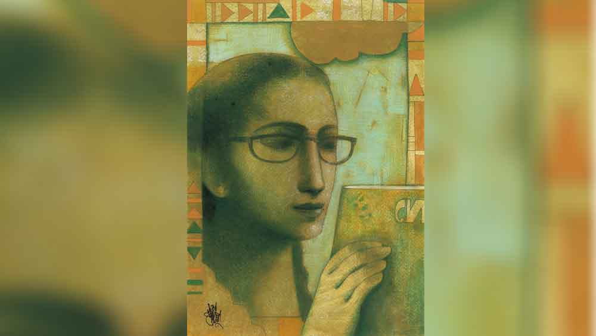

 

<h1 align=center>শর্মীর গল্প</h1>
<h2 align=center>জয় গোস্বামী</h2>
লেখাপড়া ছেড়ে দিয়েছে শর্মী চার বছর আগেই। এখন বেশির ভাগ সময়ে শর্মী বাড়িতেই বসে থাকে। বেরোয় না। কী করে বেরোবে? তার সঙ্গে যারা পড়ত, প্রায় সব মেয়েই এখন কলেজ পার হয়ে ইউনিভার্সিটিতে এম এ পড়ছে। কারও বা বিয়ে হয়ে গেছে। রাস্তায় বেরোলে তাদের সঙ্গে দেখা হয়ে যাওয়ার ভয়। শর্মী এই চার বছরে কোনও আত্মীয়স্বজনের বাড়ি যাওয়াও বন্ধ করেছে। কাকার ছেলের বিয়ে হল, তাও যায়নি। মামাতো বোনের বিয়েতেও নয়। এমনিতেই সবাই শর্মীর মা-বাবাকে বলে, “ওর বিয়ের চেষ্টা করছেন? বিয়ে দিয়ে দিন। পড়াশোনা তো হল না।” অনুষ্ঠান-বাড়িতে গেলে এই সব কথা আরও বেশি বেশি শুনতে হয়।   শর্মীর বিয়ে করতে ইচ্ছে করে না। এক অচেনা লোকের সঙ্গে সে থাকবে কী করে? তা ছাড়া শর্মীর বাবা-মা তাঁদের কন্যার ভবিষ্যৎ নিয়েও সর্বদা চিন্তিত। কেননা শর্মীর পড়াশোনা ছেড়ে দেওয়ার প্রধান কারণই হল তার ধারাবাহিক রোগভোগ। শর্মীর বাবা এই জগৎপুরের একটা হাইস্কুলের প্রধান শিক্ষক। শর্মীর মা-ও স্কুলেই পড়ান। তবে জগৎপুরে নয়। এখান থেকে চারটে স্টেশন যেতে হয় শর্মীর মাকে তাঁর কর্মস্থলে পৌঁছতে। সকাল পৌনে দশটায় বেরিয়ে যান শর্মীর মা। বাবার সাড়ে দশটায় বেরোলেই চলে। এগারোটায় স্কুল বসে যায় শর্মীর বাবার। মায়েরও তাই। কিন্তু একটি শিক্ষক পরিবারের একমাত্র সন্তান হয়েও শর্মী পড়াশোনা ছেড়ে দিল কেন?   কারণ শর্মীর স্বাস্থ্য। আজ থেকে ন’বছর আগে, অর্থাৎ ১৯৬৬ সালে, শর্মী পড়ত ক্লাস এইটে। ঠিক এই বছর তার টিবি হয়। প্রথমে বাড়িতে চিকিৎসা চলে, তার পর কলকাতার যাদবপুরে টিবি হাসপাতালে রাখতে হয় শর্মীকে। দিনে দিনে রোগমুক্ত হয় শর্মী— কিন্তু সে-বছর স্কুলের অ্যানুয়াল পরীক্ষায় আর বসতে পারে না। তবে শুয়ে-শুয়ে সে-বছরই রবীন্দ্রনাথের লেখা সমস্ত গল্প পড়া হয়ে যায় তার। পরের বছর মোটামুটি ভাল ভাবেই পাশ করে শর্মী নাইনে ওঠে। এই সময় আগের বছরের কোনও পুজোসংখ্যায় শর্মী পড়ে ‘ঘুণপোকা’ নামক এক উপন্যাস। সবটা ভাল বুঝতে পারে না। কিন্তু ওই উপন্যাসের একটা ঘোর আচ্ছন্ন করে রাখে তাকে। লেখকের নামটি তার কাছে অচেনা। শীর্ষেন্দু মুখোপাধ্যায়। বাড়িতে জমানো পুরনো ‘দেশ’ পত্রিকা থেকে এই লেখকেরই আরও একটি গল্প পড়ে ওই রকম ঘোরে ডুবে যায় শর্মী— গল্পের নাম ‘স্বপ্নের ভিতরে মৃত্যু’। তাদের বাড়িতে আসে সাপ্তাহিক ‘দেশ’ পত্রিকা। খবরের কাগজ বিক্রি করে দেওয়া হয়। কিন্তু ‘দেশ’ জমানো থাকে। বাবা বিক্রি করেন না।   নাইনে পড়ার সময় শর্মী পর পর ব্রঙ্কাইটিস, চিকেন পক্স আর টাইফয়েডে আক্রান্ত হয়। তাও সে বার্ষিক পরীক্ষা দেয় ও কোনও রকমে ক্লাস টেনে প্রোমোশন পায়। শর্মী ইলেভেন পর্যন্তও পৌঁছয়। এ বার এসে পড়ে শর্মীর ফাইনাল পরীক্ষার বছর।   সেটা ১৯৭১ সাল। মার্চ মাসে পূর্ববঙ্গে মুক্তিযুদ্ধ শুরু হয়েছে। দলে দলে উদ্বাস্তু এসে জগৎপুর স্টেশনে, রেললাইনের ধারে-ধারে ঝোপড়া বানিয়ে বাস করতে শুরু করেছে। অন্য দিকে নকশাল ছেলেদের নির্মমভাবে যখন তখন গুলি করে মারছে পুলিশ। বাড়ি বাড়ি হানা দিয়ে ধরে নিয়ে যাচ্ছে কিশোর ও যুবকদের। জগৎপুরেও নকশাল আন্দোলনের একটা ঘাঁটি তৈরি হয়েছিল। এক কনস্টেবল খুন হয়। পিঠে ছোরা গাঁথা অবস্থায় রাস্তায় উপুড় হয়ে ছিল তার লাশ। এর কিছু দিন পরেই এক ভোরবেলা রেললাইনের পাশে চার তরুণের গুলিবিদ্ধ দেহ পাওয়া যায়। চার জনই জগৎপুর কলেজে পড়ত। জগৎপুরে একটিই কলেজ। দু’টি সিনেমাহল। তিনটি ছেলেদের স্কুল। দু’টি মেয়েদের।   এই সব খুনখারাপির খবর শর্মী জানত কী করে? শর্মীর তো যাতায়াত বলতে স্কুল আর বাড়ি। তাও রোজ স্কুলে যেতে পারত না সে। খুব দুর্বল লাগত। স্কুলে ক্লাসের মেয়েরা বলাবলি করত এই সব খবর। কিছুটা সকালের সংবাদপত্র থেকে জানতে পারত শর্মী। তা ছাড়া বাবার কাছে সন্ধেবেলা প্রায় রোজই স্কুলের কোনও না কোনও টিচার আসতেন। বারান্দায় বসতেন তাঁরা। তাঁদের টুকরো টুকরো কথাবার্তা কানে আসত শর্মীর। ঘরে তখন দীপঙ্কর স্যর পড়াচ্ছেন শর্মীকে। দীপঙ্কর স্যরের মুখেও কিছু কিছু শুনত। শর্মীর খুব কষ্ট হত ওই ছেলেগুলোর জন্য। শর্মী ভাবত, কেন ওরা এই ভাবে মানুষ খুন করে আর শেষে নিজেরা খুন হয়ে 
যায়? কেন?   শর্মীর মনে রাজনীতি নিয়ে কোনও ধারণা কখনও গড়ে ওঠেনি। শর্মী ভালবাসে গান শুনতে। রেডিয়োতে। টুলে বসানো মার্ফি রেডিয়ো। ফিয়েস্টা রেকর্ড প্লেয়ারও আছে তাদের। বাবারও তো গান শোনার শখ। রেকর্ড কেনার শখ। মাঝে মাঝে বারান্দায় বসে বাবাকে গলা ছেড়ে গেয়ে উঠতেও দেখে থাকে শর্মী।   ঠিক এই সময় আবার শর্মী গুরুতর অসুখে পড়ল। কিছু খেতে পারে না। যা খায় তা-ই বমি হয়ে যায়। এমনকি রান্নার গন্ধেও বমি আসে। দুই চোখের সাদা জায়গা হলুদ হয়ে গেল শর্মীর। জগৎপুরের ডাক্তাররা অনেক ওষুধপত্র দিলেও কাজ হল না। শেষে পুনরায় কলকাতায় নিয়ে গিয়ে আর জি কর হাসপাতালে ভর্তি করা হল শর্মীকে। বাবার এক সহপাঠী কলকাতায় চিকিৎসক হিসেবে প্রতিষ্ঠিত। তিনি ওই হাসপাতালের সঙ্গে যুক্ত থাকায় শর্মী ওই হাসপাতালেই রইল। জানা গেল, হেপাটাইটিস বি নামক এক রোগ হয়েছে শর্মীর। খুব বেশি রকমই হয়েছে।   সাতাশ দিন হাসপাতালে থেকে অবশেষে বাবা-মায়ের সঙ্গে বাড়ি ফিরল শর্মী। কিন্তু তখন তার খাওয়ার ক্ষমতা একেবারেই নষ্ট হয়ে গেছে। সেদ্ধভাত আর সেদ্ধ সব্জি ছাড়া কোনও প্রোটিনজাতীয় খাদ্য শর্মী সহ্য করতে পারে না এখন। ফলে অসম্ভব দুর্বল হয়ে পড়ল। ক্লাস ইলেভেন থেকেই শর্মী আর স্কুলে যেতে চাইল না। রোগজীর্ণ মেয়ের ওপর জোর করতে ভরসা পেলেন না বাবা-মা।   শর্মী পড়াশোনা ছেড়ে দিয়ে কী করে? সে জগৎপুরের দুটো লাইব্রেরির মেম্বার। একটা হল পাবলিক লাইব্রেরি। সেটা স্টেশনের রাস্তায়। অন্যটা শর্মীদের বাড়ির একেবারে পিছনেই। মহকুমা লাইব্রেরি। এই লাইব্রেরিতে শর্মী যায় দুপুরে। তখন ভিড় থাকে না। কারও সঙ্গে দেখাও হয় না। শর্মী নিশ্চিন্তে বই বদলে আনে। আর মায়ের হাতে দিয়ে দেয় পাবলিক লাইব্রেরির বই। মাকে তো রোজ স্টেশন যেতে হয়। দুপুর তিনটের সময় পাবলিক লাইব্রেরি খোলে। রাত আটটায় বন্ধ হয়। মায়ের বাড়ি ফিরতে ফিরতে প্রায় সাড়ে পাঁচটা বাজে। ফেরার পথে শর্মীর জন্য বই বদলানো এমন কিছু কঠিন কাজ নয়। স্টেশনের রাস্তায় শর্মী মরে গেলেও যায় না। সেখানে অনেক চেনা লোকের সঙ্গে দেখা হয়ে যাওয়ার বিপদ অপেক্ষা করে। মাকে দুটো-তিনটে বইয়ের নাম বলে দেয় শর্মী। এই সব বইয়ের বিজ্ঞাপন শর্মী দেখে রাখে ‘দেশ’ পত্রিকা থেকে।   এ সময় বাবা এক দিন স্কুল থেকে ফিরে এসে জানালেন, ক্লাস ইলেভেনের পর যে হায়ার সেকেন্ডারি পরীক্ষার ব্যবস্থা এখন চালু রয়েছে, তা উঠে যাবে আগামী বছরের পরীক্ষার পরেই। আগামী বছর, অর্থাৎ ১৯৭৬ সালেই ক্লাস ইলেভেনের হায়ার সেকেন্ডারি পরীক্ষা হবে শেষ বারের মতো। তার পর ক্লাস টেন পর্যন্ত পড়ে মাধ্যমিক পরীক্ষা দিতে হবে। এর ঠিক পরেই চলবে ইলেভেন-টুয়েলভ এই দু’বছরের পাঠক্রম। টুয়েলভ পর্যন্ত পড়লে তখন 
আসবে উচ্চ মাধ্যমিক দেওয়ার ধাপ। সেই ধাপ পেরোলে তখন কলেজ।   ইতিমধ্যে ভারতে জরুরি অবস্থা জারি করেছেন প্রধানমন্ত্রী ইন্দিরা গান্ধী। মায়ের ট্রেন রোজ লেট করত। এখন নাকি প্রত্যেক ট্রেন একেবারে ঠিক সময়ে আসছে, মায়ের কাছে জানা যায়। এ দিকে বাবা-মা দুজনের অনুরোধে শর্মী রাজি হল আগামী ’৭৬ সালের হায়ার সেকেন্ডারি পরীক্ষায় বসতে। কারণ একাদশ শ্রেণি পর্যন্ত পড়ার পর স্কুলের যে শেষ পরীক্ষা, তা তো বন্ধ হয়ে যাবে ’৭৬-এর পরেই। তাই এটাই শর্মীর শেষ চান্স।   দীপঙ্কর স্যর আবার পড়াতে আসতে শুরু করলেন। চার বছর আগে, ’৭১ সালে, যখন দীপঙ্কর স্যর আসতেন তখন তাঁর বয়স ছিল আটাশ— বাবার কাছে শুনেছিল শর্মী। পিএইচ ডি করছিলেন তখন। পড়াশোনায় তো বরাবর ভাল। সেই দীপঙ্কর স্যর এখন অধ্যাপনার চাকরি পেয়ে গেছেন। সপ্তাহে তিন দিন করে আসতে লাগলেন দীপঙ্কর স্যর শর্মীকে পড়ানোর জন্য। শর্মী প্রাইভেটে পরীক্ষা দেবে। স্যর সাড়ে সাতটায় আসেন সন্ধেবেলা। সাড়ে ন’টা 
পর্যন্ত পড়ান। শর্মীদের বাড়ি সিদ্ধেশ্বরী কালীমন্দিরের পাশের গলিতে।   }প্রথম পাতার পর      দীপঙ্কর স্যরের বাড়ি কামারপাড়ায়। হাঁটা-পথ। তবে সাইকেলে যাওয়া-আসা করেন দীপঙ্কর স্যর। দীপঙ্কর স্যরকে খুশি করতে পারে না শর্মী। যতই সে বাবা-মায়ের কথায় পরীক্ষা দিতে রাজি হোক, স্কুলের পড়াশোনায় একেবারেই তার মন বসে না। শর্মীর বয়স এখন একুশ। কিন্তু ধারাবাহিক রুগ্নতার কারণে এবং প্রোটিন জাতীয় খাদ্য গ্রহণ করতে না পারায় শর্মীর শরীরে যৌবন প্রস্ফুটিত হতে পারেনি ঠিকমতো। শর্মী খুবই রোগা। রক্তহীন ধরনের ফর্সা। স্কুল থেকেই তার চশমা। সে যখন নাইটি পরে নিজের ঘরে শুতে আসে, ঘরের বড় আয়নায় এক বার নিজের দিকে তাকায়। তার বুকে সামান্য দু’টি ঢেউ মাত্র ফুটে উঠেছে এই একুশ বছর বয়সে। দীপঙ্কর স্যর এলে শর্মী শাড়ি দিয়ে নিজের কাঁধ গলা বুক পুরোপুরি ঢেকে পড়তে বসে। দীপঙ্কর স্যর যেন তার অপুষ্ট স্তনের গড়ন এতটুকুও বুঝতে না পারেন, সে বিষয়ে শর্মী 
যথেষ্ট সতর্ক।   শর্মীকে রাত জাগতে হয়, পড়াশোনার জন্য। অন্তত বাবা-মা সে রকমই বোঝেন। কিন্তু রাতে নিজের ঘরের দরজা বন্ধ করে শর্মী কী করে? না, পরীক্ষার সিলেবাস শেষ করার দিকে তার কোনও মনোযোগ থাকে না রাত ঘন হলে। বাবা-মা নিজেদের ঘরে ঘুমিয়ে পড়েন। দুজনকেই সকালে উঠতে হয়। মাকে পৌনে দশটায় বেরোতে হবে বলে বাবা ভোর পাঁচটায় উঠে চা করেন। রান্না বসান। শর্মীর বাবা রান্না করতে ভালবাসেন। মাকে সোয়া ন’টায় খেতে দিয়ে দেন বাবা। শর্মীর রান্নার দায়িত্বও বাবারই। সে রান্না আলাদা। তেল-মশলা ছাড়া, সেদ্ধ রান্না। শর্মীর জন্য দুপুরের খাবার ডাইনিং টেবিলে ঢাকা দিয়ে বাবা সাড়ে দশটায় স্কুলে বেরিয়ে যান।   দুপুরে শর্মী একা একা খায়। তার আগে স্নানঘরে ঢোকে। স্নানঘরেও ছোট আয়না আছে একটা। আয়নায়, স্নানের আগে বা পরে যখন শর্মী নিজের ফ্যাকাসে সাদাটে মুখ আর স্বল্প স্তন দু’টির প্রতিফলন দেখে, তখন এক ভয়ঙ্কর বিষাদ এসে আক্রমণ করে তাকে। স্নান করে, খেয়ে ওঠার পর, পড়ার টেবিলে বসে তার পরীক্ষার প্রস্তুতি নেওয়ার কথা। শর্মী টেবিলে নিয়মিত বসেও দুপুরবেলা। বসে, কিন্তু পরীক্ষার পড়া তৈরি করে না। বদলে কী করে?   বদলে সে একটা খাতা টেনে নিয়ে ডায়েরি লিখতে থাকে। 
একা একটি মেয়ের ডায়েরি লেখে সে। রোজ লেখে। রাত্রেও লেখে। হ্যাঁ, ওই ডায়েরিই।   ডায়েরি লিখতে লিখতে কখন যেন একটা পুরো দুপুর, সন্ধ্যা আর রাত্রি ধরে শর্মী লিখে ওঠে একটি গল্প। একা একটি মেয়ের গল্প। তার ব্যর্থতাবোধ, তার হাসপাতালের প্রহরগুলি, তার সঙ্গীহীনতা— সব ধরা পড়ে সেই গল্পে। সে দিন সন্ধেবেলা দীপঙ্কর স্যর আসেননি। সোম বুধ শুক্র তাঁর আসার কথা। সেটা ছিল মঙ্গলবার। তাই সন্ধেবেলাটুকুও শর্মী পেয়ে যায় গল্প লেখার জন্য।   লেখার পরে অসম্ভব একটা আনন্দ হয় তার। এমন আনন্দ সে কখনও পায়নি আগে।   দীপঙ্কর স্যরের কাছে শর্মী রোজই মৃদু তিরস্কার লাভ করে, কারণ পড়াশোনায় সে এগোতে পারছে না। অন্তত যতটা অগ্রসর হলে সে পরীক্ষায় বসার যোগ্য হবে, ততটুকুও এগিয়ে যেতে পারছে না শর্মী। দীপঙ্কর স্যর শর্মীর মা-বাবাকেও জানিয়ে দেন সে কথা। কিন্তু শর্মীর তাতে কোনও দুঃখ হয় না। সে পেয়ে গেছে এক নতুন পৃথিবী। গল্প লেখার পৃথিবী। প্রতি সপ্তাহে একটি করে গল্প লিখে শেষ করে সে। মহকুমা লাইব্রেরি থেকে এক দিন অন্তর এক দিন একটা করে বই বদলে নিয়ে আসে শর্মী। রাতে পড়ে। দুপুরেও। আর দেখে কী ভাবে প্যারাগ্রাফ শেষ করছেন লেখকরা। কী ভাবে তৈরি করে তুলছেন এক-একটি চরিত্র। কী ভাবে ডিটেলিংয়ের বুনন চলছে। রচিত হচ্ছে পরিবেশ। অল্প কথায় বেশি অর্থ কী ভাবে প্রকাশ পাচ্ছে বাক্যগঠনের কৌশলে। চরিত্রদের মধ্যে কী ভাবে সম্পর্ক আসছে। টানাপড়েন আসছে সম্পর্কের। সংলাপ কী ভাবে গতি আনছে লেখায়। শেষে কী ভাবে গন্তব্যে পৌঁছচ্ছে এক-একটি গল্প।   হঠাৎ এক দিন একটি গল্প লেখার পর শর্মী আবিষ্কার করল, গল্পে যে পুরুষ চরিত্রটি এসেছে সে প্রায় ছ’ফুট লম্বা, চওড়া কাঁধ, এক মাথা চুল, মুখে হালকা দাড়ি। কী করে এমন হল! এ রকম কোনও পুরুষকে তো শর্মী চেনে না। সত্যি বলতে একমাত্র দীপঙ্কর স্যর ছাড়া অন্য কোনও পুরুষের সঙ্গে একটি-দু’টি বাক্যও বিনিময় করার অবকাশ হয়নি তার এখনও। তা হলে এ কোন পুরুষ? কী ভাবে এল তার গল্পে? শর্মী তার রোগজীর্ণ শরীর যতই ঢেকেঢুকে বসুক দীপঙ্কর স্যরের সামনে, গল্প লিখতে গিয়ে শর্মী দেখল সে তার কোনও কথাই গোপন রাখতে পারছে না লেখার সময়ে। এমনকি রাত্রে, আলো নিভিয়ে ঘুমনোর আগে নিজেকে নিজে আদর করার কথাও শর্মী গল্পে প্রকাশ করে দিচ্ছে। শর্মীর মনে পড়ছে দু’বার হাসপাতালে অতিবাহিত হওয়া দিনগুলির কথা। হাসপাতালে দ্বিতীয় বার থাকার সময়, গভীর রাত্রে, কম্বলের তলায় নিজেকে নিজের হাতে পুলক উপহার দিত সে। যে পুরুষ সেই উপহার তুলে দিত প্রায় এক জাগ্রত স্বপ্নে— সেই পুরুষ উপস্থিত হল তার লেখা 
গল্পের মধ্যেও।   ১৯৭৬ সালের হায়ার সেকেন্ডারি পরীক্ষা হয়ে গেল। পরীক্ষায় বসতে পারল না শর্মী। দীপঙ্কর স্যর পরীক্ষার কিছু দিন আগেই আসা বন্ধ করেছেন। তবে শর্মী কাউকে না জানিয়ে, তার একটি গল্প পাঠিয়ে দিয়েছিল ‘দেশ’ পত্রিকায়। কেবল নিজের নামটি বদল করে শর্মী লিখেছিল তামসী বন্দ্যোপাধ্যায়। তার নীচে কেয়ার অব পরিতোষ বন্দ্যোপাধ্যায়— অর্থাৎ বাবার নাম ও বাড়ির ঠিকানা।   কিছু দিন পরে এল একটি চিঠি। চিঠিতে ধবধবে সাদা রঙের প্যাডের ওপরে ‘দেশ’ কথাটি ছাপানো। সেই চিঠি জানাল: আপনার গল্পটি মনোনীত হয়েছে। যথাসময়ে ছাপা হবে। তলায় স্বাক্ষর: সাগরময় ঘোষ।   চিঠি এল দুপুরে, তখন বাবা-মা কেউই বাড়ি নেই। শর্মীর হৃৎপিণ্ড তার গলার কাছে লাফিয়ে উঠল। ‘দেশ’ পত্রিকায় তার গল্প ছাপা হতে চলেছে? এ কি সত্যি? না স্বপ্ন দেখছে সে? 
সেই রাতে ভাল করে ঘুমোতে পারল না শর্মী।   মাস দেড়েক বাদে বাড়িতে ‘দেশ’ আসার পর শর্মী খুলে দেখল, তার গল্পটি সেখানে প্রকাশিত হয়েছে। তামসী বন্দ্যোপাধ্যায় নামটিও দেখল। এ বারও বাবা-মাকে কিছু বলল না। তবে তার একাকিনী জীবনে এসে আছড়ে পড়ল একটি আলোর ঢেউ। শর্মী আবারও একটি গল্পের জন্য প্রস্তুত করল নিজেকে।   তার বিষাদ, রুগ্নতা, পুরুষের স্পর্শ না-পাওয়া তার অসার্থক যৌবন, তার ঘরে বসে থাকা প্রহরগুলিকে শর্মী ধরে রাখতে লাগল নিজের গল্পে। আবার একটি গল্প পাঠাল ‘দেশ’ পত্রিকায়। আবারও কিছু দিন পরে একটি চিঠি বহন করে আনল মনোনয়নের সংবাদ।   অবশ্য তার আগেই একটি খাম এসেছে ডাকযোগে, পত্রিকা অফিস থেকে। ভেতরে একশো টাকার চেক। চেকে তামসী বন্দ্যোপাধ্যায়ের নাম।   শর্মী সেই চেক তার ড্রয়ারে লুকিয়ে রাখল। মাঝে মাঝে খাম 
খুলে দেখে শুধু। জীবনের প্রথম উপার্জন তো। তাও ভাঙায় না সেই চেক। কারণ ভাঙাতে গেলেই বাবা-মা জেনে যাবেন।   যখন দ্বিতীয় গল্পটি প্রকাশের অপেক্ষায় দিন গুনছে শর্মী, তখনই এক দিন সন্ধের মুখে এলেন দীপঙ্কর স্যর। পরনে পাঞ্জাবি আর প্যান্ট। কাঁধে একটা ঝোলা। মা সবে স্কুল থেকে ফিরে বাবার সঙ্গে কথা বলছেন তখন বারান্দায় বসে। শর্মী বেরিয়ে এল ঘর থেকে। “কী শর্মী, কেমন আছ?” দীপঙ্কর স্যর হাসলেন। তার পর শর্মীর বাবাকে বললেন, “আপনাদের তিন জনের কাছেই একটা দাবি নিয়ে এসেছি।”   শর্মীর বাবা বললেন, “দাবি? বলো কী দাবি?” দীপঙ্কর স্যর তাঁর ঝোলা থেকে কারুকার্য করা একটি কার্ড বার করে শর্মীর বাবার হাতে দিলেন। বললেন: “আমার বিয়ে। পনেরো তারিখে। আপনারা তিন জনেই আসবেন কিন্তু।”   শর্মীর মা খুব খুশি। বললেন, “মেয়ে কোথাকার? কী করে?” দীপঙ্কর স্যর বলেন, “আমার সঙ্গে একই কলেজে পড়ায়। অবশ্য ও হিস্ট্রি-র। শ্যামনগরে থাকে। শর্মী, তুমি তো কোথাও যাও-টাও না। আমার বিয়েতে কিন্তু তোমাকে আসতেই হবে। আসবে তো?”   শর্মী নিঃশব্দে মাথা এক দিকে হেলিয়ে দেয়।   দীপঙ্কর স্যর বলেন, “আজ উঠি। আরও কয়েক জায়গায় যেতে হবে।” সামনের বারান্দা দিয়ে এগোতে শুরু করেন দীপঙ্কর স্যর। শর্মীর বাবা বলেন, “একটু দাঁড়াও। আমাকে এক বার বাজারের দিকে যেতে হবে। এক সঙ্গেই বেরোই। আসছি।” ঘরে ঢুকে যান শর্মীর বাবা। দীপঙ্কর স্যর দাঁড়িয়ে গেছেন। হঠাৎ কী ভেবে যেন বলে ওঠেন, “আচ্ছা শর্মী, তুমি তো খুব বাংলা গল্প উপন্যাস পড়ো। তোমাদের বাড়িতে তো ‘দেশ’ পত্রিকা আসে। তুমি কি ‘দেশ’-এ তামসী বন্দ্যোপাধ্যায় নামে এক জনের একটা গল্প পড়েছ? গল্পের নামটা ঠিক মনে পড়ছে না, কিন্তু তার সেন্ট্রাল ক্যারেক্টার একটি মেয়ে। তার সঙ্গে তোমার খুব মিল আছে। তুমি কি পড়েছ গল্পটা?”   কাঠ হয়ে গেল শর্মী। সে তার মাথা দু’দিকে নাড়াল। না, ওই গল্প শর্মী পড়েনি।   দীপঙ্কর স্যর বললেন, “‘দেশ’ আমাদের কলেজেও আসে। আমাকে অতসী বলল, গল্পটা পড়ে দেখো। তোমার ছাত্রীর সঙ্গে খুব মিল 
গল্পের মেয়েটির।”   শর্মীর মা বললেন, “অতসী কে?” তত ক্ষণে শর্মীর বাবা এসে গেছেন। হাতে একটা বাজারের থলে। দীপঙ্কর স্যর বারান্দা থেকে শর্মীর বাবার সঙ্গে নামতে নামতে বললেন, “যার সঙ্গে আমার বিয়ে হচ্ছে। ও খুব পড়ে-টড়ে। মানে অতসী।”   শর্মী কোনও রকমে বলল, “উনি আমার কথা জানেন?” দীপঙ্কর স্যর তখন সদর দরজায় পৌঁছে গেছেন। “জানেই তো। আমিই বলেছি। কেবল অসুখ আর হাসপাতাল করে মেয়েটার জীবনটা… পড়াশোনা চালাতে পারল না… সব বলেছি। আচ্ছা চলি। আপনারা পনেরো তারিখ আসবেন কিন্তু, কেমন?” শেষ কথাটা শর্মীর মাকে বলা।   শর্মীর বাবা বেরিয়ে গেছেন সদর পার হয়ে। তাঁকে অনুসরণ করেছেন দীপঙ্কর স্যর। শর্মীর মা বারান্দা থেকে নেমে সদর বন্ধ করায় ব্যস্ত। দেখতে পেলেন না, শর্মী দৌড়ে নিজের ঘরে ঢুকে গেছে এক নিমেষে।   তখন সন্ধে ঘোর হয়ে নেমেছে। শর্মীর মা প্রথমে বারান্দার আলো জ্বালালেন, তার পর নিজেদের শয়নকক্ষের আলো জ্বালিয়ে রান্নাঘরে ঢুকে গেলেন চা বানাতে।   দু’কাপ চা হাতে নিয়ে শর্মীর ঘরে ঢুকে মা দেখলেন, ঘর অন্ধকার। শর্মী উপুড় হয়ে মুখে বালিশ চেপে শুয়ে আছে। আলো জ্বালালেন শর্মীর মা।   “আহ্‌! আলো নেভাও!” শর্মী প্রায় গোঙানির স্বরে বলে উঠল। তার ফোঁপানো গোপন রইল না। শর্মীর মা পাশে বসে মেয়ের মাথাটা টেনে নিলেন নিজের কোলে। কান্নার দমকে কাঁপছে শর্মীর পিঠ।   “কী হয়েছে রে? কী হয়েছে? বল!”   “কিছু না—” কান্নাভাঙা গলা শোনা গেল শর্মীর।   চায়ের কাপ দু’টি বিছানার 
পাশে শর্মীর পড়ার টেবিলে রাখা। ঠান্ডা হচ্ছে। শর্মীকে ঠান্ডা করা যাচ্ছে না। তার কান্নার বেগ বাড়ছে।   মা বললেন, “দীপঙ্কর? দীপঙ্করকে পছন্দ করতিস তুই? কিন্তু তা তো হয় না রে মা!”   শর্মীর ক্রন্দনক্রুদ্ধ স্বর বলল, “কক্ষনও পছন্দ করতাম না। কক্ষনও না!”   “তা হলে? তা হলে এ রকম করছিস কেন?”   কান্না আর ফোঁপানি শর্মীর বাক্যগুলিকে ভাঙতে থাকে। তারা এই রকম হয়ে যায়… “দীপঙ্কর স্যর কেন… তাঁর প্রেমিকাকে বললেন আমার কথা… কেন?... আমি তো কোনও দিন… দীপঙ্কর স্যরের কথা… কাউকে… বলতে যাইনি…”   মা তার মেয়ের মাথা জোরে চেপে ধরলেন কোলে। বললেন, “বলবি, বলবি! এ বার থেকে যা মনে হবে তোর মাকে বলবি। মাকে সব বলতে হয় রে!”   হু হু কান্নায় কাঁপতে লাগল শর্মীর ক্ষীণকায় শরীর। কোনও জবাব দিল না সে মায়ের কথার। কিন্তু মায়ের কোলে মুখ রাখা অবস্থায় শর্মী মনে মনে বলে যেতে লাগল: ‘বলব, বলব সব কথা বলব… কিন্তু তোমাকে নয় মা… বলব আমার খাতার কাছে… আমার গল্পের কাছে… করুণা না? করুণা?... দীপঙ্কর স্যর তাঁর প্রেমিকাকে নিজের ছাত্রীর কথা বলায় ছাত্রী কত আঘাত পেয়েছিল… সেই কথা বলব আমার পরের গল্পেই… যদি দীপঙ্কর স্যর না-ও পড়েন তা হলেও তাঁর প্রেমিকা… মানে বৌ… মানে ওই অতসী পড়বেনই… দীপঙ্কর স্যরকে তো উনি বলবেনই…’      ছবি: সুব্রত চৌধুরী
