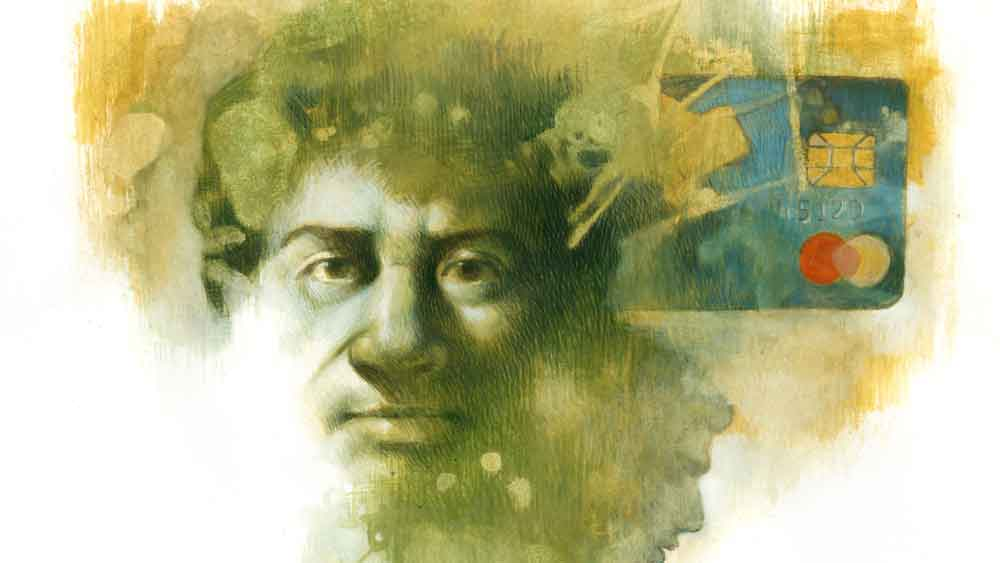

 
 <h1 align=center>শিবতোষ ও এটিএম কার্ড</h1>
<h2 align=center>উপল পাত্র</h2> পিয়নের থেকে রেজিস্ট্রি খামটা সই করে ভিতর থেকে চিঠির সঙ্গে আটকানো এটিএম কার্ডটা সাবধানে বার করলেন শিবতোষ। ঘুরিয়ে ফিরিয়ে দেখলেন। শিবতোষ সান্যাল নাম খোদাই করা, উপরে ষোলো সংখ্যার নম্বর। এমন একটা কার্ডের শখ তাঁর হালে হয়েছে। বিকেলে কালীশঙ্করের সঙ্গে যখন বেড়িয়ে ফেরেন, কালী প্রায়ই এটিএম থেকে টাকা তোলে। সেটা যে তাঁকে দেখানোর জন্যই, সে বিষয়ে শিবতোষ নিশ্চিত। তাঁরও ইচ্ছে হয় এটিএম থেকে টাকা তুলতে, কিছু কিনে কার্ডে দাম মেটাতে।

শিবতোষ শান্তিপ্রিয়, নির্বিরোধী, ভিতু মানুষ। টার্নার অ্যান্ড জনসন কোম্পানিতে চল্লিশ বছর লেজার কিপার হিসেবে কাজ করার পর মাস ছয়েক হল অবসর নিয়েছেন। মাইনেপত্র আহামরি কিছু ছিল না। তবু বাবুকে ইঞ্জিনিয়ারিং পড়িয়েছেন ব্যাঙ্ক লোন নিয়ে। ভাড়া বাড়িতে থেকে সংসার চালিয়েছেন টেনেটুনে। ছেলে আজ আইটি কোম্পানির বড় চাকুরে। সেই বলল, “ব্যাঙ্ক থেকে টাকা তোলার জন্য লাইনে দাঁড়ানোর আর দরকার নেই, এটিএম কার্ড করিয়ে দিচ্ছি।”

সেই কার্ড এখন তাঁর হাতের মুঠোয়। স্ত্রী মনোরমাকে কার্ডখানা দেখিয়ে বললেন, “এই দ্যাখো, আমার এটিএম কার্ড। এ বার থেকে আমিও ইচ্ছেমতো টাকা তুলতে পারব। কালী দুশো তুললে আমি পাঁচশো তুলে দেখাব।” এই বলে আনন্দের আতিশয্যে মনোরমাকে জড়িয়ে ধরে গেয়ে উঠলেন, “ওগো প্রাণের সই/ তুমি বিনে দিন কাটে না, ক্যামনে ছেড়ে রই/ ওগো সই...”

মনোরমা সাদাসিধে মানুষ। শিবতোষের এই হঠাৎ ছেলেমানুষিতে খুশি হলেও লজ্জা পেয়ে গেলেন। সঙ্কোচে জড়সড় হয়ে বললেন, “বুড়ো বয়সে সোহাগ যে উপছে পড়ছে। আজ বাদে কাল বৌমা আসবে সে খেয়াল আছে?”

“আফসোস তো সেখানেই মনো। সোহাগ করার বয়সে ব্যস্ত ছিলাম রোজগারে। তার পর কখন যে মেঘে মেঘে বেলা গড়িয়ে গেল!” শিবতোষ দীর্ঘশ্বাস ছাড়েন।

ছেলের গর্বে মনোরমার মাতৃহৃদয় উথলে উঠে, “এই কার্ডেই টাকা ভরা আছে! বাবু বুঝি এটাই করিয়ে দিলে? তা হলে ওটা নিয়ে চলো না গো কেষ্টা স্যাকরার দোকানে। মেজদির মতো নাকছাবির শখ অনেক দিনের।”                          

টানাটানির সংসারে শখ-আহ্লাদ মেটানোর বিলাসিতা শিবতোষ কোনও দিনই দেখাতে পারেননি। মনোরমাও অভিযোগ করেননি। সুদিন এলে নিজের সঙ্গে গিন্নিরও শখ মেটাতে ইচ্ছে হয় বইকি।

শিবতোষ আশ্চর্য হয়ে বললেন, “কেষ্টার দোকানে! এই কার্ড নিয়ে? হাসালে তুমি। ও ব্যাটাচ্ছেলে বাপের জম্মে দেখেছে ডেবিট কার্ড? এ সব কার্ড বড় দোকানে চলে বুঝলে? একটু রপ্ত হয়ে নিই, তার পর নিয়ে যাব’খন পি সি মল্লিকের শোরুমে। এখন একটু চা করো দিকি কড়া করে।”

 

কালীশঙ্কর কার্ডটা উল্টেপাল্টে দেখে চুপসে গিয়ে বললেন, “ও বাবা, ছেলে তো দেখছি ডেবিট কার্ড করে দিয়েছে। আমারটা ক্রেডিট কার্ড। যাক, সাবধানে ব্যাভার কোরো।”

কালীর শুকনো মুখটা দেখে শিবতোষ খুশি হলেন। ডেবিট আর ক্রেডিট কার্ডের তফাত জানতে ইচ্ছে করলেও চেপে গেলেন। জিজ্ঞেস করলেই তো চাট্টি জ্ঞান দেবে। কালীর মাতব্বরি অনেক সহ্য করেছেন, আর নয়। তিনিই বা কম কীসে! কালী তো ছেলেটাকেও মানুষ করতে পারেনি। ইন্সিওরেন্সের দালালি না কী যেন করে। আর বাবু ইঞ্জিনিয়ার, কোম্পানির গাড়িতে অফিস যায়।

 

*****

চায়ের আড্ডায় এটিএম থেকে টাকা জালিয়াতি নিয়ে জোর আলোচনা চলছিল। ঘোষাল বললেন, “কার্ড নকল করে আমার শালার ছত্রিশ হাজার টাকা তুলে নিয়েছে! এ সব কার্ডের বিপদ অনেক।”

শিবতোষ উশখুশ করছিলেন তাঁর কার্ডের কথাটা পাড়ার জন্য। সুযোগ পেয়ে বললেন, “সে যাই বলো ঘোষাল, এই কার্ডের সুবিধেও আছে। সই মেলানোর ঝামেলা নেই, লাইনে দাঁড়ানোর হ্যাপা নেই। দেখছি তো, ছেলে একটা কার্ড করিয়ে দিয়েছে...”

অনুপম বলল, “বলো কী শিবুদা, তুমি এটিএম কার্ড নিয়েছ? তুমি তো এ সবের ঘোর বিরোধী ছিলে।”

শিবতোষ হেসে বললেন, “সময়ের সঙ্গে নিজেকে আপডেট না করলে তোমরা পাত্তা দেবে কেন?”

কালীশঙ্কর বললেন, “তাও যে সে কার্ড নয় বাওয়া, রীতিমতো গ্লোবাল ডেবিট কার্ড।”

সকলে গলা মিলিয়ে বলল, “তবে হয়ে যাক সেলিব্রেশন! কোনও বড় রেস্তরাঁ দেখে...”

শিবতোষ মুখে ‘হবে, হবে’ বললেও মনে মনে ঠিক করলেন, একটা ভাল কাজে কার্ডটা প্রথম ব্যবহার না করে ভূত ভোজনে ওই কার্ড ব্যবহার করবেন না।

আর সেই ‘ভাল কাজ’ এর খবরটা এল মানিক সাঁতরার ফোনে। শিবতোষ রানাঘাটে যে আড়াই কাঠা জমি দেখেছেন, রোববার তার বায়নার দশ হাজার টাকা দিতে হবে ক্যাশে। ট্রেনে অত ক্যাশ নিয়ে যাওয়ার ঝুঁকি অনেক, শিবতোষ ঠিক করলেন রানাঘাটের কোনও এটিএম থেকেই টাকাটা তুলে নেবেন।

 

*****

পেয়েও গেলেন একটা ফাঁকা এটিএম। বাইরে গার্ড পর্যন্ত নেই। এমনটাই চাইছিলেন। অনেকগুলো টাকা তো, লোকজন থাকলে.... কার কী মতলব... ভয় হয়।

পকেট থেকে কার্ড বের করে খোপে ঢোকালেন, পিন দিলেন, টাকার অঙ্ক বসালেন। তার পরে যা ঘটল, তাতে নিজের চোখকে বিশ্বাস করতে পারলেন না। মেশিন থেকে বেরিয়ে এল অনেকগুলো গোলাপি রঙের দু’হাজার আর শেওলা রঙের পাঁচশোর নোট।

শিবতোষের হাত কাঁপছে। এতগুলো নোট যে হাতে ধরছেই না। আঙুলে ঘাম লাগিয়ে এক বার গুনলেন, আটাশ হাজার, এক বার বত্রিশ, তার পর তিরিশ। বুকটা ভীষণই ধড়ফড় করছে। চার পাশটা দেখে নিশ্চিন্ত হয়ে আবার গুনলেন। পাক্কা তিরিশ। ভাবছেন কী করবেন বাকি বিশ হাজার নিয়ে, এমন সময়ে রোদচশমা পরা একটা ছোকরা ঢুকল। শিবতোষ টাকা আর কার্ড ব্যাগে ভরে দ্রুত বেরিয়ে এলেন। ভুল কি তবে তাঁরই? টাকার অঙ্ক বসাতে গিয়ে ভুল করলেন? মোবাইলে মেসেজও তো আসেনি। দু’হাজারের ক’টা নোটে রঙের দাগ। সাঁতরা যদি না নেয়? রোববারে ব্যাঙ্কও বন্ধ, নইলে সেখানে গিয়ে সমস্যাটা জানাতেন, দাগি নোটগুলোও বদলে নিতেন। শিবতোষের মনে হল, নোটগুলো জাল নয় তো? যদি হয়, প্রমাণ কী, নোটগুলো ওই এটিএম থেকেই তোলা? শেষে জাল নোট পাচারের দায়ে...! কী বিপদেই পড়া গেল। কাকে জানাবেন, কোথায় যাবেন এখন? বড় অসহায় লাগল তার।

 

*****

মানিক বলেছিল স্টেশন থেকে তার বাড়ি মিনিট পনেরোর হাঁটা। ব্যাগটা বগলে চেপে শিবতোষ হাঁটা শুরু করলেন। খানিকটা এগোতেই একটা পুলিশ ভ্যান এসে দাঁড়াল গা ঘেঁষে।

“আপনি এইমাত্র এটিএম থেকে টাকা তুলেছেন না?” একটা কনস্টেবল ভ্যানের ভিতর থেকে জিজ্ঞেস করল। পাশে রোদচশমা পরা সেই ছোঁড়াটা।

“কেন, তাতে আপনার কী?” পুলিশ দেখে ঘাবড়ে গেলেও রুখে দাঁড়ালেন শিবতোষ।

“পুলিশকে চোপা! চলুন থানায়!” শিবতোষকে ধমকে ভ্যানে তুলল কনস্টেবলটা।

 

থানার বড়বাবু ফাইলে চোখ রেখেই জিজ্ঞেস করলেন, “কী নাম? থাকেন কোথায়?”

“আজ্ঞে শিবতোষ, শিবতোষ সান্যাল। থাকি কোলকাতার বেচারাম আঢ্য লেন, আন্ডার এন্টালি পি এস।”

এ বার বড়বাবু মুখ তুলে তাকালেন, চোখে তির্যক দৃষ্টি, “থাকেন কলকাতায়, টাকা তুলতে রানাঘাটে! কলকাতায় এটিএম নেই, না এখানে মধু আছে?”

“টাকা তুলতে আসিনি স্যর। এসেছিলাম জমির বায়না দিতে।”

“বটে, জবাব রেডি আছে দেখছি? কত তুলেছেন?”

“দশ হাজার।”

“মিথ্যে কথা, রাখুন টাকাটা টেবিলে,” শিবতোষকে ইতস্তত করতে দেখে বড়বাবু ধমক দিল, “কী হল, রাখুন।”

শিবতোষের বুক ধড়ফড় করছে। টাকা তো বেশিই আছে। কী করবেন?                

সেই কনস্টেবলটা বললে, “মালটা বহুত ঢ্যাঁটা স্যর, আপনাকে পাত্তাই দিচ্ছে না।”

বড়বাবু তেতে উঠে বললেন, “কথাটা কানে গেল না না কি?”

শিবতোষ টাকা টেবিলে রেখে ভয়ে ভয়ে বললেন, “স্যর, এতে তিরিশ আছে।”

“তবে যে বললেন দশ তুলেছেন? বাকিটা কি সঙ্গে এনেছিলেন?”

বড়বাবুর কথাটা খপ করে লুফে নিয়ে শিবতোষ বললেন, “ঠিক ধরেছেন স্যর।”

“বটে? আপনি তো মশাই পাক্কা জালিয়াত। ইনফর্মার বলছে, এটিএম থেকে দশের বেশি ক্যাশ বেরিয়েছে।”

“তা হলে সত্যি কথাটাই বলি স্যর। আমি দশই চেয়েছিলাম, কিন্তু মেশিন থেকে তিরিশ বেরিয়েছে। বিশ্বাস করুন স্যর।”

“বটে? আর আপনিও পুরো মালটা শান্টিং করে ফেললেন! দেখে তো ভদ্দরলোক বলেই... মোবাইলে মেসেজটা দেখান।”

“মেসেজ এখনও কিছু আসেনি।”

“তাই তো, মেসেজ যাবে তার ফোনে, যার সব্বোনাশ করেছেন।”

“বিশ্বাস করুন, যা ভাবছেন তা নয়। বেশ, আমি বায়নার দশ হাজার নিয়ে বাকিটা রেখে যাচ্ছি। আমাকে যেতে দিন স্যর।”

চোখ কপালে তুলে বড়বাবু বললেন, “বাকিটা রেখে যাচ্ছি মানে? আস্পর্ধা তো কম নয়, থানায় এসে পুলিশকে ঘুষ অফার?”

“তা হলে ওই টাকাটা নিয়ে আমিই বা কী করব? মা শীতলার দিব্যি, আমি কোনও জালিয়াতির সঙ্গে যুক্ত নই স্যর।”

“থামুন মশাই। খবর আছে কার্ড জাল করে ওই এটিএম থেকে টাকা তোলা হচ্ছে। সঙ্গে আর কারা আছে বলে ফেলুন, নইলে কথা কী করে বের করতে হয়... নিতাই!” শেষ শব্দটা আর একটু চড়া সুরে হাঁক। 

“স্যর,” ষণ্ডামার্কা একটা কনস্টেবল স্যালুট ঠুকে এসে দাঁড়াল।

শিবতোষ বললেন, “মানিক সাঁতরাকে ফোন করুন না স্যর, রথতলায় থাকে... জমির দালালি করে... আচ্ছা, আমিই করছি।”

শিবতোষের মোবাইলটা কেড়ে নিয়ে বড়বাবু ধমকে বললেন, “খুব সেয়ানা তো, দলের অন্যদের সাবধান করতে চাইছেন? পুলিশের সঙ্গে চালাকি? বলুন আর কে আছে?”

“ফোনটা দিন স্যর… ছেলে দিয়েছে। সত্যি বলছি, আমি এ সবের সঙ্গে জড়িত নই।”

“বটে! নিতাই, খোকাবাবুকে একটু ল্যাবেঞ্চুস দে। এমনিতে বুলি ফুটবে না।”

ভীষণ অপমানিত শিবতোষ রাগে ফুঁসছেন। নিতাই গায়ে হাত তোলার মুহূর্তে তার মোবাইলটা বেজে উঠল বড়বাবুর টেবিলে।

বড়বাবু চেঁচিয়ে পড়লেন, “মহরম কলিং! কে এই মহরম, অন্য শাগরেদ নিশ্চয়ই? যা ভেবেছি।” বড়বাবুর চোখে জিজ্ঞাসা, মুখে মিচকে হাসি।

“মহরম নয় স্যর, মনোরম। আমার ওয়াইফ মনোরমা... বানানটা ভুল আছে। ফোনটা ধরি স্যর, মনো বড্ড চিন্তা করে। ওর হাই সুশার মানে ইয়ে সুগার, প্রেশার...”

“তাই বলুন, ফ্যামিলি বিজ়নেস... যা ভেবেছি।”

“কী ভেবেছেন?” এ বার শিবতোষ গর্জে উঠলেন, “আয়াম কামিং ফ্রম এ রেসপেক্টেবল ব্রাম্ভিন ফ্যামিলি... সার্ভড ফর্টি ইয়ারস ফর টার্নার অ্যান্ড জনসন কোম্পানি উইদ ইন্টিগ্রিটি অ্যান্ড রেপুটেশন, মাই সন সফটওয়্যার ইঞ্জিনিয়ার, বেঙ্গালুরুতে কাজ করে অ্যাট হাই পোস্ট...” 

বড়বাবু বললেন, “কী ভেবেছেন, দুটো ইংরিজি কপচালে ভয়ে ছেড়ে দেব আপনাকে? ওই ইঞ্জিনিয়ারই নাটের গুরু! হাঁ করে দেখছিস কী নিতে, মালটাকে সাইজ় কর।”

নিতাইকে হাতা গুটিয়ে এগিয়ে আসতে দেখে শিবতোষ চিৎকার করে উঠলেন, “মনোরমা বাঁচাও... মেরে ফেললে আমায়…”

 

*****

ঘুমটা ভেঙে গেল। হৃৎস্পন্দন অস্বাভাবিক দ্রুত। সময় নিলেন ধাতস্থ হতে। পাশে মনোরমা নিশ্চিন্তে ঘুমোচ্ছেন তাঁকে জড়িয়ে। ওঁর হাতটা সন্তর্পণে সরিয়ে শিবতোষ বারান্দায় এলেন। চার পাশ পাতলা কুয়াশায় ঢাকা, পুবের আকাশে ছানা কাটা জলের রং। নতুন দিন শুরু হচ্ছে।

শিবতোষ ভাবলেন, স্বপ্নটা সত্যিও হতে পারত। জালিয়াতির অপরাধে তাঁকে হাজতবাসও করতে হত। জীবন ক্রমশ জটিল হয়ে উঠছে। তাঁদের সময় ব্যস্ততা থাকলেও জটিলতা ছিল না জীবনে। সময়টা ছিল মানুষের, যাপন ছিল মানবিক। আর এ সময়টা যন্ত্রের, মানুষ তার দাস। যন্ত্র কী করে বুঝবে মানুষের সমস্যা? শিবতোষ স্থির সিদ্ধান্তে এলেন— সুবিধে নয়, স্বস্তিই কাম্য এই বয়েসে।

 

কেষ্টার দোকান থেকে বেরিয়ে উচ্ছ্বসিত মনোরমা বললে, “নাকছাবিটা খুউব সুন্দর গড়িয়েছে কেষ্টা। তবে তুমি কিন্তু বলেছিলে কার্ড নিয়ে বড় দোকানে যাবে।”

“যাব তো, বৌমার গয়না কিনতে হবে না? এখন চলো, চমনবাহার দিয়ে মিষ্টি পান খাই দু’জনে।”

রোববার রানাঘাটে পৌঁছে রিকশা নিলেন শিবতোষ। গুছিয়ে বসে মৌজ করে সিগারেট ধরালেন। মনটা ফুরফুরে। এ বার বাড়ি হবে নিজের।

প্যান্টের চোরাপকেটে বায়নার দশ হাজার ঠিকঠাক আছে দেখে নিয়ে রিকশাওয়ালাকে বললেন,
“চলো রথতলা।”