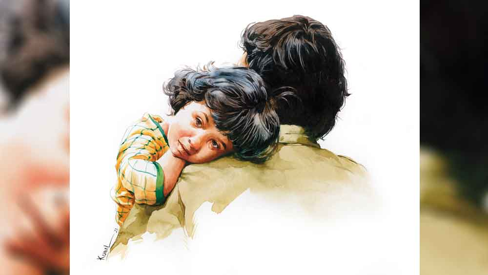

 

<h1 align=center>শীতলপাটি</h1>
<h2 align=center>কৃষ্ণেন্দু মুখোপাধ্যায়</h2>
অরিত্রর মনে হচ্ছে বরফের চাদরের ওপর শুয়ে আছে। এত দিন এই ঠান্ডাটা মনে হত খুব আরামদায়ক। আজ মনে হচ্ছে কনকনে। চিত হয়ে শুয়ে পিঠের কাছটা মসমস করছে। যেন বরফ ফুটিফাটা হয়ে কুচিকুচি  হচ্ছে। লম্বা শ্বাস নিয়ে চোখ মেলল অরিত্র। আকাশে ঝিকিমিকি তারা। চেনা অচেনা গ্রহ নক্ষত্রপুঞ্জ। হাল্কা আভায় তারারা পিটপিট করছে।   জায়গাটা হতে পারত পৃথিবীর শান্ত নিবিষ্ট কোনও নির্জন প্রান্তর। কিন্তু জায়গাটাকে ঘিরে আছে চার দেওয়াল। বাতাস ভারী হয়ে রয়েছে রুদ্ধ বাস্তবে। অরিত্রর পায়ের একটু দূরে ভবিষ্যৎ মুড়ে ঠায় দাঁড়িয়ে আছে একটা বড় সুটকেস, দুটো কিটব্যাগ।   ঈষৎ পাশ ফিরল অরিত্র। পাশে শুয়ে আছে টিকলি। একটু আগেও বিষণ্ণ গলায় নানা প্রশ্ন করছিল। 
মিতা ধমক দিয়ে চুপ করিয়েছিল, “বাবাকে অনেক ভোরে উঠতে হবে। ঘুমোতে দে।”   টিকলি চুপ করে গিয়েছিল। কিন্তু অরিত্রর দিকে ঘুরে কচি হাতটা ছড়িয়ে দিয়েছিল বাবার বুকের ওপর। পিঠের তলায় শীতলপাটি, বুকের ওপর টিকলির হাতের ওম আর সিলিংয়ে আটকানো ফ্লুরোসেন্ট স্টিকারের ঝিকমিকে তারা, যেন চার দেওয়ালের মধ্যে আটকানো এক টুকরো স্বর্গ। সেই স্বর্গ ছেড়ে চলে যাওয়ার জন্য ডাকছে সুটকেস, কিটব্যাগগুলো।   একটু উসখুস করে উঠল অরিত্র। টিকলি আর একটু আঁকড়ে ধরল অরিত্রর বুকটা। অরিত্র বুঝতে পারল টিকলি ঘুমোয়নি। ফিসফিস করে বলল, “ঘুমোসনি?”   উত্তর দিল না টিকলি। মাথা ঝাঁকাল। মেয়ের চুলের হাল্কা ঝাপটা লাগল অরিত্রর বাজুতে। আলতো করে মেয়ের মাথায় হাত রাখল অরিত্র। লকডাউনের সময় যখন সব সেলুন বন্ধ ছিল, এক দিন মিতা টিকলির চুল কাটতে গিয়েছিল। টিকলি ঝোঁক ধরেছিল, বাবা কেটে দেবে। অনেক বুঝিয়েও রাজি করানো যায়নি টিকলিকে। মিতা রাগে অভিমানে কাঁচিটা ধরিয়ে দিয়েছিল অরিত্রর হাতে। এর পর যা হওয়ার তা-ই হয়েছিল। অপটু হাতে টিকলির চুল এবড়োখেবড়ো করে কেটেছিল অরিত্র। তার পর নিজেকে আয়নায় দেখে টিকলির খিলখিল করে সে কী হাসি। মিতা বলেছিল, “বেশ হয়েছে। যেমন জেদ! এ বার বন্ধুরা খেপালে আমাকে বলতে আসিস না।”   টিকলি অকাট্য যুক্তি দিয়েছিল, “এখন তো স্কুলই বন্ধ। বন্ধুরা দেখবে কী করে? আর বাবা তো ভালই চুল কেটে দিয়েছে।”   টিকলির কাছে বাবা যা করে সবই ভাল। মিতা বলে বাপসোহাগী। আসলে একটা গোটা বছর ধরে বাড়িবন্দি হয়ে প্রতি মুহূর্তে টিকলি আর অরিত্র নিজেদের চিনেছে একটু একটু করে। সেটা হয়তো হতই না এই মহামারিটা না হলে। কত যে অদ্ভুত অদ্ভুত খেলা আবিষ্কার করেছে বাবা আর মেয়ে মিলে! যেমন একটা মুখোশ মুখোশ খেলা। দু’জনে মুখোশ পরে। বলতে হবে মুখোশের পেছনে মুখটা কোন ইমোজির মতো। হাসি, কান্না, রাগ, অভিমান, দুঃখ না ভয়।   অরিত্রর চাকরির জায়গা নৈনিতাল থেকে বাসে এক ঘণ্টা দূরে এক কারখানায়। বাড়তি উপার্জনের জন্য কলকাতার চাকরি ছেড়ে ওই কারখানায় সুপারভাইজ়ারের চাকরিটাই নিয়েছিল অরিত্র। টিকলির তখন বছর দুয়েক বয়স। অরিত্র  বুঝতে পেরেছিল টিকলিকে ভাল স্কুলে পড়াতে, ভাল করে বড় করতে তুলতে বেশি মাইনের চাকরিটার দরকার। মিতা প্রথমে এ ভাবে আলাদা থাকতে রাজি হয়নি। কিন্তু অরিত্রর নতুন কাজের জায়গায় থাকতে গিয়ে বুঝেছিল, জায়গাটার সঙ্গে শহর কলকাতার কোনও তুলনাই হয় না। ভাল স্কুল তো দূরে থাক, পাহাড়ি জায়গাটায় কিছুই প্রায় নেই। সুতরাং বছরখানেক পর দূরত্ব হওয়া অনিবার্য ছিল। তবে টিকলির স্কুলের  ছুটি পড়লেই ওরা চলে যেত অরিত্রর কাছে, আর অরিত্র  কয়েক দিনের ছুটি জড়ো করতে পারলেই চলে আসত কলকাতায়। এ ভাবেই অভ্যস্ত হয়ে উঠেছিল তিন জনে। দিব্যি চলছিল টিকলির স্কুল, নাচের ক্লাস, আঁকার ক্লাস, ছুটিতে হিমালয়ে ঘোরা। সব এলোমেলো হয়ে গেল মহামারিতে।   ভাইরাসের জন্য নিজেকে নিয়ে একেবারেই  চিন্তা করেনি অরিত্র। মনে হয়েছিল, ও শহুরে রোগ। তাই চিন্তা হয়েছিল মিতা আর টিকলিকে নিয়েই। ভেবেছিল, যত দিন না এ সব মিটে যায় ওদেরও বরং নিজের কাছে এনে রাখবে। ওদের নিজের কাছেই নিয়ে আসতে কলকাতায় এসেছিল অরিত্র। তার মধ্যেই প্রধানমন্ত্রী এক দিন দেশ জুড়ে ঘোষণা করে দিলেন লকডাউন। ভাগ্যিস ও তখন কলকাতায় ছিল! মনে মনে নিজের ভাগ্যকে অসংখ্য বার সেলাম জানিয়েছে অরিত্র। কী ভাবে পরিযায়ী শ্রমিকরা ফিরেছেন, টিভির পর্দায় দেখে শিউরে উঠেছে ও। ওই মুখগুলোর মধ্যে বার বার দেখতে পেয়েছে নিজের মুখ। বুকের মধ্যে আঁকড়ে ধরেছে টিকলিকে।   বাবাকে এ ভাবে পেয়ে টিকলি খুব খুশি। বাবাকে এ রকম কখনও দেখেনি। বাবা সব সময় বাড়িতে আছে, লুডো খেলছে, মুখোশ মুখোশ খেলছে আবার মায়ের সঙ্গে হাতে হাতে কাজও করছে। প্রথম কয়েক সপ্তাহ অরিত্রও আনন্দে ছিল। কারখানা বন্ধই ছিল। তার পর একটু একটু করে আসল সমস্যার গোড়াপত্তন হল। কয়েক মাস অরিত্র অর্ধেক মাইনে পেল। এক সময় সেটাও বন্ধ হয়ে গেল। এমন কিছু সঞ্চয় নেই। তবে সেটুকু ভাঙিয়েই সব দুশ্চিন্তা বুকের মধ্যে পুরে মিতা হাসিমুখে সংসার চালিয়েছে।   টিকলিকে দু’জনে কিচ্ছু বুঝতে দেয়নি। টিকলির স্কুলের অনলাইন ক্লাস শুরু হল। কিছু দিন পরে টিউশনের, গানের অনলাইন ক্লাস শুরু হল। পালা করে অরিত্র আর মিতার মোবাইল দিয়ে সামাল দেওয়া যাচ্ছিল না। টিকলিকে একটা সস্তার স্মার্টফোন কিনে দিতে বাধ্য হল অরিত্র। টিকলি সে দিন অরিত্রর গলা জড়িয়ে বলল, “তুমি সব থেকে ভাল বাবা।” আর সে দিনই নতুন করে খুঁজে পেয়েছিল শীতলপাটিটা। কোন কালে এক বার দিঘা বেড়াতে গিয়ে কিনেছিল। বিছানার গদির তলায় ঘুমিয়ে ছিল সেটা।   ভাল বাবাই তো হতে চেয়েছে অরিত্র। মাথাভর্তি অনিশ্চয়তার বিজবিজে পোকাগুলো নিয়ে শীতলপাটি বিছিয়ে টিকলিকে ঠান্ডা মাথায় পড়াতে বসেছে, বুকের ওপর মোবাইল ধরে রাত জেগে বাপ-মেয়ে ‘সোনার কেল্লা’, ‘চাঁদের পাহাড়’ দেখেছে, কত গল্প শুনিয়েছে, তাসের ম্যাজিক দেখিয়েছে। বইয়ের আলমারি গুছোতে গিয়ে ফ্লুরোসেন্ট স্টিকার খুঁজে পেয়ে সিলিংয়ে আটকে রাতের অন্ধকারে জ্বলজ্বলে তারা গুনেছে আর সামলেছে মেয়ের একের পর এক প্রশ্ন।   “আচ্ছা, আমার বন্ধুদের বাবারা ল্যাপটপে ওয়ার্ক ফর্ম হোম করছে, তুমি কেন করো না?”   এর কী উত্তর দিতে পারত অরিত্র? যে কারখানায় সুপারভাইজ়ারের পদে কাজ করে, তার তো বাড়ি থেকে কাজ হয় না। টিকলির মাথার চুল ঘেঁটে শুকনো গলায় বলেছে, “আমার যে ল্যাপটপ নেই।”   “কিনে নাও একটা। তা হলে তোমাকে আর নৈনিতাল ফিরে যেতে হবে না।”   “তা নাহয় কিনব। কিন্তু তোর বন্ধুর বাবারা আর কী কী করছে?”   “সৃজার বাবা দারুণ রান্না করছে। ইউটিউব থেকে শিখেছে। তুমি রান্না করতে পারো?”   “দেখি চেষ্টা করে।”   কারখানার কাছেই একটা মেস করে দু’জনের সঙ্গে থাকে অরিত্র। রান্নার লোক আছে। কখনও নিজে রান্না করার প্রয়োজন হয়নি। তবে ইউটিউব দেখে রান্নাও শিখে ফেলল অরিত্র। মিতা তখন মেপে সংসার চালাচ্ছে। তবু প্রশ্রয় দিয়েছিল। টিকলি চেটেপুটে খেয়ে বলেছে, “হোটেলের চেয়েও ভাল রান্না করে আমার বাবা।”   মিতা দীর্ঘশ্বাস ফেলে বলেছিল, “মেয়ের স্বভাবটা খারাপ করে দিয়ে যেয়ো না।”   আনলকের প্রথম পর্যায়ে যখন একটু একটু করে কলকারখানা খুলতে আরম্ভ করল, তখনও অরিত্রদের কারখানা খুলল না। সহকর্মীদের কাছে খবর পেল উৎপাদনের খদ্দের নেই, এই অজুহাতে অনির্দিষ্ট কালের জন্য কারখানা বন্ধের নোটিশ ঝুলিয়ে রেখেছে মালিকপক্ষ। এর পর হয়তো চাকরিটাই আর থাকবে না। মাইনে বন্ধ থাকলেও ভবিষ্যতের একটা আশা ছিল, কারখানা আবার খুলবে। সেটুকুতেও প্রশ্নচিহ্ন পড়ে গেল। মিতা ছাড়া আর কার সঙ্গেই বা ভাগ করে  নিতে পারত সেই সব দুশ্চিন্তা।   “তুমি এখানেই কাজের চেষ্টা করো। কম মাইনে পেলেও আমরা ঠিক চালিয়ে নেব।”   “এখন তো সব অফিস ঠিক করে খুলছে না। সপ্তাহে রোজ সবাই কাজে যাচ্ছে না। কত লোকের চাকরি চলে যাচ্ছে। নতুন লোক নেওয়ার প্রশ্নই উঠছে না। দেখি আর কিছু দিন পরে ফিরে যাওয়ার চেষ্টা করব।”   হাতটা চেপে ধরে মিতা বলেছিল, “না, ভ্যাকসিন না বেরোনো পর্যন্ত তুমি কোথাও যাবে না।”   “বোঝার চেষ্টা করো...”   বোঝার চেষ্টা করেনি মিতা। স্টিলের আলমারির লকার খুলে যৎসামান্য গয়নাগুলো দেখিয়ে অবুঝ গলায় বলেছিল, “এগুলো আছে কিসের জন্য?”   আর কয়েক মাস পরে সেই গয়নাতেই হাত দিতে হল অরিত্রকে। মিতা বলেছিল বিক্রি করে দিতে। তবে প্রাণ ধরে অরিত্র বিক্রি করতে পারেনি। এক বেসরকারি সংস্থায় বন্ধক রেখে ‘গোল্ড লোন’ নিয়েছে। সেটুকুতেই বা আর কত দিন? ও দিকে শ্রমিক বিক্ষোভ বাড়ছিল। কারখানার বন্ধ গেটের সামনে ধর্না। অনেকেই ফিরে গিয়ে সেই ধর্নায় অংশগ্রহণ করছে। ফিরে যাওয়ার জন্য অরিত্রর ওপর চাপ বাড়ছিল। অরিত্র বেশ বুঝতে পারছিল ফিরে যেতে না পারলে ছাঁটাই শুধু সময়ের অপেক্ষা।   অরিত্র আর মিতা যথাসম্ভব চেষ্টা করত এই সব দুঃসময়ের দুশ্চিন্তা যেন টিকলির কানে না পৌঁছয়। কিন্তু বাচ্চাদের একটা সহজাত ইন্দ্রিয় আছে সব কিছু আঁচ করার। টিকলির প্রশ্নগুলোর ধরন পাল্টে যেতে থাকল এক সময়। অন্ধকার রাতে সিলিংয়ের তারাগুলোর দিকে তাকিয়ে টিকলি প্রশ্ন করতে শুরু করল, “আমাদের স্কুলের অনেক মাইনে, বাবা?”   “কেন বল তো?”   “তাই জন্য তো তোমাকে ফিরে যেতে হবে?”   পাশ থেকে মিতা মৃদু গলায় ধমকে উঠেছিল, “আঃ! ছোটদের সব জিজ্ঞেস করতে নেই।”   অরিত্র টিকলির মাথায় হাত বুলিয়ে বলেছিল, “না মা। বেশি মাইনে নয়।”   টিকলি অরিত্রর গলাটা জড়িয়ে বলেছিল, “তা হলে তোমাকে আর ফিরে যেতে হবে না। আমি আর মোবাইলে টিউশন পড়ব না। তুমি আমাকে বসিয়ে পড়াবে। জানো বাবা, তুমি আমাকে যেমন করে বুঝিয়ে দাও, কোনও মিস অত ভাল করে বোঝাতে পারে না। দেখো বাবা এ বার আমি ঠিক ফার্স্ট হব।”   “নিশ্চয়ই হবি।”   “কিন্তু তা হলে তোমাকে আমায় পড়াতে হবে। তুমি সব থেকে ভাল বাবা।”   “তুই সব থেকে ভাল মেয়ে।”   “আচ্ছা বাবা, তুমি যদি ফিরে যাও তা হলে আমাদেরও নিয়ে চলো। ওখানে স্কুলে ভর্তি করিয়ে দিয়ো আমাকে। দেখো আমি ওখানেও ফার্স্ট হব।”   সরাসরি উত্তর দিতে পারেনি অরিত্র। লুকিয়ে শ্বাস নিয়ে ঘুরিয়ে বলেছিল, “কেন? এখানে তো তোর সব বন্ধুরা আছে। আর এখন তো তোর নিজের মোবাইল হয়ে গেছে। যদি ফিরে যাই, অনলাইন রোজ পড়াব তোকে।”   শব্দগুলো বলতে বলতে অরিত্রর মনে হয়েছিল, শীতলপাটির ভাঁজ থেকে যেন হাজার লাল পিঁপড়ে বেরিয়ে এসে পিঠে কামড় বসাচ্ছে।   খবর এল, কারখানা আবার খুলছে। এ বার ফিরে যেতেই হয়। ভ্যাকসিন চালু হয়েছে, তবে অরিত্র সেটা ঠিক কবে পাবে জানে না। ভাইরাসের প্রকোপ কমতির দিকে। অরিত্র মিতা নিজেরা অনেক আলোচনা করে বাস্তবটাকে মেনে নিয়েছে। আবার জীবনের স্বাভাবিক ছন্দে ফিরতে হবে। ফিরে যাওয়ার ট্রেনের টিকিটটা কাটার পর মনটা ভারী হয়ে গিয়েছিল অরিত্রর। চোখের সামনে ভেসে উঠছিল গত এগারো মাস এক সঙ্গে কাটানোর টুকরো টুকরো দৃশ্য। কখনও এক চিলতে বারান্দার টবগুলোয় টিকলির সঙ্গে চারাগাছ বসানো, আমপানের দিন অন্ধকারে ডুবে টিকলির জন্য বুক পেতে দেওয়া, কখনও ছাদে ঘুড়ি ওড়ানো, টিকলির জন্মদিনের রান্না করা, সাপলুডো খেলা, চুল কাটা, গল্প বলা আর টিকলির একের পর এক প্রশ্নের উত্তর দেওয়া। ফিরে যাওয়ার তারিখটা টিকলিকে কিছুতেই মুখ ফুটে বলতে পারেনি অরিত্র। কিন্তু টিকলি ঠিকই বুঝে ফেলেছিল, যে দিন অরিত্র খাটের তলা থেকে বার করেছিল সুটকেস আর কিটব্যাগগুলো।   মোবাইলে অ্যালার্মটা বেজে উঠল। চায়ের জল চাপাতে মিতা উঠে পড়ল। অরিত্র পাড়ার একটা ট্যাক্সিকে বলে রেখেছে। অরিত্রও উঠে পড়ে বাথরুমে গেল। টিকলি চোখ বন্ধ করে চুপ করে শুয়ে ছিল। সারা রাত্রি একটুও ঘুমোয়নি সে। দু’পাশ থেকে বাবা মা উঠে যেতেই ফুঁপিয়ে ফুঁপিয়ে কাঁদতে থাকল। শীতলপাটি থেকে বাবার গায়ের গন্ধ পাচ্ছে ও। বাবা চলে যাওয়ার পর মা হয়তো আবার ওটা গদির তলায় ঢুকিয়ে দেবে।  চায়ের কাপ নিয়ে এসে টিকলিকে কাঁদতে দেখে মিতা চাপা গলায় বলল, “ছিঃ! তোকে বলেছিলাম না কাঁদবি না। বাবার মন খারাপ করবে তা হলে।”   চুপ করে গেল টিকলি। হাতের চেটো দিয়ে দু’গাল মুছে নিল। তার পর মুখোশ পরে বারান্দায় এসে দাঁড়াল। নিচে হলুদ ট্যাক্সিটা এসে দাঁড়িয়েছে। চুপ করে দাঁড়িয়ে ছিল টিকলি। হঠাৎ মাথায় একটা হাতের স্পর্শ। বাবা। বাবা জামা প্যান্ট মুখোশ সব পরে নিয়েছে। তিতলি তাকিয়ে আছে বাবার দিকে। অরিত্র মেয়ের দিকে। সিলিংয়ে আটকানো তারাগুলোর মতো দু’জনের চোখ জ্বলজ্বল করছে। মুখোশ মুখোশ খেলা। বাবা মেয়ে দু’জনে আপ্রাণ চেষ্টা করছে মুখোশের পেছনে আসল মুখটা যেন অপর পক্ষ বুঝতে না পারে। দু’জনেই মুখটা ঘুরিয়ে নিল ঘরের ভেতরের দিকে।   অসংখ্য স্মৃতি মেখে শীতলপাটিটা খাঁ খাঁ পড়ে রয়েছে।      