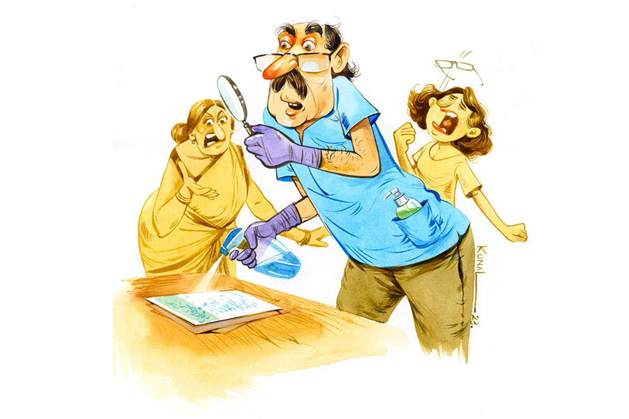

 
 <h1 align=center>শুদ্ধীকরণ</h1>
<h2 align=center>নন্দিতা বাগচী</h2> সন্ধেবেলা বাড়িতে ঢুকেই মেজাজটা খারাপ হয়ে গেল শুদ্ধসত্ত্ব সান্যালের। কাজের মেয়ে টুকিকে জিজ্ঞেস করলেন, “আজ কে এসেছিল রে বাড়িতে?”

টুকি তখন কোল্যাপসিবল গেটে তালা লাগাচ্ছিল। মুখটা ঘুরিয়ে বলল, “কেউ আসেনি তো কাকু।”

ভুরু কোঁচকালেন শুদ্ধসত্ত্ব, “বললেই হল? আমি স্পষ্ট দেখছি জুতোর ছাপ। সারা হলঘরের মেঝে জুড়ে গাড়ির টায়ারের মতো দাগগুলো তবে কিসের? রতন কি আজ গাড়িটা বসার ঘরেই ঢুকিয়ে দিয়েছিল?”

টুকি থতমত খেয়ে বলল, “আমি জানি না, হিয়াদিদি জানে।”

ভুরু কুঁচকে থাকলেও একটা বাঁকা হাসি ফুটে উঠেই মিলিয়ে গেল শুদ্ধসত্ত্বর মুখে, “তার মানে তুইও জানিস। বেশ, তুই জানিস না কে এসেছিল। কিন্তু হিয়া যে জানে, সে কথা তুই জানিস। তাই তো? তা হলে এর মানেটা কী দাঁড়াল?”

কথাগুলো বলতে বলতে দরজার কাছে দাঁড়িয়ে জুতোর ফিতে খুলতে লাগলেন শুদ্ধসত্ত্ব। স্যানিটাইজ়ার স্প্রে করে জুতোর আলমারিতে ঢুকিয়ে দিলেন জুতোজোড়া, মোজা সমেত। সেই ফাঁকে টুকি টুক করে পালিয়ে গেল বাড়ির ভিতরের দিকে।

বাথরুমের দিকে যেতে যেতে হাঁক পড়লেন তিনি, “আবার কোথায় চলে গেলি তুই? সব কথা কি রোজ মনে করিয়ে দিতে হবে? বাথরুমের দরজাটা খুলে দে।”

নিজের দু’হাতের আঙুলগুলো মুকুল মুদ্রায় রেখে বললেন শুদ্ধসত্ত্ব।

রান্নাঘরে জলখাবার তৈরি করছিলেন সুনেত্রা। হাঁকডাক শুনে হন্তদন্ত হয়ে ছুটে এসে বললেন, “আবার কী হল তোমার? বাড়িতে ফিরেই চেঁচামেচি শুরু করলে কেন?”

“কী বলতে চাও? তা হলে কি আমি বাড়িতে না ফেরাই ভাল? তাতেই সবার শান্তি হয়?” গলা চড়িয়ে বললেন শুদ্ধসত্ত্ব।

সুনেত্রা বিড়বিড় করেন, “যত সব অলক্ষুনে কথা! যত বয়স বাড়ছে ততই যেন তিরিক্ষে হচ্ছে মেজাজখানা। আর তেমনি হয়েছে বাতিক। এর পর পাড়ার চ্যাংড়া ছেলেগুলো যখন বলবে, ‘ও দাদু, তোমার মাথায় কাকের ইয়ে’ তখন বুঝবে ঠেলা।”

“কিসের ইয়ে? আমি রাস্তায় ইয়ে মাড়িয়ে এসেছি বলছ? অ্যাঁ! ইস! জুতোজোড়া আবার আলমারিতে ভরে ফেললাম যে!” বিভ্রান্ত শুদ্ধসত্ত্ব।

“কিসের মধ্যে কী, পান্তাভাতে ঘি! আজকাল কানেও তো কম শোনে দেখছি মানুষটা!” বিড়বিড় করতে করতে একতলার বাথরুমের দরজাটা খুলে দিলেন সুনেত্রা।

বাইরের হাতে কিংবা জুতো-ধরা হাতে শুদ্ধসত্ত্ব কখনও বাড়ির বাথরুমের দরজার হাতলে হাত ছোঁয়ান না। আকাশে-বাতাসে উড়ে বেড়ায় কত রকমের বীজাণু। তা ছাড়া অফিসে লিফটের বোতামগুলোয় হাত দিতেই হয়। অ্যাপ ক্যাবের হাতলেও হাত দিতে হয়। লক্ষ লক্ষ মানুষের ছোঁয়া লাগা সে সব অকুস্থল। তাই কোনও রকম ঝুঁকি নিতে চান না শুদ্ধসত্ত্ব। দিনকাল সুবিধের নয়।

হাতদুটো ধোওয়ার পর মাস্কটাও খুলে সাবান দিয়ে ধুয়ে ফেলেন তিনি। তার পর পিছনের ব্যালকনির দড়িতে মেলে দিয়ে একটা ক্লথ-পেগ লাগিয়ে দেন। এ কাজটা নিজে হাতে না করলে শান্তি পান না তিনি। কে কোথায় ঘষটে দেবে বলা যায়?

এর পরের ধাপটা হচ্ছে জুতোর ভিতর থেকে মোজাটা টেনে নিয়ে দোতলায় নিজেদের শোবার ঘরের অ্যাটাচড বাথরুমে ঢুকে পড়া। বিবস্ত্র হয়ে প্রথমেই শার্ট-ট্রাউজ়ার্স-গেঞ্জি-জাঙিয়া-মোজা-রুমাল ওয়াশিং মেশিনে ঢুকিয়ে দেওয়া। তার পর শাওয়ারের তলায় দাঁড়িয়ে সাবান-শ্যাম্পু সহযোগে ক্লেদমুক্ত হওয়া। নিজের শরীরকেই কি বিশ্বাস করা যায়?

সন্ধে সাতটা নাগাদ যখন হলঘরটায় নেমে আসেন শুদ্ধসত্ত্ব, তখন মেজাজটা ফুরফুরে থাকে তাঁর। যেন এক যুদ্ধক্ষেত্র থেকে শত্রুদের বিনাশ করে ফিরছেন তিনি। বাড়িতে কাচা বারমুডা আর টি-শার্টটা যেন গঙ্গাজলে ধোওয়া। আর হাওয়াই চপ্পল জোড়াও যেন বৃন্দাবন থেকে আমদানি করা হয়েছে এইমাত্র।

মোমোর প্লেট আর চায়ের কাপ এগিয়ে দিয়ে সুনেত্রা বললেন, “শার্ট-প্যান্টগুলো রোজ কেচে কেচে জেল্লা নষ্ট হয়ে যাচ্ছে। দু’-এক দিন পরে পরে কাচলে হয় না? আর মোজাজোড়া কী দোষ করল? তারা তো থাকে জুতোর ভিতরে...”

কথা শেষ হয় না সুনেত্রার। বজ্রনির্ঘোষ ভেসে এল উল্টো দিক থেকে, “যা বোঝো না, তাই নিয়ে কথা বোলো না। বন্ধ জুতোর ভিতরটা হচ্ছে ব্যাকটিরিয়া আর ফাঙ্গাসের আঁতুড়ঘর। আলো নেই, হাওয়া-বাতাস খেলে না, উপরন্তু ঘাম হবার ফলে হিউমিড থাকে সর্বদাই। আদর্শ জায়গা তাদের জন্য। প্রতি মুহূর্তে বংশবৃদ্ধি করে চলেছে তারা।”

চায়ে একটা চুমুক দিয়ে আবার বলতে লাগলেন শুদ্ধসত্ত্ব, “আর আমাদের অফিসের সারি সারি ইউরিনালগুলো যদি দেখতে! ওগুলো থেকেও কি ছিটে এসে পড়ে না মোজায়?”

দোতলা থেকে নেমে আসছে হিয়া। তাকে দেখে মুখে লাগাম টানেন শুদ্ধসত্ত্ব। বলেন, “কোথায় ছিলি এত ক্ষণ?”

“কেন, আমার ঘরে!” ভুরুজোড়া কুঁচকে বলল হিয়া।

“সে তো বুঝলাম, কিন্তু কী করছিলি যে, তোর মুখটাও দেখতে পেলাম না বাড়িতে আসার পর থেকে।”

হিয়ার বলতে ইচ্ছে করে, ‘দেখতে পেলেই তো আমার সারা গায়ে স্যানিটাইজ়ার স্প্রে করে দিতে।’ কিন্তু বলে না। তেতো কথা বলতে ভাল লাগে না তার। তাই বলে, “ফোনে কথা বলছিলাম।”

“কেন, অর্ক তো আজ দুপুরে এসেইছিল, সারা দুপুর কথা বলেও আশ মেটেনি?” এক কামড় মোমো মুখে পুরে বললেন শুদ্ধসত্ত্ব। চোখে-মুখে শার্লক হোমসের আত্মবিশ্বাস।

হিয়া মায়ের দিকে কটমট করে তাকাতেই সুনেত্রা চোখ-ভুরু কুঁচকে মাথা নাড়লেন। যার অর্থ তিনি খবরটা রিলে করেননি। আর শুদ্ধসত্ত্ব শান্ত ভাবে বললেন, “অন্য কারও কাছ থেকে খবর শোনার প্রয়োজন হয় না আমার। আমার নিজের চোখজোড়া আছে কী করতে? সারা হলঘর জুড়ে জুতোর ছাপগুলো আর কার হবে?”

তার পর হঠাৎ করেই মনে পড়ে যাওয়ায় চেঁচিয়ে বললেন, “এই টুকি, তুই হলঘরটা মুছিসনি এখনও? শোন শোন, জুতো পরে আর কোথায় কোথায় গিয়েছিল অর্ক? দোতলায় উঠে পড়েনি তো? তবে তো দোতলার সিঁড়ি, হিয়ার ঘর, সব ডিসইনফেকট্যান্ট দিয়ে মুছতে হবে।”

হিয়া বিরক্ত হয়ে বলে, “তুমি এমন করছ না বাবা, যেন অর্ক একটা অচ্ছুত ছেলে।”

প্রবল বিরক্তিতে মোমো চিবোতে চিবোতে শুদ্ধসত্ত্ব বললেন, “অচ্ছুত-ই তো। এখন আর জাতে অচ্ছুত হয় না মানুষ, কাজে-কর্মে পরিচ্ছন্নতার অভাব যার, সে-ই অচ্ছুত। যে স্বাস্থ্যবিধি মেনে চলে না, সেই অস্পৃশ্য। ওই এক মোজা-স্নিকার্স আর জিনস পরে কত দিন থাকে ছেলেগুলো, জানিস? দাঁড়া, দাঁড়া, কোথায় কোথায় বসেছিল ও বল তো? চেয়ারে বসলে চেয়ারটা ডিসইনফেকট্যান্ট দিয়ে মুছতে হবে, আর যদি বিছানায় বসে থাকে তবে বেডকভারটা ওয়াশিং মেশিনে ঢুকিয়ে দে। আমি এখনও চালাইনি ওটা।”

হিয়া প্রচণ্ড রেগে যায়। মুখ লাল করে বলে, “ইউ নো বাবা, ইউ আর সাফারিং ফ্রম ওসিডি, আই মিন, অবসেসিভ কমপালসিভ ডিসঅর্ডার। ইউ শুড কনসাল্ট আ সাইকায়াট্রিস্ট।”

সুনেত্রা বিড়বিড় করে বলেন, “ওসিডি-ফোসিডি নয়, ওটাকে বলে ছুঁচিবাই।”

“আমাকে কিছু বললে?” জিজ্ঞেস করেন শুদ্ধসত্ত্ব।

সুনেত্রা আবারও বিড়বিড় করেন, “আমার ঘাড়ে ক’টা মাথা?” তার পর রান্নাঘরে যেতে যেতে গলা চড়িয়ে বলেন, “না গো, কিচ্ছু বলিনি।”

মা-মেয়ে উঠে যাওয়ার পর টেবিল ছেড়ে উঠে দাঁড়ালেন শুদ্ধসত্ত্ব। নিজের চেয়ারটা টেবিলের তলায় যথাস্থানে ঢুকিয়ে দিলেন। সুনেত্রা আর হিয়া উঠে যাওয়ার পর থেকে তাদের চেয়ার দুটো টেবিল থেকে অনেকটা পিছিয়ে আছে। সেই চেয়ার দুটোকেও যথাস্থানে ঢুকিয়ে দিলেন। টুকি কাপ-প্লেটগুলো তুলে নিয়ে টেবিলের ম্যাটগুলো মুছে দিয়ে গেছে। কিন্তু ম্যাটগুলো ছড়িয়ে ছিটিয়ে পড়ে আছে। সেগুলোরও সামঞ্জস্য বিধান করে তিনি হলঘরে গিয়ে বসলেন।

টিভিটা চালাতে গিয়ে মনে হল, কে জানে অর্ক এসে টিভি দেখেছিল কি না! হয়তো অর্ক আর হিয়া দুপুরবেলা বসে ওটিটি অ্যাপে কোনও সিনেমা দেখেছে। সাবধানের মার নেই। তাই রিমোটটাতে স্যানিটাইজ়ার স্প্রে করে নিলেন। সেন্টার টেবিলের উপরে মোবাইল ফোন রেখেছিলেন অফিস থেকে ফিরে। যদিও নিজের ফোন কাউকে ধরতে দেন না শুদ্ধসত্ত্ব, প্রয়োজনে স্পিকার অন করে দেন। তবুও, সারা দিনে কত ফোন আসে তাঁর নিজেরই। আর চোদ্দো জায়গা ছোঁয়া হাত দিয়েই ধরতে হয় ফোনটা। তাই ফোনটারও শুদ্ধীকরণ প্রয়োজন।

ওঁ অপবিত্রঃ পবিত্রো বা সর্বাবস্থাং গতোঽপি বা।/ যঃ স্মরেৎ পুণ্ডরীকাক্ষং স বাহ্যাভ্যন্তরে শুচিঃ॥

সেন্টার টেবিলের কাচের টপটা স্প্রে করে শুদ্ধ মোবাইল ফোনটা টেবিলের উপরে রাখলেন শুদ্ধসত্ত্ব। তার পর গা-টা এলিয়ে দিলেন সোফায়। যা ধকল যায় সারাটা দিন। তার উপরে কোভিডকালীন ক্ষতি পোষাতে প্রচুর কর্মী ছাঁটাই হয়েছে কোম্পানিতে। তাই তিন জনের কাজ এক জনকে দিয়ে করাচ্ছে। মাইনে বাড়ানোর কথা মুখেও আনা চলবে না, পিঙ্ক স্লিপ ধরিয়ে দেবে কোম্পানি। এ দিকে মেয়েটা হায়ার স্টাডিজ়ের জন্য আমেরিকা যেতে চায়। ইকনমিক্সে ডক্টরাল প্রোগ্রামের অফার আসছে অনেক ইউনিভার্সিটি থেকেই। কিন্তু আগের মতো পুরো স্কলারশিপ দিচ্ছে না কোনও ইউনিভার্সিটি। কোভিডে ক্ষতিগ্রস্ত হয়েছে সারা পৃথিবী। তাই এই বসতবাড়িটা বন্ধক রেখে স্টুডেন্ট লোন নিতে হবে ব্যাঙ্ক থেকে।

চোখ বুজে নানা কথা ভাবছিলেন শুদ্ধসত্ত্ব। সন্তর্পণে বাবার পাশে এসে বসল হিয়া। বলল, “বাবা, অর্ক বলছিল, ওর লোন অ্যাপ্রুভ হয়ে গেছে। ওদের বাড়ির দলিলটা জমা রেখেছে ব্যাঙ্ক। তাই আমাদের বাড়ির দলিলটাও ওকে দেখিয়ে নিল মা। ও বলল, কোনও অসুবিধে হবে না। ওর বাবা তো ব্যাঙ্কের ব্রাঞ্চ ম্যানেজার, তিনিই আমার লোন অ্যাপ্রুভ করার ব্যবস্থা করিয়ে দেবেন।”

আশ্বস্ত বোধ করেন শুদ্ধসত্ত্ব। যাক, একটা ঝামেলা গেল। ছেলেটার অপরিচ্ছন্ন আর বাউন্ডুলে বলে তাকে পছন্দ করেন না ঠিকই, তবে অর্ক করিতকর্মা আছে বেশ। পরিতৃপ্ত মনে মেয়ের দিকে তাকিয়েই টনক নড়ে উঠল তাঁর। চোখ দুটো কপালে তুলে বললেন, “তুই দলিলটা অর্কর হাতে দিয়েছিলি?”

ভীত খরগোশের মতো তিরতির করে কেঁপে উঠল হিয়া। বলল, “আমি না, মা।”

“একই কথা। যে-ই দিয়ে থাকুক, ফাইলটা তো ছুঁয়েছে অর্ক। রাস্তার হাতে দলিলের পাতা উল্টে দেখেছে...” বলতে বলতে হাতে স্যানিটাইজ়ারের বোতল নিয়ে দোতলার শোবার ঘরে চলে গেলেন শুদ্ধসত্ত্ব। লকার থেকে দলিলের ফাইলটা বার করে তার প্রতিটি পাতায় স্যানিটাইজ়ার স্প্রে করতে লাগলেন।

কাজটা সম্পূর্ণ হওয়ার পর নিশ্চিন্ত হয়ে পাতাগুলো উলটে-পালটে পাখার হাওয়ায় শুকিয়ে নিলেন শুদ্ধসত্ত্ব। আর তখনই সবিস্ময়ে লক্ষ করলেন, দলিলের সব সই, সব সিলমোহর, সব ছাপ উধাও।

হাউমাউ করে কেঁদে-ককিয়ে অর্ককে ফোন করল হিয়া। অর্কর বাবা সব শুনে বললেন, “সই বা সিলমোহর না থাকলে ও দলিলের কোনও মূল্য নেই। যত লক্ষ টাকার স্ট্যাম্প ডিউটিই দিয়ে থাকুন তোমার বাবা।”

“এখন কী হবে কাকু?” কান্নায় ভেঙে পড়ে বলল হিয়া।

“ডুপ্লিকেট কপির জন্য অ্যাপ্লাই করতে হবে। তবে জানোই তো, আমাদের সরকারের আঠেরো মাসে বছর। কবে হাতে পাবে তার কোনও স্থিরতা নেই।”