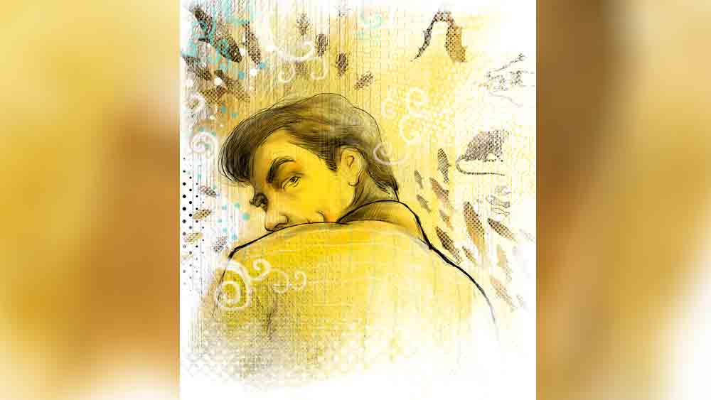

 

<h1 align=center> শুধু ইভার জন্য</h1>
<h2 align=center>সন্দীপ চট্টোপাধ্যায়</h2>
অনেক দিন পর সতুদার সঙ্গে দেখা। ‘নিরিবিলি’ রেস্তরাঁয় একটা টেবিলে বসে খালি প্লেটেই বিলি কাটছিল সে। একা। তবে একই টেবিলে মুখোমুখি আর একটি প্লেটসজ্জা দেখে মনে হল, আরও কেউ আছে বুঝি, সঙ্গী বা সঙ্গিনী। আমাকে দেখে সতুদার মুখে আনন্দ আর বিষাদ যুগপৎ ঝিলিক দিয়ে গেল।   “আরে দীপ্র, বোসো ভায়া...”   “কিন্তু সতুদা, তোমার সামনের আসনে কে? প্লেট কার? তোমার সঙ্গে কেউ আছেন?”   ‘হ্যাঁ’ বলতে গিয়েও ঢোঁক গিলে সতুদা বলল, “ওটা আমার একটা ধারা বলতে পার, রেস্তরাঁয় এলে মুখোমুখি একজনকে বসিয়ে রাখি মনে মনেই। ওয়েটাররা প্রথমে একটু আপত্তি করে, তবে ‘নিরিবিলি’তে কাউকে বলতে হয় না, আমি বসলে সঙ্গে সঙ্গে আমার উল্টো দিকে আর একটা প্লেট পড়ে। তুমি ভায়া আমার বাঁ দিকের চেয়ারটায় বোসো না হয়।”   “খালি প্লেটে কি বিশেষ কেউ...” কথাটা তোলা ঠিক হল কি না কে জানে! সতুদার লাল মুখটা পাংশু হয়ে গেল। দীর্ঘশ্বাসের আওয়াজও আমার কান এড়াল না।   ওয়েটার সতুদার পাতে কবিরাজি কাটলেট পরিবেশন করতে এল।   “তুমি কী নেবে ভায়া?”   “স্রেফ একটা গরম কফি। ওটাই নেশা এ দোকানে। রোজই আসি...”   দুটো কফির অর্ডার দিয়ে সতুদা সিগারেট ধরাল। সতুদা আমাদের পাশের পাড়ায় থাকে। অল্প বয়সে খেলাধুলোর জন্য নামডাক ছিল। ক্রিকেটে জোরে বোলার হিসেবে, ফুটবলে দুর্ধর্ষ সেন্টার ফরোয়ার্ড হিসেবে নানা ক্লাবে খেপ খেলে বেড়াত। আমাদেরই স্কুলে ক্লাস পাঁচেক ওপরে পড়ত। সতুদার উচ্চতা স্কুল জীবনের পর বাড়েনি। গাঁট্টাগোঁট্টা ভাবটা অল্প বয়সে মুগুরটুগুর ভেঁজেই  হয়ে গিয়েছিল। চকচকে ফর্সা, লালচে মুখ, কপালটা একটু বেশিই চওড়া।   “কপাল ভাই, কপাল। কপালে নেইকো ঘি, ঠকঠকালে হবে কী?” স্বগতোক্তি করল সতুদা, তার পর বলল, “তোমরা সুখে ঘরসংসার করছ। বাবা-মা-বৌ-ছানাপোনা... কী যাতনা বিষে বুঝিবে সে কীসে...!” সতুদা দার্শনিক হয়ে গেল।   “মাসিমা চলে যাওয়ার পর সত্যিই খুব একা হয়ে গেছ জানি,” আমি প্রলেপ লাগানোর চেষ্টা করি।   তবে সতুদাকে আমি পাড়ার ডাকসাইটে সুন্দরী ইভাদির সঙ্গে অনেক বার এ দিক সে দিক দেখেছি। যত দূর জানি, ব্যাপারটা ম্যাচিওর করেনি। কাটা ঘায়ে নুনের ছিটে দিতে মনে বাধছিল। কিন্তু কী কাকতালীয়, সতুদাই বলল, “ইভাকে চেনো তো! এলাকার সকলেই চিনত। অমন সুন্দরী তো রোজ জন্মায় না। কালেভদ্রে। বলতে পারো, এই প্লেট ওকে উৎসর্গ করেই সামনে রাখি।”   কাটলেট চিবোতে চিবোতে বলে চলল সতুদা, “ওর বাপের ওই দুই মেয়ে, ডাকসাইটে সুন্দরী দু’জনেই। সকলের হার্টথ্রব, ইভা আর নিভা। ওই ইভা আমার প্রেমে পড়ে গেল কৈশোরেই। তখন আমি দুর্ধর্ষ বোলিং করি। পরপর অপোনেন্টের স্টাম্প ওড়াচ্ছি আর খেলা দেখে বারান্দায় আনন্দে উদ্বেল হয়ে উঠছে ইভা। শীতের দুপুরে আমার কৃতিত্ব ওকেই দু’হাত তুলে সমর্পণ করছি। ইভার তখন বয়স বড়জোর বছর চোদ্দো।”   বললাম, “ইভাদির বাবা বড়বাজারে কী যেন ব্যবসা ছিল। পান খেতেন, পায়জামা-শার্ট আর কালো বুট পরে ঘুরে বেড়াতেন।”   “অতি হারামি চিজ! কিছু মনে কোরো না ভায়া, মুখ খারাপ করে ফেললাম। অন্তরের জ্বালা, বুঝলে না, আমার বুক থেকে ইভাকে ছিনিয়ে নিয়ে গেল মাইরি! মক্ষিচুষ লোকটার মেয়েদের বিয়ে কবে দেবে আর সম্ভাব্য পাত্রদের ধনসম্পত্তির লিস্ট তৈরি— এ ছাড়া কোনও চিন্তা ছিল না। ধারণা ছিল, মেয়েদের সৌন্দর্যের জোরেই রাজপুত্তুররা হামলে পড়বে।”   বুঝতে পারলাম সতুদা ব্যথার কথা আমাকে বলে মনটাকে একটু হাল্কা করতে চাইছে। আমি বাধা দিলাম না, উসকে দিয়ে বললাম, “তুমিও তো পাত্র হিসেবে খারাপ নও, বাবার একমাত্র ছেলে, খেলাধুলোয় ভালে ছিলে, ক্লাবটাব করতে, পাঁচ জন তোমায় চিনত, লেখাপড়াটা কদ্দুর করলে অবশ্য জানা নেই।”   “বি কম পড়তে পড়তে ইভা মাথাটা খেয়ে নিল, ঠিক ইভা নয়, ইভার ওই ইবলিশ বাপটা, ইভার সঙ্গে আমার ইন্টুমিন্টু ওর নলেজে এসে গে‌ছিল। আমার সামনে বলার সাহস ছিল না। মেয়েকে দিয়ে বলাত। আমার রোজগার নিয়ে আমি কী ভাবছি, কবে ঠিকঠাক দাঁড়াব, কবে কোমরের জোরে রাজকন্যে নিয়ে যেতে পারব... এমনি ঘ্যানঘ্যানানি... তার পর ইভা সুন্দরী বলে অনেক ছেলের মা-ই তো ছেলের বৌ করতে চায় তাকে... বেশ চাপে পড়ে গেলাম...”   সতুদা চোখ বন্ধ করে সিগারেটের শেষ ধোঁয়াটা শুষে নিয়ে অ্যাশট্রেতে ঘষে নেবাল।   “বি কমটা শেষ করে আমার মতো সাধারণ মেধার ছেলেদের যা হয় আর কী! ফ্যা ফ্যা বেকার। টো টো কোম্পানি। কখনও কম্পিউটার টাইপ শিখছি, কখনও স্পোকেন ইংলিশ। রোজগারের ঝোঁক ষোলো আনা। খেলাধুলো থেকে অনেকটা ডিটাচড হয়ে গেছি কলেজ ছাড়ার পর। ভাবছি ব্যবসাপাতি করে যদি দুম করে দু’পয়সা বাগানো যায়, তা হলে বাগিয়ে নেব ইভাকেও। বুক চিতিয়ে পুরুর মতো দাঁড়াব ওর বাবার সামনে। এমনই নানা প্ল্যানের ছক যখন মাথায়, অংশু পাত্র বলল, মাছের কারবার করবে। অংশুর মাছের স্টল আছে বাজারে। বলল সে, দিঘা, ডায়মন্ড হারবার এ সব মাছের আড়তে চলে যাবে থোক টাকা নিয়ে, সস্তায় মাছ কিনে কলকাতার বাজারে সাপ্লাই। নগদ লাভ থুতু দিয়ে গুনে নেবে দিনেরটা দিনে।”   জিজ্ঞেস করলাম, “নেমে পড়লে? বাড়িতে কিছু বলল না? টাকাই বা পেলে কোথায়?”   সতুদার কাটলেট শেষের দিকে। নিজের জন্য কফির অর্ডার করে আর একটা সিগারেট ধরাল সে, “আমার বাবা ছিলেন কর্পোরেশনের কেরানি। খরচ থেকে বাঁচিয়েই কিছু জমিয়েছিলেন, টুকটাক জমিজমাও কিনেছিলেন, তবে ওয়ান পাইস ফাদার-মাদার। তবু দিনের লাভ দিনেই ফেরত আসবে শুনে রাজি হলেন। বলব কী দীপ্র, এলও তাই। খাটনি ছিল। রাতভর কাজকারবার, প্রথম বিশ হাজার দু’রাতেই পঁচিশ হয়ে ফেরত এল। সাহস গেল বেড়ে। অংশু পাত্র তার মেদিনীপুরের শ্যালক পটলের সঙ্গে আলাপ করিয়ে দিয়েছিল। ইনভেস্টমেন্ট বাড়তে লাগল। বাবার থেকে পঞ্চাশ হাজার টাকা নিয়ে পটলের সঙ্গে দিঘা এলাম। ভোরের দিকে ট্রলার আসবে দিঘার মোহনায়। ভোরের হাটে বেচাকেনা। ইলিশ, ট্যাংরা, লটে, যা চলে কলকাতায়। অকশনে মাছ কিনে বরফ প্যাকিং করিয়ে ট্রান্সপোর্টে তুলে তবে শান্তি। রাতে উঠেছিলাম এক কমদামি হোটেলে। ঘরে পটলের দুই শাগরেদের সঙ্গে দারু নিয়ে বসলাম। কিন্তু কয়েক পেগের পরেই আমি অচেতন। পরদিন হোটেলের বেয়ারা যখন দরজা ধাক্কা দিয়ে তুলল, তখন বুঝতে পারলাম পটল আর তার চ্যালারা সব মালকড়ি ঝেঁপে হাপিশ। ঘরের ছেলে ঘরে ফিরলাম। জলে গেল টাকা। অংশু পাত্রও চোখ উল্টোল। গণেশ উল্টোনোর দায়ে বাবা ত্যাজ্য না করলেও ওই টাকার শোকে মুহ্যমান হয়ে রইলেন। আর চাইতে সাহস হল না। সামনে রইল নিঃসীম বেকারত্ব। আর ইভা। থেকেও নেই। প্রেমে আছে, স্বপ্নে আছে। ভবিষ্যতের কথা মেয়েরা বড্ড ভাবে, তাদের ছোটবেলা থেকেই ভাবানো হয়। আমার অন্ধকার ভবিষ্যতের সঙ্গে তার ভবিষ্যৎ কেমন করে জুড়বে বাড়ির অনুমতি ছাড়া, তা নিয়ে সে ম্লান হয়ে থাকত। তার সে কষ্ট ক্রমে ক্রমে আমাকে হীনম্মন্যতার তলানিতে ঠেলে দিচ্ছিল।”   একটু জল খেয়ে কাটলেটের শেষাংশ চিবোতে চিবোতে অতীতে ডুবে গেল সতুদা।   “তার পর বুঝলে, বিনা পুঁজির ব্যবসা খুঁজতে লাগলাম। এক জন বললে, আছে তো, ধরবে আর সাপ্লাই দেবে। কী? আরে যত ধরবে, তত তোমার আয়। তার পর ধোঁয়াশা ছেড়ে সে খোলসা করল। আরশোলা আর ব্যাঙ ধরতে পারবে? বিনা পুঁজিতে। ধরবে আর কলেজের ল্যাবরেটরিতে সাপ্লাই দেবে। সে-ই সাহায্য করল। নিয়ে গেল, রেশন দোকানের গোডাউনে। ভায়া হে, আরশোলা নেহাত নিরীহ জীব নয়, প্রথম দিন ধরতে গিয়ে হাতে তাদের কাঁটা রোঁয়া লেগে হাত ছুলে একাকার। তবু ইভার মুখ মনে পড়ল। কিছু করে দেখাতেই হবে। এর পর দিব্যি ধরার কায়দা জেনে গেলাম। কাঁড়ি কাঁড়ি আরশোলা ধরেছি। শিখে গেলাম ব্যাঙ ধরতেও। মাঠে দাঁড়িয়েছি রেচন ক্রিয়ার তাগিদে, চতুর্দিকে কুনোব্যাঙের ডাক। হিসি করা মাথায় উঠল, টপাটপ ব্যাঙ ধরতে লাগলাম, ষাট সত্তরটা মিলে গেল মাঠ থেকেই। কিন্তু রোজ রোজ কত ধরব? এক দিন ছাদের ওপর এক বিরাট জারে অজস্র ব্যাঙ দেখে কলের মিস্ত্রি ইকবাল বলল, সে বস্তা বস্তা ব্যাঙ এনে দিতে পারবে। ইকবালের থেকে এক টাকায় কেনা কুনো ব্যাঙ পাঁচ টাকা করে সাপ্লাই দিতাম ল্যাবে। একদিন ছাদে পেলাম আধমরা একটা বাদুড়। তাই নিয়ে চলে গেলাম মানিকতলায় বিশ্বাসদার কাছে। বিশ্বাসদা ওয়েট স্পেসিমেন সাপ্লাই করতেন। বিশ্বাসদার থেকে নিয়ে জারে-ভরা ফণা-তোলা মরা-গোখরোও সাপ্লাই করেছি। আধমরা বাদুড়টা দরাদরির পর তিনশো টাকায় কিনতে রাজি হল সে। উনিই আমাকে বাদুড়-ঝোলা কিছু পুরনো বাড়ির ঠিকানা দিলেন। ইঁদুর-বাদুড়-সাপ-ব্যাঙ-আরশোলা এক দিকে, অন্য দিকে ইভা।”   “ইভা এক দিন বলল, ‘তুমি কী করছ বলো তো, রেশন দোকানের গদাই বাবাকে বলেছে আরশোলা ধরতে তুমি ওদের দোকানে গেছিলে!’ আমি গম্ভীর হয়ে বললাম, আমার প্রফেশনাল ব্যাপারে নাক গলাতে বারণ করো। তোমার বাবার ধনবান দৌলতদার পাত্র দরকার। কামালেই চলবে। কীভাবে কামাচ্ছি বড় কথা নয়। বাবাকে বলে দিও সতু এক্সপোর্টের ব্যবসা খুলেছে, চিনদেশে ব্যাঙ সাপ্লাই দিচ্ছে। ইভা বলল, ‘হুঁহ! এক্সপোর্ট যারা করে তারা বয়াম নিয়ে রেশন দোকানে আরশোলা ধরবে বলে ঘুরে বেড়ায় না।’   “খুবই ডিসহার্টেনড হলাম, বুঝলে ভায়া। কিন্তু শকুনির মুখ ভেসে উঠতেই চোয়াল শক্ত হয়ে উঠল, কিছু একটা করতেই হবে...” এই বলে গরম কফিতে একটা জোর চুমুক দিয়ে ফেলল সতুদা। সিগারেটে দিল একটা রামটান। তার পর কপালে হাত দিয়ে বসে রইল মিনিট দুই। এ কীসের নীরবতা ঠাহর করতে না পেরে চুপ করে ওর দিকে চেয়ে বসে রইলাম। একটা দীর্ঘশ্বাস ছেড়ে সতুদা খেই ধরল, “রোজগারপাতি খারাপ হচ্ছিল না। কৃষ্ণনগর কলেজে বেশ কিছু বেঞ্চ বানিয়ে সাপ্লাই করলাম। প্যারাফিন ট্রে থেকে ফাইল, ফাইল থেকে সাইক্লো মেশিন— সাপ্লাইয়ের রেঞ্জ বাড়তে লাগল। কলেজ স্ট্রিটে একটা দোকানটোকান খোঁজ করছি, এমন সময় এক খোঁচড় বলল, ‘কঙ্কাল সাপ্লাই দেবেন? নরকঙ্কাল? উত্তরবঙ্গের এক কলেজে রিকোয়ারমেন্ট আছে। পার কঙ্কাল পঁচিশ হাজার। চারটে লাগবে ওদের।’ জোগাড় করব কোত্থেকে? নিয়েই বা যাব কেমন করে? সে ব্যাটা বলল, ‘টাকা দিলে হাসপাতালের মর্গ থেকেই কঙ্কাল বেরিয়ে যাবে আর কঙ্কালের পার্টস খুলে সুটকেসে ভরে নিয়ে যাবেন। লোক যাবে, সে টাকা নেবে আর কঙ্কালদের স্ক্রু দিয়ে আবার ফিট করে দিয়ে আসবে। কঙ্কালের দাম আর যাতায়াত রাহাখরচ মিলে হাজার পঁয়ত্রিশ যাবে আপনার।’   “বুঝলে, সে রাতে ঘুম এল না। তখন পরিবেশবাদীদের ঠ্যালায় ব্যাঙকাটা নিষিদ্ধ। সে সব সাপ্লাই শিকেয়। এরকম লাভের হাতছানি আর ইভার শকুনবাপের মুখ— দুই মনে হতেই রাজি হয়ে গেলাম। পার্টির সঙ্গে কথাবার্তা পাকা হওয়ার পর খোঁচড়ের কথামতোই সুটকেস-ভরা কঙ্কালের হাড়গোড় নিয়ে ট্রেনে। দুর্ভাগ্য, মধ্যপথে বামাল পাকড়াও হলাম। কেস, আদালত, হাজতবাস। মানসম্মান আর ইভা— সবই গেল আমার। ইভার বয়স পঁচিশ তখন, সময়মতো সবকিছু গুছিয়ে এনেও হেলায় হারালাম!   “এর পর পরই শকুন সক্রিয় হয়ে উঠল। ইভার বিয়ে হয়ে গেল। বেশ পয়সাওলা ঘরেই।”   এই অবধি শেষ করে সতুদা গুম হয়ে গেল। ধীরে ধীরে কফি খেতে লাগল। আমিও ওকে আর বিচলিত করতে চাইলাম না। আমার কফি, নিজের কফি আর কাটলেটের দাম দিয়ে উঠতে উঠতে বলল, “এখন সবই আছে ভায়া, যা আগে ছিল না। বাবা যাওয়ার পর, ইনসিওরেন্সের অগাধ টাকা, কৃপণ বাবার প্রচুর সেভিংস আর রমরম করে চলা আমার রেন্ট কারের বিজনেস। শুধু সময়টাই চলে গেছে। সামনের জানুয়ারিতে তেতাল্লিশে পড়ব।”   বললাম, “আজকালকার দিনে এ আর কী বয়স সতুদা! আবার নতুন করে জীবন শুরু করতেই পারো।”   ম্লান হাসল সতুদা।   তার পর আমরা রেস্তরাঁ ছেড়ে রাস্তায়। অটোর লাইনের দিকে যেতে যেতে সতুদা ফিসফিস করে বলল, “একটা কথা তোমায় বলি, কাউকে বোলো না। ইভার বাচ্চাকাচ্চা হয়নি, প্রচণ্ড অশান্তি স্বামীর সঙ্গে। সে কোথা থেকে আমার ফোন নম্বর জোগাড় করেছে আর ইদানীং থেকে থেকে ফোনও করে চলেছে আমায়। কী যে করি, বুঝে উঠতে পারছি না...”   আমি অবাক হয়ে চেয়ে রইলাম সতুদার দিকে।      