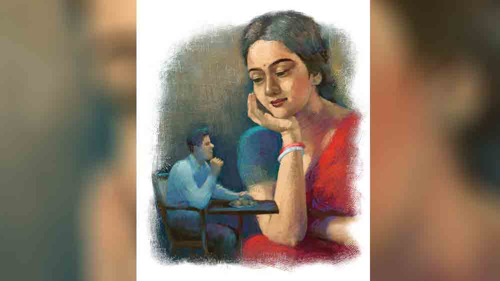

 

<h1 align=center>শেষ পর্যন্ত</h1>
<h2 align=center>মহুয়া চৌধুরী</h2>
এয়েছিল কেউ?’   প্রশ্নটা আজও ঠোঁটের দোরগোড়া অবধি এসে হাজির হতেই পল্টু কোঁত করে গিলে নিল সেটাকে। এই এক প্রশ্ন পর পর দু’দিন শুনেই, কাল ঝাঁজিয়ে উঠেছিল মালতী। পল্টুর হপ্তাদুয়েক আগের বিয়ে করা বৌ।   “আসবেটা কে? কোন পিরিতির মানুষ আছে আমার কোন চুলোয়?” কথায় বলে, বার বার তিন বার! আর হ্যাজানো উচিত নয়। কিন্তু মনটা...   বিয়ে হয়েছে গাঁয়ে নিজেদের বাস্তুভিটে থেকে। আচার-অনুষ্ঠান মিটতে গত রোববার বৌ নিয়ে ফিরেছে পল্টু। টোনাটুনির সংসার। এ ক’দিনের মধ্যেই সে বুঝে নিয়েছে বৌয়ের মেজাজটা চড়ার দিক ঘেঁষা।   তা ঠোঁটের ও পারের কথা তো কেউ শুনতে পায় না, তাই হাসি হাসি মুখে ভুরু নাচিয়ে মালতী বরকে বলল, “কাপড়-জামা ছেড়ে এসো গে। একটা নতুন খাবার করেছি আজ।”   মনের ভেতরের সেই ‘কিন্তু’টাকে চাপতে গিয়ে পল্টু একটা বোকাটে রসিকতা করে ফেলল, “শুধু ছেড়েই আসব? না কি তার বদলে আর 
কিছু পরে?”   “ঢ-অ-অং!” ঠোঁট উল্টে টেনে টেনে বলল মালতী।   একটু পরেই স্টিলের রেকাবি করে সদ্য-ভাজা কয়েকটা লোভনীয় চেহারার খাদ্যবস্তু নিয়ে ঘরে ঢুকল।   “কী এগুলো?”   “বলব কেন? খেয়ে দেখো!” বৌয়ের চোখে কটাক্ষ। ঠোঁটে রহস্য। কপালে কালো টিপ। সে টিপের চার ধার ঘিরে ঝুরো চুলের ওড়াউড়ি। পরনে নতুন লাল শাড়ি। খাস্‌সা! মেয়েমানুষ যেমন হতে হয়! ক্ষণিকের জন্য সেই খচখচ করতে থাকা ‘কিন্তু’টাকে ভুলে গদগদ হয়ে পল্টু বলল, “লাল শাড়িতে তোমাকে হেব্বি লাগে। মাইরি বলছি।”   ও মা! বৌ বিদ্রুপের হাসিতে কুটিকুটি! শাড়ির আঁচলটা দু’আঙুলের ডগায় পল্টুর নাকের সামনে তুলে নেড়ে নেড়ে বলল, “লাল? এটা লাল? সাধে কি বলে ব্যাটাছেলে রংকানা! এটা রানি কালার তা-ও জান না?”   ‘রানি’ যে আবার রঙের নাম হতে পারে, তা পল্টুর জ্ঞানের অগোচর ছিল। যদিও এতে বিশেষ গুরুত্ব না দিয়ে, বৌয়ের হাসির লহর আর নিটোল হাতের ভঙ্গিমার দিকে মুগ্ধ হয়ে খানিক চেয়ে রইল সে নিজেরই অজান্তে। তক্ষুনি আবার ওই ‘কিন্তু’র খোঁচা। অন্যমনস্ক হয়ে প্লেট থেকে একটা গোলাকার বস্তু তুলে বড় একখানা কামড় দিয়েছে সবে, অমনি “উহুহুহু...আহ আ আ আ...” মুখ থেকে আধচিবোনো খানিকটা বেসন-মোড়া ফুলকপি উগরে দেওয়া। তার পর জিভ বার করে কয়েক সেকেন্ড ধরে শুধুই হা হা আওয়াজ।   বৌয়ের চোখেমুখে স্পষ্ট বিরক্তি, “রকম দ্যাখো না! আরে বাবা জুড়োতে সময় দেবে তো!”   তা মিনিট খানেকের মধ্যে জুড়ল বটে, সে ফুলকপির বড়া। কিন্তু ‘ভাল’ ‘মন্দ’ কিছু বলার কথা আর মনেই রইল না পল্টুর। বৌয়ের প্রশ্নের একটা উল্টো জবাব দিয়ে তাড়া খেল।   “মনটা থাকে কোথায়? হতভাগা বন্ধুগুনোর কাছে যেতে প্রাণ কাঁদছে বুঝি?” তার পরই অভিমানী ডায়ালগ, “তা যাবে তো যাও না। আমি কি তোমায় বেঁধে রেখেছি!” তারও পরে দাঁতে দাঁত পিষে নিচু গলায় স্বগতোক্তি, “যতই করো না কেন, ব্যাটাছেলের মন পাওয়া ভার—”   অতএব পল্টুর সাহসের প্যারামিটার শূন্য পেরিয়ে মাইনাসে ধাবমান। বৌকে হাত ধরে টেনে বসাল। অতঃপর কথায় ও কাজে ভালবাসার নিদর্শন পেশ। সব কিছুই তো ঠিকঠাক। কোত্থাও কোনও গড়বড় নেই। সুভাষ, অনিল, ইন্দর তাদের বিবাহ-পরবর্তী অভিজ্ঞতা 
যা যা বলেছিল মিলে যাচ্ছে তো সবই। শুধু...   ওরা ফিরেছে তা-ও তো পাঁচ দিন পেরোল। জানা কথা, পল্টু কাজে বেরোলে বৌ ঘরে একা! পাড়াটা শুনশান। কেউ কারও সাতে-পাঁচে থাকে না। তবুও কেন যে এখনও পর্যন্ত... তাই থেকে থেকে সেই ‘কিন্তুটা’ গোল জুড়েছে!   পল্টু একটু মুখচোরা হলেও উদ্যোগী পুরুষ। হিসেবপত্তরে তুখোড়। তার স্টেশনারি দোকানটা  মোটামুটি চলতে শুরু করেছে সবে। কিন্তু নারীজাতি সম্বন্ধে জ্ঞানগম্যি সবই এত কাল অবধি ছিল পরোক্ষ অভিজ্ঞতাভিত্তিক।   উচ্চ মাধ্যমিক দিয়ে সে বাড়িতে যখন ঘোষণা করেছিল চাষের কাজে মন নেই, টাউনে গিয়ে ব্যবসা করতে চায়, তখন মা একটু কেঁইকেঁই করেছিল বটে, কিন্তু বাবা এক কথায় রাজি। বলেছিল, “তা বেশ কথা। খেটেপিটে ব্যবসাটা দাঁড় করাতে পারলে, লাভ বই ক্ষেতি নেই। চাষের কাজে আজকাল ঢাকের দায়ে মনসা বিকিয়ে যায়। সব্বস্য ওই ব্যাপারিদের গভ্‌ভে ঢালা।”   বাবার বিষয়বুদ্ধি আছে। পাকা লোক। আটঘাট বেঁধে কাজ করতে জুড়ি নেই। নিমাইখুড়োকে বলে, ট্রেড লাইসেন্স, ব্যাঙ্ক-লোনের খবর আনা, দোকান ঘর খোঁজা সবের ব্যবস্থা করেছে। মায় বাতাসিপুরের জমিটুকু বেচে, সস্তা দরে টাউনের কোণঘেঁষা এই দু’কামরার ঘরটুকু পর্যন্ত কিনে দিয়েছে ছেলের জন্যে। বলেছে, “ও একফসলি জমি থাকাও যা, না থাকাও তা। শুদুমুদু ভাড়ায় টাকা গচ্চা দিবি কেন? তার চেয়ে একটা পাকাপাকি আস্তানা থাকুক শহরে।”   পল্টু বরং বলেছিল, “ঘরের দরকার কী? ডেলি প্যাসেঞ্জারি তো কত লোকই করে!”   বাবা মুচকি হেসেছে, “যেতে তিন ঘণ্টা, আসতেও তিন। তোদের একেলে সুখী শরীর। ভিড় ট্রেনে দলাই-মলাই হয়ে রোজ যাওয়া আসাতেই নেসকে যাবি বাপ। ব্যবসা দেখবি কখন? তা ছাড়া রতনও কাছেপিটেই বাসা ভাড়া নিয়ে 
থাকে। দরকারে অদরকারে পাশে পাবি যাই হোক।”   রতন হল পল্টুর পিসতুতো দাদা। বিয়ে-থা করেনি। ওসবে নাকি মতি নেই তার। কোন এক মুক্তানন্দ বাবার মন্ত্রশিষ্য। কী এক ঢপের ‘গরমেন্ট’ আপিসে কেরানিগিরির। যখন ইচ্ছে কাট মারে। বলে, “জপতপ করেই জীবন কাটাবে।”   আগে পল্টুও তাই বিশ্বাস করত।   তবে সত্যি কথা, গত পাঁচ বছর ব্যবসা দাঁড় করানোর তাগিদে খুব খেটেছে পল্টু। বলতে নেই,  মা লক্ষ্মী চোখের কোণে তাকিয়েছে এ বার তার দিকে। কিন্তু আর এক সমস্যা মাথা চাড়া দিয়েছে ক্রমশ। রান্নাবান্না ব্যাপারটা আসে না তার। গাঁয়ে থাকতে মা ভাত বেড়ে মুখের সামনে ধরেছে বরাবর। একমাত্র ছেলেকে রান্না শেখাবার দরকার পড়তে পারে, একথা দুঃস্বপ্নেও ভাবেনি। অথচ হাজার আকুলিবিকুলি করলেও, স্রেফ ভাত রাঁধার জন্যে গাঁয়ের বাড়ি ছেড়ে মায়ের পক্ষে পাকাপাকি ভাবে এখানে এসে থাকা সম্ভব নয়। চাষি মানুষের ঘরে হরেক দায়-দায়িত্ব।   অতএব ‘অন্নপূর্ণা কেবিন’-এর নিত্যদিনের খরিদ্দার হতে হয়েছে পল্টুকে। তেলে-ঝালে ভরপুর সে খাবার গোড়ায় হাপুসহুপুস করে চেটেপুটে খেয়েছে মনের আনন্দে। ক্রমশ দেখে, মাছের কালিয়া, মাংসের ঝোল, ফুলকপির ডালনা সবই স্বাদে গন্ধে একে অন্যের রেপ্লিকা। কিছুর সঙ্গে কিছুর ফারাক নেই। তার চেয়েও গুরুতর ব্যাপার, শরীর বাদ সাধছে। বুকজ্বালা, গলাজ্বালা, চোঁয়াঢেঁকুর। অতএব মায়ের পরামর্শমতো প্রেশার কুকারে চাল, ডাল, আলু একত্রে সেদ্ধ করে ঘি, তেল, লঙ্কা মেখে খাওয়া। এবং তিন দিন যেতে না যেতেই ঘোরতর অরুচি। ওই ঘ্যাঁটসেদ্ধর গন্ধ পেলেই ওয়াক ওঠে। তখন আবার অন্নপূর্ণা কেবিন। এই ভাবে অম্বল আর অরুচি চক্রাকারে চলতে থাকে তার শহরবাসের একা-বোকা জীবনে। মায়ের হাতের সুক্তুনি, মোচার ঘণ্ট, কাদা চিংড়ির বড়া স্বপ্নে হানা দেয়। এমনই স্পষ্ট সে সব স্বপ্ন যে, ঘুম ভাঙার পরও যেন তাদের সুগন্ধের রেশ রয়ে যায় ঘরের হাওয়ায়।   এ সমস্যার সহজ সমাধান অনেক দিন ধরেই ঘুরপাক খাচ্ছিল মায়ের মাথায়। কিন্তু কঠোর বাস্তববাদী বাবা কান দেয়নি তখন, “আগে ধারধোর মিটুক। নিজের পায়ে দাঁড়াক। তার পর ও সব কথা।”   এ বার কালীপুজোর সময় পল্টু দেশের বাড়িতে পা দেওয়া মাত্র বাবা জিজ্ঞেস করেছে, “ভাবের মেয়ে আছে না কি কেউ? থাকলে নুকোবিনি। সোজা কথার সোজা জবাব দে।” পল্টু ব্রীড়াবনত, “কী যে বলো!”   তখনই চন্দনপিঁড়ি গাঁয়ের মালতীর কথা তুলেছে বাবা। চেনা সচ্ছল ঘর। মেয়ের বাপ আগেই প্রস্তাবটা দিয়েছিল। তখন থেকেই মালতীকে পছন্দ ছিল নাকি বাবার! খুব করিতকর্মা সে মেয়ে। দেখতে-শুনতে ভাল। মাধ্যমিক পাশ। আবার কী চাই? কিন্তু ছেলের ভাবগতিক না জেনেশুনে কোন মুখে কথা দেয়?   এর পর আর কিছুতে আটকায়নি। এক রোববারে নিয়মরক্ষের মেয়ে দেখতে যাওয়া। বাবা সে দিন রতনদাকেও ডেকে নিয়েছিল। বাবার খুব পেয়ারের ভাগ্নে।   পল্টু ভাবে বাবার এত বুদ্ধি, তবু রতনদার নামে গলে জল। মা কখনও গজগজ করে কিছু বলতে গেলে দাবড়ে থামিয়ে দেয়। অবিশ্যি পল্টুও কি অতশত জানত? পরে চোখ ফুটেছে তার।   মালতীকে দেখে পল্টু একেবারে ‘ফ্ল্যাট’। আলো ঝলকানো রূপ আর সেই সঙ্গে সে কী অলোকসামান্য স্মার্টনেস। ক্লাস ইলেভেনে বাংলার জ্যোতিস্যরের কাছে শব্দটার মানে জেনেছিল পল্টু। বাকি সকলকে পায়ে হাত দিয়ে প্রণাম, শুধু তার চোখে চোখ রেখে হাত তুলে নমস্কার। উল্টে নমস্কার করার কথা খেয়ালই হয়নি পল্টুর। কেবল চেয়ে চেয়ে দেখেছিল নীল ব্লাউ‌জ়ের ফাঁকে কেমন জ্বলজ্বল করছে সোনারঙা হাত আর গলার খাঁজ। আহা হা! প্রতিবার প্রণামের সময়ে সুঠাম কোমরের সে কী ওঠাপড়ার দোলন।   রতনদাকে প্রণাম করতে গেলে, “থাক থাক!” বলে বুদ্ধের বরাভয় মুদ্রার পোজ় দিল। বাড়ি ফিরে বাবা, “কী রে, কেমন দেখলি?”   জিজ্ঞেস করায়, হাত উল্টে উদাসীন ভাবে তার জবাব, “যার সঙ্গে থাকবে, তার পছন্দ হলেই হল।”   কেমন বেসুর বাজল পল্টুর কানে। অমন মেয়ের কোন খামতি ধরা পড়ল রতনদার নজরে? ইদানীং তার সঙ্গে সম্পর্কটা ওপর ওপর। তাই কিছুতেই আর জিজ্ঞেস করে উঠতেও পারল না। খচখচানির সেই শুরু।   বিয়েতে ধুমধাম মন্দ হয়নি। মাইকে গান বাজানো পর্যন্ত। তাদের আয়পয় এখন ভাল। বাড়ির একমাত্র ছেলের বিয়েতে ধুম করবে না তো কী! ওদের গাঁয়ের বিয়েতে এই প্রথম চিলি চিকেন খেল লোকে। তার ওপর 
এমন সুন্দরী বৌ। গাঁ জুড়ে ধন্যি ধন্যি রব উঠেছিল।   পল্টুর শহরের বন্ধুরা দল বেঁধে এসেছিল, যে যার বৌ সমেত। মাঝেসাঝে, পল্টুর ওখানকার ঘরে, দিশি বিয়ার যোগে, এদের জমাটি আড্ডা বসে। আগে রতনদাকেও ডাকত পল্টু সে আসরে। সেই সূত্রে এক সময়ে এদের সঙ্গে বেশ দহরম-মহরম হয়েছিল রতনদার। তবে সে আঠা ধোপে টেকেনি। এখন আর রতনদাকে ডাকা হয় না। তাকে নিয়ে যাকে বলে কিছু ‘স্ট্যান্ডিং জোকস’ চালু হয়েছে পল্টুর বন্ধুমহলে।   বিয়েতে এসে খুব হইহুল্লোড় করল তারা। রতনদা বিয়েবাড়ির কাজ নিয়ে ব্যতিব্যস্ত, গম্ভীর। দূরে দূরে থাকছিল। যেন বিশেষ কথাবার্তা বলার ফুরসত নেই। চোখে চোখে ইশারা করে হেসেছিল ওরা। ইন্দর মুখ খারাপ করেছিল চাপা গলায়।   অনিলের বৌ তপতী সবচেয়ে ফিচেল। বিয়েবাড়িতে পল্টুকে একটু আড়ালে ডেকে বাকি বৌদুটোকে সাক্ষী রেখে মিচকে হেসে বলল, “সে পল্টুদা, তুমি নিজের বৌয়ের রূপের দেমাকে যতই কলার তোলো বাপু— যত ক্ষণ পর্যন্ত না আমাদের মতো পরীক্ষায় পাশ করছে— হুঁ বাবা, আসল সাট্টিফিকেট পায় কি না দেখি, তবে তো...” মেয়ের দল হেসে সারা।   কথাটা থেকে থেকে মনে পড়ছে পল্টুর আর তাকে অন্যমনস্ক দেখলেই, মালতী রাগ করে বলছে, “তুমি যে এমন ব্যাজারমুখো কে জানত? আমায় পছন্দ হয়নি, আগে বললেই পারতে!” হাঁ হাঁ করে উঠে মানভঞ্জন করতে হয়েছে পল্টুকে। বেচারা করে কী? কাপড়ের চোরকাঁটার মতো  সেই ‘কিন্তু’টা যে খচখচ করে চলেছে ক্রমাগত। এ কি কাউকে বলার?   হঠাৎ করেই বড্ড গরম পড়েছে। ঘেমেনেয়ে বাড়ি ফিরল পল্টু। মালতী যেন আজ উদ্‌গ্রীব হয়ে অপেক্ষা করছিল জানলার সামনে। দূর থেকে দেখেই দরজা খুলল। ফর্সা মুখ চাপা হাসিতে লালচে।   “কী হয়েছিল জানো?” পল্টুর উত্তরের অপেক্ষা না করেই দমকে দমকে হাসি মালতীর, “মরণ দশা—বুড়ো ভাম— পেটে পেটে এত গুণ! ঠিক দুকুরবেলা এসে হাজির! আমি তো শরবত 
করে এনেছি...”   ‘কে এসে হাজির’ জিজ্ঞেস করতে গিয়ে আর মুখে বাক্যি সরে না পল্টুর। আশায় আশায় তাকিয়ে থাকে।   হাসির ধাক্কায় কথা শেষ করতে পারছে না মালতী, “ও মা বলে কি জানো! বলে কি না— মালতীবৌ, গোড়ার দেখার দিন থেকেই তোমায় ভালবেসে ফেলেছি!” হাঁসফাঁস করতে করতে কপাল ঠুকে পাদপূরণ করে ফেলে পল্টু। তার মন জানে, দুপুরের আগন্তুকটি কে।   ঝটিতি হাসি থেমে যায় মালতীর। দু’চোখ ছানাবড়া, “কী করে জানলে?” আহ্লাদে আটখানা হয়ে এই প্রথম বড় নিশ্চিন্তে বৌকে জড়িয়ে ধরে পল্টু। তার পর সেই ফুটন্ত পদ্মের মতো মুখে পাক্কা বঙ্কিমি কায়দায় একরাশ— আ ছি ছি ছি!   পল্টুর সঙ্গে সুর-তালের সম্পর্ক নেই কোনও কালে। তবু বুকের পাথর নেমে গেলে গলা ফাটিয়ে গাইতে সাধ জাগে। যাক বৌটা তার পাশ করে গেল শেষ পর্যন্ত!
