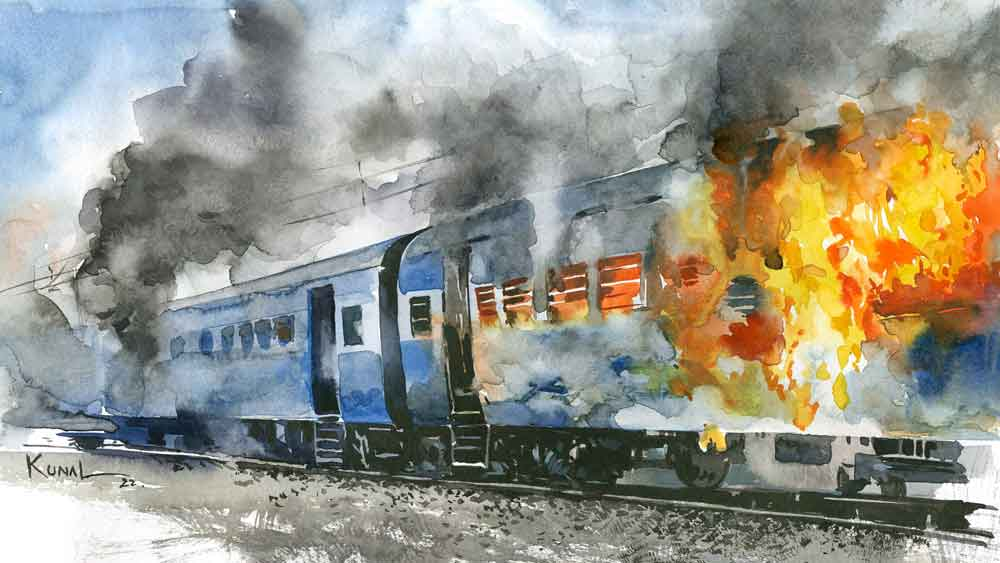

 
 <h1 align=center>শেষকৃত্য</h1>
<h2 align=center>প্রতাপ কোনার</h2> ইলাহাবাদ স্টেশনে একটা ঝোলা নিয়ে দাঁড়িয়ে ছিল লোকটা। প্রচণ্ড গরম আর ক্লান্তিতে ভারী কষ্ট হচ্ছিল তার। রাত একটা কুড়ি নাগাদ হাওড়া যাওয়ার একটা ট্রেন আসার কথা। ট্রেনটার জন্য অপেক্ষা করছে সে। আজ সে বাড়ি যাবে। বাংলার এক গ্রামে তার বাড়ি। লোকটা ট্রেনে নানা রকম জিনিসপত্র বিক্রি করে, অনেক দিন পর পর বাড়ি যায়। নিজের গ্রামে গিয়ে পিতৃপুরুষের ভিটেটা শুধু এক বার দেখে আসে সে। সেখানে দিন দুই-তিন কাটিয়ে আবার ফিরে আসে চলমান ট্রেনে তার ছন্দের জীবনে। প্রায় সারাটা জীবন তার ট্রেনে কাটলেও জীবনে টিকিট কখনও কাটতে হয়নি তাকে। খানিক পরে বহু দূরে একটি আলোকবিন্দু দেখতে পেল লোকটা। ক্রমশ বড় হতে হতে কাছে আসছে সেটা।

মঙ্গলবার সকালে চা খেতে খেতে রোজকার মতো টিভিতে নিউজ় দেখছিল অরিত্র। সেখান থেকেই দুঃসংবাদটা পেল সে। ঠিক চার দিন আগে অরিত্রর বাবা সত্যবান মুখোপাধ্যায় কানপুর গিয়েছিলেন অফিসের কাজে। কাজ শেষ করে গতকাল রাত এগারোটায় কানপুর থেকে হাওড়ায় আসার জন্য যে ট্রেনে তিনি চড়েছিলেন, আজ ভোররাতে বারাণসী স্টেশনের কিছুটা আগে ওই ট্রেনটির এসি কামরার একটি কম্পার্টমেন্টে হঠাৎই আগুন লেগে যায়। গার্ডের কাছ থেকে খবরটা পেয়ে ড্রাইভার যথেষ্ট তাড়াতাড়ি ট্রেনটা থামিয়ে দিয়েছিলেন। ফলে আগুন বেশি ছড়াতে পারেনি। কিন্তু কামরাটির যে কম্পার্টমেন্টে আগুনটা প্রথম লাগে, তার ছ’জন যাত্রীই ঘটনাস্থলে মারা যান। তা ছাড়াও ওই কামরার অনেকেই অগ্নিদগ্ধ হন এবং বেশ কিছু যাত্রী পরে হাসপাতালে মারা যান। ঝলসে যাওয়া দেহগুলি চেনা না গেলেও রিজ়ার্ভেশন লিস্ট অনুযায়ী সম্ভাব্য মৃতদের নাম ঘোষণা করা হয়। সেই তালিকায় সত্যবান মুখোপাধ্যায়ের নামটাও ছিল, কেননা তিনি ছিলেন ওই পুড়ে যাওয়া কম্পার্টমেন্টেরই এক যাত্রী।

খবরটা পাওয়ার সঙ্গে সঙ্গে অরিত্র এই দুর্ঘটনার জন্য রেলের তরফে দেওয়া হেল্পলাইনে যোগাযোগ করে। তার পর ওর বন্ধু ঋক আর বাবার সহকর্মী শুভজিৎ সান্যালকে সঙ্গে নিয়ে বিকেলের ফ্লাইটে বারাণসীতে নেমে চলে এসেছিল সেই হাসপাতালে, যেখানকার মর্গে রাখা ছিল দুর্ঘটনায় মৃতদের দেহ। কিন্তু বীভৎস ভাবে ঝলসে যাওয়া ওই দেহগুলির মধ্যে থেকে সত্যবানকে শনাক্ত করা সম্ভব হয়নি অরিত্রর পক্ষে। সে কারণে ডিএনএ টেস্টের জন্য অরিত্রর শরীর থেকে স্যাম্পল কালেক্ট করা হয়েছিল। দু’দিন পর, শুক্রবার জানা গিয়েছিল— একটি দেহের সঙ্গে মিলেছে তার ডিএনএ। সে দিন হাসপাতাল থেকে বাবার দেহ পাওয়ার পর সব কাজকর্ম মিটিয়ে রাতের ফ্লাইটেই ফিরে এসেছিল ওরা। গৃহপুরোহিতের নিদান অনুযায়ী দাহকাজের তিন দিনের মাথায়, অর্থাৎ রবিবার সত্যবান মুখোপাধ্যায়ের পারলৌকিক কাজ সম্পন্ন করেছিল অরিত্র। বাবার কয়েক জন সহকর্মী, কিছু আত্মীয়স্বজন আর পাড়াপ্রতিবেশীরা উপস্থিত ছিলেন।

পরদিন সন্ধেয় ফাঁকা বাড়িটায় খুব একা লাগছিল অরিত্রর। উঁকি দিয়ে দেখল, মা একা চুপচাপ বসে আছে ঠাকুরঘরে। পায়ে পায়ে বাইরে বেরিয়ে এসে বাড়ির বাঁধানো‌ উঠোনটায় দাঁড়িয়ে দোতলায় বাবার ঘরটার দিকে একদৃষ্টে চেয়েছিল অরিত্র। বট্যানি অনার্সের ফাইনাল ইয়ারের ছাত্র অরিত্র ওর বাবা-মায়ের বেশি বয়সের সন্তান। সত্যবান আর রিনা মুখোপাধ্যায়ের বিয়ের প্রায় আট বছর পরে এসেছিল সে— তাও রিনার দীর্ঘকালীন ইনফার্টিলিটি ট্রিটমেন্টের পরে। বাবা-মায়ের অত্যন্ত স্নেহের অত্রি আর বাবা-মা— এই তিন জনকে নিয়ে তৈরি ত্রিভুজটার একটা বাহু মুছে গেল অসময়ে, ফাঁকা হয়ে গেল একটা দিক। ত্রিভুজটা আর ত্রিভুজ রইল না। এর পর যে দিন মা চলে যাবে, অরিত্র হয়ে যাবে দিশাহীন একটা সরলরেখা। আচমকা সদর দরজায় কড়া নাড়ার আওয়াজে চটকা ভাঙল অরিত্রর। কে এল এখন এই এত রাতে? যেই আসুক, ডোরবেল না বাজিয়ে দরজার কড়া নাড়ছে কেন? এমন অদ্ভুত ছন্দে কড়া নাড়ার অভ্যাস তো এ বাড়িতে এক জনেরই ছিল!

দ্রুতপায়ে দরজার দিকে এগিয়ে গিয়ে দরজাটা খুলে আগন্তুককে দেখে হতভম্ব হয়ে গেল অরিত্র। মুখ দিয়ে একটাও কথা সরল না তার। দরজা ঠেলে ভিতরে ঢুকতে ঢুকতে সত্যবান মুখোপাধ্যায় বললেন, “কী ব্যাপার অত্রি? তুই কি আমাকে চিনতে পারছিস না?”

“বাবা, তুমি!” অস্ফুটে বলল অরিত্র। তার পর চিৎকার করতে করতে বাড়ির মধ্যে দৌড়ল সে, “মা! মা! তুমি কোথায়? শিগগির এস! দেখো, বাবা এসেছে!”

অরিত্রর হাঁকডাক শুনে দৌড়ে এসে স্বামীকে দেখে ঝরঝর করে কেঁদে ফেললেন রিনা। আর স্ত্রীর বৈধব্যের সাজ দেখে বিস্ময়ে হতবাক হয়ে গেলেন সত্যবান। বললেন, “এ কী! এ কেমন সাজ তোমার? অত্রি, তুই-ই বা মাথা কামিয়েছিস কেন?”

“শুধু কি মাথা কামিয়েছি? ন্যাড়া হয়ে লোকজন নেমন্তন্ন করে তোমার শ্রাদ্ধশান্তিও তো করে ফেললাম!” বিরস মুখে ধীরে ধীরে বলল অরিত্র।

“মানে! কী বলছিস তুই?” ভারী অবাক হয়ে বললেন সত্যবান।

“সব বলছি, আগে ঘরে এসে বোসো তো,” অরিত্র বলল।

ট্রেন দুর্ঘটনার পর থেকে যা যা ঘটেছে, বাবাকে আদ্যোপান্ত বলে গেল অরিত্র। সব শোনার পর নিস্তব্ধ হয়ে বসে রইলেন সত্যবান।

“কিন্তু তুমি কোথায় ছিলে এত দিন? আমাদের কোনও খবর দাওনি কেন?” বললেন রিনা।

“সে অনেক গল্প,” সত্যবান বললেন, “সে দিন ভোরে হঠাৎ ঘুম ভেঙে গেল আমার। আমার ছিল মিডল বার্থ। মোবাইলে দেখলাম সবে চারটে বেজেছে। মোবাইলটা বালিশের পাশে রেখে নীচে নামলাম টয়লেটে যাব বলে। নামতে গিয়ে কার গায়ে যেন পা লেগে গেল। দেখি কম্পার্টমেন্টের মাঝখানের মেঝেয় কে এক জন শুয়ে আছে। এসি কামরা হলেও বিহার উত্তরপ্রদেশে এ সব চলে। টয়লেট থেকে বেরোনোর সময় দরজাটা খুলতেই এক ঝলক কালো ধোঁয়া এসে ঝাপটা মারল নাকেমুখে। নিঃশ্বাস যেন বন্ধ হয়ে এল আমার। মাথা ঘুরে গিয়ে টয়লেটের মধ্যেই পড়ে গেলাম। মাথার পিছনটা কিসে যেন ঠুকে গেল সজোরে। তার পর আর কিছু মনে নেই।

“ওখানে অজ্ঞান হয়ে কত ক্ষণ পড়েছিলাম জানি না। জ্ঞান ফেরার পর টয়লেট থেকে বেরিয়ে দেখি সকালের আলো ফুটে গেছে। কামরাটা জলে জলময় হয়ে আছে। লোকজন দৌড়াদৌড়ি করছে। মনে হয় উদ্ধারকাজ চলছিল তখন। কিন্তু আমি তো কিছুই বুঝতে পারছিলাম না। ওই ভিড়ে গা ভাসিয়ে আমিও নেমে পড়লাম ট্রেন থেকে। আমাকে আলাদা করে কেউ লক্ষ করল না। বাইরেটা ভিড়ে ভিড়াক্কার। দমকলের লোকজনও রয়েছে। সাদা চাদরে ঢাকা কয়েকটা দেহ সারি দিয়ে শোয়ানো রয়েছে। কিন্তু বুঝতে পারলাম না ওই পোড়া কামরার টয়লেটে আমি কী করছিলাম! সত্যি কথা বলতে কী কোনও কিছুই আমার মনে পড়ছিল না। আমি কে? কোথা থেকে এসেছি? কেন এসেছি? কোথায় যাব? ...মাথাটা কেমন যেন ভারী হয়ে ছিল আমার।

“স্মৃতিভ্রংশ... অ্যামনেশিয়া,” বলল অরিত্র।

“সে রকমই কিছু একটা হবে হয়তো। মাথায় চোট লেগেছিল তো। তবে বুঝতে পারলাম, ট্রেনটা যে দিকে যাচ্ছিল সে দিকের টয়লেটে গিয়েছিলাম বলেই বেঁচে গিয়েছি। উল্টো দিকের টয়লেটটায় গেলে ঝলসে যেতাম। কারণ আগুন তো হাওয়ার দিকেই দ্রুত ছড়িয়ে পড়ে।”

“ভগবান রক্ষা করেছেন!” শিউরে উঠে কপালে জোড়হাত ঠেকান রিনা।

“সে তো বটেই!” বললেন সত্যবান, “তার পর জামাপ্যান্টের পকেট হাতড়ে অনেকগুলো টাকা আর আমার প্যানকার্ড পেলাম। মোবাইলটা শোয়ার সময় ব্যাগের সাইডপকেটে রেখেছিলাম। সে সব তো আর পেলাম না। প্যানকার্ডে নিজের নামটা দেখলাম, কিন্তু আর কিছুই মনে পড়ল না। হাঁটতে হাঁটতে ওই চত্বর থেকে বেরিয়ে একটা রিকশা নিয়ে বারাণসীর একটা হোটেলে এসে উঠলাম। মঙ্গল-বুধ দুটো দিন কেমন একটা ঘোরের মধ্যে দিয়ে কেটে গেল। কিছু মনে করার চেষ্টা করলেই মাথায় যন্ত্রণা করছিল।”

“তুমি পুলিশের কাছে গেলে না কেন?” বলল অরিত্র।

“প্রথম দু’দিন তো শরীরের কারণে ঘর থেকে বেরোতেই ইচ্ছে‌ করেনি। তা ছাড়া আমি তো নিজেই বুঝতে পারছিলাম না আমার কী করা উচিত। এ দিকে মঙ্গলবার থেকে শুক্রবার এসে গেল, কিন্তু আমার কিছুতেই কিছু মনে পড়ল না। শনিবার, মানে পরশু সকালে হোটেলে ব্রেকফাস্ট করার সময় আমার পাশের টেবিলে এক জন লোকের মোবাইল ফোনটা হঠাৎ বেজে উঠল আর সেই রিংটোনটা শুনে আমার সব মনে পড়ে গেল। আমার ফোনে ওই রিংটোনটাই বাজত। আশ্চর্য ঘটনা! নিজেকে নতুন করে চিনতে পারার সে যে কী অনুভূতি, সে বলে বোঝানো যাবে না রে অত্রি। কিন্তু হলে কী হবে, তোদের কারও মোবাইল নম্বর বা অফিসের ফোন নম্বর, কিছুই মনে পড়ল না। তোদের একটা খবর দেওয়ার জন্য মনটা ছটফট করছিল, কিন্তু সেই মুহূর্তে কিছুই করার ছিল না আমার।”

“তখনও তুমি পুলিশের কাছে গেলে না?” অরিত্র বলল।

“যেতে পারলাম না। প্রচণ্ড উত্তেজনায় সম্ভবত প্রেশার বেড়ে গিয়েছিল আমার। মাথাটা খুব ঘুরছিল। কিছুতেই বিছানা থেকে উঠে সোজা হয়ে দাঁড়াতে পারছিলাম না। গতকাল সকালে বারাণসী স্টেশনে গিয়ে আজ সকালের একটা ট্রেনের টিকিট পেলাম, তাও আরএসি। পুলিশের কাছে আর যাইনি। ভাবলাম সোজা বাড়ি ফিরে তোদের সারপ্রাইজ় দেব... দিয়েও দিলাম।” হাসতে হাসতে বললেন সত্যবান, “অত্রি, আমি তবে মারা গিয়েও ফিরে এলাম, বল। কী করে হয় বল তো এমন?

“ভুলভাল রিপোর্ট দিলে হয়,” বললেন রিনা, “এই তো আমাদের দেশের অবস্থা! কার রিপোর্ট কার ঘাড়ে চাপিয়ে দিয়েছে!... যাই, তোমার জন্যে দু’টি গরম ভাত আর ডিমের ঝোল চাপাই। এ ক’দিন খাওয়াদাওয়া যা হয়েছে, সে তো বুঝতেই পারছি।”

“আহা, কত দিন তোমার হাতের রান্না খাইনি!” বললেন সত্যবান।

“কিন্তু ডিএনএ রিপোর্টটা যদি ভুল না হয়? তা হলে বেনারসে আমার কোন আত্মীয়কে দাহ করে এলাম আমি?” ন্যাড়া মাথায় হাত বুলোতে বুলোতে বলল অরিত্র।

“তোকে এ সব নিয়ে আর ভাবতে হবে না। তোর বাবা ফিরে এসেছে, আর কী চাই? এর মধ্যে তোর লেখাপড়ার অনেক ক্ষতি হয়ে গেছে অত্রি। সামনে পরীক্ষা। মন দিয়ে লেখাপড়া শুরু করে দে বাবা। আর তুমি বরং তোমার ঘরে গিয়ে তত ক্ষণ একটু বিশ্রাম নাও,” বলে রিনা চলে গেলেন রান্নাঘরে। আর হাত মুখ ধুয়ে ফ্রেশ হওয়ার পর, বাড়ির জামাকাপড় পরে নিজের ঘরের বিছানায় বালিশে মাথা রেখে একুশ বছর আগের এক বিকেলে ফিরে গেলেন সত্যবান। বার বার মনে হচ্ছিল, কী আশ্চর্য এই সংযোগ! বাস্তবে এমনও হতে পারে!

বিখ্যাত গাইনিকোলজিস্ট সদানন্দ সেন, সত্যবানের বাবা অম্বরীশ মুখোপাধ্যায়ের বাল্যবন্ধু। এঁরই কাছে চলছিল রিনার ইনফার্টিলিটি ট্রিটমেন্ট। অবশেষে সার্থক হয়েছিল ডাক্তার সেনের চিকিৎসা। গর্ভধারণে সক্ষম হয়েছিলেন রিনা। কিন্তু কিছু জটিলতার কারণে নির্দিষ্ট সময়ের আগেই ডাক্তার সেনের নার্সিংহোমে অ্যাডমিট করতে হয়েছিল রিনাকে। সে দিনই এক পুত্রসন্তানের পিতা হয়েছিলেন সত্যবান। কিন্তু সে এক ঘণ্টাও বাঁচেনি। নার্সিংহোমের পিছন দিকের ছোট্ট বাগানে সত্যবানকে ডেকে নিয়ে গিয়ে দুঃসংবাদটা দেন ডাক্তার সেন। থরথর কেঁপে উঠেছিলেন সত্যবান। কী জবাব দেবেন তাঁর স্ত্রীকে? তাঁর পক্ষে আর কনসিভ করাও সম্ভব নয়। ডাক্তার বলেছিলেন, দ্বিতীয় বার কনসিভ করাটা রিনার ক্ষেত্রে ভয়ঙ্কর বিপজ্জনক হতে পারে।

বাগানের বেঞ্চে যখন কথা বলছিলেন সত্যবান আর ডাক্তার সেন, সেই সময় ধীর পায়ে তাঁদের সামনে এসে দাঁড়িয়ে ছিল জীবনযন্ত্রণার ভারে নুয়ে পড়া উস্কোখুস্কো একটা লোক। ডাক্তার সেন তাঁকে বললেন, “কী ব্যাপার বাদলবাবু? আপনাকে তো বলেছি আপনার স্ত্রীর বডি পেতে এখনও ঘণ্টাদুয়েক লাগবে।”

“আমি সে জন্য আসিনি ডাক্তারবাবু। কিছু মনে করবেন না। আপনাদের কথা আমি শুনে ফেলেছি। আর তাই এই বাবুর সঙ্গে এক বার কথা বলতে এসেছি,” বলেছিল লোকটা।

“আমার সঙ্গে! কী কথা?” অবাক হয়ে বলেছিলেন সত্যবান।

“বাবু, দয়া করে আমার ছেলেটাকে আপনি নিন। দেখবেন, আপনার সব সমস্যার সমাধান হয়ে যাবে। আমার মিনতি ওর জন্ম দিতে গিয়ে আজ মরে গেছে। আমার তিন কুলে আর কেউ নেই। ছেলেটাকে কে দেখবে? আমি দূরপাল্লার ট্রেনে হকারি করি। আদ্দেক দিন বাড়িতেই ফিরতে পারি না। ভগবানের নামে শপথ করে বলছি বাবু, আমি আপনার ঠিকানাও জানতে চাইব না, কোনও দিন ছেলের দাবি নিয়েও আসব না। বৌদিমণি চিরকাল জানবেন এ সন্তান তাঁরই।”

সত্যবানের হাতদুটো ধরে ঝরঝর করে কাঁদতে কাঁদতে বলেছিল লোকটা, “দুঃখ শুধু একটাই থেকে যাবে বাবু, নিজের ছেলে থাকতেও মরার পর আমার শেষ কাজে তার হাতের আগুন আমি পাব না। সে যাক, সবাই কি সব পায়?”