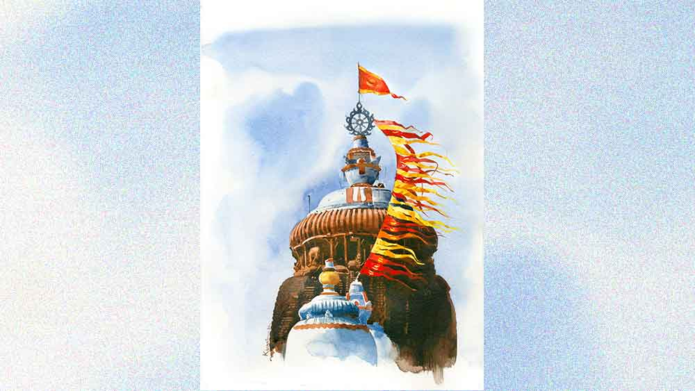

 
 <h1 align=center>শ্রীক্ষেত্রে</h1>
<h2 align=center>শ্রীপর্ণা বন্দ্যোপাধ্যায়</h2> সুমনা ড্রেসিং টেবিলের সামনে দাঁড়িয়ে চুল আঁচড়াতে আঁচড়াতেই তাড়া লাগাল, “কী গো, বেরোবে না? উঠে তৈরি হও না। এখন আবার সিগারেট ধরালে কেন?” উঠে আসা চুল নুটি পাকিয়ে ওয়েস্টবিনে ফেলতে গিয়েও কী ভেবে রেখে দিল ড্রয়ারে।

“পাগল! এই ভিড়ের মধ্যে কেউ হুজুগ করে?”

“মানুষের ভক্তিকে হুজুগ বলছ কেন? নাও, রেডি হয়ে নাও। ওদের দু’জনের স্নান হয়ে গেছে আগেই। আমিও তৈরি হচ্ছি। বেড়াতে এসে কেউ এমন গড়িমসি করে?”

“সারা বছরই তো দৌড়োচ্ছি। বেড়াতে আসাই তো খেয়ালখুশি গড়িমসি করার জন্য। ইচ্ছে হল শুয়ে রইলাম, খেয়াল হল সাঁতার কাটলাম...” সিগারেটটা অ্যাশট্রেতে গুঁজে আড়মোড়া ভাঙল ভাস্কর। 

“সে কী! পুরীতে এসে জগন্নাথ দর্শন করব না? পুজো দেব না?”

“তোমাকে কে বারণ করেছে? তুমি যাও না। লাঞ্চের মধ্যে ফিরবে তো? রথের জন্য যা ভিড়, তাতে তো মনে হয় না বিকেল চারটের আগে ফিরতে পারবে।”

“অসীমাদি পাণ্ডার নম্বর দিয়েছে। আমি যোগাযোগ করেছি। বলেছে যত তাড়াতাড়ি সম্ভব করিয়ে দেবে।”

“ওফ! এই এক হয়েছে পাণ্ডার দল। ভগবানকেই বিশ্বাস করো যদি, তার কাছে পৌঁছোনোর জন্য আবার  মিডলম্যান কেন? তিনি যখন সর্বত্র বিরাজমান, তা হলে মন্দিরেই বা যেতে হবে কেন?”

“বা রে, স্থান মাহাত্ম্য নেই? তা হলে মন্দির কেন, চতুর্দিকে এত শত মসজিদ চার্চ দেখছ, সে সবই বা কেন? ধর্মের নামে হলেও, পাঁচ জনের সঙ্গে মেশা একটা সোশ্যাল ডিউটি, বুঝলে?” সুমনার যুক্তি অকাট্য।

“বুঝলাম। কিন্তু জানো তো আমার ভক্তি-বিশ্বাস কিস্যু নেই। কেন শুধু শুধু নিজের সঙ্গে টানছ?”

“মুনাই-টুকাই তৈরি হয়ে বসে আছে জগন্নাথ মন্দির যাবে বলে। তুমি না গেলে আমি লাইনে দাঁড়িয়ে এই ভিড়ে ওদের সামলাতে পারব?”

“প্লিজ় ডোন্ট রিস্ক দেম। নিজে যাচ্ছ যাও, পাণ্ডাকে যত খুশি ঘুষ দাও, বাধা দিচ্ছি না। বাচ্চাদুটোকে টানাটানি করে কষ্ট দিয়ো না। বাই এনি চান্স, হারিয়ে গেলে? ওরা কোথায়?”

“তোমার যত সব বাজে কথা... ওরা বাগানে খেলছে,” রাগত মুখে বলে সুমনা।

“তা হলে আমি একটু পরে রেডি হয়ে ওদের সি-বিচে নিয়ে যাচ্ছি। অবশ্য সমুদ্রে নামলে আবার ফিরে এসে স্নান করতেই হবে। কপাল! ছুটিতে এসেও ছুটি নেই। তুমি কখন ফিরছ, এক বার ফোন করে জানিয়ো। বুঝতে পারব, ওয়েট করব নাকি ওদের দু’জনকে লাঞ্চ করিয়ে রাখব।”

“বারো মাস তিরিশ দিন বলছি না, রথের সময় জগন্নাথ ধামে এসে জগন্নাথকেই না দেখে চলে যাবে! আচ্ছা নাস্তিকের পাল্লায় পড়েছি যা হোক। নিজে পুজো না দাও, মন্দিরে তো সঙ্গে থাকতে পারতে। মন্দিরটাও তো দর্শনীয় অ্যাজ় অ্যান আর্কিওলজিকাল সাইট। ছেলেমেয়েদুটো দেখত।”

“শোনো, মন্দিরের গায়ে যা ভাস্কর্য আছে, বাচ্চা ছেলেমেয়েদের না দেখাই মঙ্গল। তারা যদি খুঁটিয়ে দেখে প্রশ্ন করে উত্তর দিতে পারবে? আমি এসেছি এই উপলক্ষে শনি-রবি সিএল মিলিয়ে পরপর টানা আট দিন ছুটি ম্যানেজ করা গেল বলে।”

“বাজে বোকো না, আমি আগেও এসেছি। তেমন কিছুই চোখে পড়েনি। তা হলে তো আমাদের কোনার্কটাই আগে ক্যান্সেল করতে হয়। আর লাইন দিয়ে পুজো দিতে গিয়ে কারও অত ভাস্কর্য দেখার সময় হয় না।”

“দেখাই যখন হবে না, তখন গিয়ে লাভ কী? রোজ হাজার হাজার লোক ফুল-বেলপাতা দিয়ে পুরাতত্ত্বের বারোটা বাজিয়ে দিয়েছে।”

না যাওয়ার যত রকম অজুহাত খাড়া করা যায়, সবই ভাস্করের কাছে তৈরি। বরকে উত্তর দিতে গিয়েও দেওয়া হল না। সুমনার চলভাষ বেজে উঠল। পাণ্ডার ফোন।

“হ্যাঁ, হ্যাঁ, আমি বেরোচ্ছি...”

 

সুমনা বিকেল পাঁচটায় ফিরল বেশ বেজার হয়ে। পাণ্ডা বড় বড় কথা বলেছিল। কিন্তু একেবারে রথের ঠিক আগের দিন বলে ভাল করে দর্শন করা যায়নি। রথেরই প্রস্তুতি চলছে। শুধু পুজোর ডালা ও দক্ষিণা দেওয়া ছাড়া পুজো দেওয়া বলতে যা বোঝায়, তার কিছুই করা যায়নি। পাণ্ডা সুমনাকে লাইনে দাঁড় করিয়ে অন্য যজমান ধরতে গিয়েছিল।

গোঁফের ফাঁকে মুচকি হাসি নিয়ে ভাস্কর বলল, “তা হলে পুণ্যার্জন কতটা হল— হাফ না সিকি না সাড়ে বারো পার্সেন্ট না...”

উত্তর না দিয়ে সুমনা স্নানঘরে ঢুকে সশব্দে দরজা বন্ধ করে দিল।

পরিষ্কার হয়ে বেরিয়ে এসেই বলল, “আগামীকাল রথযাত্রা কিন্তু একটা বিরাট ইভেন্ট। দেশ বিদেশ থেকে লোকজন দেখতে আসে। তাতে বাদ সেধো না। দেশবিদেশ থেকে সাংবাদিক বা ভিভিআইপি-রাও রথযাত্রা দেখতে আসে। তোমার না হয় উৎসাহ নেই, মুনাই টুকাইকে তো দেখতে দেবে।”

 

সমুদ্রমুখী হোটেলের সামনে মেরিন ড্রাইভ দিয়ে জগন্নাথ বলভদ্র ও সুভদ্রা মাসির বাড়ি গুণ্ডিচা মন্দিরে যান না। সে পথ আলাদা। তাই ব্যালকনি বা হোটেলের গেট থেকে রথযাত্রার ঝলক দেখারও সুযোগ নেই। অতএব সুমনার তাড়নায় সবাইকে জগন্নাথ মন্দির থেকে গুণ্ডিচার পথে কোথাও সুবিধেজনক জায়গা নিয়ে দাঁড়াতে হবে। রথের সঙ্গে সঙ্গে গুণ্ডিচা মন্দির পর্যন্ত যাওয়া পোষাবে না, সম্ভবও হবে না। আগামী কাল ভোরেই চিল্কা যাবে। পরের দিন নন্দনকানন। এক দিন বিরতি দিয়ে তার পরের দিন কোনার্ক। ফিরে এসে একটা প্রাইভেট সি বিচে কাটিয়ে আসবে। আবার এক দিন বিশ্রাম। তারপর উল্টো রথের দিন দুপুর দুটো পঞ্চান্নর ট্রেনে ফেরা। ঠাসা ভ্রমণসূচী।

লোকে সকাল থেকে রাস্তার ধারে জায়গা নিয়ে রেখেছে বিকেলে রথ দেখবে বলে। দুপুরে হাঁকপাঁক করে ভাত খেয়েই পাণ্ডা নির্দেশিত গ্র্যান্ড রোডের ওপর যথাস্থানে এসে দাঁড়াতে গিয়ে দেখে তিল ধারণের জায়গা নেই। একে একে বলরামের চোদ্দো চাকাবিশিষ্ট রথ ‘তালধ্বজ’, সুভদ্রার বারো চাকার রথ ‘পদ্মধ্বজ’ ও শেষে জগন্নাথের ষোলো চাকাযুক্ত রথ ‘নন্দীঘোষ’ বেরিয়ে এল। রথগুলো যথাক্রমে চুয়াল্লিশ, তেতাল্লিশ ও পঁয়তাল্লিশ ফুট করে উঁচু। মাথার ওপরটা সবক’টারই লাল। উচ্চতায় দু’-এক ফুটের তফাত দূর থেকে অতটা ধরা পড়ছিল না। সত্যিই অভিভূত করার মতো দৃশ্য।

আসানসোলে থাকলে রথের দিন অবশ্যই রথের দড়িতে টান দেওয়ার চেষ্টা করে সুমনা, মুনাই ও টুকাই। সুমনা নিজের ও মুনাইয়ের সামান্য উঠে যাওয়া চুল সংগ্রহ করে রাখে রথের চাকার তলায় দেবে বলে, তাতে নাকি চুল ভালো হয়। কী হয় কে জানে! সুমনার তো ভুসভুসিয়ে চুল ওঠে। পুরীর এই জনসমুদ্রে ওসব করার সাহসই হল না। প্রকাণ্ড রথগুলোর চতুর্দিকে জনতাকে পোকামাকড়ের মতো তুচ্ছ মনে হচ্ছে। বিশেষ করে যদি ওপর থেকে দেখা যায়। সুমনা তো বটেই, ভাস্করের মুখও হাঁ হয়ে গিয়েছে এই দৃশ্য দেখে।

হঠাৎ মুনাই সুমনার হাত ধরে টেনে বলল, “মা, ভাই কোথায়?”

“ভাই? এই তো ছিল। হ্যাঁ গো, টুকাই তোমার হাত ধরে ছিল না?” সুমনা পেছন ফিরে ভাস্করকে প্রশ্ন করতে গিয়ে দেখে জনতার ভিড়ে ভাস্কর অনেকটা দূরে চলে গেছে, অনেকটা সমুদ্রের ঢেউয়ে ভেসে যাওয়ার মতো। স্রোতের বিপরীতে মুনাইয়ের হাত ধরে ঠেলেঠুলে ভাস্করের কাছে পৌঁছোতেই ভাস্কর প্রশ্ন করল, “টুকাই কোথায়?”

“তোমার সঙ্গে ছিল তো!”

“ও তো ভাল করে দেখবে বলে তোমার কাছে গেল...”

 

হোটেলের ম্যানেজারের কাছে ঠিকানা জেনে তিন জনেই একটা অটো ভাড়া নিয়ে পুরী পুলিশ স্টেশন পৌঁছয়। সুমনার চোখদুটো কেঁদে কেঁদে লাল। কাঁদছে মুনাইও। ভাস্কর সে ভাবে কাঁদতে না পারলেও রগদুটো দপদপ করছে। স্বামী-স্ত্রী পরস্পরকে দোষারোপ করে যাচ্ছে ক্রমাগত—

“যেমন হুজুগ জেগেছিল, এই বয়সে খুকির মতো রথ দেখব, বগল বাজিয়ে নাচব, পুণ্য করব! হল তো পুণ্য করা? ওনলি ফর ইউ, ওনলি ফর ইউ। ছেলেটা এই জনসমুদ্রে কোথায় ভেসে গেল, কার হাতে পড়ল, পায়ের তলায় চাপা পড়ল কিনা...”

“একদম অলুক্ষুনে কথা বলবে না তো। তোমার মতো নাস্তিকের জন্যই এটা হল। জগন্নাথধামে এসে বলে জগন্নাথ দর্শন করব না। ছেলেটা তো তোমার কাছে ছিল, হাত ছাড়লে কোন আক্কেলে ওই ভিড়ের মধ্যে ওইটুকু বাচ্চার? এখন বলছ ওনলি ফর ইউ!”

পুলিশ অফিসার শুনে বললেন, “দিস ইজ় ভেরি ব্যাড। আপনারা বাঙালিরাই বেশি বেশি নাস্তিক হন দেখেছি। তীর্থস্থানে এসে বলছেন দেবতা দর্শন করবেন না, রথযাত্রাকে গালি দিচ্ছেন। প্রে টু জগন্নাথ সো দ্যাট ইউ গেট ব্যাক ইওর সান সুন।”

শ্লেষের গলায় ভাস্কর বলল, “স্যর, আপনারাও হাত তুলে দিচ্ছেন ভগবানের ভরসায়? কাজটা তো স্যর আপনাদেরই করতে হবে, একটু দেখুন স্যর প্লিজ়!”

নিজের বসদেরও এ ভাবে ‘স্যর স্যর’ করে না ভাস্কর!

“উই উইল ট্রাই আওয়ার বেস্ট। বাট ইউ শুড নট লুজ় ফেথ ইন গড। এখন হোটেলে যান। রাত হয়েছে।”

চিল্কা, নন্দনকানন, কোনার্ক, জলকেলি, কেনাকাটা সব লাটে উঠল। ছ’দিন ধরে শুধু পারস্পরিক ঝগড়া, দোষারোপ। ছোট্ট আট বছরের মেয়েও সাইট সিইংয়ের আনন্দ জলাঞ্জলি দিয়ে কখনও ভাইয়ের দুঃখে কাঁদে, তো কখনও মা-বাবার ঝগড়া দেখে। আবার পরস্পরকে ভোলাতে গিয়ে জড়িয়ে ধরে কেঁদেই ফেলছে বাপ-মা-কন্যা সবাই।

ভালমন্দ খাওয়ার রুচি নেই। বিকেলের চাও ঠিক মতো নেয় না। মুনাই বেচারার ভাইয়ের শোকের মধ্যেও খিদে পেয়ে যাচ্ছে। তবে বায়না করছে না খাবার নিয়ে। সুমনার চোখ দু’টি তো কেঁদে কেঁদে সর্বক্ষণ লাল। এক মনে মা কালী লোকনাথবাবা থেকে জগন্নাথদেব সবাইকে মানত করে বসে আছে। ভাস্কর গুম হয়ে গেছে। কোনও কথা বলতে পারছে না। 

দু’দিন দেখে ভাস্করের সঙ্গে পরামর্শ করে ফেরার টিকিট ক্যানসেল করে দিল সুমনা। হোটেল ও ট্রেন বুকিং সে-ই করেছিল।

কোনও খোঁজখবর নেই। ষষ্ঠ দিন একটা লাশ সনাক্ত করার জন্য থানা থেকে ফোন এল। সুমনা শুনেই ডুকরে উঠল। ভাস্কর বুকে পাথর রেখে বলল, “এই অশান্তি ভোগ করার চেয়ে গিয়ে দেখেই আসা যাক।”

মেয়েকে চোখে চোখে রাখবে বলে মনে ব্যাকুলতা নিয়েও সুমনা থেকে গেল হোটেলে। গোছগাছও বাকি। একমনে ঠাকুরকে ডাকছে, কিন্তু আর মনে হচ্ছে আশা নেই। পরের দিন উল্টোরথ। সেই দিন ওদের আসানসোলে ফেরার কথা ছিল। আর ফেরা? অফিসে ফোন করে ভাস্কর জানিয়ে দিল যে ও যথাসময়ে জয়েন করতে পারবে না। ঘটনাটা বলায় খ্যাঁচা উপরওয়ালা মিত্রসাহেব পর্যন্ত, “ওকে ওকে টেক কেয়ার। কোনও সাহায্য লাগলে বলবেন। আর সুখবর থাকলেও জানাবেন।”

আর সুমনা তো অফিস কাছারি সব ভুলে আছে। ওর অফিসে একটা ইমেল নিজের মোবাইল থেকে কোনওক্রমে করেছে।

ছেলে হারানোর ষষ্ঠ দিন ভোরে উঠতে না উঠতেই আবার চলভাষে ডাক। এই হয়েছে মুশকিল, খবর পেয়ে কেউ কুটো নেড়ে দুটো করতে পারছে না, কিন্তু ভদ্রতা দেখাতে ফোন করা চাই। বিরক্ত হয়ে অজানা নম্বর দেখেও ফোন ধরল। ফোনে সবাইকে একই উত্তর দিতে আর ভাল লাগছে না। শাশুড়ি তো প্রতিবার সুমনার অসাবধানতার জন্য দুষছেন। একমাত্র মা বাবা কিংবা বোন ফোন করলে সজল চোখে রুদ্ধ কণ্ঠে তাঁদের সঙ্গে কথা বলে মনের ভার হাল্কা করছে।

“হ্যালো, মিসেস মুখার্জি? আপনার মেয়ের নাম কি মুনাই?”

বুকের ভেতরটা ছ্যাঁত করে উঠল। মুনাই এই তো ঘরে ছিল, এর মধ্যে কি সেও —হা ঈশ্বর!

মোবাইলটা হাত থেকে পড়ে যাচ্ছিল। ওপাশের এক নারীকণ্ঠ বলল, “একটি আড়াই-তিন বছরের ছেলেকে আমাদের অন্য এক থানায় কেউ এসে জমা করেছে। সেও রথে হারিয়ে গিয়েছিল। ভীষণ কান্নাকাটি করছে। আপনাদের দু’জনের নাম জানি, কিন্তু মেয়ের নাম জানি না। তাই প্রশ্ন করলাম। আপনাদের তো আজই ফেরার টিকিট ছিল।”

“ক্যানসেল করে দিয়েছি। কোথায় যেতে হবে বলুন। কোন থানায়? আমরা এক্ষুনি যাচ্ছি।”

উফ! ভাস্কর যে এই সময় কোন দিকে গেল! এখনই বেরোতে হবে। মুনাইও সঙ্গে যাবে। কিন্তু ছেলের বাপ গেল কোথায়? ভাস্কর চলে এল সুমনা তৈরি হতে হতে। তিনজন ঊর্ধ্বশ্বাসে ছুটল টাউন পুলিশ স্টেশন।

গিয়ে দেখে টুকাই নিজের মনে একটা খেলনা এরোপ্লেন নিয়ে খেলছে। আহ্! কী আরাম! পাশে বসা এক দম্পতি। ওঁরাই হারিয়ে যাওয়া ক্রন্দনরত বাচ্চাটিকে বাড়ি নিয়ে গিয়ে যত্নআত্তি করে পুলিশকে জানিয়েছে। দেরির কারণ প্রথমত ভাষা, দ্বিতীয়ত থানার ফোন নম্বর না জানা। তার ওপর টাউন পুলিশ চৌকি ডায়রি নিতে চায়নি। বলেছে, যেখান থেকে হারিয়েছে, সেই থানা নেবে। কিন্তু বৃদ্ধা অনেক অনুনয় করতে হারানো প্রাপ্তি হিসেবে ছেলেটার জিম্মা নিয়েছে। ওই দম্পতি টাউন পুলিস স্টেশনের কাছেই থাকেন। তা ছাড়া টুকাই ওদের বাড়িতে গিয়ে একটু ‘মা মা, বাবা বাবা, মুনাই মুনাই’ করে কেঁদেছে। দিদি ছাড়া মা বাবার নাম তার ভাল জানা নেই, উড়িয়া কথাও বুঝতেও পারছিল না। তার পর আদর যত্ন আর খেলনা পেয়ে ভুলেও ছিল কিছুটা। বাড়ির সবার এমন মায়া পড়ে যায়। শেষে ‘মুনাই’ নামটিকে সম্বল করে থানায় নিয়ে এসেছে।

ভাস্কর আর সুমনা কীভাবে ধন্যবাদ ও কৃতজ্ঞতা জানাবে ভেবে পাচ্ছিল না। কিছু উপহার কিনে দেওয়ার জন্য পীড়াপীড়ি করল। বৃদ্ধ দম্পতি জোড় হাত করে বললেন, “আমরা কর্তব্য করেছি, নিমিত্ত মাত্র। সবই প্রভুর ইচ্ছে।”

ভাস্কর বলল, “আপনাদের কাছে চির-ঋণী রয়ে গেলাম। আমি আশা ছেড়েই দিয়েছিলাম।”

কপালে জোড় হাত লাগিয়ে সুমনা বলল, “ভগবানের অনেক কৃপা। স্বয়ং জগন্নাথ ওকে রক্ষা করেছেন।”

মনের মধ্যে জগন্নাথ দর্শন কিংবা রথদেখা নিয়ে তুচ্ছতাচ্ছিল্যটা আর খুঁজে পাচ্ছে না ভাস্কর। ছোট্ট টুকাইকে আঁকড়ে ধরে এক কাতর বাবা তখন কাকে যেন মনে মনে বলছে, ‘ক্ষমা কোরো... ক্ষমা কোরো...’