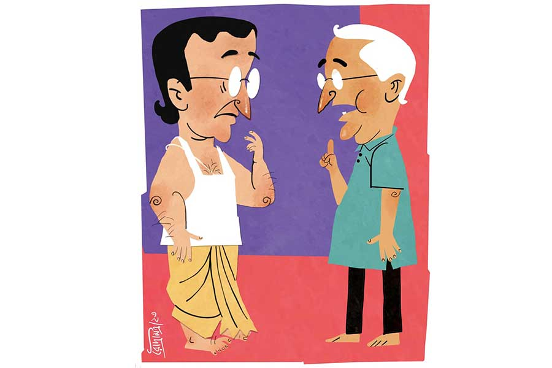

 
 <h1 align=center>সকালের ওষুধ</h1>
<h2 align=center>সুদীপ জোয়ারদার</h2> রাস্তার মোড়ে একটা দোকানে ডালপুরি ভাজছে। দেখেই জিভে জল এসে গেল।

অক্ষয়বাবু দাঁড়ালেন। আজ খেলেই তো হয় কয়েকটা!

শেষ কবে দোকানের ডালপুরি খেয়েছেন, মনেই পড়ে না। ডাক্তারের কড়া নির্দেশ, ওষুধ যেমন নিয়ম মেনে ঠিক সময়ে খেতে হবে, তেমনই খাওয়াদাওয়াও ঠিকঠাক রাখতে হবে, বিশেষ করে বাইরের ভাজাভুজি একদমই খাওয়া যাবে না।

ডাক্তারের নির্দেশ অক্ষরে অক্ষরে মেনে চলেন অক্ষয়বাবু। এই সব দোকানের দিকে ভুলেও তাকান না। কিন্তু আজ তো খাবারের খোঁজেই বেরিয়েছেন। তাই নজর চলে গিয়েছিল ও দিকে। খেতে তো হবেই একটা কিছু। ডালপুরি খেলে রসনারও তৃপ্তি হবে, প্রয়োজনটাও মিটবে। এক দিন অনিয়ম হবে, কী আর করা যাবে!

সকালের ওষুধটা বুকপকেটে ঘুরছে অনেক ক্ষণ। জলখাবার খেয়ে ওষুধটা খাওয়ার নিয়ম। অক্ষয়বাবু তাই জলখাবারের সন্ধানে বেরিয়েছেন। আশেপাশে কিছু না দেখতে পেয়ে হাঁটতে হাঁটতে চলে এসেছেন এই বাসস্ট্যান্ডে।

সরমা বেঁচে থাকলে চিন্তা করতে হত না। যতই পুজোর দিন হোক, ঠিক কিছু একটা খাইয়ে দিত। কিন্তু সরমা কিছু দিন আগে বিনা নোটিসে হঠাৎ চলে যাওয়ায় এখন ছেলের বৌয়ের অধীনে। অষ্টমী পুজোর অঞ্জলি না দিয়ে প্রাপ্তি খাবারদাবারের ধার দিয়েও যাবে না জানা কথা। শ্বশুরের দেখাশোনা করছে এই ঢের!

আজ ওর সারা দিনেরই বন্দোবস্ত আলাদা। অঞ্জলি দিয়েই বরকে বগলদাবা করে প্রাপ্তি ছুটবে বাপের বাড়ি। ফিরবে কাল। অক্ষয়বাবুর আজকের দুপুর ও রাতের খাবারের জন্য হোম ডেলিভারির ব্যবস্থা।

তবু সকালে অঞ্জলি ঝটপট মিটলে দু’খানা টোস্ট আশা করা যেত। কিন্তু সে পর্ব মিটতে বেলা একটা। তখন লাঞ্চেরই সময় হয়ে যাবে। তখন কি আর সকালের ওষুধ খাওয়া যাবে!

অক্ষয়বাবু সকালের ওষুধটা নিয়ে তাই মহা ঝামেলায়। নাঃ, অতশত ভেবে লাভ নেই। ডালপুরির দোকানটায় ভিড়েই গেলেন শেষ তক। অর্ডার দিতে যাবেন, হঠাৎ খেয়াল হল মানিব্যাগে সব ক’টা নোটই পাঁচশো টাকার। পাঁচশো টাকার ভাঙানি কি হবে? জিজ্ঞেস করে নেওয়া ভাল।

“এই যে! ডালপুরি খাব, কিন্তু পাঁচশো টাকার নোট...”

“পাঁচশো! একটু দেখুন, খুচরো পাওয়া যায় কি না!”

তার মানে, ভাঙানি হচ্ছে না। অক্ষয়বাবু বেরিয়ে এলেন।

কিছুটা দূরে একটা মণ্ডপে পুজো হচ্ছে। এখনও পুজো শুরু হয়নি, মাইকে বীরেন্দ্রকৃষ্ণ ছড়িয়ে পড়ছে আকাশে বাতাসে। জমায়েত দেখে মনে হচ্ছে, এখানে আগেই বসবেন পুরোহিতমশাই। অঞ্জলিও হয়তো তাড়াতাড়ি হয়ে যাবে। বৌমা এখানে এলেই তো পারত! বাড়ির সামনের পুজোয় এমনিতেই খুব লেট করে পুরোহিত। তার উপর অষ্টমী পুজোর জন্য অনেকটা সময় আছে এ বার। সুতরাং আরও গড়িমসি করবে।

সামনে এক জন লটারি বিক্রি করছে। অক্ষয়বাবু পাঁচশো টাকার নোটটা নিয়ে ওখানে দাঁড়ালেন, “ভাই, এটা একটু ভাঙিয়ে দিতে পারবে?”

লটারিওয়ালা পাঁচশো টাকার নোটটার দিকে তাকিয়ে দেখল একটু। কথা না বলে পাশাপাশি ঘাড় নাড়ল।

পাশের পানের দোকানে মাঝবয়সি অবাঙালি দোকানি অক্ষয়বাবুকে দেখছিল একমনে। হয়তো লটারিওয়ালার সঙ্গে অক্ষয়বাবুর কথাবার্তাও শুনেছে। মনে হল, লোকটার কাছে ভাঙানি আছে। দেবেও হয়তো। শুধু অপেক্ষা করছে চাওয়ার।

অক্ষয়বাবু পাঁচশো টাকার নোটটাকে লম্বালম্বি ভাঁজ করে পানের দোকানির দিকে উঁচু করে ধরে শুধোলেন, “হবে নাকি, খুচরো?”

“শও রুপেয়াকি ভি সওদা নেহি হুয়া। নেহি তো সুবহ সুবহ ব্রাম্ভন কা মদত জরুর কর দেতা...” পানওয়ালার মুখে প্রচ্ছন্ন অসহায়তা।

পাতলা ফতুয়ার উপর দিয়ে পৈতেটা দেখা যাচ্ছে। অক্ষয়বাবুর দেবদ্বিজে ভক্তি না থাকলেও পৈতে পরাটা ছেলেবেলার অভ্যেস। এখন না পরলে কী যেন একটা নেই-নেই মনে হয়। এই অস্বস্তির থেকে পৈতে বহন শ্রেয়। ক’গাছা সুতো বই তো নয়! তিনি দীর্ঘশ্বাস ফেলে এগোলেন।

এ বার অক্ষয়বাবুর খিদেও পাচ্ছে। পুজোয় অঞ্জলি কোনও কালেই দেন না। এ নিয়ে সরমা চিরকাল অনুযোগ জানিয়ে এসেছে। এখন ছেলের বৌ-ও আকারে ইঙ্গিতে বলে। এ বারেই তো প্রাপ্তি সকাল সকাল স্নান সেরে অক্ষয়বাবুর দিকে তাকিয়ে বলছিল, “বাবাই আছেন ভাল। পুজো-আচ্চার ধার ধারেন না। আমার বাবা আবার উল্টো। বলেন, ‘ধর্মের দিকে একটু হেলে থাকলে মন ভাল থাকে। অন্য দিকে মন যায় না।’”

‘অন্য দিক’ কথার অর্থ অপরিষ্কার নয় অক্ষয়বাবুর কাছে। অক্ষয়বাবুর ওটিটি-তে ওয়েব সিরিজ দেখার নেশা। এটা প্রাপ্তির মতে বাজে নেশা।

সরমা অনুযোগ করলেও এ ভাবে কথা বলত না। আর পুজো-আচ্চার দিনেও খেয়াল করে অক্ষয়বাবুর জলখাবারের ব্যবস্থা করে রাখত।

কিছু দূরে একটা মিষ্টির দোকানে লুচি ভাজছে। ডালপুরির পরিবর্তে গরম গরম লুচিই বা মন্দ কী! আর বড় দোকান, পাঁচশো টাকা নিয়েও হয়তো সমস্যা হবে না। এখন মনে হচ্ছে প্রথমে ওখানে গেলেই ভাল করতেন।

অক্ষয়বাবু এগোলেন দোকানটার দিকে। তবু সাবধানের মার নেই। ভিতরে ঢোকার আগে ভাঙানির ব্যাপারটা শুধোবেন বলে মালিকের দিকে তাকালেন। কিন্তু জিজ্ঞেস করার আগেই, “কাকু, একটু শুনুন, এক বার প্লিজ়...” বলে এক ছোকরা এক রকম জোর করেই অক্ষয়বাবুকে দাঁড় করিয়ে দিল।

“কী ব্যাপার এ ভাবে...”

“খুব বিপদে পড়ে গেছি আমরা কাকু, খুব বিপদ...”

নিশ্চয় টাকাপয়সার ধান্দা। অক্ষয়বাবু প্রথমেই সাবধান হয়ে গেলেন, “দেখো, সাতসকালে আমি কিন্তু কারও বোনের বিয়ে, ভাইয়ের অপারেশন ইত্যাদির জন্য চ্যারিটি করতে পারব না।”

“আরে কাকু, সে সব নয়। আমাদের ওই যে পুজো প্যান্ডেল, আমি ওখানকারই ছেলে...”

তার মানে চাঁদা। চাঁদা চাওয়া ছেলেদের চটানো বিপদ। তবু বড় কিছু চেয়ে বসার আগে আগ বাড়িয়ে অক্ষয়বাবু বলে দেন, “আমি কিন্তু কুড়ি টাকার বেশি চাঁদা দিতে পারব না, তাও পাঁচশো টাকার নোট ভাঙিয়ে তোমাকে নিতে হবে।”

“চাঁদা নয় কাকু। আপনি চলুন প্যান্ডেলে। সব জানতে পারবেন।”

নিমরাজি হয়ে অক্ষয়বাবু ছেলেটির সঙ্গে গিয়ে দাঁড়ালেন প্যান্ডেলটায়। এক জন বয়স্ক লোক অক্ষয়বাবুকে দেখে এগিয়ে এলেন, “দাদা, গলায় পৈতে আছে যখন, আমাদের একটু উদ্ধার করে দিতেই হবে আপনাকে।”

অক্ষয়বাবু মাথামুন্ডু কিছুই বুঝতে পারলেন না।

বয়স্ক লোকটি এ বার খোলসা করলেন, “ব্রাহ্মণের জন্য আমরা সকাল থেকে হন্যে হয়ে ঘুরে বেড়াচ্ছি। অর্ককে বলেছিলাম, বাসস্ট্যান্ডে ঘোরাঘুরি করতে, ব্রাহ্মণ দেখলেই নিয়ে আসতে। ভাগ্যিস ও রবি পানওয়ালার দোকানের কাছে দাঁড়িয়েছিল! ওর ফোন পেয়ে যেন ধড়ে প্রাণ এসেছে, না হলে এই সময় এক জন ব্রাহ্মণ আমরা কোথায় পাই বলুন তো! আমাদের কমিটির বেশির ভাগই আবার মাহিষ্য। পাঁচের বি-র ব্যানার্জিবাবু শিমলা বেড়াতে গেছেন। তিরিশ নম্বর বাড়ির ঘোষালদা পুজোর কন্ডাক্টেড টুর করান, ভোর ছ’টাতেই বেরিয়ে গেছেন। কাজেই বুঝতেই পারছেন কী সমস্যা...”

“আমি কিন্তু কিছুই বুঝতে পারছি না দাদা...”

“আমাদের পুরুতের অ্যাসিস্ট্যান্ট হরু ঠাকুরের মেয়ের ডায়েরিয়া। উনি মেয়েকে নিয়ে হাসপাতালে গেছেন। মেয়ে একটু স্টেবল না হলে আসতে পারছেন না। এ দিকে অষ্টমীর অঞ্জলির ভিড় শুরু হয়ে গেছে। একটু পরেই ডিএম আসবেন, একটা মানুষ-পুতুল দিয়ে দেবীপ্রতিমা হয়েছে আমাদের পুজোর প্রদর্শনীতে। সেটা দেখতে আসবেন, পুজোর কাছেও দাঁড়াবেন। আমরা ঠিক করেছি ডিএম স্যরকে রিকোয়েস্ট করব আমাদের সঙ্গে অঞ্জলি দিতে। এখন পুজো শুরু না করলে কি চলবে বলুন?”

এ বার হেসে উঠলেন অক্ষয়বাবু, “পৈতে দেখেই অমনি বুঝে ফেললেন আমি পুজো করতে পারি? ভারী অদ্ভুত তো!”

“পুজো করতে হবে না দাদা। প্রক্সি দিয়ে দেবেন। আমাদের পুরুতঠাকুর খুব দক্ষ। উনি চালিয়ে নেবেন। স্নান তো হয়নি? ক্লাবের বাথরুমে করে নিন প্লিজ়। সাবান আছে। ঢাকীদের জন্য রাখা নতুন ধুতি-গেঞ্জিও আছে। আপনি দাদা চট করে স্নানটা সেরে, নতুন জামাকাপড় পরে নিন।”

এ তো মহা ফ্যাসাদে পড়া গেল! পৈতেটা গলায় রেখে দিয়ে শেষে আজ এমন বিপত্তি!

এক জন এসে বলল, “মণ্ডলদা, ডিএম রওনা দিয়েছেন।”

মণ্ডলদার চোখে অনুনয়, “দাদা, একটু কোঅপারেট করুন প্লিজ়! আপনাকে নিরাশ করব না। যথাসাধ্য পারিশ্রমিকও দেব!”

এই হচ্ছে মানুষের দোষ। কোনও কিছু না জিজ্ঞেস করেই একটা ধারণা গড়ে নেয়। উনি ভাবছেন সকালের ওষুধ খাওয়া নিয়ে, আর এরা ভাবছে তাঁকে পৌরোহিত্য করানো নিয়ে, তাঁর পারিশ্রমিক নিয়ে!

পাঁচশো টাকা ভাঙিয়ে দশ-কুড়ি টাকার কিছু কেনা কঠিন। বিশেষ করে এই সকালবেলায়। এত করে যখন ধরেছে, তখন এঁদের কাজটা মিটিয়েই না হয় আবার ঝাঁপাবেন!

কলের নীচে মাথা দিয়ে স্নান-টান করে ধুতি-গেঞ্জি পরে নিলেন। তার আগে পৈতেটার দিকে আড়চোখে তাকিয়ে জল নিংড়ে নিলেন। এত কাল স্কুলে ইতিহাস পড়িয়েছেন। ব্রাহ্মণ্যতন্ত্রের কুপ্রভাব নিয়ে কত জ্ঞানগর্ভ কথা বলে এসেছেন ছাত্রদের কাছে। আজকে সেই তিনিই পুরোহিতের ভূমিকায়!

অক্ষয়বাবু ষাট পেরিয়েছেন বছর দুয়েক। এখনও নির্মেদ চেহারা। বয়স বোঝাই যায় না। শুগার থাকলেও নিয়মিত ওষুধ খান, ব্যায়াম করেন। কিন্তু আজ তো সকালের ওষুধটাই…

যদি তাড়াতাড়ি ছাড়া পাওয়া যায়, এই আশায় আর দেরি করলেন না। প্রধান পুরোহিতের পাশে বসেই গেলেন পুজোয়। প্রধান পুরোহিত অভিজ্ঞ মানুষ। কী করতে হবে শিখিয়ে দিলেন। অঞ্জলির মন্ত্র পড়তে হবে থেমে থেমে, সকলে সেটা বলে অঞ্জলি দেবে। তিন বার ফুল দিয়ে অঞ্জলি। চতুর্থ বার ফুল ছাড়া প্রণাম।

‘আয়ুর্দেহি যশোদেহি ভাগ্যং ভগবতি’ থেকে শুরু করে ‘এষ সচন্দন পুষ্পবিল্বপত্রাঞ্জলি সবাহনায়ৈ সপরিবারায়ৈ...’ পর্যন্ত বেশ মসৃণ ভাবেই চালিয়ে গেলেন তিনি। এক রাউন্ড হওয়ার পর বেশ সড়গড় হয়ে গেল। দু’-তিনটে রাউন্ডও বেশ পার করে দিলেন। ডিএম এলেন। সকলের অনুরোধে অঞ্জলিও দিলেন। সব সুষ্ঠু ভাবেই মিটল।

ঘণ্টাখানেক পর হন্তদন্ত হয়ে এসে পৌঁছলেন পুরোহিতের সেই অ্যাসিস্ট্যান্ট। মেয়ে কিছুটা সুস্থ, তাই চলে এসেছেন।

মণ্ডলবাবু এসে বললেন, “দাদা, আপনিই তা হলে এ বেলাটা চালিয়ে নেবেন নাকি?”

অক্ষয়বাবু বললেন, “উনিই আসুন। আমার এখনও সকালের ওষুধটা খাওয়া হয়নি...”

মঞ্চ থেকে নেমে ক্লাবঘরে গিয়ে ধুতি-গেঞ্জি ছেড়ে নিজের জামাকাপড় পরে নিলেন।

মণ্ডলবাবু একটা দু’শো টাকার নোট জোর করে অক্ষয়বাবুর পকেটে ঢুকিয়ে দিলেন, “এটা নিতেই হবে। আপনার পারিশ্রমিক।”

চলেই আসছিলেন। হঠাৎ অক্ষয়বাবুর মনে হল, মানুষ-পুতুল দিয়ে তৈরি দেবীপ্রতিমা তো আগে দেখেননি। কী রকম হয়, দেখার জন্য গিয়ে দাঁড়ালেন মণ্ডপের পাশে প্রদর্শনীর জমায়েতের পিছনে।

দারুণ তো! মাটির দেবীপ্রতিমার চেয়ে মানুষ-পুতুলের দেবীপ্রতিমা ঢের বেশি সুন্দর! ছোট বাহনগুলো ছাড়া কিছুই বাদ যায়নি। আরে, মহিষও রয়েছে অসুরের পায়ের কাছে! এ বার দুর্গার দিকে চোখ পড়তেই একটু চমকে গেলেন। এ কাকে দেখছেন ওখানে! হু হু করে উঠল মনটা। দেখতে দেখতেই পর্দা পড়ে গেল। মানুষ-পুতুলদের এক ঘণ্টার বিরতি।

পরে আর এক বার কি আসবেন মানুষ-পুতুলের এই দেবীপ্রতিমার কাছে? অক্ষয়বাবু টের পেলেন, দুর্গার মুখটা টানছে জোর।

প্যান্ডেল থেকে বেরিয়ে অক্ষয়বাবু সেই বড় দোকানটায় এসে হাজির হলেন। এ বার নিশ্চিন্ত। পাঁচশো টাকার ভাঙানি না হলেও দু’শো টাকার ভাঙানি হবেই। কিন্তু রিটায়ারমেন্টের পর আকস্মিক ভাবে করে ফেলা এই রোজগারের টাকাটার মূল্য অনেক। ওটা দিতে মন সরল না। খাওয়ার পরে পাঁচশো টাকার নোটটাই বের করে দিলেন।

“ছোট নেই?” বলেও মালিক লুচির দাম কেটে টাকা ফেরত দিল।

ভেবেছিলেন ঘণ্টাখানেক পরে আবার প্যান্ডেলে যাবেন। কিন্তু মেঘ না চাইতেই জল। আগে খেয়াল করেননি, একটু দূরের টেবিলে লুচি খেতে বসেছে সেই দুর্গাও। প্রতিমার সেই ঝলমলে পোশাকটা পাল্টে যাওয়ায় অন্য রকম লাগছে ওকে। বেশভূষায় দারিদ্রের চিহ্নও প্রকট। জোর খিদে পেয়েছে, বোঝা যাচ্ছে খাওয়া দেখেই। হয়তো বাধ্য হয়ে খেতে ঢুকেছে এখানে।

মেয়েটিকে হুবহু বিয়ের সময়কার সরমার মতো দেখতে। তাই বিস্ময়ে চোখ সরাতে পারছেন না অক্ষয়বাবু।

অক্ষয়বাবু খাওয়ার পর পায়ে পায়ে এগিয়ে গেলেন দুর্গার টেবিলের দিকে। বুকপকেট থেকে দু’শো টাকার নোটটা বার করে বাড়িয়ে দিলেন দুর্গার দিকে, যে ভাবে পুজোয় হাতখরচের টাকাটা এক কালে বাড়িয়ে দিতেন সরমাকে, বললেন, “এটা রাখো। ধরে নাও, দুর্গাকে এই পুজোয় আমার সামান্য উপহার!”

মেয়েটা অবাক হয়ে বলল, “আপনি হঠাৎ আমাকে টাকা...”

“বললাম না উপহার... রাখো এটা।” টাকাটা এক রকম ওকে জোর করেই দিলেন অক্ষয়বাবু। অবাক হয়ে বাঁ হাতে টাকাটা নিল মেয়েটি। খেতে খেতে আর উপায়ই বা কী!

দুর্গাকে টাকাটা দিতে পেরে ভারী ভাল লাগছে। সকালের ওষুধটা এ বার খেতে হবে। কিন্তু এ কী, ঘড়িতে যে বেলা বারোটা! এত বেলায় সকালের ওষুধ খেলে, দুপুরের ওষুধ কখন খাবেন? যদিও দুপুরের ওষুধটা শুগারের নয়, তবু এক সঙ্গে খাওয়া কি যাবে?

অক্ষয়বাবু সকালের ওষুধটা আবার পকেটেই রেখে দিলেন। সরমার ফিরে আসার দিনটায় যদি সকালের ওষুধটা না-ই খাওয়া হয়, কী আর এমন ক্ষতি হবে!