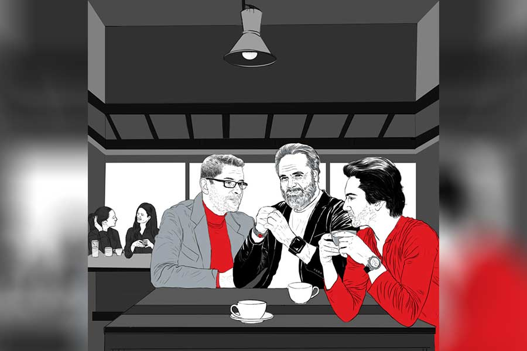

 
 <h1 align=center>সঞ্চয়</h1>
<h2 align=center>সোমজা দাস</h2> 

অফিস ক্যান্টিনে খাওয়ার ফাঁকে গল্পগুজব চলছিল। চার জন সহকর্মী। এঁদের মধ্যে মৃদুলের বয়স সবচেয়ে কম। সাবধানী, হিসাবি ছেলে। আলোচনাটা সে-ই শুরু করেছিল, “ফিক্সড ডিপোজ়িটে টাকা রাখব, না শেয়ার মার্কেটে লাগাব বলুন তো?”

ফাল্গুনী দত্ত পঞ্চাশোর্ধ্ব। স্পষ্ট মতামত দিতে পছন্দ করেন। রুটি চিবোতে চিবোতে বললেন, “তোমরা ইয়ং ব্লাড। এখন রিস্ক নেবে। ফিক্সড ডিপোজ়িট করব আমরা, বুড়োরা।”

অরুণাভ বক্সী মধ্যবয়সি। বিবাহবিচ্ছিন্ন। আত্মীয়স্বজনেরা নতুন করে সংসার শুরু করার পরামর্শ দিচ্ছেন। অরুণাভর যে খুব অনিচ্ছা, তাও নয়। কিন্তু কেমন বাধো-বাধো ঠেকছে। ভয়ও। বিয়ের কথা ভাবলেই তিক্ত স্মৃতিগুলো ফিরে আসে।

মৃদুলের প্রশ্নের উত্তরে বললেন, “দেখো, এ সব সিদ্ধান্ত নিজেই নেওয়া উচিত।”

“নিজেই নেব। আপনাদের সাজেশন চাইছি।”

“সে ক্ষেত্রে বলব, ভাগাভাগি করে রাখো। লোকসান হলেও পুরোটা মার যাওয়ার ভয় নেই। আবার বাজার ভাল চললে প্রচুর লাভ।”

পরামর্শটা মনে ধরল মৃদুলের। মাধববাবু চুপচাপ খাচ্ছিলেন। কোম্পানির পুরনো কর্মী। খুব ছোটখাটো পদে চাকরিতে ঢুকেছিলেন। খুব বেশি যে উন্নতি করতে পেরেছেন, তাও নয়। লোকজনের সঙ্গে মেশেন কম। রোগা, কোলকুঁজো চেহারা। আজ ক্যান্টিনে কোনও ফাঁকা টেবিল ছিল না বলে এই টেবিলে এসে বসেছেন। সামান্য খাবার, রুটি আর ছ্যাঁচড়ার মতো দেখতে একটা তরকারি।

সবাইকে জিজ্ঞেস করেছে মৃদুল, মাধববাবুকে না করলে খারাপ দেখায়। তাই বলল, “আপনার কী সাজেশন মাধববাবু?”

“আমি!” মাধববাবু কেমন হতভম্ব মুখে তাকালেন। তার পর হঠাৎই তড়িঘড়ি উঠে দাঁড়িয়ে টিফিনবাক্সটা বন্ধ করে বললেন, “আমার হয়ে গেছে খাওয়া। আসি, হ্যাঁ?”

কথাটা শেষ করে অপেক্ষা করলেন না। লম্বা লম্বা পা ফেলে বেরিয়ে গেলেন ক্যান্টিন থেকে। ফাল্গুনী দত্ত ঠোঁট উল্টে বললেন, “আর লোক পাওনি। মাধবকে গেছ জিজ্ঞেস করতে!”

“কেন?” মৃদুল একটু অবাক।

অরুণাভ আর ফাল্গুনী দৃষ্টি বিনিময় করলেন। তার পর অরুণাভ ফিসফিস করে বললেন, “এ এক আজব চিড়িয়া। হাড়কিপটে। অমন ভিখিরির মতো থাকে। খাওয়াদাওয়ার ছিরি তো দেখলেই। কয়েক বছর আগে ওর স্ত্রী মারা গেছেন নিউমোনিয়ায় ভুগে, প্রায় বিনা চিকিৎসায়।”

তখন বিকেল। অফিস শেষ করে বাড়ির পথে পা বাড়াল মৃদুল। বাসে উঠেই চোখে পড়ল, পিছনে কোণের সিটে বসে মাধববাবু। পাশের সিটটা ফাঁকা। অনিচ্ছাসত্ত্বেও বসল পাশে গিয়ে। মাধববাবুর দিকে তাকিয়ে মৃদু হাসল। পুরো রাস্তাটা কেউ কোনও কথা বলল না। নামার সময় মাধববাবুকেও একই স্টপেজে নামতে দেখে অবাক হল মৃদুল। জিজ্ঞেস করল, “আপনিও এখানেই থাকেন নাকি?”

মাথা নাড়লেন ভদ্রলোক। কিছুটা এগিয়ে গিয়ে থমকে দাঁড়ালেন। ঘুরে তাকিয়ে বললেন, “চলুন না আমার বাড়ি। কাছেই থাকি।”

মৃদুল দ্বিধা করল। আবার আগ্রহও যে হচ্ছে না তা নয়। সামনের গলিতে ঢুকল দু’জনে। একটা একতলা বাড়ির সামনে দাঁড়িয়ে বললেন, “আসুন।”

পুরনো বাড়ি। অগোছালো। সামনের ঘরটা বেশ ছোট। একটা পুরনো স্প্রিং-ভাঙা সোফা রয়েছে। সেখানেই বসল দু’জন। মাধববাবু একটু চুপ করে থেকে বললেন, “আপনি দুপুরে জিজ্ঞেস করছিলেন না, কী ভাবে সঞ্চয় করবেন?”

মৃদুল মাথা নাড়ল।

“বাবা মারা গেলেন যখন, আমার বয়স কুড়ি। লেখাপড়া ছেড়ে কাজে ঢুকতে হল। সেই থেকে কাজই করে চলেছি। লোকে বলে, আমি নাকি কৃপণ, অর্থপিশাচ। সব কথাই কানে আসে।”

আজ দুপুরের ক্যান্টিনের আলোচনার কথা মনে করে মৃদুল লজ্জা পেল। বলতে গেল, “না না…”

“আপনি লজ্জা পাবেন না মৃদুলবাবু। সঞ্চয় তো করাই উচিত। আমিও করেছি।”

মৃদুল চুপ করে রইল।

মাধববাবু উঠে দাঁড়িয়ে বললেন, “এক বার একটু কষ্ট করে ভিতরে আসবেন?”

“ভিতরে!”

“আসুন না এক বার। প্লিজ।”

মৃদুল মাধববাবুর পিছন-পিছন ভিতরের ঘরে ঢুকল। এই ঘরটা আরও ছোট। বিছানায় শুয়ে একটি মেয়ে টিভি দেখছে। পুরনো যুগের বাক্স-টিভি। ছবি অস্পষ্ট। ঝিরঝিরে। শব্দও নেই। খাটের উপরের মেয়েটির বয়স বোঝা যায় না। বেশ ঢলঢলে মুখখানা। মাধববাবু বললেন, “আমার মেয়ে।”

অপরিচিত একটি মেয়ের ঘরে এসে একটু অস্বস্তি হচ্ছে মৃদুলের। মেয়েটির কিন্তু সে দিকে হুঁশ নেই। মাধববাবু মেয়ের মাথায় হাত বুলিয়ে বললেন, “জন্ম থেকেই স্বাভাবিক নয় ও। বিছানা ছেড়ে উঠতে পারে না। কিছু বোঝেও না। আমি ছাড়া আর কেউ নেই ওর।”

মাধববাবুর গলা কাঁপছে। একটু থেমে আবার বললেন, “লোকে সত্যি কথাই বলে। টাকা জমাই আমি। ওর জন্য অনেক টাকা দরকার আমার। কিন্তু তবু ভাবনা হয়, আমি মরে গেলে কে দেখবে ওকে? জানেন, আমি আর আমার স্ত্রী কোনও দিন আনন্দ করিনি। বেড়াতে যাইনি। এক সঙ্গে সিনেমা দেখিনি। রেস্তরাঁয় ভালমন্দ খাইনি। শুধু কাজ করে গেছি।তবু দিনের শেষে আমার হাত শূন্য।... একটা কথা বলব আপনাকে?”

“বলুন না!”

“আমাদের মতো বুড়োদের হিসাবি অঙ্কের জালে জড়িয়ে নিজেকে বোকা বানাবেন না। ফাল্গুনী দত্ত মদ খেয়ে রোজ স্ত্রীকে মারধর করে। ওর ছেলে ওর মুখ দেখে না। অরুণাভ নিজের সংসার টেকাতে পারেনি। আর আমার তো পুরোটাই লোকসানের কারবার। আর আপনি কি না আমাদের কাছে পরামর্শ চাইছেন! শুনুন, সঞ্চয় করতে হলে সুন্দর স্মৃতি সঞ্চয় করুন। আনন্দের মুহূর্তগুলোকে ধরে রাখুন। প্রিয়জনকে জড়িয়ে রাখুন বুকে। এটুকুই তো মানুষের সঞ্চয়...”

মাধববাবুর বাড়ি থেকে বেরিয়ে বাড়ির পথ ধরল মৃদুল। মনটা বেশ হালকা লাগছে। কষ্টও হচ্ছে। থাকুক এই কষ্টটুকু। আজকের বিকেলটুকু না হয় পুরোটাই সঞ্চয়ের খাতে জমা থাক।

