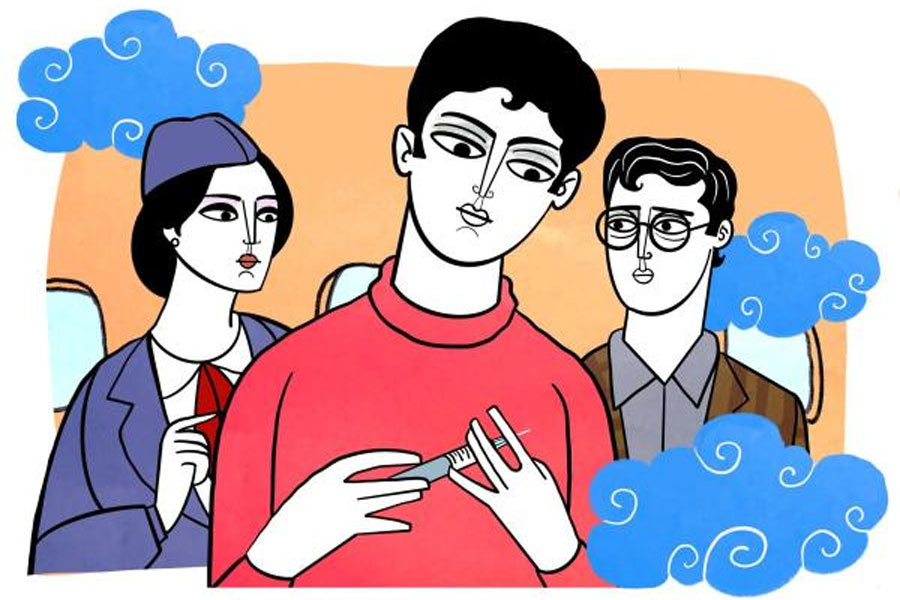

 
 <h1 align=center>সঞ্জীবনী</h1>
<h2 align=center>পৃষতী রায়চৌধুরী</h2> হেল্প! হেল্প! ও গড! সেভ মি! সেভ আস!” আর্তনাদে বাতাস খানখান। দুদ্দাড়, ধুপধাপ শব্দ চতুর্দিকে। কী একটা ভেঙে পড়ল হুড়মুড় করে। গলগল করে বেরিয়ে আসছে কালো ধোঁয়া। পিছনে লকলকে লেলিহান শিখা। পোড়া গন্ধে, ধোঁয়ায়, চিৎকারে, দমকলের পাগলা ঘণ্টিতে মাথা যেন ফেটে যাবে। প্রাণপণ ছুটছি, কিন্তু কোন দিকে গেলে বেরোতে পারব এই জতুগৃহ থেকে, তা জানি না। আরও অনেকের সঙ্গে ধাক্কাধাক্কি করে, যেখানে পৌঁছলাম, সেখান থেকে পা বাড়াতেই... এ কী! এক পা এগোলেই সামনে অতল শূন্যতা! চার তলার খোলা বারান্দা। এখান থেকে ঝাঁপ দিলে সোজা চল্লিশ ফুট নীচের শক্ত মাটি। পিছনে ধেয়ে আসা আগুনের ধোঁয়া দমবন্ধ করে ফেলছে ক্রমশ। চেতনা লোপ পাওয়ার আগেই কে যেন ধাক্কা দিল পিছন থেকে। আরও অনেকের সঙ্গে ভেসে পড়লাম শূন্যে।

ঘুমটা ভেঙে গেল। ওফ! আবার সেই দুঃস্বপ্ন। একে একে চারটে বছর তো হয়ে গেল। তবু কেন যে দুঃস্বপ্নটা কিছুতেই পিছু ছাড়ে না!

রাজস্থানের একটি ব্যস্ত শহর। শহর জুড়ে সারি সারি কোচিং সেন্টার। জয়েন্ট এন্ট্রান্সের বৈতরণি পার করিয়ে আইআইটির স্বর্গরাজ্যে পৌঁছে দেওয়ার পারানির কড়ি গোনে সেই তিন-চার-পাঁচ তলা কোচিং কমপ্লেক্সগুলো। আমাদের কোচিং সেন্টারের নামটা আবার ইতিহাস-ঘেঁষা। তক্ষশীলা। দিনে বারো-তেরো ঘণ্টা শুধু ফিজ়িক্স, কেমিস্ট্রি আর ম্যাথস। এই বিরামহীন পিসিএম চক্রের বাইরে মহাবিশ্বে আর সব কিছুই যেন বেকার, গুরুত্বহীন। কোচিং সেন্টারের দিনরাত জুড়ে শুধু প্র্যাকটিস আর প্র্যাকটিস। কঠিন নিয়মের নিগড়ে বাঁধা দিনের প্রতিটি প্রহর। তবু তার মধ্যেও গড়ে ওঠে বন্ধুত্ব। ক্লাসের ফাঁকে ফাঁকে হয় আড্ডা, লেগ পুলিং। সামান্য ঘনিষ্ঠতা। যেমন হয়েছিল আকাশ, প্রাঞ্জল, নীরজদের সঙ্গে। হয়েছিল সিনিয়র দু’-এক জনের সঙ্গেও... সোনু ভাইয়া, রোহণ ভাইয়া, অভিষেক ভাইয়া।

তার পর এক দিন আচমকা সেই দুঃস্বপ্নের দুপুর। আমি দোতলায় ছিলাম। ইলেভেনের ক্লাস চলত সেখানেই। তিন তলা আর চার তলা জুড়ে ছিল টুয়েলভের ক্লাসরুম। আগুনটা শুরু হয়েছিল চার তলা থেকেই। সম্ভবত এসি থেকে শর্ট সার্কিট। জানালা-দরজা বন্ধ, এসি চলছিল, তাই চিৎকার-চেঁচামেচির আওয়াজ কানে আসতেও দেরি হয়েছিল। যখন শোনা গেল, তখনও ঠিক জানি না কী হচ্ছে চার তলায়। নীচে নেমে এসেছি সবাই হুড়োহুড়ি করে। ছেলেরা, স্যররা, অন্য স্টাফরা। নীচে নেমে এসে দেখি চার তলার দুটো জানলা দিয়ে গলগল করে ধোঁয়া বেরোচ্ছে। শোনা যাচ্ছে তিরিশ-পঁয়ত্রিশ জনের মিলিত আর্তনাদ। সিঁড়ির মুখের লবি আর করিডর আগুনে ঢেকে ছিল। নীচে নেমে আসতে পারছিল না ওরা। মরিয়া হয়ে রেলিং-এর ধারে চলে এসেছিল। কয়েকটি মুহূর্ত। ঝপাঝপ নীচে লাফিয়ে পড়ল দশ-বারো জন। না, এক জনও বাঁচেনি। বাকি পনেরো জন যারা ঝাঁপ দিতে পারেনি, তারাও শ্বাসরুদ্ধ হল। আর আমার মতো যারা বেঁচে গেছিল কপালজোরে, সারা জীবনের মতো সেই আগুনের দগদগে স্মৃতি বুকে রয়ে গেল।

আজ এই দশ হাজার ফুট উঁচু দিয়ে উড়ে যাওয়ার সময়ও সেই দুঃস্বপ্ন আমার পিছু ছাড়েনি। জলের বোতলটা নিয়ে গলায় ঢাললাম একটু। সামনের জিপিএস ডেটা দেখাচ্ছে প্লেনটা এখন কাজ়াখস্তানের ওপর দিয়ে চলছে। দিল্লি এখনও ঘণ্টা চারেক। স্টুডেন্ট এক্সচেঞ্জ প্রোগ্রামে এসেছিলাম জেনিভার একটা ইউনিভার্সিটিতে। দু’মাসের কোর্স শেষে ফিরে যাচ্ছি। জেনিভা থেকে মস্কো হয়ে দিল্লির উড়ান। কিন্তু এত গোলমাল কিসের?

এই তো একটু আগে সবাইকে পেট পুরে খাইয়ে পর্দা টেনে ঘুম পাড়িয়ে দিয়েছিলেন এয়ারহোস্টেস দিদিরা। এখন আবার এত হুলস্থুল কিসের? তবে কি এখানেও? এই প্লেনের মধ্যেও? আগুন? এমার্জেন্সি ল্যান্ডিং? হাত বাড়িয়ে লাইফ জ্যাকেটটা বার করতে গেলাম। কিন্তু কই, সিট-বেল্ট চিহ্ন তো জ্বলছে না? তবে কি হাইজ্যাকার? প্লেনটা নিয়ে গিয়ে নামাতে চায় কাবুল কিংবা কান্দাহারে? কাদের খপ্পরে পড়লাম? তালিবান? নাকি আল কায়দা? 

আর বেশি ভাবাভাবির মধ্যে না গিয়ে পাশের গুঁফো হরিয়ানভি দাদাটিকে জিজ্ঞেস করলাম, “ব্যাপারখানা কী? ঘুমিয়ে ঘুমিয়ে কোন ঘোষণাটি মিস করেছি আমি?”

জানলাম, প্লেনের এক সহযাত্রী নাকি অসুস্থ বোধ করছেন। তাই অন-বোর্ড ডাক্তারের খোঁজ চলছে। ঘাড় ঘুরিয়ে দেখলাম তিনটে সিট পিছনে মাঝের আইলের এক বেশ নাদুস-নুদুস মাঝবয়সি ইউরোপিয়ান ভদ্রলোক সিটে মাথা এলিয়ে পড়ে আছেন। পাশে অসহায়ের মতো দাঁড়িয়ে এক জন বিমানসেবিকা। আর এক জন বিমানসেবিকা ডাক্তারের সন্ধানে এ দিক-ও দিক ছুটে বেড়াচ্ছেন। আশপাশের প্রায় সকল যাত্রীর ঘাড়ই ঘুরে আছে সে দিকে। এর মধ্যেই এক জন ধোপদুরস্ত মধ্যবয়সিকে দেখা গেল পিছনের দিকের একটা আইলের সিট থেকে হন্তদন্ত হয়ে এগিয়ে আসতে, তিনি বললেন, “আমি ডাক্তার, আমাকে দেখতে দিন ওঁকে।”

ডাক্তার শুনে সকলে সরে গিয়ে তাঁকে জায়গা করে দিল। ডাক্তারের ইংরেজি উচ্চারণ শুনে মনে হয়, তিনি সম্ভবত দক্ষিণ ভারতীয়। স্টেথোস্কোপ নিয়ে রোগীকে পরীক্ষা করতে লাগলেন তিনি। ডাক্তারের দেখা পেয়ে ভদ্রলোককে একটু চাঙ্গা মনে হল। নেতিয়ে পড়া ভাবটা সামলে ডাক্তারের প্রশ্নের উত্তর দিচ্ছেন। ভাসা-ভাসা কথা যেটুকু কানে এল তাতে বুঝলাম ভদ্রলোকের নাম টমাস, আদতে নেদারল্যান্ডসের বাসিন্দা। টাইপ-ওয়ান ডায়াবেটিসের পেশেন্ট। সর্বদা নিজের ইনসুলিন পেনটি সঙ্গে নিয়েই ঘোরেন তিনি। কিন্তু এ যাত্রায় তাঁর মারাত্মক ভুল হয়ে গেছে। মস্কোতে বিমান বদলের সময় এয়ারপোর্টের সিকিয়োরিটি গেটে তিনি তাঁর ইনসুলিন পেনটা ফেলে এসেছেন। ইঞ্জেকশন নেওয়ার নির্দিষ্ট সময় পেরিয়ে গেলেও তাই ইঞ্জেকশন নিতে পারেননি। এখন তাঁর ব্লাড শুগার লেভেল বেড়ে গেছে মারাত্মক ভাবে। আরও জানা গেল, নিজের পেনটি ফেলে এলেও তাঁর কাছে ইনসুলিন ডোজ়ের কিছু বাড়তি কার্ট্রিজ আছে। সেগুলোর একটা তাঁকে দিতে পারলেই তিনি সুস্থ হয়ে উঠবেন। কিন্তু সেই ওষুধ তাঁর শরীরে প্রবেশ করানো হবে কেমন করে?

ডাক্তার এয়ারহোস্টেসকে বললেন, “দেখুন না, প্যাসেঞ্জারদের কারও কাছে যদি এর ফিটিং সিরিঞ্জ থাকে। খুব দ্রুত এই ইঞ্জেকশন না দিলে কিন্তু এঁকে বাঁচানো যাবে না।”

মিনিটখানেকের মধ্যেই ইনসুলিন সিরিঞ্জের খোঁজে বিমানসেবিকার আবেদন শোনা গেল মাইক্রোফোনে। কয়েক সেকেন্ডের মধ্যেই এক জন প্যাসেঞ্জার তাঁর নিজের ইনসুলিন পেনটি নিয়ে এগিয়ে এলেন। কিন্তু টমাসের ভাগ্য বড়ই খারাপ দেখা যাচ্ছে। এটার ব্যাস প্রয়োজনের তুলনায় ছোট। ফিট করল না টমাসের কার্ট্রিজের সঙ্গে। এ দিকে তিনি ধীরে ধীরে নির্জীব হয়ে পড়ছেন। চোখ বন্ধ। মুখ দিয়ে গ্যাঁজলা বেরোচ্ছে।

ডক্টর মাথা নেড়ে বললেন, “আর মিনিট পনেরোর মধ্যে যদি নির্দিষ্ট ডোজ়ের ইঞ্জেকশনটি না দেওয়া যায় তা হলে মিঃ টমাসকে বাঁচানো মুশকিল। এ ভাবে বেশি ক্ষণ থাকলে ওঁর অরগ্যানগুলো একে একে ফেল করতে শুরু করবে। আর যে কোনও মুহূর্তে উনি কোমায় চলে যাবেন।”

একটু বাদে ক্যাপ্টেনের গলা ভেসে এল মাইক্রোফোনে। সহযাত্রীটিকে বাঁচানোর জন্য উনি প্লেনটিকে কাজ়াখস্তান অথবা উজবেকিস্তানের কোনও এয়ারপোর্টে এমার্জেন্সি ল্যান্ডিং করাবেন স্থির করেছেন। কিছু ক্ষণের মধ্যেই প্লেনটি অবতরণ করতে শুরু করবে।

“একটু দেখতে পারি আপনার সিরিঞ্জটা?” ডাক্তারের কাছে তাঁর সিরিঞ্জটা চাইলাম। চেয়ে নিলাম টমাসের ওষুধের কার্ট্রিজটাও। খানিক ভাবলেশহীন মুখেই ডাক্তার জিনিস দুটো বাড়িয়ে ধরলেন আমার দিকে। খুঁটিয়ে খুঁটিয়ে দেখতে লাগলাম জিনিসদুটো। আমার আগ্রহ দেখে ডাক্তার প্রশ্ন করলেন, “মেডিক্যাল স্টুডেন্ট না কি?”

“নাঃ! ইঞ্জিনিয়ারিং। ইলেকট্রিকাল। ফাইনাল ইয়ার।” অন্যমনস্ক ভাবে উত্তর দিলাম। আমার পুরো মনোযোগ তখন কেন্দ্রীভূত ওই ইনসুলিন পেন আর সিরিঞ্জে।

“ওঃ!” হতাশ ভাবে মাথা নাড়লেন ডাক্তার। আমাকে ডাক্তারির ছাত্র ভেবে যতটা আগ্রহ হয়েছিল, ইঞ্জিনিয়ারিং পড়ি শুনে ততটাই বোধহয় নিরাশ হলেন। আমি কিন্তু আশার আলো দেখে পাচ্ছি। মাথাটাও খুলে যাচ্ছে। হাতের পেনটা মন দিয়ে দেখতে দেখতে আমি পাশে দাঁড়িয়ে থাকা এয়ারহোস্টেসকে বললাম, “আমার একটা ওয়াই-ফাই কানেকশন চাই। এক্ষুনি।”

“শিয়োর!” এয়ারহোস্টেস দৌড়ে চলে গেলেন সামনের দিকে।

আমিও এক লাফে আমার সিটে ফিরে ল্যাপটপটা খুলে বসলাম। তার পর দ্রুত খুলে ফেললাম ডাক্তারের ইনসুলিন পেনটা। সামনের ট্রে-টেবিলটা টেনে নিয়ে তাতে সাজিয়ে নিলাম পেনের সব কটা পার্টস। তত ক্ষণে এয়ারহোস্টেস বিজ়নেস ক্লাসের যাত্রীদের জন্য বরাদ্দ ফ্রি ওয়াই-ফাই এর লগইন-পাসওয়ার্ড একটা কাগজে লিখে এনে দিয়েছেন। দ্রুত নিজেকে যুক্ত করলাম ইন্টারনেটের সঙ্গে। তার পর টমাসের কার্ট্রিজের নম্বর মিলিয়ে ওর নির্ধারিত পেনের একটা ইঞ্জিনিয়ারিং ড্রয়িং খুঁজে পেতে বিশেষ বেগ পেতে হল না। সেই ড্রয়িং-এর সঙ্গে ডাক্তারের পেনের অংশগুলি মিলিয়ে দেখতে দেখতে নজর পড়ল, একটা যন্ত্রাংশ গুনতিতে কম আছে। ইন্টারনেট দেখাচ্ছে তেরোটি যন্ত্রাংশের ছবি, আর আমার সামনে রয়েছে বারোটি যন্ত্রাংশ। এ বার শুরু হল এলিমিনেশনের খেলা। এই পদ্ধতির রগড়ানো ট্রেনিং তো চলছে সেই কবে থেকে। যত দ্রুত তুমি ভুল উত্তরগুলোকে চিহ্নিত করে অপসারণ করতে পারবে, তত দ্রুত তুমি এগিয়ে যাবে ঠিক উত্তর, তথা সাফল্যের দিকে।

ছবির সঙ্গে মিলিয়ে মিলিয়ে একটা একটা করে যন্ত্রাংশ সরিয়ে রাখতে রাখতে শেষ যে অংশটির অভাব থেকে গেল আমার কাছে, সেটা হল একটা স্প্রিং। এই স্প্রিংটিই ত্রয়োদশতম এবং একমাত্র যন্ত্রাংশ যেটি ছবিতে আছে, কিন্তু আমার হাতে নেই। সুতরাং আমার একটি স্প্রিং চাই। আমি এবার স্প্রিং-এর মতোই লাফিয়ে উঠলাম, আর এয়ারহোস্টেসকে বললাম, “একটা স্প্রিং চাই আমার, এক্ষুনি। যে ভাবেই হোক জোগাড় করুন।”

“স্প্রিং? স্প্রিং কোথায় পাব এই প্লেনের মধ্যে?” এয়ারহোস্টেস বিভ্রান্ত।

এক মিনিট চিন্তা করলাম। মাথায় বিদ্যুৎ-চমকের মতো আইডিয়া খেলে গেল। বললাম, “বল-পয়েন্ট পেন! খোঁজ করে দেখুন প্যাসেঞ্জারদের কাছে। জোগাড় করে দিন যতগুলো সম্ভব।”

এয়ারহোস্টেস এ বার ‘জো হুকুম’ বলে চলে গেলেন বল-পয়েন্ট পেনের সন্ধানে। মিনিট পাঁচেকের মধ্যেই যাত্রীদের কাছ থেকে বারো-তেরোটা বল-পয়েন্ট পেন জোগাড় হল। আমি দ্রুত হাতে প্রতিটি পেন খুলে ফেলে স্প্রিংগুলো হাতে নিচ্ছি আর দেখছি কার্ট্রিজটির সঙ্গে ফিট হয় কি না। কারণ আমি এখন নিশ্চিত যে, নির্দিষ্ট সাইজ়ের একটি স্প্রিংই হল সেই মিসিং লিঙ্ক, যা রোগীর কার্ট্রিজ আর অন্য যাত্রীর ইনসুলিন পেনকে সংযুক্ত করতে পারে। আর তা হলেই প্রাণদায়ী সঞ্জীবনী জীবন বাঁচাতে পারবে এক মৃত্যুপথযাত্রীর। কিন্তু কোনও স্প্রিংই ফিট করছে না এই যন্ত্রে। ডাক্তারবাবু আমার বয়সের কারণেই হোক কিংবা ‘ইঞ্জিনিয়ারিং স্টুডেন্ট মেডিক্যাল ক্রাইসিসের মর্ম কী বুঝবে’ এই ভেবে তাচ্ছিল্য করেই হোক, একেবারেই পাত্তা দিচ্ছিলেন না শুরুর দিকে। কিন্তু পরে আমার কাণ্ডকারখানা দেখে আমার পাশে এসে দাঁড়িয়ে দাঁড়িয়ে দেখতে লাগলেন আমি কী করছি। মাঝে মাঝে এক বার করে গিয়ে টমাসের নাড়ি দেখে আসছিলেন, আর চিন্তিত মুখে মাথা নাড়ছেন। টমাস সেই তখন থেকেই সংজ্ঞাহীন।

আমি কিন্তু চেষ্টা চালিয়ে যাচ্ছি একগুঁয়ের মতো। ঘাড় গুঁজে। হাল ছাড়ার কোনও প্রশ্নই ওঠে না। শেষ দেখেই ছাড়ব।

কেন জানি না টমাসের মধ্যে চার বছর আগে হারিয়ে যাওয়া সেই রোহণ ভাইয়া, অভিষেক ভাইয়াদের মুখ দেখছি। ওদের বাঁচাতে পারিনি। টমাসকে চিনি না, জানি না তাকে বাঁচাতে পারব কি না। আদৌ আমার সেই ক্ষমতা আছে কি না, তাও জানি না। কিন্তু নিজের ক্ষমতার শেষ বিন্দু পর্যন্ত হাল ছাড়ব না। সীমিত সময়ের মধ্যে, প্রবল চাপের মুখেও নিজের মাথা ঠান্ডা রেখে কঠিন থেকে কঠিনতর প্রবলেমগুলো সল্‌ভ করার যে শিক্ষা ইঞ্জিনিয়ারিং-এর গত তিনটে বছর এবং তার আগে জয়েন্টের প্রস্তুতির সময় পেয়েছি, তার আসল পরীক্ষা যেন আজ।

এই তো! দশ নম্বর বল-পয়েন্ট পেনের স্প্রিংটা একেবারে খাপে খাপে বসে গেল ইনসুলিন পেনটির মধ্যে। আর সেই স্প্রিং-এর সঙ্গে জুড়ে দেওয়া গেল টমাসের কার্ট্রিজটাও।

“উইল ইট ওয়ার্ক?” ডাক্তারের দিকে জিনিসটা এগিয়ে দিলাম আমি।

ডাক্তারবাবুর হাঁ-মুখ এখনও বন্ধ হয়নি। এখনও বোধহয় তাঁর বিশ্বাস হচ্ছে না, আমি এই দুটো জিনিসকে জুড়ে দিতে পারব। সামান্য একটু কৌশল আর একটা বলপেনের স্প্রিংকে কাজে লাগিয়ে।

‌“আই... আই থিঙ্ক সো। লেট মি চেক...” হতভম্ব ভাবটা সামলে বললেন ডাক্তার। তার পর ছুটলেন টমাসের সিটের দিকে। কার্ট্রিজ সমেত পেনটা হাতে নিয়ে সংজ্ঞাহীন টমাসের পাশে এসে দাঁড়ালেন এক মুহূর্ত। তার পর নব ঘুরিয়ে ঘুরিয়ে ডোজ় অ্যাডজাস্ট করলেন। এ বার এক হাতে টমাসের শার্টের কোণটা তুলে ধরে অন্য হাতে ওর তলপেটে পেনটাকে লাগিয়ে নির্দিষ্ট পরিমাণ ওষুধ ইনজেক্ট করলেন।

আমিও দাঁড়িয়ে আছি পাশে। উৎকণ্ঠা নিয়ে তাকিয়ে আছি টমাসের মুখের দিকে। মিনিট পাঁচেক। ধীরে ধীরে টমাসের দেহটা নড়ে উঠল। স্টেথোস্কোপ নিয়ে ডাক্তার পরীক্ষা করছেন। নাড়ি টিপে রয়েছেন গম্ভীর মুখে। একটু পরে উজ্জ্বল হয়ে উঠল তাঁর মুখ, “ইয়েস, ইট ওয়ার্কড! পালস রেট ইম্প্রুভ করছে।”

আরও মিনিট পাঁচেক পরে টমাস চোখ মেলে তাকালেন। জ্ঞান ফিরে এসেছে। ডাক্তার উত্তেজিত হয়ে আমাকে জড়িয়ে ধরলেন, “ইউ সেভড হিজ় লাইফ! ওঃ ম্যান! হি ইজ় আউট অব ডেঞ্জার নাউ।”

আমি একটু হেসে তাঁকে বললাম, “তা হলে এ বার স্বীকার করছেন তো, শুধু ডাক্তার নয়, ইঞ্জিনিয়াররাও কখনও কখনও মানুষের জীবন বাঁচাতে পারে?”

“অ্যাবসলিউটলি। আই কমপ্লিটলি এগ্রি নাউ। ইভেন অ্যান ইঞ্জিনিয়ার ক্যান সেভ আ লাইফ!” এক গাল হেসে বললেন ডাক্তার। তার পর এয়ারহোস্টেসের উদ্দেশে বললেন, “এক্সকিউজ় মি মিস, ক্যাপ্টেনকে বলে দিন, আর আমাদের এমার্জেন্সি ল্যান্ডিং-এর প্রয়োজন নেই। আর হ্যাঁ, মিঃ টমাসের জন্য একটু গ্লুকোজ় ওয়াটারের ব্যবস্থা করুন প্লিজ়। আর আমাদের জন্য একটু কফি। উই ব্যাডলি নিড ইট।”