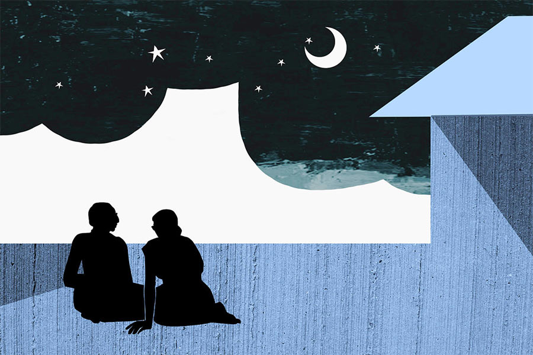

 
 <h1 align=center>সততার জৌলুস</h1>
<h2 align=center>সন্দীপন দত্ত</h2> সমস্যা খুব গভীর। আর সমাধানও কিছু মিলছে না। আকাশপাতাল ভাবতে ভাবতে হরিপদ খাস্তগীর তাঁর অর্ধসমাপ্ত একতলা বাড়ির কার্নিসবিহীন ছাদে অস্থির ভাবে পায়চারি করছিলেন।

আকাশপাতাল ভাবনার প্রধান লক্ষণ, সমাধানের সঙ্গে চিন্তার যোগ না থাকা। সমস্যা হয়তো মেয়ের বিয়ের টাকা জোগাড়, ও দিকে ভাবনা চলেছে সম্পূর্ণ অন্য পথে। ছেলেবেলা কত সুন্দর ছিল! ক্লাস এইটের অ্যানুয়াল পরীক্ষার পর বর্ধমানে মামার বাড়ি বেড়াতে গিয়ে সে বার কত মজা হয়েছিল। সেই কাণ্ডের আগাগোড়া সব এক-এক করে মনে পড়ছে। আর কী ভালটাই না লাগছে। ঘণ্টাতিনেক এমন আবোল তাবোল চিন্তা করতে পারলেই কেল্লা ফতে! দু’দিনের জন্যে মেয়ের বিয়ের টাকার চিন্তা উধাও।

হরিপদ খাস্তগীরও এখন প্রথা মেনে পরলোকগত বাবার কথা ভাবছিলেন। হরিপদর বাবা গুরুপদ খাস্তগীর খুব সাদামাটা মানুষ ছিলেন। এতই সাধারণ যে, তাঁকে কেউ মনে রাখেনি। কিন্তু হরিপদ জানেন, বাবা ছিলেন অতি অসাধারণ মানুষ। এতই অসাধারণ যে, গুরুপদ খাস্তগীরের চেনা-পরিচিতরা তাঁকে আহাম্মক বলে দেগে দিয়েছিল। হরিপদ জানেন, বাবা ছিলেন আদ্যন্ত সৎ ও নির্লোভ মানুষ। আজকাল ঠিক যেমন হলে অন্যেরা আহাম্মক ভাবে।

সৎ ও নির্লোভ হওয়ার জন্য যা-যা ঘটার, ঠিক তা-ই ঘটেছে গুরুপদর জীবনে। সারা জীবন চাকরি করে তেমন কিছু জমাতে পারেননি। যা জমেছিল, দু’মেয়ের বিয়ে দিতেই শেষ। ছেলেকে কোনও জায়গায় ঢুকিয়ে যেতে পারেননি। হরিপদ খাস্তগীর যে ছোটখাটো চাকরিটা করেন, সেটা তিনি নিজের চেষ্টাতেই জুটিয়েছেন। বাবা সুযোগ থাকা সত্ত্বেও হরিপদকে কোথাও ঢুকিয়ে দেননি বলে হরিপদর কোনও ক্ষোভ নেই। কারণ হরিপদ ধাত পেয়েছেন গুরুপদর। তিনিও বাবার মতোই সৎ ও নির্লোভ। হরিপদ যে গভীর সমস্যার মধ্যে হাবুডুবু খাচ্ছেন, তার মূলে এই ধাত।

গত সপ্তাহে টিফিন আওয়ার্সে হরিপদর ডাক পড়েছিল ইউনিয়ন লিডার শীতল হালদারের দরবারে। ডাক পেয়ে হরিপদ অবাক। তিনি কারও সাতে-পাঁচে না থাকা মানুষ। আজ পর্যন্ত ইউনিয়নের চাঁদাপত্তর কখনও বাকি রাখেননি। মিটিং-মিছিলে সব সময় হাজির থেকেছেন। নেতারা যখন মঞ্চ দাপিয়ে গলার শির ফুলিয়ে জ্বালাময়ী ভাষায় ন্যায় নীতি সততার কথা বলেছে, তখন মুগ্ধ বিস্ময়ে আগাগোড়া শুনেছেন। কী এমন ঘটল যে, স্বয়ং শীতল হালদারের তলব! মনে হালকা অস্বস্তি নিয়ে হরিপদ হাজির হয়েছিলেন শীতল হালদারের দরবারে।

শীতল হালদার লোকটা মোটাসোটা, গোলগাল। মুখখানা লম্বাটে গোদা বুটজুতোর মতো। তিন-চার জন শাগরেদ নিয়ে ইউনিয়ন রুম আলো করে বসে আছে।

হরিপদকে দেখে বুটজুতো বলে উঠল, “এই যে হরিপদবাবু, আসুন আসুন। বসুন।”

হরিপদ বসলেন।

“তা হরিপদবাবু, আপনি এমন করলে তো ভারী মুশকিল।”

হরিপদ তটস্থ হয়ে তাকিয়ে রইলেন। ব্যাপার এখনও বোঝা যাচ্ছে না। “না, না, এত সৎ থাকা মোটেই ভাল কথা নয়। আপনার জন্যে যে আমরা সকলে খুব বিড়ম্বনায় পড়ে গেছি!” বুটজুতো মুচকি হাসল।

হরিপদ মোলায়েম করে বললেন, “আজ্ঞে।” ঘটনা এখনও ঠিক বোঝা গেল না। এই বার বোঝা যাবে নির্ঘাত।

মুচকি হাসি ছেড়ে বুটজুতো এখন গম্ভীর। বলল, “দেখুন হরিপদবাবু, আপনার ব্যাপারটা মিনিস্টার অবধি পৌঁছে গেছে। মিনিস্টার সব শুনে ভীষণ খাপ্পা। উনি বলে দিয়েছেন, আপনাকে অবিলম্বে এই ছাতার মাথা সততার বাতিক ছাড়তে হবে।”

পাশ থেকে এক জন শাগরেদ গম্ভীর গলায় ফুট কাটল, “হয় সততা ছাড়ুন, নয় চাকরি।”

এ কথায় বুটজুতো ঝাঁ করে রেগে গেল। ঝট করে শাগরেদের দিকে ঘুরে গিয়ে বলল, “তোকে কে মাতব্বরি করতে বলেছে!” তার পর মোলায়েম গলায় হরিপদকে বলল, “ওদের কথা ধরবেন না হরিপদবাবু। এমনিতে আপনার সততা নিয়ে এত দিন কোনও ঝামেলা লাগেনি। গোটা অফিসে আপনি একমাত্র বোকা... ইয়ে, সৎ লোক। তা নিয়ে আমাদের মাথাব্যথা ছিল না। হল কী, গত মাসে পারচেজ়ের নগেনের মাথায় ভূত চাপল। সে বলে, অনেক হয়েছে, আর নয়। এ বার থেকে সে আপনার মতো সৎ হয়ে যাবে। তা সে সৎ হয়ে গেল। গত এক মাসে সে পঁচিশটা বিল ছেড়েছে কাটমানি ছাড়া। বুঝুন কাণ্ড! পঁচিশটা বিল, খুব কম করে কোটিখানেক টাকা। টেন পার্সেন্ট কাটমানি মানে, ফেলে ছড়িয়ে দশ লাখ। হতচ্ছাড়া নগেনটা দশ লাখ টাকা জলে দিল স্রেফ আপনার সততা বাতিকের অনুপ্রেরণায়!”

ব্রেক কষলেন হরিপদবাবু। আর একটু হলেই সটান নীচে পড়তেন। কার্নিসবিহীন ছাদে ভর সন্ধেবেলা হনহনিয়ে পায়চারি করলে যা ঘটার, এক্ষুনি তাই ঘটতে যাচ্ছিল। ছাদে দাঁড়িয়ে নিজের অসমাপ্ত কীর্তি দেখতে দেখতে মনটা একটু খারাপ হয়ে গেল।

খাঁটোরার শেষ প্রান্তে, প্রায় জলার উপর দু’কাঠা জমি কিনেছিল বাবা। দেড়খানা টালির চালের ঘর, একটুখানি বারান্দা করেই বাবার দৌড় শেষ হয়েছিল। তার পর বেটন হাতে নিয়ে হরিপদ ঢালাই করেছেন। ঘরের সংখ্যা দেড় থেকে বেড়ে দুই হয়েছে। আর খোলা বারান্দা ঢেকে রান্নার জায়গা। সর্বশেষ সংযোজন, জমির সীমানায় ছিটেবেড়া ঘেরা পায়খানার বদলে ইটের দেওয়ালের ওপর টিন চাপানো খুপরি।

ধুত্তোর! হরিপদবাবু মনটাকে সমস্যায় এনে ফেলতে চাইলেন।

শীতল হালদারের হিমশীতল কথাগুলো মনে করে এই ভরা ভাদ্রের প্যাচপেচে গরমেও হরিপদবাবুর শীত-শীত করছিল।

“আপনি মশাই অনুপ্রেরণার উৎস হয়ে বসে আছেন। ব্যাপারটা এত দিন খেয়াল হয়নি! মিনিস্টার চোখে আঙুল দিয়ে দেখিয়ে দিল আমাদের ভুলটা। আজ আপনাকে দেখে নগেন অনুপ্রেরণা পেয়েছে। কাল খগেন পাবে, পরশু হরেন। তা হলেই তো চিত্তির! অনুপ্রেরণা যে এত ছোঁয়াচে, জানা ছিল না। যাকগে, যা হওয়ার হয়ে গেছে। আমি মিনিস্টারকে কথা দিয়ে এসেছি, আপনাকে আমাদের মধ্যে টেনে নেব। আপাতত ঠিক হয়েছে, আপনাকে ইউনিয়নের এই শাখার ভাইস-প্রেসিডেন্ট করে দেওয়া হবে। আপনার যা সৎ ইমেজ, তাতে আমাদের ইউনিয়নের গ্ল্যামার বাড়বে। ও সব চাকরি-টাকরি ছাড়ার কথা ভুলে যান। আপনি বাইরে যেমন সৎ তেমনই থাকবেন। আপনাকে কিচ্ছু করতে হবে না, শুধু কাটমানির ভাগ নিতে হবে। আর নগেনের সঙ্গে আমাদের কথা হয়েছে। বলেছে, আপনি যদি কাটমানির ভাগ নেন, তা হলে ও সামনের মাসে এ মাসের ঘাটতি পুষিয়ে দেবে।

“ব্যস! তা হলে কথা ফাইনাল। আপনি তো আমাদের সদস্য আছেনই। সোমবার এগজ়িকিউটিভ কাউন্সিলের মিটিং-এ আপনার নামটা পাস করিয়ে নেওয়া হবে। সোমবারই আপনি দায়িত্বভার গ্রহণ করবেন।”

কথা শেষ করেই শীতল হালদার হন্তদন্ত হয়ে বেরিয়ে গেল। বোধহয় মিনিস্টারের সঙ্গে দেখা করতেই ছুটতে হল।

যে শাগরেদ চাকরি ছাড়ার কথা বলেছিল, সে হঠাৎ খুব গদগদ হয়ে বলল, “বুঝলেন হরিদা, আপনার মতো সৎ মানুষ আমাদের ভাইস প্রেসিডেন্ট হলে আর দেখতে হবে না। বিরোধীগুলোর থোঁতা মুখ একেবারে ভোঁতা হয়ে যাবে। তবে হরিদা, আপনি বড্ড ম্যাড়মেড়ে। এমন আধময়লা ধুতি পাঞ্জাবিতে ভাইস প্রেসিডেন্ট ঠিক মানাবে না। চিন্তা করবেন না, কাটমানি যা পাবেন তাতে দু’মাসে আপনার সততার জৌলুস চোদ্দোগুণ বেড়ে যাবে।”

সততার জৌলুস। কথাটা নিয়ে খানিক ভাবলেন হরিপদবাবু। তার মানে ওই লোকটা বলতে চেয়েছিল, হরিপদর সততায় জৌলুস নেই। তাই কি? না কি আজকাল সততার জৌলুস এমনিই নেই। কাটমানির টাকনা দিলে তবে জৌলুস খুলবে। কে জানে বাবা কী মানে! আরও একটা ব্যাপার হরিপদবাবু ভাল বুঝে উঠতে পারেননি। নগেনের পুষিয়ে দেওয়ার সঙ্গে ওঁর কাটমানি নেওয়ার সম্পর্ক। মুশকিল হল, ওটাই নগেনের শর্ত। তার উপর আবার গত মাসে দশ লাখ টাকা জলে গেছে। দশ লাখ টাকা জলে গেলে যে দায়ী, তার উপর সবাই রেগে যাবেই। মিনিস্টার যে রেগে গেছেন, তাতে বলার কিছু নেই। কিন্তু কথা হল, তিনি দায়ী? নাকি অনুপ্রেরণা?

কারও সঙ্গে যে সমস্যা নিয়ে আলোচনা করবেন, সে উপায় নেই। কাছের জনেরা সবাই ছাপোষা সাদামাটা। হাঁকডাকের কেউ নেই, যার কাছে একটু ভরসা পাওয়া যাবে।

বলব না-বলব না করেও শেষ পর্যন্ত হরিপদবাবু সরমাকে ঘটনা আদ্যোপান্ত বলে ফেললেন। রোজ রাতে খাওয়ার পর দু’জনে ছাদে মাদুর পেতে বসেন। নিস্তব্ধ বাড়ি। পিছনে জলা। এলোমেলো গাছ। ঝোপজঙ্গল। জলার ভেজা লতাপাতার তীব্র বুনো ঝাঁঝ থম মেরে থাকে চার পাশে। বাড়িটা পাড়ার শেষ প্রান্তে হওয়ায় পাড়ার কোলাহলও এসে পৌঁছয় না।

ভাদ্র মাসের গুমোট গরম। মাঝে মাঝে খুব মৃদু হাওয়া বয়ে যাচ্ছিল।

সরমা বললেন, “তুমি বাপু চাকরিটা ছেড়ে দাও।”

“চাকরি ছাড়লে খাব কী?”

“আবার টিউশনি শুরু করবে।”

সরমার এ কথায় হরিপদবাবুর পুরনো অনেক কথা মনে পড়ল। এক সময় ছাত্র পড়ানো দিয়েই জীবন শুরু করেছিলেন। সরমা তাঁর প্রথম দিকের ছাত্রী। তখন টিউশনিই ছিল সম্বল। ভাল ছাত্র হরিপদর টিউশনির মার্কেট খারাপ ছিল না। খুব খেটে পড়াতেন। ছাত্রছাত্রীরাও পছন্দ করত। পড়ানোর ফাঁকে ফাঁকে ছাত্রছাত্রীদের মনে সততার বীজ বুনে দেওয়ার চেষ্টা ছিল তাঁর নেশার মতো। গরিব ঘরের মেয়ে ছিল সরমা। বিয়ের প্রস্তাবে কোনও পক্ষ ঝামেলা করেনি, উৎসাহও দেখায়নি। আড়ম্বরহীন ভাবে চার হাত এক হয়েছিল।

আজও মনে পড়ে, বিয়ের নিমন্ত্রণে এসে তাঁদের বাড়িঘরের অবস্থা দেখে বাবার সহকর্মী সাধনকাকা বাবাকে বলেছিলেন, “গুরুপদ, তুমি আহাম্মকই রয়ে গেলে। এত করে বললাম, অফিসে একটু হাত খোলো। পারচেজ় হল সোনার খনি। তা শুনলে না। এখন আবার ছেলে নিজের পায়ে দাঁড়িয়েছে কি দাঁড়ায়নি, বিয়ে দিয়ে ফেললে। কী সম্বল, না টিউশনি!”

“কী গো, কিছু বলছ না?” কনুই দিয়ে মৃদু ঠেলা মেরে বললেন সরমা।

“ভাবছি।”

“ভাবার কী আছে! মোটে তো আমরা তিন জন। মেয়েটা পার হয়ে গেছে। কুড়িয়ে-বাড়িয়ে যা হবে, ঠিক দিন চলে যাবে।”

হরিপদবাবু মৃদু হাসলেন। ঝাপসা চাঁদের আলোয় সে হাসি কেউ দেখতে পেল না। হরিপদবাবু হাসলেন, কারণ গত পরশু এই সময় ছাদে বসে সরমা কত কিছু প্ল্যান করেছিল। মেয়েটা পার হয়েছে। এই বার টুকটুক করে বাড়িটার হাল ফেরানোর কাজে হাত দিতে হবে। ভিতর-বাইরে দাঁত ছরকুটে থাকা দেওয়ালে হবে প্লাস্টার। ইট-পাতা এবড়ো-খেবড়ো মেঝে বদলে যাবে লাল টুকটুকে মেঝে আর কালো বর্ডারের ঘর দালানে।

এখন দেখো, সে সব বেমালুম ভুলে মেরে দিয়ে কেমন বলল, ঠিক চলে যাবে। অথচ বাড়িটাকে একটু মনের মতো সাজিয়ে-গুছিয়ে তোলার শখ ওর কত দিনের।

সরমা প্রয়োজন মতো ভুলে যায় অনেক কিছু। সমস্যার সমাধান করে দিয়ে কী নিশ্চিন্ত মনে হাতপাখার বাঁট দিয়ে পিঠ চুলকোচ্ছে এখন।

কাল রাতে সরমা ঘুমিয়ে পড়ার পর অনেক ক্ষণ একা ছাদে পায়চারি করেছিলেন হরিপদবাবু। এক সময় ছাত্রছাত্রীদের বলতেন, “জানবে, সততার একটা আলাদা জৌলুস আছে। যা তোমাকে অনেকের মধ্যে থেকে আলাদা করে চিনিয়ে দেবে। বলতেন, মেরুদণ্ড সোজা রেখে চলবে সব সময়।”

সততার প্রশ্নে কখনও আপস করেননি তিনি। কখনও কারও থেকে এতটুকু অন্যায় সুযোগ নেননি। তবে কি দীর্ঘ দিন ঘাড় গুঁজে কাজ করে তাঁর মেরুদণ্ড বেঁকে গেল! তা হলে এত দ্বিধা আসছে কেন! কেন মনে এত দোলাচল! সিদ্ধান্ত নিতে এত ভাবছেন কেন তিনি!

বাবা বলতেন, “সততা আঁকড়ে থাকবি। তা হলে দেখবি, আপনি মেরুদণ্ড সোজা থাকবে।”

বহু বার নানা ঘটনায় হরিপদ খাস্তগীর টের পেয়েছেন, বাবার নম্র নিরীহ খোলসের ভিতরে লুকিয়ে ছিল একটা ইস্পাতকঠিন মেরুদণ্ড।

এখন সকাল ন’টা। হরিপদ খাস্তগীরের অফিস পৌঁছতে পৌঁছতে সাড়ে দশটা। এখনও দেড় ঘণ্টা সময় লাগবে শীতল হালদারের সামনে গিয়ে দাঁড়াতে। তার পর হরিপদ খাস্তগীর, ছাপোষা হরিপদ খাস্তগীর, ইউনিয়নের দোর্দণ্ডপ্রতাপ লিডার শীতল হালদারকে বলবেন, হ্যাঁ, মেরুদণ্ড সোজা রেখেই বলবেন, “দুঃখিত শীতলবাবু, ভেবে দেখলাম আমার পক্ষে...”

মনে মনে সপাট প্রত্যাখ্যানের দৃশ্যটা এক বার কল্পনা করে নিয়ে ভিড় বাসের মধ্যে ঊর্ধ্ববাহু হয়ে দাঁড়ানো হরিপদ খাস্তগীর আপনমনে মৃদু হাসলেন।