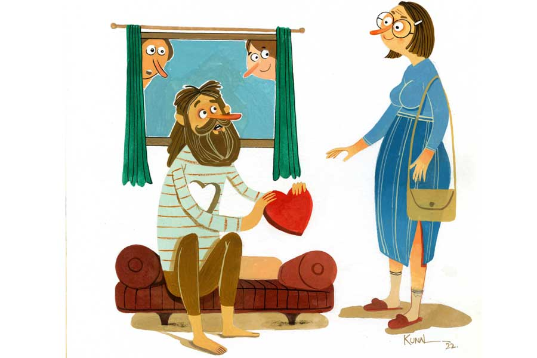

 
 <h1 align=center>সন্ন্যাসী</h1>
<h2 align=center>মৃত্যুঞ্জয় দেবনাথ</h2> বিবাহ নৈব নৈব চ। এই স্থির করে বিশুদ্ধ সন্ন্যাস ব্রতই গ্রহণ করলেন রামচন্দ্রদা।

কথাটা আলোর গতিবেগে রাষ্ট্র হল। রান্নাঘরে বসে চারাপোনা কাটছিলেন থুত্থুরে মুন্নিপিসি। মাছের বদলে আঙুল কেটে বসলেন। চিলতে বারান্দায় ছাত্রছাত্রী পড়াতে বসেছিল বিক্রম, রামচন্দ্রর ছোটভাই। অঙ্কের সূত্র আওড়াতে গিয়ে ভুলভাল বকল। নেপালচন্দ্র, রামচন্দ্রদার মধ্যম ভ্রাতা, নিবিষ্টমনে তবলা ঠুকছিল, দেদার উল্টোসিধে বাজাল।

দুঃসংবাদ শুনে বন্ধুরা এসে ভিড় জমাল। রতন সামন্ত বললেন, “ছেলেমানুষি করিস না। এমন সিদ্ধান্ত নেওয়ার আগে সহস্র বার ভাবা উচিত। অনেক রথী-মহারথীদের দেখা আছে। চল্লিশ-বিয়াল্লিশ অবধি ধ্যানী যোগীর ভড়ং করল। তার পর সুড়সুড় করে গিয়ে ছাঁদনাতলায় আত্মসমর্পণ। জানবি, জীবনের এ অনিবার্য পরিণতি। এর গত্যন্তর নেই কোনও।”

“গত্যন্তর আছে। সেটাই করে দেখাব,” দৃঢ়স্বরে বললেন রামচন্দ্রদা।

তেড়েফুঁড়ে উঠলেন পরান। রামচন্দ্রদার নেশাতুতো বন্ধু। বাড়ি দত্তপাড়াতেই। পেশা, টইটই। ঘরের খেয়ে কৃতিত্বের সঙ্গে বনের মোষ তাড়িয়ে থাকেন ইনি। তুড়ি মেরে বলেন, “রাখ তোর প্রতিজ্ঞা। জীবন একটাই। জীবনে এক জন সঙ্গীর প্রয়োজন হয়। যাকে বলে, জীবনসঙ্গী। যত দিন গড়াবে, এ সত্য প্রাণবন্ত হয়ে উঠবে।”  

“আর আমার যোগসাধনা?” 

শুনে ঘোড়ার মতো হাসেন নিরাপদ, “ধুস, রাখ তোর ও সব যোগ-বিয়োগ। ভুলভাল অঙ্ক কষছিস ধ্যানস্থ হয়ে। আপাতত তোর জীবনে নারী-যোগের আশু প্রয়োজন।”

“চুপ কর!” বলে সিগারেটে অগ্নিসংযোগ করলেন রামচন্দ্রদা। তার পর এক মিনিটের নীরবতার পর বললেন, “শুনে রাখ, আমি এখন উচ্চমার্গের যাত্রী। সামনে একটাই টার্গেট। একটি মনের মতো মন্দির গড়ে তোলা। নিজ বাসভূমেই। আর কিচ্ছু চাওয়া নেই আমার।”

ও দিকে আঙুল কেটে মুন্নিপিসির রক্তারক্তি কাণ্ড। তবু রক্তপাতের শোকতাপ ভুলে এ ঘরে এসে দিব্যি সমর্থন করে গেলেন রামচন্দ্রদার অভূতপূর্ব সিদ্ধান্তটিকে। বললেন, “হক্কলের একটা নিজইস্ব স্বাধীনতা আচে। কে কীটা করব, তা তার ব্যাপার। রাম কইচে বিয়া করব না, বেশ কতা। না-ইচ্চা অয়, করার দরকারডা কী? আমিও ত করি নাই। তাতে কী খেতি অইল?”

সকলের সবিস্ময় দৃষ্টি মুন্নিপিসির দিকে। রামচন্দ্রদারও। সেই সন্দিগ্ধ দৃষ্টির সামনে পড়ে ঢোঁক গিলতে বাধ্য হলেন মুন্নিপিসি। ফোকলা দাঁতে অল্প হেসে আত্মপক্ষ সমর্থন করে বললেন, “ওই আর কী, বিয়ার কয় বছরের মাতায় বিদবা অইলাম। কলেরা অই চোক বুজলেন উনি। তাপ্পর এইখানে আই দাদার সংসারে আশ্‌শয়। ভাইপো-ভাইজিগরে লই জেবন কাটাই দিলাম। অরেঅ বিয়া কয়?”

কথা শেষ করে প্রাণাধিক রামচন্দ্রের দিকে দৃষ্টিপাত করলেন মুন্নিপিসি। দৃঢ়স্বরে বললেন, “শুন, কারো কতায় কান দিস না। যদি ভাবচ বিয়া করা বাডেন, থাউক গিয়া। দরকার নাই ওই বোজা ঘাড়ে চাপানের। তা চাড়া দেকি ত, ছিনামা-ছিরিয়াল চলতাচে ঘরে-ঘরে। শান্তি নাই কোতাঅ। বরবৌ চুলাচুলি করে। আঁচড়ায়-কামড়ায়। তুই সইন্ন্যাস নিবি সিদ্ধান্ত নিচস, উত্তম। এ মহাপুরুষগ কাম। তর মনে এমন মহৎ ভাব উদয় অইল, তারে ধইরা রাক।”

*****

প্রজাপতিটা আজ ক’দিন ঘুরঘুর করছে এ ঘরে। আসন পেতে ধ্যানস্থ হয়ে বসেছিলেন সবে রামচন্দ্রদা। অমনি ধ্যানভঙ্গ। আচমকা কে যেন মাথার চুলে বিলি কেটে চলে গেল। তাকিয়ে দেখেন প্রজাপতিটা। উড়ে গিয়ে ক্যালেন্ডারের গায়ে বসল।

আসন ছেড়ে উঠে দাঁড়ালেন রামচন্দ্রদা। হাত বাড়িয়ে ‘যা-যা’ বলে তাড়ানোর চেষ্টা করলেন ক-বার। তারপর রণে ভঙ্গ। আপনমনে ভাবেন, স্বয়ং ব্রহ্মার ষড়যন্ত্র নয় তো? দূত পাঠালেন ধ্যানভ্রষ্ট করতে? কিন্তু কোনও ঝড়ঝঞ্ঝা বা প্রলোভনেই টলছেন না তিনি। স্বয়ং মদনদেব এসে চরণযুগল ধরে লুটোপুটি খেলেও না।

অনেক কসরতের পর প্রজাপতিটা ঘর ছাড়ল। রামচন্দ্রদা প্রতিজ্ঞাবদ্ধ হয়ে দরজা অবধি এগোলেন ওটিকে বিদেয় করতে। অমনি পিলে-চমকানো দৃশ্যটির সম্মুখীন হলেন। দেখলেন, দরজার অদূরে দাঁড়িয়ে মধ্যমভ্রাতা নেপাল। একা নয়। সঙ্গে একটি মেয়ে। লাল শাড়ি, এক মাথা সিঁদুর। নববিবাহিতা। কাতলা মাছের মতো গড়ন ও মুখশ্রী। নেপালের ঠোঁটে লজ্জার হাসি। মিনমিন করে বলল, “তোমার বৌমা। বিয়ে করে ফেললাম দুম করে।”

“বি-বি”... তোতলা হয়ে গেলেন রামচন্দ্রদা। এবং বাকরুদ্ধ।

নেপাল তত ক্ষণে বৌটিকে বগলদাবা করে হনহনিয়ে ভেতরঘরে ঝাঁপ। সে দিকটায় ছিলেন মুন্নিপিসি। আচমকা ‘নতুন বৌ আইচে’ বলে শোরগোল তুললেন। শুনে রাগে গরগর করছেন রামচন্দ্র। ওই এক নির্বোধ উলালেবুড়ি। কোথায় ধিঙ্গি ছেলেটা ঘোড়া ডিঙিয়ে ঘাস খেল, তার জন্য দু’টি ঝাঁটার বাড়ি মারবেন, তা নয় আহ্লাদে চেল্লামিল্লি জুড়লেন। ঝড়ের বেগে এক বার এসে রামচন্দ্রদার ঘরেও ঢুঁ মেরে গেলেন মুন্নিপিসি। একে বুড়ি থুত্থুরি, তায় লিকপিকে পাটকাঠি চেহারাটি। উল্টেই পড়ছিলেন আলনার কোণে শাড়ি জড়িয়ে। বুড়ির কাণ্ড দেখো, উনি শাঁখ খুঁজছেন। আহ্লাদে বিড়বিড় করছেন, “আহা রে, ঘরে নতুন বৌ আইচে। শাঁক বাজাইতে অইব যে!”

রামচন্দ্রদার ধ্যান ডকে। বাক্য হারিয়েছেন অনেক ক্ষণ। রাগেও ফুঁসছেন। অথচ একটি অর্ধচন্দ্র দিয়ে ঘর-বার করবেন কুলাঙ্গার ভাইটিকে, সে শক্তি হারিয়েছেন। কী আশ্চর্য! এমন লাগছে কেন শরীরটা তার? তালগোল পাকিয়ে যাচ্ছে সব। চোখে কি ঝাপসা দেখছেন? হা ঈশ্বর!

*****

সন্ধ্যায় বাড়িতে ছোটখাটো মেলা বসল। প্রতিবেশীরা ঘরে ঢুকেই জিজ্ঞাসু দৃষ্টি নিয়ে রামচন্দ্রদার দিকে তাকায় সবাই। রামচন্দ্রদা রক্তচক্ষু মেলে খেঁকিয়ে ওঠেন, “এখানে কী? সার্কাস চলছে বুঝি?”

বন্ধুকুল সমব্যথী হয়ে একে-একে রামচন্দ্রদার কাছ ঘেঁষে বসেছে। সকলেই মনমরা। রতন বললেন, “ভাইটি তোমার তলে-তলে এতখানি, রামদা? ছিঃ ছিঃ, কালীমন্দিরে গিয়ে অপকম্মটি সেরে এল? এক বারটি তোমার কথা ভাবল না?”

রামচন্দ্রদা ম্লান মুখে তাকান, বলেন, “আজ আমার সবচেয়ে শোকের দিন। পিতামাতার মৃত্যুতেও এতটা আহত হইনি। ইচ্ছে হচ্ছে এই মুহূর্তে গৃহত্যাগী হই। শান্তির সন্ধানে হিমালয় গমন করি।”

নিরাপদর ঠোঁটে ফিকে হাসি। হাতে জ্বলন্ত বিড়ি। রামচন্দ্রদার দিকে সেটি বাড়িয়ে ধরে বললেন, “নে, দু’টি টান মার দেখি। মাথাটা ঠান্ডা কর। তুই সংসারের বড়। কথায়-কথায় অত রাগ দেখালে চলে না।”

বিড়িটির দিকে সমীহ ভরে তাকান রামচন্দ্রদা। সেটি ঠোঁটে গুঁজতে রাগও প্রশমিত। বিড়ি টানতে টানতে বিড়বিড় করেন, “ওটা ভাই নয় রে, একটা রাসকেল। ও আমার মুখে চুনকালি লেপন করল। ইচ্ছে করছে দু’টিকে যথেচ্ছ ঝাড়ুপেটা করি। কিন্তু ঈশ্বর হাত দু’টিও শেকলে বেঁধে রেখেছেন যেন। যত দেখছি, ভাবছি, শক্তিহীন হয়ে পড়ছি তত।”

পরান বিড়িতে সুখটান মেরে বললেন, “ট্রেন তো ঢুকে গেছে রামদা ঈশ্বরনির্দিষ্ট কারশেডে। ফেরত পাঠানোর সাধ্য নেই আর। বি পজ়িটিভ। কী ভাবে ব্যাপারটা এ বারে সমাজস্থ করা যায়, তাই ভাবো।”

“কী ভাবব? এর আবার পজ়িটিভ কী? পুরোটাই তো নেগেটিভ...”

“রোসো, রাম...” বলেন নিরাপদ, “পরান ঠিকই বলেছে। এখন একটা রাস্তাই খোলা। নো রাগ, নো গড়িমসি। জাস্ট সমঝোতা। দুই বাড়ি মিলেমিশে একটি বিবাহবাসর সাজানোর বন্দোবস্ত করো। সানাইয়ের পোঁ বাজুক। আলো জ্বলুক। তার পর চার-হাত এক। ব্যস, দায়িত্ব খতম।”

*****

পরদিন এসে উপস্থিত উদয়প্রতাপ গড়গড়ি। রাগিণী, মানে নেপালচন্দ্রের নববধূর বাবা। সঙ্গে কালো ধুমসো নন্দী-ভৃঙ্গী। ভদ্রলোকের মুখের দিকে তাকিয়ে রামচন্দ্রদা হাঁ। আশ্চর্য! বাপ-মেয়ে এক ছাঁচে বসানো। এটি বড় কাতলা। ওটি ছোট।

“নমস্কার, আমি রাগিণীর বাবা। ক’টা দরকারি কথা বলতে এসেছি...” বললেন ভদ্রলোক। চড়াম-চড়াম ঢাক বাজল বড় কাতলার ঠোঁটে, “জানেন আমার মেয়েটির বয়েস কত?”

রামচন্দ্রদা দু’দিকে মাথা নাড়েন, “আ-আমি জানব কেমন করে? মেয়ে তো আপনার।”

“উঁহু, ওইটি বললে শুনছি না,” উদয়প্রতাপ মাথা ঝাঁকান, “শুনুন, আপনি বহুত ঘোড়েল মাল। খবর নিয়ে জেনেছি সব।”

রামচন্দ্রদা পুনর্বার হাঁ।

“সতেরো বছর এক মাস। এখনও নাবালিকা। এই বয়েসের একটি মেয়েকে ঘর থেকে তুলে আনার পানিশমেন্ট জানেন?” কটমটিয়ে বলেন উদয়প্রতাপ।

“কে তুলে এনেছে?” রামচন্দ্রদার সবিস্ময় জিজ্ঞাসা।

“আপনি।”

রামচন্দ্রদা ভ্যাবাচ্যাকা। বিষম খাওয়ার দশা। তেড়েফুঁড়ে উঠে বললেন, “থামুন! কী সব বাজে বকছেন। আমি এ সবের মধ্যে নেই। ছিলামও না কোনও দিন। যা করার, গর্দভ ভাইটিই করেছে। স্কাউন্ড্রেল একটি। কোনও সম্পর্ক নেই ওর সঙ্গে আমার। ওটি আমার ত্যাজ্যভ্রাতা।”

“উঁহু, একদম চালাকি নয়। আমরা ঘাসে মুখ দিয়ে চলি না মশাই। সব বুঝি। পরিস্থিতি বুঝে হাতটি ধুয়ে ফেলতে চাইছেন। বলছেন, ও আপনার কেউ নয়। আদালতে দাঁড়িয়ে বলতে পারবেন?”

হতভম্ব রামচন্দ্রদা, বললেন, “আশ্চর্য কথা তো! এর মধ্যে আদালত আসছে কোথা থেকে?”

“আসবেই তো!” উদয়প্রতাপ ফিচেল হাসেন, “কান টানলে মাথা আসে যেমন। আমার আহ্লাদী মেয়েটিকে এনে ঘরে পুরেছেন। এখন অস্বীকার করার চেষ্টা করলে আদালত তো আসবেই।”

রামচন্দ্রদা হাবারামের মতো তাকান। ভাবেন, ‘তবে কী কুলাঙ্গার ভাইটি তার এই রাগিণীনাম্নী নাগিনীটিকে নিয়ে পালিয়ে এসেছে? যাকে বলে, অপহরণ? ছিঃ ছিঃ!’

“শুনুন মশাই, ভাইটিকে মনে-মনে গাল না-দিয়ে নিজেকে দিন! ভেবে দেখলে, সত্যিকারের অনুগত ভ্রাতা লক্ষ্মণ আপনার ভাইটি। যদিও আপনি রামচন্দ্র হওয়ার যোগ্য নন। ডাহা ফেল।”

রামচন্দ্রদা বাক্যরহিত। অথৈ জলে নেমে পাঁকাল মাছ খুঁজে চলেছেন যেন। কী উত্তর দেবেন, ভেবে উঠতে পারছেন না। লোকটি আসলে কী বলতে এলেন, তাই তো বোঝা গেল না এখনও।

উদয়প্রতাপ আসল কথায় এলেন, “শুনুন, ভাইটি আপনার যথেষ্ট ভদ্র বলেই মেয়েটাকে আমার এত্ত ভুগিয়েছে। তার মূলে আপনি। ইউ আর দ্য কালপ্রিট। যাকে বলে, নাটের গুরু। আপনি নাকি সন্ন্যাসী হওয়ার পণ করেছেন?”

“তাতে আপনার কী?” ঝাঁঝিয়ে ওঠেন রামচন্দ্রদা।

“তাতেই তো যত গন্ডগোলের সূত্রপাত। আপনার প্রাণের ভাইটিও গোঁ ধরল, সে বিয়ে করতে পারবে না রাগিণীকে। ব্যাপারটা যে খুবই লজ্জার। ও-ই বা কেমন করে বুড়োভাম দাদাটিকে ওভারটেক করে বেলতলায় যায়? অবশেষে বুদ্ধিটা আমাকেই বাতলাতে হল মেয়েকে। আপনার ভাইয়ের মাইনে যেমনই হোক, সরকারি চাকুরে তো। হাতছাড়া করে মরি আর কী। হা হা হা...” বলে শিম্পাঞ্জির মতো হাসলেন বড় কাতলা। ফের রুক্ষ চাহনি মেলে তর্জনী নাড়লেন, “শুনে রাখুন, সুষ্ঠু ভাবে বিয়েটা যাতে হয়, তার যথাযথ আয়োজন করুন। ট্যাঁ-ফোঁ করেছেন তো, সোজা থানা। দমদম থানার বড়বাবু কে আমার জানেন? বড় শ্যালক। বি কেয়ারফুল!”

*****

তার পর এল শুভদিন। এগারোই অগ্রহায়ণ। আড়ম্বরপূর্ণ অনুষ্ঠানের আয়োজন হল রামচন্দ্রদার বাড়িতে। শ’পাঁচেক প্রত্যক্ষদর্শী সাক্ষী রেখে সাতপাক ঘুরল নেপাল-রাগিণী। প্যান্ডেল হল, আলো জ্বলল, বাজল সানাই। এর অনেকখানিই বহন করলেন উদয়প্রতাপ। অঢেল ধনসম্পত্তির মালিক। মেয়ের বিয়েতে ঢাললেন তারই কণিকামাত্র।

কিন্তু এত ধকল নিতে পারলেন না রামচন্দ্রদা। কায়িক-মানসিক, দ্বিমুখী ধাক্কায় শয্যা নিলেন অচিরেই। অবনীডাক্তারই নাড়ি টিপে বললেন, “সন্ন্যাস রোগের সিম্পটম। গো টু হসপিটাল।”

হাসপাতালের দুর্গন্ধময় খোঁয়াড়ে আট দিন কাটালেন রামচন্দ্রদা।

আপাতত নিজ ঘরে চিত হয়ে পড়ে। জড়সড় শরীর। আমসিপারা মুখ। দেহের দক্ষিণাংশ নট নড়নচড়ন। ক্ষণে ক্ষণে সে দিকে দৃষ্টিপাত করে বিড়বিড় করেন রামচন্দ্রদা, “ঠাকুর, এ কী সঙ্কটে ফেললে আমায়! চেয়েছি সন্ন্যাসব্রত; গছালে সন্ন্যাসরোগ! এ তোমার কেমনতর বিচার!”

এক দিন এলেন উদয়প্রতাপ। তাকে দেখে জবুথবু ভাব বাড়ল রামচন্দ্রদার। তার এই করুণ পরিণতির মূলে এই দৈত্যদানোটিই।

বড় কাতলা বলে, “এখন কী অসুবিধে? শরীর অবশ? সব ঠিক হয়ে যাবে। এক জন ফিজ়িয়োথেরাপিস্ট চাই। ব্যবস্থা করে পাঠাচ্ছি এক্ষুনি।”

বলে বাইকে ধোঁয়া ছড়িয়ে বাড়ির পথ ধরলেন উদয়প্রতাপ।

*****

ঘণ্টাদুই পর সুদৃশ্য ব্যাগ কাঁধে দরজায় এসে দাঁড়ালেন তিরিশোর্ধ্ব এক মহিলা। লম্বা। ছিপছিপে গড়ন। গায়ের রং শ্যামলা। চশমা পরিহিতা। 

ভদ্রমহিলা এসে সামনে দাঁড়াতে রামচন্দ্রদার চক্ষুস্থির। ভদ্রমহিলারও এক দশা। দু’জনে-দু’জনের দিকে তাকিয়ে হাঁ। অনেক ক্ষণ সেই হাঁ-বোজার নাম নেই। 

নীরবতা ভেঙে ককিয়ে উঠলেন রামচন্দ্রদা, “এ কী! শিল্পা! তুমি?”

শিল্পা ভ্যাবাচাকা ভাব কাটিয়ে মুখ খুললেন, “হ্যাঁ আমি। ফিজ়িয়োথেরাপিস্ট।”

“কিন্তু তোমার তো বি...”

“না, আমার বিয়ে হয়নি। মানে, করিনি। জীবনের প্রথম প্রেমের কলিটি ফুটবে-ফুটবে করেও অঙ্কুরে ঝরে যেতে এই একাকী জীবনকেই বেছে নিলাম।”

“বলো কী!” রামচন্দ্রদা বিছানা থেকে কঁকান।

“যাকগে, ও সব ছাড়ো। এখন যে কাজে এসেছি তা-ই করি। প্রবলেমটা কী শুনি।”

প্রবলেম বলবেন কী রামচন্দ্রদা, কথা বলার শক্তিই হারালেন যে। এক যুগ আগে অবহেলায় হারানো শিল্পা ফিরে এল তার কাছে ফের। সেবিকার বেশে। কী আশ্চর্য! এমনটি যে সিনেমায় ঘটে। স্বয়ং ব্রহ্মারই নিপুণ ষড়যন্ত্র নাকি!

ফিজ়িয়োথেরাপি চলল মাসতিন। অনেকখানি সচল এখন রামচন্দ্রদা। উঠে দাঁড়াতে পারছেন। হাঁটতেও। তারই মধ্যে বিদায়বাণী শোনালেন শিল্পা। সুর্য অস্ত যাওয়ার পূর্বমুহূর্তের এক গোধূলি ক্ষণে কাঁধে ব্যাগটি ঝুলিয়ে বললেন, “চলি।”

“চলি! মানে?” রামচন্দ্রদার আর্দ্রকণ্ঠ। আর্তও।

“মানেটা সহজ। পেশেন্ট সুস্থ। আমারও ছুটি,” বলে শিল্পা ঘরের চৌকাঠ ডিঙিয়ে রাস্তায়।

রামচন্দ্রদা বিছানা ছেড়ে উঠে এলেন দরজা অবধি। ফের ককিয়ে উঠলেন, “শিল্পা, এমন করে চলে যেতে পারো না তুমি।”

রামচন্দ্রদার চোখে জল।

পিছু ফিরে তাকান শিল্পা। কাতর হাসেন, বলেন, “তুমি সন্ন্যাসী রামচন্দ্রদা। ব্রহ্মচারী।”

“ছিলাম। পাস্ট টেন্স!” রামচন্দ্রদার ব্যথিত উত্তর, “সন্ন্যাস এবং সন্ন্যাসী— কালচক্রে দুটি রোগেরই নিষ্পত্তি ঘটেছে আমার। ফিরে এসো শিল্পা।”     

*****

দিন-পনেরো যেতে উপস্থিত উদয়প্রতাপ। মাথা ঝাঁকিয়ে বললেন, “এমন লজ্‌ঝড়ে বাড়ির অস্বাস্থ্যকর পরিবেশে থাকতে অভ্যস্ত নয় আমার মেয়ে। শিল্পা মেয়েটিও বেশ। এমন হতদরিদ্র একটি বাড়িতে দিন কাটাবে কেন ওরা? মগের মুলুক নাকি! এটিকে ভেঙে সেমি কমপ্লেক্স বানানোর পরিকল্পনা নিয়েছি আমি। ভাইয়েরা সবাই একটা করে ফ্ল্যাট পাবে, ক্যাশও পাবে।”

শুনে আঁতকে উঠলেন মুন্নিপিসি। চোখ ছানাবড়া করে তাকালেন। লিকপিকে হাত-পা ছুড়ে কুঁইকুঁই করলেন। কিন্তু জুতসই সাপোর্টের অভাবে কাজে এল না তাঁর প্রতিবাদ।

তত ক্ষণে কাগজপত্রের বান্ডিল খুলে বসেছেন উদয়প্রতাপ। একেবারে গোছানো কাজ। তাতে স্বাক্ষর করার জন্য ভ্রাতা লক্ষ্মণটিকে পাশে নিয়ে লাজুক মুখে কলম বাগিয়ে বসলেন রামচন্দ্রদা।