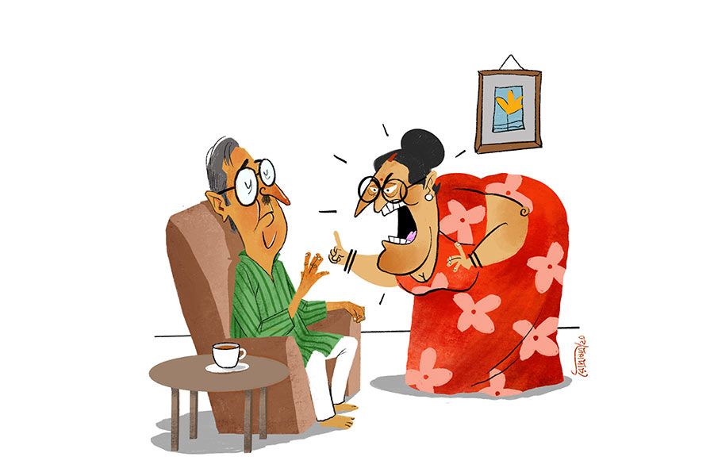

 
 <h1 align=center>সবিতা বৌদির তিন ঝামেলা</h1>
<h2 align=center>সুমন সরকার</h2> সবিতা বৌদি বেশ বড় ঝামেলায় পড়ে গিয়েছেন। তবে বড় ঝামেলার কথায় আসার আগে মেজ ঝামেলা আর ছোট ঝামেলার কথা বলে নেওয়া যাক। আগে ছোট ঝামেলা। তিন জনের সংসার সবিতাবৌদির। স্বামী অজয়বাবু সরকারি চাকরি থেকে অবসরপ্রাপ্ত। ক্যাবলাকান্ত টাইপের। আর এই ক্যাবলামির যোগ্য দোসর তাঁর শ্রবণশক্তির চোরা লিক। অজয়বাবু কানে কম শোনেন, আর যতটুকু শোনেন, তাও মাঝে মাঝে ভুল শোনেন। অজয়বাবু রিটায়ার করার পর দার্শনিক হয়ে গেছেন। মানে হঠাৎই। উনি মাঝে মাঝে কানের যন্ত্রটি যথাস্থানে লাগাতে ভুলে যান। সবিতাবৌদি জানতে পেরে তীব্র চিৎকার করেন। অজয়বাবু নির্বিকার বলেন, “আমাদের চার দিকে অনেক রকম শব্দ হচ্ছে। সব শোনার দরকার নেই। কিছু কিছু শুনলেই হবে।” আশপাশের সমস্ত শব্দের মধ্যে সব শোনার দরকার নেই— এই দার্শনিক সত্যটি অজয়বাবু আবিষ্কার করেন কোনও এক সকালে গিন্নির লম্বা লেকচারের অনেকটা শুনতে না পেয়ে। আর মনে মনে ধন্যবাদ দেন, রিটায়ার করার পর তাঁর কানটি বিগড়েছে বলে।

এই কানে শোনার সমস্যার জন্য মাঝে মাঝেই শুকনো কেস খেয়ে যান নিরীহ অজয়বাবু। সবিতা বৌদি সাহিত্যচর্চা করেন। আগে করতেন না। সম্প্রতি শুরু করেছেন। কারণ ফেসবুক। ফেসবুক বাঙালিকে বুঝিয়ে দিয়েছে, স্বরাজ তোমার অধিকার হোক বা না হোক, সাহিত্য তোমার অধিকার। সবিতা বৌদি ফেসবুকে বেশ জনপ্রিয় হয়েছেন লেখালিখি করে। পরিচয় হয়েছে বেশ কিছু কালচারাল লোকজনের সঙ্গে। সে রকমই এক জন ভজন পাল। এক দিন সন্ধ্যায় ভজন পাল সপরিবার এসেছেন সবিতা বৌদির বাড়ি। অজয়বাবুর সাহিত্যে আগ্রহ নেই। গিন্নি পইপই করে বলে রেখেছেন, ভজনদার সামনে বেশি মুখ না খুলতে। আসলে ফেসবুকে সাহিত্য বিষয়ে যে সব সক্রিয় গ্রুপ আছে, সেগুলিতে ভজনদার বেশ ইয়ে আছে। যাই হোক, সবিতা বৌদির বাড়িতে আড্ডা ভালই জমে উঠেছিল। ভজনদা প্ল্যান করছিলেন এক দিন সপরিবার পুরুলিয়া ঘুরে আসবেন। ভাল খাবার কোথায় পাওয়া যাবে জানতে চাইলেন। অজয়বাবু বললেন, “শুনেছি, ওখানে ‘বড়বাইরে’ নাম একটা দারুণ হোটেল আছে। ওদের মাছের ডিমের বড়াটা অসাধারণ।”

ভজনদা একটু চুপ করে গেলেন! বললেন, “বড়বাইরে?”

এ বার অজয়বাবু ঠিক শুনলেন, বললেন, “ওহ্ যাবেন? আসুন, দেখিয়ে দিই।”

সবিতা বৌদি এগিয়ে এলেন ডিজ়াস্টার ম্যানেজ করতে, “হে হে হে, জানেন ভজনদা, ওঁর আবার কানের ইয়ে। না হলে কেউ ‘ঘরেবাইরে’কে বড়বাইরে বলে?”

ভজনদাও পরস্ত্রীর প্রতি ঢলানি-মার্কা একটা হাসি দিলেন। অজয়বাবু সব কিছু লেটে বোঝেন। উনি বললেন, “ভজনদা, লজ্জা করবেন না প্লিজ। আর আমাদের বাথরুম একদম চকচকে, বড়, ছোট, মেজ বাইরে— যা-ই হোক, নির্ভয়ে চলে যান।”

সে বার সবিতা বৌদির দরবারে এ অপরাধের ভালই মাশুল গুনতে হয়েছিল অজয়বাবুকে।

এ বার আসা যাক মেজো ঝামেলার প্রসঙ্গে। অজয়বাবু আর সবিতা বৌদির একমাত্র মেয়ে সোহিনী, ডাকনাম টিকলি। টিকলির কিছুতেই বিয়ে হচ্ছে না। টিকলির কোনও সমস্যা নেই। উপযুক্ত পাত্র মিলছে না। টিকলি প্রেম করে, কিন্তু টেকসই হয় না। একটা ব্রেকআপ টিকলিকে প্রেমের প্রতি অতিরিক্ত সন্দেহপ্রবণ করে তুলেছে। সে একটু ঝামেলা হলেই ব্রেকআপ করে দেয়। প্রেমিককে ব্রেকআপ করার সুযোগ দিতে সে রাজি নয়। প্রেমিক কোনও কারণে রেগে গিয়ে আগে ব্রেকআপ করতে চাইলেও টিকলি গলে জল হয়ে প্যাচ-আপ করে নেয়। ওটা সাময়িক অভিনয়। পরে নিজে ব্রেকআপটা করে। আজকাল ডায়েরি মেনটেন করছে, তাতে গত দু’বছরে উনিশটা ব্রেকআপের রেকর্ড। বন্ধুমহলে গর্ব করে বলে, “ফ্রেন্ডই হোক আর বয়ফ্রেন্ড, বেয়াদবি টিকলি কভি সহ্য নেহি করেগি। দেখবি বেচাল, মারবি বেড়াল।” কিন্তু বেড়ালের পর বেড়াল মেরেই কি না কে জানে, টিকলির ভাগ্যে এখনও শিকে ছিঁড়ল না। ছিঁড়বেই বা কী করে, ব্রেকআপের বিরিয়ানি যার মুখে লেগে গেছে, রিলেশনশিপ তো তার কাছে নুন-ছাড়া আলুভাতে!

ছোট আর মেজোর পর এ বার আসল, অর্থাৎ বড় ঝামেলার কথা বলতেই হচ্ছে। একটাও মনের মতো কাজের লোক আর রান্নার লোক পাচ্ছেন না সবিতা বৌদি। লোক রাখছেন, কিন্তু কিছু দিন পর সে ঝুলিয়ে দিচ্ছে। হয় তিনি ছাড়িয়ে দিচ্ছেন, অথবা ওরাই কাজ ছেড়ে দিচ্ছে। কেউ টিকছে না। বাড়িতে ঝি টিকছে না, টিকলির প্রেম টিকছে না, অজয়বাবুর শ্রবণশক্তিও বেশি ক্ষণ টিকছে না।

সবিতা বৌদিকে আজ অবধি কোনও কাজের লোক খুশি করতে পারেনি। প্রথমে বাসন মাজা, ঘর মোছার লোক ছিল। এখন রান্নার লোক আছে। ডবল ট্রাবল! পাড়ায় তীব্র পিটপিটে মহিলা হিসেবে সবিতা বৌদির কুখ্যাতি আছে। টাকা দিতে কার্পণ্য করেন না। তার বদলে কাজেও যেন কেউ কার্পণ্য না করে, এই তাঁর দাবি। কিন্তু আজ অবধি কেউই তাঁর দাবি মিটিয়ে উঠতে পারেনি। তিনিও একটার পর একটা কাজের লোক পাল্টে গেছেন। কাজের লোকের দিকে একদম সিসিটিভির মতো চেয়ে থাকতেন সবিতা বৌদি। বাসনে দাগ লেগে থাকবে না, ঘরের কোথাও একটুও ময়লা থাকবে না, ঝুল থাকবে না, আরশোলা থাকবে না, উচ্চিংড়ে থাকবে না। এত দাবি কে মানবে! এক সময় এমন অবস্থা দাঁড়াল যে, আর কাজের লোক পাওয়া যাচ্ছে না। যাঁরা কাজ করেন, সকলেই কোনও না কোনও সময়ে কাজ করে গেছে এই বিষাক্ত বাড়িতে।

পাশের বাড়ির আয়লা মাসি বললেন, “সবিতা, তুমি জানো তো কলকাতার ভাল ভাল ছেলেমেয়েরা সবাই বেঙ্গালুরু চলে যাচ্ছে। কেন? ওখানে চাকরি আছে। একটা ছাড়লে আর একটা আছে। সেটা ছাড়লে আর একটা আছে, অনেক কোম্পানি। আর কলকাতায় দু’-তিনটে! তুমি বরং বাড়ি পাল্টে ফেলো। অন্য কোথাও ফ্ল্যাট কেনো, কোনও বড় কমপ্লেক্সে। ওখানে তুমি অনেক কাজের লোক পাবে। বার বার পাল্টালেও লোকের অভাব হবে না। এখানে স্যাচুরেটেড।”

প্ল্যানটা প্রথমে মনে ধরেছিল সবিতা বৌদির। কিন্তু নিজের বাড়ি ছেড়ে ফ্ল্যাটে যেতে উনি রাজি নন মোটেই। অগত্যা পুরোনো লোকেদেরই আবার ডাকতে শুরু করলেন। কেউ কেউ রাজি হল। কিন্তু আবার কাজে ঢুকেও কাজ ছাড়ল। এ ভাবেই চলছিল। তার পর রান্নার লোক রাখা হল। সেটাও হঠাৎই। এক দিন সবিতা বৌদি অভিমান করে অজয়বাবুকে কথা শোনাচ্ছিলেন। বলছিলেন, “সারা জীবন শুধু কান্না আর কান্না। আর কী দিয়েছ তুমি?”

অজয়বাবু সব শুনে বললেন, “ঠিক আছে, আর রান্না নয়। কাল থেকে রান্নার লোক দেখো।”

শুরু হল রান্নার লোক খোঁজা। প্রথমে এল চামেলি। সে দাবি করেছিল তার মতো রান্না ইহজগতে কেউ করতে পারে না। অতি সত্যি দাবি। অমন থার্ড ক্লাস রান্না জগতে বিরল। ওর রান্না খেয়ে অজয়বাবুর পেট ছেড়ে গেল। তাই চামেলি বিদায়। এর পর পারুলদি। পারুলদিও রান্না খারাপ করতেন, আবার টুকটাক জিনিস ঝেড়েও দিতেন। কোনও দিন পটল, কোনও দিন ঝিঙে। তেলের বোতল থেকে তেল উধাও হয়ে যেত ম্যাজিকের মতো। পারুলদিকে বিদায় জানালেন সবিতা বৌদি।

এর পর এল বাদলি পিসি। আগে যারা ছিল, তারা একটু আধটু রান্না জানলেও বাদলি পিসি রান্না একদমই জানেন না। এক সময় বাসন মাজার কাজ করতেন। তার পর বয়স বেড়ে যাওয়ার পর নিজেই নিজেকে প্রোমোশন দিয়ে রান্নার লোক বানিয়ে ফেলেছেন। উনিও দাবি করলেন, ওঁর রান্না যারা খায় তারা ভুলতে পারে না। তিনিও মিথ্যে বলেননি। ওই জঘন্য টেস্ট এক বার খেলে ভোলা মুশকিল। বাদলি পিসি লেখাপড়া জানতেন না। ঘড়িও দেখতে পারতেন না। শুধু ‘আগে’ আর ‘পরে’ বুঝতেন। হয়তো কোনও দিন বললেন, আগে আসবেন। সেটা সকাল আটটা হতে পারে, সাতটা হতে পারে, সাড়ে ছ’টাও হতে পারে। পরে আসব বললে, সেটা দুপুর একটা হতে পারে আবার সকাল সাড়ে এগারোটাও হতে পারে।

সবিতা বৌদির রাগ মাত্রা ছাড়িয়ে গেছে। এক দিকে রিঙ্কুর মা বাসন মাজতে গিয়ে ঝোলাচ্ছে, অন্য দিকে বাদলি পিসি! উনি আর বাদলি পিসিকে কাজে রাখতে রাজি নন। হঠাৎই অজয়বাবু উদয় হয়েছেন সিনে! এত দিন কাজের লোক বা রান্নার লোকের বিষয়ে কোনও টিপ্পনী কাটেননি এই ভদ্রলোক। এই প্রথম। আসলে উনি বাদলি পিসির মধ্যে খুঁজে পেয়েছেন এক সার্থক দার্শনিককে। গোটা দুনিয়া সময়ের দাসত্ব করছে। সেই সময়কে জাস্ট ‘আগে’ আর ‘পরে’ দিয়ে সাইজ় করে দিয়েছেন বাদলি পিসি! বাদলি পিসি সময়ের নয়, সময় বাদলি পিসির দাসত্ব করছে! তা ছাড়া, বাদলি পিসি একদম ফাঁকা ক্যানভাস। ওকে শিখিয়ে নেওয়া যাবে। বাদলি পিসি তাই রয়ে গেছেন।

ও দিকে টিকলি পড়েছে মহা সমস্যায়। বাড়িতে মাকে কিছু বলতে গেলেই দেখা যায়, মা রেগে আছেন। রিঙ্কুর মা ঘরটা ভাল করে ঝাঁট দেয়নি। বাদলি পিসি পোস্তর ভিতর মাছের ডিম দিয়ে এক্সপেরিমেন্ট করে ছড়িয়ে গেছে। এই সব নিয়েই টিকলির মা গজগজ করছেন। কিছু বলতে গেলেই বলছেন, “তোরা সবাই মিলে আমাকে মেরে ফেল, আর পারছি না।” বাবাকে বলতে গেলে বলবেন, “কী দরকার বিয়ে করে! তোকে বিয়ে করলে আবার কোনও এক পুরুষের কানের ব্যামো হবে!” আবার একটু পরে বলবেন, “টিকলি এত দেরি করছিস কেন? তোর ওই মোহনকে বিয়ে করে ফেল না, ভাল ছেলে তো।”

টিকলি যত বার বলেছে তার বয়ফ্রেন্ডের নাম রোহণ, বাবা শুনেছেন মোহন। ব্রেকআপের পর টিকলি বলেছিল, “রোহণ আমার এক্স বয়ফ্রেন্ড।” অজয়বাবু রেগে আগুন, “ছি! আধুনিকতার নামে এই সব! আসলে তোর মা দিনরাত ঝি ঝি করে নিজের মেয়েটাকে মানুষ করতে পারেনি। বাবার সামনে মোহনকে সেক্স বয়ফ্রেন্ড বলতেও তাই মুখে আটকায় না!”

টিকলি বাবাকে সংশোধন করার চেষ্টা করেনি।

*****

চৌত্রিশ-পঁয়ত্রিশ বছর টাইম লাগতে পারে, কিন্তু সরকার পাল্টায়। তেমনই দিনকালও পাল্টায়। টিকলির জীবনে এসেছে নতুন প্রেম, বিবেক। বাড়িতে জানাতেই বাবা বলেছেন, “তোর আবার প্রেম! দু’দিন পর বলবি, বিবেক আমার সেক্স বয়ফ্রেন্ড!”

কিন্তু এ বার টিকলির প্রেমটা সত্যিই টিকে গেল। বিবেক মাঝে মাঝে আসে টিকলিদের বাড়িতে। টিকলির মায়ের ঝামেলার গপ্পো শুনে সে একটা উপায় বাতলে দিল। বিবেক বলল, “কাকিমা, আপনার মেজ ঝামেলার সমাধান, আমি। টিকলি আর আমি বিয়ে করছি। ছোট ঝামেলার কোনও সমাধান নেই। আমার বাবাও কানে কম শোনেন। আর আপনার বড় ঝামেলার জন্য আমার কাছে একটা ভাল সমাধান আছে। এত দিন প্রবলেম হয়েছে কারণ, কাজের লোকের রিক্রুটমেন্ট নিয়ম মেনে হয়নি। এ বার নিয়ম মেনে নিয়োগ হোক। অর্থাৎ সবাইকে প্র্যাকটিক্যাল ও ভাইভা দিতে হবে। যে পাশ করবে সে চাকরি পাবে।” তবে বিবেক এটাও বলল যে, “কাকিমা, আপনাকে নিজের ভাবনাচিন্তা একটু পাল্টে ফেলতে হবে।” অন্য কেউ এ কথা বললে সবিতা বৌদি তার মুখে ঝামা ঘষে দিতেন। কিন্তু হবু জামাইয়ের কথা আলাদা। বলছে যখন, একটু তো শুনতেই হয়! বিবেকের বক্তব্য খুব পরিষ্কার, “কাকিমা, কোনও দিনই মনের মতো কাজের লোক পাবেন না। ওই যে লালন ফকিরের গান আছে না, ‘মিলন হবে কত দিনে, আমার মনের মানুষেরও সনে’। মনের মানুষ আর মনের মতো কাজের মানুষ— সবটাই হাওয়ার নাড়ু। কল্পনামাত্র। বাস্তবে কোনও এক দিন বাসনে এঁটো লেগে থাকবেই, ঘরের ঝুল সবটা পরিষ্কার হবে না, রান্নায় তেল বেশি হবে, শুক্তো মুখে দেওয়া যাবে না, এ রকম হতেই থাকবে। সবচেয়ে কম খারাপ যে, সে তো আসলে সবচেয়ে ভাল নয়। তাই বার বার লোক পাল্টালে সমস্যার সমাধান হবে না। আসলে মনের মতো কিছুই হয়তো পাওয়া সম্ভব নয়।”

বিবেকের কথা শুনে উৎফুল্ল হয়ে অজয়বাবু বললেন, “আরে, এই কথাটা টিকলির মাকে আমি কত দিন ধরে বোঝানোর চেষ্টা করছি। দার্শনিক না হলে জীবন বৃথা। বুঝলে না, আমি কানে কম শুনি বলে আমার কথার কোনও ভ্যালু নেই!”

*****

অজয়বাবুদের বাড়ির বাইরে একটা সাইনবোর্ড ঝুলছে। তাতে লেখা, ‘কাজের লোক ও রান্নার লোক প্রয়োজন। ভ্যাকেন্সি-২।’ সবিতা বৌদি চেনা-পরিচিতদের মধ্যেও এই খবর ছড়িয়ে দিয়েছেন। নিয়োগ যাতে স্বচ্ছ হয়, তাই বিশেষ প্যানেল তৈরি হয়েছে বিভিন্ন এক্সটার্নাল এক্সপার্টদের নিয়ে। সবিতা বৌদির মাসতুতো বোন বাসন মাজার এক্সপার্ট। পাড়ার ঝিমলিদি ঝুল ঝাড়ার ও ন্যাতার এক্সপার্ট। রান্নার এক্সপার্ট হিসেবে আসছেন বিবেকের মা। এ ছাড়া সবিতা বৌদি সব কিছুর এক্সপার্ট। নিয়োগ একদম স্বচ্ছ করার জন্য যাঁরা আগে কাজ করতেন, রিঙ্কুর মা ও বাদলি পিসি— দু’জনকেই আবার পরীক্ষা দিতে হবে।

কাজের লোকের জন্য চারটি আর রান্নার লোকের জন্য তিনটি আবেদনপত্র জমা পড়েছে। সবাইকে এক দিন ডাকা হল। আগে থেকে বেশ কিছু এঁটো বাসন রেডি করা আছে, দু’দিন ঘর ঝাড়ামোছা হয়নি। এ সব আয়োজন পরীক্ষা নেওয়ার জন্য। সকাল দশটা থেকে ইন্টারভিউ শুরু হল। একটা পাঁচ টাকার ডিশওয়াশ বার কত দিন চালাতে পারবে, বাসন মাজার লিকুইড ভাল না কি বার সাবান, ন্যাতা কত বার বালতিতে ডোবালে ঘর চকচক করবে, কোন কাপড়ের ন্যাতা সবচেয়ে টেকসই, ইত্যাদি প্রশ্ন করা হচ্ছে। ইন্টারভিউ পাশ করল প্রতি পদে দু’জন করে। এ বার প্র্যাকটিক্যাল। এদের বাসন মাজা, ঝুল ঝাড়ার স্কিল পরীক্ষা করা হল। আর রান্নার লোকেদের, শুক্তো আর পাঁঠার মাংস রান্না করতে বলা হল। শুনেটুনে বাদলি পিসি কপালে হাত দিয়ে নমো ঠুকে বলল, “যাক, কোশ্চেন কমন পড়েছে!”

সবশেষে ফলাফল। কাজের লোকের জন্য শিবানী পিসি আর রান্নার লোকের জন্য বাদলি পিসি সিলেক্টেড হলেন। রিঙ্কুর মা চান্স পেলেন না। এক্সটার্নাল এক্সপার্টরা প্যাকেটবন্দি ঠান্ডা শিঙাড়া, বাসি গজা পেয়ে খুবই পুলকিত। মিনতি পিসির খুব ইচ্ছে ছিল এই বাড়িতে রান্নার কাজ করার। সে অনেক প্রস্তুতি নিয়েছিল। কিন্তু তার হল না।

নানা কানাঘুষোয় শেষ অবধি রিঙ্কুর মা এবং মিনতি পিসি জানতে পারল গল্পের আড়ালের গল্প। কে যেন তাকে বলল, বাদলি পিসি দাদাবাবুর ক্যান্ডিডেট! লবি না থাকলে আজকাল কিস্যু হয় না। আকাশের দিকে শূন্যদৃষ্টি দিয়ে দীর্ঘশ্বাস ছাড়লেন দু’জনে। যে কাজের লোকের জন্য নির্বাচিত হয়েছে, সে ছিল সবিতা বৌদির মাসতুতো বোনের ক্যান্ডিডেট। তাঁর বাড়ির কাজের লোকের বোন। দু’টি ক্ষেত্রেই নাকি ধরা-করা এবং বাঁ-হাতি দেওয়া-নেওয়ার ব্যাপার আছে। নগদে নয়। নজরানায়। দেশের বাড়ির নারকেল। পুকুরের মাছ। কাসুন্দি এবং আমতেলের শিশি। বিবেক খুব সফল ভাবে সবিতা বৌদির বাড়িতে কাজের লোক ও রান্নার লোকের স্বচ্ছ নিয়োগ করিয়ে দিল।