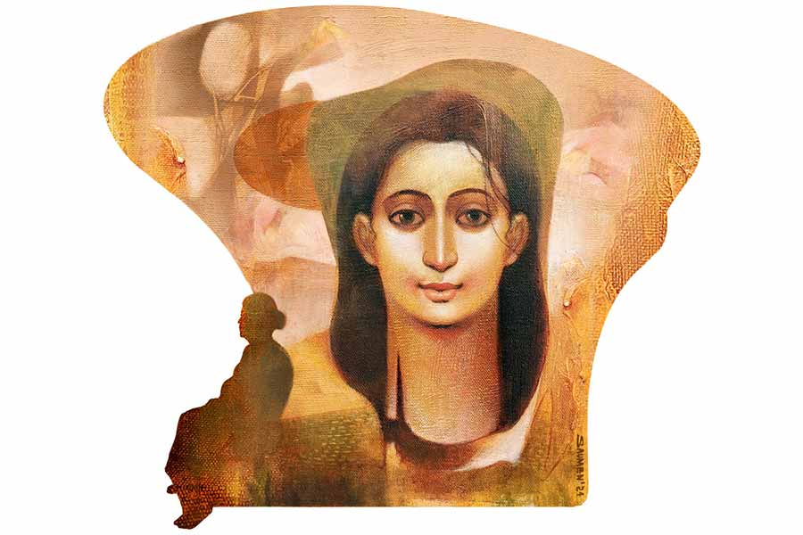

 
 <h1 align=center>সম্প্রীতি</h1>
<h2 align=center>ঋতুপর্ণা রুদ্র</h2> তারা স্বপ্ন দেখছিলেন। স্বপ্নে অর্চিষ্মান বলল, “মা, এই ব্যাপারে তুমি প্লিজ় কথা বোলো না। এটা আমার জীবন।”

তীব্র কষ্ট হল তারার, অরুণ চলে যাওয়ার পর, অর্চিকে আঁকড়েই তো বেঁচে আছেন তিনি। কবে এত বড় হল ছেলেটা? মা যা বলে, সে তো ওর ভালর জন্যই। এটুকু বুঝল না অর্চি!

“দিদিভাই, চা এনেছি।” 

স্বপ্নের ঘোর কাটিয়ে, তারার ঘুম ভাঙল বনানীর ডাকে। তত ক্ষণে পুবের জানলায় ঝকঝকে রোদ। চা খেতে খেতে গল্প হচ্ছিল অনেক। বনানী, তারার খুড়তুতো বোন। পিঠোপিঠি হওয়ার কারণে ছোটবেলায় ভাব ছিল খুব। তার পর তারার বিয়ে হয়ে গেল ব্যাঙ্ক-অফিসার অরুণের সঙ্গে। বনানীও বিয়ের পরে পাড়ি দিলেন আমেরিকা। যোগাযোগ কমে গিয়েছিল স্বভাবতই। তিন বছর আগে অরুণ জামাইবাবুর মৃত্যুর খবর বিদেশে বসেই পেয়েছিলেন বনানী। দিদির ছেলে অর্চিষ্মান ইঞ্জিনিয়ার। দিদি সারা দিন একাই থাকে।

সম্প্রতি দেশে ফিরে, কলকাতার উপকণ্ঠে এই দিগন্ত আবাসনে  ফ্ল্যাট কিনেছেন বনানী। দিদিকে আসতেও বলেছেন কয়েক বার, তারা কিন্তু রাজি হননি।

“না রে বনি, আমি না থাকলে অর্চির অসুবিধে হবে। জানিস তো, ছেলে আমার মা-অন্ত প্রাণ।”

অথচ সেই দিদি, দু’দিন আগে নিজেই ফোন করে বনানীর কাছে এসে সাত দিন থাকবেন বললেন। বনানী অবাক হলেও খুশি হয়েছেন।  গতকাল এসেছেন তারা।

দিগন্ত আবাসনের পশ্চিম দিকে, মস্ত সবুজ পার্ক আর একটা লেক আছে। লেকের জলে আকাশের মেঘ আর পাশের বাংলো-বাড়িগুলোর ছায়া পড়েছে।

“হ্যাঁ রে বনি, বিকেলবেলা ও দিকে বেড়াতে যাওয়া যায় না? কী সুন্দর ফুল ফুটেছে!” জিজ্ঞেস করেছিলেন তারা।

“যাবি না কেন দিদি? আজই যাস। দেখবি কত মানুষ পার্কে আসবে। আমারও ইচ্ছে করে। কিন্তু পায়ে ব্যথার জন্যই যাওয়া হয় না।”

*****

বিকেলে চা আর বনানীর তৈরি কেক খেয়ে হাঁটতে বেরোলেন তারা। কত মানুষ হাঁটছে, গল্প করছে। ফেব্রুয়ারির মাঝামাঝি, তবুও রাস্তার দুই ধারে ফুটে আছে গাঁদা আর পিটুনিয়া। তাদের ফাঁকে ফাঁকে খেলা করছে বাচ্চারা। এক পাশে মায়েরা হাসিগল্পে মত্ত। কিছু ক্ষণ হেঁটে ক্লান্ত তারা, একটা বেঞ্চিতে বসলেন।

বাড়ি থেকে আসার আগে অর্চিকে বলে এসেছেন, সে যা ভাবছে তা করতেই পারে। তিনি সেই সিদ্ধান্তের শরিক হবেন না, আবার বাধাও দেবেন না। অর্চিষ্মান চুপ করে শুনেছিল। গাড়ি দিয়ে মাকে পৌঁছনোর ব্যবস্থা করেছিল বটে, তবে নিজে আসেনি। এক বার ফোন করে কথা বলেছেন তারা, কিন্তু অর্চি ফোন করেনি।

চোখের কোণ থেকে এক ফোঁটা জল মুছে ফেলেন তারা, মুছেই দেখেন, বেঞ্চের অপর প্রান্তে আর এক জন এসে বসেছে। বেশ লম্বা, স্নিগ্ধ শান্ত মুখ, অল্প বয়স, পরনে সালোয়ার কামিজ। জলের দিকে তাকিয়ে যেন কিছু ভাবছে।

তারা কথা না বলে থাকতে পারেন না, “খুব সুন্দর এই জায়গাটা। আপনি কোন টাওয়ারে থাকেন?”

তাকাল মেয়েটি, বলল, “সোজা যে বাংলোটা দেখছেন, ওখানে।”

“আমি বোনের বাড়ি এসেছি টাওয়ার ওয়ানে। তুমি বুঝি ছাত্রী? এই দেখো, তুমি বলে ফেললাম।”

মেয়েটি হাসিমুখে বলে, “নিশ্চয়ই তুমি বলবেন। আমি অনেক ছোট। না আন্টি, পড়াশোনা শেষ আমার। এখন একটা ব্যবসা করি।”

ব্যবসা শুনে থতমত খেলেন তারা, “কিসের ব্যবসা?”

“আমি আইনের ছাত্রী, একটা কনসালটেন্সি ফার্ম খুলেছি দুই বন্ধু মিলে।”

“আমাদের সময়ে মেয়েরা ব্যবসা করবে, কেউ ভাবতেই পারত না। আমাকে তো বাবা গ্র্যাজুয়েশনের পরেই বিয়ে দিয়ে দেন। তোমার বাবা চাকরি করেন, নাকি উনিও উকিল?”

“বাবা পুণে ইউনিভার্সিটিতে কেমিস্ট্রি পড়ান।”

“এখানে তুমি আর মা? ভাইবোন কেউ আছে?”

“না। একাই থাকি।”

“আর মা? তিনি পুণেয় বাবার সঙ্গে থাকেন?”

“মা রামরাজাতলায় থাকেন। পেশায় স্টাফ নার্স, বালিগঞ্জ নার্সিংহোম-এ আছেন।”

বিস্মিত হন তারা, “তা হলে হাওড়ায় থাকেন কেন? এখান থেকে তো বালিগঞ্জ অনেক কাছে!”

“তা অবশ্য ঠিক,” বলে চুপ করে থাকে মেয়েটি।

“বাংলো কি ভাড়া? না কি বাবা কিনেছেন?”

“আমি নিজেই ব্যাঙ্ক লোন নিয়ে কিনেছি। ইএমআই চলছে।” 

“রান্নাবান্না কে করে দেয়?”

“নিজেই করি। বাড়িতেই আমার অফিস। বিকেলে হাঁটতে বেরোই। ফিরে চা খেয়ে, আবার ন’টা অবধি কাজ করব।”

“বাবা-মা আসেন তো?”

“নাহ! কেউ আসে না। আমিও কারও কাছে যাই না।”

তারা ঠিক হিসাব মেলাতে পারেন না, বলেন, “বাবার কি ব্যবসা করায় আপত্তি ছিল?”

মেয়েটা আবার অন্যমনস্ক হয়ে যায়। উত্তর দেয় না। একুশ বছর আগের একটা দিন মনে পড়ে তার, যে দিন একটা ছোট্ট মেয়ের পাঁচ বছরের জন্মদিন ছিল। সে দিন আদরে আর উপহারে ভরে গিয়েছিল মেয়েটা। বাবা দিয়েছিল সোনার হার। স্মৃতি বলে, তার এক বছর বাদেই শুরু হয়েছিল অশান্তি। প্রথম প্রথম তাকে আড়াল করে ঝগড়া করত বাবা-মা। খুব ভাল না বুঝেও, এটুকু বুঝত, কোনও মহিলাকে নিয়ে কথা হচ্ছে দু’জনের। পরের দিকে আর আড়াল থাকত না তেমন, সর্বদাই চিৎকার শোনা যেত বাড়িতে।

প্রথম যে দিন বাবাকে মায়ের গালে সপাটে চড় মারতে দেখেছিল মেয়েটা, সে দিন সে কেঁদে উঠেছিল। ঠাকুমা তাকে নিজের ঘরে নিয়ে গিয়ে জড়িয়ে ধরে বসেছিলেন অনেক ক্ষণ।

তার পর এক দিন স্কুল থেকে ফিরে মেয়েটা দেখল, বাড়ির অর্ধেক জিনিস নেই। বাবা আর ঠাকুমাও নেই। মা বলেছিল, বাড়ি ভাড়া নিয়ে চলে গেছে বাবা। ঠাকুমা চলে গেছে কাকার বাড়ি। খুব কেঁদেছিল মেয়েটা, কিন্তু কেউ ফিরে আসেনি।

মায়ের তখন রোজগার সামান্য। বিলাসবহুল জীবনে অভ্যস্ত মেয়েটার সবই একে একে বাদ পড়ছিল। সবচেয়ে অসুবিধে হল একা থাকার। আগে স্কুল থেকে ফিরে, ঠাকুমার কাছে থাকত। এখন ফিরে দেখত কাজের মাসি বসে আছে। সে কোনও মতে দু’মিনিটে নুডলস বানিয়ে দিয়ে চলে যেত। একটা সাত বছরের মেয়ে খুব বুঝদার হয় না। মেয়েটাও নানা দৌরাত্ম্য করে বেড়াত। সারা দিন টিভি দেখত। কখনও আশপাশের বন্ধুদের জুটিয়ে, রাস্তায় খেলত। ধুলো মেখে একা একা ঘুরে বেড়াত। মায়ের রেখে যাওয়া পয়সা দিয়ে চিপস কিনে খেত। সন্ধেবেলা দিদিমণি পড়াতে এলে, ঘুমিয়ে পড়ত। মা ফিরলেই, পাড়ার লোক, দিদিমণি সবাই নালিশ করত। মা ক্লান্ত শরীরে বোঝাত মেয়েকে, এক-এক দিন মারত। গোঁজ হয়ে বসে থাকত মেয়ে। রাতে মা যখন ঝোল-ভাত খেতে ডাকত, তখন ঠাকুমার হাতের ভাল ভাল রান্নার কথা মনে পড়ত মেয়েটার। তার মা রান্না ভাল পারত না। এখন দায়ে পড়ে করছে।

অপটু হাতের সেই বিস্বাদ রান্না, মেয়েটা গিলে নিত কোনও রকমে। জানত, সকালে পাউরুটি, দুপুরে চটজলদি নুডলস আর রাতে ঝোল-ভাতের চেয়ে ভাল কিছু জুটবে না।

ইচ্ছে হত বাবার সঙ্গে, ঠাকুমার সঙ্গে দেখা করতে। কিন্তু বাবা আসত না। এর কিছু দিন পরে মায়ের মুখে শুনল, বাবা পুণে নামের একটা জায়গায় চলে গেছে ওই মহিলাকে নিয়ে। তারও দু’বছর বাদে কাকা ফোনে খবর দিল, ঠাকুমা মারা গেছে। মা যায়নি, মেয়েটাও ঠাকুমাকে আর দেখেনি। ঠাকুমার নয়নমণি মেয়েটা সারা দিন কেঁদেছিল শুধু। ঠাকুমা কত ভালবাসত তাকে, অথচ শেষ ক’টা বছর পরস্পরকে দেখেনি তারা।

বাবা মাঝেমধ্যে ফোন করত, আর মা চাইলে কিছু টাকাপয়সা পাঠিয়ে দিত। না হলে অত দামি স্কুলে মেয়েটার পড়া হত না। এত কথা কি এই অপরিচিত ভদ্রমহিলাকে বলা যায়? না বলা উচিত? তবুও বলতে খুব ইচ্ছে করছিল মেয়েটার। নীরবতা ভেঙে সে বলতে শুরু করে।

শুনতে শুনতে তারা বলেন, “ওদের কি ডিভোর্স হয়ে গিয়েছিল?”

“মা প্রথমে ডিভোর্স দিতে চায়নি, পরে মিউচুয়াল ডিভোর্স হয়। আপনি জানতে চাইলেন আন্টি, আমার ভাইবোন আছে কি না। ডিভোর্সের পরে, বাবা ওই বিধবা আর্টিস্ট ভদ্রমহিলাকে বিয়ে করেন। ওঁর দুই ছেলেকে বাবা দত্তক নেন। সেই অর্থে ওরা আমার ভাই।”

“ভারী অদ্ভুত পরিস্থিতি। তবু, মা তোমার সঙ্গে ছিলেন এই বাঁচোয়া।”

“না আন্টি, তা ঠিক বলা যায় না। একটু বড় হওয়ার পরে বাড়ির সব কাজ আমিই করতাম। মা বড় হাসপাতালে যোগ দিয়েছিল, সময় পেত না। ক্লাস টেনে পড়ার সময় জন্মদিনে বাবা আমাকে নতুন ফোন পাঠিয়েছিল। সেই ফোনে বাবার সঙ্গে যোগাযোগ থাকত। সেই বছরই মা-বাবার ডিভোর্স হল। পরে বুঝলাম, মা কেন রাজি হল ডিভোর্স দিতে। মা আবার বিয়ে করতে চায়। ডাক্তার সুধীর সেনকে। মায়ের হসপিটালের সুপার। তিনি অবশ্য আমার দায়িত্ব নিতে চাননি। মা আমাকে হস্টেলে পাঠানোর ব্যবস্থা করল। ক্লাস ইলেভেনে উঠেছি তখন। হস্টেল পেতে মাস তিনেক দেরি হবে। এ দিকে বিয়ের পরে, ইউরোপ ভ্রমণের টিকিট কাটা মা আর ডাক্তারবাবুর। মা আমাকে রেখে চলে গেল।”

“সে কী! তোমাকে একা রেখে?”

“হ্যাঁ। আমাকে মেসেজ করে জানাল, মা-কে যেতেই হবে, না হলে ডাক্তারবাবু রাগ করবেন। আমি যে বাবার সঙ্গে ফোনে যোগাযোগ রাখি, মা জানত। বলল, ‘আমি তো এত বছর তোমাকে দেখলাম, এ বারে বাবাকে বলো দায়িত্ব নিতে।’ মাকে আর ফোনেও পেতাম না। আমি একাই থাকি, রান্না করে খাই, স্কুলে যাই। রান্না বলতে সর্বক্ষণ খিচুড়ি। কারণ ঘরে চাল-ডাল ছাড়া কিছু ছিল না। এক দিন স্কুল থেকে ফিরে দেখি, ফ্ল্যাট অন্ধকার। খোঁজ নিয়ে জানলাম, যাওয়ার আগে অনেক মাস ইলেক্ট্রিক বিল দেয়নি মা, তাই লাইন কেটে গেছে। অত টাকা কোথায় পাব? শুরু হল অন্ধকারে যাপন।”

তারার চোখ ভিজে আসে, “অত ছোটবেলায়, একা একটা মেয়ে, কী ভাবে এত কষ্ট সহ্য করেছিস?”

“কেঁদো না আন্টি!” বলে চোখ মোছে মেয়েটাও, “আমি রাতে মোমবাতি জ্বেলে বসে থাকতাম। পাশের ফ্ল্যাটে গিয়ে মোবাইল চার্জ করে আনতাম। খিচুড়ির চাল-ডালও ফুরিয়ে আসছিল। বাধ্য হয়ে বাবাকে সব জানালাম।”

“উনি তোকে নিজের কাছে নিয়ে গেলেন না?” প্রশ্ন তারার।

“না। বাবার সংসারে আমাকে নিয়ে গেলে সমস্যা হত। তবে বাবা ইলেক্ট্রিক বিল মিটিয়ে দিয়েছিল। হোম ডেলিভারির ব্যবস্থাও করে দিয়েছিল। আমি আবার রান্না করা খাবার পেলাম। তার পর হস্টেলে চলে যাই। পরে ক্ল্যাট পরীক্ষা দিয়ে বেঙ্গালুরুতে আইন নিয়ে পড়াশোনা করি। খরচ বাবা দিত, তবে নিজে আসত না। বাবার দ্বিতীয় স্ত্রীর সেটা পছন্দ ছিল না।”

“আর তোর মা?” বিস্ময় যেন কাটতে চায় না তারার।

“মা চাকরি ছেড়ে, বালিগঞ্জে সুধীর সেনের নার্সিং হোম দেখাশোনা করত। দু’বছর বাদে মায়ের একটা মেয়ে হয়।”

তারা নির্বাক। কী বলবেন বুঝে উঠতে পারলেন না।

মেয়েটি বলে চলে, “সোশ্যাল মিডিয়ায় আমি মায়ের ছবি দেখেছিলাম, স্বামী আর মেয়েকে নিয়ে। বাবারও ছবি দেখতাম, স্ত্রী আর দুই ছেলেকে নিয়ে।”

“মা দেখা করতেন না?”

“মা হস্টেলে এক বার গিয়েছিল, বাবা ফোনে কথা বলত। আইন পাস করে আমি লিগ্যাল অ্যাডভাইজ়র হিসেবে ক্যাম্পাসেই চাকরি পেয়ে যাই। দু’বছর সিঙ্গাপুরে ছিলাম। তার পর এই ব্যবসা শুরু করি। লোন নিয়ে বাড়ি কিনি। ওই ফ্ল্যাটে আর ফিরতে ইচ্ছে হয়নি।”

তারা শ্বাস ফেলে বলেন, “তোর মতো মেয়ে আমি দেখিনি রে! এত সাহস, এত মনের জোর… এই অবস্থায় পড়াশোনা করে নিজের পায়ে দাঁড়ানো… ভাবা যায় না। আশীর্বাদ করি, তোর নিজের একটা সুন্দর সংসার হোক, স্বামীর কাছ থেকে আর যেন কোনও কষ্ট না পেতে হয়। তা, বিয়ে করবি না?”

“না আন্টি,” ম্লান হাসে মেয়েটি। 

“কেন? সব সম্পর্ক যে নেগেটিভ হবে তার কী মানে আছে...” বোঝাতে চান তারা।

“অভাগা যে দিকে চায় সাগর শুকায়ে যায়, শুনেছ?” বলে মেয়েটি।

“তোকে কেউ চিট করেছে না কি?” জানতে চান তারা।

“না। তবে যাকে ভালবাসি, তার বাড়ির লোকেরা আমাকে মেনে নেবে না,” আস্তে আস্তে বলে মেয়েটি।

“কেন? তোর কী দোষ?”

“আমার বাবা-মা পাশে নেই। একা থাকি। ভেঙে যাওয়া পরিবারের মেয়ে। ওর মায়ের পছন্দ নয়। ও অবশ্য মায়ের থেকে আলাদা হয়ে আমাকে বিয়ে করতে চায়, কিন্তু আমি রাজি নই। আমি অনেক ভাঙন দেখেছি, আর সংসার ভাঙা দেখতে ভাল লাগে না আন্টি।”

ভুরু কুঁচকোন তারা, “দাঁড়া তো... তোর এত গল্প শুনছি, নামটাই তো জানতে চাইনি!”

মেয়েটি খুব আস্তে আস্তে বলে, “আমার নাম সম্প্রীতি।”

যেন একটা না-মেলা অঙ্ক মিলে যায় তারার, “বুঝেছি বুঝেছি। উফ! শোন, অনেক ভুল ভেঙে গেল আজ। ভাঙা ঘরের মেয়ে আবার কী রে? এত যার মনের জোর, সে যে কোনও সংসার সুন্দর করে গড়ে তুলবে। যাকে ভালবাসিস, তাকে নিয়ে নতুন ঘর গড়তে হবে বইকি। চিন্তা করিস না, তার মা সানন্দে মত দিচ্ছে। আশীর্বাদ করি, সুখী হও। আমি বনিকে সব বলে কালই বাড়ি ফিরব। আয় দেখি, কাছে আয়...” সম্প্রীতিকে বড় আবেগে জড়িয়ে ধরেন তারা।

দিগন্তের পশ্চিম প্রান্ত তখন লাল, লেকের জলে তার রং ছড়িয়ে আছে। পাখিরা বাসায় ফিরছে একে একে। আকাশে ফুটে উঠেছে সন্ধ্যাতারা। একটু বাদেই পূর্ণিমার চাঁদ উঠবে, সেই আগামী জ্যোৎস্নায় মিশে রইল সম্প্রীতির অশ্রুজল।