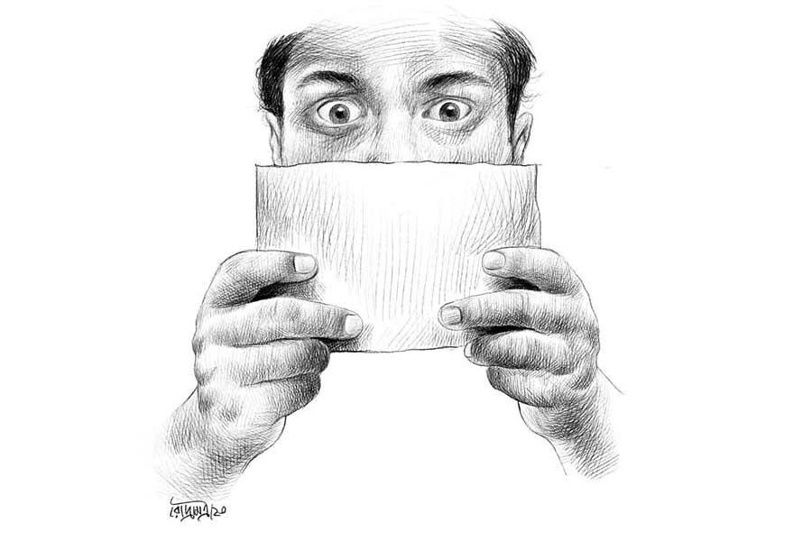

 
 <h1 align=center>সময়</h1>
<h2 align=center>সুব্রত ভৌমিক</h2> রাত প্রায় এগারোটা নাগাদ মোবাইল বেজে উঠল। শুতে যাচ্ছিলেন রজতাভ। মোবাইলের দিকে হাত বাড়ালেন।

কে হতে পারে, মিমি! কিন্তু মেয়ে তো এত রাতে ফোন করে না। তা হলে! রজতাভ অচেনা নম্বরটা এক বার দেখে শেষে ফোন ধরলেন, “হ্যালো, কে বলছেন?”

উত্তর এল, “অতীত।”

“তার মানে!”

“বীনপুরের কথা মনে পড়ে?”

“বী-ন-পু-র!” রজতাভ চমকে উঠলেন। সেই বহু দূর ছোট্ট পাহাড়ি অঞ্চলটা থেকে তাঁরা তো প্রায় কুড়ি বছর হল চলে এসেছেন। এখন এই সোদপুরে থাকেন। এত বছর পর সেখানকার কথা উঠছে কেন। রজতাভ এ বার সাবধানে প্রশ্ন ছুড়লেন, “আপনি কে বলুন তো! বীনপুর চেনেন?”

ভেসে এল, “সেখানকার কথা কি ভোলা যায়? সেই নিস্তব্ধ কাজীর বাগান, বড় বড় ঝাঁকড়া আমগাছ, গা ছমছমে যমপুকুর...”

“হ‍্যাঁ হ‍্যাঁ, ঠিক! আমরা ক’জন বন্ধু মিলে সেখানে আম পাড়তে যেতাম। দুপুরে ভূতের হাত থেকে বাঁচার জন‍্য পকেটে লোহার টুকরো পুরে গাছে চড়তাম। কিন্তু আপনি এ সব...”

একটু হাসির শব্দ এল।

রজতাভ থমকালেন। হঠাৎই মনে হল, লোকটা জালি-ফালি নয় তো? আজকাল তো প্রায়ই নানা গ‍্যাং-এর কথা শোনা যায়। মনে হতেই একা ঘরে তাঁর গা শিউরে উঠল!

ও প্রান্তের স্বরটি এ বার বলল, “দিপুকে মনে পড়ে?”

“কোন দিপু!”

“ক’টা বাড়ি পরে থাকত। ডাকনাম ভাই। বাবা হোমিয়োপ্যাথি চিকিৎসা করতেন।”

রজতাভর ঠোঁটে হাসির রেখা ফুটে উঠল, “বাড়িতে সাদা মতো একটা কুকুর ছিল?”

“হ‍্যাঁ।”

“বাড়ির পাশেই একটা মাঠ।”

“হ‍্যাঁ। ঠিক।”

“আর ওর একটা বোন ছিল। তার নাম বাবলি।”

“তোর মনে আছে?”

“ওফ! তুই... তুই সেই দিপু!”

আর কথা নেই। মোবাইলটা চুপ। দু’প্রান্তে অতীতে ডুব দেওয়া দুই মানুষ। রজতাভর একে একে সব মনে পড়তে লাগল। হ‍্যাঁ, বন্ধুর ভাল নাম দীপ্তেন্দু, দীপ্তেন্দু রায়। তা থেকে দিপু।

কবেকার কথা! রজতাভ, ওরফে রজতরা তখন সবে কলেজে উঠেছে। দিপুদের বাড়ির পাশের ছোট্ট মাঠটায় ক’জন বন্ধু মিলে ব্যাডমিন্টন খেলত। কখনও ক্রিকেট, গোল্লাছুট, ক‍্যারম। কী দারুণ হাতছানি ছিল সেই বিকেলগুলোর!

মনে আছে, এক দিন বিকেলে সঙ্গীরা কেউ নেই। রজত একা। চুপচাপ। একটা ভাঙা পাঁচিলের উপর পা ঝুলিয়ে বসে আছে। বাবলি দেখতে পেয়ে হঠাৎ জানলার শিক ধরে বলে ওঠে, “মন খারাপ নাকি?”

“কেউ আসেনি তাই।”

“এখনও বাড়ি থেকে কেউ বেরোয়নি হয়তো। ডেকে দেখো।”

“ডাকলেই কি সবাই আসে?”

বাবলি থমকায়। দু’মুহূর্ত চোখে চোখ রাখে। তার পর বলে, “না ডাকলেও কিন্তু অনেকে আসে না।”

এ কথার মানে কী! রজতের বুক ঢিপঢিপ করে। গলা আটকে-আটকে যায়। যে কথা বলা যেত, তা যেন আবছা হয়ে আসে, ধরা দেয় না ঠিক।

আর এক দিনের কথা, বিকেলে সে দিন অনেকে আসেনি। ক’জন মিলে কানামাছি খেলা হচ্ছিল। হঠাৎই সকলের মাথায় ছোটবেলায় ফেরার ঝোঁক চেপেছিল। খেলতে খেলতে হঠাৎ চোখ-বাঁধা অবস্থায় রজত এক জনকে ছুঁয়ে ফেলে। তার পর জাপ্টে ধরতেই খিলখিল করে হেসে ওঠে একটা মেয়ে-গলা। হাসতে হাসতে বলে ওঠে, “উফ! ছাড়ো ছাড়ো।”

রজত থতমত খায়। দ্রুত ছেড়ে দিয়ে চোখ খোলে। দেখে, বাবলি!

সে চোখ পাকিয়ে বলে ওঠে, “হাত তো নয়, লোহা!”

সে দিন রাতে রজতের অনেক ক্ষণ ঘুম আসে না। তার পর ঘুমের মধ‍্যে স্বপ্ন দেখে, তারা সব ছোঁয়াছুঁয়ি খেলছে। কিন্তু কাকে যেন কিছুতেই ধরা যাচ্ছে না। যত বার ধরতে যাচ্ছে, খিলখিল করে হেসে দূরে চলে যাচ্ছে।

সেই ছবিই এক দিন সত‍্যি হয়ে গেল। মানে রজতরা আর সেখানে থাকতে পারল না। বাবার বদলি চাকরি। হঠাৎই এক দিন বহু দূর পোস্টিং হল। শুনে বন্ধুরা না-যাওয়ার জন‍্য খুব পীড়াপীড়ি করল। কিন্তু কী লাভ। যাওয়ার আগের দিন শুধু বাবলি বাড়ি আসে। জামাকাপড় সব গুছিয়ে দেয়। তার পর বলে, “নাও দেখো, কিছু ফেলে যাচ্ছ না তো?”

রজত হঠাৎ থমকায়। বলে, “যদি বলি যাচ্ছি?”

বাবলির কপালে বিন্দু-বিন্দু ঘাম। সে শ্বাস টানে। তার পর ব‍্যাগগুলো বন্ধ করতে করতে উত্তর দেয়, “বেশ তো, পরে এসে নিয়ে যেয়ো।”

এমন কথার সাক্ষী হয়ে থাকে একটা রংচটা ঘর, জানলা বেয়ে ওঠা মাধবীলতা, টিকটিক করে চলা দেয়ালঘড়ি, পাশের বাড়ির হঠাৎ বেজে ওঠা সন্ধের শাঁখ।

পরদিন বেলা দশটায় বাড়ির সামনে একটা লরি এসে দাঁড়ায়। একে একে খাট-ড্রেসিংটেবিল-আলনা উঠতে থাকে। দিপু, রণ, বরুণ, টাকু সবাই সার সার দাঁড়িয়ে। একটা মালবোঝাই লরির সামনে ফ্যালফ্যাল করে তাকিয়ে থাকে। দেখে, তাদের এতদিনকার বন্ধু হাত নাড়তে নাড়তে হারিয়ে যাচ্ছে। পিছনে আরও দু’টি ঘন কালো চোখ। যাওয়ার পথের দিকে একদৃষ্টে তাকিয়ে।

সেই দিপু এত বছর পর। কেন!

রজত এ বার এমন প্রশ্ন তুলতে দিপু আসল কথায় এলেন। বললেন, “হ‍্যাঁ, ঠিকই বলেছিস। তোরা চলে আসার পর তোকে অনেক খুঁজেছি। পাইনি। আজ এত বছর পর এক জনের কাছে তোর মোবাইল নম্বরটা পেয়ে সেই থেকে ট্রাই করছি। করতে করতে এই এত রাতে পেলাম।”

“বাঃ, ভাল করেছিস। তা তোরা সব ভাল আছিস তো?”

“হ‍্যাঁ।”

“বাবলির কী খবর?”

“ও তো এখন আমার কাছে থাকে। বিধবা।”

“সে কী! কী করে!”

“সে অনেক কথা। দেখা হলে বলব। তা তোরও স্ত্রী শুনলাম...”

“হ‍্যাঁ রে, বছর দশেক হল মারা গেছে। ক্যানসার।”

“ইস, ভেরি স‍্যাড। তা তোর কি এখানে আসার কথা ছিল?”

“আমার!” রজতাভ হঠাৎ চমকে উঠলেন, “কেন! কে বলল!”

“কেউ না। অনেকে তো ফেরে, তাই বললাম।”

রজতাভ চুপ করে গেলেন। একটাই মাত্র মেয়ে, মিমি। হস্টেলে থেকে লেখাপড়া করে। সারা বাড়িতে রজতাভ এখন একা। বীনপুরের দিনগুলো মনে পড়ল তাঁর। ওখান থেকে চলে আসার পর আর কখনও যাওয়া হয়নি। এক বার কি যাওয়ার কথা ছিল? মানুষ কি কোথাও ফেরে?

ভাবনাটার মধ‍্যে দিপু হঠাৎই এক আমন্ত্রণ ছুড়ে দিলেন, “কী রে, এত কী ভাবছিস। শোন, যে জন‍্য ফোন করা, সামনের মাসের চোদ্দো তারিখ, রবিবার, সে দিন এখানে আসতে পারবি? একটা সারপ্রাইজ় আছে। খুব মজা হবে। একটা জিনিসও পাবি।”

অবাক হন রজত, “আমার জন‍্য? কী সারপ্রাইজ়! কী জিনিস!”

দিপু হাসেন, “আয় না। এলেই জানতে পারবি।”

নির্দিষ্ট দিনের জন‍্য টিকিট কাটলেন রজতাভ। ব‍্যাগ গোছালেন। তার পর দূরপাল্লার এক ট্রেনে চেপে বসলেন। স্টেশনে নামতেই এক পাখি-ডাকা দেহাতি এলাকা। লাল মাটির পথ। হ‍্যাঁ, এই সেই বীনপুর!

ঠিক বাড়িতে পৌঁছে দরজার কড়া নাড়তেই এক মাথা টাক, চোখে মোটা ফ্রেমের কালো চশমা, এক জন বয়স্ক লোক দরজা খুলে দিলেন। রজতাভ মুখ তুলে তাকিয়ে থাকলেন। লোকটি অল্প হেসে বললেন, “আমিই দিপু।”

রজতাভ ঘরে ঢুকলেন।

জানা গেল, দিপু বিয়ে করেননি। বাবলির জন‍্যেই করেননি। বাবা মারা যাওয়ার পর বাবার হোমিয়োপ্যাথি চিকিৎসার কাজটাই করেন। কিছু জমিজিরেত আছে, গচ্ছিত আছে, চলে যায়। কিন্তু দিপু কী সারপ্রাইজ়ের কথা বলছিলেন, সেটা কোথায়?

খানিক বাদেই বোঝা গেল। একে একে আরও সব ছোটবেলার বন্ধুরা এসে হাজির! সেই রণ, বরুণ, টাকু! যেন কোন কালের গর্ত থেকে একে একে সব উঠে আসছেন, ঘরে ঢুকছেন। টাকু কাছেই থাকেন। বরুণ আর রণ এক জন বর্ধমান, এক জন বাঁকুড়ায়। চেনাই যাচ্ছে না। খানিক থমকে সবাই সবাইকে জড়িয়ে ধরলেন।

জনবিরল পাহাড়ি অঞ্চল। সরল দেহাতি মানুষ চার দিকে ছড়িয়ে ছিটিয়ে। দূরে ছোট ছোট টিলা, ধাপ, হাতছানির মতো। সে দিকে মুখ করে বাইরের খোলা বারান্দাটায় সবাই ইজ়িচেয়ারে গা এলিয়ে বসেছেন। সামনে ছোট একটা টেবিল, সিগারেটের প‍্যাকেট, অ্যাশট্রে। যে যার মতো সিগারেট তুলে নিচ্ছেন। ধরাচ্ছেন। রজতাভ কথা তুললেন, “নে, এ বার কী বলবি বলছিলি, বল।”

দিপু সিগারেট ধরালেন। ধোঁয়া উড়িয়ে বললেন, “আচ্ছা, তোদের মনে পড়ে, আমরা ক’জন কী দারুণ বন্ধু ছিলাম! এক সঙ্গে ঘুরতাম, খেলতাম, পড়তে যেতাম। অথচ সে দিন খুঁজতে গিয়ে দেখি, আমাদের কোনও গ্রুপ ফোটোই নেই। শুধু...”

“শুধু?”

“একটাই আছে। কিন্তু তাও নষ্ট হয়ে গেছে।”

বলে উঠে গিয়ে দিপু এ বার একটা খাম এনে এগিয়ে দিলেন।

রজতাভ হাতে নিলেন। খুললেন। সবাই দেখলেন, কবেকার তোলা একটা গ্রুপ ফোটো। পাঁচ জনই আছে, কিন্তু আবছা, বিবর্ণ। কাউকেই ভাল চেনা যাচ্ছে না। রণ আর টাকু দুই ধারে। টাকুর পর বরুণ। কিন্তু দিপু আর রজতাভর মাঝখানে দু’জনের গলা জড়িয়ে ধরে দাঁড়ানো অপরূপা সহাস্য মেয়েটি কে! বাবলি না? বলে যেই মুখ তুলতে যাবে, দেখে এক ছায়ামূর্তি। সাদা শাড়ি, মুখ নিচু, চোখে চশমা এক মহিলা টি-টেবিলটায় সযত্নে একটা ট্রে নামিয়ে রেখে আস্তে বললেন, “চা।”

রজতাভ ফোটোটা থেকে সবিস্ময়ে মুখ তুললেন।

দিপু হেসে বললেন, “বাবলি।”

বাবলি এখন বিধবা, স্বল্পবাক। ওঁর একটাই ছেলে, নীল। বিএ পড়ে।

না, সে দিন আর কারও ফেরা হল না। ফেরার কথাও নয়। দুপুরে বাবলিকে একা পেয়ে রজতাভ এগিয়ে যান। একটা নির্জন কুয়োতলায় জল তুলছে, রজতাভ পাশে এসে দাঁড়ালেন। এ কথা-সে কথা, খোঁজখবর। তার পর হঠাৎই জবাবদিহির মতো বলে উঠলেন, “আমি কিন্তু ফিরতেই চেয়েছিলাম। কিন্তু বাবা হঠাৎ মারা যাওয়ায়...”

বাবলি চুপ। তার পর আস্তে মুখ খুললেন, “তা হঠাৎ?”

“এলাম। আসারই তো কথা। সেই যে, কিছু পড়ে আছে কি না দেখতে।”

“এত বছর পর?”

“কেন, কিছু ফেলে গেলে কি থাকে না?”

বাবলি চোখ তুলে দেখলেন। বালতি হাতে নিলেন। তার পর বললেন, “কে জানে, খুঁজে দেখো।”

বলে জল নিয়ে চলে গেলেন।

দুপুরে এলাহি খাওয়া-দাওয়া। দিপুরই কাণ্ড। এর মধ‍্যে রজতাভর সঙ্গে নীলের বেশ ভাব হয়ে গেছে। দুপুরটা এ ভাবে কাটানোর পর বিকেলে সবাই ফের বারান্দায় এসে বসল। দূরে পাহাড়, মাঠ। মাঠটার গায়ে কবেকার সব আশ্চর্য বিকেল ফুটে উঠছে। সেই ব্যাডমিন্টন, কানামাছি, ক‍্যারম, গাদি খেলা... বুকের ভিতরটা তোলপাড় করে ওঠে।

শুরু হয় আড্ডা, গান, পুরনো দিনের সব গল্প। এই সব ফেলে ফের যে যার ঠিকানায় চলে যেতে হবে। মনে হতেই রজতাভ বলে উঠলেন, “কই, কী দিবি বলেছিলি?”

বরুণ বললেন, “হ‍্যাঁ, আমাকেও তো তাই বলে ডেকে আনলি।”

বাকি দু’জন জানালেন, তাদেরও তাই বলেছেন দিপু।

সবার বলা শেষ হলে সলজ্জ উত্তর দিলেন দিপু, “আরে, তেমন কিছু নয়।”

“জিনিসটা কী বলবি তো।”

দিপু এ বার হাসলেন। বললেন, “না মানে, আমাদের সেই গ্রুপ ফোটোটা নষ্ট হয়ে যাওয়ায় আমার সে দিন এত খারাপ লেগেছিল যে, মাথায় একটা প্ল‍্যান এল, যদি এই ক’জনকে আবার এক জায়গায় ডেকে এনে এই রকমই একটা গ্রুপ ফোটো তুলতে পারি! তুলে সবাইকে একটা করে দিতে পারি!”

রণ বললেন, “গ্রেট আইডিয়া!”

টাকু ইতস্তত করলেন, “কিন্তু তা কি সম্ভব?”

“কেন নয়? সেই ক’জনই তো আছি। আয় না, ওই রকম আর একটা ফোটো তুলি। একটা ফ্রেমের মধ‍্যে আমাদের বন্ধুত্বটা রেখে দিই।”

অতএব ফের একটা হইহই, আয়োজন। বাবলিকে বহু কষ্টে রাজি করানো গেল। পিছনে খোলা আকাশ, পাহাড়। সার সার সবাই আগের মতো দাঁড়িয়েছেন। শেষমেশ দিপু আর রজতাভর মাঝখানে ধীর পায়ে বাবলি এসে দাঁড়ালেন। তার পর ছবিটার মতো দু’জনের একটু গলা জড়িয়ে ধরতেই হঠাৎ খিলখিল করে হেসে ফেললেন বাবলি। আর ঠিক সেই সময় ছেলে নীল মোবাইলের ক‍্যামেরা-বাটন প্রেস করে দিল।

ফের সেই আশ্চর্য ছবি! দিপু সবার মোবাইলে পাঠিয়ে দিলেন। এটা দেওয়ার জন‍্যই সবাইকে ডেকে এনেছিলেন তিনি। পেয়ে সবাই খুশি। দেখছে, হাসছে।

সে দিনের প্রত‍্যেকেই রয়েছেন ফোটোটার ভিতর। তবু সবার চোখে জল। কী যেন নেই! কী যেন...

ছবি: রৌদ্র মিত্র