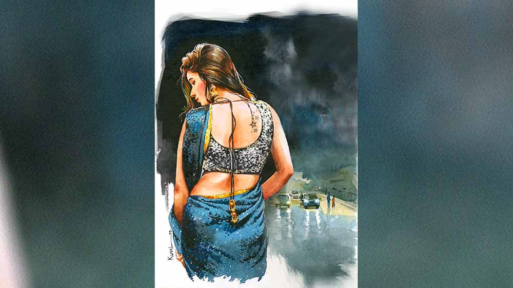

 
 <h1 align=center>সহযাত্রিণী</h1>
<h2 align=center>দেবাশিস কর্মকার</h2> ছেচল্লিশ কি বেরিয়ে গেছে?” ঘাড় ঘুরিয়ে দেখলাম, প্রশ্নটা আমাকেই করা হয়েছে। উত্তরের অপেক্ষায় গভীর উৎকণ্ঠায় ভরা দুটো চোখ আমার দিকে চেয়ে আছে। রোজ ধর্মতলা থেকে ছাড়া ছেচল্লিশ নম্বর বাসের এই সহযাত্রিণী মুখচেনা, তবে কখনও কথা হয়নি।

কী বলব মনে মনে ভাবছি, এমন সময় মহিলা আবার প্রশ্ন করলেন, “আপনি কি অনেক ক্ষণ দাঁড়িয়ে আছেন এখানে?”

বললাম, “তা-ও মিনিট দশেক তো হল... কিন্তু ছেচল্লিশ আসেনি।”

সঙ্গে থাকা শীর্ণ লোকটাকে মহিলা বললেন, “তুমি চলে যাও। আমি এঁর সঙ্গে থাকছি। ইনি আমাদের দিকেই থাকেন। পৌঁছে ফোন করছি।”

এঁর সঙ্গে আছি মানে! আমার বুক ধড়াস করে উঠল। কে অনুমতি দিল থাকার? আর আমাদের দিকেই থাকেন মানে কী? আমি নামি শেষ স্টপেজ এয়ারপোর্টে। মহিলা নামেন তার চার কিলোমিটার আগে, বাগুইআটিতে। নেমেই দ্রুত পা চালিয়ে সাবওয়ের দিকে এগিয়ে যান। বাসের জানালা দিয়ে দেখি। তার মানে রাস্তা পার করে হাতিয়াড়ার দিকের রাস্তা ধরেন। অবশ্য হাতিয়াড়ার দিকেই যান কি না, নিশ্চিত বলা যায় না। কারণ ফয়রা ভবন থেকে ডান দিকে জগৎপুর বাজারের দিকে একটা রাস্তা চলে গেছে। ও দিকটাতেও কোথাও যেতে পারেন। যেখানেই যান, তাতে আমার কিছু আসে যায় না। কিন্তু এই দুর্যোগের রাতে এ আবার কী আপদ!

মহিলার সঙ্গের লোকটা আমাকে মুহূর্তখানেক ভাল করে দেখে চলে গেল। মনে হল বেশ কিছু দিন পরেও যাতে চিনে নিতে পারে, তেমন কোনও ছবি তুলে রাখল মগজে। এই লোকটাকেও রোজ দেখি। এই মহিলার সঙ্গেই। বাসে তুলতে আসে। মহিলাই নিজে থেকে বললেন, “আমাদের স্টাফ। আজ একটা ঘটনা ঘটেছে। ও তাই বেশি ক্ষণ দাঁড়াতে পারবে না।”

বিকেলের পর থেকে টানা ঘণ্টাখানেকের বৃষ্টি আর ঝোড়ো হাওয়ায় পুরো শহর কিছুটা এলোমেলো হয়ে গেছে। রাস্তায় লোকজন কম। রাত বাড়তেই গাড়ি-বাসও কমে গেছে। পকেট থেকে মোবাইল বের করে দেখলাম রাত ১১টা বেজে ১৭ মিনিট। শেষ ছেচল্লিশ ধর্মতলা ডিপো থেকে স্টার্ট দেয় রাত সাড়ে এগারোটায়। মাঝে-মধ্যে ১১টাতেই শেষ বাস বেরিয়ে যায়। বিশেষ করে এমন দুর্যোগের দিনে। তখন ভরসা শাট্‌ল ট‌্যাক্সি। যারা শিয়ালদায় ট্রেন ধরার তাড়ায় থাকে, ১০ টাকা দিয়ে উঠে পড়ে। কিন্তু ভিআইপির দিকে যাওয়ার শাট্‌ল মেলে না।

মহিলা ব‌্যাগ হাতড়ে মোবাইল বার করে ফোন করলেন, “বেরিয়েছি। বাস স্ট‌্যান্ডে... রাখলাম।” সম্ভবত বাড়িতে ফোন। তার পর স্বগতোক্তির মতো বললেন, “কী দুর্ভোগ কপালে আছে কে জানে!”

অপরিচিত, একা এক জন মহিলাকে রাতের রাজপথে অভয় দেওয়া আমার সাজে না। আমি সিনেমার হিরো নই। রাস্তায় কেউ যদি এই মহিলাকে টোন-টিটকিরি করে, অশ্লীল ইঙ্গিত করে বা হাত ধরে টানে, আমি কী করতে পারি! প্রতিবাদ করে বলি হওয়ার শিভ্যালরি আমার নেই। কিছু ঘটে গেলে পরিচিতদের কী জবাব দেব? মহিলা-সংক্রান্ত কেসে ঢোকা উচিত হয়নি বলে তারা সবাই আমাকেই তখন দুষবে, জ্ঞান দেবে। কেউ কেউ এই মহিলার সঙ্গে আমার সম্পর্ক নিয়ে গসিপ করবে। অফিসের লোকজন আড়ালে-আবডালে বলবে, ভাল সেজে থাকা অতীনের পেটে পেটে এত...

এক হাত দূরত্ব রেখে মহিলা দাঁড়িয়ে আছেন। ক্রমশ ইতিউতি অনেক ঘরমুখী লোক জমেছে বাসস্ট‌্যান্ডে। বেশির ভাগই বার-রেস্তরাঁর কর্মী, নিউমার্কেটের হকার। খুব সামান‌্যই হয়তো অফিসফেরতা লোক হবে। যেমন আমি।

কয়েকটা পুরুষ-চোখ মাঝে মধ্যে মহিলাকে দেখছে ঘুরে-ফিরে। কেউ অছিলা করে, কেউ নির্লজ্জের মতো সরাসরি। অথচ চেয়ে চেয়ে দেখার মতো নয় মহিলার সাজ-পোশাক। মহিলার পরনে চুমকি বসানো কালো শাড়ি, আঁচল উঁচু করে পেটটাও ঢাকা। বোধহয় বেরনোর তাড়া থাকায় মুখের মেকআপ তুলতে পারেননি। তাঁর দৃষ্টি কিন্তু ট্রামডিপোর পাশে বাসস্ট‌্যান্ডের দিকে নিবদ্ধ। সেখানে এখন একটাও বাস নেই। বাসের খোঁজ দেওয়ার মতোও কেউ নেই স্ট‌্যান্ডে। থাকেও না। পর পর দক্ষিণমুখো বাসগুলো হাওড়ার দিক থেকে এসে যাত্রী তুলে সাঁ-সাঁ করে বেরিয়ে যাচ্ছে। শিয়ালদার রুটে বাস নেই। শাট্‌ল ট‌্যাক্সিগুলো আসছে, দ্রুত ভরে যাচ্ছে। চলে যাচ্ছে। যাদের শেষট্রেন ধরার তাড়া, তারা কেউ দরাদরি করছে না। দুর্যোগের দিন বলে দশ টাকার জায়গায় পনেরো টাকা নিচ্ছে। তা-ই সই।

আজ আর একটু আগে এলে এগারোটার বাসটা পেয়ে যেতাম। এমন দিনে লাস্ট বাসের ভরসা করা ভুল। এখন বাড়ি ফিরতে হবে তিন বার পাল্টে, তিন গুণ খরচে। তা ছাড়া উপায় নেই। রাস্তায় তো থেকে যাওয়া যাবে না।

“কিছু না মনে করলে একটা কথা বলব?” বললেন মহিলা। এখন আরও দূরত্ব কমেছে। ফিরে চাইতে বললেন, “কিছু একটা তো করতে হবে। এ ভাবে কত ক্ষণ দাঁড়িয়ে থাকা যায়...”

অমি একটু ভেবে বললাম, “মনে হচ্ছে না ছেচল্লিশ আর আছে। এ সব দিনে আমি যে ভাবে ফিরি আপনি যেতে পারেন।”

“কী ভাবে?”

“ও পার থেকে শাট্‌লে হাতিবাগান, তার পর অটোয় উল্টোডাঙা হয়ে আমি যাই। ভিআইপির মুখ থেকে অনেক কিছু পাওয়া যায়।”

“আমি এই রাতে ও ভাবে একা যেতে পারব না,” নিরাশ ভাবে বললেন মহিলা। দুর্দান্ত বৃষ্টির পর জুন-শেষের রাতে পারদ নেমে এসেছে। তবু সে ঘামছে।

আমি পড়লাম এ বার মহা ফাঁপরে। অফিসেই শুনেছি হোটেল রয়‌্যালে পুলিশ রেড করেছে। আমার বস সেখানে রোজ যায়, সে কারণেই জানতে পেরেছি। বারগুলোয় গানের অনুমতি আছে। নাচের অনুমতি নেই। আজ হাতেনাতে ধরা পড়ে গেছে। আসর ভঙ্গ হয়েছে। এমন বর্ষা-বাদলার দিনে ব‌্যবসার দফারফা একেবারে। এখন হঠাৎ মনে হল, এই মহিলা তবে হয়তো রয়‌্যালেই...

তবে মহিলা আপাতত বিপর্যয়ে পড়েছেন। একা যেতে পারবেন না, অর্থাৎ আমার সঙ্গে যেতে অসুবিধে নেই। মধ্যবিত্ত সংস্কার খচখচ করে উঠল। তার পর মনে হল, যদি একই রাস্তায় মহিলা সঙ্গে যান তো তাতে আমার কী! গাড়িও আমার নয়, রাস্তাও আমার নয়।

অন্যান্য দিন অনেক টালবাহানার পর ধর্মতলা থেকে বাসটা গতি নেওয়া মাত্র মহিলা হাত উপরে তুলে ছুটতে ছুটতে আসেন। ড্রাইভার-কন্ডাক্টর জানেন, ডেলি প্যাসেঞ্জার। বাসের গতি কমে। দ্রুত পায়ে তিনি উঠে পড়েন। শেষ বাসে মহিলা যাত্রী কম, তাই  বসার জায়গাও মেলে সহজে। গেট দিয়ে উঠে ডান দিকে দ্বিতীয় সিটের জানালার ধার। বাঁধা জায়গা। তার পর একটু থিতু হয়ে ব্যাগ থেকে ফোন বার করে কথা বলেন। খুব নিচু স্বরে, ঠান্ডা গলায় গুটিকয়েক কথা, “মা তুমি খেয়েছ? ...তিন্নি ঘুমিয়ে পড়েছে?...পড়াতে এসেছিল?... আমি কাল বাজারে গেলে মনে করিয়ো।... এই তো বাসে উঠেছি...” ইত্যাদি। সদ‌্য ঘষে মেকআপ তোলা রক্তাভ মুখে ক্লান্তির প্রলেপ। জানালা দিয়ে রাস্তা দেখেন উনি।

দেরি হচ্ছে দেখে আমি মহিলাকে উদ্দেশ‌্য করে ‘আসুন’ বলে এগোলাম। রাস্তা পার হওয়ার সময় এক বার পিছন ফিরে দেখলাম, মহিলা শাড়ির কুঁচি সামলে দু’পাশে গাড়ি দেখতে দেখতে ত্রস্ত পায়ে আসছেন। দুটো শাট্ল আধভর্তি হয়ে দাঁড়িয়েছিল। তার একটায় উঠে পড়লাম আমরা। বড় গাড়ি। ড্রাইভার কাপল মনে করে এক জনকে নামিয়ে দিয়ে সামনেই দু’জনকে বসিয়ে নিল।

জানালার ধারের সিটে মহিলা। ড্রাইভারের পাশে আমি। আমার অস্বস্তি বুঝে বললেন, “আপনার অসুবিধে হচ্ছে, না? বুঝতে পারছি।”

ফোন এল মহিলার। ব‌্যাগ থেকে মোবাইল বার করে সাইলেন্ট করে দিলেন। দ্বিতীয় বারও রিং হতে কলটা ধরলেন। মোবাইল স্ক্রিনে বার বার চোখ যাচ্ছিল। দেখলাম এ বারও সেই একই ব‌্যক্তি, রজত। এ বার মহিলা ফোন কানে ধরে চাপা গলায় বললেন, “আমি রোজ রোজ তোমায় টাকার জোগান দিতে পারব না।” বলেই ফোন কেটে ব‌্যাগে ঢুকিয়ে ফেললেন।

এই ফোনটাও মাঝে মাঝে আসে। খেয়াল করেছি। তখন মহিলার মুখ পাল্টে যায়। পরিশ্রমের ক্লান্তির সঙ্গে মুখে তখন কঠোর ছায়া লেগে থাকে। ফোন রেখে বাসের জানালা দিয়ে বাইরে চেয়ে থাকেন। চোখের জল আড়াল করে কি?

হাতিবাগানে নেমে এ বার অটোর অপেক্ষা। আধো অন্ধকারময় ভিজে রাস্তায় প্রাণী বলতে আমরা দু’জন। আমার ভিতরে যতটা উদ্বেগ, মহিলার চোখে-মুখে আর ততটা নেই। বাড়ি ফেরা নিয়ে আশ্বস্ত লাগছে তাঁকে।

এক বার রয়্যাল বারের এক আর্টিস্ট ম‌্যানেজারের সঙ্গে আলাপ হয়েছিল। আমার অফিসের কাছেই। অফিসের নীচে চায়ের দোকানে সন্ধ‌্যায় ওরাও আড্ডা মারতে আসে। সেই ম‌্যানেজার নিজেকে দিলদরিয়া প্রমাণ করতে বলেছিল, মেয়েরা বখশিস পেলে সে তার হিসাব চায় না। কোনও ক্লায়েন্ট কোনও মেয়েকে নিয়ে যেতে চাইলে সে আপত্তিও করে না। গরিব ঘর থেকে আসে সব মেয়ে। দু’পয়সা কেউ যদি এক্সট্রা ইনকাম করতে পারে তো করুক না। গান শুনে, নাচ দেখে কেন ক্লায়েন্টরা মেয়েদের নিয়ে যেতে চায়, তা আর জিজ্ঞেস করিনি। নিশ্চয়ই গান শুনতে নয়! কিন্তু আমার খুব বিশ্বাস করতে ইচ্ছে করছে, এই মহিলা কখনও কোনও ক্লায়েন্টের সঙ্গে যাননি।

মহিলা বললেন, “আপনি কি ভয় পাচ্ছেন?”

অপ্রস্তুত হয়ে বললাম, “না না, কিসের ভয়! আমাকে তো মাঝে-মধ্যেই এ ভাবে ফিরতে হয়।”

কিন্তু আমি বুঝি, এই সময় মহিলার এই প্রশ্নের অন‌্য অর্থ। কিন্তু অনেক সময় নারীর এই প্রশ্নভীষণ ভীরু পুরুষকেও প্রচণ্ড সাহসী করে তোলে।

মহিলা আবার বললেন, “বৃষ্টিটা থামতে যখন লোকজন ঢুকতে শুরু করেছিল, একেবারে তখনই পুলিশ এসে গেল। সিভিলে ছিল, কেউ বুঝতে পারেনি। ফ্লোর ম‌্যানেজার, দারোয়ানরা চেনে। কিন্তু কে কোথায় কোন তালে ছিল কে জানে!”

বললাম, “কাউকে ধরেছে?”

“না, ধরেনি। তবে লাইসেন্স সিজ় করেছে।... ন’মাস লকডাউনে কাজ হয়নি, আবার বার বন্ধ হলে কী যে হবে, ভাবলেই গায়ে কাঁটা দিচ্ছে। এখন দেখছি গুরগাঁও চলে গেলেই ভাল হত।”

আমি যে এত কম কথা বলতে পারি, সেটা নিজেরই বিশ্বাস হচ্ছিল না। মহিলা নিজেই অনেক কথা বলে চলেছেন। আমাকে বলার জন‌্য বলা। আবার ঠিক আমাকেও বলছেন না। যেন নিশুতি রাতের ঘুমন্ত শহরের সঙ্গে কথা বলে নিজেকে হালকা করতে চাইছেন তিনি।

পর পর দুটো অটো টেনে বেরিয়ে গেল। কোনওটাতেই জায়গা ছিল না। মোবাইল আনলক করে দেখলাম বারোটা দশ বাজে। বললাম, “বারের মেয়েদের তো দেখি রাতে গাড়িতে করে পৌঁছে দেওয়া হয়...”

“ও আপনি দেখেছেন? জানেন? ওরা তো আসলে কন্ট্রাক্টরের আন্ডারে কাজ করে, আমি বারের সঙ্গে সরাসরি যুক্ত নেই... ম‌্যানেজার বক্সিবাবু আমাকে নিজে নিয়ে গেছিলেন গান গাইতে। বার বন্ধ থাকার সময় কোম্পানিকে বলে উনি মাসে মাসে চলার মতো কিছু টাকার ব‌্যবস্থা করে দিয়েছিলেন। তাও কত আর... কোনও দিন বাড়ি ফিরতে এত রাত হয়নি...” মাঝপথে কথা ঘুরিয়ে দিলেন মহিলা।

ব‌্যাগ থেকে মোবাইল বার করে ফোন করতে যাচ্ছিলেন মহিলা, এই সময় একটা অটো এসে গেল। সুবিধে এটাই, অটোটা সরাসরি বাগুইআটি যাবে। তার পর ডিউটি শেষ করে গাড়ি গ‌্যারেজ।

অটোয় বসে মহিলা বললেন, “এটা তো বাগুইআটি যাবে, আপনি কত দূর যাবেন?”

আমি তাকে জানালাম। শুনে বললেন, “তা হলে ওখান থেকে কিছু পাবেন তো এত রাতে?”

বললাম, “দেখি, কিছু একটা ব‌্যবস্থা হয়ে যাবে।”

আমরা অটোয় চেপে বসার কিছু ক্ষণের মধ্যেই বাগুইআটি এসে গেল।

“আর একটা রিকোয়েস্ট করব?”

“বলুন–”

“বাগুইআটিতে নেমে আমাকে একটু এগিয়ে দিলে আপনার কি খুব অসুবিধে হবে? আসলে সাবওয়েটা একেবারে ফাঁকা থাকে তো...”

জিজ্ঞেস করলাম, “কত দূরে আপনার বাড়ি?”

ফয়রা ভবনের মোড়ে এসে মহিলা থামল। বলল, “আর বেশি দূরে নেই। এ বার বাকিটা আমি চলে যেতে পারব। আপনি আসুন। সাবধানে যাবেন।”

কথা শেষ করেই হাত নেড়ে মহিলা চলে গেল। বাঁক ঘোরা পর্যন্ত চেয়ে রইলাম। এক বারও পিছনে ফিরে তাকাল না সে।

ভিআইপি অবধি আসতে আসতেই ফের মুষলধারে বৃষ্টি নামল। সঙ্গে ছাতা নেই। লম্বা লম্বা পা ফেলে যত দ্রুত সম্ভব সাবওয়েতে পৌঁছতে পৌঁছতেই পুরোপুরি ভিজেই গেলাম। শাট্ল পেয়ে বাড়ি পর্যন্ত পৌঁছতে আরও এক ঘণ্টা পেরিয়ে গেল।

বৃষ্টিতে ভেজার ফল পেলাম পরের দিনই। প্রবল জ্বর। রক্ত পরীক্ষা করাতে জানা গেল কোভিড পজ়িটিভ। দিন দশেক পেরিয়ে ফের রক্ত পরীক্ষায় রিপোর্ট নেগেটিভ এসেছে। শরীর বেশ দুর্বল। এখন আপাতত বাড়ি থেকেই কাজ। দিনকয়েক বিশ্রাম নিয়ে ফের অফিসে যাওয়া শুরু করব। মাঝখানে রোগে ভুগে উদ্বেগে আশঙ্কায় সেই রাতের কথা ভুলেই গিয়েছিলাম। এক দিন সকালে টিভিতে একটা খবর শুনে আঁতকে উঠলাম।

খবরটা ছিল এই রকম– ‘বাগুইআটির অশ্বিনীনগরে ভাড়া ফ্ল‌্যাটে এক মধ‌্যবয়সি মহিলার ঝুলন্ত দেহ উদ্ধার হয়েছে। বন্ধ ঘরে বিছানায় তাঁর বৃদ্ধা মা ও নাবালিকা কন‌্যার নিথর দেহ পড়ে ছিল। পুলিশ ঘরের বন্ধ দরজা ভেঙে দেহগুলি উদ্ধার করে। কারও দেহে কোনও আঘাতের চিহ্ন ছিল না।’

আমার সেই সহযাত্রিণীকে আর কখনও রাতের শেষ ছেচল্লিশে দেখতে পাইনি।