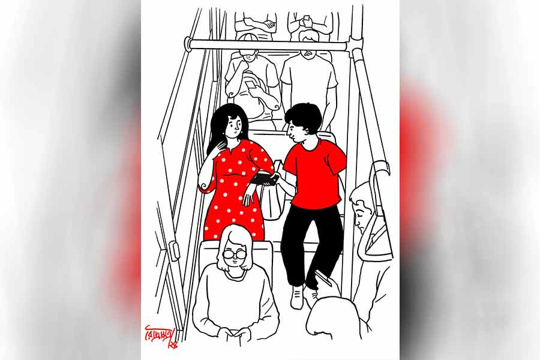

 
 <h1 align=center>সহযাত্রী</h1>
<h2 align=center>সীমা জানা</h2> 

অনেক ক্ষণ থেকে জ্বালাচ্ছে লোকটা! এ কথা সত্যি যে, বাসটায় ভিড় আছে। তা বলে ভদ্র ভাবে দাঁড়াতে না পারার মতো নয়। এক বার পিছন ফিরে কটমট করে লোকটার দিকে তাকাল মুকুল। লোকটাও দেখল, কিন্তু সরার চেষ্টা করল না। সে নিজেও যে সরে দাঁড়াবে, উপায় নেই। চার ধার লোকে ঠাসা! ঠিক সেই সময়ে ওর সামনের সিটের জানালার দিকের লোকটা উঠে দাঁড়াল। হাতের রুমালটা জানালা তাক করে ছুড়ল মুকুল। একা নয়, ধারে কাছে দাঁড়িয়ে থাকা আরও জনাকয়েককে নিয়ে সিটের দু’জনেই নামল। ভিড়টা সামলে নিয়ে বসতে গিয়ে ও দেখল, আর এক জন জানালার দিকটা দখল করে নিয়েছে। তিরিক্ষে গলায় মুকুল চেঁচাল, “এ কী! আপনি ও দিকটায় বসলেন কেন?”

“আমি আপনার তুলনায় সিটটার বেশি কাছে ছিলাম।”

“আমিও মোটেই এমন কিছু দূরে ছিলাম না!”

“এ দিকে বসুন না, কে বারণ করছে?” পাশের ফাঁকা জায়গাটার দিকে ইশারা করল ছেলেটা। এই স্টপেজে অনেকেই নামল। অন্য সিটের খোঁজে চার দিক দেখল মুকুল। সম্ভাবনা নেই দেখে বাধ্য হয়ে ধপ করে বসে পড়ল। বসেই কাঁধের ব্যাগটা দু’জনের মাঝে রেখে দিল সে। আড়চোখে ছেলেটাকে দেখল এক বার। ও সোজা জানালার বাইরে চোখ দুটো ভাসিয়ে দিয়েছে।

কব্জি উল্টে ঘড়ি দেখল মুকুল। সবে দশটা পঁচিশ। এখনও ঘণ্টা দেড়েক। দিদিয়া বলেছিল, বাসে উঠে একটা ফোন করতে। ভিড়ে সম্ভব হয়নি। সব মিলিয়ে নিজেকে সামলাতেও কিছুটা সময় লেগেছে তার। মনে মনে ভাবল, এ বার দিদিয়াকে ফোন করে এক মনে ইউটিউব দেখা যাবে। মোবাইলটা বার করার জন্য ব্যাগ খুলল সে। এ চেন, সে চেন, এমনকি বাঙ্কে তুলে দেওয়া ব্যাগটা পর্যন্ত আতিপাতি খুঁজল। ওকে অস্থির হতে দেখে পাশের ছেলেটি জিজ্ঞেস করল, “কিছু হয়েছে?”

“মোবাইলটা পাচ্ছি না...” অন্যমনস্ক ভাবে বলল মুকুল।

“এনেছিলেন তো?”

“মিথ্যে বলছি নাকি?”

“না, মানে বলছি যদি বাড়িতেই ভুল করে ফেলে...”

উত্তর দিল না মুকুল। যে দিকটায় দাঁড়িয়েছিল ও, সে দিকে তাকাল। যারা ছিল, তাদের কেউ নেই। মাত্র দু’মাস হবে নতুন হ্যান্ডসেটটা কিনেছিল বাবার কাছে বায়না করে। সবচেয়ে বড় কথা, দিদিয়ার সঙ্গে যোগাযোগ করতে পারবে না। খুব দুশ্চিন্তা করবে ওরা। মুকুল কখন কোথায় পৌঁছল, জানিয়ে ফোন করলে সৌমিক ওকে নিতে স্ট্যান্ডে আসবে। কিচ্ছু চেনে না সে এ দিকের। একেবারে নতুন। যদিও চেষ্টা করলে আইওসি-র কোয়ার্টার্স খুঁজে বার করতে পারবে, কিন্তু তত ক্ষণে এ বাড়ি-ও বাড়ি মিলে যে ধুন্ধুমার বেধে যাবে, সেটা ভেবেই গলা-বুক শুকিয়ে যাচ্ছে তার।

“শুনুন...” ডাক শুনে মুকুল ডান দিকে তাকাল। ছেলেটা ওর মোবাইল মুকুলের দিকে বাড়িয়ে রেখেছে, “এখান থেকে নম্বরটা ডায়াল করে দেখুন, যদি যায়, তা হলে নির্ঘাত সুইচড অফ বলবে।”

“আপনি করুন। আমি নম্বরটা বলছি...” নম্বরটা ডায়াল করে সাউন্ড বাড়িয়ে ফোনটা দু’জনের মাঝামাঝি জায়গায় এনে ধরল ছেলেটি। ও পাশ থেকে এক যান্ত্রিক মহিলাকণ্ঠ নিশ্চিত করল যে, মোবাইলের মালিকানা বদলে গেছে।

এই প্রথম বার ওরা দু’জন দু’জনের দিকে তাকাল। নিজেকে দেখতে পাচ্ছে না মুকুল, তবে ছেলেটাকে বেশ ফ্যাকাসে দেখাচ্ছিল। যেন মোবাইলটাতে তারও শেয়ার ছিল। আর এই সুযোগেই ও দেখল, ছেলেটা শুধু চেহারায় গোলগাল নয়, চোখে মুখেও নাড়ুগোপাল-নাড়ুগোপাল ভাব।

“আমার সেই লাস্ট স্টপ। চাইলে তার মাঝে আপনি আমার ফোনটা নিতে পারেন।”

“থ্যাঙ্কস।”

“কোথায় যাবেন?”

“হলদিয়া। আমার মাসতুতো দিদি-জামাইবাবুর কাছে। বলেছিল বাসে উঠে ফোন করতে।”

“করুন!” ফোনটা আবার ওর হাতের কাছে ধরল ছেলেটি। হ্যান্ডসেটটা নিয়ে নম্বরগুলো ডায়াল করছিল মুকুল। ছেলেটা বাধা দেয়, “একটু দাঁড়ান।”

জিজ্ঞাসু চোখে মুকুল ওর দিকে তাকায়। ব্যাপার কী!

“আপনি এ দিকে আসুন...” ছেলেটি বলে।

“আমার কোনও অসুবিধে হচ্ছে না,” বলে মুকুল।

“আসুন। ভাল লাগবে। টেনশনে যা ঘামছেন!”

“থ্যাঙ্ক ইউ...” বলতে বলতে ফোনটা কানের কাছে ধরল মুকুল। ও পাশ থেকে কেউ কল রিসিভ করতেই ও ঘটনাটা বলে গেল, “দিদিয়া, আমি মুকুল বলছি রে। আরে দেখ না, আমার ফোনটা...” সব কথা জানিয়ে ফোনটা ফেরত দিতে চেয়েছিল মুকুল। ছেলেটি বাধা দেয়, “এখন রাখুন। যদি আপনার দিদিয়া আবার করে?”

“আপনিও কি কারও বাড়ি যাচ্ছেন?” প্রশ্ন করে মুকুল।

“উঁহু, অফিস। আপনার নাম মুকুল?” বলে ছেলেটি।

অল্প হেসে ঘাড় নাড়ল ও।

“বেশ সুন্দর নাম তো! আমি পলাশ। ডাকনাম পুলু। আপনার?”

“জেনে কী করবেন? আপনি নিশ্চয়ই আমাকে ডাকনাম ধরে ডাকবেন না?”

“তবু... ঠিক আছে, না চাইলে বলার দরকার নেই।”

জানালার বাইরে তাকিয়ে ছিল মুকুল। ঠান্ডা বাতাসটা ভালই লাগছে। চোখ বন্ধ করে শরীরটা এলিয়ে দিলে এক্ষুনি ঘুমিয়ে পড়বে। সময়ও লম্বা।

কিন্তু একটু অস্বস্তিও হচ্ছিল ওর। বুঝতে পারছে ওর কাঁধ ঘেঁষে একজোড়া চোখ বাইরে তাকিয়ে আছে। বাধ্য হয়ে বলল, “বাকি রাস্তাটা আমরা শেয়ার করে জানালার দিকে বসব। এখন আপনি বসুন, তার পর আবার আমি।”

“অসুবিধে হচ্ছে না। এখান থেকেও স্পষ্ট দেখা যাচ্ছে।”

“কী দেখা যাচ্ছে?”

“এই গাছপালা, ঘরবাড়ি।”

মুকুল হাসল, “আপনার এ সব দেখতে খুব ভাল লাগে?”

“জগদীশচন্দ্র যে বলেছিলেন গাছের প্রাণ আছে, চলন্ত বাস-ট্রেন থেকে বাইরে তাকালে সে কথা যেন আরও ভাল করে বোঝা যায়। মন দিয়ে দেখুন, একটা লাল ফুলের গাছ দৌড়তে দৌড়তে নীল ফুলের গাছে মিশে যাচ্ছে, সেটা আবার একটা হলুদ ফুলের গাছে! তার পর সবাই মিলে একটাই গাছ হয়ে গেল। একটা বড় ঝাঁকড়া গাছ, একই ডালে কত রকমের ফুল! এক দিন ওই গাছটা আপনার বন্ধু হয়ে যাবে। তখন আপনি ওটাকে সব সময় দেখতে পাবেন, এমনকি ঘুমের ভিতরেও...”

হাঁ করে পলাশের দিকে তাকিয়ে ছিল মুকুল।

“আপনার কোন অফিস?”

“ব্যাঙ্ক।”

“আমি ভেবেছিলাম বন দফতর।”

পলাশ হাসল, “আপনার?”

“সবে এমএ কমপ্লিট হল।”

“গানে?”

বেশ চমকাল মুকুল, “আপনি কী করে জানলেন?”

“এমনি। মনে হল।”

“ফোনটা চুরি না হলে আপনাকে গান শোনাতাম। রেকর্ড করা ছিল।”

“চোরটার দেখছি সব দিক দিয়ে লাভ হল।”

“আপনি কোনও দিন কিছু হারিয়েছেন?” জিজ্ঞেস করে মুকুল।

“হারাইনি আবার? ছোটবেলায় রোজ স্কুলে পেনসিল-রবার ফেলে আসতাম। মা মারত খুব।”

মুকুল শব্দ করে হাসল। পলাশ দেখল, ওর গালের টোলে রোদ পড়েছে। ওর কাছে নিজেকে বীর প্রমাণ করার জন্য বলল, “যতটা বোকা ভাবছেন, আমি কিন্তু আসলে অতটা বোকা নই!”

“কী রকম?”

“রোজ হারাতে হারাতে নিজের উপরেই নিজের খুব রাগ হত। বন্ধুরা লেগ-পুল করত। হঠাৎ মনে হল, আমিও চুরি করব।”

“সত্যি? তার পর?”

“তার পর আর কী? সুযোগ পেলেই বন্ধুদের পেনসিল-রবার সরিয়ে ফেলতাম।”

“কত দিন চালিয়েছেন?”

“অত মনে নেই। তিন-চার বার তো হবেই।”

“কেস খাননি?”

“স্কুলে না। তবে মা ধরে ফেলেছিল। মেরেছিল খুব।”

হেসে লুটিয়ে পড়তে পড়তে পলাশের দিকে তাকাল মুকুল। মুখটা শুকিয়ে গেছে ওর। তাও নিজেকে সামলাতে পারছিল না সে। হাসতে হাসতে বলল, “আপনার কপাল তো দেখছি বেশ খারাপ। হারিয়েও মার! জুটিয়েও মার!”

“আপনি এতটা হাসবেন জানলে কিছুতেই বলতাম না। ক্লাসে কয়েক জন থাকে দেখবেন, টিচাররা অন্যকে শাস্তি দিলে তাদের খুব মজা, আপনি অনেকটা সেই গোছের!”

“স্যরি। খুব ভুল হয়ে গেছে। আর হাসব না। কী করব বলুন! কন্ট্রোল হচ্ছে না যে!”

এ বার পলাশও হেসে ফেলল, “আপনি কখনও মার খাননি? সত্যি বলবেন কিন্তু!”

“হ্যাঁ... এক বার।”

“লাভ লেটার?” পলাশের দিকে তাকাল মুকুল। মুহূর্তের মধ্যে মুখ চুন হয়ে গেছে ওর।

পলাশ সহজ করার চেষ্টা করল, “আরে আমি তো মজা করছিলাম। তা ছাড়া চিঠি লেখা তেমন দোষের কিছুও নয়। বলুন।”

“চিঠি লেখা খারাপ সেটা বলছি না। আমি অন্য কথা ভাবছি।”

“কী কথা?”

“আপনি কি থট রিডার? না বলতেই বারবার যে ভাবে ভিতরটা পড়ে ফেলছেন!”

“ওহ! তাই বলুন। দেখুন, আপনাকে দেখে বোঝা যায় বুদ্ধিমতী। স্বভাবও যথেষ্ট মিষ্টি। তা হলে আর কিসের জন্য মায়ের হাতে মার খাবেন বলুন?” বুঝিয়ে বলে পলাশ।

“হুম। বন্ধুর দাদা। আমি তখন সবে নাইন থেকে টেন। দেখতে হেব্বি! পুরো আমির খান। আমি বরাবর আমিরের ফ্যান। না বলি কী করে বলুন তো?”

পলাশ শ্বাস ফেলে বলে, “আপনার আমিরের কপাল খুব ভাল বলতে হবে।”

“কেন?”

“আপনি তাঁর জন্য মার অবধি সয়েছেন! এর জন্য ওঁর থেকে স্পেশাল পুরস্কার কী পেলেন?”

“খুন্তির বাড়ি। আর ও জানবে কী করে? আমার মা-পিয়ন সে চিঠি সোজা স্বর্গে সেন্ড করে দিয়েছেন।”

“তার পর?”

“আবার কী? ওখানেই শুরু ওখানেই শেষ?”

“অন্য কেউ?”

“এই শুনুন, আমার পিঠটা কি একটা মানুষের পিঠ, না সেগুনের তক্তা? যে কথায় কথায় ও রকম সাহস দেখাব?”

পলাশ মৃদু হেসে বলে “কিন্তু ইচ্ছে তো আছে, মনে মনে?”

“সেটাই মজা। মা এমএ পাশ করার পরে ছাড়পত্র দিয়েছিল, কিন্তু এখন কাউকে ভাল লাগলে তবে না!”

“এখন আপনার কেমন ছেলে পছন্দ?” প্রশ্ন পলাশের।

“মেজ কাকু, কিংবা ছোট পিসেমশাইয়ের মতো!” ছদ্ম রাগ দেখিয়ে বলল মুকুল।

“আপনার স্বভাব মিষ্টি বলেছিলাম, ওটা উইথড্র করে নিলাম। আসলে আপনি ভীষণ দুষ্টু।”

“বয়ে গেছে!” বলেই সিটে মাথার পিছনটা এলিয়ে চোখ দুটো বন্ধ করল মুকুল। মিনিট কয়েক চুপ করে বসে থাকার পর উসখুস করছিল পলাশ। ঘড়ি দেখল ও। আর মাত্র কুড়ি-বাইশ মিনিট বাকি।

এক বছর হল ব্যাঙ্কের এই চাকরিটায় জয়েন করেছে সে। ট্রেনে বাসে ডেলি প্যাসেঞ্জারি করছে। প্রকৃতির মতো মানুষের সঙ্গও ভাল লাগে তার। প্রায় দিনই পাশে বসা অচেনা মানুষটার সঙ্গে কথায় কথায় ভাব করা তার স্বভাব। কিন্তু আজকের দিনটা সে সবের থেকে আলাদা। সবচেয়ে ভাল। ঝগড়া, গল্প, হাসি, মজা সব মিলিয়ে একেবারে অন্য রকম। যেন মেয়েটা ওর আগে থেকে চেনা। সঙ্গটা তাকে খুব আনন্দ দিয়েছে। মুকুল এ নিয়ে কী ভাবল না ভাবল, সেটা নিয়ে তার মাথাব্যথা নেই। কাউকে ঘিরেই এ রকম ঘেরাটোপ থাকে না পলাশের মনে।

ধরতে গেলে জীবনটাই তো ডেলি প্যাসেঞ্জারি। যে যখন পাশে বসার বসবে, গন্তব্য এলে নেমেও যাবে। তার জন্য মন খারাপ করা বৃথা। তা বলে ফাঁকা তো আর থাকছে না! অন্য কেউ বসছে অন্য কোনও গল্প নিয়ে। তাও মুকুলকে জাগাতে চায় পলাশ। ওর পাশে বসার সময়টা সুদে-আসলে হিসেব করে খরচ করে নিতে চায়। মন খারাপ যে হচ্ছে না, তেমন নয়। ডাকব-ডাকব করছে, তখনই চোখ খুলল মুকুল, “আর কত ক্ষণ?”

“মিনিট পনেরো হবে।”

“এত তাড়াতাড়ি চলে এলাম? টেনশন হচ্ছিল। কী করে একা এতটা রাস্তা যাব! ভাগ্যিস আপনি ছিলেন! সৌমিকদা আসা পর্যন্ত দাঁড়ালে আপনার কি খুব দেরি হয়ে যাবে?”

“আপনি না বললেও দাঁড়াতাম। দিদিয়াকে ফোন করে দিন। বাড়িতে গিয়ে তাড়াতাড়ি একটা হ্যান্ডসেট কিনে সিমটা লাগিয়ে নেবেন।”

“কেন বলুন তো?”

“না, এমনি। বাড়ির লোকেদের না-হয় দিদিয়া খবর দিয়ে দেবে। বন্ধুরা তো তা বলে জানে না, যে মোবাইলটা হারিয়ে বসে আছেন! তারা ফোন করে পাবে না।”

যাওয়ার সময় সৌমিকের সঙ্গে পরিচয় করিয়ে দিল মুকুল। পলাশকে নেমন্তন্ন করেছিল ও। পলাশ হেসে জানিয়েছে, অন্য এক দিন যাবে। বাইক ছাড়ার আগে পলাশের দিকে তাকিয়ে হাসল মুকুল। যত দূর দেখা যায় তাকিয়ে থেকে অফিসের দিকে রওনা হল পলাশ।

রবিবার মানেই তুখোড় আড্ডা। পলাশদের একটা গ্রুপ আছে। স্কুলজীবন থেকে বন্ধু ওরা। ওদের মধ্যে তিন জন এখনও বেকার। রবিবার ওরা বেকার বন্ধুদের কব্জি ডুবিয়ে খাওয়ায় আর চাকরির পরীক্ষার সারা সপ্তাহের টাস্ক দেয়। যাওয়ার জন্য রেডি হচ্ছিল পলাশ। মোবাইলটা বেজে উঠল। আননোন নাম্বার। ‘হ্যালো’ বলতেই ও পারের কথারা কথাকলির মতো কেঁপে উঠল, “নতুন মোবাইল কিনলাম কি না খোঁজ নিলেন না তো এক বারও?”

“এটা আপনার নতুন নম্বর?”

“কেন পুরনোটা কি জানতেন?”

“জানতে চাইলে কি বলতেন আপনি? তবে মনে মনে আমিও আপনাকে খুঁজছিলাম।”

“ফোন করলেন না কেন? দিদিয়ার নম্বরটা তো ছিলই!”

“কেমন লজ্জা-লজ্জা করছিল।”

“খুঁজছিলেন কেন?”

“আসলে সে দিন ঝগড়ার সময় আপনার সিট রাখার রুমালটা আমি কখন আমার পকেটে ভরে নিয়েছিলাম, ওটা ফেরত দেব কী করে, ভাবছি।”

“জানিয়ে দেব। আপনি আমার নম্বরটা সেভ করে রাখুন।”

“আচ্ছা। রাখলাম।”

“কী নামে সেভ করবেন?”

“কেন, মুকুল।”

“ডাকনামেও করতে পারেন। আমার ডাকনাম কুঁড়ি।”

“আমাকে কেন বলছেন? আপনি তো আর আমাকে ডাকনামে ডাকতে দেবেন না?”

“ধরুন, যদি দিই!”

কতটা সময় ঠিক মনে নেই। স্থির হয়ে দাঁড়িয়েছিল পলাশ। এত দিন ঝাঁকড়া গাছটা শুধু রঙিন ফুল দিয়ে মুগ্ধ করেছে তাকে, আজ তারা মিষ্টি সুবাস ছড়িয়ে দিচ্ছিল পলাশের চার ধারে। চোখ বন্ধ করে ফুসফুসের গভীর পর্যন্ত সেই আশ্চর্য সুগন্ধ ভরে নিচ্ছিল সে।

