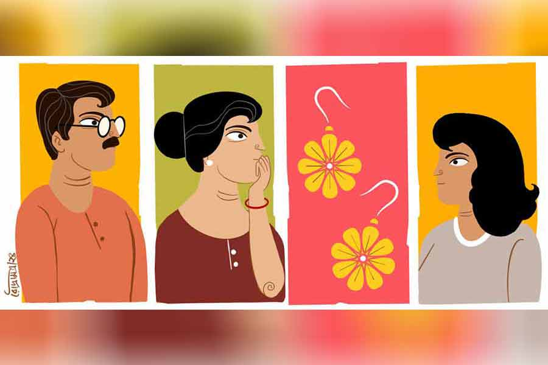

 
 <h1 align=center>সহস্রবাহু</h1>
<h2 align=center>রঞ্জন দাশগুপ্ত</h2> 

অসহ্য গুমোট। নানা চাপে অফিস থেকে ছুটি নেওয়া হয়ে উঠছিল না সঞ্জীবের। আজকের দিনটা একটু ফাঁকা পেয়ে সিএলের একটা দরখাস্ত ঠুকে দিয়েছিল সে। এক দিন একটু বেশি ঘুমোবে। টিভি দেখবে। দুপুরে পাতলা করে মাছের ঝোল-ভাত। ঝিঙে পোস্ত। আর ঘুম।

ঠিকঠাকই এগোচ্ছিল সব। ঘুম থেকে উঠল দেরি করে। ব্রাশ সেরে চায়ের কাপ নিয়ে বসল মেয়ে সুবর্ণার কাছে। তার স্কুলে গরমের ছুটি চলছে। সে সকালে উঠে তার জিনিসপত্র গোছাচ্ছিল। মেয়ের সঙ্গে একটু খুনসুটি করে সঞ্জয় কাপটা নামাতে গেল ভিতরে। আর তখনই…

মেয়ে তার মাকেই হাঁকটা দিয়েছিল, “মা, আমার একটা ইয়াররিং পাচ্ছি না!”

হুলস্থুল কাণ্ড। সঞ্জীবের আর্থিক অবস্থা খুব সচ্ছল নয়। তিন বছর আগে কেনা ফ্ল্যাটের লোনটা চলছে। এখনও সেখানে শিফ্ট করা হয়নি। বাইক কিনেছিল আর একটা পার্সোনাল লোন নিয়ে। সেটিও আছে। সংসারের খরচ, লৌকিকতা, মেয়ের স্কুল, নানা কারণে হাতে থাকে না কিছুই। কাজেই মেয়েকে কখনও খুব দামি কিছু কিনে দেওয়া হয়নি। এই কানের জোড়াটা যে ও-ই কিনে দিয়েছিল, ওর মনে ছিল না। সঞ্জীবের স্ত্রী দেবস্মিতাই বলল। সুবুর দু’বছরের জন্মদিনের উপহার। চার গ্রামের মতো সোনা। এখন কিনতে গেলে মজুরি নিয়ে কম করেও প্রায় তিরিশ-পঁয়ত্রিশ হাজারের ধাক্কা।

দেবস্মিতা রান্নাবান্না নিজেই করে। ঝিঙে সবে কোটা হয়েছিল তার। পড়ে রইল।

প্রথমে ঝাড়া হল বিছানার চাদর, বালিশ। তার পর মেয়ের ছাড়া কাপড়-জামা, গামছা। তার পর বই-খাতা, পেনসিল বক্স নেড়েচেড়ে দেখা হল। ড্রেসিং টেবিলের সামনে মেয়ে মাঝেমধ্যেই নিজের মুখ দেখতে যায়। বাঁকিয়ে চুরিয়ে, হাঁ করে, একটু পাশ ফিরে, জিব বের করে নানা ভাবে দেখে। চোদ্দো বার চুল আঁচড়ায়। বড় হচ্ছে। কাজেই ড্রেসিং টেবিলের উপরের সাজগোজের সব জিনিসপত্র নামিয়ে দেখা হল।

কাজের মেয়ে আজ আসেনি। কানেরটা খোঁজার জন্য ঝাঁটা হাতে নেমে পড়তে হল সঞ্জীবকেই।

মিনু বলে যে মেয়েটি ঝাঁট-মোছ করে, বাসন মেজে, কাপড় কেচে চলে যায়, সে যে আসলে সঞ্জীবের জন্মশত্রু, তা কে জানত! এত দিন মেয়েটি শুধু উপর-উপর তুলি বুলিয়ে গেছে, গভীরে যাওয়ার কোনও চেষ্টাই করেনি। ফলে অনভ্যস্ত হাতে ঝাঁটা চালাতে চালাতে সঞ্জীব আবিষ্কার করে ফেলল বহু দিন আগে হারিয়ে যাওয়া একটি পোড়ামাটির অ্যাশট্রে, ইঁদুরে টেনে নিয়ে যাওয়া দুটো পেঁয়াজ, মেয়ের ছোটবেলার ক্ল্যাচার, কাঠের একটা চিরুনি, পুরনো পাঁজি আর ছড়ার বই, তিনটে স্টিলের চামচ, বাঁদর তাড়ানোর গুলতি— যেটার জন্য পাশের বাড়ির ছেলে চিঙ্কুকে সন্দেহ করা হয়েছিল, পাসপোর্ট সাইজ়ের কয়েকটি ফোটো, একটি রুপোর হার—যেটি মিনুর হাতসাফাই বলে সবাই জানত— কিন্তু চট করে কাজের মেয়ে পাওয়া যায় না বলে কিছু বলা হয়নি, একটা মস্ত সেফটিপিন...

ড্রেসিং টেবিলের পিছনে যে ঝুল জমেছিল, তা দিয়ে গোটা চারেক কম্বল বানানো যায়। অবশ্য এ গরমে কম্বলের কথা ভাবলেই গা ঘেমে ওঠে।

এ বার সঞ্জীবকে থামিয়ে দেবী ঝুল ঘাঁটতে বসল। ইয়াররিং-এ আঁকশি দেওয়া আছে, ঝুলে আটকে থাকতে পারে। ঝকঝকে মেঝের উপরে বসে সঞ্জীব ভাবল, অফিস জায়গাটা মোটেই তেমন খারাপ নয়। যে ই-টেন্ডার করতে করতে এত দিন তার মাথা খারাপের জোগাড় হচ্ছিল, সেটাও তেমন বদ ধরনের কাজ বলে মনে হচ্ছে না তার।

দেবীর ঝুল ঘাঁটা হয়ে গেলে সঞ্জীবকে আবার কাজে লেগে পড়তে হত। কিন্তু তখনই বেজে উঠল দেবীর ফোন। সকাল থেকে এই নিয়ে চতুর্থ বার।

“উফ! আবার!” সঞ্জীবের দিকে একটা কড়া চাউনি দিয়ে উঠে গেল দেবস্মিতা। অবশ্য একটু পরেই ফোনের এ পারে তার যে গলাটা পাওয়া গেল, সেটা মিঠে, নরম এবং বিরক্তির লেশমাত্র নেই।

“বলো দিদি...” কথার টুকরো ভেসে আসতেই উৎকর্ণ হল সঞ্জীব। কোন দিদি এটা?

একটু শুনেই নিশ্চিত হল, এটা তার বৌদির, মানে জেঠতুতো দাদার স্ত্রীর কল। মারাত্মক জ্বালাচ্ছে আজকে। গত দেড় ঘণ্টায় এটা তার তৃতীয় ফোন। প্রথম বারই দেবী ঠারেঠোরে জানিয়েছিল, সে এখন মেয়ের গয়না খুঁজতে ব্যস্ত। তার পরও!

খুব শরীর খারাপ হয়ে গিয়েছিল বৌদির। দাদা থাকে সোদপুরে। একটা বেসরকারি ফার্মে ছোটখাটো চাকরি করে সে। সেখানে চিকিৎসার তেমন সুব্যবস্থা নাকি নেই। তাই এখানে এসে ভাইয়ের ঘাড়ে ছেড়ে দিয়ে চলে যাওয়া। দাদার নাকি চাকরির খুব চাপ, তার উপর সঞ্জীবের ভাইপোর ক্লাস মিস হচ্ছে।

সঞ্জীবকেই যাবতীয় দৌড়োদৌড়ি করতে হয়েছে তখন। পয়সারও শ্রাদ্ধ। নানা ডাক্তার দেখানো হল। শেষে ভর্তি করা হয়েছিল কাছের একটা সস্তা নার্সিং হোমে। অপারেশন হল। হাজার কুড়ির ধাক্কা। বৌদির ভাইটি একটি অকালকুষ্মাণ্ড, ভাইয়ের বৌ-ও জালি মেয়ে। দরকারের সময়ে তাদের পাওয়া যায় না। নার্সিং হোমে গিয়ে রাত জাগতে হয়েছে দেবীকেই। ছাড়া পাওয়ার পরেও দিন সাতেক বৌদি এখানে থেকে গেল। না বৌদি যেতে চায়, না দাদা নিয়ে যেতে চায়। সে এক সময় গেছে।

আগে সে দেওর বা জা-কে তেমন ফোন-টোন করত না। ইদানীং ভালবাসার গাছে ফল পেকেছে।

কুড়ি মিনিট পরে ফিরে এল দেবী। আগুনে চোখে সঞ্জীবের দিকে তাকিয়ে বলল, “কী রকম মহিলা দেখো! বললাম, সুবুর কানেরটা হারিয়ে গেছে, খুঁজছি। তবু বার বার ফোন করে যত্ত ফালতু কথা! ভাই একটা কুকুর কিনেছে, সেটা নিয়ে ঘণ্টার পর ঘণ্টা ফালতু বকবকানি।”

ঝাঁট দেওয়ার কাজটা তাড়াতাড়ি চুকলে ভাল হয়। ঝাঁটার দিকে আলতো ভাবে হাত বাড়িয়ে সঞ্জীব বলল, “তুমিই বেশি পাত্তা দাও। সরাসরি বলতে কী হয়, এখন ব্যস্ত আছি! পরে ফোন করব!”

সুবর্ণা এ ঘরে এসে মোড়ার উপরে বসে নখ খাচ্ছিল। সেটা থামিয়ে বাবার দিকে তাকিয়ে বলল, “জেঠিকে ও রকম বলা যায় না, বাবা! তার পর তোমাকে যা কথা শোনাবে না!”

“বড়দের কথার মধ্যে থাকিস কেন!” বিরক্ত হল সঞ্জীব। বৌদি যেমনই হোক, ঘরের ছোটরা এ সব বিষয়ে কথা বলবে, সেটা তার পছন্দ নয়।

“কোনও হুঁশ নেই। কানেরটা হারালি, আবার কূটকচালি করতে এসেছিস? যা, গিয়ে খোঁজ! বেহায়া মেয়ে একটা!” গর্জন করে উঠল দেবী।

বিরস মুখে উঠে গেল সুবর্ণা। সে কি ইচ্ছে করে হারিয়েছে নাকি? তা ছাড়া, ক’দিন আগে মা-ও তো নিজের একটা মঙ্গলসূত্র হারিয়েছে। তার বেলাতেই যত দোষ!

আর খুঁজবেই বা কোথায়? সব জায়গাই এত ক্ষণে দু’-তিন বার করে খুঁজে দেখেছে সে।

ঠাকুমা নিজের ঘরে খাটের উপরে চুপ করে বসে ছিলেন। ব্যাপারটা শোনার পর তিনি একটু উৎসাহ দেখিয়ে ছেলে আর বৌমার কাছে সামান্য ধমক খেয়েছেন। এ বয়সে একটু কটু কথা শুনলেই মনটা খারাপ হয়ে যায়। অথচ করবেনই বা কী! আর কি কোথাও যাওয়ার জায়গা আছে, না হাত-পায়ে জোর আছে আগের মতো?

সুবু তাঁর ঘরে ঢুকে চুপিচুপি বলল, “ঠাম্মা, তুমি এক বার কী যেন বলেছিলে, তোমাদের সময়ে জিনিস হারিয়ে গেলে কী করলে পেয়ে যেতে?”

মুখ উজ্জ্বল হয়ে উঠল বৃদ্ধার। নাতনিটি বড় মিষ্টি। ঠাকুমার গল্পগুলো মনে রাখে সব। প্রয়োজনে অপ্রয়োজনে এসে কথাও বলে যায় মাঝেমধ্যে। সোৎসাহে তিনি বললেন, “সে অনেক গল্প রে! কত বার কত কিছু যে হারিয়ে যেত আমার! বিরাট ঘর ছিল আমার বাপের বাড়িতে। আত্মীয়স্বজনে ভরে থাকত সারা বছর। এমনি লোকও আসত কত। জিনিসপত্রে গিজগিজ করত ঘর। এক বার কিছু হারালে আর সহজে পাওয়ার জো ছিল না।”

উফ! সুবু ভুরুটা একটু কুঁচকে বলল, “কী বলতে, বলো না! হারানো জিনিস ফিরে পেতে গেলে?”

“আমরা তিন বার ফিসফিস করে বলতাম, কার্তবীর্যার্জুন... কার্তবীর্যার্জুন... কার্তবীর্যার্জুন। এই রাজার হাজারখানা হাত। ঠিক খুঁজে দেবে, দেখো...”

*****

সুবর্ণা ওরফে সুবু হলফ করে জানিয়েছিল, কাল রাতেই সে কানেরটা হাতে নেড়ে দেখছিল। সুতরাং জিনিসটা ঘরেই কোথাও পড়েছে। উপর-নীচ মিলে বাড়িতে বেডরুম চারটে। সব ঘরেই সুবু যাওয়া-আসা করে। তন্নতন্ন করে খোঁজা হল সব।

সঞ্জীবের ভাই রাজীব দাদার থেকে দশ বছরের ছোট। এখনও চাকরিবাকরি কিছু পায়নি। টিউশন পড়ায়। ভাইঝিকে ভালবাসে খুব। এখন রাজু বাইরে গেছে। একটু দোনোমোনো করে দেওরের চাদর-বিছানা ঝাড়ল দেবী। মেয়েটার যা আক্কেল, কাকার সঙ্গে গল্প করতে করতে কানে হাত দিয়ে টানাটানি করে যদি…

বিছানার নীচেও পড়ে থাকতে পারে। সঞ্জীবের উপরে ভরসা না করে ঝাঁটাটা কেড়ে নিয়ে এসে খাটের পিছনে চালাতেই ঠং করে শব্দ। একটু ঝুঁকে দেবী দেখে, সেখানে ফাঁকা একটা মদের বোতল। সে আর সঞ্জীব যখন নার্সিং হোমে ছিল, রাজু তখন এনে খেয়েছে নিশ্চয়ই। তার পর ফেলে দিতে ভুলে গেছে।

রাজীব সত্যিই ভুলে গিয়েছিল। আর আজ সবেমাত্র বাইরে থেকে এসে নিজের ঘরে ঢুকতে যাবে— দেখে, বৌদি মদের বোতল পেয়েছে। নিঃশব্দে সরে গিয়ে আবার বাইকে চড়ে বাইরে বেরিয়ে গেল সে। এ বেলা ফিরবে না। ও বেলা দেখা যাক কী হয়।

সঞ্জীব নিজের মায়ের ঘর খুঁজেও নানা আজেবাজে জিনিস পেল। তার মধ্যে সুতো বাঁধা এক তাড়া হলদে হয়ে যাওয়া খাম। ভিতরে চিঠি। বাবার লেখা। তাকে, দেবীকে, তার মাকে।

কানেরটা হারানোয় সঞ্জীব অল্প ক্ষুণ্ণ হয়েছে বটে, কিন্তু দেবস্মিতার মতো দিশেহারা হয়নি। তার আর তার মেয়ের স্বভাব এক রকম। কিছুতে গা নেই। টাকার জন্য এত হ্যাপা সঞ্জীবের সহ্য হচ্ছিল না। চিঠিগুলো পেয়ে সে পড়তে শুরু করল। সে যখন হস্টেলে ছিল, তখন বাবা কয়েকটা চিঠি লিখেছিল তাকে। সেগুলোও আছে। উপদেশমূলক, তবে সে-ই পুরনো দিনের কথা! আহা!

মাকে লেখা বাবার একটা চিঠি পড়ে তার মাথাটা গরম হয়ে গেল। লোকটা নানা রকমের অসভ্য কথা লিখেছে তার মা-কে। বেশ ইরোটিক! আচ্ছা ইতর লোক ছিল তো!

তত ক্ষণে সুবু শ’তিনেক বার কার্তিক আরিয়ান… না না, ওই ‘কাতিয়া অর্জুন’ না কাকে যেন ডেকে ফেলেছে। এখনও পর্যন্ত কিছু হয়নি। মোবাইল ঘাঁটলে মা তাকে খুন করে ফেলবে। সময়টাও কাটে না। সে পায়ে পায়ে উপরে উঠে গেল। কাল বিকেলে এক বার চিলেকোঠার ঘরে ঢুকেছিল ও। বলা যায় না, রাতে ইয়ার-রিংটা নাড়াচাড়া করার ব্যাপারটা তার মনের ভুলও হতে পারে।

গুছোনো জিনিস ছড়িয়ে যায় কোনও এক দিন। ছড়িয়ে থাকা জিনিস আবার গুছিয়ে নিতে হয়। কিন্তু আগের অবস্থা আর ফেরত আসে না। পুরনো, বাতিল, নোংরা জিনিসের মধ্য থেকে নতুন কোনও সত্য উঠে আসে।

সুবুর ঠাকুমা রেবতী চোখ বুজে শুয়ে পড়েছিলেন। আর সে সময়েই তাঁর বিছানার অন্য দিক ঝাড়াঝাড়ি করতে করতে দেবী তোশকের তলায় পেয়ে গেল লুকোনো এক ছড়া মটরদানা হার।

এ হার সঞ্জীবদের পরিবারের নিজস্ব অভিজ্ঞান। বরাবর শাশুড়িদের হাত থেকে বৌমারা পেয়ে আসছে। কিন্তু দেবী পায়নি। তার শ্বশুরমশাই এক বার বলেছিলেন এটার কথা। কিন্তু পরে জানা যায়, শাশুড়ির মুখেই শুনেছিল, সেটা নাকি কোথায় হারিয়ে গেছে।

কিন্তু কেন? তাকে না দিয়ে, ছোট ছেলের বৌকে দেবে বলেই কি লুকিয়ে রেখেছে শাশুড়ি?

নাকের ডগা গরম হয়ে গেল দেবীর। ছি ছি! এত ভালবাসা, এত সেবা, এ সবের কোনও দাম নেই বুড়ির কাছে?

সন্তর্পণে হারটা মুঠোয় লুকিয়ে ফেলল দেবী।

ও দিকে তখন সঞ্জীবের শিরাতেও হানা দিয়েছে তীব্র, উষ্ণ এক রক্তোচ্ছ্বাস। দেবী বারণ করা সত্ত্বেও নিতান্ত কী এক খেয়ালে, অপ্রয়োজনীয় জেনেও আলমারি হাতড়াচ্ছিল সে। এই কড়ারে, যে আবার সব আগের মতো গুছিয়ে দেবে। তখনই পাটে পাটে ভাঁজ করা নীল শাড়িটা দেখতে পেল ও।

নিজের বৌয়ের শাড়ির খবর বোধহয় কোনও পুরুষই রাখে না। কিন্তু এই শাড়িটা সে আগে দেখেছে। তারই খুব প্রিয় বন্ধুর হাতে। সে দিন হঠাৎই শাড়ির দোকানে সঞ্জীবের সঙ্গে দেখা হয়ে গিয়েছিল বিনায়কের। তার হাতে দেখেছিল এটা। পরিষ্কার মনে পড়ছে, তাকে দেখে বিনায়ক কেমন অপ্রতিভ হয়ে গিয়েছিল। পিছনে হাত নিয়ে গিয়ে লুকোনোরও চেষ্টা করেছিল বোধহয়।

রগগুলো দপদপ করতে লাগল সঞ্জীবের।

চিলেকোঠায় টুকটুকে লাল একটা সোয়েটার তুলে একটু শুঁকে দেখল সুবর্ণা। তারই ছোটবেলার। এখনও যেন দুধ-দুধ গন্ধ লেগে আছে।

তার একটু নীচেই পেয়ে গেল একটা নিউ ইয়ারের গ্রিটিংস কার্ড। উপরের সাদা খামটা ছেঁড়া আর লালচে। খুলে দেখল সুবু।

নাইনটি সিক্সের কার্ড। তখন এ সবের চল ছিল। কিন্তু ভিতরে কী লেখা?

খুব কৌতূহলের সঙ্গে কার্ডটা উল্টে সুবু দেখতে পেল, ভিতরে কেবল একটা লাল হার্টের হাতে আঁকা ছবি। তার এ দিক থেকে ও দিকে চলে গেছে একটা তির। উপরে লেখা ইংরেজির ‘এস’, আর নীচে ‘পি’।

‘এস’-টা তো তার বাবা। আর ‘পি’? কার্ডটা নিজের বুকের ভিতরে ঢুকিয়ে নিল দেবী।

ডাইনিংটায় যখন তিন দিক থেকে ঢুকল তিন জন, তখন তাদের চোখের ভাষা বদলে গেছে। সে ভাব প্রাণপণে লুকিয়ে রাখার চেষ্টা করতে করতে ঘৃণা, অপরাধ আর রাগের দৃষ্টিতে পরস্পরের দিকে তাকাল তারা।

শেষ পর্যন্ত কী হত কে জানে! তবে নাটকের এই অঙ্কে আবার অপ্রত্যাশিত মোচড় এল একটা। যাকে পেরিপেটায়া-ও বলা যায়, অ্যানাগনোরিসিস-ও বলা যায়। হঠাৎই তাদের ডোরবেলটা বেজে উঠল। এক বার, দু’ বার, বেশ ক’বার।

এর মধ্যে আরও তিন বার মোবাইলের ধাক্কা সামলাতে হয়েছে দেবীকে। রান্না হয়নি এখনও। বারোটা বাজতে চলল। অত্যন্ত বিরক্ত হয়ে দরজা খুলল সে।

সুস্মিতা। সুবুকে টিউশন পড়াতে আসে যে ইন্দ্রনীল, তারই বোন। পাড়ায় থাকে।

হাসিমুখে নিজের হাতের মুঠি সামনে বাড়াল সুস্মিতা। মুঠি খুলে বলল, “এটা সুবুদির না কাকিমা? দেখো তো! মনে হচ্ছে, সুবুদির কানে দেখেছি।”

সেখানে ঝকঝক করছে সুবুর কানের জোড়াটা। আনন্দে আর উত্তেজনায় সেটা তুলে নিয়ে প্রায় চেঁচিয়ে উঠল দেবী, “হ্যাঁ তো রে! কোথায় পেলি? সকাল থেকে খুঁজে মরছি!”

“দাভাই তো কলেজ চলে গেছে। মা-বাবা গেছে একটা নেমন্তন্ন খেতে। ওর জামাটা ঝাড়তে গিয়ে দেখি, এটা আটকে আছে বোতামের কাছে। তখনই মনে পড়ল, কাল পড়াতে এসেছিল দা-ভাই। সে তো ফোন ধরছে না। তোমাদেরও কত বার কল করলাম। সুবুদি ধরছে না, তোমারটা খালি খালি বিজ়ি আসছে।”

সুস্মিতার বয়স মাত্র বারো। অনেক ব্যাপারই সে বোঝে না।

সঞ্জীব ভিতর থেকে সব শুনেছে। দেবী যখন ডাইনিং-এ ঢুকল, তার মুখ থমথম করছে। তীব্র দৃষ্টিতে সঞ্জীব তাকাল দেবীর দিকে।

দেবী সুবুর কাছে সরে এসে চাপা গলায়, সাপের মতো হিসহিস করে বলল, “বল, কানেরটা ইন্দ্রনীলের জামায় গেল কী করে!”

সুবর্ণা নীরব। হাজারখানা হাত কি আর শুধু একটা দুল খুঁজে দিয়ে ক্ষান্ত হয়!

ছবি: রৌদ্র মিত্র

