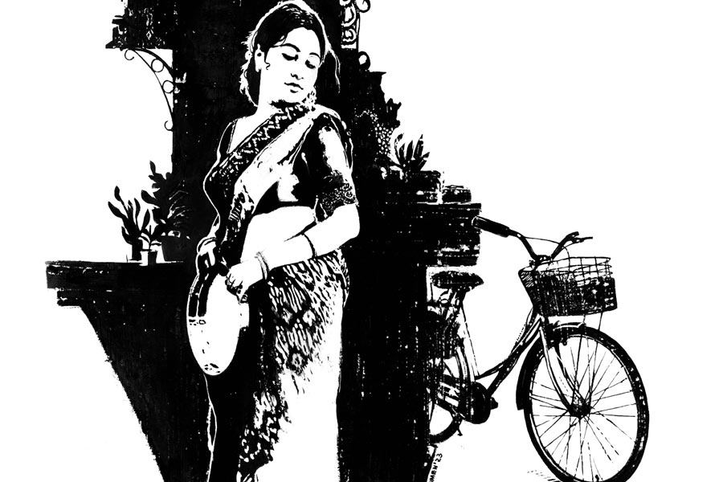

 
 <h1 align=center>সাইকেলের দাম</h1>
<h2 align=center>তাপস রায়</h2> দুপুরে কমলিকা কল্যাণী যাবে। ছোট ভাই অর্ণবের মেয়ে রেশমির জন্মদিন। বড় পিসি না এলে মেয়ের মুখ ভার হয়। চার রাত কাটিয়ে সামনের শুক্রবার বিকেলে ফিরবে। কথাটা জানিয়ে কমলিকা চম্পাকে বলল, “এই ক’দিন সকালে তোর বাসন-কোসন ধোওয়ার বালাই নেই। কিন্তু তোর কাকু এক বাটি জলও গরম করে নিতে পারে না। সকালে এসে কাকুকে এক কাপ লাল চা বানিয়ে দিস। পারবি তো?”

দু’হাত দূরত্বে দাঁড়িয়ে সিঙ্কে বাসন ধুচ্ছিল চম্পা। হাতের বাসনটাকে হাতে ধরে রেখে বলল, “পারব কায়িমা। কিন্তু কাকু খাবে কী?”

“দুপুরে অফিসের ক্যান্টিন। রাতে হোম ডেলিভারি।”

বেডরুম থেকে মিহি গলায় অনিমেষের আর্তি উড়ে এল, “শুনছ-ও-ও! দাও না!”

“অপেক্ষা করো! দেরি আছে!” কমলিকা গলা তুলে সাড়া দিল।

চম্পা থালা মাজতে মাজতে জানতে চাইল, “কাকু আজ অপিস যাবেনি, কায়িমা?”

কড়ায় খুন্তি নেড়ে কমলিকা উত্তর দিল, “না। মাথা ধরেছে। ছ’বছর পর রিটায়ার করবে লোকটা, ক’দিন পর মেয়ে ডাক্তার হবে, কিন্তু দেখ— ঘুগনি, আলুকাবলি, কোনও খাবার যদি বাদ দিত! কাল অফিস থেকে ফেরার পথে আলুর চপ সাঁটিয়েছে, তাও একটা নয়, তিন-চারটে।”

চম্পা চোখ সরু করে খিলখিল করে হাসল। হাসির দমক সামলে বলল, “কায়িমা, রাগ করো কেনে? এই বয়সে নোলা বাড়ে গো। তুমার সাদা-সাদা আন্না। ঘরে না পে কাকু বাইরে গে খে আসে।”

কমলিকা থমকাল। মনে মনে মানল, পুরু শাঁস আছে চম্পার কথায়। এই বয়সে পুরুষমানুষদের সত্যি নোলা বাড়ে। গড়িয়াহাটে মার্কেটিংয়ে বেরিয়ে কমলিকা দেখেছে, এখনও অনিমেষ আড়চোখে সুন্দরী মেয়েদের দিকে তাকায়।

কমলিকা অবশ্য চম্পার কথার জবাব অন্য ভাবে দিল, “হ্যাঁ, যা বলেছিস। আর এই করে পেটটাকে তো গ্যাসের সিলিন্ডার বানিয়ে রেখেছে, মাথাব্যথা না হয়ে যায়? এখন সকাল থেকে ঘ্যানঘ্যান করছে। মাথা টিপে দাও।”

“তা দাও না এট্টু কায়িমা!”

“রান্না শেষ না হলে কিছুতেই দেব না! গতকালই বললাম আজ দুপুর-দুপুর বেরিয়ে যাব, ভোর পাঁচটায় উঠলাম যার জন্য... আজই আবার মাথা ধরল!”

চম্পা আবার হাসল, বলল, “তাও দাও এট্টু!”

গরম তেলে মাছের পিসটাকে খুন্তি দিয়ে নিপুণ হাতে উল্টে-পাল্টে কমলিকা বলতে থাকল, “আমারও বয়স হয়েছে। এখন আর আঙুলে আগের মতো জোর নেই।”

“কায়িমা, তুমি যদি বলো তো বাসনটা ধোওয়া হয়ি গেলে আমি দিতি পারি। দিখবে পাঁচ মিনটেই কাকুর মাতার সব বিষ লেবে যাবে।”

কমলিকা গোমসা দৃষ্টিতে তাকাল, ধনুকের ছিলা থেকে তিরের মতো ছুটে গিয়ে ওর দৃষ্টি চম্পার সরল মুখটাকে বিঁধে ফেলল। চম্পা কাকভোরে উঠে বাড়ির রান্না সেরে দু-তিন কিলোমিটার প্রায় দৌড়তে দৌড়তে ট্রেন ধরে যাদবপুরে নামে। তার পর আরও দু’-তিন কিলোমিটার হাঁটা পথ। এ গলির তিন আর পাশের গলির পাঁচ, সব মিলিয়ে আট বাড়িতে দিনভর বাসন-মাজা, নয় ঝাড়পোঁছ, নয় ঘর-মোছা, নয় টাইম কলের জল ভরে দেওয়া— গুচ্ছের কাজ সারে কাঁটা ধরে। দিনভর ডিউটি করার পর সূর্যও অস্তাচলে শরীর ছেড়ে দেয়। কিন্তু চম্পার সে জো নেই। তখনও এক-গঙ্গা কাজ বাকি। আবার হনহনিয়ে ট্রেন ধরার জন্য হাঁটা। পিছনে ময়লা আঁচলের মতো গড়াগড়ি খায় গোধূলির আলো-মাখা দিনান্ত। যাদবপুর থেকে চিঁড়েচ্যাপ্টা হয়ে লক্ষ্মীকান্তপুর স্টেশন। তবু কারণে-অকারণে খিলখিল করে হাসে। উদয়াস্ত হাড়ভাঙা খাটুনির পরেও শরীরে মাতলা নদীর মতো যৌবনের কলকলানি। গরিবের ঘরের হলেও চোরা লাবণ্য আছে পুরন্ত শরীরে। ভাল শাড়ি-গয়না পরিয়ে দিলে কেউ বলবে না, কাজের লোক। 

কমলিকার কপালে ভ্রুকুটি দেখে চম্পা ধন্দে পড়ে গেল। কমলিকা বলল, “তোর দেরি হবে না?”

ভাসমান সম্মতিটা ধরতে চম্পার এক মুহূর্ত সময় লাগল। হাত দুটো ময়লা কাপড়ে মুছল। চোখের তারায় ফুলঝুরির মতো ঝিকমিক আলো জ্বালিয়ে বলল, “হবেনি কায়িমা!”

“এক মিনিট দাঁড়া!”

ওভেনের নব সিম-এ দিয়ে কমলিকা বেডরুমে গেল। ফিরে এল অনিমেষকে নিয়ে।

চম্পা মুচকি হেসে ডাইনিংয়ের সরু সিঙ্গল ডিভানটা দেখিয়ে বলল, “দেরি কোরোনি কাকু, শুইয়ে পড়ো। এট্টু বাদে মাতা-বেতা কোতায় গেচে খোঁজ পাবে নে।”

বিস্ময়াবিষ্ট অনিমেষ নিমেষে বিছানায় টান-টান। চম্পা ডাইনিং টেবিলের কাছ থেকে একটা চেয়ার অনিমেষের মাথার কাছে টেনে নিল। হাতের চুড়িতে রিনিঠিনি শব্দ তুলে কপালে-মাথায় জোরে জোরে চাপ দিল। আরামে চোখ বুজে এল অনিমেষের। কখন যে পাঁচ মিনিট কেটে গেল হদিসই পেল না। চটকা ভাঙল চম্পার কথায়।

“অ কাকু! কাকু! বেতা কমেচে?”

মাথা ঘুরিয়ে ঢুলু-ঢুলু চোখে তাকাল অনিমেষ। শ্লেষ্মা-জড়ানো গলায় বলল, “ভারী পাথর নামিয়ে দিলি। তোর হাতে ম্যাজিক রে চম্পা!”

চম্পা লজ্জায় কান এঁটো করে হেসে আঁচলটা গাছকোমর করে বেঁধে নিয়ে সদর দরজার দিকে এগিয়ে গেল। একটা ইউ-টার্ন নিয়ে আবার ফেরত এল। কমলিকার কাছে এসে গলা নামিয়ে বলল, “ও কায়িমা, বলচি তুমাদের সাইকেলটা তো পইড়ে পইড়ে নষ্ট হতি বসেচে। বিক্রি কইরে দাও না!”

সাইকেলটা আজ বারান্দায় পড়ে আছে বছর দুয়েক। মামন চুটিয়ে ব্যবহার করেছিল। স্কুলে, কোচিংয়ে সর্বত্র নিয়ে যেত। মেডিক্যাল কলেজে চান্স পাওয়ার পর আনন্দের আতিশয্যে সাইকেলের হ্যান্ডেলে চুমু খেয়ে বলেছিল, “বিক্রি কোরো না। যদি দিতেই হয় কোনও গরিব ছাত্রীকে এমনি দিয়ো।”

পাপাইয়ের মা বেশ কিছু দিন আগে সাইকেলটা কিনতে চেয়েছিল। কমলিকা না করে দিয়েছে। পাপাইরা যথেষ্ট অবস্থাপন্ন। ইচ্ছে করলেই নতুন সাইকেল কিনে নিতে পারে।

“তুই নিবি?”

চম্পা মাথা নিচু করল, বলল, “যদি দামটা বলো! মেয়েটা রুজ ভেনে চেপে ইস্কুল যায়। সেই গাড়িভাড়াটা বেইচে যেত।”

কমলিকা মুচকি হেসে বলল, “তুই যা দিতে পারবি সেটাই সাইকেলের দাম।”

চম্পার মুখে দিনের আলোতেও আকাশ থেকে হাজার তারার অবতরণ। ঝিলমিল করে উঠল ওর শ্যামলা মুখে।

“কিন্তু এতটা রাস্তা নিয়ে যাবি কী করে?” কমলিকা জিজ্ঞেস করল।

“সে তুমায় চিন্তা করতি হবে নে। মাসির ছেলে পালানকে কালই নে আসব। ও এসে একানকার দুকানে হাওয়া ভইরে নে চলে যাবে।”

চম্পা লাফাতে লাফাতে যেতে গিয়েও সুইং-ডলের মতো ঘুরে দাঁড়িয়ে বলল, “বলচি নগদ ট্যাকা দিতে পারবুনি। আমার মাইনে থেকি মাসে মাসে কেটে লিয়ো।”

“দেখা যাবে। তুই যা।”

চম্পা চলে গেল। অনিমেষ শুয়ে শুয়ে সব শুনছিল। উঠে বসল। কমলিকার উদ্দেশে বলল, “কী গো, তুমি ওর কাছে দাম নেবে?”

কমলিকা ঘাড় ঘুরিয়ে হেসে বলল, “তুমি যদি সত্যিই না নিতে চাও, তা হলে নেব না!”

*****

কমলিকার বিকেলে ফেরার কথা। গত কয়েক দিন রোজ যেমন হয়েছে তেমনই আজও অনিমেষ ঘুম থেকে উঠে ব্রাশ করে ড্রয়িংরুমে বসে ছিল। কয়েক দিন ধরে একটাই কথা মাথায় ঘুরঘুর করছিল, কমলিকা তাকে এতটা বিশ্বাস করে! একটা যুবতী মেয়েকে একা একা তার সঙ্গে এক বাড়িতে অ্যালাও করল কী করে! চম্পা রান্নাঘরে গিয়ে চা করল। কাপ-প্লেট নিয়ে অনিমেষের সামনে এসে দাঁড়াল। অনিমেষ চোখ তুলে এমন ভাবে তাকাল যেন, চম্পাকে এই প্রথম দেখছে।

“তোমার কি শরীল খারাপ কাকু? সপ্তাভর দেখছি কিছু এট্টা ভাবতি ভাবতি যেন অস্থির হয়ি যেতিছ!”

“মাথাটা ধরেছে রে!”

চা-টা সেন্টার টেবিলে নামিয়ে রেখে চম্পা বলল, “ঘন ঘন মাতা-ধরা কিন্তু ভাল লক্কন লয় কাকু। মাতার মদ্যি খারাপ কিচু এট্টা বড়...”

“থামলি কেন? কী বড় হবে?”

“আমার এক জাঠ-শউরের এমনি ঘন ঘন মাতা ধরত। পরে ডাক্তারি পরিক্ষে করে জানা গেল টিউমার।”

অনিমেষ হেসে বলল, “ধুস! বলছি চম্পা, সে দিনের মতো একটু মাথাটা মাসাজ করে দে না!”

চম্পা শূন্য ঘরের দিকে তাকাল। মুখের অভিব্যক্তিতে সদর্থক সাড়ার অভাব দেখতে পেল অনিমেষ। ঘাবড়ে গিয়ে বলল, “অসুবিধে থাকলে থাক...”

চম্পা আঁচলটা কোমরে বেঁধে বলল, “না কাকু, দিচ্চি।”

চায়ের কাপটা দ্রুত শেষ করে অনিমেষ ডাইনিংয়ের ছোট্ট ডিভানে শুয়ে পড়ল। চম্পা চেয়ার টানতে গেল। অনিমেষ বলল, “আহা থাক না! বিছানায় বোস! সুবিধে হবে। লজ্জা কিসের? একটু সরে শুচ্ছি।”

তিন ফুট চওড়া ডিভানে অপর্যাপ্ত জায়গা। চম্পা বসার পর ওর শরীরটা স্বভাবতই অনিমেষের কাঁধ ও গাল ছুঁয়ে যাচ্ছিল। চম্পা জড়সড় হয়ে মাথায় চাপ দিল। অনিমেষের চোখের পাতা প্রজাপতির ডানার মতো চঞ্চল। কখনও বুজছিল, কখনও খুলছিল। চোখ খুললেই চম্পার তরঙ্গায়িত কটিদেশের অনাবৃত অংশবিশেষ নজরে আসছিল। গত মঙ্গলবার সকালের মতো ঘুম এল না অনিমেষের চোখে। জড়ানো গলায় শুধোল, “হ্যাঁ রে চম্পা, তোর মেয়ে সাইকেলটা চালাচ্ছে?”

“হুঁ-উ-উ!”

“জানিস তো, কাকিমাকে আমিই বলেছিলাম সাইকেলটার দাম নিতে হবে না...” চম্পা উত্তর না দিয়ে ঘরের সিলিংয়ের দিকে তাকিয়ে অনিমেষের মাথায় চাপ দিল। ক্ষণিক বাদেই অনুভব করল অনিমেষের মুখটা তার কোমরের আরও নিকটবর্তী হওয়ার জন্য হাঁকপাঁক শুরু করেছে। চম্পা হঠাৎ উঠে দাঁড়াল, “কাকু চলি। দেরি হয়ি গেচে। জানো না, ওই বাড়ির দত্ত কায়িমার মুখ মোটে ভালো না।”

অনিমেষকে কিছু বলার সুযোগ না দিয়ে আচমকা ঘর থেকে বেরিয়ে গেল। অনিমেষ উঠে বসল বিছানায়। উত্তেজিত শরীরে আস্তে আস্তে হিম পড়তে শুরু করল। বেশ কিছু ক্ষণ চুপচাপ বসে রইল।

*****

পরের দিন সন্ধেয় অফিস থেকে ফিরে গেট খুলে বাড়ির মধ্যে পা রাখতে আবছায়াতে নজরে এল, একটা সাইকেল বাড়ির দেওয়ালের ভিতর দিকে ঠেস দিয়ে দাঁড় করানো। ভয়ে হাত-পা শুকিয়ে গেল অনিমেষের। মন্থর পায়ে দুরুদুরু বুকে ড্রয়িংরুমে ঢুকে দেখতে পেল, সেন্টার টেবিলের উপর একটা মোটা বই খোলা অবস্থায় পড়ে। বুঝল, মামন এসেছে হস্টেল থেকে। একটা আতঙ্ক চেপে ধরল। মামনের তো আজ আসার কথা ছিল না! কেন এল?

ব্যাগটা চেয়ারে রেখে কমলিকার মুখের দিকে চোরা দৃষ্টি হানল। অশনি সঙ্কেতের চিহ্ন না পেয়ে হাতের আঙুল দিয়ে জামার বোতাম খুলতে খুলতে একটু সাহস সঞ্চয় করে কাগজের উড়োজাহাজের মতো প্রশ্নটা ভাসিয়ে দিল, “বাইরে সাইকেলটা দেখলাম?”

কমলিকা কাচের গেলাসে জল ঢালতে ঢালতে বলল, “পারমিতাদের সাইকেল। মামন এসে পিয়াদের বাড়ি গিয়েছিল। সেখান থেকে এসেই তো ঘুমিয়ে পড়ল মেয়েটা।”

অনিমেষ যেন নতুন জীবন পেল। অন্ধকারে সাইকেলটা ঠিক চিনতে পারেনি। কমলিকার হাত থেকে গেলাসটা নিয়ে ঢকঢক করে জলটা খেয়ে নিল। ফাঁকা গেলাসটা কমলিকার হাতে ফেরত দিয়ে অনিমেষ আধখোলা জামার বোতামে হাত দিল। পর্দার সরু ফাঁক দিয়ে চোখ গেল ঘুমন্ত মেয়ের দিকে। বইটা হাতে নিয়ে পর্দা সরিয়ে মামনের ঘরে ওর মাথার পাশে বেডসাইড টেবিলের উপর রেখে এল। ডিনারের পর বিছানায় গেলে বেশ কিছু ক্ষণ বাদে অন্য দিকে পাশ-ফেরা কমলিকাকে জড়িয়ে ধরে জিজ্ঞেস করল, “কী গো, তুমি চুপচাপ যে বড়?”

“ভাবছি চম্পার কথা। মেয়েটা কী কষ্টটাই না করে! স্বামীটা তো একটা লম্পট। অকম্মা! গতকালও মদ খেয়ে এসে অত্যাচার করেছে।”

অনিমেষ কিছু ক্ষণ চুপ করে থেকে বলল, “ও যে ভাবে সংসারের জন্য লড়াই করছে, আমাদের ওকে সাধ্যমতো সাপোর্ট দেওয়া প্রয়োজন। ওই জন্যই তো তোমাকে বললাম, সাইকেলের দাম নেওয়াটা আমাদের একেবারেই উচিত হবে না।”

কমলিকা অনিমেষের দিকে পাশ ফিরল। রাতবাতির আলোয় দেখা গেল কমলিকা হাসছে। হাসিতে শ্লেষের ছোঁয়া। কমলিকা হাসতে হাসতেই বলল, “আচ্ছা, একটা কথা সত্যি করে বলো তো, এই ক’দিনে তোমার কি এক বারও মনে হয়নি যে, তুমি এক বার চম্পার কাছ থেকে সাইকেলের দামটা নেবে?”

কমলিকার গায়ে জড়ানো অনিমেষের শক্ত হাতটা হঠাৎ শিথিল হতে শুরু করল।