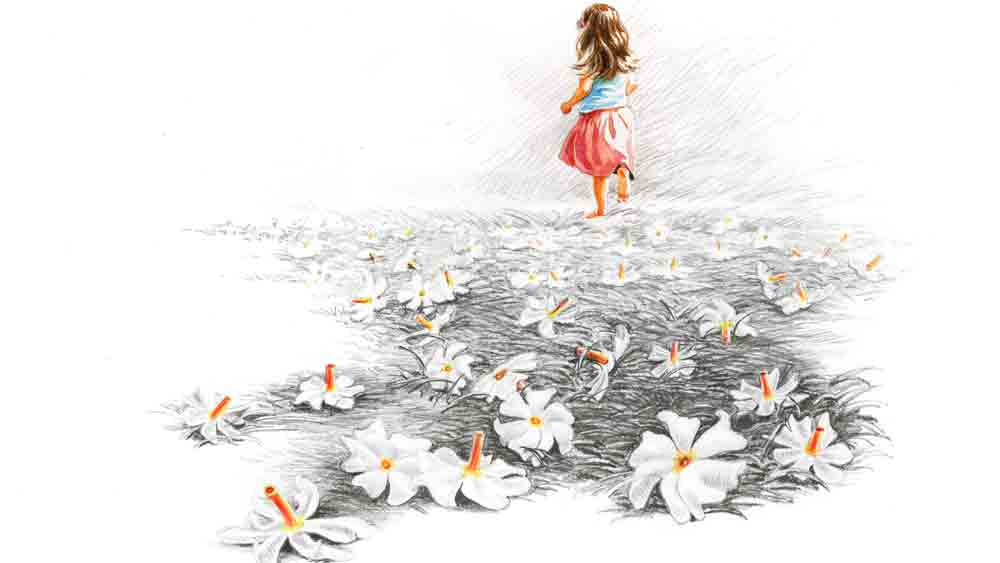

 

<h1 align=center>সাক্ষীতরু</h1>
<h2 align=center>মৌসুমী বন্দ্যোপাধ্যায়</h2>
এক যে আছে গাছ। ‘খুশির মেলা’ বাড়ির শিউলি গাছ। গাছটার আজ খুব আনন্দ। ডালগুলো দুলছে, পাতারা কাঁপছে। ঝুপসি-ঝাপসি গাছে খুশির দোলা।   অনেক দিন পর এই বাড়ির সামনে মাল বোঝাই তিনটে ট্রাক এসে দাঁড়িয়েছে। বাড়ির লোক ঠিক কত জন সেটা বোঝা না গেলেও বাড়িতে আবার মানুষজন থাকবে, তাদের কথা হাসিতে বাড়ি ভরে উঠবে, সেটা বেশ বোঝা যাচ্ছে।   গত ষোলো বছরে বাড়িটা তিন বার হাতবদল হল। তার আগের কথা শিউলি গাছের অজানা। তার বয়স ষোলো বছর।   প্রথমে থাকত একটা ছোট্ট পরিবার। বাবা, মা আর ছোট একটি মেয়ে। বয়স কত হবে, তিন কি চার, নাম তিন্নি। ফিনফিনে পরি। সারা বাড়ি দৌড়ে বেড়াত। আপন মনে গান গাইত। হাঁটত না, নেচে-নেচে চলত। বেশ কাটছিল দিনগুলো। শিউলিতলা যখন সাদা-কমলা চাদরে ঢাকা পড়ে যেত, ফিনফিনে পরি আঁজলা ভরে ফুল কুড়োত। শিউলি গাছ পাতার দোল দিয়ে বাতাস করে দিত।   গোল বাধল তিন্নি স্কুলে ভর্তি হওয়ার পর। মা সারা ক্ষণ মেয়ের সঙ্গে লেগে থাকে।   “তিন্নি, রাইম্স বলো তো, জনি জনি, ইয়েস পাপ্পা...” তিন্নির মা বলে।   “আমি এখন দোলনায় দুলব। রাইম্স বলব না,” তিন্নি দৌড়ে বাগানে এসে দোলনায় বসে পড়ে দোল খেতে।   “তুমি কিন্তু দিন-দিন অবাধ্য হয়ে যাচ্ছ তিন্নি। পড়াশোনা না করলে তুমি ফার্স্ট হবে কী করে?” তিন্নির মায়ের গলায় অধৈর্য।   “ফার্স্ট আমি হবই না।”   শিউলি গাছ অপলকে দেখে, ফিনফিনে পরি তিন্নি দোলনা ছেড়ে নাচতে নাচতে বারান্দায় চলে যায়।   সকাল থেকে রাত তিন্নির ঠাসা প্রোগ্রাম। স্কুল, নাচের ক্লাস, যোগা, সাঁতার, ক্যারাটে, আঁকা। শুধু খেলার কোনও সময় নেই। শিউলি গাছ দেখত ফিনফিনে পরি আগের মতো দৌড়য় না, নাচে না, গান গায় না। মুখ থেকে হাসি হারিয়ে গেছে। থেকে থেকেই ঘুমিয়ে পড়ে।   এক দিন মা আর বাবার মধ্যে খুব ঝগড়া হয়। শিউলি গাছ দেখে, তার মতোই কাঠ হয়ে তিন্নি তার বাবা-মায়ের ঝগড়া দেখছে। পরের দিন সকালে তিন্নিকে নিয়ে মা কোথায় যেন চলে যায়।   যাওয়ার আগে ফিসফিস করে তিন্নি বলে যায়, “মামার বাড়ি যাচ্ছি গো। মা জোর করে নিয়ে যাচ্ছে। মনখারাপ কোরো না। আমি খুব তাড়াতাড়ি ফিরে আসব।”   কষ্ট হয় শিউলি গাছের। একা লাগে তার। তিন্নির জন্য অপেক্ষা করে।   বেশ কয়েক মাস পর তিন্নি ফিরে আসে মায়ের সঙ্গে ‘খুশির মেলা’য়। তিন্নি খুশি, শিউলি গাছও খুশি। কিন্তু এই খুশি বেশি দিন থাকে না।   শুরু হয় তিন্নির মায়ের আগের রুটিন। তিন্নি হাঁপিয়ে ওঠে।   এক নিঝুম দুপুরে তিন্নি বলে, “আজ স্কুল ছুটি। আজ পড়ব না, আঁকব না, কিচ্ছু করব না। শুধু বাগানের দোলনায় দোল খাব।”   ধমকে ওঠে তিন্নির মা, “কিছু করব না বললেই চলবে? ছুটির দিনগুলো কাজে লাগাতে হবে না? না হলে পিছিয়ে যাবে। চলো, তোমার পড়ার ঘরে যাই।”   তিন্নি মায়ের কথার উত্তর না দিয়ে বাগানে আসবে বলে ছুটতে শুরু করে। মা-ও ছাড়ার পাত্রী নয়। তিন্নির পিছু নেয়। সিঁড়ির ধাপে ঠিকমতো পা পড়ে না। একেবারে নীচে পড়ে তিন্নি।   চলে গেল তিন্নি না-ফেরার দেশে। আছড়ে পড়েছিল শিউলি গাছ তিন্নির বুকের ওপর। আঁকড়ে ধরে রাখতে চেয়েছিল। পারেনি।   বাড়িটা ঝিমিয়ে গেল। তিন্নির মা খায় না, ঘুমোয় না। সারা বাড়ি তিন্নিকে খুঁজে বেড়ায়। কিছু দিন পর সাদা পোশাক পরা কয়েক জন পুরুষ আর মহিলা এসে তিন্নির মা-কে নিয়ে চলে গেল। তিন্নির বাবাও বাড়ি চাবি দিয়ে কোথায় চলে গেল।   একে একে বাগানের সব গাছ শুকিয়ে যেতে লাগল। লড়াই করে বেঁচে থাকতে জানে না ওই গাছেরা। শুধু শিউলি গাছ নিজেকে ব্যস্ত রাখল বেঁচে থাকার লড়াইয়ে। ক্রমশ বাগান আগাছায় ভরে উঠতে লাগল।      এক দিন লোহার গেটে ক্যাঁচ শব্দ উঠল। শুকনো পাতার মড়মড় শব্দ কারও আসার কথা জানাল।   ‘খুশির মেলা’য় নতুন মানুষরা এল। মা আর ছেলে। শিউলি গাছ তার পাতা দুলিয়ে নিজের উপস্থিতি ওদের জানান দেওয়ার চেষ্টা করল। কিন্তু ছেলেটা কেমন যেন!   বাড়িতে পা রেখেই ছেলে নাক কুঁচকে বলে উঠল, “ডিসগাস্টিং! এত খারাপ অবস্থা বাড়ির! মামু কী দেখে এই বাড়ি নিতে সাজেস্ট করল?”   মা ছেলেকে থামাতে চায়, বলে, “আঃ শানু! তোর মামু আমাকে সবটাই বলেছে। এত কম দামে, অল্প সময়ে, এই জায়গায় বাড়ি পাওয়া সম্ভব নয়। মাত্র কয়েকটা তো বছর। তুই চাকরি পেলে আমরা চলে যাব। এই কয়েকটা বছর ম্যানেজ করে নে বাবা। তা ছাড়া তোর মামু বলেছে, লোক দিয়ে পুরো বাড়ির আগাছা, বাজে গাছপালা কাটিয়ে পরিষ্কার করিয়ে দেবে।”   শানু দুপদাপ পায়ের শব্দ তুলে বাকি বাড়িটা দেখতে শুরু করে। শিউলি গাছের নতুন করে কষ্ট হয় তিন্নির জন্য। সে যখন চলত ফিরত, সারা বাড়ি রিনিক ঝিনিক শব্দে মেতে উঠত।   শানু আর তার মা বাড়ি আসার পর শিউলি গাছের অতটা একা লাগত না। গেট ঠেলে ঢুকছে, বেরোচ্ছে। শরতে শানুর মা ফুল কুড়িয়ে নিয়ে যায়। এক দিন গন্ডগোল হল। শুঁয়োপোকা মাড়িয়ে ফেলল শানুর মা। ব্যস, শানুর হম্বিতম্বি দেখে কে? পারলে তক্ষুনি লোক ডেকে শিউলি গাছ কাটিয়ে দেয়।   শানুর চিৎকার চেঁচামেচিতে শিউলি গাছ একটু ভয়ই পেয়ে গিয়েছিল। শানুর মা পরিস্থিতি সামলে নেয়। তার পর থেকে সঙ্কুচিত হয়ে থাকে শিউলি গাছ। সেই শরতে ঠিকমতো সেজে উঠতে পারে না।   তাতেও শানু চিৎকার করে।   “বলেছিলাম না, এই গাছে ফুলটুল কিছু হবে না। খালি শুঁয়োপোকার চাষ হবে! কেটে দাও গাছটা। শুনলে না কথা!”   “আরে অমন হয় মাঝে মাঝে। দেখবি সামনের বছরে কত ফুল হবে। গাছের নীচে সাদা চাদর বিছানো থাকবে।”   “ধুর! তুমি কী যে বলো না মা! সামনের বছর আমরা এই সময় জার্মানিতে। ভুলে গেলে না কি?”   “ওঃ হ্যাঁ, তাই তো!”   শানুর মায়ের গলায় কি বিষণ্ণতা ফুটে ওঠে?   দেখতে দেখতে চারটে বছর কেটে গেল। ছাত্র শানু ইঞ্জিনিয়ার হয়ে পাড়ি দিল বিদেশে। শিউলি গাছ আবার একা। আবার অপেক্ষার প্রহর গোনা।      বেশি দিন একা থাকতে হল না। চলে এল নতুন মানুষজন। সায়ন্তন আর দীপা। খুব মিষ্টি দুটো ছেলেমেয়ে। স্বামী-স্ত্রী। বেশ ছিল দু’টিতে। সায়ন্তন চাকরি আর দীপা আঁকা নিয়ে ব্যস্ত থাকত। এক দিন সায়ন্তন স্ত্রীর সঙ্গে আলাপ করিয়ে দিল দেবরূপের।   “আলাপ করিয়ে দিই দীপা, ইনি হলেন দেবরূপ ব্যানার্জি। আমার কলেজের সিনিয়র। এঁর মামা বিখ্যাত শিল্পী তথাগত চৌধুরী। বহু বছর পর দেখা। বলতে পারো এক রকম জোর করেই ধরে এনেছি।”   “কী বলছ তুমি! তথাগতবাবুর নাম কে না জানে? ওঁর তুলি ঈশ্বরের আশীর্বাদধন্য। প্লিজ় আপনি বসুন। আমি এক্ষুনি চা নিয়ে আসছি...” দীপা উচ্ছ্বসিত।   সায়ন্তন বুঝতে পারেনি, দীর্ঘ দশ বছর পেরিয়ে গেলেও দেবরূপের চরিত্রের কোনও বদল হয়নি। বরং লাম্পট্য বেড়েছে।   শিউলি গাছের সামনেই শুরু হল দেবরূপের অবাধ গতিবিধি। প্রথম দিকে সায়ন্তনকে লুকিয়ে। পরে কাউকে পরোয়া করি না, এমন একটা মনোভাব নিয়ে চলাফেরা শুরু করল দেবরূপ আর দীপা। দেবরূপের লোভ নারী, দীপার আকাঙ্ক্ষা খ্যাতি। দেবরূপের সাহায্যে যদি পৌঁছনো যায় তথাগত চৌধুরীর কাছে। দেবরূপের থেকেও মরিয়া দীপা।   “কী ব্যাপার, কখন ফিরেছ অফিস থেকে?” দীপা প্রশ্ন করে সায়ন্তনকে।   “অনেক ক্ষণ...” সায়ন্তনের গলায় ক্লান্তির আভাস।   “ডাকোনি কেন?” চাপা রাগে বলে দীপা।   “তুমি ব্যস্ত ছিলে।”   সায়ন্তন কথা বলতে চায় না বুঝেই দীপা চিৎকার করে ওঠে, “তোমার মন নোংরা। ইতর, ছোটলোক একটা। কিসের ইঙ্গিত দিতে চাইছ তুমি?”   কর্দয কথা আর চিৎকার ভেসে বাইরে চলে আসে। অজানা আশঙ্কায় শিউলি গাছের পাতা শিউরে ওঠে।   টিকল না সম্পর্ক। মাত্র এক বছর আগে হাতের ভাঁজে হাত রেখে আঙুলে আঙুল জড়িয়ে দুটো ছেলেমেয়ে এই বাড়িতে পা রেখেছিল। আজ ক্লান্ত পায়ে অবসন্ন শরীর টানতে-টানতে কাঁধে একটা ব্যাগ নিয়ে বেরিয়ে গেল সায়ন্তন। পরের দিন কলকল করে কথা বলতে-বলতে ঝলমলে শাড়ির আঁচল দেবরূপের শরীরের সঙ্গে মিশিয়ে বাড়িতে চাবি লাগিয়ে বেরিয়ে গেল দীপা।   স্বস্তির শ্বাস নিল শিউলি গাছ। আজ অন্তত সায়ন্তনকে নিজের বৌয়ের পরপুরুষের সঙ্গে ভালবাসার দৃশ্য দেখতে হবে না। যন্ত্রণার জ্বালায় নীল হয়ে যেতে হবে না। আজও সায়ন্তন কষ্ট পাবে। হয়তো তারই মধ্যে তাদের ফেলে আসা ভালবাসার দিনের কথা এক ঝলক হলেও মনে পড়বে। তার জ্বালায় মুহূর্তখানেকের জন্য হলেও আরামের প্রলেপ পড়বে।   ‘খুশির মেলা’র অলিখিত পাহারাদার হয়ে গেছে শিউলি গাছ। আজ আবার লোকজন আসছে। খুশি হয়েছে। কিন্তু আর সে আপন করতে চায় না এই বাড়ির নতুন মানুষজনকে। তারা যে ভাবে পারে থাক। লোকজন আসবে আর চলে যাবে, শিউলি গাছ আবার একাকিত্বে ডুবে যাবে। তার চেয়ে যেমন আছে তেমন একা থাকাই উচিত হবে।   এই রকম কত উচিত-অনুচিত, লিখিত-অলিখিত থাকে। সব সময় তা মেনে চলা যায় কি? শিউলি গাছেরও মেনে চলা হল না।   এ বারে বাড়িতে লোকজন বেশি। স্বামী, স্ত্রী, তাদের কলেজপড়ুয়া মেয়ে, আর দুই বাড়ির মা। তবে বোঝা যায়, কে ছেলেটির মা আর কোন জন মেয়েটির মা।   “এই শুনছ, আমার মায়ের গলাটা সকাল থেকেই খুসখুস করছে। আসার সময় মনে করে অবশ্যই গার্গল করার লিকুইড ওষুধটা আনবে। মনে আছে তো, মা কোনটা ইউজ় করে?” দোলা এসে বলে শুভকে।   “ঠিক আছে আনব। তুমি মনে করে মাকে জলখাবারের পর প্রেশারের ওষুধটা দিয়ে দিয়ো,” শুভ বলে।   “তোমার মা কচি খুকি না কি? নিজের ওষুধ মনে করে খেতে পারেন না? ঠিক আছে, বলছ যখন দিয়ে দেব,” বিরক্ত দোলা।   “প্লিজ় দোলা, একটু বোঝার চেষ্টা করো। মা কি আগে এ রকম ছিল? তোমাকেই তো একটা সময় কত যত্নআত্তি করেছে। বাবা চলে যাওয়ার শোকটা নিতে পারেনি।”   দোলা কোনও দিনই শুভর বাবা-মাকে আপন করে নিতে পারেনি। কেন যেন ওঁদের দেখলেই দোলার বিরক্ত লাগত। আগে প্রকাশ করেনি, এখন করছে।   “কী করছেন আপনি ওখানে? শিউলিগাছে শুঁয়োপোকা থাকে। বিপত্তি বাধালে আমাকেই তো ভুগতে হবে,” দোলা চিৎকার করে বারান্দা থেকে।   সুরভি, শুভর মা এই বাড়িতে এসে একটু হলেও ভাল আছেন। কত বড় বাড়ি, অনেকটা তাঁদের দেশের বাড়ির মতো, খোলামেলা। আসার পর থেকে শিউলি গাছটাকে ভাল লেগেছে সুরভির। ফুলের চাদরে বসে কথা বলেন শিউলি গাছের সঙ্গে। কেউ যে কথা বলে না তাঁর সঙ্গে। অথচ মনে হয় কত কথা বলা বাকি এখনও। শিউলি গাছের মতো ধৈর্যশীল শ্রোতা এর আগে তিনি পাননি। যা মনে আসে বলে যান। শিউলি গাছ তার ডালপালা নেড়ে সম্মতি জানিয়ে যায়। অকৃত্রিম সৌহার্দ।   সুরভির ভাল থাকা দোলা আর তার মায়ের ভাল লাগে না। কী করে যেন টের পেয়ে যায়, সুরভির ভাল থাকার চাবিকাঠি হয়ে উঠেছে শিউলিগাছ।   দু’দিন সুরভি আসেননি শিউলি গাছের কাছে। অথচ শিউলি গাছের দেখানোর ছিল এক জনকে। খুব খুশি হতেন সুরভি। শিউলিগাছের বীজ পড়ে নতুন এক চারা শিউলি গাছের জন্ম হয়েছে তার থেকে কিছুটা দূরে।   সুরভি যাবেন কী করে? বিছানা থেকে উঠতেই পারেননি যে। প্রেশারের ওষুধ গত এক সপ্তাহ ধরে খাননি। ওঁকে কেউ মনেও করিয়ে দেয়নি।   বিছানা থেকে জানালার দিকে তাকিয়েই শরীর আরও ধড়ফড় করে ওঠে সুরভির। কী করতে চাইছে দোলা? গাছ কাটার লোক এনেছে! শিউলি গাছটা কেটে ফেলবে না কি?   গাছে কোপ বসায় কাঠুরের দল। চিৎকার করে উঠতে যান সুরভি। গলা দিয়ে আওয়াজ বেরোয় না। চোখদুটো ঠেলে বেরিয়ে আসতে চায়।   এমন সময় ঘরে ঢোকে তনয়া, তাঁর নাতনি।   “কী হয়েছে ঠাম্মি? কোথায় তোমার কষ্ট হচ্ছে? মা, শিগগির এসো, ঠাম্মির শরীর খারাপ লাগছে।”   তনয়ার চিৎকার ভেসে আসে বাইরে। ক্লান্ত শিউলি গাছ আর লড়াই করতে চায় না।   ঘরে-বাইরে নতুন গাছের জন্ম হয়ে গেছে।