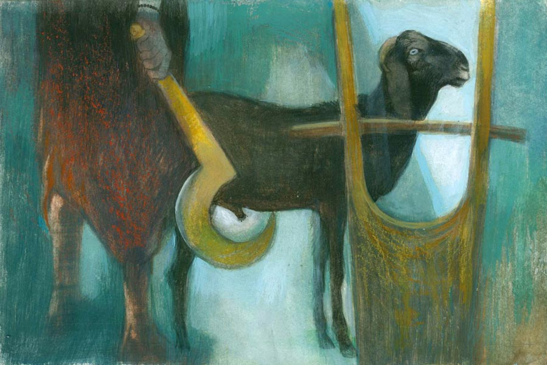

 
 <h1 align=center>সাদা কালো গল্প</h1>
<h2 align=center>বাসুদেব মালাকর</h2> পুরোহিত অভয় চক্কোত্তি এক দফা মন্তর-টন্তর পড়ে, ‘কালী কালী বিকটদংষ্ট্রা ভেদকারিণী খাদয় ছেদয় সর্বদুষ্টান্ খড়্গেন ছিন্ধি ছিন্ধি কীল কীল’ বলে খাঁড়ায় সিঁদুরের টিপ লাগিয়ে রেডি হলেন। একটু দূরে পেল্লাদ অপেক্ষা করছে। আর দু’-একটা ক্রিয়াকর্ম শেষ হলেই আমাকে স্নান করিয়ে, গায়ে-কপালে তেল-সিঁদুর মাখিয়ে হাঁড়িকাঠে গলাটা ঢুকিয়ে খিল আটকে দেবে। তার পর অভয় চক্কোত্তি ইশারা করলেই পেল্লাদ এক কোপে ধড় থেকে আমার মুন্ডু নামিয়ে দেবে! একটা খুঁটির সঙ্গে এক গোছা কাঁঠালপাতা ঝুলিয়ে দিয়েছে, তা থেকে দু’-একটা পাতা ছিঁড়ে ছিঁড়ে খাচ্ছি। আর তো কয়েকটা মিনিট, তার পরেই তো সব খাওয়ার বাইরে চলে যাব।

বসন্তমাস্টারের একমাত্র ছেলের বৌ পাঁচ বছরের বিবাহিত জীবনে এখনও গর্ভধারণ করতে পারেনি। হাজার ডাক্তার-বদ্যি, ঝাঁড়ফুক, তেলপড়া-জলপড়া, তাগা-তাবিজ করেও কাজ হয়নি।

বসন্ত আসলে স্কুলমাস্টার নয়, তবু তার নানাবিধ কেরামতি দেখে লোকে ‘মাস্টার’ বলে! মাস্টারের অবস্থা ভাল। মাঠে বিঘে কুড়ি জমি, দেড় বিঘের ওপর বসতবাড়ি, বাজারে একটা বই-খাতা-কাগজের দোকান। ছেলে বসে সেখানে। বিকেলবেলায় মাস্টারও বসে মাঝে মাঝে। এত বিষয়সম্পত্তির কী গতি হবে, যদি না বংশে একটা ছেলে জন্মায়! সব থেকে বড় কথা, এই গোঁসাই বংশই তো ধরাধাম থেকে বিলুপ্ত হয়ে যাবে। পূর্বপুরুষ ক্ষমা করবেন বসন্তকে? কেউ কেউ মাস্টারকে আবার ছেলের বিয়ে দেওয়ার পরামর্শ দিচ্ছে। বাজারের মতি পাগলা এক দিন বলেছিল, “মাস্টার, ছেলের আবার বিয়ে দিয়ে ঘেঁচু হবে! তোমার ছেলেরই পোকায় গোলমাল আছে, আমি জানি!”

বসন্তমাস্টার লাঠি নিয়ে তাকে তাড়া করে বাজারছাড়া করেছিল!

এ বার যতীন তান্ত্রিক বিধান দিয়েছে, দেবীর পুজো করে ছাগবলি দিলেই হাতে-হাতে ফল! শাস্ত্রে আছে, অজরুধিরে দেবী পঞ্চবিংশতিবর্ষ তৃপ্তিলাভ করেন! তবে, ছাগশিশুটি সম্পূর্ণ কৃষ্ণবর্ণ হতে হবে, দেহে কোথাও একটুও অন্য রং থাকলে হবে না। যতীন ভাল বুদ্ধি দিয়েছে! একটা প্রাণের আশায় আর একটা প্রাণ কেড়ে নিলেই ওদের দেবী খুশি হবে!

স্কুলে পাশ-ফেল নেই বলে পাড়ার মঙ্গল ওরফে মোঙলা এইট অবধি তরতর করে এগিয়েছিল। কিন্তু টেন-এ উঠতেই তার বয়স কুড়ি পেরিয়ে গেল। মা-বাপ দূর-দূর করে খেদিয়ে দিয়েও দু’বেলা দুটো খেতে দেয়। বাকিটা মোঙলা লোকের ফাইফরমাশ খেটে জুটিয়ে নেয়।

বসন্তমাস্টার মোঙলাকে হুকুম করলেন, “একদম কুচকুচে কালো দেখে একটা পাঁঠা জোগাড় করে আনবি। যা দাম চায়, ছাড়বি না। আপাতত পাঁচ হাজার টাকা নিয়ে যা। লাগলে আবার নিয়ে যাবি।”

তা মোঙলা দশ মাইল দূরে সেই শসাডাঙায় খুঁজে পেল আমাকে। তখন আমার বয়স এক বছর। মায়ের দুধ ছেড়ে ঘাস খাওয়া শিখেছি। মাঠেঘাটে ঘাসের অভাব নেই। আমার মালিক তখনও কী এক গূঢ় অভিসন্ধিতে আমাকে খাসি করেনি! গাঁ-গেরামে ঘরে একটা পাঁঠা থাকলে ভাল ডিভিডেন্ড ঘরে আসে। সরকার গরিবদের প্রচুর ব্ল্যাক বেঙ্গল ছাগল দিয়েছে। তাদের সার্ভিস দিতে পাঁঠার দরকার হয়। সার্ভিসপ্রতি হেসে খেলে দু’শো টাকা! আমার মালিক সেই তালে ছিল, কিন্তু আমার কপালে অপঘাতে মরণ লেখা আছে, নগদ সাড়ে চার হাজার লোভ ব্যাটা সামলাতে পারল না! পাঁচশো টাকা মোঙলা কমিশন রাখল। সাইকেলের রডে চটের বস্তায় ঝুলিয়ে নিয়ে এল আমাকে। না হলে আজ আমি রাজা-বাদশাদের মতো হারেমের মালিক হতাম! কিন্তু সবই কপাল।

অবশেষে সেই চরম সময় এসে পড়ল! আমাকে কলতলায় ফেলে আচ্ছা করে ধোলাই করছিল কয়েক জন। উৎসর্গের পাঁঠার গায়ে যেন কণামাত্র ময়লা না থাকে! চিৎ করে পেছনের দাবনা ফাঁক করতেই এক জন চেঁচিয়ে উঠল, “ঠাকুরমশাই, পাঁটা পুরো কালো নয়কো! পেটের নীচে একদলা সাদা লোম আছে! চলবে?”

অভয় চক্কোত্তি হাঁ হাঁ করে উঠল, “খুঁত থাকলে হবে না! বাতিল, বাতিল! শিগগির মাস্টারকে বল! বলির লগ্ন শেষ হতে দেরি নেই!”

মনে হল, আপাতত এ যাত্রায় বেঁচে গেলাম! সে যে কী আনন্দের মুহূর্ত, বলে বোঝাতে পারব না। জন্মের পরে এমন করে ভিজিনি কখনও, শীতে কাঁপছিলাম। শিরদাঁড়াটা বেঁকে ধনুক হয়ে যাচ্ছিল। এক জন হিড়হিড় করে টেনে নিয়ে খুঁটোয় বেঁধে রাখল।

এ দিকে বলির লগ্ন পেরিয়ে যায়-যায়। মোঙলাকে হাতের কাছে পেলে বসন্তমাস্টার তাকেই বলি দেবে! কিন্তু আমার গায়ে সাদা দাগ আবিষ্কৃত হওয়ামাত্রই সে বেপাত্তা! শেষে চক্কোত্তিই বিধান দিল, “আখ কিংবা চালকুমড়ো বলিও সিদ্ধ। তাতে দ্বাদশ বৎসর দেবী প্রসন্ন থাকবেন। তার ভিতরেই তোমার ছেলে কাজ হাসিল করে ফেলতে পারবে না?”

মোঙলা অ্যান্ড কোম্পানি তাল করেছিল, সুযোগমতো সরিয়ে আমায় কেটে খেয়ে নেবে! সেটা আর পারেনি। তার পরের রাতেই, চিবিয়ে চিবিয়ে গলার দড়ি কেটে একদম বেপাত্তা হয়ে গেলাম! বোকাপাঁঠা হলেও মরণের মুখে বুদ্ধি খুলে গিয়েছিল! এ বার ছুট ছুট! এই গ্রাম ছাড়িয়ে, এদের নজরের বাইরে চলে যেতে হবে। সারা রাত দৌড়ে দৌড়ে ভোর রাতে এক গ্রামে পৌঁছে দেখলাম, এক গেরস্থের উঠোনে বাঁশের খোঁয়াড়ের ভিতরে চারটে ছাগল— দুটো ধাড়ি, দুটো বাচ্চা—আটকানো রয়েছে। ভাবলাম, যাক, এরা যখন ছাগল পোষে, তখন নিশ্চয়ই আমাকে তাড়িয়ে দেবে না! সারা রাতের ক্লান্তিতে ঘুমে দু’চোখ ভেঙে আসছিল। খোঁয়াড়ের বাইরেই শুয়ে ঘুমিয়ে পড়লাম।

সকালে খোঁয়াড়ের ঝাঁপ খুলতে এসে এক মাঝবয়সি মহিলা আমাকে দেখে হাঁউমাউ করে উঠল, “এ কী! কোত্থেকে কাদের একটা পাঁটা চলে এল! আমাদের কালি-ফুলির তো ডাক ধরেনি! এই তো সবে বিয়োলো দুটোই! তবে কিসের গন্ধে এ মুখপোড়া হাজির হল!” মহিলার চিৎকার শুনে বুড়োমতো একটা লোক লুঙ্গির গিঁট আঁটতে আঁটতে বেরিয়ে এসে ধমক দিল, “আহ মাগি! চিক্কুর পাড়ছিস কেন? আগে দেখি, কার পাঁটা, কত বয়েস, কী বিত্তান্ত। নিজে হেঁটে এসে বাড়ি উঠেছে, ভালই তো! যদি কেউ খোঁজপত্তর না করে তো বাড়িতেই রেখে দেব। কালি-ফুলিকে বাদ দিয়ে অন্যদের ‘ডাক’ ধরালেও কিছু রোজগার হবে। শালা, পাঁটাওয়ালাদের কী রোয়াব! এক বার ঘাড়ে উঠলেই আড়াইশো টাকা! চিল্লিয়ে পাড়া মাথায় না করে ক’দিন লুকিয়ে রাখ।”

আমার এই মালকিন মানুষটি ভাল। কালো, মোটাসোটা। নাম জ্যোৎস্না। লোকে জোছনা বলে। সে ঘরের পিছনে কলাগাছের ঝোপের ভিতরে আমাকে বেঁধে রাখে। ভাতের ফেন, সবজির খোসা খেতে দেয়। চুপিচুপি বলে, “বেশি ব্যা-ব্যা করবি নে! লোকে যেন টের না পায়!”

মাসখানেক কেউ কোনও খোঁজ না-করতে এক দিন জোছনা আমাকে প্রকাশ্যে আনল। লোকে জিজ্ঞেস করে, “পাঁটা কবে কিনলে, জোছনা?”

জোছনা তাদের বলে, “আর বোলোনিকো। ছাগল ডাক ধরলে সেই মদনপুরে মুক্তোর বাড়ি যেতে হয়! সে মাগির কী খাঁই! একটু কী হল না হল, অমনি নগদ আড়াইশো টাকা!”

সবাই খুব খুশি, সবার বাড়িতেই ছাগল আছে। তারা বলে, “ভাল হয়েচে গা। আমাদেরগুলোও নিয়ে আসব। একটু কমসম নিয়ো বাপু!”

আমি ক্রমশ যুবক হয়ে উঠছি। সারা ক্ষণ শরীরের ভিতরে এক উচাটন ভাব। দুটোমাত্র শব্দ জানি— খুশি হলে ম্যা ম্যা, প্রাণে হিল্লোল জাগলে তখন বঁ বঁ বঁ! জোছনা আমার মনোভাব নির্ভুল বুঝতে পারে এখন। তবে আমার নিজস্ব একটা পছন্দ আছে। রুগ্ণ সিড়িঙ্গে শুঁটকো, পিঠের হাড় দেখা যায়, এমনগুলোকে সার্ভিস দিতে একটুও মন চায় না। মাসতিনেক আগে এক জনকে পেয়েছিলাম, নাম রূপালি। সাদা ঝকঝকে গায়ের রঙ, মালকিন খুব যত্ন করে, বোঝা গিয়েছিল। তার প্রেমে ডুবে আছি আজও। তার ধারেকাছে কেউ নেই। মন চায় না, তবু অন্যদের পরিষেবা দিতেই হয়। জোছনা-মা দুটো পয়সা পায় তাতে, আমার খাতির-যত্নটাও বাড়ে একটু। জোছনার বর আজকাল আমার জন্য চানা, ছোলার ভুসির বন্দোবস্ত করেছে। মাঝে মাঝে অবাক হয়ে ভাবি, মানুষের পেটে যাওয়া কপালের লিখন ছিল, তার বদলে আজ যত্নআত্তি পাচ্ছি, রাজা-বাদশাদের মতো হারেমের মালিক হয়েছি! সামান্য ক’টা সাদা লোম এমন অলৌকিক ব্যাপার সম্ভব করল!

জোছনা-মা আমাকে অন্য ভাবেও ভাড়া খাটায়! যারা বেশ বড়লোক, লেখাপড়া জানে, কিন্তু পুজোয় বলিদানও মানে, তারা পুজোর শেষে নিয়মরক্ষার জন্য বলির সময় আমার কপালে খাঁড়াটা ছুঁইয়ে চালকুমড়ো বলি দেয়। জোছনা-মা মোটা টাকা নিয়ে তার জন্য আমাকে ভাড়া দেয়! চাল-কলাটাও খেতে পাই।

পুজোর নিয়মকানুন আমার জানা হয়ে গিয়েছে, সেই সঙ্গে শুনে শুনে শাস্ত্রের কথাও বেশ জানি। দক্ষ প্রজাপতি তাঁর সাতাশ মেয়ের সঙ্গে চন্দ্রের বিয়ে দিয়েছিলেন! বেশ চলছিল, কিন্তু এক সময় ছাব্বিশ বোনকে পাত্তা না দিয়ে রোহিণীর দিকে ঢলে পড়ল চন্দ্র! বোনেরা বাপের কাছে নালিশ করল। প্রজাপতি রেগেমেগে চন্দ্রকে অভিশাপ দিলেন, ‘তোমার ক্ষয়রোগ হবে!’ পরে হাতে-পায়ে ধরতে অভিশাপে সামান্য বদল হল— মাসের পনেরো দিন ক্ষয় হবে, আবার পনেরো দিনে পূর্ণ হবে! কোলে একটি শশক নিয়ে থাকলে কষ্ট কম হবে! তাই চন্দ্রের এক নাম শশধর! তা, সেই নিদানমতো এখন ক্ষয়রোগীর কোলে শশকের বদলে খাটের নীচে বোকাপাঁঠা বেঁধে রাখলেও রোগ ভাল হবে, মশাইরা বলেছেন। মানুষ যে নিজের দরকারে কত সুলুক বানিয়েছে!

দইজুড়ির ভজন হালদারকে ক্ষয়রোগে ধরেছে। তার অবস্থা ভাল, অনেক জমিজমা আছে, বয়সও বেশি নয়, ষাটের কাছে-পিঠে। সুন্দরী বৌয়ের বয়সও পঞ্চাশের আশপাশে। তার খুব ঠ্যাকার, সব সময় মুখে ঠোঁটে রং মেখে সেজেগুজে পটের বিবিটি সেজে থাকে। মেমারিতে সিনেমা, নাটক দেখতে যায়, আয়নার সামনে দাঁড়িয়ে সিনেমার নায়িকাদের কায়দায় শাড়ি পাল্টে পাল্টে পরে ঘুরিয়ে-ফিরিয়ে নিজেকে দেখে।

ভজনের রোগ নিয়ে তার মাথাব্যথা নেই। বরং আপদ বিদেয় হলেই সে বাঁচে! ভজন হাড়-জিরজিরে শরীর নিয়ে বাইরের ঘরে খাটের উপরে পড়ে থাকে। বেশিদিন টিকবে বলে মনে হয় না। ভজনের মায়ের থেকে টাকা নিয়ে ওই ভজনের খাটের তলায় আমাকে থাকার ডিউটি দিল জোছনা-মা। ব্যবস্থা খারাপ নয়, পাকা মেঝে, মশাও তেমন নেই।

মাঝে মাঝে অনেক রাতে ভজনের বৌয়ের ঘরে এক জন আসত। মাথায় বাবরি চুলের মাঝখানে গোল টাক। দাড়ি আছে। চলনে-বলনে নাটুকে ভাবভঙ্গি। টুকটুক করে দরজায় দু’বার টোকা দিলেই দরজা খুলে যেত। ভজনের বৌ আমাকে খুব দুচ্ছাই করত। যেন, আমি আসাতেই ভজন সুস্থ হয়ে যাবে। আর, সুস্থ হলেই তার অসুবিধে। আমি কিন্তু বৌটাকে সাপোর্ট দিতাম। পড়ন্তযৌবনে বেচারি কী করবে! শরীরেরও একটা ধর্ম আছে। যৌবন ফুরোলেও ভিতরের লাভা তো ঠান্ডা হয় না! ও-ঘরে ভালবাসার সামান্য সাড়াশব্দ পেলেই আমি ফটফট করে কান নাড়াতাম বা টিনের বেড়ার গায়ে শিং দিয়ে গুঁতোতাম, যাতে ও-ঘরের কোনও পুলকধ্বনি ভজনের কানে না আসে! মরতে বসলেও পুরুষের মুঠি আলগা হয় না! ভোররাতে লোকটা চাদর মুড়ি দিয়ে চলে যেত।

এই ডিউটি দিতে গিয়ে জোছনা-মায়ের ব্যবসায় ভাটা পড়তে লাগল। কাস্টমার এসে ফিরে যায়। তখন আমাকে ভজনের ডিউটি থেকে ছাড়িয়ে এনে পুরনো ডিউটিতে বহাল করা হল। কিন্তু একটা সমস্যা হল। এক দিন খিদের জ্বালায় খুব ম্যা-ম্যা করছিলাম বলে বিরক্ত হয়ে ভজনের বৌ একটা কাঠের পিঁড়ি ছুড়ে মেরেছিল। সেটা লেগেছিল পিছনের ডান পায়ে। দু’দিন খুঁড়িয়ে হাঁটলাম, কিন্তু ব্যথাটা রয়ে গেল। আমার মুখে তো ভাষা নেই যে মাকে সব বলব।

ডিউটিতে খামতি হচ্ছিল, কাস্টমার খুশি হচ্ছিল না। আসলে পিছনের পায়ে তো জোর পাই না যে, কমপ্লিট সার্ভিস দেব! মা আমার অবস্থা দেখে বিরক্ত হচ্ছিল। কিছু দিতে না পারলে কোনও ভালবাসাই বেশি দিন টেকে না। আমারও বয়স হচ্ছিল। আমরা তো মানুষ নই যে সত্তর-আশি বছর সক্ষম থাকব! আমাদের আয়ু বড়জোর বারো থেকে পনেরো বছর।

জোছনা এক দিন গলার দড়ি খুলে দিয়ে বলল, “যা, এ বার ইচ্ছেমতো চরে খা! আমি আর তোকে টানতে পারব না।”

আবার আমার অনিকেত জীবন শুরু হল। ঘুরতে ঘুরতে এক দিন মাঠে সলতেমাসির সঙ্গে দেখা। মাঠে ঘুঁটের গোবর কুড়োতে এসেছিল। মাসির কেউ নেই। একা একাই সারাটা জীবন কেটে গেল। তার উপরে, জন্ম থেকেই বাঁ-হাতের কব্জি থেকে বাকিটুকু নেই। কিন্তু কব্জিতে খুদে খুদে মটরদানার মতো পাঁচটা আঙুল আছে। মাসির ভাল নাম সুললিতা!

মাসিই বলল, “আমার সঙ্গে চল। সারা দিন একটা কথা বলার লোক নেই। মাঠে অঢেল ঘাস— খেতেও দিতে হবে না। চল।”

সেই থেকে মাসির কাছে। যেটুকু পারি এখনও, তাতেও মাসির কিছু আয় হয়। আমার গায়ে ক’টা সাদা লোম থাকাতে অপঘাতে মরণ হল না। মাসিরও একটা হাতের কব্জি না থাকাতে সংসার জুটল না! মানুষের জগৎটা একটা হেবি মজার ভুলভুলাইয়া!

এক দিন দুপুরে মাঠে ঘাস খেয়ে রাস্তার পাশে বাবলাতলায় শুয়ে ছিলাম। তখন দেখলাম, এক জন খুব বুড়োমানুষ সাইকেল থেকে নেমে ছায়ায় দাঁড়াল। মাথা থেকে গামছাটা খুলতে চিনতে পারলাম, বসন্তমাস্টার! আমাকে চিনতে পারেনি, পারার কথা নয়। জিজ্ঞেস করলাম, “নাতিপুতি কিছু হয়েছে?”

মাস্টার নিরুত্তর। বললাম, “মাস্টার, বংশ থাকলেই বা কী, না-থাকলেই বা কী! সারা দেশ জুড়ে আমার অগুনতি ছেলেমেয়ে—বংশরক্ষে কি হল তাতে? সব তো মানুষের পেটে গেল!”

মাস্টার আমার কথা বুঝতে পারল না। ছাগল হলে বুঝত। বসন্তবাতাসে কয়েকটা বাবলাফুল ঝরে পড়ল আমাদের উপরে। আমার কালো শরীরে ও মাস্টারের সাদা চুলে সেই হলুদরঙা ফুল যেন দিন-ফুরোনোর আলো!