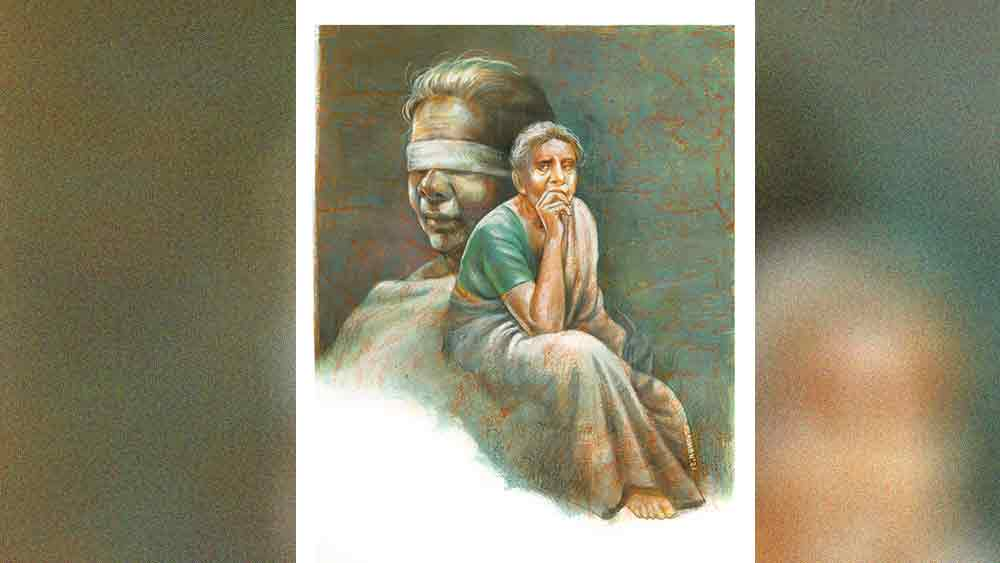

 

<h1 align=center> সাধিকা</h1>
<h2 align=center>স্বাতী চক্রবর্তী</h2>
ভ   োর থেকেই ব্যস্ততা শুরু হয় পার্বতীর। ফুল তোলে সেই পাঁচটায় উঠে। নইলে যে ফুলচোরগুলো সব ফুল চুরি করে নেয়! পার্বতী ভাবে, কেমন মানুষ এরা! অন্যের বাড়ি থেকে পুজোর ফুল চুরি করে নিতে এদের বিবেকে বাধে না? পার্বতী ফুল তুলে রেখে আসে ঠাকুরঘরে। তার পর পরিষ্কার হয়ে শুদ্ধ বস্ত্রে ঠাকুর ঘরের কাজে হাত লাগায়। দিদির বাড়ি, দিদির ঠাকুর। কিন্তু তাতে কী-ই বা আসে যায়? ঠাকুরের কী আপন-পর হয়? দিদি তো এখন আর কিছুই পারে না। ছেলেপুলে নেই। মাস ছয়েক আগে পার্বতীর জামাইবাবু খুব অসুস্থ হল। তখন কে দেখাশোনা করবে?   খবর পেয়ে ছুটে এসেছিল পার্বতী। জামাইবাবুর বাড়াবাড়ি হতে তাকে হাসপাতালে পাঠানো হল। জামাইবাবুর ভাইপোরা চাইছিল বেসরকারি হাসপাতালে দিতে। কিন্তু পার্বতী দিদিকে বুঝিয়েছিল, সরকারি হাসপাতালে কত ভাল ভাল সব ডাক্তার থাকে। তা ছাড়া টাকাপয়সাও প্রায় লাগে না বললেই চলে। জামাইবাবুর পেনশন নেই। জমানো টাকার বেশির ভাগই দিদির। দিদি তো সরকারি ইস্কুলে পড়াত। প্রাইমারি হলেও যা পেনশন পায়, তা দিয়েই দু’জন মানুষের সংসার চলে যেত। কিন্তু প্রাইভেট হাসপাতালে চিকিৎসা করাতে অনেক খরচ। সর্বস্ব শেষ করলে দিদির চলবে কেমন করে? দিদি বিষয়টা বুঝেছিল ভাগ্যিস!   সপ্তাহ দুই পরে জামাইবাবু ইহলোক ত্যাগ করলেন। জামাইবাবুর ভাইপোরা তত দিনে বিমুখ হয়েছে। কোনও রকমে শ্রাদ্ধের দিন এসে নিয়মরক্ষা করে গেল। কিন্তু পার্বতীর তো আর দিদিকে একলা ফেলে আশ্রমে ফিরে যাওয়া হল না। মায়ের পেটের বোন। আত্মীয় প্রতিবেশী সবাই তাকে বলল দিদির বাড়িতে থাকতে। তার নিজের অবশ্য পিছুটান নেই। বিয়ে-থা করেনি। ইদানীং আশ্রমের দুই নতুন মহিলার সঙ্গে একটু মনোমালিন্য চলছিল। এই পঁচাত্তর বছর বয়সে আর এ সব পোষায় না। তাই সব দিক ভেবে আশ্রমের পাট চুকিয়ে দিদির কাছে চলে এসেছে পার্বতী। জীবসেবাই যে শিবসেবা— এত বছর তাই তো জেনেছে। অসুস্থ শয্যাশায়ী দিদি। চোখে ভাল দেখতেও পায় না। এ বার সে সেবার সত্যিকারের সুযোগটুকু পেল। ভগবান বোধহয় এই সেবাকাজটুকু তাকে দিয়ে করাবেন বলে নির্দিষ্ট করে রেখেছিলেন।   সকাল থেকে জপতপ পুজো সারতে পার্বতীর বেলা গড়িয়ে ন’টা বাজে। আজ পুজো করতে করতেই কাজের হিসেব করতে লাগল সে। অনেকগুলো কাজ। জলখাবার খেয়েই বেরোতে হবে। দিদির বাড়ির রান্নার লোকটা মোটেই ভাল রাঁধে না। তবু বাধ্য হয়ে তা-ই গিলতে হয় পার্বতীকে। দিদি-জামাইবাবুর বহু দিনের লোক এই রেণুকা। তবে পার্বতী ঠিক ওর চুরি ধরে ফেলেছে। সঙ্গে একটা থলে আনে। আলু-পটল-পেঁয়াজ টুক করে ভরে নেয়। এখনও ওকে কিছু বলেনি পার্বতী। শুধু দিদির কানে টুক করে কথাটা তুলে দেখেছে, দিদি তো বিশ্বাস করতেই চায় না! এ বার হাতে-নাতে ধরবে আর তাড়াবে— ঠিক করেই রেখেছে সে। বুড়ো অসহায় মানুষ পেয়ে কেউ ঠকিয়ে যাবে, তা সহ্য করবে না পার্বতী। ঠাকুরঘর থেকে বেরিয়ে হাত ধুয়ে নিল। পার্বতী নিরামিষ খায় আজ বহু বছর। পেঁয়াজ-রসুন পর্যন্ত মুখে তোলে না।   দিদি অবশ্য বিধবা হলেও মাছ খায়। দিদি পার্বতীকে রোজ বলে মাছ খাওয়ার কথা। খেতেই পারত এখানে এসে। কিন্তু মন থেকে ইচ্ছেটাই চলে গেছে। জলখাবারের রুটি আর কুমড়োর তরকারি চটপট খেয়ে নিয়ে রেণুকাকে এক কাপ চা করতে বলে নিজের ঘরে কাপড় পরতে ঢুকে গেল। শাড়ি বাছতে গিয়ে দিদির একটা একটু পুরনো ভাঁজ-খোলা শাড়ি টেনে নিল। এ বার ব্যাগটা গুছিয়ে নিতে হবে। ডাক্তারের সার্টিফিকেটটা ভুললে চলবে না। আর সঙ্গে শিশিটা। গত কয়েক দিন ধরে দুটো নারকেল ভেঙে তার ফালি বার করে সরু সরু করে কেটেছে। কাল সেগুলো ঘিয়ে ভেজে চিনির রসে ফেলে তার পর শুকনো করে রেখেছে। আজ একটা পরিষ্কার কাচের শিশিতে সেটা ভরে নিয়ে যাবে তাপসবাবুর জন্যে। ওঁর ঘরে সব সময় লোকের আনাগোনা। তা হোক। তার মধ্যেই মিনিক দশেক সময় ঠিক বের করে নেবে। একটা বিষয় পার্বতী খেয়াল করে দেখেছে, তার পঁচাত্তর বছরের ভাঙাচোরা চেহারা দেখলে অধিকাংশ ভদ্রলোক বেশ একটু সহানুভূতি দেখায়। হবেই তো, সিনিয়র সিটিজ়েনের একটা সম্মান আছে শিক্ষিত সমাজে।   শুভ কাজে গেলে সারদা মায়ের ছবিতে প্রণাম করা পার্বতীর দীর্ঘ দিনের অভ্যেস। দিদি এখনও ঘুমোচ্ছে। রেণুকা ডাকতে যাচ্ছিল, বারণ করল সে।   “আমি এসে ডেকে তুলব। শরীরটা খারাপ। ঘুমোচ্ছে ঘুমোক।”   গরম চা প্লেটে ঢেলে খেতে খেতে বলল পার্বতী। দিদি আজকাল তার ওপর খুব ভরসা করে। কেউ নেই বলেই বোধ হয় পার্বতীকে শেষ জীবনে আঁকড়ে ধরেছে কল্যাণী। আগে এত নরম ছিল না। দিদিমণিসুলভ চড়া গলা, কড়া মেজাজ নিয়ে চলত। তখন পার্বতীকে রীতিমতো শাসন করত কল্যাণী। কত বার কত প্রয়োজনে হাত পেতেছে এই দিদির কাছে। দিদি দিয়েছে, আবার দু’-চার কথা শুনিয়েও দিয়েছে দরকার মতো। এখন আর সেই কল্যাণী নেই। চোখের দৃষ্টি গেছে। তার পর এক দিন বাড়ির মধ্যেই পড়ে গিয়ে কোমরের হাড় ভাঙল। সেই থেকেই অচল, অসহায়। স্বভাবও বদলে গেছে। এখন তো সম্পূর্ণ অন্য মানুষ। শিশুর মতো। দ্রুত হাতে জরুরি সব জিনিস গুছিয়ে বেরিয়ে পড়ল পার্বতী।   ব্যাঙ্কে পৌঁছে মনটা খুশি হল। আজ লোকজন কম, বেশ ফাঁকা ফাঁকা। ম্যানেজার তাপসবাবুর ঘরেও কোনও লোক ঢুকে বসে নেই। পার্বতী চট করে দরজাটা টেনে ঢুকে পড়ল। তাপস ঘোষাল মাঝবয়সি, স্বভাবে অমায়িক ধরনের। পার্বতী ওঁর কাছে আগে বেশ ক’দিন এসে আলাপ পরিচয় করে গেছে। এই মহিলাকে দেখলে শ্রদ্ধা জাগে তাপসের মনে। নিজের মায়ের কথা মনে হয়। এই বৃদ্ধ বয়সে পার্বতী আবার নিজের অসুস্থ অসহায় দিদির দেখাশোনার দায়িত্ব নিয়েছেন— তাপস মন থেকে সব রকম সাহায্য করতে চায় ওঁকে।   “আসুন মাসিমা, বসুন।”   “আজ আমি আপনার জন্যে নিজের হাতে একটা বিশেষ খাবার তৈরি করে এনেছি।”   “কী এটা?”   “কী বলুন তো?”   “খাইনি কখনও মনে হচ্ছে।”   “এটা নারকেল দিয়ে তৈরি করা।”   “কোথায় নারকেল? এ তো চিঁড়ের মতো দেখতে।”   “নারকেল পাতলা করে কেটে কেটে চিঁড়ের মতো ছোট ছোট 
টুকরো করেছি।”   অবাক হয়ে যায় তাপস, “এত সরু করে কেটেছেন?”   পার্বতী হেসে বলে, “হ্যাঁ। খুব যত্ন লাগে এটা করতে। আপনার ভাল লাগলেই আমার আনন্দ।”   তাপস মনে মনে ভাবে, উনি জানলেন কী করে যে তাপস মিষ্টি খাবার, বিশেষ করে নারকেলের জিনিস পছন্দ করে? আসলে মায়েরা সব বোঝে।   এ বার ব্যাগ থেকে প্রথমে ডাক্তারের লেখা কাগজটা বার করল পার্বতী। এই কাগজটা, মানে এই ডাক্তারের সার্টিফিকেটটা লেখাতেও কম হাঁটতে হয়নি তাকে। ডাক্তারকে দিদির শরীরের অবস্থা, চোখের সমস্যা সব বলতে বলতে কেঁদেই ফেলেছিল পার্বতী। অবশেষে বুঝেছেন ডাক্তার। গত সোমবার সার্টিফিকেটটা যখন আনতে গেল, তখন ডাক্তারবাবুর জন্য নারকেল নাড়ু বানিয়ে নিয়ে দিয়ে এসেছে। দিদির বাড়ির নারকেল গাছে কত নারকেল। ডাক্তারও বেশ খুশি হয়েছিলেন। মুখে বলেননি, কিন্তু মুখ দেখেই বুঝেছিল পার্বতী। বেশ গুছিয়ে কল্যাণীর শরীরের সব রকম সমস্যার কথা বিশদে লিখে সই করে স্ট্যাম্প মেরে দিয়েছিলেন।   ডাক্তারের লেখাটা পড়ে তাপসবাবু বললেন, “তা হলে কী করতে চান আপনি?”   পার্বতীর দু’চোখে জল, “দিদি আর কিছুই লিখতে পড়তে পারে না। এত দিন জামাইবাবু ছিলেন জয়েন্ট নামে। আমার নাম যদি ব্যাঙ্কের কাগজে না থাকে, দিদির চিকিৎসা, সংসার খরচ চালাব কী করে বলুন তো? আমার তো দীর্ঘ দিন সাধিকার জীবন, সম্বল বলতে কিছুই নেই।”   “কিন্তু আপনার দিদি না লিখে দিলে আপনার নাম অ্যাকাউন্টে ঢোকাব কী করে?”   দ্বিতীয় কাগজটা বার করল পার্বতী, “এই যে, দিদি টিপসই করে দিয়েছে। কী লিখতে হবে সেটা আপনি যদি একটু লিখে দেন।”   তাপস জানে, ইংরেজিতে লিখতে পারবেন না পার্বতী। তার মা-ই কি পারে! কাগজটা নিজের কাছে টেনে নিয়ে কম্পিউটারে অ্যাকাউন্ট নম্বর টাইপ করে কোথায় কল্যাণীর কী টাকা আছে দেখে কাগজে লেখা শুরু করল তাপস।      পার্বতী চেয়ারে বসে হাতের আঙুলে দিদির আঁচড়ের দাগটা দেখছিল। কাল রাতে যখন জোর করে সাদা কাগজে আর বাড়ির উইলে দিদির টিপসই দিতে আঙুলটা চেপে ধরেছিল, তখন দিদি কিছুতেই সই দিতে চায়নি। বার বার বলছিল, “রাজুকে ডাক। ওকে সব দেব। ও নেই, এখন কেন সই করব?”   মনে মনে হাসি পাচ্ছিল তখন পার্বতীর। রাজু তাদের বড়দার ছেলে। কিছুটা দূরেই বাড়ি। বড়দা আর নেই। মা-ছেলের সংসার তাদের। একখানা ঘর ভাড়া দিয়ে কোনও মতে চলে। রাজু বেকার। আর বেকার হলে যা হয়! পিসি-পিসেমশাইয়ের দরকার হলেই এত বছর রাজুর ডাক পড়েছে। সবাই ধরেই নিয়েছিল নিঃসন্তান কল্যাণীর বাড়ি-টাকা সব রাজুই পাবে। কল্যাণী নিজেও সবাইকে তেমন আভাসই দিয়ে রেখেছিল। পার্বতী এই নিয়ে ভেবে ভেবে ক’দিন অস্থির হয়ে উঠেছিল। তার পর গত মাসে এক দিন সন্ধেবেলা পাড়ার ক্লাবে ঢুকে হাঁপাতে লাগল।   “কী হয়েছে মাসিমা?”   “কী বলব ঘরের কথা! বড় বিপদ বাবা আমাদের!” চোখে জল, গলার স্বরে কান্না পার্বতীর।   “আমরা থাকতে কোনও চিন্তা করবেন না। কী হয়েছে আমাদের বলুন, মাসিমা।”   “আমাদের দাদার ছেলে রাজু আমাদের মেরে ফেলতে চায়। ও জোর করে সব টাকাপয়সা বাড়ি লিখিয়ে নিতে এসেছিল। দিদি তো দেবে না বলেছে। শাসিয়ে গেছে, বন্ধুদের নিয়ে এসে বাড়ির দখল নেবে।”   “এ পাড়ায় বেপাড়ার ছেলেরা এসে গুন্ডামি করবে? এত সাহস? আমরা আছি কী করতে?”   “তাই তো এলাম। আমরা, মানে আমার দিদি চাইছে বাড়িটা বিক্রি করে অন্য কোথাও চলে যেতে।”   ক্লাবের ছেলেরা খুবই বুদ্ধিমান বোঝা গেল। তারা মুহূর্তে কথাটা লুফে নিল। চকচক করে উঠল কতগুলো চোখ, “বাড়িটা বিক্রি করবেন? ঠিক আছে। সব দায়িত্ব আমাদের ওপর ছেড়ে দিন। এক মাসের মধ্যে সব সেটল করে দেব।”   “আর রাজু?”   “কাল যাচ্ছি ওর বাড়ি। আর যদি শালা এ দিকে আসে ঠ্যাং ভেঙে দেব। আপনি কিচ্ছু ভাববেন না মাসিমা।”   “কাল এসে বাগানের ক’টা নারকেল নিয়ে যেয়ো, বাবারা।”   পরদিন থেকে দিদিকে দু’বেলা ঘুমের ওষুধ দেওয়া শুরু করেছে পার্বতী। যে যখনই আসে দেখে কল্যাণী ঘুমোচ্ছে। আজকাল অবশ্য আর কেউ বিশেষ আসার নেই।   কাল রাতে পার্বতী জোর করে কেন যে সইটা করাতে গেছিল! আঁচড়ের দাগটা নিজের বোকামির প্রমাণ হয়ে জ্বালা ধরাচ্ছে পার্বতীর মনে। শেষে অবশ্য বুদ্ধি খুলে গেল। জলে মিশিয়ে দশটা ঘুমের ট্যাবলেট খাইয়ে শান্ত করল দিদিকে। বলেছিল, “ঠিক আছে, রাজু এলেই সই কোরো। এখন শান্ত হয়ে জল খেয়ে ঘুমোও। তুমি আমাকেও বিশ্বাস করো না?”   “দে, জল খাই।”   সেই ঘুমিয়ে পড়েছে। তার পর তো কাজ সহজ। আঙুলটা ধরে কালি লাগিয়ে টিপছাপ। পার্বতী ভাবছিল, ভাগ্যিস দিদি চোখে দেখে না। ঘুমিয়ে টিপসই দেওয়া যায়, সই তো করা যেত না।      “এই নিন মাসিমা, এখানে আপনি সই ক‍রুন। আরও কয়েকটা সই লাগবে আপনার‌। আপনি এখানেই বসুন, আমি করিয়ে নিচ্ছি,” তাপসবাবুর কথায় মনটা ফিরে এল।   “অনেক ধন্যবাদ আপনাকে। দেরি হবে কি? আসলে দিদিকে বাড়িতে একা রেখে এসেছি তো। তাই চিন্তা হচ্ছে।”   “না, না। চটপট করিয়ে ছেড়ে দিচ্ছি আপনাকে। সাত দিন পরে আপনার নাম লেখা নতুন পাশবই চেকবই সব পেয়ে যাবেন।”   ব্যাঙ্ক থেকে বেরিয়ে পড়ল পার্বতী। এখন বিস্তর কাজ। যে উকিল উইল লিখে দিয়েছে তার কাছে আজই এক বার যেতে হবে। টিপসইটা নিয়ে দেখাতে হবে। পাকাপোক্ত কাজ চাই। না হলে বাড়িটা বিক্রি করবে কী করে?   একটা সরকারি হোমের খোঁজ পেয়েছে কল্যাণীর জন্যে। টাকা বিশেষ লাগবে না। আলাদা ঘর নিলে হাজার তিনেকেই হয়ে যাবে। আর এক জন আয়া দেবে ওরা। তার জন্যে পাঁচ হাজার। সে দিদির পেনশনের টাকা থেকে ওটা দিয়ে দেবে। ওরা অবশ্য প্রস্তাব দিয়েছিল পার্বতীকে, “আপনিও এখানে এসে থাকুন না, দিদির সঙ্গে।”   পার্বতী হেসে বলেছে, “দেখছি।”   মুখের ওপর না বলা কি যায়? তবে মনে মনে জানে, ও দিদির পাশে দিদির আয়া হয়ে জীবন কাটানোর জন্যে জন্ম নেয়নি।   আজ এক বার ক্লাবে গিয়ে কথা বলবে সে। মালিক যে ও নিজে, দিদি যে স্বেচ্ছায় বাড়িটা তাকে দান করেছে, এটা হালকা করে ছেলেগুলোকে বলে আসতে হবে। ওর যে তাড়া আছে, সেটাও পরিষ্কার করে বুঝিয়ে বলে দেবে পার্বতী। কিন্তু চোখ দিয়ে জল যেন গড়ায় সেটা খেয়াল রাখতে হবে— ‘একা তো এই বয়েসে আর পেরে উঠছি না। একটু তাড়াতাড়ি বাড়ি বিক্রির ব্যবস্থা কোরো।’ কান্নাভেজা গলায় বলতে হবে কথাটা।   আজ দিদির কখন ঘুম ভাঙবে কে জানে! আজ রাতের মধ্যেই কাজ যতটা পারে এগিয়ে রাখবে পার্বতী। সকালে সময় কোথায়? সেই ভোর থেকেই ঠাকুর পুজোর কাজ শুরু করতে হবে।      ছবি: সৌমেন দাস   ভ   োর থেকেই ব্যস্ততা শুরু হয় পার্বতীর। ফুল তোলে সেই পাঁচটায় উঠে। নইলে যে ফুলচোরগুলো সব ফুল চুরি করে নেয়! পার্বতী ভাবে, কেমন মানুষ এরা! অন্যের বাড়ি থেকে পুজোর ফুল চুরি করে নিতে এদের বিবেকে বাধে না? পার্বতী ফুল তুলে রেখে আসে ঠাকুরঘরে। তার পর পরিষ্কার হয়ে শুদ্ধ বস্ত্রে ঠাকুর ঘরের কাজে হাত লাগায়। দিদির বাড়ি, দিদির ঠাকুর। কিন্তু তাতে কী-ই বা আসে যায়? ঠাকুরের কী আপন-পর হয়? দিদি তো এখন আর কিছুই পারে না। ছেলেপুলে নেই। মাস ছয়েক আগে পার্বতীর জামাইবাবু খুব অসুস্থ হল। তখন কে দেখাশোনা করবে?   খবর পেয়ে ছুটে এসেছিল পার্বতী। জামাইবাবুর বাড়াবাড়ি হতে তাকে হাসপাতালে পাঠানো হল। জামাইবাবুর ভাইপোরা চাইছিল বেসরকারি হাসপাতালে দিতে। কিন্তু পার্বতী দিদিকে বুঝিয়েছিল, সরকারি হাসপাতালে কত ভাল ভাল সব ডাক্তার থাকে। তা ছাড়া টাকাপয়সাও প্রায় লাগে না বললেই চলে। জামাইবাবুর পেনশন নেই। জমানো টাকার বেশির ভাগই দিদির। দিদি তো সরকারি ইস্কুলে পড়াত। প্রাইমারি হলেও যা পেনশন পায়, তা দিয়েই দু’জন মানুষের সংসার চলে যেত। কিন্তু প্রাইভেট হাসপাতালে চিকিৎসা করাতে অনেক খরচ। সর্বস্ব শেষ করলে দিদির চলবে কেমন করে? দিদি বিষয়টা বুঝেছিল ভাগ্যিস!   সপ্তাহ দুই পরে জামাইবাবু ইহলোক ত্যাগ করলেন। জামাইবাবুর ভাইপোরা তত দিনে বিমুখ হয়েছে। কোনও রকমে শ্রাদ্ধের দিন এসে নিয়মরক্ষা করে গেল। কিন্তু পার্বতীর তো আর দিদিকে একলা ফেলে আশ্রমে ফিরে যাওয়া হল না। মায়ের পেটের বোন। আত্মীয় প্রতিবেশী সবাই তাকে বলল দিদির বাড়িতে থাকতে। তার নিজের অবশ্য পিছুটান নেই। বিয়ে-থা করেনি। ইদানীং আশ্রমের দুই নতুন মহিলার সঙ্গে একটু মনোমালিন্য চলছিল। এই পঁচাত্তর বছর বয়সে আর এ সব পোষায় না। তাই সব দিক ভেবে আশ্রমের পাট চুকিয়ে দিদির কাছে চলে এসেছে পার্বতী। জীবসেবাই যে শিবসেবা— এত বছর তাই তো জেনেছে। অসুস্থ শয্যাশায়ী দিদি। চোখে ভাল দেখতেও পায় না। এ বার সে সেবার সত্যিকারের সুযোগটুকু পেল। ভগবান বোধহয় এই সেবাকাজটুকু তাকে দিয়ে করাবেন বলে নির্দিষ্ট করে রেখেছিলেন।   সকাল থেকে জপতপ পুজো সারতে পার্বতীর বেলা গড়িয়ে ন’টা বাজে। আজ পুজো করতে করতেই কাজের হিসেব করতে লাগল সে। অনেকগুলো কাজ। জলখাবার খেয়েই বেরোতে হবে। দিদির বাড়ির রান্নার লোকটা মোটেই ভাল রাঁধে না। তবু বাধ্য হয়ে তা-ই গিলতে হয় পার্বতীকে। দিদি-জামাইবাবুর বহু দিনের লোক এই রেণুকা। তবে পার্বতী ঠিক ওর চুরি ধরে ফেলেছে। সঙ্গে একটা থলে আনে। আলু-পটল-পেঁয়াজ টুক করে ভরে নেয়। এখনও ওকে কিছু বলেনি পার্বতী। শুধু দিদির কানে টুক করে কথাটা তুলে দেখেছে, দিদি তো বিশ্বাস করতেই চায় না! এ বার হাতে-নাতে ধরবে আর তাড়াবে— ঠিক করেই রেখেছে সে। বুড়ো অসহায় মানুষ পেয়ে কেউ ঠকিয়ে যাবে, তা সহ্য করবে না পার্বতী। ঠাকুরঘর থেকে বেরিয়ে হাত ধুয়ে নিল। পার্বতী নিরামিষ খায় আজ বহু বছর। পেঁয়াজ-রসুন পর্যন্ত মুখে তোলে না।   দিদি অবশ্য বিধবা হলেও মাছ খায়। দিদি পার্বতীকে রোজ বলে মাছ খাওয়ার কথা। খেতেই পারত এখানে এসে। কিন্তু মন থেকে ইচ্ছেটাই চলে গেছে। জলখাবারের রুটি আর কুমড়োর তরকারি চটপট খেয়ে নিয়ে রেণুকাকে এক কাপ চা করতে বলে নিজের ঘরে কাপড় পরতে ঢুকে গেল। শাড়ি বাছতে গিয়ে দিদির একটা একটু পুরনো ভাঁজ-খোলা শাড়ি টেনে নিল। এ বার ব্যাগটা গুছিয়ে নিতে হবে। ডাক্তারের সার্টিফিকেটটা ভুললে চলবে না। আর সঙ্গে শিশিটা। গত কয়েক দিন ধরে দুটো নারকেল ভেঙে তার ফালি বার করে সরু সরু করে কেটেছে। কাল সেগুলো ঘিয়ে ভেজে চিনির রসে ফেলে তার পর শুকনো করে রেখেছে। আজ একটা পরিষ্কার কাচের শিশিতে সেটা ভরে নিয়ে যাবে তাপসবাবুর জন্যে। ওঁর ঘরে সব সময় লোকের আনাগোনা। তা হোক। তার মধ্যেই মিনিক দশেক সময় ঠিক বের করে নেবে। একটা বিষয় পার্বতী খেয়াল করে দেখেছে, তার পঁচাত্তর বছরের ভাঙাচোরা চেহারা দেখলে অধিকাংশ ভদ্রলোক বেশ একটু সহানুভূতি দেখায়। হবেই তো, সিনিয়র সিটিজ়েনের একটা সম্মান আছে শিক্ষিত সমাজে।   শুভ কাজে গেলে সারদা মায়ের ছবিতে প্রণাম করা পার্বতীর দীর্ঘ দিনের অভ্যেস। দিদি এখনও ঘুমোচ্ছে। রেণুকা ডাকতে যাচ্ছিল, বারণ করল সে।   “আমি এসে ডেকে তুলব। শরীরটা খারাপ। ঘুমোচ্ছে ঘুমোক।”   গরম চা প্লেটে ঢেলে খেতে খেতে বলল পার্বতী। দিদি আজকাল তার ওপর খুব ভরসা করে। কেউ নেই বলেই বোধ হয় পার্বতীকে শেষ জীবনে আঁকড়ে ধরেছে কল্যাণী। আগে এত নরম ছিল না। দিদিমণিসুলভ চড়া গলা, কড়া মেজাজ নিয়ে চলত। তখন পার্বতীকে রীতিমতো শাসন করত কল্যাণী। কত বার কত প্রয়োজনে হাত পেতেছে এই দিদির কাছে। দিদি দিয়েছে, আবার দু’-চার কথা শুনিয়েও দিয়েছে দরকার মতো। এখন আর সেই কল্যাণী নেই। চোখের দৃষ্টি গেছে। তার পর এক দিন বাড়ির মধ্যেই পড়ে গিয়ে কোমরের হাড় ভাঙল। সেই থেকেই অচল, অসহায়। স্বভাবও বদলে গেছে। এখন তো সম্পূর্ণ অন্য মানুষ। শিশুর মতো। দ্রুত হাতে জরুরি সব জিনিস গুছিয়ে বেরিয়ে পড়ল পার্বতী।   ব্যাঙ্কে পৌঁছে মনটা খুশি হল। আজ লোকজন কম, বেশ ফাঁকা ফাঁকা। ম্যানেজার তাপসবাবুর ঘরেও কোনও লোক ঢুকে বসে নেই। পার্বতী চট করে দরজাটা টেনে ঢুকে পড়ল। তাপস ঘোষাল মাঝবয়সি, স্বভাবে অমায়িক ধরনের। পার্বতী ওঁর কাছে আগে বেশ ক’দিন এসে আলাপ পরিচয় করে গেছে। এই মহিলাকে দেখলে শ্রদ্ধা জাগে তাপসের মনে। নিজের মায়ের কথা মনে হয়। এই বৃদ্ধ বয়সে পার্বতী আবার নিজের অসুস্থ অসহায় দিদির দেখাশোনার দায়িত্ব নিয়েছেন— তাপস মন থেকে সব রকম সাহায্য করতে চায় ওঁকে।   “আসুন মাসিমা, বসুন।”   “আজ আমি আপনার জন্যে নিজের হাতে একটা বিশেষ খাবার তৈরি করে এনেছি।”   “কী এটা?”   “কী বলুন তো?”   “খাইনি কখনও মনে হচ্ছে।”   “এটা নারকেল দিয়ে তৈরি করা।”   “কোথায় নারকেল? এ তো চিঁড়ের মতো দেখতে।”   “নারকেল পাতলা করে কেটে কেটে চিঁড়ের মতো ছোট ছোট 
টুকরো করেছি।”   অবাক হয়ে যায় তাপস, “এত সরু করে কেটেছেন?”   পার্বতী হেসে বলে, “হ্যাঁ। খুব যত্ন লাগে এটা করতে। আপনার ভাল লাগলেই আমার আনন্দ।”   তাপস মনে মনে ভাবে, উনি জানলেন কী করে যে তাপস মিষ্টি খাবার, বিশেষ করে নারকেলের জিনিস পছন্দ করে? আসলে মায়েরা সব বোঝে।   এ বার ব্যাগ থেকে প্রথমে ডাক্তারের লেখা কাগজটা বার করল পার্বতী। এই কাগজটা, মানে এই ডাক্তারের সার্টিফিকেটটা লেখাতেও কম হাঁটতে হয়নি তাকে। ডাক্তারকে দিদির শরীরের অবস্থা, চোখের সমস্যা সব বলতে বলতে কেঁদেই ফেলেছিল পার্বতী। অবশেষে বুঝেছেন ডাক্তার। গত সোমবার সার্টিফিকেটটা যখন আনতে গেল, তখন ডাক্তারবাবুর জন্য নারকেল নাড়ু বানিয়ে নিয়ে দিয়ে এসেছে। দিদির বাড়ির নারকেল গাছে কত নারকেল। ডাক্তারও বেশ খুশি হয়েছিলেন। মুখে বলেননি, কিন্তু মুখ দেখেই বুঝেছিল পার্বতী। বেশ গুছিয়ে কল্যাণীর শরীরের সব রকম সমস্যার কথা বিশদে লিখে সই করে স্ট্যাম্প মেরে দিয়েছিলেন।   ডাক্তারের লেখাটা পড়ে তাপসবাবু বললেন, “তা হলে কী করতে চান আপনি?”   পার্বতীর দু’চোখে জল, “দিদি আর কিছুই লিখতে পড়তে পারে না। এত দিন জামাইবাবু ছিলেন জয়েন্ট নামে। আমার নাম যদি ব্যাঙ্কের কাগজে না থাকে, দিদির চিকিৎসা, সংসার খরচ চালাব কী করে বলুন তো? আমার তো দীর্ঘ দিন সাধিকার জীবন, সম্বল বলতে কিছুই নেই।”   “কিন্তু আপনার দিদি না লিখে দিলে আপনার নাম অ্যাকাউন্টে ঢোকাব কী করে?”   দ্বিতীয় কাগজটা বার করল পার্বতী, “এই যে, দিদি টিপসই করে দিয়েছে। কী লিখতে হবে সেটা আপনি যদি একটু লিখে দেন।”   তাপস জানে, ইংরেজিতে লিখতে পারবেন না পার্বতী। তার মা-ই কি পারে! কাগজটা নিজের কাছে টেনে নিয়ে কম্পিউটারে অ্যাকাউন্ট নম্বর টাইপ করে কোথায় কল্যাণীর কী টাকা আছে দেখে কাগজে লেখা শুরু করল তাপস।      পার্বতী চেয়ারে বসে হাতের আঙুলে দিদির আঁচড়ের দাগটা দেখছিল। কাল রাতে যখন জোর করে সাদা কাগজে আর বাড়ির উইলে দিদির টিপসই দিতে আঙুলটা চেপে ধরেছিল, তখন দিদি কিছুতেই সই দিতে চায়নি। বার বার বলছিল, “রাজুকে ডাক। ওকে সব দেব। ও নেই, এখন কেন সই করব?”   মনে মনে হাসি পাচ্ছিল তখন পার্বতীর। রাজু তাদের বড়দার ছেলে। কিছুটা দূরেই বাড়ি। বড়দা আর নেই। মা-ছেলের সংসার তাদের। একখানা ঘর ভাড়া দিয়ে কোনও মতে চলে। রাজু বেকার। আর বেকার হলে যা হয়! পিসি-পিসেমশাইয়ের দরকার হলেই এত বছর রাজুর ডাক পড়েছে। সবাই ধরেই নিয়েছিল নিঃসন্তান কল্যাণীর বাড়ি-টাকা সব রাজুই পাবে। কল্যাণী নিজেও সবাইকে তেমন আভাসই দিয়ে রেখেছিল। পার্বতী এই নিয়ে ভেবে ভেবে ক’দিন অস্থির হয়ে উঠেছিল। তার পর গত মাসে এক দিন সন্ধেবেলা পাড়ার ক্লাবে ঢুকে হাঁপাতে লাগল।   “কী হয়েছে মাসিমা?”   “কী বলব ঘরের কথা! বড় বিপদ বাবা আমাদের!” চোখে জল, গলার স্বরে কান্না পার্বতীর।   “আমরা থাকতে কোনও চিন্তা করবেন না। কী হয়েছে আমাদের বলুন, মাসিমা।”   “আমাদের দাদার ছেলে রাজু আমাদের মেরে ফেলতে চায়। ও জোর করে সব টাকাপয়সা বাড়ি লিখিয়ে নিতে এসেছিল। দিদি তো দেবে না বলেছে। শাসিয়ে গেছে, বন্ধুদের নিয়ে এসে বাড়ির দখল নেবে।”   “এ পাড়ায় বেপাড়ার ছেলেরা এসে গুন্ডামি করবে? এত সাহস? আমরা আছি কী করতে?”   “তাই তো এলাম। আমরা, মানে আমার দিদি চাইছে বাড়িটা বিক্রি করে অন্য কোথাও চলে যেতে।”   ক্লাবের ছেলেরা খুবই বুদ্ধিমান বোঝা গেল। তারা মুহূর্তে কথাটা লুফে নিল। চকচক করে উঠল কতগুলো চোখ, “বাড়িটা বিক্রি করবেন? ঠিক আছে। সব দায়িত্ব আমাদের ওপর ছেড়ে দিন। এক মাসের মধ্যে সব সেটল করে দেব।”   “আর রাজু?”   “কাল যাচ্ছি ওর বাড়ি। আর যদি শালা এ দিকে আসে ঠ্যাং ভেঙে দেব। আপনি কিচ্ছু ভাববেন না মাসিমা।”   “কাল এসে বাগানের ক’টা নারকেল নিয়ে যেয়ো, বাবারা।”   পরদিন থেকে দিদিকে দু’বেলা ঘুমের ওষুধ দেওয়া শুরু করেছে পার্বতী। যে যখনই আসে দেখে কল্যাণী ঘুমোচ্ছে। আজকাল অবশ্য আর কেউ বিশেষ আসার নেই।   কাল রাতে পার্বতী জোর করে কেন যে সইটা করাতে গেছিল! আঁচড়ের দাগটা নিজের বোকামির প্রমাণ হয়ে জ্বালা ধরাচ্ছে পার্বতীর মনে। শেষে অবশ্য বুদ্ধি খুলে গেল। জলে মিশিয়ে দশটা ঘুমের ট্যাবলেট খাইয়ে শান্ত করল দিদিকে। বলেছিল, “ঠিক আছে, রাজু এলেই সই কোরো। এখন শান্ত হয়ে জল খেয়ে ঘুমোও। তুমি আমাকেও বিশ্বাস করো না?”   “দে, জল খাই।”   সেই ঘুমিয়ে পড়েছে। তার পর তো কাজ সহজ। আঙুলটা ধরে কালি লাগিয়ে টিপছাপ। পার্বতী ভাবছিল, ভাগ্যিস দিদি চোখে দেখে না। ঘুমিয়ে টিপসই দেওয়া যায়, সই তো করা যেত না।      “এই নিন মাসিমা, এখানে আপনি সই ক‍রুন। আরও কয়েকটা সই লাগবে আপনার‌। আপনি এখানেই বসুন, আমি করিয়ে নিচ্ছি,” তাপসবাবুর কথায় মনটা ফিরে এল।   “অনেক ধন্যবাদ আপনাকে। দেরি হবে কি? আসলে দিদিকে বাড়িতে একা রেখে এসেছি তো। তাই চিন্তা হচ্ছে।”   “না, না। চটপট করিয়ে ছেড়ে দিচ্ছি আপনাকে। সাত দিন পরে আপনার নাম লেখা নতুন পাশবই চেকবই সব পেয়ে যাবেন।”   ব্যাঙ্ক থেকে বেরিয়ে পড়ল পার্বতী। এখন বিস্তর কাজ। যে উকিল উইল লিখে দিয়েছে তার কাছে আজই এক বার যেতে হবে। টিপসইটা নিয়ে দেখাতে হবে। পাকাপোক্ত কাজ চাই। না হলে বাড়িটা বিক্রি করবে কী করে?   একটা সরকারি হোমের খোঁজ পেয়েছে কল্যাণীর জন্যে। টাকা বিশেষ লাগবে না। আলাদা ঘর নিলে হাজার তিনেকেই হয়ে যাবে। আর এক জন আয়া দেবে ওরা। তার জন্যে পাঁচ হাজার। সে দিদির পেনশনের টাকা থেকে ওটা দিয়ে দেবে। ওরা অবশ্য প্রস্তাব দিয়েছিল পার্বতীকে, “আপনিও এখানে এসে থাকুন না, দিদির সঙ্গে।”   পার্বতী হেসে বলেছে, “দেখছি।”   মুখের ওপর না বলা কি যায়? তবে মনে মনে জানে, ও দিদির পাশে দিদির আয়া হয়ে জীবন কাটানোর জন্যে জন্ম নেয়নি।   আজ এক বার ক্লাবে গিয়ে কথা বলবে সে। মালিক যে ও নিজে, দিদি যে স্বেচ্ছায় বাড়িটা তাকে দান করেছে, এটা হালকা করে ছেলেগুলোকে বলে আসতে হবে। ওর যে তাড়া আছে, সেটাও পরিষ্কার করে বুঝিয়ে বলে দেবে পার্বতী। কিন্তু চোখ দিয়ে জল যেন গড়ায় সেটা খেয়াল রাখতে হবে— ‘একা তো এই বয়েসে আর পেরে উঠছি না। একটু তাড়াতাড়ি বাড়ি বিক্রির ব্যবস্থা কোরো।’ কান্নাভেজা গলায় বলতে হবে কথাটা।   আজ দিদির কখন ঘুম ভাঙবে কে জানে! আজ রাতের মধ্যেই কাজ যতটা পারে এগিয়ে রাখবে পার্বতী। সকালে সময় কোথায়? সেই ভোর থেকেই ঠাকুর পুজোর কাজ শুরু করতে হবে।   
