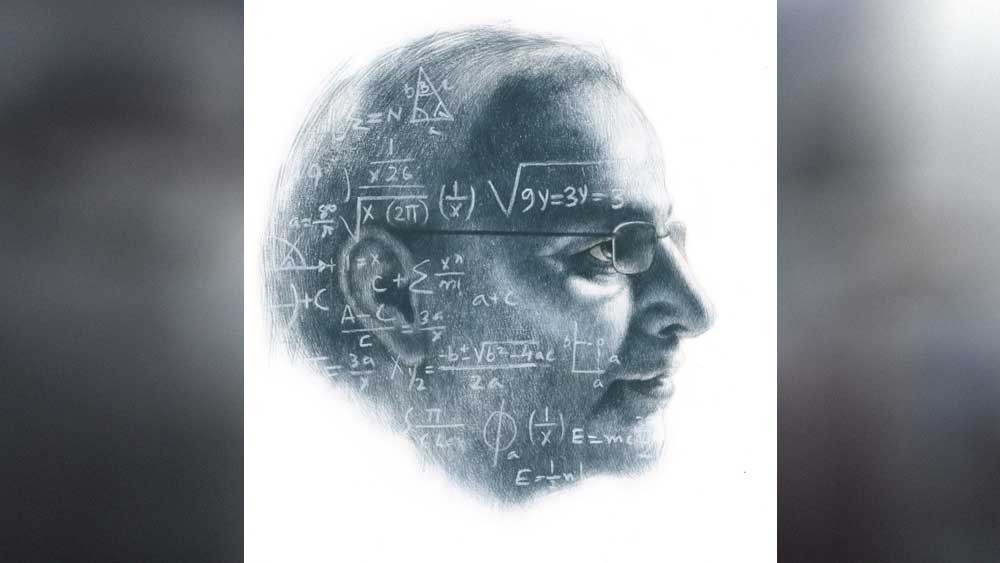

 

<h1 align=center>সামন্তস্যরের অঙ্ক</h1>
<h2 align=center>উল্লাস মল্লিক</h2>
সামন্তস্যর ঠিক করলেন, পালাবেন। গোপনে ইস্কুল ছেড়ে পালিয়ে যাবেন। স্কুল ছেড়ে সাধারণত ছাত্ররা পালায়। পালিয়ে গিয়ে ঘুড়ি ওড়ায়, ক্রিকেট ম্যাচ খেলে, কেউ কেউ সিনেমা-টিনেমাতেও যায়। কিন্তু শিক্ষক চুপিচুপি পালাচ্ছেন স্কুল ছেড়ে, এমন বড় একটা দেখা যায় না। রতনপুর উচ্চ বিদ্যালয়ের অঙ্কের শিক্ষক মহিম সামন্ত ঠিক এই কাজটাই করছেন। চুপিচুপি পালাচ্ছেন ইস্কুল ছেড়ে।   একটা দুটো বছর নয়, রতনপুর উচ্চ বিদ্যালয়ে তেত্রিশ বছর শিক্ষকতা করেছেন তিনি। বি এসসি পাস করে সেই তেইশ বছর বয়েসে ঢুকেছিলেন স্কুলে। বাড়ি থেকে স্কুল অনেকটা পথ। বাসেই লেগে যায় প্রায় দু’ঘণ্টা।  তার পর হাঁটা আছে, খেয়া পার হওয়া আছে। অত হাঙ্গামা পোষায় না। তাই স্কুলের তিন তলায় একটেরে একটা ঘরে থাকার ব্যবস্থা হল তাঁর। তৎকালীন স্কুল-সেক্রেটারি প্রিয়তোষবাবুই করে দিয়েছিলেন ব্যবস্থাটা। বলেছিলেন, মাস্টার সব শক্তি যদি রাস্তাঘাটেই খরচ করে ফেলো, তা হলে পড়াবে কেমন করে! সেই থেকে ওই ঘরেই থাকেন তিনি। সামান্য আয়োজন। একটা সরু তক্তপোশ, কাঠের আলনা, ছোট সুটকেস, কয়েকটা জলের বোতল, স্টোভ, কিছু বাসনকোসন আর বিছানায় কিছু বই-খাতা। অঙ্কের বই সব। পাড়ার এক বৃদ্ধা দু’বেলা খাবার দিয়ে যায়। সকালে ভাত, রাতে রুটি। চা নিজেই বানিয়ে নেন সামন্তস্যর। অবসর সময়ে স্যর খাতা দেখেন। ছাত্রদের অঙ্ক খাতা। ক্লাসে সব খাতা দেখা হয়ে ওঠে না। সেগুলো ঘরে নিয়ে আসেন। অঙ্কের সঠিক সমাধান দেখলে মুখ উজ্জ্বল হয়ে ওঠে। আবার কেউ অঙ্ক ভুল করলে বড় বিষণ্ণতায় ডুবে যান। চুপ করে বসে থাকেন কিছু ক্ষণ। সামনের ছাদে একটু পায়চারি করে আসেন। অঙ্ক আসলে কঠিন কিছু নয়। বরং বেশ সহজ ব্যাপার। অঙ্ক কষতে গেলে একটা জিনিসই লাগে শুধু। লজিক। লজিকটা ধরে নিয়ে এগোলেই অঙ্ক শেষ। ছাত্রদের পাখিপড়া করে এই কথাটাই বোঝান তিনি। বলেন, শুধু অঙ্কে নয়, জীবনেও লজিক খুব দরকার। লজিক জিনিসটা এক বার ধরে ফেলতে পারলে, সুখ-দুঃখ সব কিছুরই সহজ সমাধান হয়ে যায়। তাই যে অঙ্ক পারে সে জীবনের ঝড়ঝাপটা সহজে কাটিয়ে উঠতে পারে।   অঙ্ক পরীক্ষায় কাউকে ফেল করান না সামন্তস্যর। খুঁজে পেতে পাশ-মার্কস দিয়ে দেন। তাঁর মনে হয়, ছাত্রটি তো অঙ্কের লজিকটা ধরে বেশ এগোচ্ছিল, একটা জায়গায় এসে লজিক হারিয়ে ফেলেছে। এই যে এত দূর এগিয়েছে, তার জন্যে কিছু মার্কস দেওয়াই যায়। এই ভাবেই পাশ করিয়ে দেন ছাত্রদের। এক বার অদ্ভুত একটা কাণ্ড ঘটিয়েছিলেন তিনি। এক ছাত্রের সাদা খাতায় পাশ মার্কস দিয়ে দিয়েছিলেন। হেডস্যার ডেকে পাঠালেন। বললেন, “আপনার শরীর-টরির ঠিক আছে তো?”   সামন্তস্যর একটু অবাক হয়ে গেলেন। বললেন, “হ্যাঁ স্যর, ঠিকই তো আছে।”   হেডস্যর বললেন, “এ কী কাণ্ড করেছেন! সাদা পাতায় এতগুলো নম্বর দিয়ে দিয়েছেন! আপনাকে তো খুব সিনসিয়ার বলেই জানতাম। এমন ভুল করলেন কী করে!”   সামন্তস্যর বললেন, “ভুল তো হয়নি স্যর। ভেবেচিন্তেই দিয়েছি।”   “ভেবেচিন্তে!”   “হ্যাঁ স্যর, এই ছেলেটা একটাও অঙ্ক পারেনি ঠিকই, কিন্তু ও নিশ্চয়ই ভেবেছিল অঙ্কগুলো নিয়ে, অঙ্কগুলোর লজিকে ঢুকতে চেয়েছিল। প্রথমেই আটকে গেছে বলে শুধু শুধু আর পাতায় আঁচড় কাটেনি। কিছু ছাত্র আছে স্যর, গোটা অঙ্ক কষে গেল, কিন্তু প্রথম থেকেই ভুল করতে করতে এগোল। তারা লজিকে ঢোকার কোনও চেষ্টাই করে না স্যর। আন্দাজে করে যায়। এ ছেলেটা কিন্তু তেমন নয় স্যর! এ আন্দাজে কিছু করেনি। ওই যে স্যর, লজিক দিয়ে অঙ্কে ঢোকার চেষ্টা করছিল, সেই জন্যেই ওকে নম্বর দিয়েছি।”   হেডস্যর কী বলবেন বুঝে উঠতে পারলেন না। ভাবলেন বুঝি, সামন্তস্যরের মাথায় কোনও সমস্যা দেখা দিয়েছে। দেখা দেওয়াটা অবশ্য অস্বাভাবিক কিছু নয়। কিছু দিন আগেই সামন্তস্যরের একমাত্র ছেলে মারা গেছে। সাইকেল নিয়ে বাজারে বেরিয়েছিল, পিছন থেকে ট্রাক এসে পিষে দেয়। খবর যখন স্কুলে আসে, সামন্তস্যর নাইন-বি-তে ক্লাস নিচ্ছিলেন। হেডস্যর নিজে গিয়েছিলেন খবরটা দিতে। দরজার সামনে দাঁড়িয়ে বলেছিলেন, “সামন্তবাবু একটু এ দিকে আসবেন, কথা আছে।”   তখন তপন নামে একটা ছেলেকে সময়-দূরত্বের একটা অঙ্ক বোঝাচ্ছিলেন সামন্তস্যর। লজিকটা ঠিক ধরতে পারছিল না ছেলেটা। সামন্তস্যর এগিয়ে গেলেন হেডস্যরের দিকে। হেডস্যর বললেন, “আপনি এখনই বাড়ি চলে যান।”   সামন্তস্যর একটু অবাক হয়ে বললেন, “কেন স্যর!”   হেডস্যর বললেন, “আপনার বাড়ি থেকে এক জন এসেছেন, তার সঙ্গে আপনি বাড়ি চলে যান।”   সামন্তস্যর বললেন, “স্যর তপনকে একটা অঙ্ক বোঝাচ্ছি, ওটা বুঝিয়েই যাচ্ছি।”   হেডস্যর বললেন, “অঙ্ক পরে হবে, আপনি এখনই আসুন।”   সামন্তস্যর আবার ক্লাসে ঢুকলেন। তপনকে খাতাটা দিয়ে বললেন, “তপন, পরে তোমাকে বুঝিয়ে দেব বাবা।”   পাশের বাড়ির অশোক এসেছিল স্কুলে। বৌদির খুব শরীর খারাপ, এমনটাই বলেছিল অশোক। কী হয়েছে, কবে থেকে হয়েছে জিজ্ঞেস করেছিলেন সামন্তস্যর। অশোক এড়িয়ে যাচ্ছিল। সামন্তস্যরও আর কিছু জিজ্ঞেস করেননি। বাসে জানলার ধারে বসে বাইরের দিকে তাকিয়ে ভাবছিলেন সময় দূরত্বের অঙ্কটার কথা। ভাবছিলেন, ছেলেটা কেন বুঝতে পারল না লজিকটা! তিনি কি ঠিক বোঝাতে পারছিলেন না? সমস্যাটা কি তাঁরই!   তিন দিন পর ছেলের শ্রাদ্ধ মিটে যেতেই স্কুলে চলে এলেন সামন্তস্যর। হেডস্যর একটু অবাক হয়ে বললেন, “চলে এলেন যে!”   সামন্তস্যর বললেন, “স্যর, বাড়িতে থেকে কী আর করব! এ দিকে ক্লাস কামাই হচ্ছে যে!”   হেডস্যর বললেন, “ওটা কিছু ব্যাপার নয়, আপনি চাইলে আরও কিছু দিন ছুটি নিতে পারেন।”   সামন্তস্যর মৃদু গলায় বললেন, “আসলে সব তো মিটে গেছে, বাড়িতে আর তো আমার কিছু করার নেই স্যর, তাই ভাবলাম...”   হেডস্যর একটু চুপ করে থেকে বললেন, “ঠিক আছে, যা ভাল বোঝেন।”      এখন রাত দুটো দশ। সুটকেসের মধ্যে দরকারি জিনিসগুলো গুছিয়ে নিলেন সামন্তস্যর। থালা-বাসন-স্টোভ যা কিছু পড়ে থাকছে, ঝন্টুর মাকে নিয়ে যেতে বলেছেন। কিছু টাকাও দিয়েছেন। ঝন্টুর মা কাঁদছিল। বলছিল, “ভগবান কেন যে ভাল মানুষগুলোকেই কষ্ট দেয়...”   এই মাঝরাতেই স্কুল ছেড়ে চলে যাবেন তিনি। যাওয়ার কথা ছিল কাল দুপুরে। বিষ্ণুচক থেকে একটা কুড়ির বাসটা ধরবেন ভেবেছিলেন। অটোতে বিষ্ণুচক পনেরো মিনিট। সেই মতো একটার একটু আগেই বেরিয়ে পড়েছিলেন। হেডস্যরের সঙ্গে দেখা করলেন। হেডস্যর বললেন, “ঠিক আছে। আপনি বাড়ি গিয়ে ভাবুন, তার পর কী সিদ্ধান্ত হয় জানাবেন।”   কিন্তু সমস্যা দেখা দিল আচমকা। ক্লাস ছেড়ে দলে দলে ছাত্র বেরিয়ে এল মাঠে। সামন্তস্যরকে ঘিরে ধরল তারা। একটাই দাবি, “আপনি যাবেন না স্যর।” দিগ্ভ্রষ্ট নাবিকের মতো অসহায় ভাবে তিনি এ দিক-ও দিক তাকালেন। চার দিকে শুধু কালো কালো মাথা। “যাবেন না”, “যাবেন না” ধ্বনি ঢেউয়ের মতো আছড়ে পড়ছে তাঁর ওপর। কী করবেন ঠিক করতে না পেরে স্কুলবাড়িটার দিকে তাকালেন। স্কুলবাড়িটাও যেন মুহ্যমান। আর কিছু ক্ষণ দাঁড়িয়ে ধীরে ধীরে তিন তলায় নিজের ঘরে চলে এলেন সামন্তস্যর। কেন কে জানে একটু ঝাপসা হয়ে এল চোখ।   সামন্তস্যরের এই চোখ ঝাপসা হয়ে আসাটা বেশ গোলমেলে ব্যাপার। কখন চোখ হঠাৎ ঝাপসা হয়ে যাবে তার কোনও ঠিক-ঠিকানা নেই। কোনও লজিক কাজ করে না এখানে। ব্যাপারটা নিয়ে বহু ভেবেছেন তিনি, কিন্তু সমাধানে পৌঁছাতে পারেননি। যেমন ছেলের মৃত্যুর পর যখন ডেডবডি আনা হল বাড়িতে, তাঁর চোখে কেউ জল দেখেনি। সবাই কাঁদছে, স্ত্রী মাধবী ছেলের শরীরের ওপর ঝাঁপিয়ে পড়েছে, সবাই টেনে আনার চেষ্টা করছে মাধবীকে। তিনি শুধু একদৃষ্টে তাকিয়ে আছেন ছেলের মুখের দিকে। তাকিয়ে ভাবছেন। ভাবছেন ছেলেটা বলেছিল, সময়-দূরত্বের অঙ্কে একটু সমস্যা হচ্ছে। তিনি পরের রবিবার বাড়ি ফিরে শিখিয়ে দেবেন, এমনটাই কথা ছিল। ছেলের মুখের দিকে তাকিয়ে এই কথাটাই মনে হচ্ছিল তাঁর। আর মনে হচ্ছিল, আর একটা ছেলেকে সময়-দূরত্ব বোঝাতে বোঝাতে চলে এসেছেন। ছেলেটা কিছুতেই লজিকটা ধরতে পারছিল না।   ছেলের মৃত্যুর পর প্রথম দিন নাইন-বি’তে ক্লাস নিতে গিয়ে তপনকে সময়-দূরত্বের সেই অঙ্কটা বুঝিয়ে দিয়েছিলেন। আশ্চর্যের ব্যাপার, এ বার এক বারেই অঙ্কটা ধরে ফেলল তপন। খুব আনন্দ হল সামন্তস্যরের। মনে হল, তিনি বুঝিয়ে দিলে তাঁর ছেলেও বুঝতে পারত অঙ্কগুলো। অঙ্কের লজিক সহজেই ধরতে পারত ছেলেটা। কথাটা মনে আসতেই চোখে জল এল তাঁর। কেন এল কে জানে!   এখনও চার বছর চাকরি আছে তাঁর। কিন্তু মাধবী একা আর পেরে উঠছে না। ছেলেটা চলে যাওয়ার পর শরীর ভীষণ ভেঙে গেছে। তার উপর বাবা মা দুজনেই অথর্বপ্রায়। সংসারের পাশে এখনই তো দাঁড়ানোর সময়। ইতিহাসের সতীনাথবাবু এক বার বলেছিলেন, “যে মানুষ সাংসারিক দায়দায়িত্ব ঠিকমতো পালন করে না, সে কোনও কাজই ঠিকমতো করতে পারে না।” স্ত্রীর অ্যাপেনডিক্স অপারেশন হতে দশ দিন ছুটি নিয়েছিলেন সতীনাথবাবু। স্কুলে ইতিহাসের টিচার এমনিতেই কম। হেডস্যর অসন্তুষ্ট হয়েছিলেন। সতীনাথবাবু পাত্তা দেননি। পরে সামন্তস্যরকে বলেছিলেন, “দেখুন মশাই, চাকরি করছি বলে দাসখত লিখে দিয়েছি না কি! সংসারের প্রতি দায়িত্বটা সবার আগে। যে মানুষ সাংসারিক দায়িত্ব ঠিকমতো পালন করে না, সে কোনও কাজই ঠিকমতো করতে পারে না।” কথাটা খুব ভাবিয়েছিল তাঁকে। মনে হয়েছিল, বিষয়টা নিয়ে আরও ভাবনাচিন্তা করা দরকার। ভাবছিলেনও। কিন্তু সে দিনই ক্লাস টেনে ত্রিকোণমিতি করাতে গিয়ে একটা অঙ্ক আটকে গেল তাঁর। ক্লাসে কিছুতেই সমাধান করে উঠতে পারলেন না। সারা রাত  ভাবলেন অঙ্কটা নিয়ে। তাঁর লজিকে কোথায় ভুল হচ্ছে সেটা বোঝার চেষ্টা করছিলেন। হচ্ছে নিশ্চয়ই কোথাও, তিনি ধরতে পারছেন না। এটা বড় কষ্ট দিচ্ছিল তাঁকে। পরদিন ক্লাসে ছাত্ররা জিজ্ঞেস করলেন, “স্যর অঙ্কটা?”   তিনি খুব ম্লান মুখে বললেন, “শোনো, এখনও সমাধান করে উঠতে পারিনি আমি। তোমরা আমাকে ক্ষমা করো।” ক্লাসে অঙ্ক আটকে গেলে এমনটাই বলেন তিনি। কখনও বলেন না, ‘মনে হচ্ছে অঙ্কটায় কোনও গন্ডগোল আছে, কিংবা ছাপায় মনে হচ্ছে কিছু ভুল আছে...’ এমন কথা কখনও বলেন না তিনি। বলেন, ‘আমি লজিকটা ধরতে পারছি না। তোমরা আমাকে ক্ষমা করো।’   অবশেষে সে দিন রাতে অঙ্কের সমাধানে পৌঁছতে পারলেন তিনি। ভীষণ আনন্দ হল তাঁর। মনে হচ্ছিল, কখন রাতটা কাটবে, স্কুল বসবে, তিনি ক্লাসে যাবেন, অঙ্কটা বুঝিয়ে দেবেন ছাত্রদের। বুঝিয়ে বলবেন, ঠিক কোন জায়গায় লজিকে ভুল করেছিলেন তিনি। ছাত্রদের বোঝাবেন, ওই ভুল তারা কখনও যেন না করে।   অঙ্কটার সমাধান হল। কিন্তু, মুশকিল হল, এই টানাপড়েনে সতীনাথবাবুর ব্যাপারটা ঘেঁটে গেল তাঁর। সতীনাথবাবুর সঙ্গে কিছু একটা নিয়ে কথা বলার ছিল, এটুকু মনে পড়ছে। কিন্তু বিষয়টা কিছুতেই মনে পড়ছে না। এক বার মনে হচ্ছে শিক্ষা ব্যবস্থাটা নিয়ে, আবার মনে হচ্ছে বাজারদর নিয়ে। এক বার মনে হয়েছিল, সতীনাথবাবুকে জিজ্ঞেস করবেন, ‘আচ্ছা মশাই, কী নিয়ে যেন সে দিন আপনার সঙ্গে আলোচনা হচ্ছিল?’ কিন্তু লজ্জা করল খুব, তাই আর জিজ্ঞেস করতে পারলেন না।   এখন হঠাৎ মনে পড়ে গেল আলোচনার সেই বিষয়টা। সাংসারিক দায়দায়িত্বের জন্যেই আজ স্কুল ছেড়ে চলে যাচ্ছেন তিনি। মাধবী আর পেরে উঠছে না। বাবা-মার বয়স হয়েছে। নিজেকে বুঝিয়েছেন তিনি। এক দিন তো ছেড়ে যেতে হবেই। দু’দিন আগে আর পরে। তাঁর জায়গায় নতুন শিক্ষক আসবেন। তিনি ছাত্রদের বুঝিয়ে দেবেন, কী ভাবে লজিক ধরে অঙ্ককে এগিয়ে নিয়ে যেতে হয়। তাঁর সামনে এখন অনেক বড় দায়িত্ব।   ছোট সুটকেসটা হাতে নিয়ে পা টিপে টিপে নীচে নামলেন সামন্তস্যর। পা টিপে টিপে নামলেন, কারণ যাতে স্কুলবাড়িটার ঘুম ভেঙে না যায়।   সামনের মাঠে দাঁড়ালেন সামন্তস্যর। গোল পাঁপড়ভাজার মতো একটা চাঁদ আলগোছে আকাশে লেগে আছে। চাঁদের আলোয় স্কুলবাড়িটাকে দেখলেন। বিশাল এক শিশু যেন ঘুমিয়ে আছে। শেষ বারের মতো দেখলেন স্কুলবাড়িটাকে।   একটা জিনিস খেয়াল করলেন সামন্তস্যর। তেমন কিছু কষ্ট হচ্ছে না তাঁর। অনেকে স্কুল ছেড়ে যাওয়ার সময় প্রচণ্ড আবেগী হয়ে পড়ে। কেউ কেঁদে ফেলে। ফেয়ারওয়েল মঞ্চে বক্তৃতা দিতে দিতে কারও গলা আবেগে বুজে আসে। তুহিনবাবু তো গত বছর অনুষ্ঠান শেষ হয়ে যাওয়ার পরেও স্টেজে বসে হাউমাউ করে কাঁদছিলেন। কিন্তু তেমন কিছু হচ্ছে না তাঁর। আসলে তিনি তো নিজেকে বুঝিয়েছেন। লজিক দিয়ে বুঝিয়েছেন।   আর দেরি নয়। হাঁটতে শুরু করলেন সামন্তস্যর। হেঁটে বিষ্ণুচক বাসস্ট্যান্ড পর্যন্ত যেতে হবে তাঁকে। সেখান থেকে ভোর চারটের ফার্স্ট বাস ধরবেন তিনি। তখন সবার ধরাছোঁয়ার বাইরে।   কিছু ক্ষণ হাঁটার পর কেমন একটা অস্বস্তি হল সামন্তস্যরের। কেউ যেন ফলো করছে তাঁকে! পিছন পিছন আসছে! পিছন ফিরে তাকালেন তিনি। তাকিয়ে ভয়ঙ্কর বিস্মিত হলেন। মস্ত স্কুলবাড়িটা পিছন পিছন আসছে তাঁর। সামন্তস্যর দাঁড়াতে সে-ও দাঁড়িয়ে পড়ল। তিনি কি স্বপ্ন দেখছেন? চোখ দুটো ভাল করে রগড়ে নিলেন সামন্তস্যর। না, ঠিকই তো দেখছেন। স্কুলবাড়িটাই তো। ওই তো চাঁদের আলোয় পড়া যাচ্ছে—রতনপুর উচ্চ বিদ্যালয়।   বুদ্ধিশুদ্ধি সব ওলটপালট হয়ে যাচ্ছে সামন্তস্যরের। তিনি আবার হাঁটতে শুরু করলেন। এ বার আরও জোরে। কিন্তু পিছন ফিরে তাকাতেই সেই দৃশ্য। একটা নির্দিষ্ট দূরত্ব রেখে স্কুলটাও আসছে। যেন হাওয়ায় ভেসে ভেসে আসছে। তিনি এ বার দৌড়তে শুরু করলেন।      মাটিতে বসে পড়েছেন সামন্তস্যর। পাশে সুটকেস। অনেকটা দৌড়েছেন। পা ব্যথা হয়ে গেছে তাঁর। কিন্তু অত দৌড়েও স্কুলবাড়িটাকে হারাতে পারেননি। ঠিক পিছন পিছন চলে এসেছে সে।   চাঁদটা হেলে পড়েছে। ঘড়ি দেখলেন সামন্তস্যর। আর একটু পরেই ভোর হবে। ধীরে ধীরে মাটিতে শুয়ে পড়লেন তিনি। চোখ বুজলেন। অঙ্ক মিলছে না। ব্যাপারটা লজিক দিয়ে ভাবতে হবে। লজিক দিয়ে ভাবলে সব সমস্যারই সমাধান হয়...         