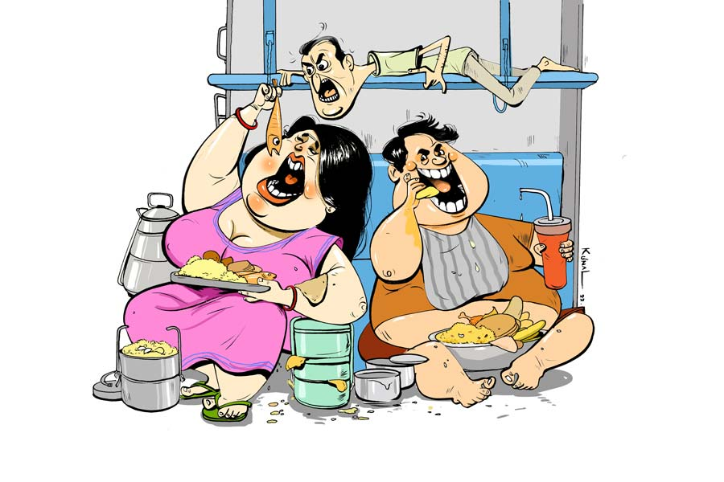

 
 <h1 align=center>সিঙ্গল কুপে</h1>
<h2 align=center>উৎপল দাশগুপ্ত</h2> নমস্কার সেন সাহেব, ভিতরে আসতে পারি?” 

নারীকণ্ঠ শুনে সৌম্য ফাইল থেকে মুখ তুলে একটু চমকে গেল। রীতিমতো সুন্দরী একটি মেয়ে হাসিমুখে তাকিয়ে আছে।

“হ্যাঁ, হ্যাঁ, আসুন, বসুন...” একটু সামলে নিয়ে সৌম্য বলে।

“আমার নাম লোপামুদ্রা দাশগুপ্ত, সিজিম সেক্রেটারিয়েটে আছি। আপনাদেরই সিস্টার কনসার্ন। জানতে পেরেছি আপনি হায়দরাবাদ যাচ্ছেন ট্রেনিং অ্যাটেন্ড করতে। আমাকেও পাঠানো হচ্ছে ওই ট্রেনিংয়ে। কিন্তু প্রবলেম একটাই। বাড়ি থেকে একা ছাড়বে না। তাই বলছিলাম আমাকে আপনার সঙ্গে নিয়ে যাবেন?” মেয়েটি হাসিমুখেই তাকিয়ে আছে।

“কিন্তু আমার ট্রেনের টিকিট হয়ে গেছে!” স্পষ্টতই হতাশ সৌম্য।

“তাতে কোনও প্রবলেম হবে না...” মেয়েটির আত্মবিশ্বাস ও হাসি টসকায় না, “হাওড়া স্টেশনে আপনার প্লেস চেঞ্জ করে নেব। আপনার কোনও অসুবিধে নেই তো?” তাকিয়ে আছে লোপামুদ্রা।

সৌম্যর কথা বেরোচ্ছে না, কোনও মতে বলে,  “না, না, আমার কোনও অসুবিধে নেই!”

“তা হলে ট্রেনে দেখা হবে। আসি তা হলে। নমস্কার...” কোনও দিকে না তাকিয়ে সোজা বেরিয়ে গেল লোপামুদ্রা দাশগুপ্ত।

 

যথাসময়ে হায়দরাবাদের ট্রেনিং সেন্টারে পৌঁছেছে সৌম্য। রুমে গিয়ে ফ্রেশ হয়েছে, এমন সময় ডোরবেল বেজে উঠল। দরজা খুলতেই আর এক জন ট্রেনি ব্যাগ নিয়ে ঢুকল। সৌম্যকে দেখেই চেঁচিয়ে উঠল, “আরে সৌম্য! তুই! কখন এলি?”

প্রথমে সৌম্য চিনতেই পারেনি। কমল! সৌম্যদের অফিসেরই অন্য ডিপার্টমেন্ট। এরও ট্রেনিংয়ে আসার কথা ছিল! সৌম্যদের অফিসে কারা যাচ্ছে, কী ভাবে, কে কার সঙ্গে থাকবে, কিছুই আগে থেকে ডিসক্লোজ় করা হয় না। কিন্তু কমলের এ কী অবস্থা! চোখ ঢুকে গেছে, চুল খাড়া খাড়া, জামা প্যান্ট এলোমেলো!

“এ রকম দাঁড়কাকের মতো লাগছে কেন তোকে?” অবাক সৌম্য।

কমল ফ্যাঁসফ্যাঁস করে এক গ্লাস জল দিতে বলল। জল খেয়ে দম নিয়ে বলল, “দুটো জগই আমার কাছে রাখ। বুঝলি সৌম্য, জীবনে আমি আর ট্রেনিং-ফ্রেনিংয়ে আসব না।”

“কেন, কী হয়েছে তোর?” সৌম্য অবাক হয়ে বলে।

“কী করে বুঝবে বাছাধন! দেখে তো তোমাকে খুব ফুরফুরে লাগছে। আর আমি!” প্রায় কেঁদে ফেলে কমল, “আমি যে বেঁচে আছি, এই অনেক। দে, জল দে।”

ফের জল দিয়ে সৌম্য বলে, “ছ’গ্লাস তো খেলি, আর কত খাবি?”

“চুপ! আরও ছ’গ্লাস খাব, তাতে তোর কী?” ধমকে উঠল কমল। তার পর একটু নরম হল, বলল, “জল না খেয়ে কত ক্ষণ থাকতে পারবি?”

“বেশি ক্ষণ নয়। কিন্তু কী হয়েছে বলবি তো?”

“ভেড়ার মতো ব্যা ব্যা করিস না তো!” জামা খুলে, চশমা খুলে, খাটের উপর পা তুলে বসে কমল বলল, “তা হলে শোন, আমার বেঁচে ফেরার কাহিনি। হাওড়া স্টেশনে ট্রেনে জানালার ধারে আরাম করে বসেছি। কোম্পানি থেকে রিজ়ারভেশনের কী সব প্রবলেমে আমার ভাগ্যে জুটেছে সিঙ্গল কুপে। ভাবছি, উল্টো দিকে যে-ই আসুক, তাঁর যেন নাক না ডাকে। ঠিক তখনই ওই কুপে-তে অদ্ভুত এক সুগন্ধ। তাকিয়ে দেখি একটি মেয়ে আমার উল্টো দিকে এসে বসল। কী বলব সৌম্য, এ রকম সুন্দরী মেয়ে আমি আর দেখিইনি।”

“তোর চোখে তো সব মেয়েই সুন্দরী!” দীর্ঘশ্বাস ফেলে সৌম্য।

“না, না, বিশ্বাস কর। মধুবালা, হেমা আর দীপিকাকে পাঞ্চ করলে বোধহয় এ রকম হয়। ৩৬-২৪-৩৬, পাঁচ ছয় হাইট।”

“তুই কি ফিতে দিয়ে মেপে নিলি?” বোকার মতো বলে সৌম্য।

“এ রকম করলে আর বলবই না!... তার পর বুঝলি তাড়াতাড়ি চশমাটা খুলে ফেললাম।”

“চশমা! কেন?”

“দুটো কারণ। প্রথমত, তোর ডিপার্টমেন্টের ওই যে, সুন্দরী মেয়েটা, এক দিন আমাকে কী বলল জানিস? বলল, চশমা না পরলে আমাকে নাকি অবিকল ব্র্যাড পিটের মতো দেখায়!” একটু যেন লজ্জা পেল কমল।

“আর অন্য কারণটা?” আমার কৌতূহল।

“চশমা না পরলে আমি একটু দূরের জিনিস দুটো দুটো দেখি। এ রকম সুন্দরী মেয়ে দুটো দুটো দেখার সুযোগ কেন ছাড়ব?” বেশ প্রত্যয়ের সঙ্গে জানাল কমল। তার পর বলে চলল, “এর পর মেয়েটি আমার দিকে তাকিয়ে একটু মিষ্টি করে হাসল। তখন আমি কল্পনায় ভেসে বেড়াচ্ছি। এই মেয়ের সঙ্গে, এই কুপে-তে শুধু আমি, সারা দিন, সারা রাত। উঃ, আমি মরে যাব! আচমকা ঘোর কাটল জলতরঙ্গের শব্দে— ‘ইফ ইউ ডোন্ট মাইন্ড, একটা কথা বলব?’ আমার দিকে গাঢ় ভাবে তাকিয়ে আছে মেয়েটি। মনে মনে বলি, নিশ্চয়ই বলবে। কত কথা হবে তোমাতে আমাতে। তুমি বলবে আমি শুনব। শুধু শুনেই যাব। ‘কী হল, কিছু বলছেন না যে?’ আবার জলতরঙ্গ। বললাম, হ্যাঁ, বলুন না কী কথা? মনে মনে বলি, তুমি বললে এক্ষুনি আমার জীবনটা তোমার পায়ে রেখে দেব। ‘বলছিলাম, আমার এক রিলেটিভ অন্য একটি কুপে-তে আছে। আপনি যদি কাইন্ডলি আপনার বার্থটা ইন্টারচেঞ্জ করেন তা হলে আমরা দু’জন এক সঙ্গে যেতে পারি। আই শ্যাল বি হাইলি গ্রেটফুল টু ইউ। আমার জন্য এটুকু করবেন না?’ চোখের গাঢ়তা আরও বাড়িয়ে আমার দিকে ঝুঁকে এল আর সুগন্ধে আমার কেমন যেন নেশা নেশা হতে লাগল। বলে ফেললাম, নিশ্চয়ই যাব। আমি কী বলছি তখন আমার হুঁশ নেই। শুধু জানি, ওর অনুরোধ আমাকে রাখতেই হবে। হঠাৎ দরজার কাছ থেকে একটি লোক আমার ব্যাগটা হাতে নিয়ে বলল, ‘তবে আসুন, আপনার সিটটা দেখিয়ে দিই।’ মেয়েটি আমাকে মিষ্টি হাসি খাওয়াচ্ছে, আর আমি শিভ্যালরি দেখাতে গাড়লের মতো ওই লোকটার পেছনে পেছনে অন্য কুপে-তে গিয়ে বসলাম।”

“তুই অমনি চলে গেলি!” সৌম্য প্রশ্ন করে।

“কী করব বল। আচ্ছা ধর, দীপিকা পাড়ুকোন এসে তোকে একটা রিকোয়েস্ট করল। ভেবে দ্যাখ। তুই কি সেটা রাখবি না? যাক, একটা সিগারেট দে।” সিগারেটে টান দিয়ে কমল আবার শুরু করল, “যেখানে গেলাম, সেটা আবার চার জনের কুপে। একা বসে আছি। হঠাৎ একটা টায়ার ফাটার আওয়াজ। চমকে দেখি, ১৫-১৬ বছরের একটা ছেলে, এত মোটা যে দরজায় প্রায় আটকে যায় আর কী, চেঁচাচ্ছে, ‘মা, আমাদের কুপে-তে চার জন বসে আছে। তুমি কিন্তু সাবধানে এসো। দরজাটা ছোট।’ এ বার একটা স্টিলের থালা ফ্লোরে পড়ার মতো আওয়াজ, ‘আমাকে বলতে হবে না, তুই সাবধানে গিয়ে বোস আর তাড়াতাড়ি চশমাটা পরে নে।’ এ বার ওঁকে দেখতে পেলাম। পচা আলুর বস্তাটার মা।”

“পচা আলুর বস্তা কেন?”

“আরে ওই কুমড়োর গায়ে যা গন্ধ, তা শুধু আলু পচে গেলেই হয়। কিন্তু সে তো আর দরজা দিয়ে সরাসরি ঢুকতেই পারছে না। পেছনে সজনেডাঁটার মতো একটা লোক অনেক কষ্টে মহিলাকে কাত করে দিল আর মহিলা ওই ভাবে কুপে-তে ঢুকে ঠিক আমার সামনেই বসল। ৪৮-৪৮-৪৮। চার দশ। এ বার আমার অবস্থাটা বোঝ। ৩৬-২৪-৩৬ এর জায়গায় ৪৮-৪৮-৪৮। এ বার বসেই হুঙ্কার, ‘এই যে বাঁশপাতা, ওপরে উঠে যাও, ওখানে বাবু বসবে।’ অবাক হয়ে ভাবলাম, আমাকে বলছে না কি? ‘এই যে ন্যাকা ন্যাসপাতি, কানে শুনতে পাও না?’ আমি প্রতিবাদ করলাম, ‘আমার নাম ন্যাসপাতি নয়।’ তাতে বলল, ‘না হোক, আমি তোকে ন্যাসু বলেই ডাকব।’ ৪৮-৪৮-৪৮-এর সিদ্ধান্ত। সেই সজনেডাঁটা মিনমিন করল, ‘গোলাপ, ওকে অত বোকো না।’ গোলাপ! মরে যাব। এই গোলাপ কোন গাছে হয় রে? আবার সেই স্টিলের থালার ঝন ঝন আওয়াজ, ‘এই যে ন্যাসু, গাড়ি ছাড়ার আগে যা যা করার আছে, করে এসো। গাড়ি ছাড়লে কুপের দরজা বন্ধ হয়ে যাবে, আর খুলবে না।’ খুলবে না! কেন? আমি অবাক হয়ে বলি। গোলাপের ঘোষণা, ‘না, খুলবে না। যখন তখন ডাকাতি হচ্ছে। দু’দিনের খাবারদাবার আছে, কোনও চিন্তা নেই। আর হ্যাঁ, জল খাওয়া চলবে না, জল খেলেই বিপদ।” জল খাব না! দু’দিন! আমার আর্তনাদকে উড়িয়ে দেয় গোলাপ, ‘না, খাবে না। কত লোক সাত দিন না খেয়ে থাকছে অনশন ধর্মঘটে।’ সজনে ডাঁটা চিঁ চিঁ করে উঠল, ‘আপনি বরং এখন বাঙ্কে একটু শুয়ে নিন।’ সেই ভাল। বাথরুম থেকে এসে বাঙ্কে উঠতে না উঠতেই দরজা বন্ধ হয়ে গেল। তার পর গাড়ি ছাড়ার সঙ্গে সঙ্গেই ছ’বাটির দুটো টিফিন ক্যারিয়ার বেরোল। গোলাপের আওয়াজ, ‘এই যে ন্যাসু, রাতে ঠিকই খাবার পাবে। এখন খেতে হবে না। বেশি খাওয়া ভাল না। চুপচাপ শুয়ে থাক।’ সজনেডাঁটাকে একটা বাটি দিয়ে মা আর বেটায় শুরু করল। কী বলব তোকে, আস্ত একটা বড়সড় বাটা মাছ মুখের এক দিকে চালান করে দিল। একটু নাড়াচাড়ার পর অন্য দিক দিয়ে আস্ত কাঁটাটা বেরিয়ে এল। দু’মিনিটে এগারোটা বাটি শেষ। বাট নো জল। বাটিতে হাতটা একটু জলে ভিজিয়ে মুখটা মুছে নিয়ে দুটো বড় বড় ঢেঁকুর। শুয়ে শুয়ে ভাবছি মেয়েটার কোথাকার কোন রিলেটিভ, আমাকে কুপে থেকে তাড়িয়ে তেনারা দু’জনে সুখে আছেন। ওই রিলেটিভটাকে ট্রেন থেকে ফেলে দেওয়া যায় না? তা হলে এই নরক থেকে আবার স্বর্গে যেতে পারতাম। ৩৬-২৪-৩৬। হঠাৎ টায়ার ফাটার আওয়াজ। ওই কুমড়োপটাশের গলা, ‘মা, এ বার লাইট জ্বেলে দিই?’ এখন তো বিকেল। এখন আলো জ্বালবে কেন! আমি জিজ্ঞেস করি। ‘তুই চুপ করে শুয়ে থাক ন্যাসু। ডাক্তার আমায় বলেছে, মিসেস গড়গড়ি, যদি ওজন কমাতে চান তো লাইট খান। তাই আমি সব সময় লাইট জ্বালিয়ে রাখি, আমি লাইট খাই।’ গন্ধমাদনের টায়ার ফাটল, ‘মা, আমি এখন নাচব?’ বলে কী, গন্ধমাদন নাচবে! মার আদুরে গলা, ‘হ্যাঁ বাবা, ডাক্তার যে ভাবে বলেছে মনে আছে তো? টেপে গানটা ছেড়ে দে। প্রথমে বাঁ পায়ের আঙুল দিয়ে ঘুরিয়ে ঘুরিয়ে সিগারেট নেবাবি। তার পর ডান হাত ওপরে তুলে গাছ থেকে পটাপট পেয়ারা ছিঁড়বি। এ বার বাঁ হাত নীচে রেখে অনবরত গাড়ির ইস্টিয়ারিং পাল্টাবি। পাঁচ মিনিট করে আবার ডান পায়ে করবি। নে শুরু কর।’ কী বলব সৌম্য, এর পর যে দৃশ্য দেখলাম, আমি বাজি রেখে বলতে পারি, তুই ইহজীবনে দেখতে পাবি না। বিকট আওয়াজে জ্যাকসন ফ্যাকসন কারও গান বাজছে, আর তার সঙ্গে গন্ধমাদন পর্বত লাফাচ্ছে। কুপেটা কচরমচর করছে, লাগেজগুলো লাফাচ্ছে। আমার মাথা ঝিমঝিম করছে, বমি বমি লাগছে। এ কোথায় এলাম! আর ওই টু-সিটার কুপে রিলেটিভকে নিয়ে দীহেম গল্প করছে, মিষ্টি মিষ্টি কথা বলছে, আর আমার যে কী বেরোচ্ছে, সে আমিই জানি।”

“দীহেম কে?” সৌম্য প্রশ্ন করে।

“তুই একটা গবেট। দীপিকা, হেমা আর মধুবালার পাঞ্চ। আহা রে! কী কপাল আমার!” একটু চুপ করে থেকে কমল আবার শুরু করল।

“আমি তো তখন দু’হাতে কান চেপে শুয়ে আছি। রাত ক’টা হবে জানি না। হঠাৎ ঝনঝন আওয়াজ, ‘এই যে গুবরে পোকা, নীচে নেমে এসো, খেতে হবে।’ তাকিয়ে দেখি মস্ত বড় তিনটে ক্যাসারোল সাজানো। আমাকে আর সজনেডাঁটাকে তিনটে করে রুটি আর তিন পিস আমের আচার খেতে দিল। আড় চোখে দেখলাম, গুনে গুনে আঠারোটা রুটি আর আর বড় বড় বাটিতে তরকারি নিয়ে বসেছে গন্ধমাদন আর তাঁর মা। খাওয়ার পর সজনেডাঁটা বিছানা করে দিল। মা আর বেটা নীচের দুটোয় শুয়ে পড়ল। সজনেডাঁটা গন্ধমাদনের পায়ের কাছে বসে আছে। আমার দিকে তাকিয়ে মুচকি মুচকি হাসছে। কেসটা কী? আমার দিকে অমন করে তাকায় কেন? আমার কেমন যেন ভয় ভয় করতে লাগল। আমি টুক করে অন্য দিকে ঘুরে শুয়ে পড়লাম। হঠাৎ ঘুমের মধ্যে চমকে উঠলাম। এটা কী হচ্ছে এখানে! হরিপ্রসাদ চৌরাসিয়ার বাঁশি আর জাকির হুসেনের তবলা। যুগলবন্দি। ৪৮-৪৮-৪৮ যদি বাঁশিতে তান করছে তো গন্ধমাদন তবলায় তাঁর উত্তর দিচ্ছে। আবার কখনও দু’জনে একসঙ্গে ঝালা মারছে। আমার বুক ধড়ফড় করছে, মাথাটা কটকট করছে। ঠিক বুঝতে পারছি, আমার চুলগুলো দাঁড়িয়ে যাচ্ছে। হঠাৎ দেখি ওই সজনেডাঁটা আমার বাঙ্কে উঠে আসছে। দুই কানে হেডফোনের মতো কী লাগিয়েছে। উঠে এসে সটান আমার গা ঘেঁষে বসে পড়ল। হাতে আর একটা হেডফোন। আমি তো গেছি, এ বার না জানি কী হয়। আমার কানের কাছে মুখ এনে সজনে ডাঁটা বলল, ‘এটা কানে লাগিয়ে নিন, না হলে কাল সকালে আর কানে শুনতে পাবেন না। এ বার আসুন আমরা দুজনে তাড়াতাড়ি শুয়ে পড়ি।’ আমার গলা শুকিয়ে যাচ্ছে। কোনও রকমে বললাম, কেন, শোব কেন? সজনেডাঁটা মুচকি হেসে বলে, ‘ন্যাকা, বোঝে না যেন!’”

“তুই কী করলি?” সৌম্য বিস্মিত।

হঠাৎ কমল গর্জে উঠল, “শালা, হারামজাদা! বেআক্কেলে খরগোশ।”

“কে, আমি?”

“না। ওই দীহেমের রিলেটিভ।”

“খরগোশ কেন?”

“দেখিসনি, মেয়েদের কোলে বসে চোখ বুজে কেমন আদর খায়। এক বার ভেবে দেখ, আমার যে এই আতাক্যালানের মতো অবস্থা, সে তো আমার শিভ্যালরির জন্যই। নইলে ওই রিলেটিভ এখন হুসেন সাগরের ধারে বসে ভ্যাঁ ভ্যাঁ করে কাঁদত। আর আমি খরগোশ হয়ে সিঙ্গল কুপে-তে দীহেমের কোলে। এক বার, বুঝলি এক বার ওই রিলেটিভটাকে পাই, দেখিস কী করি আমি।”

এমন সময় আবার ঘরে ডোরবেলের আওয়াজ।

“আমি দেখছি,” বলে সৌম্য উঠে গিয়ে দরজা খুলতেই লোপামুদ্রার মুখ। সদ্য স্নান করে আরও উজ্জ্বল, “কী হল সৌম্য, এখনও রেডি হওনি? ভীষণ খিদে পেয়ে গেছে। তাড়াতাড়ি চলে এসো, আমি ডাইনিং হলে ওয়েট করছি।” লোপামুদ্রার এই অভ্যেস। কোনও দিকে না তাকিয়েই চলে যায়।

দরজা বন্ধ করতেই কমলের বুকফাটা আর্তনাদ, “সৌম্য! ইউ দ্য ব্রুটাস!”

দীর্ঘশ্বাস ফেলে সৌম্য। ট্রেনে ওঠার দিন লোপামুদ্রাই তাকে সিঙ্গল কুপে-তে নিয়ে গিয়েছিল। বলেছিল, যে ভদ্রলোক সেখানে ছিলেন, তিনি সহজেই জায়গা বদলাতে রাজি হয়ে গেছেন, লোপামুদ্রার দাদা সি-অফ করতে এসেছিল, তিনি ভদ্রলোককে সৌম্যর জায়গায় প্লেস করেদিয়ে এসেছেন।

এখন সৌম্য আড়চোখে দেখল, অক্ষম আক্রোশে গ্লাসের পর গ্লাস জল খেতে খেতে ফুঁসছে কমল।      

দীহেম এবং তার রিলেটিভকে চিনতে পারার পর আর কমলের দিকে চোখ তুলে তাকাতে পারছে না সৌম্য। কমলের জল খাওয়া দেখে মনে মনে ভাবছে, অগস্ত্য মুনির রেকর্ডটা না এ বার ভেঙে যায়!