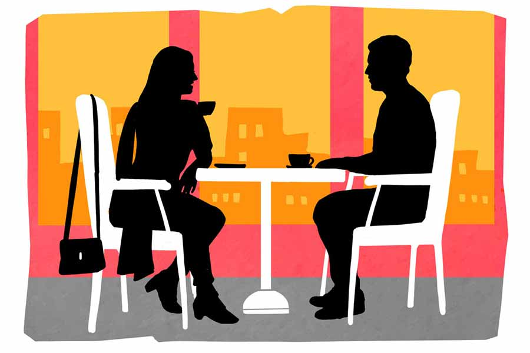

 
 <h1 align=center>সিদ্ধান্ত</h1>
<h2 align=center>সৌমী গুপ্ত</h2> 

বাইরের উত্তাপটা ভিতরে বসে বোঝা যাচ্ছে না। তবে রোদের তেজ দেখে মালুম হচ্ছে বেশ গনগনে আঁচ আজ। রিসেপশনের এক কোণে বসে আছে রঞ্জন। মোবাইলের স্ক্রিনে চোখদুটো থাকলেও মনটা বড় উচাটন।

ভিতরে এসির মৃদু গুঞ্জন। এই সব বেসরকারি হসপিটাল, ফাইভ স্টার হোটেলের চেয়ে কম কিছু নয়। ঝাঁ-চকচকে। মেঝেতে তাকালে নিজের না-কামানো, গালভর্তি দাড়িটাও বেশ বোঝা যায়। মেপে কথা বলতে হয় ডাক্তার, নার্স এবং আনুষঙ্গিক কর্মীদের, বা বলা ভাল স্টাফদের সঙ্গে। কর্মী শব্দটা সরকারি হাসপাতালের জন্য অভিধান তুলে রেখেছে। রঞ্জনের সে রকমই ধারণা। আরও মনে করে বাংলা অভিধানের ‘সুবিধা’ কথাটার ব্যবহার সবচেয়ে বেশি। কারণ এই শব্দটির আকর্ষণী শক্তিও সম্ভবত সবচেয়ে অমোঘ। আমরা সুবিধা না দেখলে আগ্রহী হই না। সুবিধাবাদী শব্দটির ব্যবহার নেতিবাচক হতে পারে, কিন্তু ভেবে দেখতে গেলে সব মানুষই তাই। অসুবিধা স্বীকার করে কেউ কিছু করতে রাজি হয় কখনও!

আর হবেই বা কেন! এই যে শীতাতপ নিয়ন্ত্রিত সর্বসুবিধাযুক্ত হাসপাতালে বাবাকে ভর্তি করেছে রঞ্জন, তাতে ভুলে গেলে তো চলবে না তথাকথিত এটিকেট! এ তো আর লাইনে দাঁড়িয়ে হা-পিত্যেশ করে দাঁড়িয়ে বাবাকে জেনারেল বেডে দেওয়া হয়নি যে, অপেক্ষা করতে হবে কখন ডাক আসবে! রীতিমতো দিন হিসাবে মোটা টাকা নিয়ে তবে সমস্ত সুবিধা-সহ বাবাকে ভর্তি করেছে ও। খুব ভদ্র ভাষায় সব খোঁজ পাওয়াটা ওর অধিকার! টাকার অধিকার! কারণ এই সব কিছুর জন্যই সে দাম দিচ্ছে।

এক বার মনে হল, এর চেয়ে কি ওদের পাড়ার সরকারি হাসপাতালে দিলে ভাল হত বাবাকে? হ্যাঁ, ঝুটঝামেলা হত একটু, কিন্তু এই আট দিন ধরে যে জলের মতো বেরিয়ে যাচ্ছে টাকা, তার থেকে রেহাই মিলত অবশ্য। আর সেই রেহাইটা পেলে অন্য দিকটা চিন্তা করতে হত না!

এই অন্য দিকের চিন্তাটা মাথায় ঘাই মারতেই বিনবিনে ঘাম জমে উঠল কপালে। রঞ্জনের মনে হল আর ক’দিন বাবা এখানে... বিয়েটা ভেঙে যাবে না তো? আর বাবা যদি শেষ পর্যন্ত... বুকের ভিতর যেন কে জোরে ঝাঁকুনি দিয়ে গেল।

রিসেপশনে গোলাপি ব্লেজ়ার পরে যে মেয়েটি বসে আছে, সে চোখ তুলে সামনের চেয়ারের সারিতে বসা রঞ্জনকে সামান্য মেপে নিয়ে বলল, “পেশেন্ট পরিমল ভট্টাচার্য... বাড়ির লোক কে আছেন?”

চিন্তার সরলরেখায় একটা ছেদ টানতে হল অগত্যা। রঞ্জন উঠে দাঁড়াল। দ্রুতগতিতে এগিয়ে বলল, “আমি! রঞ্জন ভট্টাচার্য। পরিমল ভট্টাচার্যের বাড়ির লোক... মানে আমি ওঁর ছেলে!”

একটা কাগজ সামনে এগিয়ে দিল মেয়েটি। তার পর বলল, “সাইন করে দিন। দু’দিন ভেন্টিলেশনে আছেন। তার আগে নরমাল কেবিনে ছিলেন। মোট চার্জ লেখা আছে। যা অ্যাডভান্স করেছেন তাতে হবে না। আপনাদের মেডিক্লেম পারমিট করবে তো?”

রঞ্জন কেমন যেন ভ্যাবাচ্যাকা খেয়ে গেল। বিলে লেখা টাকার অঙ্কটা অস্পষ্ট দেখা যাচ্ছে। কতগুলো সংখ্যা গোনার চেষ্টা করতেই আবার ফাইলটা নিয়ে পেপারওয়েট চাপিয়ে দিল মেয়েটা। রঞ্জন মনে মনে দেখল পাঁচটা অক্ষর। মানে একক, দশক, শতক, হাজার, অযুত মানে এখনও লাখের ঘরে পৌঁছয়নি। স্বস্তির নিঃশ্বাসটাও স্বস্তিতে ফেলতে পারল না রঞ্জন। আর ক’দিন টানতে হবে কে জানে! লাখের ঘরে গুটিগুটি পায়ে অঙ্কটা পৌঁছতে আর হয়তো একটা দিন। তার পর ঝোপ বুঝে কোপ মারবে বলেই মনে হচ্ছে!

মেয়েটা আগের চেয়ে সামান্য জোরে আবার বলল, “এক্সকিউজ় মি স্যর? মেডিক্লেমে কথা বলেছেন?”

রঞ্জনের থতমত ভাবটা কেটে গেল। চশমাটা ঠিক করে বলল, “হ্যাঁ, কথা বলে নেব।”

মেয়েটা কম্পিউটার স্ক্রিনেই চোখ রেখে বলল, “পার ডে ভেন্টিলেশনে থার্টি ফাইভ থাউজ়েন্ড। আপনার মেডিক্লেমে কী কী ইনক্লুডেড আছে, অবশ্যই পলিসির লোকের সঙ্গে কথা বলে জেনে নেবেন!”

রঞ্জন একটু ইতস্তত করে বলল, “মানে ক’দিন রাখতে হবে ভেন্টিলেশনে, তার কোনও আন্দাজ পাওয়া যায়?”

প্রশ্নটা করেই নিজেকে খুব বোকা-বোকা মনে হল ওর। এর কোনও উত্তর কি আদৌ রিসেপশনিস্টের কাছে থাকার কথা?

মেয়েটা মাউস ঘোরাতে ঘোরাতে একই রকম যান্ত্রিক, ভাবলেশহীন গলায় বলল, “প্লিজ় কনসাল্ট উইথ ইয়োর ডক্টর স্যর। উই হ্যাভ নো আইডিয়া। পেশেন্টের কন্ডিশনের উপর ডিপেন্ড করে আসলে... নিন এখানে সাইন করে দিন।”

মেয়েটা একটু এগিয়ে কাগজটা দিল। ল্যাভেন্ডারের গন্ধ ভেসে এল। রঞ্জনকে রাহী আগের দিন শপিং মলে নিয়ে গিয়ে একটা পারফিউম কিনে দেওয়ার জন্য আবদার করেছিল। স্পষ্ট করে চায়নি বটে, তবে সূক্ষ্ম বিচারে ওটা আবদারই।

সে আবদার রঞ্জন রাখতে পারেনি। তার আগের দিনই বাবাকে অ্যাডমিট করতে হয়েছিল। বিয়ের ব্যাপারে কথা বলার জন্য রাহীকে নিয়ে ভিজ়িটিং আওয়ার্সের পর নিয়ে গিয়েছিল ওই শপিং মলে। তখন বাবার অবস্থাও এতটা ক্রিটিক্যাল ছিল না। সেই কারণেই কিছু কথাবার্তা এগিয়ে রাখতে চেয়েছিল।

অভিজাত শপিং মলে ঘুরতে ঘুরতে রাহী দামি একটা পারফিউম দেখিয়ে বলেছিল, “মাই পাপা গেভ মি দিস লাস্ট ইয়ার। আনফরচুনেটলি শেষ হয়ে গেছে!” কথা শেষ করে বাচ্চা মেয়ের মতো দুঃখী-দুঃখী মুখ করে তাকিয়েছিল রঞ্জনের দিকে।

রঞ্জন ওই মলের ভিতরে কুকিজ়, বিদেশি পারফিউম, দামি এয়ার ফ্রেশনার... এ সবের মধ্যেও খুঁজে পাচ্ছিল কিছু ক্ষণ আগে বাবার কেবিনের ওষুধ, ইনজেকশনের উগ্র গন্ধ! রাহীর চোখে আবদারের ভাষা তার মন পর্যন্ত পৌঁছতে পারেনি।

রঞ্জন প্রসঙ্গটা এড়িয়ে বলেছিল, “রাহী আমরা কোথাও বসি চলো। আসলে আমার একটু কথা ছিল। আমাদের বিয়েটা নিয়ে।”

চোখদুটো সরু হয়ে গিয়েছিল রাহীর। কনুইয়ের কাছ থেকে নরম হাতদুটো সরে গিয়েছিল আস্তে আস্তে। রাহী অন্য দিকে তাকিয়ে চুল ঠিক করতে করতে বলেছিল, “আই থিঙ্ক নীচে একটা কাফে আছে। কম্পারেটিভলি ইনএক্সপেনসিভ। আই মিন পকেট-ফ্রেন্ডলি!”

কথায় লুকনো ছোবলটা বুঝতে পেরেছিল রঞ্জন। আহত চোখদুটো নামিয়ে নিয়েছিল। তার পর ওরা দু’জনে বসেছিল কফিশপে। আস্তে আস্তে বলেছিল রঞ্জন সব। প্রশ্ন রেখেছিল, কিছুটা ভরসাও রেখেছিল। রাহী কথা ও ভরসার মাঝামাঝি রঞ্জনকে রেখে উঠে গিয়েছিল একটা ফোনের বাহানায়। পরে অবশ্য জানিয়েছে আজ দেখা করবে।

লিফট থেকে বেরিয়ে আসছেন ডক্টর দে। শার্প চেহারা, বুদ্ধিদীপ্ত চোখ। রঞ্জন দ্রুতপায়ে এগিয়ে গেল, “গুড মর্নিং, স্যর।”

মাপা হাসি, মাপা চাহনি। ডাক্তারবাবু বেশ হিসেব করে বললেন, “মর্নিং।”

রঞ্জন তার বাবার নাম, আইসিইউ-এর নম্বর বলল। তার পর একটু ইতস্তত করে বলল, “স্যর, বাবাকে আর ক’দিন ভেন্টিলেশনে রাখতে হবে? জেনারেল বেডে কি দেওয়া সম্ভব?”

মোবাইলের স্ক্রিনে হিসেবি চোখদুটো নামিয়ে রাখলেন ডক্টর দে। স্ক্রোল করতে করতে বললেন, “দেখুন, পেশেন্টের অবস্থা বেশ ক্রিটিক্যাল। এখনই কিছু বলা যাচ্ছে না। জেনারেল বেডে দেওয়ার কথা তো নয়ই। আইসিইউতে দু’দিন পর স্টেবল হলে ট্রান্সফার করা যেতে পারে। তবে পুরোটাই আপ টু দ্য সিচুয়েশন। দেখা যাক আর একটু...”

আর উত্তরের অপেক্ষা করলেন না ডক্টর দে। কথা শেষ হতে না হতেই হেঁটে চলে গেলেন। রঞ্জন আবার ফিরে এল রিসেপশনে। মেয়েটিকে জিজ্ঞেস করল, “এক বার বাবাকে দেখা যাবে?”

রিসেপশনিস্ট খুব ব্যস্ততার মধ্যে টুকরো কতগুলো শব্দ ছুড়ে দিল, “থার্ড ফ্লোরে গিয়ে জিজ্ঞেস করুন।”

রঞ্জনের পা দুটো চলছে না যেন। তবু চালাতে হচ্ছে। জেঠিমা বেশ কয়েক বার ফোন করেছে। ধরতে পারেনি। ধরলেও কী বলবে! ও দিকে রাহী আসার সময় গুটিগুটি পায়ে যত এগিয়ে আসছে, রঞ্জনের বুকের মধ্যে যেন ততই দামামা বাজছে।

লিফটে উঠে বাঁ দিকে ঘুরেই আইসিইউ। অনুমতি পেতে জুতো খুলে মাস্ক পরে বাবার সামনে এসে দাঁড়াল রঞ্জন। সারা ঘরে ওষুধের গন্ধ। বাবার চোখদুটো অর্ধেক বন্ধ। মণিদুটো একটুও দেখা যাচ্ছে না। চার দিকে নল লাগানো। হাতে ড্রিপ, নাকে রাইলস টিউব। আশপাশের মনিটরে নানা চলমান লেখচিত্র এবং বিপ বিপ শব্দ।

সব মিলিয়ে বাবাকে কেমন অচেনা মনে হল দেখে। এই বাবা কি সেই বাবা, যে ছোটবেলায় কাঁধে চাপিয়ে মেলায় ঘুরতে নিয়ে যেত? পাহাড়ে ঘুরতে গেলে কোলে চাপিয়ে অনায়াসে হেঁটে যেত চড়াই উতরাই? সন্ধেবেলা অফিস থেকে এসেও ক্লান্ত না হয়ে খেলায় মেতে উঠত! রঞ্জন এক ভাবে তাকিয়ে থাকল বাবার শরীরটার দিকে। ওঠানামা করছে? বুকের কাছটা কি একটুও উঠছে বা নামছে? বুঝতে পারছে না তো!

কোন ছোটবেলায় মা মারা যাওয়ার দৃশ্যটুকু শুধু মনে পড়ে। তার পর ওর পুরো জগৎটাই তো বাবাকে ঘিরে! একটা মোটা কম্বল বাবার গায়ের উপর চাপানো। গালদুটো ঝুলে পড়েছে। কাছে যাওয়ার অনুমতি নেই বলে ছুঁয়েও দেখতে পারছে না রঞ্জন। পাশে এক জন নার্স এসে দাঁড়ালেন, “প্লিজ় এ বার বাইরে যেতে হবে!”

রঞ্জন অন্যমনস্ক হয়ে গেল, “বাবা বেঁচে আছে তো?”

নার্সটি উত্তর দিল, “এখনও। বাইরে থেকে সাপোর্ট নিয়ে বেঁচে আছেন। তবে এ সব ক্ষেত্রে মাল্টি অর্গান ফেল হতে থাকে। একটা সময়… তবু দেখুন, মিরাকল তো হয়। ঈশ্বরের কাছে প্রার্থনা করুন।”

রঞ্জন আর দাঁড়াল না। সোজা লিফটে নেমে এসে বাইরের করিডরে দাঁড়াল। এসির মধ্যে থাকতেও কষ্ট হচ্ছে ওর। ঝাঁঝালো ওষুধ, ইনজেকশনের গন্ধ ও আর নিতে পারছে না। বাইরে এসে একটা সিগারেট ধরাল ও। রিং হয়ে বাতাসে মিশে গেল। গুমোট ভাবটা এমন করে শহরকে আঁকড়ে ধরেছে যে, অস্বস্তি হচ্ছে রঞ্জনের। আকাশ মেঘলা। বৃষ্টি আসতে পারে।

জেঠিমাকে ফোন করল ও, “বাবা ভাল নেই। সাপোর্ট সিস্টেম নিয়ে চলছে। কত দিন রাখবে জানি না, মেডিক্লেমে তো অত প্যাকেজ নেই! সিনিয়র ডাক্তার বলে গেছে টাকার ব্যবস্থা করতে না পারলে বন্ডে সাইন করে পেশেন্টকে ছাড়িয়ে
নিয়ে যেতে!”

জেঠিমা ডুকরে কেঁদে উঠল, “টাকাপয়সা যা লাগবে দেখ পাপাই। মানুষটা তোকে বড় করার জন্য প্রাণপাত করেছে। যদি ফিরে আসে!”

উল্টো দিক থেকে রাহী হেঁটে আসছে এ দিকেই। তার গলায় সবুজ ওড়না। রঞ্জন শুধু বলল, “আমি একটু পরে ফোন
করছি মাম।”

সিগারেটটা ফেলে পা দিয়ে পিষে ভিতরের অস্থির ভাবটা কাটাতে চাইল রঞ্জন। রাহী এগিয়ে এসেছে আরও। চেনা দামি পারফিউমের গন্ধ নাকে এসে লাগল। সানগ্লাসটা চুলের উপর তুলে বলল, “আঙ্কল কেমন আছে?”

রঞ্জন অন্য দিকে তাকিয়ে বলল, “একই রকম, যেমন ছিলেন...”

রাহী ঘুরে দাঁড়াল, “আমরা কোথাও বসি? এখানে কথা বলা
যায় না।”

রঞ্জন রাহীকে অনুসরণ করল।

ওরা বসল সামনের কফিশপে। দুটো ক্যাপুচিনো রাহীই অর্ডার করল। রঞ্জন শুধু মেনুকার্ডে দামটা দেখে নিল। হ্যাঁ, তাকে এখন দাম দেখতে হয়। মাসের শেষে মোটা টাকা মাইনের চাকরি সে করে না। যা করে তাতে সচ্ছল ভাবে চলে যায় ওদের, তবে বাহুল্য-বিলাসিতার সুযোগ হয় না। বাবা পেনশন পায়। জমানো টাকা আছে বেশ অনেকটা। সেই দিয়েই চিকিৎসা চলছে। তবে ভাঁড়ারে টান পড়বে খুব শিগগিরই। রঞ্জন খুব ভাল করে জানে সেটা। তাই হিসেব করে চলতে হবে ক’দিন।

রাহী নিজেকে গুছিয়ে নিয়ে বসল, “ডাক্তার কী বলল?”

রঞ্জন বাইরে তাকিয়ে ছিল তখন। চলন্ত বাস, ট্যাক্সি, অটোর মধ্যে একটা বাচ্চা তার বাবার হাত ধরে
রাস্তা পেরিয়ে যাচ্ছে। বাচ্চাটা আপনমনে বকে যাচ্ছে। ছাই রঙের চাদরটা ঘন হয়ে মুড়ে ফেলছে কলকাতার আকাশ।

রাহী একটু উষ্ণ স্বরে বলল, “ডক্টর দে-র সঙ্গে কথা হল তোমার?”

ঘোর কাটল রঞ্জনের, “হ্যাঁ!”

ছোট্ট উত্তরে একটু বিরক্ত হল রাহী, “কী বললেন, সেটা কি জিজ্ঞেস না করলে বলবে না!”

রঞ্জন সামনে রাখা কফির কাপের কিনারায় আঙুল বোলাতে বোলাতে বলল, “ডক্টর বলছেন সিচুয়েশন ভাল নয়। মাল্টি অর্গান ফেল করছে আস্তে আস্তে। ভেন্টিলেশনে রাখা হয়েছে। পেশেন্টের সার্ভাইভ করা মুশকিল।”

রাহী একটু অধৈর্য হয়ে বলল, “তা হলে? কেন তুমি ডিসিশন নিতে পারছ না?”

রঞ্জন চোখ তুলে তাকাল!

রাহী গলাটা নামিয়ে বলল, “লিসন রঞ্জন, আঙ্কলের সেরে ওঠার কোনও প্রব্যাবিলিটি নেই। সে ক্ষেত্রে তুমি বন্ডে সাইন করছ না কেন? আমার মা বলছিল বিয়েটা পিছিয়ে গেলে খুব মুশকিল। অলরেডি সব বুকিং হয়ে গেছে। তোমার স্টেটসে যাওয়াটা ক্যানসেলড হয়ে যাবে সে ক্ষেত্রে। এত কস্টলি একটা প্যাকেজ, জাস্ট আমাদের মুখ চেয়ে পাপা... তুমি আর এই অপরচুনিটি পাবে কখনও? প্লিজ় রঞ্জন, তুমি তো জানো যা স্যালারি পাও তাতে আমাদের একটা সপ্তাহও ভাল করে চলবে না। আর এখন যদি সমস্ত টাকাপয়সা আঙ্কলের পিছনে খরচ হয়ে যায়, তুমি বিয়েটা পিছিয়ে দিতে বাধ্য হবে। সে ক্ষেত্রে আমার পাপা তোমাকে আর স্টেটসে পাঠাবে? বি প্র্যাকটিক্যাল রঞ্জন। ভেন্টিলেশনে এ রকম ভাবে সাপোর্ট সিস্টেমে থাকা মানে এক রকম নেই ধরেই চলতে হয়। হসপিটালগুলো এখন এই ভাবেই টাকা নেওয়ার তালে থাকে! মেডিক্লেমে যতটা পাওয়া যায়, তার সবটা ছিবড়ে করে নিয়ে এরা ডেথ ডিক্লেয়ার করে। একটু ভাবো, প্লিজ়! কাল আমরা বন্ডে সাইন করব, কেমন? ডিলে কোরো না রঞ্জন। এটা আমাদের সারা জীবনের প্রশ্ন।”

এক নাগাড়ে কথাগুলো বলে রাহী কফিতে চুমুক দিল। রঞ্জন শুধু ফ্যালফ্যাল করে তাকিয়ে রইল। রাহী কিছু বুঝতে পারল কি? কফিটা তাড়াতাড়ি শেষ করে উঠে দাঁড়াল রাহী, “প্লিজ় রঞ্জন, টেক আ পজ়িটিভ ডিসিশন। তুমি তো জানো, পাপা দুবাইয়ের ক্লায়েন্টের ছেলের সঙ্গে আমার বিয়ে দেওয়ার জন্য কতটা ডেসপারেট ছিল! শুধু আমার ভালবাসার জন্যই পাপা এই স্যাক্রিফাইসটা করতে রাজি হয়েছে। প্লিজ় সব কিছু ঘেঁটে দিয়ো না!”

ভারী কাচের পাল্লা সরিয়ে রাহী চলে গেল। ওয়েটার এসে বিল ধরিয়ে গেল। রঞ্জনের মাথাটা যন্ত্রণায় ছিঁড়ে যাচ্ছে। রাগ! কষ্ট! দুঃখ! অপমান! কিচ্ছু বুঝতে পারছে না। সামনে রাখা ক্যাপুচিনো ঠান্ডা হয়ে যাচ্ছে। রঞ্জনের বাবার মুখটা মনে পড়ছে। মা মারা যাওয়ার পর কখনও রঞ্জন বুঝতে পারেনি মায়ের অভাব। মাম, মানে ওর জেঠিমা চিরকাল ওকে নিজের সন্তানের মতো দেখে এসেছে। বাড়ি থেকে কিছুটা দূরে স্কুল ছিল। প্রচণ্ড গরমে এক দিন বাবা আনতে গিয়েছিল। রঞ্জন ডাব খাওয়ার বায়না করছিল। একটা ডাব এনে দিয়েছিল বাবা। রঞ্জন জিজ্ঞেস করেছিল, “তুমি খাবে না?”

বাবা একটা তৃপ্তির হাসি হেসে বলেছিল, “নাহ!”

ঘরে এসে ঢকঢক করে জল খেয়েছিল বাবা।

আর এক বার প্রচণ্ড জ্বরে ভুলভাল বকছিল রঞ্জন। বাবা অফিস থেকে ফিরে মাথার কাছে বসে ছিল সারা রাত। মাথায় জলপট্টি দিয়ে সমানে হাতপাখার হাওয়া করে গিয়েছিল। আচমকা গলার কাছে অসম্ভব একটা কষ্ট হচ্ছে রঞ্জনের। বিয়ে, রাহী, এ সব কিছু ছাপিয়ে ওর বাবার মুখটা মনে পড়ল। একটা
মোটা কম্বল। বাবা শুয়ে আছে। আচ্ছা, রঞ্জন যদি ওই ভাবে শুয়ে থাকত, ওর বাবাও কি টাকার কথা চিন্তা করত আগে!

ওয়েটার এসে তাড়া লাগাল। রঞ্জন উঠে দাঁড়াল। টেক আ ডিসিশন! এগারো বছরের রিলেশনে এত বড় প্রশ্নের মুখোমুখি আর কখনও হয়নি রঞ্জন। কাচের দরজা ঠেলে বাইরে এসে দাঁড়াল। তুমুল বৃষ্টি শুরু হয়েছে। রাস্তা ধুয়ে যাচ্ছে। সিদ্ধান্ত নিয়ে ফেলে রঞ্জন। সে তুমুল বৃষ্টির ঝরোখার নীচে এসে দাঁড়ায়।

রঞ্জন বৃষ্টিতে ভিজবে। জ্বর আসুক। ধুম জ্বর। চেতন-অচেতন মুছে গিয়ে ভুল বকবে ও। তখনও কি বাবা পারবে নাকে ও রকম নল গুঁজে শুয়ে থাকতে? কিছুতেই না।

বাবা ঠিক উঠে চলে আসবে। ওর মাথার পাশে বসবে। মাথায় জলপট্টি দেবে। আসবে না বাবা? হাওয়া করবে না মাথায়?

সময় নেই আর... টেক আ ডিসিশন, বাবা!

