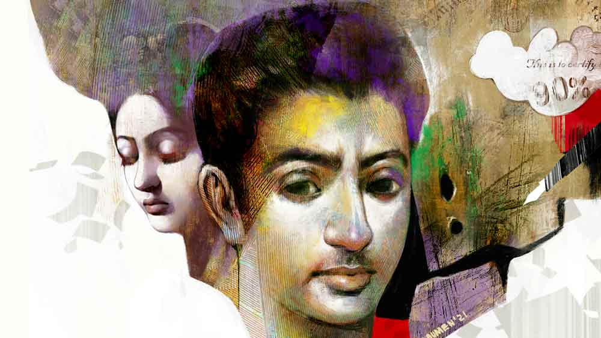

 

<h1 align=center>সিদ্ধিলাভ</h1>
<h2 align=center>বিক্রম অধিকারী</h2>
আমার জীবনে তিনটে ঐতিহাসিক আক্ষেপ। ছেলে হয়ে জন্মেছি। আমার পদবি ব্যানার্জি। আর  উত্তরাধিকার সূত্রে পাওয়া আমাদের কয়েক কাঠা বাস্তুভিটে। বাবা বিপিএল, তবুও জেনারেল ক্যাটেগরির সংরক্ষণ আমার অধরা। আমি মাস্টার্স। আমার চেহারাটা নির্ঘাত চরম দারিদ্রের বিজ্ঞাপন। ভিখিরিও আমার কাছে ভিক্ষে চায় না। এটিএম-এ গেলে সিকিউরিটি গার্ড বলে, “মেশিনে একশো টাকার নোট নেই।” তবু কেন যে তোর্সা আমার প্রতি দুর্বল! গার্লফ্রেন্ড ইজ় ইনজুরিয়াস টু ওয়েল্থ। প্রেমে আক্রান্ত বেকার ছেলেদের আর্থিক অবস্থা কোভিড-আক্রান্ত অর্থনীতির মতো হতে বাধ্য। প্রেমে পড়তে ভয় লাগে। প্রেমের খরচ চালাব কী ভাবে? তোর্সাকে এড়িয়ে মানি সেভিং মোডে থাকি। সিদ্ধিও আমার মতো বেকার। সিদ্ধি বলে, “দেব, বুঝলি তো ‘লাভ’-ও একটা ইনভেস্টমেন্ট। ‘লাভ’ থেকেই লাভ হয়। বাবা গরিব মানে তোর ভাগ্যদোষ। কিন্তু শ্বশুর গরিব মানে কর্মদোষ।”   অজান্তেই কখন যেন তোর্সার প্রেমে ডুবে গেলাম। প্রেম ভাইরাস হলে মা-বাবা অ্যান্টিভাইরাস। যথারীতি তোর্সার বাবা আমার লাভ স্টোরিতে ভিলেন। “সময় বদলাতে সময় লাগে না,” নিজস্ব স্টাইলে সিদ্ধি বুদ্ধি দেয়, “ডেভ, ডু ইলোপ টু ডেভলপ।” তোর্সাকে বললাম,  “চলো পালাই।” তোর্সা অরাজি, “পালাব কেন? একটা সরকারি চাকরি জোগাড় করো। বাবা ঠিক মেনে নেবে।” সুন্দরী মেয়েরা যদি সাকসেস হয়, তবে সেই সাকসেস অর্জন করবার একমাত্র উপায় সরকারি চাকরি। কিন্তু সরকারি চাকরি তো ‘ট্রু লাভ’-এর  মতোই রেয়ার।  সরকারি চাকরির জন্য নাকি বান্ডিল বান্ডিল গাঁধীমার্কা রেকমেন্ডেশন লাগে। গাঁধীগিরি অচল, কিন্তু গাঁধীর ফটো চলে। আমি ফুঁসে উঠি, “সরকারি চাকরি দেখে কি যোগ্যতার বিচার হয়? বিলো ফিফটি পারসেন্ট মার্কস নিয়ে অনেকে সরকারি চাকরি করছে। আর 
আমার মতো নাইন্টি প্লাস স্কোর নিয়েও অনেকে চাকরির জন্যে ফ্যা-ফ্যা করে ঘুরছে।”   যে মেয়ে যতটা সুন্দরী, তার বাবা ততটাই ভয়ঙ্কর। তোর্সার বাবা এক দিন আমাকে গোডাউনে  ডাকলেন। ওঁর কণ্ঠে  শ্লেষ, “টিউশন পড়িয়ে কত আসে? ওই টাকায় তোর্সার পার্লারের খরচও উঠবে না।”   সিদ্ধি ঠিকই বলেছিল, “মেয়েদের স্বপ্নে কখনও  সাইকেল চালিয়ে বেকার আসে না। ওদের  স্বপ্নে গাড়ি হাঁকিয়ে মালদার আসে।”   চেকবই বার করে তোর্সার বাবা শীতল গলায় বললেন, “তোর্সাকে ভুলে যাবার মূল্য কত?” ওঁর পোষা গুন্ডামার্কা একটা লোক খুনখার চাকু বের করে, “কী চাই, চেক না চাকু?”   মিনমিন করে বললাম, “প্রেম 
তো অমূল্য।”   “দু’লাখ দিচ্ছি,” তোর্সার বাবা চেক লিখতে লিখতে হুমকি দেন, “তোর্সার নাম আর মুখে আনলে জিভ ছিঁড়ে নেব।”   দু’লাখ! আমার তিন অঙ্কের ব্যাঙ্ক ব্যালান্স-কে আগলে রাখে আট ক্যারেক্টার-এর পাসওয়ার্ড। এ বার কি আমার ব্যাঙ্ক অ্যাকাউন্ট ছ’অঙ্কের স্বাদ পেতে চলেছে! মুশকো লোকটা আমার হাতে চেক ধরিয়ে বিদ্রুপ ছোড়ে, “দেবদাস!”   ইস, দেব ব্যানার্জি না হয়ে 
দেব দাস হলেও কোথাও দাসত্ব জুটতে পারত।   বয়স বাড়ার সঙ্গে-সঙ্গে ছেলেদের কান্নাও বোবা হতে থাকে। তোর্সাকে কি ভোলা যায়? চোখ বন্ধ করলেও তোর্সা ভাসে। এক দুপুরে তোর্সা আমার ঘরে আসে।   “ইতর, ছোটলোক,” তোর্সা আমার  মুখে একটা চেক ছুড়ে দেয়, “ছিঃ, প্রেমও তোর কাছে পণ্য!” চেকের সঙ্গে আটকানো ব্যাঙ্কের চিঠিটা   পড়ে  জানলাম, ‘সিগনেচার ডিফারস’ দেখিয়ে ব্যাঙ্ক দু’লাখের চেকটা ডিজ়অনার করেছে। ব্যাঙ্ক আমাকে চিঠি দিয়েছিল। কিন্তু সেই চিঠি তোর্সার হাতে! গভীর ষড়যন্ত্র। তোর্সার বাবা, ভুলভাল সই করে চেক বাউন্স করাল। গুন্ডা লাগিয়ে বিনামূল্যে আমার অমূল্য প্রেম হাতিয়ে নিল। আর আমি হয়ে গেলাম প্রেমের ব্যাপারি! চেক নিয়ে পুরো চেকমেট। এ চেকের চেয়ে তো চাকুই ভাল ছিল। প্রেমে শহিদ হলেও মিডিয়ায় মান পেতাম।   হ্যাঁ, প্রেম অন্ধ। সবাই চোখ বন্ধ করে প্রেমে পড়ে। আর চোখ খুললেই প্রেম ছেড়ে বেরিয়ে আসে। প্রতিবাদী তোর্সাও পুরস্কার ফেরানোর মতো প্রেম ফেরত দিয়ে গেল। মা-বাবার ইচ্ছের সঙ্গে মেয়েদের গোপন ইচ্ছের নিরন্তর যুদ্ধই অ্যারেঞ্জ ম্যারেজ। প্রত্যেকটি মেয়ের কবিতার মতো সৌন্দর্যের মলাটে সব সময়ই আছে কোনও না কোনও পুরুষের ট্র্যাজিক উপন্যাস। কোনও মেয়ের বিয়ে ঠিক হলেই ভাবি, আবার কোন বেচারার প্রেম শহিদ হয়ে গেল!   বিচ্ছেদ-আক্রান্ত আমি সেলফ আইসোলেশন-এ। মা-র নজর এড়িয়ে সিদ্ধি আমার ঘরে আসে। সিদ্ধিকে দেখলেই মা-র দু’চোখ বিরক্তি উগরোতে থাকে। সিদ্ধি যেন কোনও উগ্রপন্থী। আমাকে ওর 
দলে ভেড়াতে এসেছে। সিদ্ধি সান্ত্বনা দেয়, “ভাই, বেকারদের সবাই 
‘টার্মস  অ্যান্ড কন্ডিশনস’-এর মতো ইগনোর করে।”   আমার বিষণ্ণ গলা, “এ যুগেও মেয়েদের লাভ স্টোরি বাবা-মা এডিট করে দেয়।”   সিদ্ধি আমার পিঠে হাত রাখে, “মেয়েদের বেটার করে মেকআপ। আর ছেলেদের ব্রেকআপ।”   “শালা, ফোনেরও সেটিংস আছে— আমার নেই,” উত্তেজিত স্বরে বললাম।   জলের বোতল গলায় ঢকঢক করে উপুড় করতেই জোর বিষম লেগে গেল। কোনও রকমে সামলে নিয়ে বলি, “এই তো, কে বলে প্রেম নেই! তোর্সা আমার কথা ভাবছে।”   সিদ্ধি ধমকায়, “অলস মস্তিষ্ক প্রিয়তমার বাসা। আরে, কেউ কারও কথা ভাবলে যদি এমন বিষম খেতে হয়, তবে তো সানি লিওন বিষম খেয়ে এত দিনে মারাই যেত।”   “তোর্সা যেন সরকারি চাকরির রিজ়ার্ভড ভেকেন্সি, আমি বেচারা জেনারেল কাস্ট,” বুকে হাত রাখলাম, “খুব যন্ত্রণা রে।”  সিদ্ধির গলায়ও আফসোস, “বুকের যন্ত্রণা তো যুবকদের রাষ্ট্রীয় রোগ রে পাগলা— আপনা হো কর ভি কিসি অওর কা জাগির লগতা হ্যায়/ দিল ভি শালা মসলা-এ-কাশ্মীর লগতা হ্যায়।”   *****   মা দিনে অনেক বার আমার জন্য গভীর শ্বাস ছাড়েন, “সবই কপালের দোষ!” আমার বেকারত্বের সৌজন্যে মা-র কপালভাতি করা হয়ে যায়। বাবার হোটেলের স্বাদু খাবারও এখন বিস্বাদ লাগে। বাড়িতে কম থাকলে মা-র অভিযোগ, “রাতদিন শুধু বনে-বাদাড়ে ঘুরে বেড়াস।” আর বেশি থাকলে বাবা গজগজ করেন, “নিষ্কর্মা, সারা দিন বাড়িতে পড়ে থাকে।”   বেকারত্বের প্রকোপে রোববারের বোধটাও হারিয়ে গেছে।   ঘুমের প্রলোভন মাখা আয়েসি সকাল। হয়তো একমাত্র এই সময়েই রোজগেরেরা বেকারদের হিংসে করে। পড়ে-পড়ে যে ঘুমোব সে উপায় কি আছে? পাশের বাড়ির মিলিদি বাপের বাড়িতে এসেছে। ছেলেকে সঙ্গে নিয়ে ও আমাদের বাড়িতে আসে। স্কুলে পড়ার সময় মিলিদি ছিল সাফল্যের এসআই ইউনিট। আমাদের পড়া-ঘুম-রেজ়াল্ট—  প্রতিটি পদক্ষেপ মিলি-মিটারে, মানে মিলিদির মিটারে পরিমাপ করা হত। তাই ওর মুখোমুখি হতে চাই না। চুপিসারে ঘর থেকে বের হতেই সামনে মিলিদি। ওর মুখে 
সেই মোক্ষম প্রশ্নবাণ, “কী রে! এখন কী করছিস?”   স্রেফ এই খতরনাক প্রশ্নের ভয়ে আমি সবাইকে এড়িয়ে চলি। বেকার দেখলেই সবাই যেচে জ্ঞান দিতে আসে। এদের কে বোঝাবে, কর্মহীন থাকাও একটা কাজ, বড্ড কঠিন কাজ। এখন আমাকে দেখে কুকুর ঘেউ-ঘেউ করলেও মনে হয় শালা জ্ঞান দিচ্ছে। মিলিদিকে বললাম, “এক্সপোর্ট-ইম্পোর্ট করি।”   “বাঃ! কী এক্সপোর্ট-ইম্পোর্ট করিস রে?”   “টুইটার থেকে টুইট  ইম্পোর্ট করে হোয়াটস্অ্যাপ আর ফেসবুকে এক্সপোর্ট করি।”   মিলিদি অবাক, “সারা দিন হোয়াটস্অ্যাপ-ফেসবুক?”   “সারা দিন না, রাতেও। কোনও ওয়ার্ক নেই বলেই তো নেটওয়ার্কে।”   সিদ্ধি ঠিকই বলে, “স্মার্টফোন না ঘষা বেকার আর হাতের লেখা সুন্দর ডাক্তার—  দুটোই রেয়ার।”   মিলিদির ছেলেকে জিজ্ঞেস করলাম, “মামা, বড়  হয়ে কী হবি?”   ও ঘোষণা করে, “ডাইনোসর।”   বাচ্চাদের দেখলেই আমার কমন প্রশ্ন, “বড় হয়ে কী হবি?”  কারও জবাবে হয়তো আমার কম্পাসহীন জীবন লক্ষ্য খুঁজে পাবে। ছেলেবেলায়  শুনতাম, লেখাপড়া করে যে, গাড়ি-ঘোড়া চড়ে সে। বড় হয়ে বুঝলাম, ওই আশ্বাসবাণীটা সব থেকে বড় এপ্রিলফুল। পড়ে-পড়ে  এত বড় লোক হয়ে গেলাম, কিন্তু  বড়লোক হলাম কোথায়!   সব কিছু ছেড়ে-ছুড়ে দিতে ইচ্ছে করে। কিন্তু ছাড়ব কী? এখনও কিছু ধরতেই তো পারিনি। আজব দুনিয়া, ফ্রি ওয়াইফাই পাওয়া যায়। কিন্তু ফ্রি খাবার পাওয়া যায় না। এই বয়সেও বাবার পালতু। নিজেকে ফালতু-ফালতু লাগে। সিদ্ধি বলে, “নিজেকে  ফালতু মনে হলেই কোনও কাস্টমার কেয়ার-এ ফোন করবি। দেখবি, ওরা কত সম্মান দিয়ে ‘স্যর-স্যর’ করে কথা বলে। নিজেকে গরিব ভাবিস কেন? জানিস, আমাদের একটা কিডনির দাম কত?”   স্টেটাস লিখতে  গেলে ফেসবুক প্রশ্ন করে, ‘হোয়াট’স অন ইয়োর মাইন্ড?’ আমার জবাব একটাই, “ফিলিং লো।” এই ‘ফিলিং লো’ নিয়ে আমার সঙ্গে মোবাইলের ব্যাটারির কম্পিটিশন হতে পারে। সিদ্ধিকে বললাম, “গার্জিয়ানরা বেকার টিউটরদের ভরসা করে না। আচ্ছা, ব্যাঙ্ক থেকে বিজয় মালিয়া টাইপ লোন নিলে কেমন হয়?”   “ট্যাঁকে মাল থাকলেই মালিয়া টাইপ লোন পাওয়া যায় বুঝলি,” সিদ্ধি মাথা চুলকায়, “নে, রোজ শ’খানেক ইনকামের ট্রিক বাতলে দিচ্ছি। এখন হরিভূষণ ডাক্তার খুব চলছে। ভোর থেকেই চেম্বারে লাইন। প্রথম দিকে নাম লেখা। তোর সিরিয়াল নম্বর কিনে নেওয়ার অনেক লোক পাবি।”   আমি তেড়ে উঠলাম, “আরে, হইরা তো আমার ক্লাসমেট ছিল। কোনও পরীক্ষায় আমার ধারে কাছে আসতে পারেনি। জয়েন্টে আমার অনেক পেছনে র‌্যাঙ্ক করেও সরকারি কলেজে চান্স পেয়ে গেল। মরে যাব তবু ওখানে লাইন দেব না।”   সিদ্ধি বলল, “রিল্যাক্স, লেট হলেও একটা লেটেস্ট আইডিয়া বের করব।”   *****   সিদ্ধি আমাকে জিজ্ঞেস করে, “বল তো, কোন ব্যাঙ্কে ইন্টারেস্ট বেশি?”   আমার কণ্ঠে বিরক্তি, “আমি জাহাজের খবর রাখি না।”   “ভোট ব্যাঙ্ক,” সিদ্ধির গলায় তেজ, “উই ডোন্ট কাস্ট আওয়ার ভোট, উই ভোট আওয়ার কাস্ট। মেরিট সার্টিফিকেট-এর থেকে কাস্ট সার্টিফিকেট-এর ভ্যালু বেশি। পিছিয়ে থাকলে এগিয়ে যাওয়া যায়। দেশ ক্যাশলেস হলেও কাস্টলেস 
হবে না।”   আমার গলায় হতাশা, “দশ লাখের বেশি অ্যানুয়াল ইনকাম হলে গ্যাসের সাবসিডি বন্ধ, কিন্তু কাস্ট সাবসিডি বন্ধ হয় না। সরকার আসে যায়, কিন্তু সিস্টেম বদলায় না।”   সিদ্ধি সযত্নে একটা কাগজ মেলে ধরে। কাগজটা পড়ে আমি হতবাক। কষ্ট-কষ্ট হাসিতে নিজের ঈর্ষা গোপন করলাম, “বাঃ, তোর একটা হিল্লে 
হয়ে গেল।”   সিদ্ধি অকাট্য যুক্তি দেয়, “এখন শঠতাই মূলধন। অনেক টাকা ঢেলে জোগাড় করলাম।”   একটা ইন্টারভিউ দিয়ে ফিরছি। চাকরির জন্য কোম্পানি চায় অভিজ্ঞতা, আমি অভিজ্ঞতার জন্য চাই চাকরি— এটাই  বেকারত্বের দুষ্টচক্র। জেনারেল টিকিট কেটে রিজ়ার্ভেশন কামরায়  উঠেছি। টিটিই জিজ্ঞেস করেন, “রিজ়ার্ভেশন হ্যায়?”   হতাশ গলায় বলি, “রিজ়ার্ভেশন থাকলে  কি  বেকার থাকতাম!”   টিটিই আমার দুঃখে সমব্যথী, “আরে বস কর, রুলায়াগা ক্যা?”   মাঝপথে ট্রেন দাঁড়িয়ে গেল। নেমে দেখি একটা ভিড় কোনও প্রতিবাদে ট্রেন অবরোধ করেছে। বিক্ষুব্ধ ভিড় থেকে উচ্চগ্রামে স্লোগান ভেসে আসছে, “আমাদের সংগ্রাম... চলছে চলবে।”   জেনারেল কাস্ট মানেই তো সংগ্রাম। শালা সিদ্ধিরও সিদ্ধিলাভ হয়ে গেল। এটা ভেবে ভেবেই আমার মাথা বিগড়ে আছে। আচমকা জমায়েতে পুলিশ লাঠিপেটা শুরু করল। পুলিশি তাণ্ডব দেখে ঝাঁ করে মেজাজটা খিঁচে গেল। কোনও অজানা প্রতিবাদে আমি সংগ্রামী ভিড়ে শামিল হলাম। একটা পুলিশ লাঠি উঁচিয়ে তেড়ে আসে। সটান গিয়ে বাঁ-হাতে পুলিশের লাঠি আঁকড়ে গর্জে উঠলাম, “আমাদের সংগ্রাম।” আমার  সঙ্গে বিক্ষুব্ধ  ভিড় গলা মেলায়, “চলছে চলবে।” আমার স্পর্ধায় এক জন  ষণ্ডামার্কা পুলিশের মেজাজ বিগড়ে  যায়। সে সজোরে আমার বাঁ হাতে লাঠির বাড়ি মারে। আমি মাটিতে লুটিয়ে পড়ি।   পুলিশি  জুলুমের বিরুদ্ধে এক জন উত্তপ্ত স্লোগান দেয়, “পুলিশের কালো হাত ভেঙে দাও, গুঁড়িয়ে দাও।” আমি একটা পাথর নিয়ে তেড়েফুঁড়ে উঠে দাঁড়াই। আমার ক্ষোভে ভর করেছে পাগলামি। পুলিশটাকে ঢিল মেরে সমবেত স্লোগানে গলা মেলালাম, “ভেঙে  দাও, গুঁড়িয়ে  দাও।”   ঢিলটা পুলিশটার হাতে লাগে। আহত পুলিশটার দু’চোখ জ্বলে ওঠে, “শুয়োরের বাচ্চা, পুলিশকে ঢিল?”   আমার আক্রান্ত বাঁ হাতে এলোপাথাড়ি লাঠি পড়তে থাকে। আমি মাটিতে পড়ে যাই। আমার মুখের  সামনে ঝুঁকে পুলিশটা হিসহিস করে, “বড় নেতা হয়েছিস? ভেঙে দাও, গুঁড়িয়ে দাও—  নে শালা, তোর হাত ভেঙে দিলাম, গুঁড়িয়ে দিলাম।”   সরকারি নীতির বিরুদ্ধে আন্দোলন করে পুলিশের ডান্ডা খাওয়াই বুঝি গণতন্ত্র। জাল সার্টিফিকেট বানিয়ে সিদ্ধিও এখন কোটার সুবিধে পাবে। ওর ‘সরকার’ পদবিটা ইউনিকাস্ট। ‘ব্যানার্জি’ মার্কামারা জেনারেল। যন্ত্রণা। দুঃসহ যন্ত্রণা। আর পারছি না। শেষ হয়ে যাচ্ছি। আমিও তো বিলুপ্তপ্রায়। আমারও সংরক্ষণ দরকার। আমিও বাঁচতে চাই। এক দলা থুতু গনগনে পুলিশটার মুখে ছুড়ে দিলাম। পুলিশটা ভয়ঙ্কর আক্রোশে উঠে দাঁড়ায়। নির্মম বলিষ্ঠ পা দিয়ে আমার ভাঙা বাঁ হাত পিষে দিতে দিতে দাঁতে দাঁত চেপে বলে, “নে শালা... তোকে হ্যান্ডিক্যাপড করে দিলাম।”   হাত ভাঙার যন্ত্রণা যেন অদ্ভুত এক আরাম হয়ে ছড়িয়ে পড়ল সারা শরীরে। হ্যান্ডিক্যাপড! আমি হ্যান্ডিক্যাপড! এ বার থেকে আমারও রিজ়ার্ভেশন  কনফার্মড!         