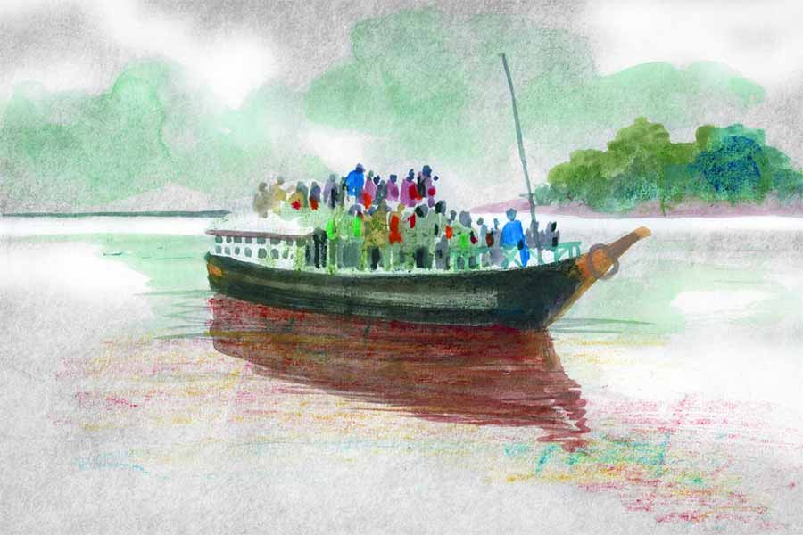

 
 <h1 align=center>সুখ</h1>
<h2 align=center>উজ্জ্বল রায়</h2> 

নিরাপদকে দেখতে যতটা নিরীহ, ততটা নিরীহ নিরাপদ নয়। মাথার খোলে যেন বারুদ ঠাসা। কথায় কথায় রেগে যায়। খিস্তিখেউড় করে। এমনকি তেমন তেমন হলে হাতও চালিয়ে দেয়। সেই কারণে ওর বৌ গৌরী প্রায়ই বলে, “তুমি বাজি কারখানাটা তুলে দিয়ে এ বার একটা মুদি দোকান করো দেখি, তা হলে যদি তোমার মাথা ঠান্ডা হয়। দিনরাত পটকা বানিয়ে বানিয়ে তোমার মটকা গরম হয়ে থাকে। কথায় কথায় এত মাথা গরম করো কেন!”

মাতারাঙ্গিতে ছোটখাটো একটা বাজি কারখানা আছে নিরাপদর। ওর হাতের চকলেট বোম আর তুবড়ির হেভি ডিমান্ড। নিরাপদ বাজি কারখানা বন্ধ করার কথা ভাবতেই পারে না। তবে গৌরীর কাছে ও ভিজে বারুদ। গৌরী ফর্সা। গৌরী দেখতে সুন্দর। গৌরী কথা বলে খুব ভাল। পুরুষ মানুষকে কব্জা করার যাবতীয় গুণ আছে ওর।

গৌরী এখন সাত মাসের অন্তঃসত্ত্বা। নিরাপদ বৌকে তাই শ্বশুরবাড়ি রেখে আসতে যাচ্ছে। নিরাপদর ইচ্ছে ছিল না শ্বশুরবাড়ি রেখে আসার। কিন্তু মায়ের কথায় রাজি হতে হয়েছে। মা বলেছে, ঘরে সেবা-শুশ্রূষা করার লোক কোথায়? বাচ্চা হওয়ার পর রোজ রোজ পেটে মালিশ করে দেবে কে? মুখের সামনে ভাতের থালাই বা ধরবে কে শুনি? তা ছাড়া নিরাপদ ভেবে দেখছে, প্রসবের খরচাপাতিও বিশাল। তাই সব দিক বিবেচনা করে গৌরীকে শ্বশুরবাড়িতে রেখে আসার সিদ্ধান্ত মেনে নিয়েছে।

যতই ভিড় হোক, শ্বশুরবাড়ি যাওয়ার আর অন্য কোনও রাস্তা নেই। বাড়ি থেকে বেরিয়ে ভ্যানরিকশা করে বড় রাস্তায় এসে বাস ধরতে হয়। বাস থেকে নেমে পোয়াটাক রাস্তা পায়ে হেঁটে এলে গঙ্গার ঘাট। তার পর নৌকো করে ও পারে গিয়ে রেললাইন পেরিয়ে টোটোয় চেপে পিয়ারাপুর। বরাবর এ ভাবেই যাতায়াত করতে হয় নিরাপদকে। গৌরীর সঙ্গে ওর চার বছরের মেয়ে ময়নাও যাচ্ছে।

নিরাপদ সামনের দিকে নৌকোর পাটাতনের উপর সুটকেস আর থলি নিয়ে দাঁড়িয়েছিল। গৌরী মেয়েকে নিয়ে ভিতরে বসে। গৌরী বলে দিয়েছিল, মনে করে গঙ্গায় পয়সা ফেলতে। তাই মাঝগঙ্গা আসতে পকেটে হাত ঢোকায় নিরাপদ। ঠিক সেই সময় নৌকোটা সামান্য দুলে ওঠে। টাল সামলাতে না পেরে একটা লোক নিরাপদর গায়ে প্রায় হুমড়ি খেয়ে পড়ে। নিরাপদ পাশের লোকটিকে ধরে কোনও রকমে নিজেকে সামলে নেয়। দু’পায়ের ফাঁকে চেপে ধরা থলিটা আলগা হয়ে কাত হয়ে পড়ে। সেটাকে ফের পায়ের ফাঁকে গুঁজতে গুঁজতে নিরাপদ বিরক্ত ও ভয়মিশ্রিত কণ্ঠে চেঁচিয়ে উঠল, “ঠিক করে দাঁড়াতে পারেন না? একটু হলেই আমি পড়ে যাচ্ছিলাম জলে। যত্তসব আনাড়ি লোক…”

নিরাপদর কথা শেষ হওয়ার আগেই লোকটি খেঁকিয়ে উঠল, “কী বললেন আপনি আমায়, আনাড়ি! জন্মে থেকে আমি এই নদী পারাপার করছি, আর আমি আনাড়ি? আপনি জানেন আমি কে?”

এত ক্ষণ পর নিরাপদ চোখ তুলে দেখল লোকটিকে। জিন্‌সের উপর সাদা পাঞ্জাবি। গলায় পাকানো মোটা সোনার চেন। বুকে লোম। কব্জিতে দামি ঘড়ি। উল্টে আঁচড়ানো কলপ করা চুল। কলপ করা গোঁফের গোড়ায় সাদা রেখা। লোকটাকে দেখে আরও বিরক্ত হয় নিরাপদ। সেই রকম রুক্ষ গলাতেই ফের বলে উঠল, “আপনি কে সেটা আমার জেনে দরকার নেই। আমি যে একটু হলেই জলে পড়ে যাচ্ছিলাম… তার কী হত!”

লোকটা সিনেমার ভিলেনের মতো দাঁত বার করে খ্যা-খ্যা করে হেসে বলল, “কী আবার হত! মরে যেতেন। মানুষ জন্মায়ই মরবার জন্য। গঙ্গায় মরলে পুন্যি হয়।”

“তা হলে আমি আপনাকে ঠেলে ফেলে দিই জলে! আপনারও পুন্যি হোক!” নিরাপদ আরও বিরক্ত হয়ে মুখ খিঁচিয়ে বলল।

“সাহস থাকে তো ঠেলে ফেল দেখি, বুঝব বুকের পাটা আছে তোর! আমাকে চিনিস না তো, চিনলে এ কথা বলার সাহস পেতিস না, বুঝলি?” বলে, লোকটা একটা মাঝবয়সি ছেলের দিকে তাকিয়ে বলল, “মানিক, এই মড়াটাকে থামা তুই, নইলে আমি কিন্তু সত্যি সত্যি ওকে ঠেলে ফেলে দেব জলে। বড় বড় কথা বলা সব বেরিয়ে যাবে। এই মড়াটাকে বলে দে আমি কে।”

নৌকোর সবাই চুপ করে দাঁড়িয়ে রগড় দেখছিল। কেউ কেউ মিটিমিটি হাসছিলও। ক্ষমতাবান কেউ হবে ভেবে অনেকেই হয়তো কথা বলতে সাহস পেল না, তাও হতে পারে। ভুটভুটির হাল ঘোরাতে ঘোরাতে মাঝি বলল, “ছাড়ুন না মনাদা। উনি বাইরের লোক হবেন। আপনাকে চেনেন না। যান, মাথা ঠান্ডা করে কাজে যান। কাজে বেরিয়ে মাথা গরম করতে নেই।”

সব দেখে শুনে নিরাপদও মনে মনে খানিক ভয় পায়। কে জানে বাবা, না জেনে কাকে কী বলে দিল। ইনি হয়তো পার্টির কোনও নেতা-টেতা হবেন। এঁদের হাত খুব লম্বা হয়। কখন কী করে বসেন কিছু বলা যায় না। নিরাপদর কারখানায় বেশির ভাগ বাজিই নিষিদ্ধ। পিছনে লাগলে বহু টাকা খেসারত দিতে হবে। ভয়ে হোক কি ভক্তিতে, নিরাপদ অন্য কথাও ভাবে, লোকটা হয়তো ইচ্ছে করে ওকে ধাক্কা দেয়নি, নিজেই পড়ে যাচ্ছিল বোধহয়। নিজের ভাবনার সঙ্গে নিজেই আপস করে নেয় নিরাপদ। তবু রাগটা মস্তিষ্কে রয়ে যায়। বিশেষ করে, আপনি থেকে তুই, তার পর মড়া বলাতে নিরাপদ ভারী অপমানিত বোধ করেছে। ভিতরে ভিতরে গরিব-বড়লোকের সমীকরণটা সলতে পাকাতে থাকে। নিরাপদ জানে, শত চেষ্টা করেও সে জীবনে এ রকম একটা সোনার চেন গড়িয়ে দিতে পারবে না গৌরীকে। মেয়ে-বৌয়ের কথা ভেবে নিরাপদ মাথা ঠান্ডা করে দাঁড়িয়ে রইল।

নৌকো জেটিতে ভেড়ার পর সবাই হুড়মুড় করে নামতে থাকে। নিরাপদ ওর সুটকেস আর থলি নিয়ে এক পাশে সরে দাঁড়ায়। গৌরী আর ময়নার জন্য অপেক্ষা করে।

মনা বলে নেতা গোছের লোকটাও নৌকো থেকে নেমে এল। তার পর সিগারেট ধরিয়ে কটমট করে নিরাপদকে মাপতে থাকে।

নিরাপদ একটা বিড়ি ধরায়।

গৌরী নৌকোর খোলের মধ্যে থেকে বেরিয়ে এলে নিরাপদ হাত বাড়িয়ে দিয়ে বলে, “সাবধানে… দেখে পা ফেলো।”

গৌরী নিরাপদর হাতটা ধরে জেটির উপর নামতে নামতে চাপা স্বরে ক্ষুণ্ণ গলায় বলে, “কার সঙ্গে ঝগড়া করছিলে এত? ফের মাথা গরম করেছিলে তুমি?”

নিরাপদ গৌরীর হাত ধরে এগিয়ে যেতে যেতে একটু দূরে দাঁড়িয়ে থাকা মনার দিকে খর দৃষ্টিতে চেয়ে বলল, “ও কিছু নয়। চলো।”

গৌরী আর ময়নাকে দেখে মনার সঙ্গে আসা ছেলেটি গলা নিচু করে বলল, “ছেড়ে দাও মনাদা। লোকটার সঙ্গে পোয়াতি মেয়েছেলে আছে। কিছু করলে এক্ষুনি ক্যাঁচাল হয়ে যাবে। সামনে ভোট। সামান্য ব্যাপার নিয়ে মাথা গরম করো কেন?”

মনা ক্রূর দৃষ্টিতে নিরাপদর দিকে চেয়ে বলল, “সামান্য ব্যাপার নয় রে মানিক। আমার মটকা গরম হয়ে গেছে। ও শালার সঙ্গে আজ বৌ না থাকলে আমি ওকে চিনিয়ে দিতাম, আমি কে!”

*****

শহর লাগোয়া গ্রাম-দেশ যেমন হয়, পিয়ারাপুর তেমনই শহরের ছোঁয়া বাঁচিয়ে জেগে থাকা একটি নিরীহ গ্রাম। এখানে নিবিড় গাছপালা আছে। পুকুর-জলাশয় আছে। হাঁস আছে। মুরগি আছে। লাফানো ছাগলছানা আছে। আবার মুদির দোকানে বোতলবন্দি জলও আছে। রাস্তার ধারে মোবাইল রিপেয়ারিং শপ। শ্বশুরবাড়ি এলে তাই নিরাপদর মন ভাল হয়ে যায়। কিন্তু এ বারে থেকে থেকেই নিরাপদ অন্যমনস্ক হয়ে পড়েছে। মাথার মধ্যে কেবলই ঘুরপাক খেয়ে চলেছে কথাটা, “আমি কে জানিস?”

নিরাপদ ভাবে, মানুষের এত অহঙ্কার কিসের! কথায় কথায় কেবল বলে, ‘আমি কে জানিস? আমি কে চিনিস?’ আরে বাবা, আমি যেমন মানুষ, তুমিও তাই। এতে আলাদা করে চেনা-জানার কী আছে! ক্ষমতার এত দম্ভ! পার্টির যা হোক একটা নেতা হলেই এরা আজকাল ধরাকে সরা জ্ঞান করে। মানুষকে কুকুর-ছাগল মনে করে।

যা হোক, দু’দিন শ্বশুরবাড়িতে খেয়ে-বসে বিশ্রাম করে বিকেল-বিকেল রওনা দিল নিরাপদ। দোরগোড়ায় দাঁড়িয়ে গৌরী বলল, “সাবধানে যেয়ো। যখন-তখন মাথা গরম কোরো না। বাড়ি ফিরে একটা ফোন করবে। আর মায়ের জন্য মনে করে গঙ্গাজল নিয়ে যেয়ো।”

বাজার থেকে নিরাপদ তাই একটা পাঁচ লিটারের জারিকেন কিনেছে। ও-পারে গিয়ে জল ভরে নেবে। ও পারে জারিকেনের দাম বেশি নেয়।

সূর্য ডুবে গিয়ে আকাশ এখন ধূসর। ভুটভুটি এলে নিরাপদ খোলের মধ্যে গিয়ে বসে। কোলের উপর থলি। ভিতরে জারিকেন। ও-পার থেকে একটা নৌকো এলে তবে এই নৌকো ছাড়বে। একটা লোক ঘটিগরম বিক্রি করছিল। বসে থাকতে থাকতে নিরাপদ লোকটার কাঁধের ফাঁক গলে দেখতে পেল, সেই মনা এসে উঠল নৌকোয়! একা। সাদা পাজামা-পাঞ্জাবি। সাদা স্নিকার।

মনাকে দেখেই নিরাপদর মাথার খোলে ভরা ভিজে বারুদ দপ করে জ্বলে উঠল।

কী মনে হতে, নিরাপদ নৌকোর পাটাতনের উপর উঠে এল। মনার থেকে সামান্য দূরত্ব বজায় রেখে দাঁড়াল। মনার মুখ থেকে ভকভক করে বাংলা মদের গন্ধ বেরোচ্ছিল। মুখ-ভর্তি গুটখার থুতু। মনা চিনতে পারেনি নিরাপদকে। চিনতে পারার কথাও নয়। এরা জনসেবক। প্রচুর মানুষের সঙ্গে মেলামেশা করে। বিশেষ প্রয়োজন ছাড়া নিরাপদর মতো ফালতু লোকদের এরা মনে রাখে না।

কিছু ক্ষণ পর ভুটভুটিটা ছাড়তেই একটু দুলে উঠল সবাই। মনা পা ফাঁক করে বুকের উপর হাত গুটিয়ে বিবেকানন্দ স্টাইলে সামনের দিকে মুখ করে দাঁড়িয়ে। নৌকোয় ভিড় ছিল। নিরাপদ দু’চার জনকে টপকে মনার পিছনে গিয়ে দাঁড়াল।

নদীর জলে তখন ভাটার টান চলছিল। সাঁইসাঁই করে কচুরিপানা ভেসে যাচ্ছে। মনা স্রোতের দিকে তাকিয়ে। ভিতর থেকে কে এক জন বলে উঠল, “মনাদা, ভিতরে গিয়ে বসুন না। এই ভাবে নৌকোর কিনারায় দাঁড়াবেন না।”

মনার আঁতে ঘা লাগল কি না কে জানে, সে ওই ভাবে জলের দিকে মুখ করে জড়ানো গলায় বলল, “কে বে শালা, জ্ঞান দিচ্ছিস?” বলে ঘুরে দেখতে গেলেই, নিরাপদ সুযোগ বুঝে আলতো একটা টোকা মেরে দিল মনার শরীরে।

মনা কিছু বুঝে ওঠার আগেই টুপ করে পড়ে গেল জলে। কিন্তু একা পড়ল না। পড়ে যাওয়ার মুহূর্তে খড়কুটোর মতো নিরাপদর জামাটা খামচে ধরল।

নিরাপদ শত চেষ্টা করেও মনার হাত ছাড়াতে পারল না। ফলে দু’জনেই নদীতে তলিয়ে গেল।

নৌকোর উপর দাঁড়িয়ে থাকা লোকজন সবাই চেঁচিয়ে উঠল, “গেল গেল!” বলে। কেউ কেউ অসহায় ভাবে হা-হুতাশ করতে লাগল। কেউ মজা দেখল। কিন্তু নেতাকে উদ্ধার করতে কেউ জলে ঝাঁপাল না। অবশ্য এ-ও হতে পারে, কেউ হয়তো সাঁতার জানত না। তবে যে মানুষটি নিশ্চিত সাঁতার জানে, সে হল মাঝি। কিন্তু সে এই সময় হাল ছেড়ে জলে নামে কী করে? তার উপর অনেক লোকের প্রাণের দায়িত্ব।

হায় হায় করতে লাগল সবাই।

*****

নিরাপদ গ্রামের ছেলে। সাঁতার জানে। কাজেই তলিয়ে গেল না। ভেসে রইল। কিছু দূর ভেসে যাওয়ার পর নিরাপদ নিজেকে মনার বাহুমুক্ত করে দক্ষ হাতে সাঁতার কেটে ঘাটের দিকে এগিয়ে যেতে লাগল। অচেনা ঘাট। অন্ধকারে কোথায় গিয়ে উঠবেজানে না, তবু এগিয়ে যায়। জলে অসম্ভব টান।

ডাঙা থেকে বেশ খানিকটা দূরে চলে এসেছিল ওরা। লোকজনের ক্ষীণ আওয়াজ ভেসে আসছিল। শ্মশানঘাটের কাছাকাছি আসতেই নিরাপদ শুনতে পেল মনার আর্ত চিৎকার, “বাঁচাও বাঁচাও…”

অন্ধকারে ঠিক ঠাহর করতে পারছিল না নিরাপদ। তবু আওয়াজ শুনে আন্দাজে এগিয়ে যায়। জেটি থেকে ছিটকে আসা তীব্র মেটালের আলোয় নিরাপদ দেখল, মনা ডুবে যাচ্ছে। হঠাৎ কেমন যেন মায়া হল নিরাপদর। লোকটা সাঁতার জানে না! যত তড়পানি কেবল ডাঙায়!

নিরাপদ দ্রুত হাতে জল কেটে মনার কাছে এগিয়ে গেল। তার পর ডুবন্ত মনার মাথার চুলগুলো মুঠি চেপে ধরে মুখটা উপরে তুলে বলল, “শ্বাস নেন জোরে জোরে… ভয় নেই, ডুববেন না… জারিকেনটা চেপে ধরেন।” খালি জারিকেনটাই এখন যেন একটা লাইফ বেল্ট।

এমন ভয়ানক ও মর্মান্তিক অবস্থার মধ্যেও ডুবন্ত মনার চুলের মুঠি খামচে ধরে পাড়ের উপর টেনে তুলতে তুলতে এক অপরিসীম সুখ ও আনন্দবোধ হচ্ছিল নিরাপদর।

