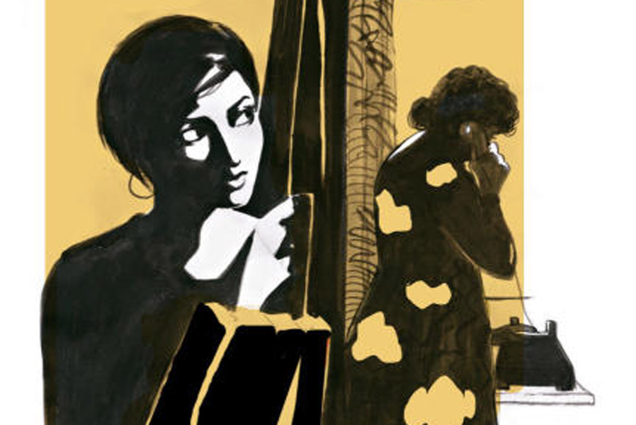

 
 <h1 align=center>সুখসন্ধ্যার পদাবলি</h1>
<h2 align=center>রমা সিমলাই</h2> দরজাটা খুলতেই এক ঝলক ঠান্ডা বাতাস আর মিষ্টি একটা গন্ধ হুড়মুড়িয়ে ঢুকে পড়ল। শীতের সন্ধ্যা ছ’টাতেই বেশ ঘন হয়ে ওঠে। শরীরটা জুতের নয় বলে আজ অফিসে যাননি শারদীয়া।

“কে রে পারুল?” সোফায় বসেই গলাটা একটু তুলে জানতে চান।

পারুল এসে একটু ইতস্তত করে, “বলছে তো পাপানদাদার বন্ধু! কখনও দেখিনি আগে। বললাম, পাপানদাদা বাড়িতে নেই। বলছে তোমাকেই দরকার।”

“আচ্ছা, ভেতরে ডাক। বাইরে দাঁড় করিয়ে রেখেছিস কেন?”

শারদীয়া একটু ব্যস্ত হয়ে পড়েন। তত ক্ষণে মেয়েটি নিজেই ঢুকে এসেছে, “আমি ঐশী। আপনার সঙ্গে একটু দরকারি কথা ছিল!”

বেশ প্রত্যয়ী মেয়েটি। হালকা টি-শার্ট আর কালো ডেনিমে শ্যামলা মেয়েটিকে পাপানের বন্ধু হিসেবে মেনে নিতে কষ্ট হয় না শারদীয়ার। “এসো এসো। এখানে বোসো,” মিষ্টি হাসিতে ওকে আপ্যায়ন করেন শারদীয়া। “আগে বলো, চা না কফি!”

“চা খেতে পারি,” স্বচ্ছন্দ হয়ে ওঠে ঐশী। পারুলের দিকে তাকাতেই পারুল ভুরু নাচিয়ে জিজ্ঞেস করে, “তুমিও খাবে না কি? এই তো খেলে!’’

“করবি যখন দে হাফ কাপ,” একটু যেন আবেদনের ভঙ্গি, ঐশী অবাক হয়। ঐশীর দিকে তাকিয়ে হাসেন শারদীয়া, “বার বার খাই তো, তাই পারুল শাসন করে আর কী!”

ঐশী ভিতরে ভিতরে নিজেকে গুছিয়ে নেয়, “আসলে পাপানের বন্ধু হলেও আমি অন্য একটা কাজে আপনার কাছে এসেছি। আমি ফেসবুকে আপনার ফলোয়ার। আপনার লেখার খুব ভক্ত। আপনার সব ক’টি বই আমার সংগ্রহে আছে।”

শারদীয়ার গলায় স্নিগ্ধ উচ্ছ্বাস, “ও মা! তাই বুঝি!” ঐশী মাথা নাড়ে, হাসে। তার পর শারদীয়ার চোখে চোখ রাখে, “আমার একটা ছোট অনামী পত্রিকা আছে, তাতে আপনার একটা ইন্টারভিউ চাই।”

“কিন্তু আমি তো...” শারদীয়ার জড়সড় বক্তব্য শুরুতেই থামিয়ে দেয় ঐশী, “হ্যাঁ, আমি জানি আপনি এগুলো পছন্দ করেন না। তাই কবিতা, গল্প, ফেসবুকের দু’-একটা পোস্ট ছাড়া আপনাকে কোথাও পাওয়া যায় না। আপনি কি সুচিত্রা সেনের মতো নিজেকে রহস্যময়ী করে রাখতে চান!” একটু যেন আক্রমণাত্মক মেয়েটি। শারদীয়া হাসেন, “তুমি তো খুব রাগী টিচার! শুরুতেই এত কঠিন প্রশ্ন!”

লজ্জা পেয়ে যায় ঐশী, “স্যরি, আমি সে ভাবে বলতে চাইনি ম্যাম।”

“আরে তুমি এত ফর্মাল হচ্ছ কেন!” পারুলের আনা চা ঐশীর দিকে এগিয়ে দেন শারদীয়া। চায়ে চুমুক দিয়ে প্রশ্নে ফেরে ঐশী, “আপনি যা বলেন বা যা লেখেন, মানে আপনার প্রগতিশীল চিন্তাভাবনা, যা দেখে আমরা মুগ্ধ হই, সেটা কি আপনার বিশ্বাস, না কি জনপ্রিয়তার শিখরে ওঠার লিফট?”

ঝর্নার মতো হেসে ওঠেন শারদীয়া। ঐশীর পেশাদার আচ্ছাদনটি একটু একটু করে গলতে শুরু করেছে। দেখতে মহিলা সত্যিই খুব সুন্দরী! এই বয়সেও আশ্চর্য স্নিগ্ধ। আজ তো একটু অসুস্থ। কোনও মেকআপ নেই। তাও বেশ সুন্দরী। 

শারদীয়া হাসি থামিয়ে বলেন, “জীবনের অন্তত এই জায়গাটিতে আমি সৎ থাকার চেষ্টা করি, বাবু। যা লিখি বিশ্বাস থেকেই লিখি।”

ঐশীকে মুগ্ধতায় পেয়ে বসছে একটু একটু করে। বিশ্বাসটা গাঢ় হচ্ছে চেষ্টা না করেও। শারদীয়ার এই ‘বাবু’ ডাকটা খুব জনপ্রিয় ফেসবুকে। ঐশীরও খুব ভাল লাগছে ডাকটা। নিজেকে শাসন করে ঐশী, ‘হচ্ছেটা কী তোর! এই ধরনের কর্পোরেট লেডিরা খুব দামি মুখোশ ব্যবহার করে। সহজে ভেদ করা যায় না।’

কথা বলতে বলতে থেমে যান শারদীয়া। তাঁর মোবাইল বেজে উঠেছে, “এক্সকিউজ় মি, অফিস থেকে ফোন। আসছি এখনই...” ফোনটা কানে নিয়ে সোফা ছেড়ে ঘরের দিকে এগোন।

কী সুন্দর হাইট ভদ্রমহিলার! ঐশী পেছন থেকে ভাবে। হঠাৎই তার মাথায় একটা বদমাইশি খেলে যায়। চার দিক সন্তর্পণে দেখে নিয়ে উঠে দাঁড়ায়। পিছু নেয় পায়ে পায়ে।

“কী করেছিস এমন যে বস চার্জশিট দেওয়ার কথা ভাবছে?” পর্দার বাইরে দাঁড়িয়ে শারদীয়ার স্পষ্ট কণ্ঠস্বর শুনতে পায় ঐশী। “আমাকে পুরো ঘটনাটা বল, বাবু!” শারদীয়া অনেকখানি দরদ ঢেলে দেন ফোনে। ঐশী সতর্ক হয়, তবু অনৈতিক কাজটা থেকে নিজেকে সরাতে পারে না।

“আচ্ছা আমি দেখছি। তুই চিন্তা করিস না।” শারদীয়ার কথার শেষটুকু শুনে ঐশী ফিরে আসার চেষ্টা করেও দাঁড়িয়ে যায়, শারদীয়া অন্য কাউকে ফোনে ট্রাই করছেন।

“হ্যাঁ, মিস্টার ঘোষ, আয়ুষের ব্যাপারটা নিয়ে চার্জশিট ইস্যু করবেন না প্লিজ়। আমাকে জয়েন করতে দিন।” উল্টো দিকের গলা শুনতে পায় না ঐশী। বরং শারদীয়ার কঠিন সংযত কথাগুলো অনায়াসে এসে ঐশীকে ছুঁয়ে দেয়, “আহা, বাচ্চা ছেলে। নিজেদের এই বয়সটা মনে করুন মিস্টার ঘোষ! আমি কাল গিয়ে খুব বকে দেব। নতুন চাকরি। একটু এনজয় করতে দিন। কথায় কথায় প্লিজ় এত শাসন করবেন না।”

শারদীয়া ফোন ডিসকানেক্ট করতেই ঐশী দ্রুত সোফায় এসে বসে। কিছু ক্ষণের মধ্যেই স্মিতমুখে ফেরেন শারদীয়া, “স্যরি, তোমাকে অনেক ক্ষণ বসিয়ে রেখেছি।”

ঐশীও হাসে, “নো প্রবলেম ম্যাম। আমি সময় নিয়েই এসেছি।”

এই মুহূর্তে ঐশী নিজের বসের কথা ভাবে, সব সময় খড়্গহস্ত! আর এঁকে দেখো! নরম হয়ে পড়ছে ঐশী। নিজেকে শাসন করতেও ভুলে যাচ্ছে।

“পারুল!” ডাকেন শারদীয়া। পারুল এসে দাঁড়ায়। শারদীয়া বলেন, “তা হলে তুই বেরিয়ে যা পারুল। বাড়িতে অসুস্থ লোকটা একা আছে সারা দিন, আর আমার ব্যাগ থেকে টাকা নিয়ে যা। বাবার জন্য দোসা কিনে নিয়ে যাস। তোরও নিস।”

পারুল একটা ভারী কার্ডিগান এনে হাতে দেয়, “এটা গায়ে দিয়ে নাও, ঠান্ডা পড়ছে।”

পারুল বেরিয়ে গেলে শারদীয়া ভিতু-ভিতু মুখ করে তাকায় ঐশীর দিকে, “আবার তোমার কঠিন কঠিন প্রশ্ন। বলো দেখি।”

এই প্রথম হেসে ফেলে ঐশী।

“আরে, তোমাকে কেউ বলেনি, তোমার হাসিটা খুব সুন্দর?” শারদীয়া হাসেন। ঐশীর মুখটা ভার হয়ে যায়, চুপ করে যায়। লক্ষ করেন শারদীয়া, “ইজ় এনিথিং রং, বাবু?’’

“আপনি সত্যিই খুব ভাল ম্যাম,” ঐশী মেঘলা মনটাকে সরিয়ে দেয়।

“তুমিও খুব ভাল!”

“আপনার জীবনে কোনও সমস্যা নেই, না ম্যাডাম!” ঐশী নিবিড় হয়।

মাথা হেলিয়ে হাসেন শারদীয়া, “কী করে জানলে!”

“এত বড় চাকরি করেন। এত সুন্দর ফ্ল্যাটে থাকেন, কত ফ্যান ফলোয়ার আপনার!” ঐশীর কণ্ঠস্বরে মেয়েলি ঈর্ষার ছোঁয়া। টের পান অভিজ্ঞ শারদীয়া। বলেন, “আপত্তি না থাকলে তুমি আমাকে তোমার সমস্যার কথা বলতে পারো।”

একটু ইতস্তত করে ঐশী, “কী হবে শেয়ার করে? আপনি কি সল্ভ করতে পারবেন?”

খোঁচাটা গায়ে মাখেন না শারদীয়া, “হয়তো পারব না। তবে আমার বয়স আর অভিজ্ঞতা তোমার থেকে বেশি। তাই হয়তো ফ্রেন্ডলি অ্যাডভাইস দিতে পারি।”

ঐশী কিছু না বলে তাকিয়ে থাকে শারদীয়ার দিকে। শারদীয়া হাসেন, “থাক, নিজেকে জোর কোরো না। বরং বন্ধুদের সঙ্গে আলোচনা করো। দেখবে, যেটাকে সাংঘাতিক কিছু মনে হচ্ছে, সেটা হালকা হয়ে যাবে।”

“আমার এক জন স্টেডি বয়ফ্রেন্ড আছে,” কিছুটা যেন মরিয়া হয়ে ওঠে ঐশী।

“খুব স্বাভাবিক ঘটনা, এখানে সমস্যা কোথায়?”

“আমরা দু’জনেই এখনও সেট্লড নই,” ঐশীর আওয়াজটা নরম হয়ে আসে। শারদীয়া বুঝতে পারেন, ঐশী এখনও আসল সমস্যায় ঢুকতে পারছে না। ঐশী টেবিলে রাখা বোতল থেকে জল খায়, লিপস্টিক বাঁচিয়ে। তার পর মাটির দিকে তাকিয়ে বলে, “আমি কনসিভ করেছি!”

ঐশী চোখ তুলে তাকায় শারদীয়ার দিকে। স্পষ্ট চাউনি! শারদীয়া মেয়েটাকে দেখেন। সাহসী, প্রত্যয়ী, একটু দিশেহারা। উঠে পাশে গিয়ে বসেন, “ভুল করে ফেলেছ একটা। সাবধান হওয়া উচিত ছিল। যাই হোক, সামলে নিতে হবে। মা-বাবাকে জানিয়েছ?”

মাথা নেড়ে ‘না’ বলে ঐশী। শারদীয়া আবার জিজ্ঞেস করেন, “বয়ফ্রেন্ড কী বলছে!”

ঐশী একটু চুপ করে থেকে বলে, “খুব টেনশনে আছে।”

“টেনশনে থেকে তো আর প্রবলেম সল্ভড হবে না। তোমাদেরই সাহসী হতে হবে...”

শারদীয়াকে মাঝপথে থামিয়ে দেয় ঐশী, “আপনি থাকবেন আমাদের সঙ্গে?”

“কেন থাকব না! সবাই মিলে ঠান্ডা মাথায় একটা পজ়িটিভ ওয়ে আউট বার করতে হবে।”

“আমি বেবি অ্যাবর্ট করব না,” ঐশী জেদি শব্দ ক’টি ছুড়ে দিয়ে শারদীয়াকে তীব্র দৃষ্টিতে পরখ করে।

“না না, তা কেন! তুমি বরং আমাকে তোমার বয়ফ্রেন্ডের নাম্বারটা দাও। দরকার হলে ওর বাবা-মায়ের সঙ্গে কথা বলতে হবে। কিন্তু মা হওয়ার জন্য তোমাকে শক্ত হতে হবে, সাহসী হতে হবে।”

ঐশীর দু’চোখে জল নয়, আগুন, “আমি যে কোনও সমস্যার মুখোমুখি হতে রাজি।”

“ব্যস! মিটে গেল। বাকিটা আমরা সবাই মিলে সামলে নেব।”

ঐশী অবাক হয়, ঘণ্টা তিনেক আগেও ভদ্রমহিলাকে চিনত না।

শারদীয়া হাসেন, “দাও, তোমার বয়ফ্রেন্ডের নাম্বারটা দাও। ওর নাম কী বলো!”

“পাপান। আপনার ছেলে।” ঐশী যেন জেনেবুঝে পাহাড়ের চুড়ো থেকে ঝাঁপ দিল। ঘরের মধ্যে সময় যেন থমকে গেছে! একটা নির্বাক কষ্টে আচ্ছন্ন শারদীয়া। হতভম্ব দৃষ্টিতে তাকিয়ে আছেন ঐশীর দিকে। এই ঠান্ডাতেও কপালে ঘামের বিন্দু।

শান্ত অথচ তীক্ষ্ণ ঐশী, “দেখছেন তো, নিজের বেলায় মানতে পারছেন না। কষ্ট পাচ্ছেন।”

“হ্যাঁ, আমার কষ্ট হচ্ছে। ভীষণ কষ্ট হচ্ছে। কিন্তু তুমি যা ভাবছ, তা নয়। আমি মানতে পারছি না, পাপানের সঙ্গে আমার এতখানি দূরত্ব তৈরি হয়ে গেছে! আমার পাপানকে মানুষ তৈরি করায় এত বড় ফাঁক রয়ে গেল! যে কথাটা আমার ছেলের আমাকে এসে বলা উচিত, সে কথাটা আমাকে আর কারও মুখ থেকে শুনতে হবে!”

শারদীয়ার গলার আওয়াজটা বোধহয় একটু কেঁপে গেল, অন্তত ঐশীর তাই মনে হল। সামনে বসা মানবীটিকে এই মুহূর্তে সত্যিই দেবী মনে হচ্ছে ঐশীর। নিজেকে সামলে নিলেন কয়েক মুহূর্তের মধ্যেই শারদীয়া, ঐশীর মতে দামি মুখোশের আড়ালে থাকা কর্পোরেট লেডি! পুরনো মিষ্টি হাসিটা ফিরে এসেছে শারদীয়ার লিপস্টিকহীন ঠোঁটে, “ঠিক আছে। পাপানের সঙ্গে বোঝাপড়াটা পরে হবে। তুমি তোমার বাড়ির ঠিকানা আর বাবার ফোন নাম্বারটা দাও। আমি রবিবার তোমার বাড়ি যাব। যত তাড়াতাড়ি সম্ভব তোমাকে এখানে এনে ফেলার ব্যবস্থাটা করে ফেলতে হবে তো!”

ঐশী কিন্তু আর একটাও কথা বলছে না। তার দু’চোখে পরিপূর্ণ মুগ্ধতা আর বিস্ময়।

শারদীয়া হাসছেন, “দেখলে তো, সমস্যা শেয়ার করলে অনেক হালকা হয়ে যায়!”

“আজ থেকে আজীবন আমি খুব হিংসে করব পাপানকে, ম্যাম। শুধু আপনার মতো মায়ের ছেলে বলে। আর এক দিন আসব পাপানের সঙ্গে দেখা করতে। আমি পাপানকে চিনি না। শুধু ফেসবুকে আপনার পোস্টে পাপানের নাম আর বয়স সম্বন্ধে ধারণা পেয়েছি, ছবি দেখেছি। আমি প্রেগন্যান্টও নই। বন্ধুদের সঙ্গে চ্যালেঞ্জ করে এখানে এসেছিলাম, আপনার অতি ভালমানুষির, প্রগতিশীলতার মুখোশ ছিঁড়ে ফেলতে। সবাইকে বলেছিলাম, দেখিয়ে দেব, আসলে এত ভাল কেউ হতে পারে না। আমি নিজের পরাজয় গ্ল্যাডলি অ্যাকসেপ্ট করলাম, ম্যাম। আজ আমি খুব খুশি! আমার চেনা এ রকম এক জন মানুষ তো আছেন, যিনি বিশ্বাসে আর ব্যক্তিগত জীবনে একই বিন্দুতে অবস্থান করেন।”

এক নিঃশ্বাসে কথাগুলো বলে ঐশী ঝুঁকে প্রণাম করতে যায় শারদীয়াকে। তিনি বুকে জড়িয়ে ধরেন ঐশীকে, বলেন, “এই জন্য তো নিউ জেনারেশনকে আমি এত রেসপেক্ট করি! তোরা সব কিছু যাচাই করে নিতে শিখেছিস!”

“‘বাবু’ বললে না তো!’’ শারদীয়ার বুকে মাথা রেখে আদুরে গলায় বলল ঐশী।