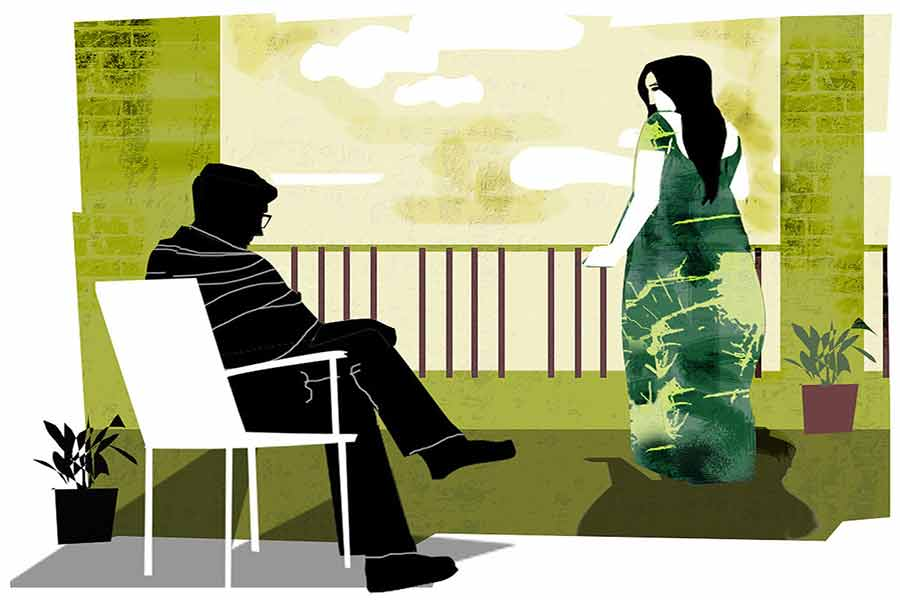

 
 <h1 align=center>সুখের ঠিকানা</h1>
<h2 align=center>অভিজিৎ তরফদার</h2> 

লক খুলে ভিতরে ঢুকল মিঠি। শব্দ হল। দরজা খোলার শব্দ। মিঠির পায়ের শব্দ। আমাকে খুঁজল। ভিতরে না পেয়ে ব্যালকনির দিকে এল। বেতের চেয়ারে বসে সন্ধে হওয়া দেখছিলাম। মোড়া টেনে কাছে বসল।

“কী করছ?”

কী জবাব দেব! কিছুই করছিলাম না। না-করার কোনও ভাষা হয় না। আকাশে মেঘ, উড়ন্ত চিল, রোদ্দুরের ম্লান হয়ে আসা। অথচ এ সব যে দেখছিলাম, তা-ও নয়। হয়তো ভাবছিলাম। কী ভাবছিলাম! নির্দিষ্ট কিছু নয়। মিঠি কি এত কিছুবুঝতে পারবে!

“চা খেয়েছ?”

জবাব দেওয়ার মতো একটা কিছু পেয়ে ঘাড় নাড়লাম।

“খাওয়া হয়নি।”

“বোসো। করে আনছি চা।”

মিঠি উঠে গেল। সপ্তাহ দুই আগে ডুপ্লিকেট চাবিটা দেওয়ার পর থেকে ও যখন-তখন আসে। কিছু ক্ষণ থাকে। এলোমেলো কথা বলে। কিছু শুনি। বেশিটাই শুনি না। চা করে খাওয়ায়। খাবার গরম করে দেয়। তার পর যেমন এসেছিল,চলে যায়।

দু’কাপ চা হাতে নিয়ে মিঠি ঢুকল। সঙ্গে প্লেটে চানাচুর।

“হাত লাগাও। খেতে খেতে কথা বলো...” বলে মিঠি।

চায়ে চুমুক দিলাম। মিঠির দিকে তাকালাম। পূর্ণিমার চাঁদের মতো রঙের একটা তাঁতের শাড়ি পরেছে মিঠি। ভাল দেখাচ্ছে ওকে।

“কী দেখছ?” ব্লাশ করল মিঠি।

বলা যেত, তোমাকে। খুশি হত মিঠি। কেন যেন মন রাখা কথা বলতে ইচ্ছে করল না।

কিছু ক্ষণ চুপ করে থেকেমিঠে জিজ্ঞেস করল, “কবে দেবেকিছু বলল?”

“হ্যাঁ। কাল সকাল দশটা নাগাদ।”

হঠাৎ যেন কথা ফুরিয়ে গেল।

সিনেমার মতো একটার পর একটা দৃশ্য ভেসে বেড়াতে লাগল চোখের সামনে। ছ’মাস। ঠিকমতো হিসেব করলে ছ’মাস ন’দিন।

তিথি এমনই এক বিকেলে গলার কাছে শক্ত একটা ডেলা দেখতে পেয়ে ছুটে এসেছিল, “দেখো তো এটা কী!”

টেপাটিপি করে বুঝতে না পেরে জিজ্ঞেস করেছিলাম, “ব্যথা আছে?”

“না, কিছুই নেই। ক্রিম লাগাতে গিয়ে হাতে লাগল। খারাপ কিছু?”

“কী করে বলব? আমি কি ডাক্তার?” বুঝতে পারিনি কী বলব।

এক রকম জোরজার করেই নিয়ে যাওয়া হল ডাক্তারের কাছে। ডাক্তার কিন্তু দেখেশুনে গম্ভীর হয়ে গেল। কিছু খুচরো পরীক্ষা করতে দেওয়া হল। রক্ত, আরও কী কী সব। তার পর বায়োপসি। ভর্তি হতে হল। দিন কয়েক পর রিপোর্ট পেয়ে ডাক্তার ডেকে পাঠালেন।

“খিদে পেয়েছে? খাবে কিছু? করে আনব?”

মিঠির দিকে তাকালাম।

“যা তাড়াতাড়ি চানাচুরগুলো খেলে, মনে হল খাওয়া হয়নি তোমার। দুপুরে খেয়েছিলে কিছু?”

জবাব দিচ্ছি না দেখে মিঠে উঠে গেল। ফ্রিজ খোলার শব্দ। রান্নাঘরে ছ্যাঁকছোঁক। তত ক্ষণে অন্ধকারের চাদর ঢেকে দিয়েছে ব্যালকনি। ড্রয়িংরুমে এসে বসলাম।

“নাও, পনির পকোড়া। ফ্রিজে ছানা ছাড়া আর কিছু তো দেখলাম না। বাজার করিয়ো কাল। রান্নার মাসি দেখতে পায় না?”

পকোড়ার সঙ্গে সেকেন্ড রাউন্ড চা। রিমোট টিপে অন করলাম টিভি। পথ অবরোধ, পুলিশের সঙ্গে ধস্তাধস্তি, জামায় রক্তের দাগ। চ্যানেল পাল্টালাম। ব্যাঙ্ক ডাকাতি, চাকরি চুরি, গণধর্ষণ, টিভির স্ক্রিন বেয়ে রক্তের ধারা নামছে।

টিভি বন্ধ করে দিলাম। দেখলাম উল্টো দিকে মিঠি এসে বসেছে।

“এ বার যাই। এর পর রাস্তায় লোক চলাচল কমে আসবে। সন্ধের পর মোড়ের পার্কটায় সাট্টা-গাঁজার ঠেক বসে। একলা কোনও মেয়েকে দেখলেই হাত ধরে টানাটানি করে।”

কথাটা মিথ্যে নয়। খালি কাপ-প্লেট সিঙ্কে নামিয়ে আবার সোফায় এসে বসল।

“শুনলে কথাটা? এ বার তো যেতে হবে!”

কী মনে হল, হঠাৎ বলে ফেললাম, “না গেলে?”

মুখ টিপে হাসল মিঠি। উঠে গেল রান্নাঘরে। বাসনের শব্দ পেলাম।

বাথরুমে জলের আওয়াজ। চাদরে শরীর ঢেকে সকালের কাগজে ফেলে আসা খবরের টুকরোয় চোখ বোলাচ্ছি। ছিটকিনি খোলার শব্দ। মিঠি স্নান সেরে বেরিয়ে এল। পরনে নাইটি। সবুজ হলুদ কলকা করা নাইটি। লখনউ থেকে যেটা তিথির জন্য এনেছিলাম। এক ঝলক দেখে বুকের মধ্যে ছ্যাঁত করে উঠেছিল! ঠিক যেন তিথি! কিন্তু তিথি এখানে কোথা থেকে আসবে! এ তো তিথির নাইটিতে গা ঢেকে মিঠি।

চেনা গন্ধ! সেই পারফিউম! এটাও আমার আনা। সিঙ্গাপুর থেকে নিয়ে এসেছিলাম তিথির জন্য।

সরে গিয়ে জায়গা করে দিলাম। চাদরের ভিতর নিজেকে গুঁজে দিল মিঠি। ঠোঁটে হাসি। হাসিতে রহস্য।

“আমি কিন্তু বলিনি!”

কথাটা বুঝতে না পেরে মিঠির দিকে তাকালাম।

চাদরে মুখ ঢাকল মিঠি, বলল, “থেকে যাওয়ার কথা!”

*****

বাড়ি থেকে মেট্রো-স্টেশন হাঁটা পথ। হাসপাতালও মেট্রো-স্টেশনের গায়ে। মেট্রো হওয়ায় খুব সুবিধে হয়েছে। যাতায়াতের দূরত্ব কমে গেছে,সময়ও বাঁচে।

টিকিট কাটতে কাটতে মনে পড়ল, সকাল-সকাল উঠে চলে গিয়েছে মিঠি। যাওয়ার আগে একটা প্রশ্ন করেছিল, “আমার কথা কি ওকে আজ বলবে?”

প্রশ্নটা মাথা থেকে যায়নি। পুরো রাস্তা এই প্রশ্নটাই আমাকে সঙ্গ দেবে।

ট্রেনের অ্যানাউন্সমেন্ট হল। যারা বসেছিল, উঠে দাঁড়াল।

তিথি আর মিঠি। মিঠি তিথির চেয়ে দশ বছরের ছোট। বিয়ের সময় মিঠি চোদ্দো বছরের কিশোরী। ঝাঁকড়া চুলের নীচে জ্বলজ্বলে চোখ। চিরুনি, পার্স, চশমা... জামাইবাবুর যা হাতের কাছে পেত, লুকিয়ে রাখা ছিল মিঠির অভ্যেস। মূল্য ধরে না দিলে জিনিস ফেরত পাওয়া যেত না।

সিগন্যাল লাল থেকে সবুজ হল। দূরে ট্রেনের আলো।

সেই মিঠি হায়ার স্টাডিজ়ের জন্য প্রথমে দিল্লি, তার পর অস্ট্রেলিয়া চলে গেল। ন’মাসে ছ’মাসে আসা। যোগাযোগ সুতোয় ঝুলতে লাগল। মনের ভিতর মিঠির জায়গাটা ঝাপসা হতে হতে এক সময় মুছে গেল।

প্ল্যাটফর্ম কাঁপিয়ে ট্রেন এসে দাঁড়াল। হুড়োহুড়ি ভিড়। ভিতরে ঢুকে উল্টো দিকের দরজার কাছে একটু ফাঁকা পাওয়া গেল।

ডাক্তারবাবু আমাদের জন্যই বসেছিলেন। ঢুকতেই উঠে এলেন দরজা অবধি। একটা খারাপ খবর ভাঙতে ডাক্তারকেও কতখানি নেমে আসতে হয়, সে দিন দেখেছিলাম।

সরাসরিই বললেন, “বায়োপসি রিপোর্টে যা আশঙ্কা করেছিলাম, তাই বেরিয়েছে। ক্যানসার। তবে আজকাল এর ভাল চিকিৎসা বেরিয়েছে। অশেষের কাছে পাঠিয়ে দিচ্ছি। ডাক্তার অশেষ মিত্র ক্যানসার চিকিৎসার শেষ কথা। আজই গিয়ে দেখা করুন।”

ট্রেন যত গন্তব্যের দিকে এগোচ্ছে, ভিড় পাতলা হয়ে আসছে। এক সময় বসার জায়গাও পাওয়া গেল। আমাকে যেতে হবে আরও খানিকটা। হয়তো একাই।

কেমো হল। রেডিয়েশনও। শান্ত ভাবে সমস্ত অ্যাকসেপ্ট করল তিথি। কখনও ভেঙে পড়তে দেখিনি। কেমোথেরাপির শুরুতে শরীর খারাপ করছিল, সেটাও সামলে নিল। চিকিৎসার শেষ দিকে এক দিন ডক্টর মিত্র ডাকলেন আমাকে... একা।

“আপনাকে একটা কথা জানানোর আছে।”

ডাক্তারবাবুর দিকে তাকালাম।

“অসুখটা ভাল নয়। কোনও চিকিৎসাতেই সাড়া মিলছে না, বরং ছড়াচ্ছে। চাইলে সেকেন্ড ওপিনিয়ন নিতে পারেন।”

নেওয়া হল সেকেন্ড ওপিনিয়ন, থার্ডও। ভিন রাজ্য থেকে ঘুরে আসা হল। ওপিনিয়ন বিশেষ পাল্টাল না।

ধড়মড় করে উঠে বসলাম। কখন স্টেশন এসে গেছে, খেয়াল করিনি! আর একটু হলেই দরজা বন্ধ হয়ে যেত। প্ল্যাটফর্মে পা রাখলাম। চলন্ত সিঁড়ি, আলো, কোলাহল, রাস্তা, হাসপাতাল।

তিথিকে নিয়ে যখন এই সব চলছে, এক দিন মিঠি এসে দাঁড়াল। তিনটে মহাদেশ আর চারটি সম্পর্ক পার করে মিঠির আসা। তিথির মুখে আবছা শুনেছি। একেবারে সামনে এসে দাঁড়াবে, বুঝতে পারিনি। বয়স বেড়েছে, চোখের সেই চাঞ্চল্য চলে গেছে। কিন্তু ভাল করে দেখলে বোঝা যায়— মিঠিই, অন্য কেউ নয়।

সেই সময় তিথির চিকিৎসা আর সংসার, দু’দিক সামলাতে হিমশিম খাচ্ছিলাম। মিঠি এসে সব দায় নিজের কাঁধে তুলে নিল। শেষ দিকটা তিথি কিছুই খেতে চাইত না। পাশে বসে মাথায় হাত বুলিয়ে একটু একটু করে খাইয়ে দিত মিঠি।

অন্যমনস্ক হয়ে গিয়েছিলাম। খেয়াল হতে দেখলাম, গেট পেরিয়ে হাসপাতালে ঢুকছি। মুখ চেনা সবার, গেটকিপার থেকে লিফ্টম্যান। সরে গিয়ে রাস্তা করে দিল।

সপ্তাহ দুই হল, হাঁটাচলা করতেও কষ্ট হচ্ছিল তিথির। ডাক্তারবাবু নিজেই সাজেস্ট করলেন, “আর বাড়িতে ম্যানেজ করতে পারবেন না। এ বার ভর্তি করে দিন।”

সেই থেকে হাসপাতালের ২৮০ নম্বর বেড তিথির ঠিকানা।

*****

মেডিকেল বোর্ড বসেছিল পরশু। অনেকে মিলে তিথিকে দেখলেন। সব শেষে আমাকে ডাকা হল।

“আমরা আর আশা দিতে পারছি না, পেশেন্টের যে কোনও মুহূর্তে ভেন্টিলেশন লাগবে।”

এই ভয়টাই পাচ্ছিলাম। হাঁপানির টান বেড়েছিল। দিনকয়েক ধরে অক্সিজেন দিয়েও লাভ হচ্ছিল না।

“ভেন্টিলেশনে দিলে ও সেরে উঠবে?” প্রশ্ন করি।

“না। যা আল্টিমেট, তাকে খানিকটা পিছিয়ে দেওয়া যেতে পারে, এই পর্যন্ত।”

“খানিকটা মানে কত দিন?”

“কেউ জানে না। কয়েক ঘণ্টা, হয়তো সপ্তাহখানেক।”

“আর না দিলে?”

“আজ-কালের মধ্যেই কিছু একটা হয়ে যেতে পারে।”

মিঠির সঙ্গে পরামর্শ করলাম। ভেন্টিলেশনে দিলে ক’টা দিন বেশি তিথিকে দেখতে পাব।

তিথিকে বললাম, “একটু বেশি করে অক্সিজেন দেওয়া হবে তোমায়, তাতে তুমি সুস্থ হয়ে উঠবে। চিন্তা কোরো না। আমি আর মিঠি পালা করে সকাল বিকেল দেখে যাব।”

আজ সেই দিন। আইসিইউ-তে শিফট করে দেওয়া হয়েছে তিথিকে। ঘিরে আছে নার্সরা। দু’জন ডাক্তারবাবু দেখে গেলেন। বড় বড় যন্ত্রপাতি টানাটানি করা হচ্ছে।

পাশে গিয়ে দাঁড়াতে হাত ধরল তিথি। নরম হাতের আঙুল। এই স্পর্শ কত দিনের চেনা! এখনও উত্তাপ জীবনের চিহ্ন প্রত্যাহার করে নেয়নি। শ্বাস নিতে-ছাড়তে কষ্ট হচ্ছিল তিথির। কথা বলছিল থেমে থেমে। বেরোনোর সময় মিঠি বলে দিয়েছিল। মিঠির কথাগুলো মনে পড়ছিল। তিথিকে, এই তিথিকে কি মিঠির কথা বলে ওঠা যায়? না-ই বা হল বলা! একটা সত্য, তার আড়াল, ওটুকু নিয়েই না হয়ে চলে গেল তিথি।

তিথি বলছিল, “ঠিকমতো খাওয়া-দাওয়া কোরো।”

“করব। চিন্তা কোরো না।”

“গোপালের মা দু’শোটা টাকা চেয়েছিল। বেরোবার সময় তাড়াতাড়িতে ভুলে গেছি।”

“ভেবো না। দিয়ে দেব।”

“গ্যাস ফুরিয়ে এসেছে। হঠাৎ বন্ধ হলে মুশকিলে পড়ে যাবে।”

“আজই বুক করে দেব।”

“ভোলাকে খেতে দিয়ো।”

ভোলা রাস্তার কুকুর। দু’বেলা পাতের এঁটোকাঁটা খাওয়াত তিথি। মনে পড়ল, দু’দিন খাওয়ানো হয়নি।

ডাক্তার, নার্স সবাই পাশে এসে দাঁড়িয়েছে। ইঙ্গিতে আমাকে বাইরে যেতে বলা হল। আমার মুঠোর মধ্যে এখনও তিথির হাতের আঙুল। এক বার চাপ দিয়ে মুঠো আলগাকরে দিলাম। তিথির হাত, ওর পরিচিত আঙুলগুলো শুভ্র বিছানায় খসে পড়ল।

বেরিয়ে আসছি, একটি অল্পবয়সি নার্স ছুটে এল।

“আপনাকে ডাকছেন।”

ফিরে গেলাম। ঠোঁট কাঁপছে তিথির। চোখের পাতায় জল। মুছিয়ে দিলাম। তার পর ঠোঁটের কাছে কান নিয়ে গেলাম।

“কিছু বলবে?”

“হ্যাঁ। অনেক ঝড়ঝাপটার মধ্য দিয়ে ওকে যেতে হয়েছে। দেখো, আর যেন কষ্ট না পায়। ওকে সুখে রেখো।”

