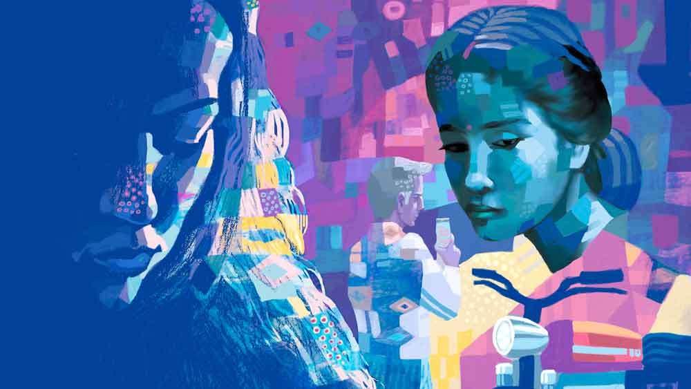

 
 <h1 align=center>সুপারি</h1>
<h2 align=center>প্রদীপ সামন্ত</h2> সকাল সকাল একেবারে লঙ্কাকাণ্ড! বাবা-ছেলে পারেও বটে! থেকে থেকে কী যে হয় ওদের। খিটিরমিটির লেগেই থাকে। রিমি রেগে যায়। কিন্তু সে যাবে না ও দিকে। ওরা মারামারি করে মরুক। এখন দম ফেলার জো আছে? অফিসের ভাত দিতে হবে। অফিসে আজকাল খুব কড়াকড়ি। এক মিনিট দেরি হলেই লাল কালি।

ভাত ফুটছে। অন্য ওভেন থেকে চায়ের সসপ্যান নামিয়ে তরকারি চাপায় রিমি। দু’টি কাপে চা নিয়ে টেবিলে রাখে। এক কাপ বিবাদক্লান্ত বেজার অমিতের দিকে এগিয়ে দিয়ে রিমি বলে, “কী হল আবার?”

অমিত বিরক্ত হয়ে বলল, “আর কী! তোমার পুত্তুর।”

রিমি বলে, “কী বলছে?”

অমিত চায়ের কাপ রেখে বলল, “সকালবেলার দামি ঘুম ভেঙে রাজপুত্র বাবার কাছে টাকার
জন্য এসেছে।”

“টাকা! কিসের টাকা?” রিমি আঁতকে ওঠে।

“বাইক কিনবে। সোজা বলে দিলাম, গ্র্যাজুয়েট হও। তার আগে ও সব কিছু নয়।”

রিমি বলল, “যা বলার বলে দিয়েছ। মাথা গরম কোরো না। কালকের খবরটা শুনেছ? ঝাড়খণ্ড না কোথায় যেন টাকার জন্যে ছেলে বাবাকে খুন করার সুপারি দিয়েছে। ভাবো এক বার!”

চা খেতে খেতে অমিত কাগজে চোখ বোলায়। খবরটা ছেপেছে। বিট্টুর সঙ্গে কথা কাটাকাটি না করলেই হত। সত্যি, দিনকাল ভাল নয়।

চা শেষ করে অমিত স্নানে গেল। তার আগে জামাকাপড় কাচা নিয়ে রিমির সঙ্গে এক প্রস্থ খুচরো ঝামেলা। মমতা ফি-রবিবার কাপড় কাচে। আসছে রবিবার সে আসবে না বলে আজই সব সাবানজলে ডোবাল রিমি। দরজার পিছনে অমিত অফিসফেরত জামা-প্যান্ট ঝুলিয়ে রাখে। রিমি তো প্যান্ট এনে বালতির জলে ভেজাবে, ভাগ্যিস অমিতের চোখে পড়ল। রে রে করে ঝাঁপিয়ে পড়ে রিমিকে আটকায়। প্যান্ট আজ কাচা চলবে না। রিমি অবাক। আবার কী সমস্যা! সকালবেলা বিট্টুর সঙ্গে ঝামেলা হল। রিমি আর নতুন অশান্তি চায় না। কী থেকে কী হয়! চুপচাপ হজম করে।

স্নান করতে করতে অমিত ভাবছে, এক চুল এ দিক-ও দিক হলে কী না হতে পারত! আঁতকে উঠল। বুক ধড়ফড় করছে। কী সর্বনাশ হতে যাচ্ছিল! প্যান্টের পকেট থেকে রিমি যদি পেয়ে যেত জিনিসটা? যাক বাবা, নিজেকে বাহবা দিল সে। জলের নীচে শিবলিঙ্গের মতো দাঁড়িয়ে থাকল অনেক ক্ষণ। বাথরুমে দেরি হচ্ছে দেখে রিমি ডাকল এক বার।

খেতে বসে অমিত খুব বেশি কথা বলল না। মেজাজটা ভাল নেই। প্যান্ট কাচা নিয়ে অমন রেগে গেল কেন, রিমি বুঝতে পারছে না। ইদানীং কারণে অকারণে মেজাজ চড়ে যাচ্ছে। বয়সও তো হচ্ছে। চুয়ান্ন হয়ে গেল তো। এই সময় সামলে না চললেই বিপদ। রিমি গম্ভীর হল। মনে মনে ভাবে, পুরুষমানুষ তো অমন গুম মেরে থাকবেই, বৌকেই তো মানিয়ে গুছিয়ে চলতে হবে। পাশে থাকতে হবে। প্রেশার বাড়েনি তো? বললে আবার রেগে না যায়। রিমি কায়দা করে বলল, “শোনো, আমার প্রেশার তো অনেক দিন চেক করা হয়নি। বাড়ল কি না কে জানে! ইদানীং মাথাটা ঘোরে। তুমিও চলো। এক সঙ্গে চেক করে আসি।”

অমিত হুঁ হুঁ করল শুধু।

বাড়ি থেকে বেরিয়ে অমিত বেশ জোরে পা চালায়। ভীষণ দেরি হয়ে গেছে। কিন্তু এ কী! এ তো আর এক অশান্তি। প্যান্টের পকেট হাতড়ে সে জিনিসটা তো পাচ্ছে না! বুকপকেটেও নেই। কী কাণ্ড! একে তো বড্ড দেরি হয়ে গেছে, তার উপর গোদের উপর বিষফোড়ার মতো প্যান্টের পকেট থেকে জিনিসটি হাপিস। ঘেমে নেয়ে যাকে বলে একশা!

তবে কি রিমি চোখের পলকে পকেট থেকে সরিয়ে ফেলল? ম্যাজিক না হাতসাফাই? অমিত চোখে সর্ষেফুল দেখে। এমন ভুল কী করে করল? কাল বাড়ি গিয়ে অন্য কোথাও সরিয়ে ফেলা উচিত ছিল। মারাত্মক ভুল। তার আর কিচ্ছু করার নেই। যা হওয়ার হয়ে গিয়েছে। বাড়ি ফিরে রিমির মুখোমুখি হবে কী করে? রাতের কথা ভেবে এখনই শিউরে ওঠে। প্রচণ্ড ঘামছে সে। বার বার ঘড়ি দেখে। সে আজ ঠিক সময়ে অফিসে ঢুকতেই পারবে না। ওই তো মেট্রো ঢুকছে। সিঁড়ি ভেঙে ট্রেন ধরা অসম্ভব। তবু সে হাল ছাড়ে না। লোকজনের ভিড় কাটিয়ে এগোয়। চলমান সিঁড়িতে উঠে পড়েছে। হয়ে যাবে মনে হচ্ছে। আচমকা সামনের মহিলা পায়ে আঁচল জড়িয়ে কী ভাবে যেন হোঁচট খেল। টাল সামলাতে না পেরে পড়ে যায়।

“সুইচ বন্ধ করুন, বন্ধ করুন!” লোকজন চেঁচিয়ে ওঠে। গেল গেল রব। থেমে গেল সিঁড়ি। চলে গেল ট্রেন। অমিত মনে মনে ভাবছে, আজ হয়ে গেল। ভাগ্যে আজ লাল কালি অবধারিত। তার বুকের ভেতরটা হায় হায় করে উঠল। সকাল থেকে কী না হচ্ছে তার সঙ্গে!

 সব কিছু আজ বেঠিক। বিট্টুর সঙ্গে সাতসকালে বাইক কেনার টাকা নিয়ে খিচিমিচি। রিমি বিনা নোটিসে তার প্যান্ট কাচতে নিয়ে গেল। জিনিসটা তো এখনও অবধি বেপাত্তা। এখন সিঁড়ি বন্ধ হয়ে মেট্রো মিস। অফিসে নির্ঘাত লেট। বিপর্যয়ের লম্বা লিস্ট অমিত মনে মনে আওড়াতে থাকে। সব কিছু ছাপিয়ে সকালবেলার ভয়ঙ্কর খবরটা আচমকা ভেসে উঠছে। সুপারি দিয়ে বাবাকে নিকেশ করার চেষ্টা। অমিত মানসচক্ষে দেখতে পাচ্ছে হাসপাতালে শুয়ে থাকা রক্তাক্ত প্রৌঢ়কে, হাসপাতালে শুয়ে কাতর ভাবে প্রার্থনা করছেন তার ছেলের যেন শাস্তি না হয়। অমিত খেয়াল করে, অচেনা ওই মৃত্যুমুখী প্রৌঢ়ের জন্য তার বুক টনটন করে উঠছে। চোখ ঝাপসা হয়ে আসে। রুমাল দিয়ে চোখ মুছে নেয় সে।

অফিসে এখন ডিজিটাল সিগনেচার চালু হয়েছে। মানে বায়োমেট্রিক। কম্পিউটারে লগ-ইন করে আঙুলের ছাপ দিলে সে দিনের মতো হাজিরা নিশ্চিত। মেশিন তার চোখ দিয়ে এক বার দেখলেই হবে। অমিত হাঁপাতে হাঁপাতে মেশিনের সামনে বসে হাজিরা দেওয়ার চেষ্টা করে। একেবারে শেষ মুহূর্তে হাজিরা দেওয়া সম্ভব হয়।

অমিত তো অবাক। খুব ভাল লাগছে তার। চোখ বন্ধ করে আরও একটি অলৌকিক ঘটনার জন্য অপেক্ষা করে সে। যদিও সে ভালই জানে এটা ‘হোপিং এগেনস্ট হোপ’। একেবারেই অসম্ভব। কারণ সে কাল ড্রয়ার থেকে বার করে ওটা প্যান্টের পকেটে ঢুকিয়েছে। কিছুতেই ওটা অফিসের ড্রয়ারে থাকতে পারে না। একদম স্পষ্ট মনে আছে। চোখে ভাসছে। তবু আতঙ্কগ্রস্ত অমিতের এই মুহূর্তে অলৌকিক ঘটনায় বিশ্বাস করতে ইচ্ছে করছে।

সোজা ড্রয়ারের সামনে বসে তড়িঘড়ি চাবি ঘুরিয়েছে। তার জীবণ-মরণ বুঝি লুকিয়ে রয়েছে ওই চৌকো ড্রয়ারের খোপে। পরের মেট্রোতে এসেও দশটা দশের মধ্যে অফিসে হাজিরা দিতে পেরেছে। অলৌকিক কাণ্ডই বটে! সে খুব করে চাইছে আরও একটি মির‌্যাকল ঘটুক। চোখ বন্ধ করে সে প্রার্থনা করে। তার পর চাবি ঘুরিয়ে ড্রয়ার টেনে খোলে।

 

হঠাৎই তার কালকের ঘটনা মনে পড়ে যায়। কেমন হালকা মিষ্টি সুগন্ধে ভরে ওঠে জায়গাটা। অমিত রোজই চাঁদনি চক মেট্রো স্টেশনে নামে। সেখান থেকে হেঁটে তার অফিস একটুখানি। এ দিক-ও দিক তাকায়। ভাবছে এমন মিষ্টি সুবাসের উৎস কী হতে পারে? অমিত লক্ষ করে, জনৈকা সুবেশা তরুণী ওর দিকেই এগিয়ে আসছে। এসে ওকে মিষ্টি করে ডাকে, “অমিতদা না? ও মা! আমি ভাবতেই পারছি না। কত দিন পরে দেখলাম তোমাকে!”

অমিত হতচকিত। বিস্ময়ে কেঁপে উঠল যেন! এ কাকে দেখছে সে? মেট্রো স্টেশন লাগোয়া পানবিড়ির গুমটির সামনে ভাল রকম ভিড় জমে গেছে। অমিত একটু তফাতে সরে যায়। অথৈ কলকল করতে করতে অমিতের পিছু নেয়।

অথৈ বলে, “অমিতদা, তোমার অফিস বুঝি এখানেই?”

অমিত বলল, “কাছেই। তুমি?”

অথৈ কাজলচোখে অদ্ভুত ভাবে তাকাল। তার পর বলল, “এখন তো অফিসে ঢোকার তাড়া। কথা বলার সময় নেই কারও। আগে ফোন নম্বরটা নিয়ে নিই দু’জনে দু’জনের...”

কথা শেষ না করেই ফুড়ুত করে অথৈ ভিড়ের মধ্যে হারিয়ে গেল। আচ্ছা পাগল মেয়ে তো! কত দিন পরে দেখা হল, ফোন নম্বরটা তো দিবি? তার আগেই কোথায় যে ভ্যানিশ হয়ে গেল! মনে হয় অমিতের সঙ্গে অথৈকে ওর অফিসের কেউ হয়তো লক্ষ করেছে। তাই ও ভিড়ের মধ্যে গা ঢাকা দিয়েছে। ফালতু কথা উঠবে অফিসে।

কত কী যে ঘটে জীবনে! অগত্যা অমিত অফিসের দিকে এগোয়। দু’পা এগিয়েছে কি এগোয়নি, অমনি পেছন থেকে চিল চিৎকার। অথৈ ডাকছে, “ও অমিতদা! আরে চলে যাচ্ছ কেন, দাঁড়াও না! আমি দৌড়তে পারছি না। উঃ! একদম হাঁপিয়ে গেছি।”

অফিসমুখো লোকজন পড়িমরি করে ছুটছে। তাদের ভিড় আর ধাক্কার স্রোত এড়িয়ে অমিত রাস্তার এক পাশে সরে আসে। জোয়ারের
সময় আড়াআড়ি নদী পেরোনোর মতো অথৈ শেষ পর্যন্ত অমিতের কাছে এসে পৌঁছয়।

অমিত বলল: ধাঁ করে কোথায় হারিয়ে গেলে?

অথৈ-এর হাতে ছোট্ট মতো দুটো প্লাস্টিক স্যাশে। দেখতে অনেকটা গুটখার স্যাশের মতো।

অমিত বলে, “তোমার হাতে ওটা কিসের প্যাকেট? গুটখা মনে হচ্ছে!”

অথৈ চটপট ফোন নম্বর দেওয়া নেওয়া সেরে নেয়। বলে, “ফোনে যোগাযোগ থাকবে। কথা হবে। ছবি— মেসেজ-ইমোজি চালাচালি হবে। আর দাঁড়াতে পারব না। ম্যানেজার ঘাড় ধরে তাড়িয়ে দেবে। আমার তো আর সুখের সরকারি অফিস নয়!”

অথৈ ডান দিকের গলিতে ঢুকে যাওয়ার আগে একটা ছোট্ট শ্যাম্পুর মতো স্যাসে অমিতের হাতে গুঁজে দিয়ে গেল। অবাক হলেও অমিত বলল, “কী এটা? আজকাল এই সবের নেশা ধরেছ বুঝি?”

চলে যেতে যেতে অথৈ পেছন ফিরে দাঁড়াল। ইঙ্গিতময় হেসে বলল, “মাঝবয়সি মহিলা। চাকরি করি। আরও কত কী নেশা করি, তার তুমি কী জানো অমিতবাবু? ক্রমশ প্রকাশ্য। টা-টা অমিতদা। এক দিন দেখা হবে। খাওয়া হবে। আর জমিয়ে অনেক গল্প। আজ আসি।”

অমিত বলল, “এই স্যাশে যে ধরিয়ে দিলে, এর পর আমার নেশা হয়ে যায় যদি?”

ও বলল, “তাতে কী আর হবে? নেশা করবে!”

অমিত লাগসই কথা খুঁজে পায় না তৎক্ষণাৎ। অথৈ চলে যায়।

অমিত স্যাসেটা ঘুরিয়ে ফিরিয়ে দেখে। মিষ্টি সুপারি। নাকের কাছে নিয়ে তার গন্ধ শোঁকে। এত ক্ষণে ঠাহর করতে পারে, মেট্রো স্টেশন থেকে বেরিয়ে অথৈ যখন ওর দিকে আসছিল এই গন্ধটাই পেয়েছে ও। অমিত সুপারির প্যাকেট পকেটে ঢুকিয়ে অফিসের দিকে এগোয়।

 

অমিত বর্তমানে ফেরে। ড্রয়ারের চাবি ঘুরিয়ে অমিত অন্যমনস্ক হয়ে পড়ছিল। এক লহমায় সে গতকাল অথৈ-এর সঙ্গে দেখা হওয়ার দৃশ্য রিওয়াইন্ড করে দেখে নিচ্ছিল।

সে ড্রয়ারের চৌখুপিটা টানতেই মিষ্টি গন্ধে ভরে উঠল চারপাশ। আবার ম্যাজিক। তার মানে জিনিসটি এখানেই কোথাও আছে। কিন্তু অনেক খুঁজেও সে পাচ্ছে না। কাগজ-কলম-চশমা ইত্যাদি সরিয়ে দেখছে। না, পাচ্ছে না তো? তবে কি অমিত গতকালের কথা ভাবছে, অথৈ-এর সঙ্গে দেখা হয়ে যাওয়ার কথা ভাবছে বলে ওই মিষ্টি গন্ধ পাচ্ছে? এও কি
হয় আবার?

তার এক বার মনে হল, ঠিকই তো। কাল অফিস ছুটির পর সে নিজেই পকেটে ঢুকিয়েছে ওটা। ড্রয়ারে থাকবে কী করে! আবার তার হাত-পা কাঁপতে শুরু করে। বাড়ি ফিরে রিমির মুখোমুখি হবে কী করে? রিমি ওটা ইচ্ছে করে লুকিয়ে রেখেছে। সন্ধেবেলা বলবে, ‘কী ব্যাপার, তুমি আজকাল এই সব নেশা ধরেছ? সিগারেট ছেড়ে দিয়ে এর খপ্পরে? জানো সুপুরি খেলে কিডনিতে পাথর হয়? নাকি কেউ দিচ্ছে আজকাল? কে সে? পুরনো বান্ধবী? ওল্ড ফ্লেম?’

নিজের মনে কী সব ভাবছে অমিত। সে এক-এক করে ড্রয়ারের সব কিছু টেবিলের উপর জমা করে। প্রচণ্ড ঘামছে সে। ওর উল্টো দিকের স্বদেশদা বলে, “কী হে ব্রাদার, কী হারালে? বাড়ির চাবিটাবি না কি? আরে অমন ঘামছ কেন? ওঃ বাবা, তুমি তো পাখার সুইচটাই দাওনি!”

স্বদেশবাবুর কথা শেষ হতেই জিনিসটি অমিত খুঁজে পেল। সব কাগজ ওলটপালট করে খুঁজে অবশেষে মিলেছে। হয়তো ভেবেছে পকেটে পুরে বাড়ি নিয়ে যাবে, শেষ অবধি ভুলে গেছে। এ রকম তো কতই হয়। স্বস্তির নিঃশ্বাস ফেলে সে। প্যাকেট তো নয়, এ যেন পরশপাথর! না, সে এই আপদকে আর রাখবে না। অশান্তির জিনিসকে এক্ষুনি বিদায় করবে। তবু ডাস্টবিনে ফেলতে গিয়েও ওর হাত ওঠে না। না, সে এটা ফেলবে না। রেখে দেবে। অথৈ দিয়েছে। অফিসের ড্রয়ারে এক কোণে লুকিয়ে রাখবে এটা। জগতের আর কেউ জানতেও পারবে না। তার আর একটা পৃথিবীর কথা।

অথৈ-এর দেওয়া মিষ্টি সুপারি সে অফিসের ড্রয়ারের এক কোণে লুকিয়ে রাখে। একে সে বাড়িতে বয়ে নিয়ে যাবে না। অথৈ-এর দেওয়া মিষ্টি সুপারি সে খাবে না।
খেলেই যে ফুরিয়ে যাবে! অফিসে লুকিয়ে রাখবে।

মিষ্টি সুপারি তাকে অন্য কোথাও নিয়ে যাচ্ছে। বিট্টুর কথা মনে হচ্ছে। সকালে তার কাছে খুব বকাঝকা খেয়েছে বেচারা ছেলেটা। ঘুমচোখে উঠে এসেছিল, মনখারাপ করে ফিরে গিয়েছে। অফিসের লোকজন কাগজের খবর নিয়ে আলোচনা করছে। সুপারি দিয়ে বাবাকে খুনের ঘটনা নিয়ে কথা হচ্ছে। বিষণ্ণতা ছেয়ে আসে। দুটো সুপারিতে কত তফাত!

অমিত ও সব ভাববে না। সে গোপন আনন্দের দিকে যেতে চাইছে। অথৈ-এর দেওয়া নম্বরে ফোন করে। ব্যস্ত আছে। আচ্ছা পরে আবার করবে। অমিত আকাশে উড়ছে। চারপাশে মিষ্টি সুবাস। শুধু এই গন্ধটাকে বাড়িতে নিয়ে যাবে না। এটাও এক ধরনের নেশা। অথৈ জানলে খুশি হবে যে অমিত তার সুপারির নেশায় ভেসে যাচ্ছে।

অফিসের ছুটির সময় হল। অমিত হাতমুখ ধুয়ে এসে এক গেলাস জল খেল। তার পর রিমিকে ফোন করল। রিমি অবাক হয়ে বলে, “কী গো হঠাৎ ফোন করছ কেন?”

অমিত অল্প হেসে উত্তর দেয়, “কেন তোমাকে ফোন করতে পারি না বুঝি?”

রিমি বলল, “ঢং, যত্তসব!” কিন্তু তার খুশির হাসি লজ্জার হাসি চাপা পড়ল না।

অমিত বলল, “বিট্টু কী করছে গো? কলেজ থেকে ফিরে ঘুমোচ্ছে? ওকে ডাকো। বলো ওকে আমি বাইক কিনে দেব।”