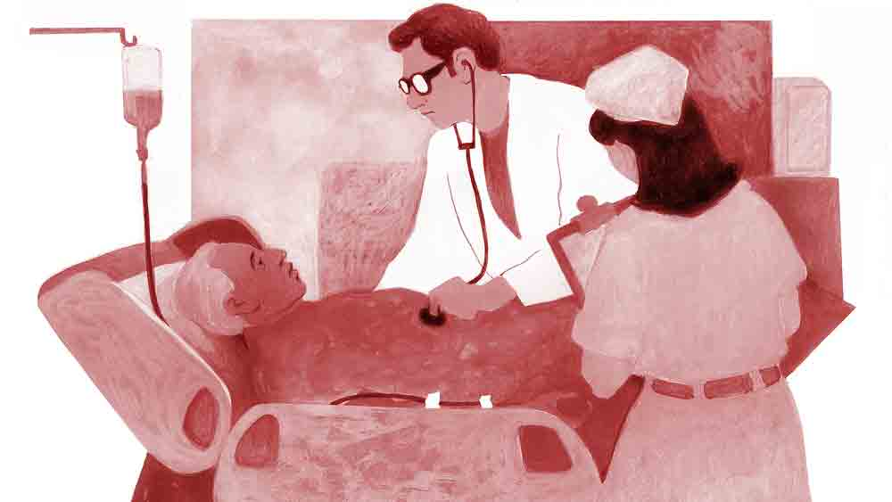

 
 <h1 align=center>সূর্যাস্তের আলো</h1>
<h2 align=center>সৌমিতা মুখোপাধ্যায়</h2> নতুন পেশেন্টের মুখটা দেখে চমকে উঠল শুভময়। মনের পর্দায় আছড়ে পড়তে লাগল একের পর এক স্মৃতি। এই অসুস্থ মানুষটিকে সে বহু বছর আগে থেকে চেনে। সে কোনও দিন স্বপ্নেও ভাবেনি যে অনিমেষ স্যরের সঙ্গে তার এত বছর পর এই ভাবে দেখা হবে। অনিমেষ স্যরকে চোখের সামনে মুমূর্ষু রোগীর মতো শুয়ে থাকতে দেখে তার বুকে একটা চাপা কষ্ট হচ্ছিল। দ্রুতপায়ে ওয়ার্ড থেকে বেরিয়ে এসে শুভময় নিজের কেবিনে ঢুকল। নিজের অজান্তেই বুক খালি করা দীর্ঘশ্বাস পড়ল তার।

অনিমেষ স্যর। নামটাই ছাত্রদের মধ্যে আতঙ্ক সৃষ্টি করার জন্য যথেষ্ট। শুভময়ের ইস্কুলের নামী অঙ্ক শিক্ষক ছিলেন অনিমেষবাবু। অঙ্ক শুভময়ের খুবই অপছন্দের ছিল। অনিমেষবাবুর ক্লাসে শুভময়ের বিরক্ত লাগত। অনিমেষ স্যর তখন হৃষ্টপুষ্ট এক জন মধ্যবয়সি মানুষ। রাগী এবং গম্ভীর। অমনোযোগী ছেলেদের তিনি দেখতে পারতেন না। কড়া শাস্তিও দিতেন।

নার্সের কথায় শুভময়ের সংবিৎ ফিরল, “স্যর, বাড়ি যাবেন না?”

“না, আজ থেকে যাব। দরকার হতে পারে।”

“ওয়ার্ড বয় সন্তোষকে বলে দেব? আপনার রাতের খাবারের জন্য?”

“থাক। আজ তেমন খিদে নেই। সন্তোষকে কিছু বলতে হবে না।”

নার্স চলে গেলে শুভময় আবার ভাবনায় ডুবে গেল। আজ অনিমেষবাবুকে দেখে অনেক কাল আগেকার একটা ঘটনা তার চোখের সামনে বার বার ভেসে উঠছে...

 

“শুভময় শোন, এই অঙ্কটা বোর্ডে এসে করে দিয়ে যা...” ঠান্ডা গলায় অনিমেষ স্যর নির্দেশ দিয়েছিলেন।

বাকি ছেলেরা সে দিন হাঁপ ছেড়ে বেঁচেছিল। ফাঁড়াটা তার মানে আজ শুভময়ের উপর দিয়েই গেল। শুভময় অনিমেষবাবুর ক্লাসের দুর্বল ছাত্র, অঙ্কে নিদারুণ কাঁচা, সহজে আজ সে ছাড় পাবে বলে মনে হয় না।  প্রায় পরীক্ষায় অঙ্কে লাল কালির দাগ পাওয়া শুভময় অঙ্কটা করতে ল্যাজে গোবরে হবে, আর ক্লাসের ঘণ্টাও পড়ে যাবে। শুভময়ের করুণ অবস্থা দেখে অনেকেই মনে মনে হেসেছিল।

শুভময়ও ভালই জানত, অঙ্কটা সে পারবে না। না পারার শাস্তি কী হতে পারে, এই ভেবেই তার হাত-পা ঠান্ডা হতে শুরু করে দিয়েছিল।

দুরুদুরু বুকে শুভময় বোর্ডের দিকে এগিয়ে গিয়ে চকখড়ি হাতে তুলে নিল। হাত কাঁপছে। সে মনে মনে প্রার্থনা করতে লাগল, যেন শিগগিরি ক্লাস শেষের ঘণ্টা পড়ে যায়, না হলে তার কপালে অশেষ দুঃখ। কিন্তু দাঁড়িয়ে দাঁড়িয়ে খানিকটা সময় নষ্ট করার পরেও ঘণ্টা পড়ল না।

অনিমেষ স্যর বুঝতে পেরে গিয়েছিলেন যে অঙ্কটা শুভময় পারবে না। রক্তচোখে তাকিয়ে দাঁত কিড়মিড় করে শুভময়কে বললেন, “বেরিয়ে যা আমার ক্লাস থেকে। কিচ্ছু হবে না তোর। যে অঙ্কে শূন্য, সে জীবনেও শূন্য। দরজার বাইরে নিলডাউন থাকবি সারা দিন। আমি মাঝে মাঝে এখানে আসব। যদি তোকে ক্লাসের ভিতর দেখতে পাই, তা হলে কিন্তু আরও বেশি শাস্তি পাবি!” অনিমেষবাবু হুঙ্কার দিয়ে উঠেছিলেন।

সে দিন শুভময় সারা রাত বালিশে মুখ গুঁজে কেঁদেছিল। তার মা-বাবা দরজার বাইরে দাঁড়িয়ে অনেক ডাকাডাকি করলেও সে দরজা খোলেনি। সারা দিন হাঁটু গেড়ে বসে থেকে হাঁটুর নুনছাল উঠে গিয়েছিল, পায়েও খুব ব্যথা। তবে তার চেয়েও বেশি ব্যথা জমে ছিল তার মনে। তাকে ক্লাসের বাইরে নিলডাউন হয়ে থাকতে দেখে ছোট থেকে বড় সবাই হাসাহাসি করছিল।

অপরাধ কী ছিল তার? শুধুই একটা অঙ্ক না করতে পারা। অনিমেষবাবুকে এত দিন শুভময় অপছন্দ করত, কিন্তু ওই দিনটার পর তার মনে অনিমেষবাবুর প্রতি তীব্র রাগ জন্ম নিল। মানুষটাকে সে সহ্য করতে পারত না। ক্লাসের সময়টা দাঁতে দাঁত চেপে পার করে দিত। 

 

দরজাটা একটু ঠেলে ওয়ার্ড বয় সন্তোষ বলল, “আজ ডক্টর রায় আসতে পারবেন না। রাতের রাউন্ডে আপনাকে যেতে হবে।”

টেবিলে রাখা চশমাটা পরে নিয়ে শুভময় বলল, “ঠিক আছে। তুই যা, আমি আসছি।”

সন্তোষ ঘাড় নেড়ে চলে গেল।

শুভময় এক এক করে রোগীদের চেক-আপ করতে লাগল। কিন্তু তার মন পড়ে আছে অনিমেষবাবুর কাছে। দ্রুত চেক-আপ সেরে নিয়ে সে আবার চলে গেল অনিমেষবাবুর বেডটার কাছে। সকালে এক ঝলক দেখেছিল, এখন বেডটার সামনে রাখা চেয়ারে বসে ভাল করে অনিমেষবাবুর মুখটা দেখল শুভময়।

ঘরের টিউবলাইটের সাদা আলো ভদ্রলোকের মুখে এসে পড়ছে। বয়সের ছাপ স্পষ্ট। মুখে অজস্র বার্ধক্যরেখার কাটাকুটি। পাঁজরের হাড়গুলো গোনা যাচ্ছে। সময় মানুষটার চেহারা একেবারেই পাল্টে দিয়েছে। শুভময় পুরনো রিপোর্টগুলো ঘেঁটে বুঝতে পেরেছিল, অনিমেষবাবুর হার্টের অবস্থা খুবই দুর্বল। গত এক বছরে দু’বার অ্যাটাক হয়েছে। অপারেশন না করলে ভদ্রলোককে বাঁচানো যাবে না। এই সব ভাবতে ভাবতে অনেক রাত হয়ে গেল। এক ভাবে অনিমেষবাবুর দিকে এত ক্ষণ তাকিয়ে থাকার পর শুভময় চেয়ার থেকে উঠল। হিটলারি মেজাজের অনিমেষবাবুকে এই ভাবে চুপচাপ শুয়ে থাকতে দেখা সত্যিই যন্ত্রণাদায়ক। শুভময় আবার নিজের কেবিনে ফিরে এল।

হয়তো তাদের মধ্যে যে তিক্ততা তৈরি হয়েছিল সে দিনের ইস্কুলের ঘটনার পর, সেই তিক্ততা আজও টিকে থাকত, কিন্তু সে দিনকার এক বছর পর দু’জনের জীবনে এমন এক ঘটনা ঘটে, যা দু’জনের সম্পর্কের সমীকরণ পুরোপুরি বদলে দিয়েছিল। শুভময় প্রতিদিন বিকেলে পাড়ার সমবয়সি ছেলেদের সঙ্গে সামনের মাঠে ক্রিকেট খেলত। সে দিন শুভময় ফিল্ডিংয়ের দায়িত্বে ছিল।

একটা বল ব্যাটসম্যানের ব্যাটের কানায় লেগে উচুঁ আকাশে উড়ে গেল। অবশেষে বাউন্ডারি ছাপিয়ে অনেকখানি দূরে একটা ঝোপের মধ্যে গিয়ে বলের গতি থামল।

“এই শুভ, যা বলটা নিয়ে আয়!” কিছুটা দূর থেকে টিম ক্যাপ্টেন রজতের গলা ভেসে এল। শুভময় একটু চটে গেল। বলটা রোজ চার-পাঁচ বার করে ঝোপঝাড়ের মধ্যে গিয়ে পড়ে, আর সেটা ফেরত নিয়ে আসার কাজ শুধু শুভময়ের। অন্য দল ছয় মারবে আর সে শুধু বল কুড়োনোর কাজই করে যাবে। খেলার বিশেষ সুযোগ তাকে দেওয়া হয় না, তাই বল কুড়িয়ে আনতে বললে তার মাথা গরম হয়। কিন্তু রজত বল আনতে বলেছে মানে আনতেই হবে। ছেলেটা একটু মস্তান গোছের, তাকে না ঘাঁটানোই ভাল।

বিরক্তিভরা মুখ নিয়ে শুভময় বলটা আনতে চলে গেল। বলটা রাস্তার ও পারের ঝোপে গিয়ে পড়েছে। রাস্তাটা বেশ চওড়া এবং গাড়িঘোড়া বেশ জোরেই চলে। সে দিনও একটা গাড়ি খুব দ্রুতবেগে যাচ্ছিল। শুভময় বল নিয়ে মাঠে ফেরার তাড়ায় উত্তেজিত এবং চালকটি মোবাইলে কথা বলায় ব্যস্ত। কেউই বুঝতে পারেনি তারা একে অপরের কতটা কাছাকাছি এসে গেছে। হঠাৎ শুভময় পিঠে একটা ধাক্কা অনুভব করল। সে ছিটকে গিয়ে পড়ল রাস্তার এক পাশে। ভয়ঙ্কর কোনও অঘটন ঘটে যেতে পারত, কিন্তু ঠিক সময় কেউ শুভময়কে পিছন থেকে ধাক্কা মেরে সরিয়ে দিয়েছে। আচমকা ধাক্কা খেয়ে পড়ে যাওয়ার ফলে শুভময় চোট পেয়েছে বটে, তবে তা গুরুতর কিছু নয়। কিন্তু সেই ব্যক্তি শুভময়কে বাঁচাতে গিয়ে নিজেকে বাঁচানোর সুযোগ পাননি। গাড়িতে ধাক্কা লেগে ছিটকে পড়ে রয়েছেন রাস্তার এক ধারে।

কিছু ক্ষণ রাস্তার সবাই হতভম্ব হয়ে দাঁড়িয়ে রইল। তার পর সবাই আহত ব্যক্তির দিকে ছুটে গেল। শুভময় দেখল, আহত লোকটি তার চিরশত্রু অনিমেষবাবু। রক্তে অনিমেষবাবুর সাদা জামা আস্তে আস্তে লাল হয়ে যাচ্ছে। আধখোলা চোখে অনিমেষবাবু হাঁপ ধরা গলায় তাকে জিজ্ঞেস করছেন, “বাবা, তুই ঠিক আছিস তো?”

শুভময় উত্তর দিতে পারছে না। কান্নায় তার গলা বুজে আসছে। তখনই অ্যাম্বুল্যান্স হাজির। তারা অনিমেষবাবুকে স্ট্রেচারে করে নিয়ে যাচ্ছে। শুভময় ঝাপসা চোখে কিছু ক্ষণ সে দিকে তাকিয়ে রইল। তার পর আস্তে আস্তে বাড়ি চলে গেল।

পরে শুভময় জানতে পেরেছিল অনিমেষবাবুর মাথা ফেটেছে, কাঁধের এবং বাঁ হাতের হাড়ও ভেঙেছে। প্রায় এক মাস তিনি হাসপাতালে ছিলেন। যখন ইস্কুলে ফিরলেন তখন মানুষটা পুরোপুরি বদলে গিয়েছেন। সেই রাগ, চিৎকার, বকাবকি কিছুই আর নেই। এ যেন এক অন্য অনিমেষবাবু। জীবন কখন কী ভাবে মানুষকে বদলে দেয়, তা আগে থেকে বোঝা মুশকিল। শুভময়েরও আর অনিমেষবাবুর প্রতি রাগ ছিল না। মানুষটা নিজের জীবনের ঝুঁকি নিয়ে তাকে বাঁচিয়েছেন। শুধু তাই নয়, সুস্থ হয়ে ফেরার পর তিনি এক দিন শুভময়কে ডেকে বলেছিলেন, “তুই মন দিস না, এটাই তোর সমস্যা। অঙ্কের ক্লাসেও অন্যমনস্ক, রাস্তাতেও। না হলে অঙ্ক পারবি না কেন! অঙ্ক কি বাঘ না ভাল্লুক? কী অসুবিধে হয়, ছুটির পর নিয়ে আসিস তো, দেখব।”

সেই থেকে ছুটির পর ফাঁকা টিচার্স রুমে কিংবা ক্লাসঘরে ধীরে ধীরে শুভময়ের অঙ্কের জুজু তাড়িয়ে ছেড়েছিলেন অনিমেষ স্যর। ক্লাসের বাইরে নিলডাউনের জন্য বিরক্তি মুছে গিয়ে, অনিমেষবাবুর প্রতি কৃতজ্ঞতায় নুয়ে পড়েছিল শুভময়। সেই থেকেই শুভময়ের রেজ়াল্ট ভাল হওয়া শুরু হয়। স্কুলের বাইরে শুধু নয়, স্কুলের ভিতরেও শুভময়কে নতুন জীবন দিয়েছিলেন অনিমেষবাবু।       

আজ বিকেলে অনিমেষবাবুর অপারেশন। কলকাতার নামী কার্ডিয়োলজিস্ট হওয়া সত্ত্বেও এই অপারেশনটা শুভময়কে ভাবাচ্ছে। এটা তার কাছে নিছক একটা অপারেশন নয়, একটা যুদ্ধ। এই যুদ্ধে সে কোনও মতেই হারতে প্রস্তুত নয়।

“স্যর, একটা কথা জিজ্ঞেস করব?” নার্স রমা সকালের চা টেবিলে নামিয়ে প্রশ্ন করল।

“করো।”

“অনিমেষ অধিকারীর কেসটা নিয়ে আপনি এত কেন ভাবছেন?”

পুরো গল্প ভেঙে বলতে অনেক সময় লাগবে। তাই শুভময় শুধু বলল, “মানুষটার কাছে বহু কাল ধরে আমি ঋণী। আজ সেই ঋণ শোধ করার সময় এসেছে। না, ভুল বললাম, উনি আমার জন্য যা করেছেন, তা শোধ হয় না। এই সুযোগে সামান্য একটু প্রতিদান দিতে চাই।”

রমা কিছু বুঝল না। তবে আরও প্রশ্ন করে ডাক্তারবাবুকে বিব্রত করা ঠিক হবে না। ক্রিটিকাল অপারেশনের আগে ডাক্তারবাবুকে একটু একা থাকতে দেওয়াই ভাল। এই ভেবে রমা কেবিন থেকে চলে গেল।

অপারেশন টেবিলে হাত কাঁপছিল শুভময়ের। বার বার চোখে ভেসে উঠছিল ক্লাসের বাইরে করিডোর। সেখানে নিলডাউন শুভময়। মনে পড়ছিল, গাড়ির ধাক্কায় আহত অনিমেষবাবুর জামা একটু একটু করে ভিজে উঠছে রক্তে। মনে পড়ছিল, স্কুল ছুটির পর বাড়ি না গিয়ে তাকে অঙ্ক বোঝাচ্ছেন অনিমেষবাবু।

হঠাৎ তার মনে হল পাশ থেকে অনিমেষবাবু কথা বলছেন, “সেই এক রোগ। তুই মন দিস না। তোকে এক দিন বলেছিলাম, তোর কিচ্ছু হবে না। যে অঙ্কে শূন্য, সে জীবনেও শূন্য। তুই তো আমার কথা ভুল প্রমাণ করেইছিস। আজ আর এক বার পারবি না, আমায় ভুল প্রমাণ করতে? পারবি না রে বাবা?”

চমকে চোখ তুলল শুভময়। কিন্তু অনিমেষবাবু তো অজ্ঞান অবস্থায় তার সামনে শুয়ে রয়েছেন। তা হলে কথাগুলো কোথা থেকে ভেসে এল? বুঝতে পারল না শুভময়। তবে কথাগুলো মুহূর্তে তার মনকে স্থির বিন্দুতে এনে দিল। সারা পৃথিবী বিলুপ্ত হয়ে গেল তার মন ও মস্তিষ্ক থেকে। শুধু মনে রইল, তার অতি প্রিয় এক মানুষ তার চোখের সামনে মৃত্যুর সঙ্গে লড়ছেন। তাঁকে বাঁচাতে হবে। এবং তাকেই সে কাজ করতে হবে। বরফের মতো ঠান্ডা মাথায় সে অস্ত্র ঠেকাল অনিমেষবাবুর বুকে।

সার্জারি হওয়ার পর পুরোপুরি জ্ঞান আসতে অনিমেষবাবুর এক দিন লাগল। শুভময়ের মুখের দিকে চেয়ে রইলেন বেশ কিছু ক্ষণ। বোধহয় চেনা চেনা লেগেছে। নাম বলতে বুঝতে পারলেন। মুখে হাসি ফুটে উঠল তার।

শুভময় ম্লান হেসে বলল, “আমি আমেরিকায় একটা কনফারেন্সে গিয়েছিলাম প্রায় তিন বছর আগে। কনফারেন্স চলাকালীন খবর পেলাম বাবার ম্যাসিভ অ্যাটাক হয়েছে। যথাসম্ভব তাড়াতাড়ি ফিরে এলাম। কিন্তু তার মধ্যেই সব শেষ। হয়তো সেই মুহূর্তে আমি বাবার কাছে থাকলে বাবাকে ধরে রাখার চেষ্টা করতে পারতাম। পারিনি, আমার দুর্ভাগ্য। সে দিন থেকে একটা মৃত্যুর ভার বয়ে চলেছি। আপনার কিছু হয়ে গেলে নিজেকে ক্ষমা করতে পারতাম না স্যর। ঈশ্বরকে অনেক ধন্যবাদ। ভাল থাকবেন।”

অনিমেষবাবু তার হাতটা চেপে ধরলেন, “আমার অসীম সৌভাগ্য যে, তোর মতো এক জন ছাত্র পেয়েছিলাম।” শুভময় দেখল, সূর্যাস্তের আলোয় অনিমেষবাবুর মলিন মুখটাও উজ্জ্বল হয়ে উঠেছে। মুখে আশ্চর্য প্রশান্তি।

শুভময় বৃদ্ধের গায়ে মাথায় এক বার হাত বুলিয়ে ওয়ার্ড থেকে বেরিয়ে এল। আজ এক অন্য রকম আনন্দ অনুভব করছে সে। এ আনন্দ ভাষায় প্রকাশ করা যায় না।