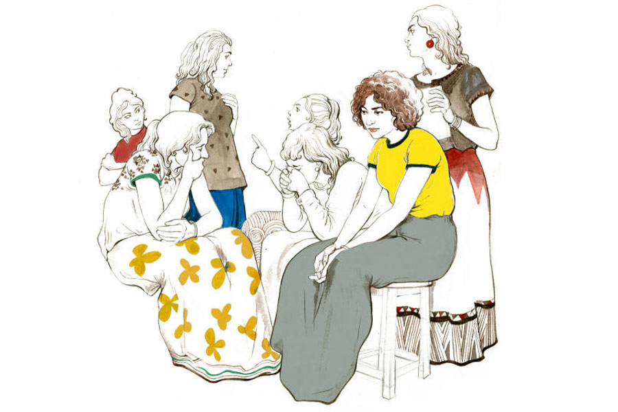

 
 <h1 align=center>সে ও সাত জন</h1>
<h2 align=center>সোমজা দাস</h2> আজ রাতে খাওয়া হল না সঙ্গীতার। বাকিদেরও কারও হয়নি।

দমদমের মেসের দু’কামরার ফ্ল্যাটে তারা আট জন মেয়ে ঘেঁষাঘেঁষি করে থাকত এত দিন। এক-একটা মাঝারি মাপের ঘরে চারটে করে ট্রেনের স্লিপার কোচের সিটের মতো প্রস্থের চৌকি। তাই এক জন কমে গেলে অন্যদের হাত পা ছড়ানোর একটু বেশি জায়গা জোটে। এই নিয়ে নিজেদের মধ্যে আড্ডার সময় বাড়িওয়ালার বিরুদ্ধে কত দিন ক্ষোভ উগরেছে তারা। কিন্তু এই মুহূর্তে সে সব কথা বাকি সাত জনের কারও মনে আসছে না।

ভিতরের ঘরে স্মিতার শরীরটা সিলিং ফ্যান থেকে ঝুলছিল এত ক্ষণ। শুকনো ঠোঁটের ফাঁক দিয়ে জিভ উঁকি দিচ্ছিল। ওই ঘরে পুলিশের ভিড়। বাকি সাত জন অন্য ঘরটিতে বসে আছে অপেক্ষায়। পুলিশকে প্রশ্নের উত্তর দিতে হবে। বলতে হবে, গত দেড় বছর ধরে তাদের সঙ্গী মেয়েটা হঠাৎ গলায় দড়ি বেঁধে ঝুলে পড়ল, অথচ তারা কেউ জানতে পারল না কেন! উত্তরটা যথাসম্ভব বিশ্বাসযোগ্য হতে হবে।

সাতটি মেয়েই সকালে নিজের নিজেদের কাজে বেরিয়ে গিয়েছিল। স্মিতার নাইট শিফট ছিল। কল সেন্টারে কাজ করত ও। দিনের বেলায় মেসেই থাকত। রাতে যখন সকলে ফিরে আসত, সেই সময় স্মিতা রাতের খাবার খেয়ে বেরিয়ে যেত। সে কথা ওরা পুলিশকে জানিয়েছে।

এখন রাত দেড়টা বাজে। ও ঘরে সিলিং থেকে স্মিতার নিথর শরীরটা নামানো হয়েছে। ফরেনসিকের অফিসাররা এসেছেন। নির্লিপ্ত যন্ত্রের মতো কাজ করে যাচ্ছেন ওঁরা। ওঁদের কাছে এক-একটা মৃত্যু শুধু একটা করে কেস। এতে উত্তেজনা নেই, শঙ্কা নেই, দ্বিধা নেই, ভিতরে ভিতরে দুমড়ে মুচড়ে যাওয়া নেই। শুধু আছে কিছু প্রশ্নচিহ্ন।

এ দিকে এ ঘরের সাতটা মেয়ে এখন সমুদ্রের তলদেশ হাতড়ে বালি তুলে আনার চেষ্টা করছে। সুরূপা নামে যে মেয়েটা এখানকার সবচেয়ে পুরনো বাসিন্দা, সে একটি অ্যানিমেশন সেন্টারে রিসেপশনিস্টের চাকরি করে। বয়স তিরিশ পেরিয়েছে অনেক দিন। রোগা, ক্ষয়াটে চেহারাটা ঝাঁ-চকচকে শীতাতপ-নিয়ন্ত্রিত রিসেপশনে বসার উপযুক্ত নেই আর। ম্যানেজার বুড়োকে একটু সঙ্গ দিয়ে, স্তিমিত আশাহীন চোখে কটাক্ষের জাল বুনে এখনও চালিয়ে যাচ্ছে। এ ভাবে কত দিন চলবে জানে না সে। কিন্তু এই মুহূর্তে সে নিজের কথা ভাবছে না। তাই ফিসফিস করে পাশে বসা রত্নাকে বলল, “স্মিতার স্বভাবচরিত্র ঠিক নয়, আগেই জানতাম আমি। অঞ্জন নামের ছেলেটার সঙ্গে তো মাখো-মাখো প্রেম ছিল। সারা দিন কী করে, কাউকে ঘরে আনে কি না আমরা দেখতে গেছি?”

ক’দিন আগেই স্মিতার সঙ্গে রত্নার একটা কাপড় মেলার ক্লিপ নিয়ে খুব ঝগড়া হয়েছিল। দু’জনেই ক্লিপটির মালিকানা দাবি করেছিল। রত্না এখন নিজের মতের সপক্ষে কাউকে পেয়ে মাগুর মাছের মতো খলবল করে উঠতে চায়। সুরূপা ঠোঁটে তর্জনী ছুঁইয়ে ইশারা করল। রত্না এ বার নিজেকে সংযত করে ফিসফিস করে বলল, “কত অঞ্জন ছিল কে দেখতে গেছে? ওর সাজগোজের বহর দেখেছিলে তো? অত টাকা পেত কোথা থেকে! রাতভর বাইরে থাকত। কী করত কে জানে!”

উল্টো দিকের চৌকির উপর বসে সর্বাণী এক মনে মোবাইল খুটখুট করছিল। এই সাত জনের মধ্যে সর্বাণীরই অবস্থা সবচেয়ে ভাল। এয়ারপোর্টে একটি নামী এয়ারলাইন্স সংস্থায় গ্রাউন্ড-স্টাফের চাকরি করে সে। আকর্ষণীয়া, মুখে ইংরেজির খই ফোটে। এই মেসের বাকিদের থেকে সে বরাবর শীতল দূরত্ব বজায় রেখে এসেছে। আজ মোবাইলটা পাশে রেখে বলল, “হয়তো প্রেম ভেঙেছে!”

“প্রেম ভাঙলে সুইসাইড করবে!” সুরূপা সত্যিই অবাক হয়।

“হু নোজ়!” কাঁধ ঝাঁকিয়ে বলল সর্বাণী। ওর বলা প্রতিটি শব্দে একটা অদ্ভুত লালিত্য আছে। এমনকি কাঁধ ঝাঁকানোটাও মনোরম ঠেকে সুরূপার চোখে। সর্বাণীকে ইর্ষা করে সে। বাকিরাও করে। সেটা সর্বাণীও জানে। তাই সে সুন্দর করে বাঁকা হেসে বলল, “ইউ নেভার নো! জানো তো, ডিপ্রেশন এই জেনারেশনের সবচেয়ে কঠিন অসুখ!”

“ডিপ্রেশন!” কথাটা শুনে মুখ তুলে তাকাল তুলিকা নামের মেয়েটা। ওর হাতে কনুই থেকে কবজি অবধি সার সার কাটা দাগ। তাই সব সময় ফুলস্লিভ জামা পরে থাকে। গত পরশুও দমদম স্টেশনে ট্রেন প্ল্যাটফর্মে ঢোকার মুহূর্তে ওর তীব্র ইচ্ছে হচ্ছিল প্রচণ্ড গতিতে আগুনের ফুলকি ছিটিয়ে ঘুরতে থাকা চাকার ভিতর ঢুকে যেতে। ঘোরের মধ্যে এক পা-দু’পা করে এগিয়ে গিয়েছিল সে। শেষ মুহূর্তে এক জন মহিলা হাত ধরে টেনে নিয়েছিল পিছনে। এখন মৃদু গলায় বলল তুলিকা, “স্মিতাদি খুব হাসিখুশি ছিল তো!”

সঙ্গীতার সঙ্গেই স্মিতার সবচেয়ে বেশি ভাব ছিল। দু’জনে একই কলেজে পড়ত। কলেজ শেষ করে দু’জনেই কলকাতায় এসে এই মেসে উঠেছিল। চাকরিও পেয়েছিল প্রায় কাছাকাছি সময়ে, আলাদা আলাদা কোম্পানিতে। মাঝে মাঝে খুঁটিনাটি বিষয় নিয়ে মনান্তরও হত, তা বলে বন্ধুত্বটাও কম মজবুত ছিল না। সঙ্গীতা এত ক্ষণ ওড়নার প্রান্ত দিয়ে চোখ মুছছিল বার বার। এ বার বলল, “হাসি দেখেই সব বিচার করে নিস তোরা? ওর কষ্ট কিছু ছিল কি না কেউ কোনও দিন জানতে চেয়েছিলি?”

রত্না এ বার ঝাঁঝিয়ে উঠল। বলল, “আমাদের কার জীবনে সমস্যা কম সঙ্গীতা? সবাই এই শহরে বাড়ি-ঘর ছেড়ে ক’টা টাকা রোজগারের জন্য এসেছি। কে কাকে কবে জিজ্ঞেস করেছে কার কী সমস্যা? কিসের কষ্ট? আমার কাছে কখনও কেউ জানতে চেয়েছ তোমরা? স্মিতা চেয়েছিল? ছাড়ো তো! স্মিতা মারা গেছে। খারাপ আমাদের সবার লাগছে। কিন্তু দোষারোপ করা বন্ধ করো।”

কথা বলতে বলতে একটু বেশিই উত্তেজিত হয়ে পড়েছিল রত্না, পাশের ঘর থেকে পর্দা সরিয়ে এক জন পুলিশ ধমকে উঠলেন, “আহ্‌, আস্তে!”

মিত্রা এদের মধ্যে বয়সে সবচেয়ে ছোট। গোলগাল, ফরসা, আহ্লাদী চেহারা। কলেজে পড়ে। এক বাল্যপ্রেমিক আছে ওর, বেঙ্গালুরুতে ইঞ্জিনিয়ারিং পড়ছে। ক্যাম্পাস ইন্টারভিউয়ে চাকরিও পেয়ে গেছে নাকি। পাশ করেই চাকরিতে যোগ দেবে ওর প্রেমিক। তার পরই বিয়ে করে নেবে ওরা। তার পরই নাকি দু’জনে আমেরিকা চলে যাবে। প্রতি কথায় প্রেমিকের কথা টেনে আনা ওর স্বভাব। মিত্রার বয়স কম, গভীরতাও কম। অল্পেই হেসে গড়িয়ে পড়ে, অল্পেই নেচেকুঁদে অস্থির হয়। চোখ নাচিয়ে সে বলল, “ওই অঞ্জনের খবর নাও আগে। সত্যি ভুলভাল লোকের সঙ্গে জড়িয়ে পড়লে বিপদের শেষ থাকে না। ভাগ্যিস প্রতীককে আমি ছোট থেকে চিনি। বাবা রে! আমার তো শুনেই কেমন লাগছে।”

“তুই থামবি, মিত্রা? সব পরিস্থিতিতে ছেলেমানুষি মানায় না!” কড়া গলায় বলল অনিতা। একটি প্রাইমারি স্কুলে শিক্ষিকা সে। বাড়ি মালদায়। সবাই জানে অনিতা তার দু’বছরের ছেলেকে মায়ের কাছে রেখে এসেছে চাকরিটা বাঁচানোর জন্য। তাই হয়তো বয়সের তুলনায় একটু বেশিই গম্ভীর।

মিত্রা মুখ বাঁকিয়ে চাপা গলায় বলল, “সব ব্যাপারে দিদিমণিগিরি ফলায় অনিতাদি। ভুল কী বলেছি?”

সুরূপা ফিসফিস করে বলল, “ছাড় তো ওর কথা! ওর নিজের কী কেস কে জানে! কোনও দিন ওর বরের ফোন আসতে দেখেছিস?”

মিত্রা চোখ বড় বড় করে বলল, “সত্যিই তো! এটা তো খেয়াল করিনি! তুমি বললে বলে…”

কথা চলতে থাকে, রাত বাড়তে থাকে। কবে কে স্মিতাকে এক জন অচেনা ছেলের সঙ্গে কথা বলতে দেখেছিল রাস্তায়, কবে স্মিতা ফোনে কথা বলার সময় কাঁদছিল, কবে মোটা টাকার বান্ডিল তাড়াতাড়ি করে ব্যাগে লুকিয়েছিল, কবে অফিসের বসের ফেসবুক প্রোফাইল পিকচারে রক্তিম হৃদয়ের চিহ্ন এঁকে দিয়েছিল, কথার পর কথা বাঁধ ভাঙা বন্যার জলের মতো ভেসে আসতে থাকে তীব্র স্রোতে।

মিত্রা ভুলে যায়, এক সপ্তাহ আগে তার বাল্যপ্রণয়ী সম্পর্কটা শেষ করে দিয়েছে। সুটকেসে জামাকাপড়ের নীচে এখনও চার পাতা কড়া ঘুমের ওষুধ রাখা আছে তার। ভেবেছিল ক’দিন সময় নিয়ে আরও কয়েক পাতা জোগাড় করে নেবে। এখন ভাবছে অন্য কথা। পুলিশ যদি তার ব্যাগ সার্চ করে সেগুলি পায়, তবে কি কোনও সমস্যা হতে পারে? ইস, যদি প্রতীকের সঙ্গে এক বার কথা বলা যেত!

অনিতা রজতের ফোন নম্বরটার দিকে তাকিয়ে বসে থাকে। তাদের ছেলে সেরিব্রাল পলসি নিয়ে জন্মানোর পর থেকে রজত আর কোনও সম্পর্ক রাখেনি। অনিতাও করুণা ভিক্ষা চায়নি। ইশ, স্মিতাটা যদি তার মতো মনের জোর রাখতে পারত একটু! সে নিজে কত বার খাদের কিনারায় গিয়েও ফিরে এসেছে। কে জানে, স্মিতার কাছে হয়তো ফেরার জন্য একটা দু’বছর বয়সের কচি মুখ ছিল না।

সুরূপার অফিসের ম্যানেজার এই শনিবার দিঘা যাওয়ার কথা বলছিল। চাকরিটা টিকিয়ে রাখতেই হবে তাকে যে করেই হোক। পরশুই মা ফোন করে জানিয়েছে, বাবার শরীর ভাল নেই। ডাক্তার অনেক দিন ধরেই একটা অ্যাঞ্জিয়োগ্রাফি করতে বলছেন। সুরূপাই ‘আজ করব কাল করব’ বলে টালবাহানা করে চলেছে। আর এড়ানো সম্ভব নয়।

ম্যানেজারের সঙ্গে এই প্রথম বার যাচ্ছে না সে। নিজের বেতনের সামান্য ক’টা টাকা দিয়ে বেড়ানোর সামর্থ্য তার কোনও দিনই হবে না। মাঝেমধ্যে এই বেড়ানোগুলো তার মরুভূমির মতো জীবনে একটু টাটকা বাতাস বয়ে আনে। আজই বাড়ি ফেরার পথে ভাবছিল এ বার থেকে একটু বেশি টাকা চাইবে। এখন এই স্মিতার সুইসাইডের চক্করে যাওয়াটা না আটকে যায়!

রত্না যেখানে বসেছে সেখান থেকে ভিতরের ঘরটা দেখা যাচ্ছে পরদার ফাঁক দিয়ে। স্মিতার শরীরটা ওরা বাঁধাছাদা করছে। ওর হ্যান্ডব্যাগটা পাশেই পড়ে আছে। ওটাও কি পুলিশ সঙ্গে নিয়ে যাবে? দারুণ সব লিপস্টিক লাগাত স্মিতা। বিশেষ করে ওই যে মরচে রঙের লিপস্টিকটা ছিল, ওটা ওকে কে দিয়েছিল কে জানে! ওটায় কাউকে হাত লাগাতে দিত না। এক বার রত্না লিপস্টিকটা একটু ঠোঁটে ছুঁইয়েছিল বলে খুব বিরক্ত হয়েছিল স্মিতা। বলেছিল, “এ ভাবে না জিজ্ঞেস করে আমার জিনিস ব্যবহার কোরো না রত্নাদি। আমার ভাল লাগে না!”

হুঁহ্! আজ দেখো শুয়ে আছে লাশ হয়ে। এখন লাগা লিপস্টিক! পুলিশ যদি ওগুলো না নেয়, রত্না ওই লিপস্টিকটা নেবে। স্মিতার মতো সুন্দর ঠোঁট নয় তার। তাতে কী! অমন দামি লিপস্টিক লাগালে সবাইকেই সুন্দর দেখায়।

সর্বাণী উড়তে চেয়েছিল। ফ্লাইট অ্যাটেনন্ডেন্ট হয়ে দেশে দেশে ঘুরবে, ফাইভ স্টার হোটেলে থাকবে। আরও কত স্বপ্ন ছিল তার। নামীদামি এভিয়েশন ইনস্টিটিউট থেকে কোর্সও করেছিল। এত সব করেও কী হল! থাইরয়েডের সমস্যাটা অনেক বছর ধরেই ছিল। তার পর হঠাৎ বাড়তে শুরু করল ওজন। সর্বাণীও পাগলের মতো খাওয়া কমাতে লাগল। কিন্তু তাতেও শেষ রক্ষা হল না। ঈষৎ পৃথুলা সর্বাণীকে আকাশে উড়তে দিতে রাজি হয়নি কোনও এয়ারলাইনস সংস্থাই। তার যোগ্যতা চাপা পড়ে গেছে সামান্য কয়েক পাউন্ড বাড়তি চর্বির তলায়। এই ঘরের বাকি ছ’জন জানে না, শুধু থাইরয়েড নয়, অবসাদ কাটানোর জন্যও নিয়মিত ওষুধ খেতে হয় সর্বাণীকে। সেগুলির সাইড এফেক্টের কারণে দিন দিন আরও বেড়ে চলেছে তার ওজন।  

“সঙ্গীতাদি, তুমি কিছু জানো? তোমাকে কিছু বলেছিল স্মিতাদি?” তুলিকা জিজ্ঞাসা করল।

সঙ্গীতা মাথা নাড়ল।

স্মিতা নামের একটা জলজ্যান্ত মেয়ে লাশ হয়ে শুয়ে আছে পাশের ঘরে। পুলিশের কাছে সে কেবল একটি বডি, একটি কেস। ক’দিন পর বন্ধ হয়ে যাবে। মুছে যাবে স্মিতা। চোখ তুলে ঘরের বাকি মেয়েদের মুখের দিকে তাকায় সঙ্গীতা। এদের প্রত্যেকের বুকের ভিতরে এক জন করে স্মিতা ঘাপটি মেরে বসে আছে লাশ হয়ে যাওয়ার অপেক্ষায়। তবু ওরা এখনও লড়ে যাচ্ছে। এটাই সত্যি। এই লড়াইটাই হয়তো ওদের লাশ হওয়া থেকে বাঁচিয়ে দেবে।

মোবাইল ফোনটা হাতে তুলে নেয় সঙ্গীতা। ক’টা মাত্র হোয়াটস্যাপ মেসেজ থেকে এত কিছু হয়ে যাবে ভাবতে পারছে না সে। অফিস যাওয়ার আগে সঙ্গীতার ফোনটা এক বার চেয়েছিল স্মিতা। ওর নিজের ফোনের নাকি ডেটা ফুরিয়ে গেছিল। একটা জরুরি ফর্ম নাকি ফিলআপ করতে হত ওকে। অফিসের তাড়ায় সঙ্গীতাও বেশি ভাবেনি। ফোনটা আনলক করে স্মিতার হাতে দিয়ে নিজের কাজে ব্যস্ত হয়ে পড়েছিল। কে জানত, মেসেজগুলো তখনই আসবে!

অঞ্জনকে কোনও দিনই স্মিতার কাছ থেকে কেড়ে নিতে চায়নি সঙ্গীতা। সমুদ্রের মতো এক বুক থইথই ভালবাসা যে গোপন রেখেছিল, সে তো স্মিতারই কথা ভেবে। কিন্তু যখন ভালবাসার মানুষ নিজে থেকে অঞ্জলি পেতে দাঁড়াল, নিজেকে সামলাতে পারেনি সে।

দাঁত দিয়ে নীচের ঠোঁট কামড়ে ধরে কান্নাটা আটকাল সঙ্গীতা। ও ঘরে সিলিং থেকে ওড়নাটা এখন ঝুলছে। সেটা থেকে চেষ্টা করেও চোখ সরাতে পারছে না। অঞ্জনের সব মেসেজ বরাবর ডিলিট করে দিত সে। এই মুহূর্তে ছোট ছোট ভুলগুলো সঙ্গীতার ভাবনার আকাশ ছেয়ে ফেলছে। যদি ফোনটা সে না দিত স্মিতাকে! যদি একটু আগেই অফিসে বেরিয়ে যেত সে! যদি ঘুণাক্ষরেও বুঝতে পারত যে স্মিতা সব জেনে গেছে! যদি আজ ঠিক ওই সময়ে অঞ্জনের মেসেজ না আসত! কিংবা যদি অঞ্জনকে সে ফিরিয়ে দিতে পারত প্রথম দিনই…

ছবি: প্রসেনজিৎ নাথ