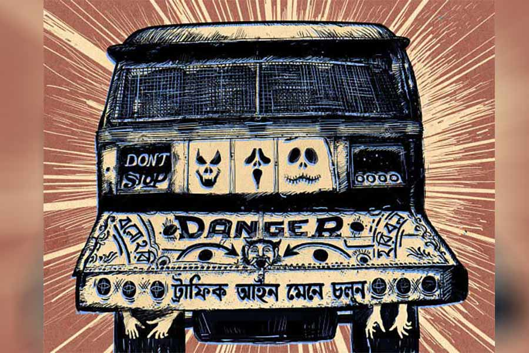

 
 <h1 align=center>সেই বাসটা</h1>
<h2 align=center>প্রসেনজিৎ সিংহ</h2> দৌড়তে দৌড়তে জিভ প্রায় ঝুলে গিয়েছিল! ঠিক যেমন করে ঝুলছিল ছেঁড়া
বুকপকেটটা। চলন্ত বাসের পাদানিতে কোনও ক্রমে পা রেখে উপি-র মনে হল, শেষ নিঃশ্বাসটা
একেবারে গলার কাছে।

রাতের ফাঁকা রাস্তায় হু-হু করে ছুটছিল বাসটা। শরীরের ব্যালান্স রাখতে
কোনও রকমে হ্যান্ডেলটা ধরেই এক বার পিছনে তাকিয়েছিল উপি। আর পরক্ষণে কন্ডাক্টর
জানলা দিয়ে গলা বাড়িয়েই চোখ বুজে ফেলল। উত্তেজিত কণ্ঠে ড্রাইভারকে বলল, “আর কোথাও থামিস না,
টেনে বেরিয়ে যা।”

এ বার উপির নিজেকে একটু হালকা লাগল। এত ক্ষণ দেখছিল এক দল লোক বাসটাকে
ধাওয়া করছে। তাদের কারও পাকানো ঘুসিতে তখনও আক্রোশ লেগে রয়েছে। কারও শরীরী ভাষা
বলছে, ‘একটুর
জন্য ফস্কে গেল। নইলে আজ ছাতু করে ফেলতাম।’ দু’-এক জন অবশ্য হঠাৎ হাল ছেড়ে দাঁড়িয়ে
পড়ল। দেখতে দেখতে পুরো দলটাই।

সিনেমার সিকোয়েন্সের মতো। সাবজেক্টিভ ক্যামেরা। যেন একই সঙ্গে ট্রলিতে
বসানো ক্যামেরা পিছনে যাচ্ছে আর ক্যামেরায় বসানো লেন্স জ়ুম ব্যাক করছে। ফলে হইহই
করে ছুটে আসা লোকগুলো দ্রুত আকারে ছোট হতে হতে মিলিয়ে এল। রুদ্ধশ্বাস চেজ়িং
সিকোয়েন্স শেষ হতেই চেয়ারের হাতল খামচে ধরা দর্শকের মুঠি যেন একটু আলগা হল।

পাদানি থেকে উঠে এ বার উপি বাসের ভিতরে ঢোকার চেষ্টা করে। বেশি রাতের
বাসে লোকজনকে দেখে আধচেনা মতো লাগে। শাড়ির দোকানের ক্ষয়াটে কর্মচারী, নার্সিংহোমের আয়া,
টিউশন-ফিরতি ছাত্র,
মাড়োয়ারি গদির
বাঙালি ক্যাশিয়ার— একটা পাঁচমিশেলি ছবি। কেউ ঢুলছে, কেউ কানে ইয়ারফোন গুঁজে অন্য জগতে। ভিড়
নেই। কাউকে দাঁড়িয়ে থাকতেও দেখা গেল না। কারও তাড়া আছে বলেও মনে হল না।

সারা দিন পর পর ট্রিপ মেরে ক্লান্ত কন্ডাক্টরও একটা সিটে গা এলিয়ে
দিয়েছে। হাতে দিনভর কালেকশনের নোটের তাড়া। তার গোনার গতিতে অনিবার্য আলস্য। মনে
হচ্ছে তার চোখও এখনই লেগে যাবে।

আর একটু হলে মার খেয়েই মরে যেত উপি। বাসটা এসে ঘটনাকে অন্য খাতে বইয়ে
দিল। এই ম্যাদাটে-মারা বাসটা বহু পুরনো। এ সব বাস চালানো বন্ধ করে দিয়েছে সরকার।
রাতদুপুরে পুলিশের চোখে ধুলো দিয়ে চলে বোধহয় দু’-একটা। নইলে উপি ধরল কী করে!

সেই আগেকার নিবু-নিবু আলো, কাঠের সরু সরু পাটা বসানো মেঝে, ড্রাইভারের ঠিক
পিছনে লম্বা লেডিজ় সিট। আর তার উপরে লক্ষ্মী-গণেশের ছবির পাশে কোনও এক ভবতারণ
মান্নার খালি গায়ে একটা ছবি। সবার গলাতেই সকালে পাল্টানো পাঁচফুলি মালা। পাশে লেখা
৩৮+১। জানলার উপরে ‘মালের দায়িত্ব আরোহীর’, ‘দিচ্ছি দিচ্ছি করবেন না’, ‘পকেটমার হইতে
সাবধান’, ‘তিন
বছরের ঊর্ধ্বে পুরা ভাড়া লাগিবে’ এই সব লেখাগুলো আবছা, কিন্তু পড়া যাচ্ছে। নারকেল ছোবড়া-ভরা
ফাটা-ফাটা চামড়ার সিট। মোটের উপর ঘুপচি মতো দেশলাই খোল। কিন্তু কী যেন একটা মায়া
আছে।

একেই বলে ‘বাল বাল বচ গয়া’। মনে মনে উপরওয়ালাকে ধন্যবাদ দিল উপি।
যত্তসব ছুটকো ঝামেলা। কোথাও কিছু নেই। পুরো একঘর গণপিটুনি! কিল চড় ঘুসি তো ছিলই।
তার সঙ্গে কে একটা মাথায়ও কিছু একটা দিয়ে জোরসে মেরেছে। মাঝে মাঝেই টনটনিয়ে উঠছে
জায়গাটা। প্রথমটায় তো দু’চোখে অন্ধকার দেখেছিল। এখনও ঘোর ঘোর আছে।

হয়েছে কী, শেয়ার ট্যাক্সিতে বাড়ি ফিরছিল টলিপাড়ায় ইউনিট বয় থেকে ক্যামেরার
কেয়ারটেকার পদে উন্নীত উপি, মানে উপমন্যু দত্ত। বাবা অবশ্য অ্যাসিস্ট্যান্ট
ক্যামেরাম্যান পর্যন্ত উঠেছিল। অনেক নামী লোকের সঙ্গে ওঠাবসা ছিল, ছেলের নামখানা জব্বর
বাগিয়ে গিয়েছিল। মনে হয় কোনও ডিরেক্টর বা স্ক্রিপ্টরাইটারের কাছ থেকে ম্যানেজ করা।
কিন্তু ওর কাজ তো সেই কেয়ারটেকারের। তাই অমন সুন্দর নামটাও উপি হয়ে গেছে। ভাল
নামটায় কেউ ডাকতে চায় না। অনেকে জানেই না।

ট্যাক্সিতে উপির সঙ্গে আরও তিন জন ছিল। দিব্যি আসছিল গাড়িটা ওদের
নিয়ে। সাধুডাঙার কাছে একটা লরি বেয়াড়াপনা শুরু করল। অনেক ক্ষণ থেকেই সাইড চাপছিল।
শেষটায় এমন চাপল যে, প্রায় বড় নর্দমায় ট্যাক্সি সমেত ওরা নেমে যায় আর কী!

লোকজনও তিরিক্ষি হয়ে উঠল। কাঁচা খিস্তিতে ভূত ভাগিয়ে দিচ্ছিল
লরিচালকের। সেই জোশেই ট্যাক্সিওয়ালাটাকে বলল সামনে গিয়ে গাড়িটাকে আটকাতে। সে-ও
তেমন। হঠাৎ স্পিড বাড়িয়ে ঘ্যাঁচ করে লরিটার সামনে তেরছা ভাবে ট্যাক্সিটা রেখে দিল।
লরিও থামল। আর হইহই করে লোকগুলো নেমেই আক্রমণ করল। এক জন রাস্তা থেকে একটা আধলা ইট
কুড়িয়ে মারল লরির সামনের কাচে। এক জন সামনের চাকার উপরে পাদানিতে পা রেখে উঠে পড়ল
ড্রাইভারের কেবিনে। মারল এক ঘুসি। চড়থাপ্পড়ও। দূরপাল্লার ট্রাকের চালকরা সহজে
মেজাজ হারায় না। সে শান্ত ভাবে প্রতিহত করছিল আক্রমণ।

বিপদ এল অন্য দিক থেকে। রাস্তার ধারেই কতগুলো লক্কড়মার্কা ছেলে
গুলতানি মারছিল। হইহই করে এগিয়ে এল। বোঝা গেল না লরিচালক এদের পূর্বপরিচিত,
না সে এই এলাকারই
লোক। এমনকি, ট্যাক্সির লোকগুলো কেন তাদের প্রতিপক্ষ বোঝা গেল না তা-ও।

উপি এই সব ঝুটঝামেলায় জড়াতে চায় না। কিন্তু দলে পড়ে তাকেও নামতে হল। ও
গিয়ে স্থানীয় ছেলেগুলোকে ব্যাপারটা বোঝানোর চেষ্টা করছিল। তাতে ফল হল উল্টো। বোঝা
তো দূর, রীতিমতো
ওকেই ঘিরে ধরল চার পাশ থেকে। এক জন ওর কলার টেনে মারল এক ঘুসি। দেখাদেখি অন্যরাও
হাতের সুখ করে নিতে লাগল। কেন মারছে না জেনেই এলোপাথাড়ি হাত চালাতে লাগল।

উপির এক পুলিশ বন্ধু বলেছিল, পাবলিকের মুড ধরা খুব শক্ত। হঠাৎ কেউ যদি বলে দেয়
‘মার শালাকে’, তখন বাকিরা আগুপিছু না ভেবেই নিরীহ লোককেও নাকি কেলিয়ে দিতে পারে। তখন
‘ন্যায়কামী’ বীরের অভাব হয় না। দরকার হলে বাস থেকে নেমে এক ঘা দিয়ে আবার বাসে উঠে
পড়ার মতো পাবলিকও নাকি আছে বাজারে।

পরিস্থিতি বুঝতে না পেরে উপি তখনও চেষ্টা চালিয়ে যাচ্ছিল। এমন সময়
পিছনে একটা আঘাতে মাথাটা যেন ঘুরে গেল। চোখে সর্ষেফুল দেখতে দেখতেই বুঝতে পারল,
আর বেশি সত্যাগ্রহ
করলে এখানেই শহিদ বেদি নির্মাণ হবে। অতএব ‘য পলায়তি স জীবতি’। দৌড় দৌড় দৌড়। কোনও
ক্রমে এই বিপত্তারণের পেটে ওঠা। বাসটার গায়ে অবশ্য লেখা আছে ভবতারণ।

বাসের একেবারে পিছনে গোটা দুয়েক সিট এখনও খালি। সে দিকে তাকাতেই
অনেকের সঙ্গে বসে থাকা একটা বুড়োর দিকে নজর গেল। চোখ আধবোজা। মুখে তুরীয় আনন্দ।
ঠোঁটে আলতো হাসি। আর হাতে একটা খবরের কাগজ মোড়া মালের বোতল। দেখে দিব্যি বোঝা যায়,
তবু যে কেন
দোকানওয়ালারা খবরের কাগজ মুড়ে দেয় ভগবান জানে। দেখেই ভিতরটা চনমনিয়ে উঠল উপির। যেন
বালিতে ডানা ঝটপটিয়ে স্নান করছে চড়ুইপাখি। এত ক্ষণ যা ঘটল ওর সঙ্গে, তাতে নেতিয়ে পড়া
নার্ভটাকে চাঙ্গা করতে আজ রাতে ওই রকম একটা হলে মন্দ হত না।

ঠিক সেই সময় উপি বুঝল, ওর কেসটা হঠাৎই নিউরো থেকে কার্ডিয়ো হয়ে যাচ্ছে।
ছেঁড়া পকেটটার তলায় যেটা ধুকপুক করে সেখানেই যেন একটু চিনচিন।

মাঝে মাঝে উপরওয়ালা কিছু খুচরো সুখ গঙ্গাজলের মতো ছিটিয়ে দেন। মনটা
অকারণ ভরে ওঠে। উনি তো ভারসাম্যের খেলা খেলেন। এই একটু কষ্ট, আবার একটু সুখ।

আসলে শুধু পিছনের সিটেই নয়, সামনের দিকে টু-সিটেও একটা জায়গা খালি। জানলার
ধারে এক তরুণী। তার পাশেই। এক ঝলক দেখেই বুঝল বেশ সুন্দরী। জানলার বাইরে দিকে
তাকিয়ে। এ দিক থেকে দেখা যাচ্ছে মুখের একাংশ। কানের পাশে নেমে এসেছে স্প্রিংয়ের
মতো এক গাছি চুল। পুরনো হিন্দি সিনেমার ‘জুলফেঁ’ টাইপের। আগে আগে হিন্দি সিনেমায়
নায়ক প্রথমে ওই ‘জুলফেঁ’-তে ঘায়েল হত। ‘ইয়ে রেশমি জুলফেঁ’ কিংবা ‘চাঁদ সা রোশন
চেহরা জুলফোঁ কা রং সুনেহেরা’।

আপাতত বিবেকানন্দ হয়ে মেয়েটার পাশে বসে পড়ল উপি। কারণ ছেঁড়া বুকপকেটটা
অর্ধেক হয়ে ঝুলছে। সেটা ম্যানেজ করা দরকার।

সুন্দরী তরুণী জানলার ধারে বসে আছে তো উপির কী? হয়তো কিছুই না। আবার হয়তো কিছু। উপির
জীবনে চারাপোনার আনাগোনা কমে গেছে আজকাল।

চারাপোনা! ওই হল আর কী! সব কিছু গতানুগতিক বলতে ভাল লাগে না। এই যে
প্রেম হলে বুকের ভিতর অনেক প্রজাপতি ওড়ে, কষ্ট পেলে গলার কাছে দলার মতো কী যেন আটকে থাকে,
ভয় পেলে নাকি ঠান্ডা
স্রোত শিরদাঁড়া দিয়ে নেমে যায়, ধুসস্! উপির অন্য রকমই হয়। এখন যেমন হচ্ছে!
মেয়েটির পাশে বসা ইস্তক উসখুস করছিল। একটু গলাখাঁকারি দিল। মেয়েটির কোনও ভাবান্তর
নেই।

“আপনি এঁড়েদায় থাকেন না? মানে আড়িয়াদহে?”

“না। কেন বলুন তো?”

“মনে হল যেন ওখানে এক দিন আপনাকে দেখেছি।”

“ভুল দেখেছেন। তা কাদের সঙ্গে মারপিট করে বাসে উঠলেন?”

“কেন, কেন? ইয়ে... এ কথা বলছেন কেন?”

“আপনার থুতনির কাটা দাগ আর ছেঁড়া পকেট তো তাই বলছে।”

“আপনার অবজ়ারভেশন খুব শার্প। পুলিশে চাকরি করেন না কি!”

“ধরুন যদি তা-ই হয়, তা হলে কি অন্য জায়গায় গিয়ে বসবেন? বলুন কার সঙ্গে
মারপিট করলেন...”

“ঠিক মারপিট নয়, মার খেলাম। গণপিটুনি বলতে পারেন। এক সঙ্গে বেশ
কয়েক জন এমন পর পর...”

“কী করেছিলেন?”

“বোঝাতে গিয়েছিলাম। কিন্তু এমন সবাই মিলে ঝাঁপিয়ে পড়ল!”

“তা বেশ লেগেছে বলেই তো মনে হচ্ছে।”

“না। এখন একটু ভাল লাগছে। হালকা লাগছে।”

“আমি জানি, কেন লাগছে।”

“হ্যাঁ, তা ধরুন, এই যে সুন্দর হাওয়া দিচ্ছে। চাঁদনি রাতে হু-হু করে বাস চলেছে। চার পাশ
কেমন নিস্তব্ধ। আর তারই মধ্যে একটা বিপদ থেকে পুরোপুরি ছুটকারা পাওয়া, সে তো ভাগ্যের
ব্যাপার।”

“শুধু তাই?”

“না মানে... তা ছাড়া এমন একটা বিপদ কাটিয়ে এসে এই যে আপনার মতো
সুন্দরীর পাশে ভগবান আমাকে জায়গা করে দিলেন, এটাও তো ভাল লাগার কারণ হিসেবে বেশ
জোরালো। ঠিক কি না?”

“ভগবান দিলেন? পিছনের সিটে যে দুটো জায়গা খালি আছে সেটা তবে কে
দিলেন?”

“আহা, সেও উনিই দিলেন। কিন্তু আমি কোথায় বসব, সেটা তো ধরুন আমি ঠিক করি না। ঠিক করেন
তিনি। মানে, তার ইচ্ছে ছাড়া তো গাছের একটি পাতাও...”

“হয়েছে হয়েছে! তা আমার পাশেই ভগবান আপনাকে বসালেন কেন? তাঁর কী অভিপ্রায়?”

“সে আমি কী করে বলব? মনে হয়, অত খেয়াল করেননি।”

“যে কথাটা আমি জানি, সেটা উনি জানেন না?”

“ওই একটা ব্যাপারে দেবতারা ফেল মেরেছেন। নারীর মনের কথা ওঁদের সিলেবাসে
নেই। ওই যে শাস্ত্রে বলেছে না, নারীর মনের কথা দেবা ন জানন্তি কুতো মনুষ্যাঃ!”

“বুঝেছি। তা কী করা হয়?”

“তেমন কিছু নয়। স্টুডিয়োপাড়ার ক্যামেরা কেয়ারটেকার। ক্যামেরার দেখভাল
করি। চোখের ডাক্তারদের মতো খানিকটা।”

“বাবা, একেবারে চোখের ডাক্তার? তুলনাটা মন্দ নয়।”

“সিনেমা মানে কী? মায়া। তবু তো সে সব দেখে লোকে কাঁদে, হাসে। সেই মায়া তৈরি
করে কে? ক্যামেরা।
আবার এই যে দুনিয়া সেটা তো মায়া। সেই মায়া কে দেখে? চোখ। কী হল? ওর’ম তাকাবার কী হল! আমার কথা নয়।
দার্শনিকরা বলেন। সেই মায়ার জগৎ আপনার চোখ দিয়েই তো ধরা দিচ্ছে! তাই নয় কি?”

“বাব্বা। আপনি তো...”

“কেয়ারটেকার। শুধু ক্যামেরার নয়। আরও অনেক কিছুরই হতে পারি। এমনকি...”

“এমনকি?”

“না, তেমন কিছু নয়। আপনি বেশ সুন্দরী।”

“সে জন্যই তো সিরিয়ালে চেষ্টাচরিত্র করেছিলাম। খানিকটা এগিয়েও ছিলাম।
কিন্তু লকডাউনে আর পারলাম না। বিশ্বাস করুন... কাগজে বেরিয়েওছিল। আপনার মতো ভরসার
লোক আজকের দিনে পাওয়া মুশকিল। বেঁচে থাকলে নির্ঘাত আপনার প্রেমে পড়ে যেতাম।”

“অ্যাঁ? তার মানে?” সারা শরীরে কি কাঁটা দিয়ে উঠল উপির?

এত ক্ষণ জানলার বাইরেটা চেনা লাগছিল। ভিতরের লোকগুলো ছিল অচেনা। এ বার
যেন সেটাই উল্টে গেল। ভাল করে দেখতেই বুঝল, মদের বোতল হাতে ধুনকিতে থাকা লোকটা পাড়ার
নন্টেদার বাবা। কারখানায় কাজ করতেন। অনেক দিন আগেই... ওই তো পাশের পাড়ার নীলিমাদি।
স্বামীর মৃত্যুর পর নার্সিংহোমে আয়ার কাজ নিয়েছিলেন। উনি তো গলায় দড়ি নিয়ে...
বাপির সেই চিমড়ে কাকাটা, শেষ বয়সে শেঠজির টাকা ব্যাঙ্কে জমা করতে গিয়ে
বেপাত্তা হয়ে যান। পুলিশে ধরে। অসুস্থ ছিলেন। জেলেই তো... বাড়িতে বডি এসেছিল।

উপির কাছে এখন ব্যাপারটা জলের মতো পরিষ্কার। নেমে পড়তে হবে। এখনই।

টাকা গুনতে গুনতেই ঘাড় দোলাতে লাগল কন্ডাক্টর। উপির দিকে না তাকিয়েই
একটা রহস্যময় হাসি ছড়িয়ে বলল, “আর কোথাও থামবে না। নামতে হবে একেবারে লাস্ট
স্টপেজে।”