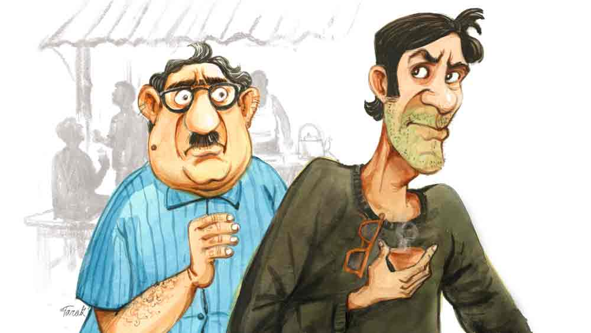

 

<h1 align=center>Short story: সেলেব্রিটি</h1>
<h2 align=center>সুব্রত মজুমদার</h2>
ছোট জেল-দরজার ফাঁক গলে বাইরে বেরিয়ে এল কার্তিক। বেরিয়েই দুটো মোটরবাইকে বঙ্কাদের দেখতে পেল।   “তোমাকে মাইরি সিনেমার হিরোর মতো লাগছে একদম!” বঙ্কা চেঁচিয়ে উঠল।   কার্তিক পকেট থেকে কালো চশমাটা বার করে চোখটা ঢেকে নিল। এতে ওর গাল বসা চোয়াড়ে মুখের যে বিশেষ শ্রীবৃদ্ধি ঘটল, তা বলা যায় না। ফেডেড জিনসের ওপর কালো ফুলস্লিভ গেঞ্জি, পায়ে সাদা অ্যাকশন শু, সবই সে জেল থেকে বেরোনোর আগে ফেরত পেয়েছে। একটা মার্ডার কেসে সামান্য কিছু দিন শ্রীঘর ঘুরে আসতে হল কার্তিককে। ওরা ঠিকমতো প্রমাণ করতে পারেনি। পল্টুদাই পুলিশকে তাপ্পিতোপ্পা দিয়েছে। বহুত লম্বা হাত পল্টুদার।   কার্তিক এক পায়ের ওপর ভর দিয়ে শরীরটাকে কাত করে বাঁ-হাত তুলে বঙ্কাদের উদ্দেশে নাড়ল। দেবানন্দ স্টাইল। কার্তিকের হাত নাড়ার স্টাইল ওদের উজ্জীবিত করল। রাস্তা টপকে ওরা একেবারে কার্তিককে কাঁধে তুলে নিল।   কার্তিক এটাকে মনে প্রাণে উপভোগ করলেও মনে একটা ধন্দ কাজ করছিল। জেলে যাওয়ার আগে তো বঙ্কারা এতটা খাতির করেনি! তা হলে সত্যিই কি ও সেলেব্রিটি হয়ে গেল? হ্যাঁ, এটা ঠিক যে দু’একটা ছুটকো-ছাটকা অ্যাকশনে কার্তিক নেতৃত্ব দেয়। পেছনে থাকে বঙ্কা, ছকু, ধেনোর মতো কয়েক জন। তবে সে সবই ছেঁদো ব্যাপার। এই যেমন কিছু দিন আগে গদাধরবাবু পাড়ার চায়ের দোকানে ধরেছিল কার্তিককে।   “এটা কি মগের মুলুক না কি ভাই কেতো? যে যা খুশি তা-ই করবে?”   “লে হালুয়া, কেসটা কী বলবেন তো?” কার্তিক ওর বাতাসদৃশ কোমরের ওপর চওড়া বেল্টটা ঠিক করতে করতে কথাটা বলেছিল। পাশে বেঞ্চির ওপর বসে বঙ্কারা চায়ের গ্লাস হাতে গুলতানিতে ব্যস্ত।   প্রশ্নকর্তা গদাধরবাবু ওর ঘাড়হীন মুন্ডুটাকে কার্তিকের দিকে বাড়িয়ে দিয়ে আন্তরিক গলায় কিছু বলতে গেল। তাতে ওর মুন্ডুসমেত স্থূল শরীরটাই সরে এল।   “এত সরে আসার কী হল মশাই! সোশ্যাল ডিসট্যান্সিংটা তো বজায় রাখবেন! নিন, এ বার ঝেড়ে কাশুন। মনে হচ্ছে গাড্ডায় পড়েছেন।”   “আর বলো কেন ভাই, নিরীহ মানুষদের আজকাল বেঁচে থাকাই দুষ্কর হয়ে উঠেছে!” গদাধর ফোঁস করে নিঃশ্বাস ছাড়ল।   “কেন গদাধরবাবু, বেশ তো গদাইলস্করি চালেই রয়েছেন!” কার্তিক ওর পাছাবিহীন পেছনপকেট থেকে ছোট্ট চিরুনিটা বের করে চুলটা ঠিকঠাক করে নিল।   “আর বোধহয় থাকতে পারব না ভাই। এ বার ধনে-প্রাণে মারা যাব।”   “গাড্ডায় পড়লে লোকে ভাই ভাই-ই করে। যাকগে, এ বার বলুন তো কেসটা কী?” কার্তিক চিরুনিটা ওপর দিকে তুলে আঙুল দিয়ে ময়লাগুলো পরিষ্কার করতে লাগল।   “গাড্ডা বলে গাড্ডা! আমার যে মানসম্মান আর কিছু রইল না।”   “এই যে বললেন ধনে-প্রাণে মারা যাচ্ছেন! আবার এখন বলছেন মানসম্মান সব ভোগে গেল। নাঃ, আপনি মশাই খুব কিচাইন পাবলিক!” কার্তিক চিরুনিটা পেছনপকেটে চালান করে একটা সিগারেট ধরাল।   “আহা, শোনোই না কথাটা! সবটা শুনলে তো বুঝবে।”   “তা সবটা বলুন না মশাই। আমাদের আবার সময় কম। এক্ষুনি যেতে হবে হরগোবিন্দবাবুর বাড়ি। ওর বৌয়ের সাধের মেনি বেড়ালটা ভজকেষ্টবাবুর গিন্নির কাছে গিয়ে দিব্বি আদরযত্ন নিচ্ছে। হরগোবিন্দবাবুর বাড়িমুখো আর হয় না। বেড়ালটাকে কিডন্যাপ করে হরগোবিন্দবাবুর গিন্নির কাছে ফেরত দিতে হবে...” কার্তিক বেশ কায়দা করে ধোঁয়ার রিং ছাড়তে লাগল।   “না না ভাই, আমার বিড়াল কুকুরের কোনও ব্যাপার নেই। একেবারে মনুষ্যঘটিত ব্যাপার।”   “কী ঘটিত? আচ্ছা মশাই, আপনি বাংলা ভাষায় কথা বলছেন তো? আমার কী রকম যেন সন্দেহ হচ্ছে।”   “না, সন্দেহ হওয়ার কিছু নেই। ব্যাপারটা হল গিয়ে, আমার মেয়ে সরস্বতী, তাকে তো তুমি চেনো?”   “তা আর চিনব না! এক এক ক্লাসে তিন-তিন বার গাড্ডু খেয়েও যে ইস্কুলে যায়। ওর ইস্কুলের প্রতি গভীর অনুরাগ এবং শ্রদ্ধা দেখে সবাই খুব প্রশংসা করে। এ বার তো পুজোর সময় পাড়ার ক্লাব থেকে ওকে সম্বদ্দনা দেওয়া হবে।”   “আর সংবর্ধনা! দিনসাতেক আগে সেই মেয়েই আর ইস্কুল থেকে বাড়ি ফেরেনি।”   “সে কী মশাই! তা হলে কি ইস্কুলেই ওর সলিলসমাধি ঘটল?”   “কী যে বলো না তুমি!” গদাধরকে হতাশ দেখাল। তার পর বলল, “অনেক খোঁজখবর করলাম। শেষে শুনলাম জটাধরবাবুর ছেলে নবকেষ্টকেও পাওয়া যাচ্ছে না।”   “জটাধরবাবু মানে আপনার ভাড়াটে? আপনার বাড়িরই নীচের তলা ভাড়া নিয়ে থাকেন?”   “আর ভাড়া! সেই পঁচিশ বছর ধরে পঁচিশ টাকাতেই ভাড়া নিয়ে বসে আছে। ভাড়া বাড়াবার নামগন্ধ নেই!”   “তা আপনি মশাই কী চাইছেন বলুন তো? জটাধরবাবুকে বাড়ি থেকে উচ্ছেদ? বলেন তো রাতেই ওর বাড়ির সামনে দু’টো পেটো টপকে আসি।”   “আরে না না! ওর বাড়ির সামনে মানে তো আমার বাড়ির সামনে হল। ও সব করতে হবে না। তুমি নবকেষ্টকে খুঁজে বের করো। তা হলেই আমার মেয়ে সরস্বতীকেও পাওয়া যাবে।”   “বলছেন?”   “নির্ঘাৎ পাওয়া যাবে। ওই নবকেষ্টই আমার নাবালিকা মেয়েকে ফুসলে নিয়ে গেছে। আমি ওকে পুলিশে দেব।”   কার্তিক এ বার খুব গম্ভীর মুখ করে বলল, “হুঁ, সবই তো বুঝলাম। মানে আপনি বলতে চাইছেন ওই নবকে কিডন্যাপ করে আপনার সামনে এনে দিতে হবে।”   “সে তোমরা কিডন্যাপই বলো আর যা-ই বলো, আমি নবকেষ্টকে হাতের মুঠোর মধ্যে চাই।”   কার্তিক সিগারেটের শেষাংশের শেষ টানটা মেরে খুব কায়দা করে সেটা মাটিতে ফেলল। তার পর ওর সিড়িঙ্গে মার্কা চেহারায় কয়েকটা বিভঙ্গ তৈরি করে ডান পায়ের পাতা এ দিক-ও দিক করে সিগারেট নেভাল।   ছকু কেতোর এই সিগারেট নেভানোর কায়দা দেখে বলেই ফেলল, “কত বার বলেছি কেতোদা বোম্বে চলে যাও। সেখানে হিরো হওয়া তোমার আটকায় কে?”   কেতোর ঠোঁটে একটা মৃদু প্রশ্রয়সুলভ হাসি দেখা দিয়েছিল। কিন্তু গদাধর যেন আঁতকে উঠল, “বোম্বে চলে গেলে সরস্বতীর কী হবে? সঙ্গে তো নবকেষ্টকেও চাই।”   বাঁ-হাত তুলে বরাভয়ের ভঙ্গি করেছিল কার্তিক, “সে জন্যেই তো বোম্বে যাচ্ছি না। আসলে সমাজসেবায় নিজেকে নিয়োজিত করেছি তো। এই যেমন আপনার মেয়ে, হরগোবিন্দবাবুর গিন্নির মেনি বেড়াল— এ সব উদ্ধার করা আমার নৈতিক দায়িত্বের মধ্যেই পড়ে। চিন্তা করবেন না। বাড়ি গিয়ে নাকে তেল দিয়ে ঘুমোন। তিন দিনের মধ্যে নবকেষ্টকে পেয়ে যাবেন। ভাল কথা, পাঁচশোটা টাকা ছেড়ে যান তো। বুঝতেই পারছেন, এ সবে বেশ খরচাপাতি আছে।”   গদাধর কথা না বাড়িয়ে পাঁচশো টাকা বাড়িয়ে দিয়েছিল।   পল্টুদা বলেছিল, “ভাবিস না কেতো, তোকে কোথা থেকে কোথায় নিয়ে যাব তুই ভাবতেই পারবি না। পাড়ার পাতি মস্তানের ছক থেকে শুধু বেরিয়ে আয়। আরে পৃথিবীটাকে দ্যাখ! কত বড় বড় মানুষ কী করছে দ্যাখ! কী সব পাতি কাজকর্ম করিস। দু’একটা কিডন্যাপিং, মার্ডার কেস-ফেস দিয়ে হাত পাকা। এমন দু’পাঁচটা কেস যদি তোর মাথার ওপর ঝুলে থাকে, তবে তো তুই সেলিব্রিটি!”   কথাটা মনে ধরেছিল কার্তিকের। পল্টুদা হেব্বি বক্তৃতা ঝাড়ে। কার্তিককে উজ্জীবিত করে তুলেছিল।      বঙ্কারা ফুল-মালা দিয়ে সংবর্ধনা জানিয়ে কার্তিককে বলল, “পল্টুদা কিন্তু তোমাকে দেখা করতে বলেছে এক বার।”   কার্তিক হাত নেড়ে বলল, “সে হবে’খন। আগে বল তো, শিউলি কেমন আছে? না কি অন্য কারও সঙ্গে ভেগে পড়ল।”   “কী বলছ ওস্তাদ! তুমি তো রীতিমতো সেলেব্রিটি। শিউলি নিশ্চয়ই এখন সারা দিন তোমার নামই জপ করে!”   এই কিছু দিন আগেও শিউলি ওকে পাত্তা দিত না। মুখের ওপর বলেই দিয়েছিল, “ছেঁদো মস্তানদের শিউলি তাকিয়েও দেখে না। মাস্তানি যদি করবিই তবে বিড়াল ছাগলের ওপর দিয়ে করলে চলবে না। মানুষের ওপর করে দেখা। লেবুতলার পটকাদাকে দেখেছিস? বেশি দিন এ লাইনে আসেনি। এর মধ্যেই দুটো কিডন্যাপিং, তিন-তিনটে মার্ডার কেস ঝুলছে মাথার ওপর। আহা, শুনেও ভক্তি হয়। চওড়া বেল্ট, টাইট প্যান্ট পরে লেবুতলার মোড়ে দাঁড়িয়ে যখন সিগারেটের ধোঁয়া ওড়ায়, তাকিয়ে দেখতে হয়।”   কথাটা শুনে খুব হতাশ হয়েছিল কার্তিক। সত্যি কথাই। কোথায় বেড়াল কিডন্যাপ, আর কোথায় মানুষ! যদিও গদাধরবাবুর কাছ থেকে ওই নবকেষ্টকে কিডন্যাপ করার বরাত পেয়েছিল। তবে ওটাও ঠিক জাতে ওঠে না। নেহাত খুঁজে বার করে গদাধরবাবুর কাছে হাজির করে দেওয়া। তার পর গদাধরবাবুই ওকে কব্জা করে ওর মেয়েকে খুঁজে 
বার করবে।   কিন্তু এত করেও কার্তিক ঠিক সেলেব্রিটি হয়ে উঠতে পারেনি। সত্যিই, এ লাইনে সেলেব্রিটি হতে গেলে দু’-একটা কিডন্যাপিং, মার্ডার কেসে ঝুলতেই হবে। তো পল্টুদাই সে সুযোগটা করে দিয়েছিল। এ জন্য পল্টুদার কাছে বেশ কৃতজ্ঞই কার্তিক। কিন্তু এখন দেখতে হবে শিউলি কার্তিককে কী চোখে দেখে।   কার্তিক বলল, “চল, এক বার শিউলিদের পাড়ায় যাই। শিউলিবেবিকে দেখে আসি।”      শিউলির বাড়ির কাছাকাছি আসতে বক্স বাজার তীব্র আওয়াজ কানে এল। বেশ চটকদার একটা হিন্দি গানের হুল্লোড় চলছে।   “কোথায় গান বাজছে বল তো? কারও বিয়ে-টিয়ে না কি?” কার্তিক অবাক হয়ে বলল।   বঙ্কা খানিক চোখ রগড়ে বলল, “মনে হচ্ছে শিউলিদের বাড়ি থেকেই আওয়াজ আসছে। বাড়ির সামনে একটা প্যান্ডেলও যেন দেখা যাচ্ছে।”   কার্তিক দাঁড়িয়ে পড়ল। খুব শঙ্কিত হয়ে জিজ্ঞেস করল, “শিউলির বিয়ে না কি রে? তা না হলে এত জাঁকজমক কেন?”   “তা হলে লেবুতলার ওই পটকার সঙ্গে বিয়ে নয় তো! শিউলিকে কয়েক দিন বেশ হাসি হাসি মুখে পটকার সঙ্গে কথা বলতে দেখা গেছে!” ছকু উত্তর দিল।   ছকুর কথাটা ফেলতে পারল না কার্তিক। শিউলি মাঝে মাঝেই পটকার সঙ্গে ওর তুলনা করত। খুব হীনম্মন্যতায় ভুগত কার্তিক। সত্যিই তো, জীবনে একটাই লক্ষ্য, সেলেব্রিটি হওয়া। সেটা বোধহয় এ জীবনে আর হল না।   কার্তিক ঘুরে দাঁড়াল বঙ্কাদের মুখোমুখি, বলল, “তোরা সব তৈরি আছিস তো?”   ওরা বুঝে গেল কার্তিকের ইঙ্গিত। কোমরে হাত ঠেকিয়ে ওরা বুঝিয়ে দিল, ওরা প্রস্তুত।   কার্তিক বলল, “বাইরে বাইক স্টার্ট দিয়ে রাখবি। শিউলির কপালে মেশিন ঠেকিয়ে ওকে বাইকে এনে বসাব। একদম সঙ্গে সঙ্গে বাইক 
স্টার্ট করবি।”   কার্তিক বঙ্কার কাছ থেকে পিস্তলটা নিল। বঙ্কা বলল, “সে কি ওস্তাদ, শিউলিকে একেবারে কিডন্যাপ করবে?”   “হ্যাঁ, করব। বিড়াল-কুকুর কিডন্যাপ না করে মানুষ কিডন্যাপ করতে বলেছিল। আমার এলেম দেখতে চেয়েছিল। আজ ওকেই কিডন্যাপ করে প্রমাণ করব, এই শর্মা মানুষ কিডন্যাপ করতে জানে।”   ছকু সত্যি সত্যিই এ বার কার্তিকের সঙ্গে রুপোলি পর্দার হিরোদের মিল খুঁজে পাচ্ছে। হিরোর শাগরেদ হওয়ার সুবাদে নিজেকেও বেশ ধন্য মনে করছে। বাইকে একটা জব্বর কিক-স্টার্ট দিয়ে ফেলল ছকু।   “আরে দাঁড়া, অত হড়বড় করিস না। আমি ভেতরে যাই। ওখান থেকে সিগন্যাল পেলে তবেই স্টার্ট করবি।”      আশ্চর্য! আধ ঘণ্টার ওপর হয়ে গেল কার্তিক ভেতরে ঢুকেছে। কাছ থেকে কোনও সিগন্যাল তো এল না। বঙ্কা চিন্তায় পড়ে গেল। আরে বাবা, সিগন্যাল মানে তো শিউলির মাথায় পিস্তল ঠেকিয়ে এখানে চলে আসা। কিন্তু কার্তিককে তো দেখা যাচ্ছে না! বক্স যেমন শব্দ করে বেজে যাচ্ছিল তেমন ভাবেই বেজে চলেছে। ভেতরেও বাড়তি হই-হট্টগোলের আওয়াজ নেই।   বঙ্কা বলল, “এখানে দাঁড়িয়ে কোনও লাভ নেই। চল বাড়ির ভেতর গিয়ে দেখি। মনে হয় কার্তিককে কব্জা করে ফেলেছে ওরা।”   বাইক দুটো ওখানে রেখে ধীরে ধীরে এগিয়ে গেল বঙ্কারা। বাড়ির পিছনে উঠোন। উঠোনের এক ধারে মাটির উনুন। তাতে হাঁড়িতে মাংস ফুটছে। বেশ সুগন্ধ ছড়াচ্ছে। আর এক দিকে একটা চৌকি পাতা। সুন্দর চাদর দিয়ে ঢাকা। সেই চৌকির ওপর খুব কায়দা করে আধশোওয়া অবস্থায় কার্তিক। তার চোখ আধবোজা। মুখে জমিদারি আমেজ। বিন্দাস সাজগোজ করে শিউলি এক রেকাবিভর্তি আঙুর কার্তিকের মুখের সামনে ধরে আছে।   বঙ্কাদের দেখে কার্তিক বলল, “তোরা এসে গেছিস! বোস এখানে।”   “তোমার না শিউলিকে কিডন্যাপ করার কথা ছিল?”   “কিডন্যাপ করতে গেলে এলেম চাই চাঁদু! এই বস্তুটার প্রথম পাঠ আমিই ওকে দিলাম,” উত্তরটা শিউলিই দিল।   ছকু অবাক হয়ে বলল, “কিন্তু এই গানবাজনা, প্যান্ডেল... আমরা যে ভাবলাম লেবুতলার পটকা...”   তার মুখের কথা মুখেই রয়ে গেল। কথার মাঝখানেই চোখ টিপে মুচকি হেসে শিউলি বলল, “দূর! পটকা কবে ফেটে গেছে! আজ কেতোবেবির জেল থেকে খালাস পাওয়ার দিন! তা একটু গানাবাজানা খাওয়াদাওয়া হবে না... কী যে বলে...”   বিভোর হয়ে দৃশ্যটা দেখতে দেখতে ছকু চটজলদি সিদ্ধান্ত নিয়ে ফেলল। ভবিষ্যতে সে কেতোই হবে।
