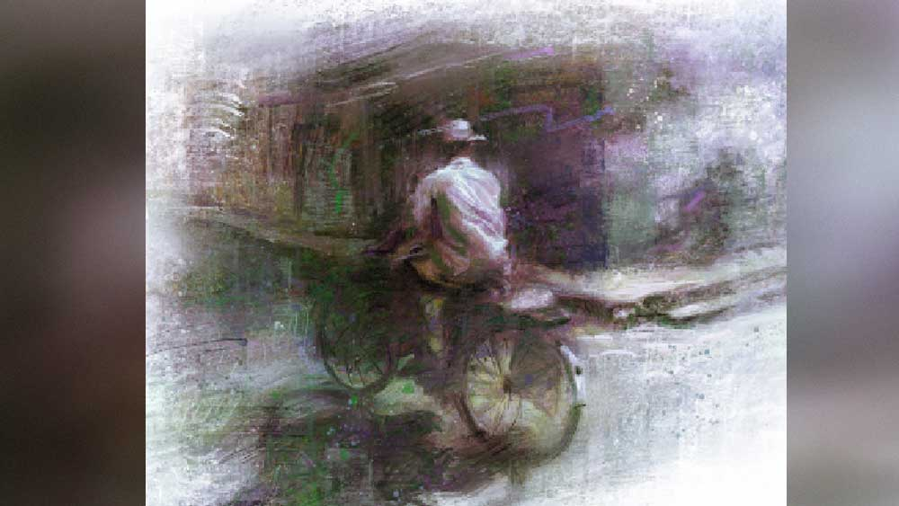

 

<h1 align=center>সৈনিক</h1>
<h2 align=center>প্রতিমা রায়</h2>
কালু শব্দটা ঠিক টের পায়। বালিশ চেপে শুয়ে থাকলেও শুনতে পায় সে আওয়াজ। এক পা এক পা... বিদায়ী পদধ্বনি। রাত্রিদেবী বিদায় নিচ্ছেন। তাঁর কাজ শেষ হয়েছে যে। এর পর আর শুয়ে থাকা যায় না। বিছানা ছেড়ে উঠে প্রাগৈতিহাসিক যুগের মরচে-ধরা সাইকেলটা নিয়ে বেরিয়ে পড়ে রাস্তায়। ভোরের আকাশ তখন ঈষৎ আগুনে রঙের না-খোলা খামের মতো, গাছেদের চোখে মুখে গত রাতের অলসতা। দাঁড়িয়ে থাকা বাড়িগুলো ঘুমে আচ্ছন্ন। নীরবতার আড়মোড়া ভেঙে এ দিক-ও দিক উড়ছে দু’-একটা কাক। কালু হাই চেপে প্যাডেলে পা রাখে ।   বাড়ি থেকে স্টেশন বেশ অনেকটা দূর। সাইকেলে সোয়া এক ঘণ্টা তো হবেই। রোজকার অভ্যেসে তা আর দূর মনে হয় না। এক পাক এক পাক করে সাইকেলের চাকা যত ঘুরতে থাকে, দূরত্ব তত কমে। যাত্রার নিয়মই তো এ রকম। বেশি দৌড়লেও জীবনে সময় মাপা। কালু ঘাড় উঁচু করে দেখে সামনের গলাসরু গলিটা পেরিয়ে মাথামোটা বোতলের মতো পরের গলি, ওখান থেকে গাঙের নৌকোর মতো বড় পিচের রাস্তাটা দেখা যায়। তার পর পাঁচ মিনিট সাইকেল চালালে আর্মি ক্যান্টনমেন্ট। ক্যান্টনমেন্টের পাশ দিয়েই কান ফুঁড়ে বেরিয়ে গেছে স্টেশন যাওয়ার রাস্তাটা। এই রাস্তাটায় এক বার পড়তে পারলেই মিনিট দশেক, তার পরই স্টেশন, প্ল্যাটফর্ম, সাড়ে পাঁচটার শিয়ালদা লোকাল।   ক্যান্টনমেন্টের সামনে পৌঁছতেই কালুর প্যাডেল স্লো হয়ে যায়। পা দুটো যেন প্যাডেলের খাঁজে আটকে যায়। দাঁড়িয়ে পড়ে দেখে ক্যান্টনমেন্টের গ্রাউন্ডে ফৌজি লোকজনের আসা, ওরা এখন পিটি করতে আসছে! ভোর পাঁচটার বিউগল অনেক আগে বেজে গেছে, এ বার গ্রাউন্ডে শুরু হবে ওদের মার্চপাস্ট। নয়তো ট্র্যাকে দৌড়। তার আগে ওয়ার্ম আপ। গ্রিক ভাস্কর্যের মতো সুন্দর সৈনিকদের পেটানো চেহারা। কালু নিজের ভাঙাচোরা শরীর, বাইসেপ ট্রাইসেপ শুকিয়ে লিকলিকে হাতদুটোর দিকে তাকায়। এক সময় ও রকম না হলেও তার শরীরের ও জৌলুস ছিল। বাসন্তী বলত, “শিবলিঙ্গের কালো পাথরও তোমার কাছে হার মানবে!”   সে শরীর টেকেনি। গরিব মানুষের শরীরের আগে পেট দৌড়য়। সেই দৌড়ের সঙ্গে পাল্লা দিতেই কালু ভগবানদার কাছ থেকে নিউজ়পেপার নিয়ে সকালে কয়েকটা বাড়িতে দেয়, দুপুরে হোম ডেলিভারি সংস্থার খাবার চারটে বাড়িতে পৌঁছে দেয়, সন্ধেয় বিলুর চায়ের দোকানে কাজ করে, বাসন্তীরও দু’বাড়ি কাজ। সব মিটিয়ে মাসের প্রথম দিকে দুটো পয়সা পকেটে। কালুর নিজেকে বেশ রাজা রাজা লাগে। কিন্তু দিন যত গড়ায়, মাসের আয়ু ফুরোয়, কালুর পকেট তত গড়ের মাঠ হয়।   ক্যান্টনমেন্টের রাস্তার দু’পাশে শান বাঁধানো বেশ বয়স্ক গাছেদের মাথা জড়াজড়ি। ঘন বোতল-সবুজ রঙের পাতাগুলো থেকে তিরতিরে ঠান্ডা হাওয়া এসে ছুঁয়ে গেল কালুর চোখমুখে। আকাশের গায়ে ধূসর মেঘের পরত। তবে কি বৃষ্টি আসবে! বেরনোর সময় তো বুঝতে পারেনি। কালু এ বার জোরে প্যাডেল চালায়। হাওয়ার বিপরীতে প্যাডেল ঘোরে কম। কালু সর্বশক্তি দিয়ে চাপ দেয়। আসলে মনের জোর বাড়ায়, ঠিক গ্রাউন্ডে পিটি করা জওয়ানদের মতো, না হলে শক্তি তো আর শরীরে মূহূর্তে মুহূর্তে বাড়ে না। ক্যান্টনমেন্টের কালো চকচকে পিচের রাস্তাটাকে জওয়ানদের ট্র্যাকের মতো মনে হয় কালুর। বেশ একটা সুখের অনুভব মনের ভেতরটার দখল নেয়। জোরে প্যাডেল করতে করতে সে তখন গুনগুন করে গায়— কদম কদম বঢ়ায়ে যা...   এই যা! সাইকেলের চেনটা পড়ে গেল! আজ কপালে গেরো। কালু সাইকেল থেকে নামে। দু’হাত দিয়ে উল্টো করে চাকা তুলে ধরে জোরে প্যাডেল ঘোরানোর চেষ্টা করে, ঠিক যে ভাবে বাসন্তীকে বিছানায় জাপটে ধরে কাবু করে ব্রাহ্ম মুহূর্তে। না, ইদানীং আর পারে না। সব কেমন আলগা হয়ে আসে। সময়ের আগেই ফুরিয়ে যায়। বাসন্তী চাপা রাগে গরগর করে, “চল্লিশেই তুমি বুড়ো হয়ে গেছ।”   “আজ তোর এত লেট কালু?” স্টেশনে পৌঁছতেই ভগবানদা চেঁচায়, “সবাই যে যার পেপার নিয়ে চলে গেছে। নে নে, তোরগুলো গুনে নে।”   রাম-দুই-তিন... কালু গোনে। কোনও কাগজ দশটা, কোনওটা পনেরোটা... সেই কবে বাসন্তীর প্রেমে গলা ডুবিয়ে এই কাজে এসেছে। বাসন্তী যোগ্য সঙ্গত না দিলে কোথায় হারিয়ে যেত! পেপারগুলো যত্ন করে গুছিয়ে সাইকেলের ক্যারিয়ারে নেয়। গোছাতে গোছাতে রোজকার মতো নিউজ়পেপারের ফ্রন্ট পেজের কালো কালো হেড লাইনের অক্ষরগুলো কালুর দৃষ্টি ছুঁয়ে যায়। কালু চোখ সরিয়ে নেয়। কালু পেপারওয়ালা। পেপার দেওয়া তার কাজ। অত দেশ-বিদেশের খবর দেখে সে করবেটাই বা কী! আদার ব্যাপারীর জাহাজের খবরে কী দরকার! পেপার নিয়ে সাইকেলের প্যাডেলে পা রাখে। তাড়াতাড়ি কাস্টমারদের বাড়ি-বাড়ি পৌঁছে দিতে হবে।   কালুর কাছে দেশ-বিদেশ মানে পুবে ব্যারাকপুর থেকে পশ্চিমে কৃষ্ণনগর। এর বাইরে সে কোনও দিন পা রাখেনি। এই চৌহদ্দির ভেতরেই তার জীবনের এতগুলো শীত-গ্রীষ্ম পার হয়েছে। হয়তো বাকি জীবনটাও কাটবে। ব্যারাকপুর থেকে বাসে হাওড়া, সেখান থেকে মাকড়সার জালের মতো ট্রেন লাইন পাতা, সেখান থেকে কোথায় না যাওয়া যায়! আবার কৃষ্ণনগর পেরিয়ে সীমান্ত। ও পারে বাংলাদেশ। আরও উপরে নেপাল-ভুটান, পাশে চিন। কালু অতশত দেশের মানচিত্র বোঝে না। তবু ফেরার পথে এক বার— ওই যে ক্যান্টনমেন্টের সামনে, ষেখানে যুদ্ধের ট্যাঙ্কটা রাস্তার দিকে মুখ উঁচিয়ে দাঁড়িয়ে, তার পাশে এক ভাবে ডিউটিরত আর্মি জওয়ানকে দেখে থমকে দাঁড়ায়। জওয়ানের হাতে সার্ভিস রিভলভার। কর্তব্যের খাতিরেই। ডিউটি শেষে অফিসে জমা রেখে ও ফিরে যাবে। ওতে ওর কোনও অধিকার নেই। তবু কী অদ্ভুত সুন্দর ওর মুখের হাসি! কালু দেখে আর ভেতরে ভেতরে বিশ্বাস মজবুত করে। জীবন মানে এ রকমই— বেঁচে থাকা, বাঁচার জন্য কর্ম, কর্তব্য সততা অসততা মিথ্যে সত্যি... সব মিলিয়ে একটা বৃত্ত। আমরা সবাই সে বৃত্তের ভেতর হাঁটছি। সে-হাঁটার শুরুটা জানা, কিন্তু শেষটা দেখা যায় না।   এ বার খুব জোরে বৃষ্টি আসে। বৃষ্টি শুরু হতেই কালু নিউজ়পেপারগুলোকে বড় প্লাস্টিকের ব্যাগে যত্ন করে মুড়ে নেয়। এখন হাওয়ার সঙ্গে বৃষ্টি, দুইয়ের মোকাবিলা করেই সাইকেল চালাতে হবে। অবশ্য ক্যান্টনমেন্টের রাস্তার বাঁ দিকের গলির মুখেই লালু মল্লিক রোড। প্রথম বাড়িটা সুবল সান্যালের। রিটায়ার্ড মানুষ। টংটং দু’বার আওয়াজ করে নিউজ়পেপারটা ছুড়ে দেয়।   “এই কালু! কী খবর রে তোর? এত দেরি করে পেপার দিচ্ছিস! সকাল থেকে হাপিত্যেশ করে বসে আছি, আর তোর এত ক্ষণে সময় হল?” সুবলবাবুর গলা।   “বৃষ্টি পড়ছে তো। তাই একটু দেরি হয়ে গেল।”   “একটু! রোজ কোনও না কোনও বাহানা! কাল থেকে তাড়াতাড়ি দিস। না হলে তোর দেওয়ার দরকার নেই...” স্পষ্ট বিরক্তি ঝরে পড়ে।   বৃষ্টির বেগ বাড়ছে। মাথা ভিজে সরু ধারা হয়ে তা পিঠের দিকে নামছে। ছাতাটা আনা হয়নি। আনলেও এক হাতে ছাতা, অন্য হাতে হ্যান্ডেল ধরে সাইকেল চালানো কষ্টকর। কালু তেমাথার রাস্তার ওপারে আসে। সাদা বিশাল ফ্ল্যাটবাড়িটার একটা ব্যালকনি থেকে দড়ি ফেলা। দড়িতে পেপার বেঁধে দিয়ে হাঁক দেয়, “পে-পা-র।”   দড়ি টেনে পেপার তুলতে তুলতে কমবয়সি দিদিমণির অভিযোগ, “কাল আনন্দবাজারের কলকাতার বদলে জেলারটা দিয়ে গেছ। কত বার বলেছি কলকাতা ছাড়া দেবে না!”   “তাড়াতাড়িতে ভুল হয়ে গেছে। কাল থেকে ঠিকঠাক দেব ম্যাডাম। আর ভুল হবে না।”   “এই নিয়ে তো চৌষট্টি দিন বললে, এ বার ঠিকঠাক দিয়ো। আর হ্যাঁ, এ মাসের ‘সুখের ঘর’ পত্রিকাটা দিয়ে যেয়ো তো।”   মাথা নাড়ে কালু। ফ্ল্যাটবাড়ির লোহার গেট থেকে টুপটুপ মুক্তোদানার মতো জল ঝরে পড়ছে। তার কপালে চুলের সামনেও ও রকম কয়েক ফোঁটা, সাইকেলে, সিট কভারেও। হাত দিয়ে ঝেড়ে নেয়। এই বৃষ্টিতে আর কী হবে! ভিজে জামা চুপসে গায়ে বসে একটু শীত করে। সাইকেলটা জোরে চালায়। জ়িগজ়্যাগ পাজ়লের মতো কতগুলো গলি রাস্তা পেরিয়ে পেপার দিতে দিতে বিবর্ণ গোলাপি বাড়িটার সামনে দাঁড়ায়। পেপারটা বাড়ির দরজার ফাঁক দিয়ে গলিয়ে দেয়।   “দাঁড়াও,” এ বাড়ির প্রসূনবাবু চেঁচান, “কখন যে টুক করে কাগজ দিয়ে চলে যাও টের পাই না। আজ দাঁড়িয়ে থেকে তবে পেলাম। কাল থেকে আর পেপার দিতে হবে না। আগের মাসে বিলে একটা গন্ডগোল ছিল, সেটা অ্যাডজাস্ট করে এ ক’টা দিনের টাকা নিয়ে যেয়ো।”   থমকে যায় কালু। একটু দাঁড়ায়। গত পাঁচ বছর ধরে এ বাড়িতে পেপার দিচ্ছিল। তার পর আবার সাইকেলের প্যাডেলে পা রাখে। ধীরে ধীরে আরও বিবর্ণ হয়ে যায় গোলাপি বাড়িটা।   সক্কাল সক্কাল এত বৃষ্টি হওয়ায় রাস্তাঘাট একটু নির্জন। সেই নির্জনতাকে আরও বাড়িয়ে দিয়েছে সামনের কোনও নর্দমায় জল পড়ার শব্দ। শব্দটা তীব্র ভাবে বুকে এসে বিঁধছে। কালু টের পায়, ভিজে জামা গায়ে মৃগীরোগীর মতো কাঁপুনি হচ্ছে। একটু আগুন হলে ভাল হয়। অন্তত হাত-পা দুটো গরম করতে...   বুকপকেটে হাত রাখে। বিড়িগুলো ভিজে নেতিয়ে গেছে। সামনেই চায়ের দোকান। সাইকেলটা চালিয়ে নিয়ে এসে দোকানের সামনে স্ট্যান্ড করে।   “এক কাপ চা দিন...” বলে দোকানের বেঞ্চিতে বসে। উদাস দৃষ্টিতে ঝরে পড়া জলের দিকে চেয়ে নিজের মনেই বিড়বিড় করে... “কাল থেকে একটা পেপার কম নিতে হবে। আবার কাস্টমার দেখতে হবে...” ,   নতুন কাস্টমারও কিছু দিন নিয়ে ছেড়ে দিতে পারে। তেমন তো এর আগেও অনেকে করেছে। স্পষ্ট জানিয়ে দিয়েছে আর প্রয়োজন নেই। কিংবা প্রয়োজন অন্য কেউ বা কিছু মিটিয়ে দেবে। আচ্ছা, সে না থাকলে বাসন্তীর কি কষ্ট হবে? না অন্য কেউ প্রয়োজন মিটিয়ে দেবে? সংসারে কারও প্রয়োজন চিরন্তন নয়। ছোটবেলায় মা ঠিক বলত, “মানুষ থাকলেই আশা, না হলে কী আর।” এত ক্ষণে কালু খেয়াল করে, বেঞ্চের অপর দিকে বসে জনাকয়েক নিউজ়পেপারে ঝুঁকে কী যেন দেখছে। আজকের কাগজের ফার্স্ট পেজের ছবিটা না!   এক জন বলে, “কালকে রাতে টিভি চ্যানেলগুলো দেখিয়েছে। দেশের দু’জন আর্মি মারা গেছে। আর শত্রুরা ছিল তিন জন। একটাকে ওখানেই মেরে ফেলেছে। বাকি দুটো বোধহয় পালিয়েছে।”   “ও, গতকালের অনন্তনাগের ঘটনা তো?” দ্বিতীয় জন বলে।   চায়ে চুমুক দিতে দিতে পাশের জন পেপারের ছবিটা দেখিয়ে নিশ্চিন্ত গলায় বলে ওঠেন, “না না, মারা যাওয়ার আগে এই জওয়ানই সব ক’টাকে খতম করে গেছে।”   মাথা নাড়ে দ্বিতীয় ব্যক্তি, “তাই এই মৃত জওয়ানের পরিবারের এক জনকে সরকার চাকরি দেওয়ার কথা ঘোষণা করেছে।”   এ বার তার হয়ে পরিবারের ভরণ-পোষণ করবে অন্য এক জন।   কালুও মুখ বাড়িয়ে দেখে মৃত সৈনিকের ছবিটা। ছিন্নভিন্ন গুলি লাগা শরীর, চোখ দুটো বন্ধ, যেন নিশ্চিন্তে ঘুমিয়ে আছে। কালু এই খবরটা বয়ে নিয়েই সকালবেলা বাড়ি বাড়ি পৌঁছে দিয়েছে। রোজ দেয় এমন কত খবর! কালু জানে, নিশ্চিত জানে, বাসি খবরের কাগজের মতো এ খবরও কাল বাসি হয়ে যাবে। কাল আবার অন্য কোনও খবর হবে।   তবে সত্যি কি সৈনিক মৃত? সত্যিই কি সৈনিকের মৃত্যু হয়?   আবার একটা শব্দ! এ বার খসখস পাতা ওল্টানোর। কালু দোকান থেকে বেরিয়ে এসে সাইকেলে রাখা শেষ নিউজ়পেপারটা টেনে নেয়। ছবিটার গায়ে হাত বোলায়। স্পষ্ট বুঝতে পারে, মৃত সৈনিক তার সামনে এসে দাঁড়িয়েছে। তার ঘাম আর রক্ত মাখামাখি শরীরের গন্ধ সে অনুভব করছে। এই তো সে সামনে! সে আগেও ছিল, এখনও তাকে ছুঁয়ে আছে! অস্বীকার করার উপায় নেই, অস্বীকার করা যায় না। সে যেন মিশে আছে তার সঙ্গে, অনন্তকাল মিশে থাকবে। একে-অপরের থেকে আলাদা করা যাবে না কাউকে।   কালু নিজের মনেই বলে ওঠে, ‘সৈনিকের মৃত্যু হয় না, যুদ্ধও থামে না। এক সৈনিকের হাত থেকে অন্য সৈনিকের হাতে কেবল যুদ্ধের ব্যাটন বদল হয়।’   বেঁচে থাকার জন্য মানুষকে যুদ্ধ করে যেতেই হবে। শুরু থেকে শেষ পর্যন্ত। সেখানে দেশ-কাল-সময়ের বাউন্ডারি ওয়াল বলে কিছু নেই।