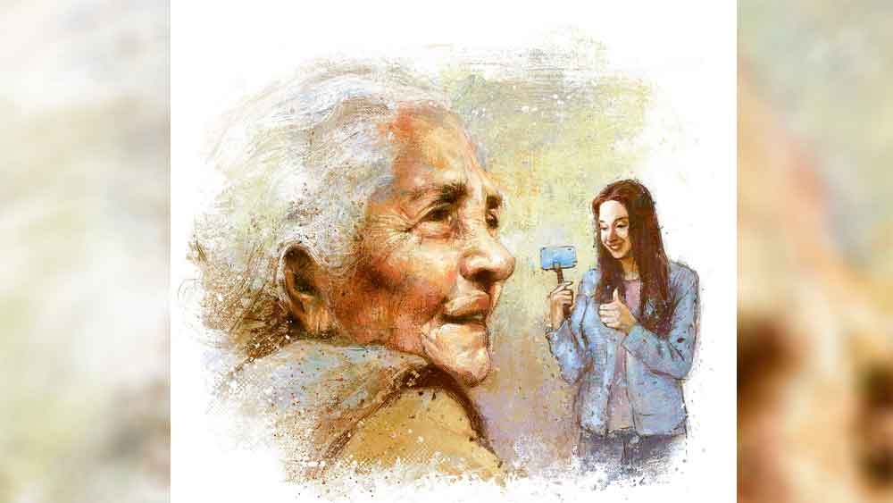

 

<h1 align=center>সোনার ডিম</h1>
<h2 align=center>সুজিত বসাক</h2>
নিধুবালা ষোড়শীও নন, সুন্দরীও নন, এক অশীতিপর বৃদ্ধা। লেখাপড়ায় আঙ্গুঠা ছাপ। তবুও তিনি নেট-দুনিয়ায় বিখ্যাত। হজমের পক্ষে কষ্টদায়ক হলেও ঘটনাটা সত্যি। এরই মধ্যে তাঁর বেশ কিছু ভিডিয়ো ভাইরাল। অবশ্য এ সবের মূল কৃতিত্ব নিধুবালার বড় নাতনি মেঘার। নিধুবালা যন্ত্র, মেঘা যন্ত্রী। মেঘা নিধুবালার লাইফস্টাইল ভিডিয়ো বানিয়ে তাঁকে এক রকম হিরোইন করে তুলেছে। মেঘা প্রথমে কিছুটা খেলাচ্ছলে ভিডিয়োগুলো বানিয়ে ছেড়েছিল। এতটা সাড়া পাবে স্বপ্নেও ভাবতে পারেনি। প্রথম যে দিন শুরু করেছিল, সে দিনের কথা মনে পড়লে এখনও হাসি পেয়ে যায় মেঘার। বছর খানেক আগের কথা। এক দিন একটা ভিডিয়ো চালিয়ে নিধুবালাকে দেখিয়ে মেঘা বলেছিল, “তুমি একে চেনো ঠাম্মা?”   নিধুবালা বলেছিলেন, “না তো। কে এ? বেশ তো গাইছে!”   “ইনি রাণু মণ্ডল গো। সবার মুখে মুখে এখন এঁর নাম। তবে সবাই ওঁকে টেনেটুনে তুলল বটে, উনি কিন্তু দাঁড়িয়ে থাকতে পারলেন না। ধপাস করে পড়ে গেলেন। ওকে দেখে আমার মাথায় একটা আইডিয়া এসেছে বুঝলে…  তোমাকে নিয়ে আমি ভিডিয়ো তুলে ছাড়ব!  আমি যা বলব তুমি শুধু তা-ই করে যাবে।”   সেই শুরু। মেঘা একের পর এক ভিডিয়ো করেছে আর ছেড়েছে। নিধুবালার সারল্যে ভরা এক্সপ্রেশন আর আধো আধো বুলি…  খুব ধরেছে পাবলিক। কয়েক মাসের মধ্যেই লক্ষাধিক সাবস্ক্রাইবার। মেঘা এখন টাকাও পাচ্ছে ভালই। তবে মুশকিল হল, ঠাম্মা বয়স্ক মানুষ,  শরীর খারাপ হয় মাঝে মাঝেই। নিধুবালার ভ্লগের মূল আকর্ষণ নিধুবালাই। এখন আর অন্য মুখ খাবে না। তাই জুলুম হলেও ঠাম্মাকে দিয়ে ঠিক করিয়ে নেয় মেঘা।   সকাল থেকে রাত, মেঘার এখন এটাই কাজ। ঠাম্মার সঙ্গে থাকা আর ক্যামেরা অন করে তাঁকে গাইড করা। ঠাম্মা তার হাতের পুতুল। সারা দিনের তোলা ক্লিপগুলোকে নিয়ে এডিট করতে বসে রাতে। সেটাও কী কম খাটুনির কাজ!  প্রথম প্রথম খুব কঠিন মনে হত, করতে করতে এখন অনেকটা আয়ত্তে এসে গিয়েছে।      সকাল থেকেই বাড়িতে সাজো সাজো রব। বড়দার বিয়ের জন্য পাত্রী দেখে আসা হয়েছিল কৃষ্ণনগরে। এ পক্ষের গ্রিন সিগন্যাল পেয়ে ও পক্ষের লোকজন আসছে পাত্রের ঘরদোর দেখতে, পরিবারের সঙ্গে পরিচিত হতে। সোজা বাংলায়, ফাইনাল পর্বের তদন্ত করতে।   মেঘা খুশি, এই সব দিনগুলোয় জমিয়ে ভিডিয়ো তোলা যায়, ভিউয়ার্সদের রুচির পরিবর্তন হয়। মেঘা খুশি আরও একটা কারণে। বিয়েটা লেগে গেলে শেষ না হওয়া পর্যন্ত প্রচুর আলাদা আলাদা ভিডিয়ো দিতে পারবে। পাকা দেখা, আশীর্বাদ,  গায়েহলুদ, বৌভাত,  বিয়ের আচার-অনুষ্ঠানের কী শেষ আছে!   ঘরদোর সেটিংসের দায়িত্ব মেঘার। কে কোথায় বসবে, কোথায় কোন জিনিস থাকবে,  সব কিছু নিজের হাতে গুছিয়ে ফেলেছে। আগে বাড়ির অনেকেই কটূক্তি করত, এখন আর করে না। বরং সবাই সহযোগিতা করে। বাবা, মা, কাকু প্রথমে ব্যাপারটা বুঝতে পারত না, ধীরে ধীরে ওদেরও বোধগম্য হয়েছে। টাকার সঙ্গে সাফল্যের কানেকশন আদিম! টাকা আসার পর থেকে সবাই মেনে নিয়েছে, মেঘা এ বার সত্যি সত্যি কিছু একটা করছে।   পাত্রীপক্ষের লোকজন বলতে পাত্রীর জেঠু,  মামা-মামি,  দাদা-বৌদি আর ওদের সাত বছরের মেয়ে মিলি। ছ’জন। ঠাম্মাকে সাজিয়ে গুছিয়ে নির্দিষ্ট চেয়ারে বসিয়ে দিয়েছে মেঘা। ঠাম্মাকে দেখেই উচ্ছ্বসিত মেয়ের বৌদি, “আপনার ভ্লগ তো আমরা রোজ দেখি ঠাম্মা। সো সুইট। মামিও দেখে…  তাই না মামি?”   মামি মাথা নেড়ে সম্মতি জানালেন। জেঠু মাথা চুলকে বললেন, “ঠিক বুঝলাম না!  ভ্লগ জিনিসটা কী? তোমরা ওঁকে চেনো?”   “আপনারা এ সব জানেন না জেঠু। ওঁকে অনেক মানুষ চেনে।”   ক্যাবলা হাসি দিলেন জেঠু। মেয়ের বৌদি মেঘার দিকে তাকিয়ে বলল, “আমাদের লতা, মানে তোমার হবু বৌদিও টিকটক করে। আমিও থাকি সঙ্গে। দুই ফ্যামিলির বেশ জমবে মনে হচ্ছে…  তুমি কী বলো?”   মেঘা মুচকি হাসল। মেয়ের দাদা বলল, “আমারও তাই মনে হচ্ছে। যদিও এ সব আমি বিশেষ বুঝি না।”   মেয়ের দাদা নেহাতই গোবেচারা। কথা বলার আগে বৌয়ের দিকে তাকিয়ে নেয়। কনফিডেন্স লেভেল অত্যন্ত বিলো। জেঠু আর মামাবাবু গম্ভীর। ওরা ঠিক খেই পাচ্ছেন না,  অতিরিক্ত গাম্ভীর্য সেটা বুঝিয়ে দিচ্ছে।   মেঘার শ্যুট চলছে। জেঠু আর মামাবাবুর দিকে তাক করলেই কেমন জড়সড় হয়ে যাচ্ছেন। মেঘা বলল, “রিল্যাক্স আঙ্কেল। স্বাভাবিক ছন্দে কথা বলুন। এই মিটিংটা হয়ে গেলে আপনাদের প্রত্যেকের সঙ্গে আলাদা আলাদা সিটিং করব ঠাম্মাকে নিয়ে।”   জেঠু বিরক্ত গলায় বললেন, “মানে? আমরা কি ইন্টারভিউ দিতে এসেছি না কি?”   মেঘার বাবা তড়িঘড়ি বললেন, “না, না, সে রকম কিছু নয়। এটা জাস্ট ঘটনাগুলোকে স্মরণীয় করে রাখার একটা পদ্ধতি। প্রযুক্তির দুনিয়া দাদা। কত কিছু হচ্ছে এখন। প্রথম প্রথম আমিও বিরক্ত হতাম। কিন্তু যখন দেখলাম আমার আশি বছরের মাও এতে মজা পাচ্ছে…  তখন মানতেই হয়েছে। আপনিও শুরু করুন…  দেখবেন মারাত্মক নেশা।”   অবাক চোখে তাকালেন জেঠু আর মামাবাবু। জেঠু খুব নীরস গলায় বললেন, “আমার কোনও ইচ্ছে নেই। এক দিকে বাচ্চাদের মোবাইল ঘাঁটতে বারণ করব…  অন্য দিকে নিজেরাই দিনরাত ঘাঁটব…. এটা কেমন কথা?  যাকগে, এ বার বিয়ে সংক্রান্ত কথাগুলো সেরে নিলে হত না?”   মামাবাবু মেঘার দিকে তাকিয়ে বললেন, “মেয়েরা যদি সিটিং দিতে চায় আমার আপত্তি নেই।”   মামাবাবু খুব একটা সুবিধের জায়গায় নেই। মামির জ্বলন্ত চোখরাঙানি কয়েকবার বর্ষিত হয়েছে তার ওপর। কেউ না দেখলেও মেঘা স্পষ্ট দেখেছে। পরে বাঁচার রাস্তাটি তিনি কৌশলে করে রাখলেন।      মাঝখানে খাওয়াদাওয়ার পর্ব। জেঠু ভোজনরসিক মানুষ। আয়োজন দেখে বেশ খুশি। কিন্তু মেঘার ক্যামেরা চালু হতেই আবার জড়সড় ভাব। মেঘা কোনও রকমে ম্যানেজ করল। তড়কা মেরে বলল, “আপনার যা চেহারা তাতে এক কালে নায়কদের চেয়ে কোন অংশে কম ছিলেন না তা স্পষ্ট অনুমান করা যায় আঙ্কেল।”   কাজ হল তড়কায়। নিজের চেহারার প্রশংসা কেউই সহজে ঠেলতে পারে না। জড়সড় ভাব কাটিয়ে বুক টানটান পোজ় দেওয়ার চেষ্টা করলেন। এমনকি এটাও বলে বসলেন, “ঠিক আছে ওদের সঙ্গে সঙ্গে আমিও নাহয় দু’-চারটে কথা বলে দেব তোমার সিটিংয়ে।”   মেঘা এতটা ভাবতে পারেনি, তবে খুশিই হল।   বাগানের মধ্যে লোকেশন আগেই ঠিক করে রেখেছিল মেঘা। কাজের লোক গদাইকে দিয়ে চেয়ার-টেয়ারও আনিয়ে রেখেছিল আগে থেকেই। ঠাম্মাকে বসিয়ে একে একে ওদের সবার সঙ্গে কথা বলাল। ঠাম্মা সাবলীল, স্বচ্ছন্দ। স্ক্রিপ্ট থেকে কখনও এতটুকু সরে না। মেঘা অবাক হয়ে ভাবে, লেখাপড়া না জানা এক জন মহিলা কী করে এতটা পারফেক্ট হতে পারে!      বড়দার বিয়ে এখানেই ঠিক হল। অর্থাৎ ওদের লাস্ট ভিজ়িটের রিপোর্ট পজ়িটিভ। মেঘার এখন নাওয়া-খাওয়ার সময় নেই। হয় ঠাম্মার পিছনে ক্যামেরা অন করে ঘুরছে নয়তো পরবর্তী ভিডিয়োর প্ল্যানিং করে রাখছে। ঠাম্মাও ক্লান্তিহীন ভাবে তাঁর ভূমিকা পালন করে যাচ্ছে।   কিন্তু বিপত্তি ঘটল আসল সময়ে। বিয়ের দিন সকাল থেকেই ঠাম্মার ধুম জ্বর। মেঘা কোনও রকম রিস্ক না নিয়ে ওদের ফ্যামিলি ফিজ়িশিয়ান ডাক্তার মণ্ডলকে ডেকে নিয়ে এল। মণ্ডল দেখে-টেখে বললেন, “ভাইরাল ফিভার। ওষুধগুলো সময়মতো দাও…  আর একটু রেস্টে রাখো…  ঠিক হয়ে যাবেন।”   আজকের দিনে রেস্ট! মেঘা কাতর অনুরোধ করল, “ডাক্তারকাকু, তুমি এমন ওষুধ দাও যাতে ঠাম্মা অন্তত বৌভাত পর্যন্ত সুস্থ থাকে।”   ডাক্তার হেসে বললেন, “ওঁর বয়সটাও তো দেখতে হবে। যথাসম্ভব পাওয়ারফুল ওষুধ লিখে দিচ্ছি।”   ওষুধে অনেকটা কাজ হল। ধাপে ধাপে জ্বর নামল। উঠে বসলেন নিধুবালা। মেঘা হাঁপ ছেড়ে বাঁচল। ঠাম্মার কানের কাছে মুখ নিয়ে বলল, “তুমি তো একেবারে চিন্তায় ফেলে দিয়েছিলে। এই দিনে অসুস্থ হলে কেমন করে চলবে ?  লক্ষ লক্ষ ভিউয়ার্স তোমার চোখ দিয়ে বিয়েটা দেখবে। ক্যামেরা অন করব?”   “করবি? কর।”   “তুমি যে গায়ে জ্বর নিয়ে ভিডিয়ো করছ, সেটাও বলবে কিন্তু। আপাতত ইন্ট্রোডাকশন তো করো... কিছুটা রেস্ট নিয়ে আবার শুরু করা যাবে।”   নিধুবালা তাঁর অভ্যেসবশেই শুরু করে দিলেন,  কিন্তু তাঁর বডি ল্যাঙ্গোয়েজ বলছিল, কথাগুলো ভেতর থেকে আসছে না। মেঘা উৎসাহ দিয়ে বলল, “দারুণ হচ্ছে ঠাম্মা! ব্যস, আর একটু, তা হলেই এখনকার মতো ছুটি।”   প্রায় ধুঁকতে ধুঁকতেই অনেকটা টেনে দিলেন নিধুবালা। খুশি হয়ে মেঘা বলল, “জানো কত লোক কমেন্ট বক্সে লিখেছে…  বড় নাতির বিয়েতে ঠাম্মার নাচ দেখতে চাই। তোমাকে বরযাত্রী নিয়ে যেতে পারলে দারুণ হত, কিন্তু সেটা তো সম্ভব হল না,  জ্বর বাধিয়ে বসলে। যা-ই হোক বরকে বিদায় করার আগে একটু নেচে দিলেই হবে।”   ফিকে হাসি হাসলেন নিধুবালা। সেই হাসিতে একটা অসহায় ভাব ফুটে উঠল। মেঘা দেখেও দেখল না। মনে মনে বলল,  ‘ইউ আর চ্যাম্প ঠাম্মা, তুমি ঠিক পারবে! তোমাকে পারতেই হবে! তোমার নাচ দেখার জন্য লক্ষ লক্ষ মানুষ অপেক্ষায় রয়েছে… উই আর প্রাউড অব ইউ।’   তা পারলেন নিধুবালা। লক্ষ লক্ষ ভিউয়ার্সের শুভকামনা বৃথা গেল না। নাচতে নাচতেই বরকে বৌসুদ্ধ আনার জন্য বিদায় দিলেন। হঠাৎ করেই যেন তার মধ্যে এক ঐশ্বরিক শক্তি চলে এল। নিজেও ভাবতে পারেননি উঠে দাঁড়াতে পারবেন, সেই জায়গায় দিব্যি নেচে দিলেন!   “তোর শেষ ওষুধটা খুব কাজ দিয়েছে বুঝলি…  হঠাৎ করে শরীরে বল এসে গেল।”   নিজের বিছানায় শুতে শুতে বললেন নিধুবালা, “কী ওষুধ ওটা?”   মেঘা ওষুধের স্ট্রিপটা নিজের ব্যাগে ঢোকাতে ঢোকাতে বলল, “ওটা শক্তি বাড়ানোরই ওষুধ। আমার এক বন্ধু…  না না, ডাক্তারকাকুই দিয়েছেন। তুমি এখন ঘুমোও।”   “তুই বরযাত্রী গেলি না কেন?”   “তোমাকে না নিয়ে যেতে পারলে আমার কী লাভ!  না, মানে... তোমাকে ছাড়া আমারও কী ভাল লাগত ওখানে? আমি বরং বৌভাতের প্ল্যানিংটা কালকের মধ্যেই গুছিয়ে ফেলতে পারব। হাতে অনেকটা সময় পেয়ে যাব।”   শুয়ে শুয়ে অনেক রাত পর্যন্ত বিড়বিড় করলেন নিধুবালা। তার পর এক সময় গভীর ঘুমে আচ্ছন্ন হয়ে পড়লেন…  সুগভীর ঘুমে।   গভীর রাতে শুতে যাওয়ার আগে মেঘা ঠাম্মার বিছানার পাশে এসে বসল। গভীর মমতায় কপালে হাত দিয়ে বোঝার চেষ্টা করল, জ্বর নেমেছে কি না। ঠান্ডা কপাল। তার মানে জ্বর নেই। পরক্ষণেই চমকে উঠল সে,  ঠান্ডাটা একটু কেমন অস্বাভাবিক না! আরও ভাল করে দেখল কয়েকবার। তার পরই গলা থেকে একটা অস্ফুট আর্তনাদ বেরিয়ে এল তার।   একটা অব্যক্ত কষ্টকে চাপা দিয়ে কে যেন তার ভেতর থেকে চিৎকার করে বলে উঠছে, নিধুবালার ভ্লগের ভিউ, রিচ, শেয়ার— সব এক রাতেই বহু বহু গুণ বেড়ে যাবে।