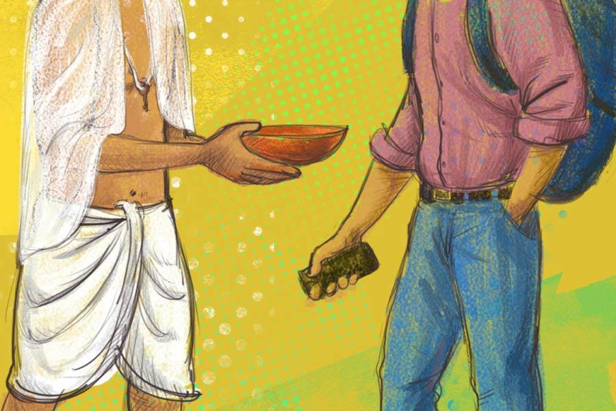

 
 <h1 align=center>স্বপ্নসন্তান</h1>
<h2 align=center>সৈকত মুখোপাধ্যায়</h2> 

ভিক্ষুকের মুখ আর কে মনে রাখে? লোকে তাদের ভিক্ষে দেয়, চলে যায়; মুখের দিকে তাকিয়েও দেখে না। কিংবা দেখলেও মুহূর্তের মধ্যে ভুলে যায়। কিন্তু ওই মা-ছেলে জুটির ব্যাপারটা আলাদা। অনেক দিন ধরে দেখতে-দেখতে ওদের মুখদুটো সুকান্ত চিনে ফেলেছে।

আসলে ওরা দু’জনে যে-যে জায়গাগুলোয় ভিক্ষে করতে দাঁড়ায়, সেইগুলোই আবার সুকান্তরও টাইমপাস করার জায়গা। এটা কাকতালীয় ব্যাপার নয়। তারই মতো, ভিক্ষুকরাও এমন জায়গা খোঁজে যেখানে দিনের অনেকটা সময় ছায়া থাকবে, হঠাৎ বৃষ্টি নামলে একটা মাথা গোঁজার মতো জায়গা থাকবে। সর্বোপরি পাশ দিয়ে ক্রমাগত চলে যাবে ব্যস্ত মানুষের স্রোত।

অভিজ্ঞতা থেকে সুকান্ত শিখেছে যে, পুরোপুরি নির্জন জায়গায় হুজ্জুতি বেশি। সেখানে পুলিশ এসে প্রশ্ন করে, “এখানে কী করছেন?” পাতাখোররা নেশা করতে এসে হুড়ো দিয়ে সরিয়ে দেয়। এমনকি সন্ধের পর লাইনের মেয়েছেলেরা অবধি এসে সে সব জায়গার দখল নিয়ে নেয়।

তার চেয়ে মানুষের ভিড়ই ভাল। যেমন, বিধাননগর স্টেশনের ফুট ব্রিজ, সুভাষ সরোবর লাগোয়া সিনেমাহলের সিঁড়ি। এই রকম কয়েকটা জায়গায় গিয়ে সুকান্ত সারা দুপুর গালে হাত দিয়ে বসে থাকে। বসে বসে মানুষ দেখে। ওদের দু’জনকেও দেখে।

মায়ের বয়স হবে পঁয়ত্রিশ থেকে চল্লিশের মধ্যে। রোগা, শ্যামলা। পরনে একটা নরুনপাড় মোটা কাপড়ের শাড়ি। তেলহীন চুল, খালি পা। ছেলেটার বয়স পনেরো-ষোলো। সেও রোগা, তবে গায়ের র‌ংটা মহিলার চেয়ে একটু উজ্জ্বল। তারও রুক্ষ চুল, খালি পা। পরনে গুরুদশার কাছা, পিছনে পশমের আসন সমেত। রীতি মেনে গলায় সাদা ফালি কাপড়ে বাঁধা একটা লোহার চাবিও ঝোলে।

ছেলেটার হাতে থাকে একটা মাটির সরা। দু’জনে মিলে কাতর গলায় ভিক্ষা চায়। বলে, “পিতৃদায় থেকে উদ্ধার করুন দাদারা, উদ্ধার করুন দিদিরা। মানুষটার শ্রাদ্ধের খরচটুকু আমাদের হাতে দিয়ে যান।”

ও সব শ্রাদ্ধ-টাদ্ধ সবই ঢপ। সুকান্তই কিছু-না-হোক দু’বছর ধরে ওদের এই ভাবে বিভিন্ন জায়গায় ঘুরতে দেখছে। এই দু’বছরে মেয়েটির গায়ে একটু গত্তি লাগল, ছেলেটার নাকের নীচে গোঁফের রেখা আর একটু স্পষ্ট হল। শুধু ওদের গুরুদশা আর কাটল না। ভাগ্যিস লোকে ভিখিরির মুখ মনে রাখে না, না হলে এত দিনে পাবলিকের কাছে খিস্তি খেয়ে যেত চিটিংবাজদুটো।

ওরাও সুকান্তকে চিনে গেছে। দেখা হলে হাসে। খুব করুণ হাসি। আসলে ওদের মুখদুটোই খুব করুণ। ভাসা-ভাসা চোখের দিশাহারা দৃষ্টি, শিথিল ঠোঁট, উঁচু কণ্ঠার হাড়, সব মিলিয়ে এই ভূমিকায় অভিনয়ের জন্যে দু’জনেই একেবারে আদর্শ। সুকান্ত খেয়াল করে দেখেছে, লুকিয়ে এগরোল খাওয়ার সময়েও ওদের মুখে সেই সর্বস্বান্ত ভাবটা লেগে থাকে।

এ রকমই এক দিন, সুকান্ত যখন ওদের বসার জায়গাটার পাশ দিয়ে বাড়ি ফিরছে, তখন ছেলেটা হঠাৎ ওকে ডেকে বলল, “এখানেই বোসো না।”

ও হয়তো ভেবেছিল, সুকান্ত বসার জায়গা পায়নি। বসেনি সুকান্ত। তবে ওর দিকে একটু ঝুঁকে দাঁড়িয়ে জিজ্ঞেস করেছিল, “একা যে? মা কোথায়?”

অনির্দিষ্ট ভাবে এক দিকে আঙুল তুলে দেখিয়েছিল ছেলেটা। তার পর বলেছিল, “ও আমার মা নয়। পার্টনার। এক সঙ্গে কাজ করি। আমার মা মরে গেছে।”

সুকান্ত একটা ধাক্কা খেল। তবে তার পরেও প্রশ্ন করল, “বাবা বেঁচে আছে?”

“কী জানি!” ঠোঁট উল্টেছিল ছেলেটা, “দেখিনি কোনও দিন। মা যত দিন বেঁচেছিল, কী যেন একটা নাম বলত, সেটাও ভুলে গেছি।”

সুকান্ত সোজা হয়ে দাঁড়িয়ে কিছু ক্ষণ মন দিয়ে ছেলেটার মুখটা দেখল। চেহারার স্থায়ী কারুণ্যের সঙ্গে ছেলেটার চোয়াড়ে-মার্কা কথাগুলো ঠিক মিলছিল না। সুকান্ত ভাবল, অভাব জিনিসটা কোথাও না কোথাও তো ছাপ রেখে যাবে। চেহারায় না হলে কথাবার্তায়। তার নিজের মুখেও রেখেছে নিশ্চয়ই। না হলে একটা ভিখিরি-ছেলে এত সহজে তাকে পাশে বসার জন্যে ডাকে কী করে।

সেই লকডাউনের সময় যে চাকরিটা হারিয়েছিল, তার পর থেকে সত্যিই খুব অভাবের মধ্যে দিয়ে দিন কাটাচ্ছে সুকান্ত। গ্রাফিক ডিজ়াইনারের কাজটারও আর আগের মতো কদর নেই। এআই আসার ফলে অনেক কাজ এখন কাস্টমাররা বাড়িতে বসেই করে ফেলছে। এখন তাকে চেয়েচিন্তে কাজ জোগাড় করতে হয়। হেঁটে হেঁটে পা ধরে গেলে এই ভাবে কোথাও বসে থাকে। সন্ধের পর বাড়ি ঢোকে।

সে দিন বাড়ি ফেরার পথে সুকান্তর মাথায় কেবলই ওই ছেলেটার কথা ঘুরছিল। ও বাবাকে দেখেনি, বাবার পরিচয় জানে না। সুকান্ত ভাবছিল, ‘আমার যদি একটা ছেলে থাকত তা হলে তারও বয়স হত ওই রকমই— পনেরো কিংবা ষোলো।’

ছেলে নেই সুকান্তর। ছেলেমেয়ে কিছুই নেই। তবু সুকান্ত দিবাস্বপ্নে যেন নিজের ছেলেকে দেখতে পেল। ওই ভিখিরি ছেলেটাই। শ্যামলা গায়ের রং, শিথিল ঠোঁট, বড়-বড় চোখ। তবে চোখদুটো এখন বোজা। একটা সরকারি হাসপাতালের বেডে শুয়ে আছে, নাকে অক্সিজেনের নল, মুখে একটা মাস্ক। সুকান্ত যেন ওর বেডের পাশে বসে খরখরে সবুজ কম্বলটা যত্ন করে ওর গলা অবধি তুলে দিতে-দিতে বলছে, ‘কষ্ট হচ্ছে বাবা? আর একটু সহ্য কর। টাকা জোগাড় করছি। তোকে ভাল হাসপাতালে নিয়ে যাব। ভাল হয়ে যাবি...’

বাড়ি ফিরে সুকান্ত সেই স্বপ্নটাই চোখে নিয়ে সোশ্যাল মিডিয়ায় একটা পোস্ট দিল— ‘আমার একমাত্র সন্তান, বয়স ষোলো, গত এক মাস যাবৎ মৃত্যুর সঙ্গে লড়াই করছে। ওর চিকিৎসা করাতে গিয়ে আমার সমস্ত সঞ্চয় শেষ হয়ে গেছে। আপনারা যদি সাহায্যের হাত না বাড়িয়ে দেন তা হলে ওকে বাঁচাতে পারব না। নীচে আমার ব্যাঙ্ক অ্যাকাউন্টের ডিটেলস দিলাম।’

তখন যদি কেউ সুকান্তর মুখের কাছে কান নিয়ে যেত, তা হলে শুনতে পেত ও বিড়বিড় করে বলছে, “যার বাপের ঠিক নেই, সে যদি বাপের শ্রাদ্ধের জন্য কাছা পরতে পারে, তা হলে আমিও কি ছেলের চিকিৎসার জন্যে সাহায্য চাইতে পারি না? ভিখিরি হওয়ার কিছু বাকি আছে নাকি আমার?”

