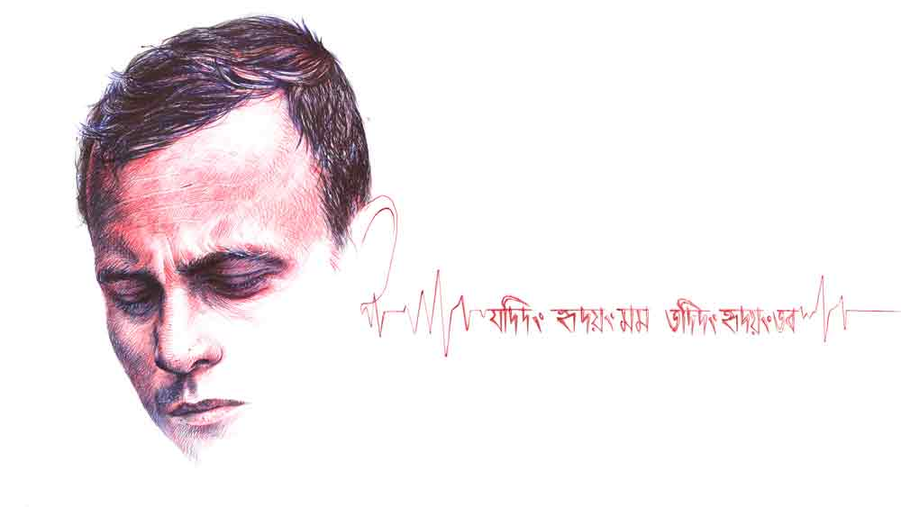

 
 <h1 align=center>স্বর্গাদপি গরীয়সী</h1>
<h2 align=center>সমীরণ বন্দ্যোপাধ্যায়</h2> গোঁ-গোঁ শব্দে মুঠোফোনটা যখন কেঁপে উঠল, আমি তখন পার্টিতে এবং চতুর্থ পেগের মাঝামাঝি। শনিবার সন্ধে ছ’টার পরে, কিছু বিশেষ নম্বর ছাড়া বেশির ভাগ ফোন বিরক্তিকর।

স্ক্রিনে ভেসে ওঠা নাম দেখে খুশি না হলেও বিরক্তি প্রকাশ করতে পারলাম না। সপ্তাহের পৌনে ছ’দিন প্রাণান্তকর চাপের পর, এই পার্টি যে কোনও কর্পোরেট কর্মীর কাছে খোলা আকাশ। বুক ভরে শ্বাস নেওয়ার, অফিসের যাবতীয় টেনশন, বসের রক্তচক্ষু সপাটে গ্যালারির বাইরে হাঁকিয়ে দেওয়ার অনিবার্য সেশন। তখন এক জন মাল্টিন্যাশনাল কোম্পানির উচ্চপদস্থ ম্যানেজারের কাছে মায়ের ফোন খুব কাঙ্ক্ষিত হতে পারে কি?

তবে বিরক্তিকর যে নয়, সেটা দুনিয়াকে বোঝানোর যথেষ্ট দায় আমার আছে। পেশাগত জীবনে দারুণ সফল মানেই ব্যক্তিগত জীবনে মানুষটা বিচ্ছিন্ন দ্বীপের মতো, এমন একটা নেকু-নেকু ভাবনা মার্কেটে চালু আছে। আর সেই সব ভাবনার পশ্চাদ্দেশে সলিড পদাঘাতের জন্য আমি বেছে নিয়েছি সোশ্যাল মিডিয়া। প্রতিবার ‘ভ্যালেন্টাইন’ দিবসে বৌয়ের সঙ্গে দু’-চারটে হম-তুম মার্কা ছবি পোস্ট করতে ভুল হয় না। ‘মাদার্স ডে’ তে ব্যাকগ্রাউন্ডে মন্দির বা ওই জাতীয় একটা কিছু ছবি রেখে মায়ের সঙ্গে ছবি মাস্ট!

বাবাকে নিয়ে ঝামেলা কম। বিশেষ দিনে, ‘বাঁধ মানে না অশ্রুধারা, পড়লে মনে তোমার কথা/ অসময়ে গেলে চলে, দিয়ে সবার মনে ব্যথা’— ছড়া-সহ পিতৃদেবের একটা ব্ল্যাক অ্যান্ড হোয়াইট ছবি। ব্যস, অমনি লাইক-কমেন্টস এর ঝড়!

চুপিচুপি বলে রাখি, এই সব ছড়ার কপিরাইট বৈশাখীর। বাংলাটা আমার আসে না তেমন। বৈশাখীও ইংলিশ মিডিয়াম, তবে বিয়ের পরে শ্বশুর-শ্বাশুড়ির হ্যাপা পোহাতে না হলে, বেশির ভাগ মেয়ের মধ্যে একটু-আধটু কবিত্ব মাথাচাড়া দেয়।

“এক্সকিউজ় মি গাইজ়!” বলে চললাম ওয়াশ রুমে। সঙ্গীতমুখর পানশালায় ফোনালাপ অসম্ভব।

“ব্যস্ত আছিস রাহুল, একটু কথা বলা যাবে?” ও প্রান্তে শোভামাসি। বাড়ির কাজের লোক। আমার মাধ্যমিকের সময় থেকে আছে। পনেরো বছর হয়ে গেল প্রায়।

“না বলো। তুমি ফোন করলে যে, মা কোথায়?”

“দিদির শরীরটা সকাল থেকে খারাপ। বুকে ব্যথা। গ্যাসের ট্যাবলেট খেয়েও কমছে না।”

“রমেশজেঠুকে ফোন করেছ?”

“দিদি করেছিল। ডাক্তারবাবু শিলিগুড়িতে মেয়ের বাড়ি গেছে। শুনে বলল, ট্যাবলেট খেয়ে না কমলে হাসপাতাল যেতে।”

“সকাল থেকে শরীর খারাপ, আরও আগে কেন ফোন করোনি আমাকে?” বেশ ঝাঁঝের সঙ্গে বললাম কথাটা। অশিক্ষিত কাজের লোকগুলো বড্ড ইরেসপন্সিবল, প্রায়োরিটি বোঝে না!

“আমি দুপুরেই করতে চাইছিলাম তো। দিদি বারণ করল। বলল, তুই প্রচণ্ড ব্যস্ত থাকিস অফিসে, ফোন করার দরকার নেই। রোজ রাতে বাসায় ফেরার সময় তুই তো ফোন করিস, তখন বললেই হবে। কিন্তু বাড়াবাড়ি দেখে আমি লুকিয়ে ফোন করছি। একটু তাড়াতাড়ি আয় বাবা, আমার ভয় করছে!”

“ঠিক আছে ঠিক আছে, তুমি মায়ের কাছে বোসো। আমি আসছি।”

টেবিলে ফিরে বললাম, “দুঃখিত বন্ধুরা, বাড়ি থেকে ফোন। মা অসুস্থ, আমাকে এখনই যেতে হবে।”

টেবিলের তিন দিক থেকে ছিটকে উঠল তিন জন। তারা গাড়ি নিয়ে সঙ্গে যেতে প্রস্তুত।

আমি মাথা ঝাঁকিয়ে বললাম, “না না, দরকার নেই। সে রকম সিরিয়াস কিছু নয়। আমি একাই সামলে নিতে পারব। থ্যাঙ্ক ইউ। এনজয়।”

সমবেত আপত্তিতে পাত্তা না দিয়ে বেরিয়ে পড়লাম। এই সব কর্পোরেট আন্তরিকতায় বিগলিত হতে নেই। জমজমাট মেহফিল ছেড়ে মাঝপথে উঠতে হলে যে কেউ চল্লিশটা খিস্তি করবে মনে-মনে। আমিও করতাম! নতুন বছরে অ্যাপ্রাইজ়াল আমার হাতে। নেহাত আহাম্মক ছাড়া বসকে মসকা লাগানোর এমন সুযোগ কেউ ছাড়ে কি!

আজ গাড়ি আনিনি। বৈশাখীর কড়া নির্দেশ, একই সন্ধেয় পান-পেয়ালা এবং স্টিয়ারিং ধরা চলবে না।

এই মুহূর্তে বৈশাখীকে ফোন করা ঝুঁকি হয়ে যাবে। শনিবার সন্ধ্যায় হাব্বি দেরি করে ফিরবে, এমন খবরে কোন মেয়ে খুশি হয়, বিশেষ করে দাম্পত্য জীবন যখন সবে দু’বছর।

আমাদের সুকিয়া স্ট্রিটের বাড়িটা বড় হলেও পুরনো। ইয়া মোটা-মোটা দেওয়াল, উঁচু ধাপের সিঁড়ি। ইতিউতি ফাটল ধরা মোজাইক মেঝে। চামচিকে-চামচিকে গন্ধ চার দিকে।

মা-ই বলেছিল, “এমন ভূতুড়ে বাড়িতে নতুন সংসার পাতার দরকার নেই। বরং গড়িয়ায় যে ফ্ল্যাট কিনছিস, বিয়ের পরে সেখানেই ওঠ বৈশাখীকে নিয়ে। আমি এ দিকের একটা ব্যবস্থা করে চলে যাব তোদের কাছে। একে সাত-শরিকের সম্পত্তি, তার উপর ভাড়াটেয় ছয়লাপ!”

এই কথায় আমি খুশি হয়েছিলাম। মনে-মনে হেব্বি তারিফ করেছিলাম মায়ের বাস্তববুদ্ধির।

ট্যাক্সিতে বসে হোয়াটসঅ্যাপ করলাম বৈশাখীকে, “একটা ছোট্ট ব্যাড নিউজ় ডার্লিং। সকাল থেকে মায়ের শরীর খারাপ। রমেশজেঠু কলকাতায় নেই। এক জন ডাক্তারের ব্যবস্থা করতে হবে। চিন্তা কোরো না। ফিরে ডিনার করব এক সঙ্গে।‘

বার্তা শেষে চুমুর ইমোজি সেঁটে দিলাম গোটা দশেক।

 

সুকিয়া স্ট্রিট পৌঁছে ঘেঁটে গেল সব কিছু। নভেম্বরের মাঝামাঝি এই সময়ে ফ্যান না চালালেও খুব অসুবিধে হওয়ার কথা নয়। অথচ মাথার উপর ফুলস্পিডে ফ্যান ঘুরলেও মায়ের কপালে বিন্দু-বিন্দু ঘাম। কষ্ট হচ্ছে শ্বাস নিতে। চোখমুখে ভিজে গামছা বুলিয়ে দিচ্ছে শোভামাসি। লক্ষণ সুবিধের নয়। অনেক আগেই হাসপাতালে নিয়ে যাওয়া উচিত ছিল।

আসার সময় সব ক’টা ক্রসিংয়ে সিগন্যাল খেতে-খেতে এসেছে ট্যাক্সিটা। মাথা এমনিই গরম ছিল। তার উপরে মেসেজ দেখেও ফোন করেনি বৈশাখী। নির্ঘাত ভেবেছে, জুৎসই বাহানা ভেঁজেছি মায়ের সঙ্গে দেখা করতে যাওয়ার। সেই খচখচানিও রয়েছে মনে!

সব মিলিয়ে ফেটে পড়লাম রাগে। গনগনে গলায় বললাম, “করছিলে কী দু’জন মানুষ মিলে সারা দিন! শরীর খারাপ শুরু হয়েছে সকাল থেকে আর আমায় ফোন করলে সন্ধে পার করে। এই সময়ে রাস্তায় জ্যাম থাকে জানো না? আমি কি উড়ে-উড়ে আসব পার্ক স্ট্রিট থেকে?”

মিনমিন করে কিছু বলতে যাচ্ছিল শোভামাসি। আমি দাবড়ে দিয়ে বললাম, “থামো। এখনই গাড়ি বের করতে বলো ড্রাইভারকে। দরজায় তালা দিয়ে তুমিও চলো সঙ্গে।”

দু’জন মানুষের অন্য জন, অর্থাৎ ড্রাইভার-কাম-টুকটাক কাজের ছেলে সঞ্জয় টেরি বাগিয়ে ফুলবাবু সেজে বারান্দায় দাঁড়িয়ে আছে, সেটা ঘরে ঢোকার আগে দেখে নিয়েছি। মুখচোখও যেন অন্য দিনের চেয়ে ফর্সা-ফর্সা লাগল। ফেশিয়াল টেশিয়াল করেছে কি না কে জানে! সাজগোজের আর দিন পেল না, এ দিকে এক জন অসুস্থ! যত্তসব!

আবার গুঁইগাঁই করতে যাচ্ছিল শোভামাসি। আমি সুযোগ না দিয়ে আরও একটু গলা তুলে বললাম, “নষ্ট করার মতো এক সেকেন্ড সময়ও হাতে নেই। যা বললাম করো। নয়তো আমি একাই চললাম মাকে নিয়ে।”

মৃদু গলায় বারান্দা থেকে সঞ্জয় বলল, “আপনারা জেঠিমাকে নিয়ে আসুন স্যর। আমি গাড়ি বের করছি।”

পাঁজাকোলা করে মাকে তুলতে গিয়ে দেখি, পিঠের কাপড় ভিজে গিয়েছে ঘামে। সত্যিই কাজের লোকগুলোর বোধ কম। কতক্ষণ এই ভাবে পড়ে আছে কে
জানে। দেখেশুনে কাপড়টা তো পাল্টে দিতে হয়!

মান্ধাতার আমলের অ্যাম্বাসাডরগুলোর পিছনের সিটে হাওয়া ঢোকে না। তিন জন বসাও কষ্টকর। অনেক বার বলেছি এটা বাতিল করে নতুন মডেলের এসি গাড়ি কিনতে, কিন্তু বাবার শখের গাড়ি বিক্রি করতে রাজি হয়নি মা।

পিছনের সিটে মাকে নিয়ে বসলাম আমি। সামনে থেকে হাওয়া করতে লাগল শোভামাসি। আসার সময় বুদ্ধি করে মাসি একটা হাতপাখা নিয়েছে দেখছি। আমার তো খেয়াল হয়নি পাখা নেওয়ার কথা!

 

“ম্যাডামের হেলথ ইনশিয়োরেন্স আছে স্যর?”

সুন্দরী রিসেপশনিস্টের দিকে ফর্ম ভরে এগিয়ে দিয়ে বললাম,  “হুঁ, তবে কার্ডটা সঙ্গে আনা হয়নি। আপাতত ডেবিট কার্ডে পেমেন্ট হবে।”

রাত বারোটা কুড়িতে এল বৈশাখীর আট নম্বর ফোন। আগের সাত বার ধরার সুযোগ পাইনি।

“কী গো, ফোন ধরোনি কেন এত ক্ষণ? কেমন আছে মা?”

গলার উদ্বেগ আন্তরিক। মনে-মনে খুশি হলাম। জীবনের প্রতিটি পর্যায়ে সেন্স অব টাইমিং খুব ইম্পর্ট্যান্ট। আইসিইউ-তে মাকে ঢোকানোর সময় টুক করে ছবি তুলে পাঠিয়ে দিয়েছিলাম। একটা ঠিকঠাক ছবি হাজারটা কথার থেকে দামি। ঠিক সময়ে ঠিক সিদ্ধান্ত নিতে পারি বলেই না এই অল্প বয়সে এমন ঈর্ষণীয় ডেজ়িগনেশন আমার নামের পাশে!

যথোচিত ভারী গলায় বললাম, “এখনই কিছু বলা যাচ্ছে না।
দেখা যাক কী বলে ডাক্তার। তোমার ডিনার হয়েছে?”

“হ্যাঁ। তোমার?”

“এই বার করব। তুমি আর জেগে থেকো না। ঘুমোও এখন। আমাকে থাকতে হবে রাতে।”

“ও দিকে মাম, বাপি জেগে। বাপিকে বলব তোমার কাছে যেতে?”

“দরকার নেই। সঞ্জয় আছে, শোভামাসি আছে, সামলে নেব। এই করোনার বাজারে বাপিকে হাসপাতালে টেনে আনতে হবে না। তুমি রাখো আমি কথা বলে নিচ্ছি বাপির সঙ্গে।”

“খুব সাবধানে থেকো। মাস্ক খুলবে না। বার বার হাত পরিষ্কার করবে স্যানিটাইজ়ার দিয়ে।”

 

কাঁধে আলতো ঝাঁকুনিতে চোখ মেললাম। ভোরের দিকে অল্প চোখ লেগে এসেছিল।

“আপনি গীতা গাঙ্গুলির বাড়ির লোক তো? ডক্টর সেনগুপ্ত আপনার সঙ্গে কথা বলবেন।”

বুকটা ধড়াস করে উঠলেও সামলে নিলাম। মাস্কের আড়াল থেকে ওয়ার্ড বয়ের স্মিত মুখ মস্তিষ্কে সঙ্কেত পাঠাল, ‘ভয়ের কিছু নেই’। সঙ্কটজনক পেশেন্টের বাড়ির লোককে কেউ হাসিমুখে ডাকতে আসে না!

খসখস করে কিছু লিখছিলেন ডক্টর সেনগুপ্ত। আমাকে দেখে হেসে বললেন, “আর চিন্তা নেই মিস্টার গাঙ্গুলি, উনি সামলে নিয়েছেন। তবে আরও কয়েক ঘণ্টা আইসিইউ-তে রাখছি। বাই ইভনিং, জেনারেল বেডে ট্রান্সফার করব।”

“আই অ্যাম ভেরি গ্রেটফুল টু ইউ স্যর। এখন মাকে দেখতে পারব?”

“অবশ্যই। তবে বাইরে থেকে। এগারোটা নাগাদ ওঁর ঘুম ভাঙলে, একটু-আধটু কথা বলতে পারেন।”

ধবধবে সাদা বেডে নিশ্চিন্তে ঘুমিয়ে আছে মা। পরনে হাসপাতালের সবুজ পোশাক। কাচের দরজায় মাথা ঠেকিয়ে অনেক ক্ষণ তাকিয়ে থাকলাম সে দিকে।

 লম্বা স্বস্তির নিঃশ্বাস বেরিয়ে এল আমার বুক থেকে। জমে ওঠা মেহফিল তুচ্ছ করে, বৌয়ের গোঁসা গায়ে না-মেখে ঠিক সময়ে  হাসপাতালে এনেছিলাম বলেই মা এখন আরোগ্যের পথে। আদর্শ সন্তান তো এমনই হয়!

ফুরফুরে মেজাজে করিডর ধরে হাঁটতে-হাঁটতে এলাম বাইরের প্রতীক্ষালয়ে। ক্লান্ত, চিন্তিত মুখের ভিড়ে কোণের চেয়ারে বসে ঢুলছে শোভামাসি। কোলে একটা পুঁটলি। মায়ের ছাড়া পোশাক, সেই হাতপাখাটা আছে ওই পুঁটলিতে।

কাছে গিয়ে ডেকে বললাম, “ওঠো মাসি, চা খাবে চলো। মা ভাল আছে।”

দাঁড়িয়ে উঠে নিজেকে গুছিয়ে নিতে-নিতে মাসি বলল, “এখন দেখা করতে দেবে দিদির সঙ্গে?”

“না, এগারোটার পরে। এখন ঘুমাচ্ছে। সঞ্জয় কোথায়?”

“বাইরে আছে। আমি ডেকে আনছি। যা করল ছেলেটা, তুলনা হয় না...” বলল শোভামাসি।

ফুরফুরে মেজাজ চটকে গেল মুহূর্তে। আহামরি কী করেছে ও! দিনে রাতে যখনই দরকার হবে, গাড়ি নিয়ে বেরনোর জন্য মাসে-মাসে পনেরো হাজার টাকা গুনে দেওয়া হয় বাবুকে। দূরে বাড়ি বলে গ্যারেজের পাশে একটা ঘর সারিয়ে-সুরিয়ে দেওয়া হয়েছে থাকতে। তার উপর সাপ্তাহিক বাজার আছে। সেখান থেকেও কিছু ম্যানেজ না করে থাকেন শ্রীমান!

তা সেই নবাবপুত্তুর এক দিন হাসপাতালে এসে রাত জেগে বিরাট কিছু করে ফেলল!

তিতকুটে গলায় বললাম, “রাত তো আমরা সবাই জেগেছি মাসি, তোমার সঞ্জয়কুমার স্পেশাল কী করলেন যার তুলনা মেলা ভার?”

নরম গলায় ম্লান হেসে শোভামাসি বলল, “কাল রাতে ছেলেটার বিয়ে ছিল রে। আমাদের বাড়ির পিছনে থাকে জনার্দন মিস্ত্রি, তার ছোটমেয়ের সঙ্গে।“

“অ্যাঁ! বিয়ে!”

“হ্যাঁ। ওর পিসি থাকে ফুলবাগানে। সেখানে যাওয়ার কথা ছিল সকাল-সকাল। ওই বাড়ি থেকে বরযাত্রী নিয়ে আসবে ঠিক ছিল। কিন্তু দিদির শরীর ক্রমশ খারাপ হচ্ছে দেখে আর বেরোতেই পারল না ছেলেটা!”

লন দিয়ে হাঁটতে হাঁটতে ভাবছিলাম, ঠিক কী করা উচিত আমার? ছেলেটার অ্যাকাউন্টে মোটা টাকা ট্রান্সফার করে দেব? আমার অফিসে ভাল স্যালারিতে ঢুকিয়ে নেব, না কি পিঠ চাপড়ে বলব, ‘ওয়েল ডান বয়!’ এমপ্লয়িরা টার্গেট অ্যাচিভ করলে যেমন বলে থাকি আর কী!

লনের শেষ প্রান্তের বেঞ্চিতে হেলান দিয়ে বসে আছে সঞ্জয়। খুব জানতে ইচ্ছে করছে, কী আছে ওর চোখে, ধু-ধু শূন্যতা, না কি দায়িত্ব পালনের তৃপ্তি। কিন্তু জীবনের প্রতি পদে দুইয়ে-দুইয়ে চার মিলিয়ে চলা কর্পোরেট ম্যানেজারের সাহস হচ্ছে না যে ওই বেহিসেবি আবেগের মুখোমুখি দাঁড়ানোর!

একটু ইতস্তত করে পিছন থেকে সঞ্জয়ের কাঁধে হাত রাখলাম আমি।