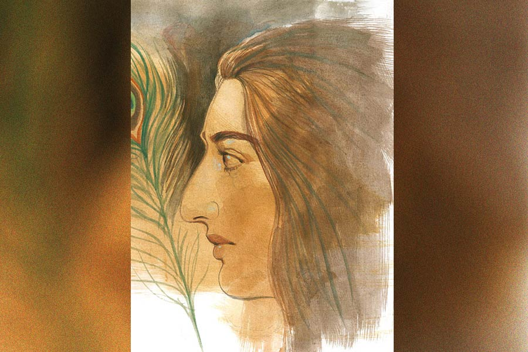

 
 <h1 align=center>স্মারক</h1>
<h2 align=center>মৌসুমী চৌধুরী</h2> টক দই, নুন, হলুদ, কুচোনো পেঁয়াজ, আদাবাটা আর শুকনো লঙ্কার গুঁড়ো দিয়ে মাংসটা দ্রুত হাতে মেখে নিচ্ছে সুরেশ্বরী। পাত্রপক্ষের জন্য লুচি-মাংসের ব্যবস্থা করেছে মলয়। তারই তোড়জোড় চলছে। মনটা আজ কেমন যেন জুতে নেই। বাঁ চোখের পাতাটা সমানে লাফাচ্ছে। মন বড় কু-ডাক ডাকছে।

মলয় এসে তাড়া লাগায়, “হাত চালাও সুরো। ওঁরা কিন্তু তাড়াতাড়িই এসে পড়বেন। কনে-দেখা-আলোয় ওঁরা দেখবেন মিতুকে।”

মাংসে মশলাপাতি মাখিয়ে তাতে একটু কাঁচা সরষের তেল ফেলে দেয় সুরেশ্বরী। তার পর আবার মাখতে থাকে। ক্লান্ত গলায় বলে, “ভগবানের কাছে প্রার্থনা করো, এক বারে যেন মিতুকে পছন্দ হয়ে যায় পাত্রপক্ষের।”

গায়ের গেঞ্জিটা কাচার গামলায় ফেলে বাথরুমে ঢোকার আগে মলয় বলে, “হবে গো, হবে। পরান ঘটক বলেছে, পাত্রের রোজগার বেশ ভাল। আমাদের মিতুর ছবি দেখেই নাকি মনে ধরেছে। আর সঙ্গে সঙ্গেই দেখতে আসতে রাজি হয়ে গেছে।”

মশলা মাখানো মাংস ঢাকা দিয়ে রেখে মুখঝামটা দেয় সুরেশ্বরী, “রাখো তো তোমার মনে ধরা! আলু-পটলের মতো মেয়ে দেখে বেড়ায় এরা। কাউকেই পছন্দ হয় না। যত্তসব!”

স্নানে ঢুকে যায় মলয়। 

সুরেশ্বরী মেয়ের ঘরে উঁকি দেয়। সবে স্নান সেরে এসে ভিজে চুল ঝুলিয়ে চোখ বুজে শুয়ে আছে মিতু। মুখটা দেখে কেমন মায়া লাগে সুরেশ্বরীর! মেয়ের মধ্যে নিজেকেই যেন দেখতে পায় সে। সবাই বলে মেয়ের মুখে নাকি মায়ের মুখ কেটে বসানো, আর গায়ের ফর্সা রংটা বাপের থেকে পাওয়া। গত বছর বিএ পাশ করেছে মেয়ে। আজকাল শুধু বিএ পাশ করে তো আর চাকরি-বাকরি কিছু হয় না। বিউটিশিয়ান কোর্স-টোর্স বা প্রাইভেটে নার্সিং ট্রেনিং করানোর সামর্থ্য তাদের নেই। লকডাউনে মলয়ের শাঁখা আর ইমিটেশন গয়নার দোকানটা বন্ধ হয়ে গিয়েছিল। তখন জমানো টাকা ভেঙে, ধার করে সংসারটাকে কোনও ক্রমে চালিয়ে নিতে তাদের প্রাণান্তকর অবস্থা হয়েছিল। মলয় এখন আবার দোকান খুলেছে ঠিকই। কিন্তু ব্যবসা মন্দা। মেয়েটার পর তো যমজ দুই ছেলে রয়েছে সুরেশ্বরী-মলয়ের। তারাও পড়াশোনা করছে। একার রোজগারে মলয়ের পক্ষে সংসার চালানোই মুশকিল হয়ে পড়ছে! নানা দিক বিবেচনা করে মেয়ের জন্য পাত্র দেখতে শুরু করেছে মলয়।

মেয়ের ঘর থেকে রান্নাঘরে এসে গ্যাস ওভেনে কড়া বসিয়ে তেলে রসুন থেঁতো, গোটা গরম মশলা, তেজপাতা ফোড়ন দিয়ে তাতে মেখে রাখা মাংসটা ছেড়ে দেয় সুরেশ্বরী। গ্যাসটাকে সিমে রেখে মাংস কষতে কষতে লুচির জন্য ময়দা মাখতে শুরু করে। রান্নাঘরের জানালার বাইরে ঝাঁকড়া আমগাছটার পাতায় দুলছে ফাল্গুনের স্তব্ধ দুপুর। প্রচুর মুকুল এসেছে গাছটায়। মুকুলের বুনো গন্ধে চার পাশ মাতোয়ারা। আমগাছের পাশের দিঘিটা থেকে হাওয়া উঠে আসছে ধীর লয়ে। জামগাছের ডালে একটা দাঁড়কাক খ্যা-খ্যা করে ডেকে চলেছে। মনটা বড় উদাস হয়ে যাচ্ছে সুরেশ্বরীর। পিছিয়ে যাচ্ছে প্রায় দু’যুগ আগের এমনই আর একটা দিনে।

“এই দিদি ই-ই-ই-ই! জামাইবাবুকে দারুণ দেখতে রে!” সুরেশ্বরীর ছোট ভাই ভল্টু হাঁপাতে হাঁপাতে এসে খবর দেয়।

“ধ্যাত! বিয়েই হল না তো জামাইবাবু!” ভাইকে লজ্জা-মেশানো ধমক দেয় সুরেশ্বরী।

“এইমাত্র দেখে এলুম রে! পুকুরপাড় ধরে আসছে দাদার সঙ্গে। তোকে এ বার ঠিক পছন্দ করবে, দেখে নিস!"

দাদা আগেই পাত্রপক্ষকে আনতে স্টেশনে চলে গেছে, মনে পড়ল সুরেশ্বরীর। তাদের গ্রাম রূপরামপুর থেকে স্টেশন খানিকটা দূরে।

“চল, চল, তোকে দেখার আগেই তুই দেখে নিবি তোর হবু বরকে!” ভল্টু নাছোড়।

“দূর... বর-বর করিস না তো!” সুরেশ্বরী কপট রাগ দেখায়।

“আরে চলই না! যখন গেট দিয়ে ঢুকবে, নারকেল গাছের আড়াল থেকে দেখে নিবি। কচি কলাপাতা রঙের পাঞ্জাবি পরে আছে।”

বাগানে লুকিয়ে থাকে দু’ভাইবোন। পাত্রপক্ষ ঢুকতেই সুরেশ্বরী দেখে প্রায় ছ’ফুট লম্বা সৌম্যদর্শন ছেলেটিকে। গায়ে সবুজ পাঞ্জাবি। যেন তারুণ্যের প্রতীক। মনের ভিতরে যেন একটা ঢেউ আছড়ে পড়ে সুরোর। ছেলেটির সঙ্গে দু’জন বয়স্ক মহিলা আর এক জন বয়স্ক পুরুষ। তাঁদের চেহারায় গাম্ভীর্য। ছেলেটি ততটা গম্ভীর নয়। বরং মুখে যেন একটা ছেলেমানুষি হাসি।

দুপুরে খাওয়ার আয়োজন করা হয়েছিল পাত্রপক্ষের জন্য। সুরোর বাবা বলেছিলেন, “অত দূর থেকে আসছেন ওঁরা। দু’টি ডাল-ভাত না খাওয়ালে খারাপ দেখায়।”

দুপুরে বাবাও তাঁদের সঙ্গে খেতে বসলেন আর গর্বভরে সুরোর হাতের রান্নার প্রশংসা করতে লাগলেন। পাত্রের সঙ্গে এসেছিলেন তাঁর বাবা-মা আর কাকিমা। তাঁরাও সুরোর রান্নার প্রশংসা করলেন। হঠাৎ সবুজ পাঞ্জাবি বলে বসল, “মাংসটা দারুণ হয়েছে। আর একটু পাওয়া যাবে?”

এর আগে বেশ কিছু পাত্র সুরোকে নাকচ করার পর আজ এরা দেখতে এসেছেন। সে জন্য পাত্রের এমন কথায় বাবা-মা খুশিতে গদগদ হয়ে উঠছিলেন। 

খাওয়ার পর মেয়ে দেখার পালা। পাত্রের বাবা তো সুরেশ্বরী নামটি শুনে বললেন, “বাঃ! ভারী মিঠে নামটি তো! তোমার হাতের রান্নার মতোই চমৎকার!”

এ বার সবাইকে অবাক করে দিয়ে সবুজ পাঞ্জাবি সহসা সুরোর দিকে সরাসরি তাকিয়ে বলে ওঠে, “নমস্কার। আমি সুরজিৎ দত্ত। আপনার সঙ্গে কি একটু আলাদা ভাবে কথা বলতে পারি?”

সুরোকে উত্তর দেওয়ার সুযোগ না দিয়ে তৎপর হয়ে উঠলেন তার বাবা, “হ্যাঁ হ্যাঁ... যাও যাও বাবা, তোমরা নিজেরা কথা বলে নাও। সেটাই তো ভাল।”

তখনকার দিনে পাত্রপাত্রীর এ ভাবে একান্তে আলাদা কথা বলার রেওয়াজ ছিল না। মা, ঠাকুমা খুব ক্ষুণ্ণ হয়েছিলেন। কিন্তু যে-হেতু বার বার পাত্রপক্ষ সুরোকে অপছন্দ করছিল, তাই তারা তাঁদের অপছন্দটা আর মুখ ফুটে বলতে পারেননি। সুরোর একটা হিল্লে হওয়া তাঁদের কাছে তখন অনেক বেশি গুরুত্বপূর্ণ।

রূপরামপুরে সুরেশ্বরীদের বাড়ির পিছনে ছিল খুব সুন্দর ফুলের বাগান, রকমারি ফলের গাছ আর বাঁধানো পুকুরঘাট। সেখানেই বসেছিল তারা। দূরে গোধূলির গেরুয়া আলো মিশে যাচ্ছিল দিগন্তের আঁচলে। পুকুর ধারের জামগাছে শালিকের দল কিচিরমিচির করে ভেঙে দিচ্ছিল সব নিস্তব্ধতা। একটু চুপ করে থেকে সুরজিৎ বলে উঠেছিল, “ঠাকুরদার আমলের পারিবারিক ডেকোরেটর্সের ব্যবসাটা বাবার হাত থেকে এখন আমার আর দাদার হাতে। পুজো-পার্বণ, বিয়ে-অন্নপ্রাশন, শ্রাদ্ধ ও নানা অনুষ্ঠানে বরাত খারাপ আসে না। যা রোজগার করি, তাতে খেয়ে-পরে জীবন ঠিকঠাকই চলেই যাবে মনে হয়...” বলে একটু থেমেছিল সুরজিৎ। তার পর আবার বলতে শুরু করেছিল, “আপনাকে আমার খুব ভাল লেগেছে, সুরেশ্বরী। আপনিও আপনার মতটা বলুন। আমাকেও কি আপনার ভাল লেগেছে?”

বুকের ভিতরটা উথাল-পাথাল করে উঠেছিল সুরোর। অতীতে যাঁরা তাকে দেখে গেছেন, কেউ তো কখনও এমন করে তার মনের খবর জানতে চাননি! তাঁরা দেখে গিয়ে নিজেদের অমতটাই শুধু জানিয়েছেন। মুখে কোনও কথা সরছিল না সুরেশ্বরীর। ভীষণ এক ভাল লাগায় আবিষ্ট হয়ে বসে ছিল সে। কোনও ক্রমে মাথা নেড়ে সম্মতি জানিয়েছিল।

তার পর সুরজিৎ তার হাতে তুলে দিয়েছিল একটা ময়ূর-পালক। বলেছিল, “আমার স্মারক দিয়ে গেলাম। আমার দাদারও বিয়ে ঠিক হয়ে আছে। সে পর্ব মিটে গেলে খুব শিগগির নিয়ে যাব তোমায়।”

সেই পালকটা সুরো বহু যত্নে তুলে রেখেছিল তার একান্ত নিজস্ব ডায়েরির পাতার ভিতর। একটা একটা করে দিন সে তার আসার জন্য অপেক্ষা করত। অপেক্ষার দাগ পড়ত ডায়েরির তারিখগুলোয়। কিন্তু সেই ‘খুব শিগগির’ নিয়ে যাওয়ার দিনটা আর কোনও দিন আসেনি। তার বদলে বহু দিন পরে এসেছিল সুরজিতের বাবার চিঠি। তাতে লেখা ছিল যে, সুরেশ্বরীর সঙ্গে তাঁদের কনিষ্ঠ পুত্র সুরজিতের বিয়ে দিতে তাঁরা অপারগ। তাঁদের পরিবারে একটা দুর্ঘটনা ঘটেছে। বিয়ে করতে যাওয়ার পথে গাড়ি অ্যাক্সিডেন্টে মৃত্যু হয়েছে তাঁদের বড় ছেলের। পরিস্থিতি বিবেচনা করে বড় ছেলের জন্য মনোনীত পাত্রীর সঙ্গেই তাঁরা ছোট ছেলের বিয়ে দেওয়ার সিদ্ধান্ত নিয়েছেন। সুরজিৎও তাঁদের এই সিদ্ধান্ত মেনে নিয়েছে।

লুকিয়ে লুকিয়ে খুব কেঁদেছিল সুরেশ্বরী। বুকের অনেক গভীরে কোথাও পাকিয়ে ওঠা গোপন অভিমান ক্রমে ক্রমে যেন পাথর হয়ে গিয়েছিল। যার খবর কেউ কখনও, কোনও দিনও জানতে পারেনি।

কিন্তু জীবন তো থেমে থাকেনি।

সে গড়িয়ে চলেছে নিজের মতো করে। কিন্তু সেই গোধূলির কথা মনে এলে আজও কেমন যেন একটা বুক খাঁ-খাঁ করা অনুভূতি হয় সুরেশ্বরীর।

মিতুকে দেখতে অনেক ক্ষণ আগেই এসে গেছে পাত্রপক্ষ। পাত্রের সঙ্গে এসেছেন তাঁর মামা-মামি আর পরান ঘটক। বর্ধমানের নবগ্রাম থেকে পাত্রপক্ষ এসেছেন মিতুকে দেখতে। পাত্রের তিন পুরুষের ডেকোরেটর্সের বিজ়নেস... সঙ্গে ইভেন্ট ম্যানেজমেন্ট ও ওয়েডিং প্ল্যানিং-এর বিজ়নেস শুরু করেছে পাত্র নিজে। সুরেশ্বরী অবাক হয়ে ভাবে, সব কিছুই তো মিলে যাচ্ছে একদম... সুরজিৎরাও এসেছিলেন নবগ্রাম থেকে, তাঁদেরও ছিল পারিবারিক ডেকোরেটর্সের ব্যবসা! অদ্ভুত সমাপতন!

বসার ঘর থেকে তাঁদের টুকরো-টাকরা কথা ভেসে আসছে। গরম গরম লুচিগুলো ভেজে তুলছে সুরেশ্বরী। বাটিতে মাংস বেড়ে নিয়েছে। ট্রেতে করে লুচি-মাংস, মিষ্টি নিয়ে বসার ঘরের সেন্টার টেবিলে রাখে। আর তার পর মুখ তুলতেই চমকে ওঠে সুরেশ্বরী!...

সেই একই রকম মুখের গড়ন, একই উজ্জ্বল শ্যামবর্ণ গায়ের রং, ছ’ফুটের মতো লম্বা এবং চওড়া কাঁধ। আর কী আশ্চর্য! এ ছেলেও তো একটা কচি কলাপাতা রঙের শার্ট পরে এসেছে!

খেতে খেতে ছেলেটি বলে ওঠে, “মাংসটা নিশ্চয়ই মাসিমার রান্না? অপূর্ব! আর একটু পেতে ইচ্ছে হচ্ছে।” বলে হাসিমুখে তাকায়।

“তোমার নাম কী বাবা?” মলয় জিজ্ঞেস করে।

“জয়জিৎ দত্ত,” সপ্রতিভ স্বরে উত্তর দেয় ছেলেটি।

সুরেশ্বরীর বুকের ভিতরটা যেন ফেটে পড়ার উপক্রম হয়।

“তা তোমার বাবা-মা এলেন না?”

এ প্রশ্নের উত্তর দেন ছেলেটির মামা, “গত বছর কোভিড সংক্রমণে আমার জামাইবাবু চলে যাওয়ার পর দিদি আর তেমন কোথাও বেরোতে চায় না। ভাগ্নে ব্যবসার কাজে নবগ্রাম থেকে কলকাতায় আমার বাড়িতে এসেছে। তাই আমিই সঙ্গে এলাম।”

আর থাকতে না পেরে সুরেশ্বরী জিজ্ঞেস করে, “আপনার জামাইবাবুর নাম কী, দাদা?”

“স্বর্গীয় সুরজিৎ দত্ত। একটা দুর্ঘটনায় তাঁর দাদা মারা যাওয়ার পর তাঁদের এই পারিবারিক  ব্যবসাটি তাঁর একার হাতেই ফুলেফেঁপে উঠেছিল। লকডাউন পিরিয়ডে ব্যবসা মন্দা চললেও এখন তো আমার এই ভাগ্নের হাতে নতুন দিশায় ছড়িয়ে পড়ছে...”

অনেক রাত অবধি ঘুম আসে না সুরেশ্বরীর। পাশে মলয়ের নাক ডাকার শব্দ শোনা যাচ্ছে।

ডায়েরিটা হাতে নিয়ে দরজা খুলে বাইরে বাগানে বেরিয়ে আসে সে। দিঘির ধারে এসে দাঁড়ায়। আকাশ উথলে নেমে আসা দুধেল জোছনায় ভেসে যাচ্ছে চার দিক। দিন দুয়েক পরেই বোধহয় দোলপূর্ণিমা। জোছনায় চিকচিক করছে দিঘির জল। হলুদ হয়ে যাওয়া বহু দিনের পুরনো ডায়েরিটার পাতা খোলে সুরেশ্বরী। বার করে আনে সেই ময়ূর-পালক। বহু দিন ধরে আগলে রাখা পালকটি তার পর হাতের তালুতে রেখে চোখ বুজে ফুঁ দিয়ে উড়িয়ে দেয়। জোছনা ধোওয়া রাতের বুকে হাওয়ার ডানায় চেপে উড়তে উড়তে অন্ধকারে কোথায় যেন মিলিয়ে যায় সে পালক।

সুরজিতের স্মৃতিচিহ্ন তার হাতেই আবার ফিরে গেল কি? চোখদুটো ক্রমশ ঝাপসা হয়ে আসে সুরেশ্বরীর।