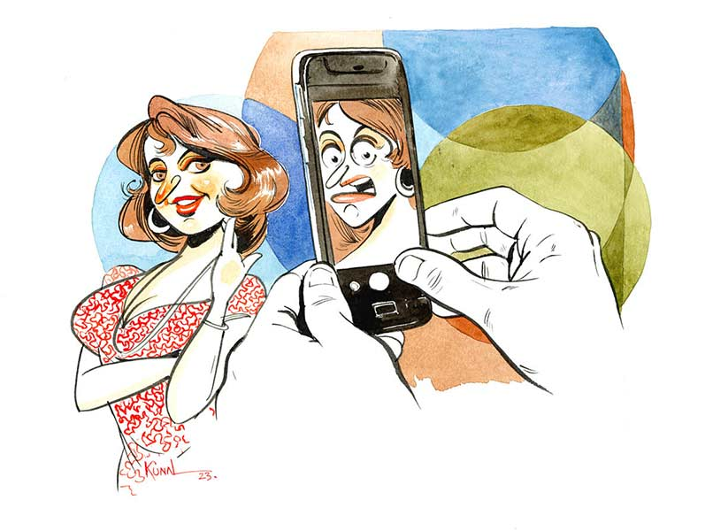

 
 <h1 align=center>স্মার্ট রিমির ভাইরাল ভ্লগ</h1>
<h2 align=center>সুমন সরকার</h2> অনেকেই বলেন, পুজো আসছে-আসছে, এটাই ভাল। কিন্তু, অমিয়র ক্ষেত্রে ব্যাপারটা একদমই উল্টো। পুজো আসছে ব্যাপারটা তার কাছে পরীক্ষা আসছে-র মতোই তিতকুটে। কারণটা একটু অদ্ভুত। এই পুজো আসছে-আসছে সময়টায় একটা জিনিস এসে পড়ে, যার নাম শপিং! শপিং জিনিসটা অত্যন্ত বিরক্তিকর লাগে অমিয়র। সে ইন্টারনেট সার্চ করে দেখেছে। এই সমস্যার সাহেবি নাম ‘অফিসিনাফোবিয়া’। যে কোনও রোগ সম্পর্কে কিছু ক্ষণ ইন্টারনেটে সার্চ করলে আপনি বুঝে যাবেন যে, আপনার ক্যান্সার হয়েছে কিংবা হতে চলেছে। এটিও সম্ভবত ব্যতিক্রম নয়।

অমিয় তার এই জটিল রোগের কথা নিজের মধ্যেই রেখেছে। প্রাণের বন্ধু সুকানকেও বলেনি। অমিয়র জীবনটা এমনিতে খারাপ নয়। ভাল মাইনের সরকারি চাকরি। অমিয় আর অমিয়র মা, সুন্দর মধ্যবিত্ত সংসার। অমিয়র জীবনে প্রেম এসেছিল, মুনমুন। মুনমুন অমিয়র সঙ্গে দু’বছর ঘুরে অন্য একটি ছেলেকে বিয়ে করে আমেরিকা চলে যায়। অমিয় তার জন্য নিজেকেই দোষী মনে করে। তার ওই অদ্ভুত নামের ব্যামোটিই হয়তো এর জন্য দায়ী! তাই অমিয় ঠিক করেছিল আর প্রেম করবে না।

মুশকিল হল, পুরুষমানুষ জীবনে এ রকম বহু কাজ করার পর ঠিক করে, আর কোনও দিন সেই কাজটি করবে না। কিন্তু তারা আবার সেই কাজটিই করে বসে! অমিয় অবশ্য দ্বিতীয় প্রেমটি করার সুযোগ পায়নি। কারণ তার আগেই তাকে জীবনের প্রথম বিয়েটি করতে হয়েছিল।

অমিয় যে অফিসিনাফোবিয়ায় আক্রান্ত, এই সত্য সম্পর্কে সে জানতে পেরেছিল মুনমুনের সঙ্গে প্রেম করার সময়। মুনমুন শপিং করতে যেতে চাইলেই অমিয় নানা বাহানায় কাটিয়ে দিত। অফিসে চাপ, পেট ছেড়েছে, মায়ের শরীর ভাল নয় ইত্যাদি ইত্যাদি। কিন্তু পুজোর আগে তো কোনও বাহানাই শপিংয়ের বায়না কাটানোর ক্ষমতা রাখে না। তখন অমিয়র জীবন কচুবন হয়ে যেত, যে কচুবন প্রোমোটাররাও কোনও দিন পরিষ্কার করে ফ্ল্যাট তুলবে না! তার পর তো মুনমুন চ্যাপ্টারের ইতি। খুব কষ্ট পেয়েছিল বেচারা অমিয়। তবে ওই তীব্র কষ্টের সময়েও কিছু ক্ষণের একটা বিজ্ঞাপন বিরতির মতো তার মনে হয়েছিল, ‘যাক বাবা! আর শপিং করতে হবে না!’

তার পর সময় নিজের খেয়ালে এগিয়ে গেছে। অমিয়র মা পাত্রী দেখা শুরু করে দিয়েছিলেন। অমিয় বিয়ে করতে চায়নি। তার ধারণা ছিল, ওই অদ্ভুত ব্যামোর জন্য সে হয়তো বৌকে সুখী করতে পারবে না। মুনমুন ছেড়ে চলে গেছে, যদি বৌও ছেড়ে চলে যায়! প্রেমিকার চলে যাওয়া আর বিয়ে-করা বৌ ছেড়ে যাওয়া এক নয়। যেমন প্রাইভেট সেক্টরে চাকরি চলে যাওয়া আর সরকারি চাকরি চলে যাওয়া এক নয়। কিন্তু অমিয়র মা কিছুই শুনতে চাইলেন না। অমিয়র মায়ের খুব ইচ্ছে, গ্রামের দিকের কোনও মেয়েকে ঘরের বৌমা করে আনবেন। ঠাকুর মুখ তুলে চেয়েছেন। অমিয়র সঙ্গে রিমির বিয়ে ঠিক হয়েছে। রিমি বেশির ভাগ সময় গ্রামে থাকে। ইনস্টাগ্রামে।

অমিয় আর রিমির বিয়ে হয়েছিল জানুয়ারির শীতে। অমিয় অবশ্য তার অফিসিনাফোবিয়ার কথাটা চেপে গেছে। রিমি বাপ-মায়ের একমাত্র আদুরে মেয়ে। বাবার একটা সচল ব্যবসা আছে। রিমি চাকরি করে না। অমিয়কে তার বেশ ভাল লেগেছে। বিয়ের দু’দিনের মাথায় অমিয় জানতে পারে রিমির হবি হল, শপিং! এই কথা শুনে উত্তেজনায় নিকষ্যি নির্ভেজাল ঘটি অমিয়র মুখে বাঙাল বুলি ফুটে ওঠে— “তা এই কথাটা তুমি আমারে আগে বলবা না!”

সরল মনের মেয়ে রিমি বুঝতে পারেনি, এটা এমন কী কথা যে, বিয়ের আগেই বলতে হবে! শপিং করতে তো সব মেয়েরাই ভালবাসে। এমনকি মনখারাপের সেরা ওষুধ হল শপিং! অমিয় কথা বাড়ায়নি সে দিন। রাতে রিমির কাছেও যায়নি সে। রিমিও কিছু বলেনি।

পরের দিন রিমি অমিয়কে বলল, “শপিং আমার হবি বলে, তুমি আমার থেকে দূরে সরে থাকবে?” রিমির চোখে জল। অমিয় কী বলবে, বুঝে উঠতে পারে না। যদি সে নিজের অফিসিনাফোবিয়ার কথা বলে, তা হলে প্রমাণিত হবে যে, সে বিয়ের আগে এ রকম একটা কথা লুকিয়েছে! হয়তো রিমি ভাববে আরও অনেক কিছুই লুকিয়েছে অমিয়। অমিয় কোনও মতে ম্যানেজ দিয়ে সে দিনের মতো অফিস চলে যায়।

অফিসে কোনও কাজ হয় না। তাড়াতাড়ি বেরিয়ে আসে অফিস থেকে। তার পর একা একা গঙ্গার ধারে একটা নির্জন জায়গায় গিয়ে অনেক ক্ষণ বসে থাকে। রিমি খুবই সরল মনের মিষ্টি একটা মেয়ে। সহজ ভাবে বাঁচতে চায়। তার হবি যদি শপিং হয়, তা হলে স্বামী হয়ে এই সামান্য আবদার কি অমিয় মেটাতে পারবে না! সুকান এক বার বলেছিল, “বিয়ের পর ওই যে তিন বার বৌকে বলতে হয়, ‘আজ থেকে তোমার ভাত-কাপড়ের দায়িত্ব আমি নিলাম,’ সেখানে শপিং কথাটা ঊহ্য থাকে। যদিও ওটাই আসল কথা। মানে তোমার ভাত-কাপড়ের দায়িত্ব আমি নিই বা না নিই, তোমার সঙ্গে শপিং-এর দায়িত্ব আমি নিলাম।”

অমিয় মনে মনে ঠিক করে নেয়, রিমির জন্য সে অফিসিনাফোবিয়াকে জাহান্নামের রাস্তা দেখিয়ে দেবে। মানুষ চাইলে কী না পারে। এই মানুষ তো চাঁদেও যাচ্ছে, তা হলে অমিয় মানুষ হয়ে তার গিন্নির সঙ্গে সামান্য শপিংয়ে যেতে পারবে না!

অমিয় আর রিমির বিয়ের আট মাস কেটে গেছে। অমিয় আর অফিসিনাফোবিয়াকে তেমন পাত্তা দেয় না। অমিয়র পরিবারের সঙ্গে দারুণ মিলেমিশে গেছে রিমি। সব সময় হইচই, খাওয়া, উৎসবের মেজাজ। প্রায় সব কিছুই সে রেকর্ড করে ভ্লগ, মানে ভিডিয়ো ব্লগ বানায়। রিমির একটা ইউটিউব চ্যানেল আছে, নাম ‘স্মার্ট রিমি’। সেখানেই ওই সব আপলোড করে। সামনে দুর্গাপুজো। রিমি আর অমিয়র বিয়ের পর প্রথম পুজো। রিমি এ বার ঐতিহাসিক শপিং করতে বদ্ধপরিকর। এ দিকে অফিসিনাফোবিয়াকে সাইড করে দিলেও অমিয়র জীবনে আর একটি সমস্যার উদয় হয়েছে। রিমি মাঝে মাঝে অমিয়কে তার ছবি তুলে দিতে বলে ফোনের ক্যামেরায়। কিন্তু অমিয়র তুলে দেওয়া ছবি কখনওই পছন্দ হয় না রিমির। রিমি অভিমান করে, “তুমি ভালবেসে ছবি তোলো না। তাই এত খারাপ ওঠে।”

এ দিকে অমিয় কিছুতেই বুঝতে পারে না ছবিটি কেন খারাপ! ছবি তোলা নিয়ে রিমি একটু বেশিই অভিমান করে। অমিয় মনে মনে ভাবে, ভাল ছবি তুলতে না পারাও কি কোনও রোগ? এই নিয়ে টেনশন করতে করতে অমিয় এক দিন স্বপ্ন দেখে, সে ট্রেনে চেপে অফিস যাচ্ছে। ট্রেনের কামরায় দেওয়ালে সাঁটানো বিজ্ঞাপন, ‘বিয়ে করতে ভয়? ভাল ছবি তোলার অক্ষমতা, ছবি ক্ষুদ্র ও বক্র, ফেসবুক রিচের শীঘ্রপতন...’ বিজ্ঞাপন পুরোটা পড়ার আগেই স্বপ্ন শেষ। অমিয় কিন্তু ভালবেসেই রিমির ছবি তোলে। কিন্তু রিমির পছন্দ হয় না। অমিয়র কাছে কী-ই বা চেয়েছে সে? একটু ভাল ছবি। এটা আর কী এমন চাওয়া! অমিয় কি পারবে না, রিমির ভাল ছবি তুলে দিতে?

অমিয় যখন নিজেকে এক জন ভাল ফোটোগ্রাফার হিসেবে গড়ে তোলার প্রস্তুতি নিচ্ছে, তখনই পুজো আসতে আর এক মাস মতো বাকি। মানে শপিং আর শপিং। একটা রবিবার অমিয় আর রিমি গেছে নর্থ সিটি শপিং মলে। রিমি জামাকাপড় দেখিয়ে জিজ্ঞেস করছে, “এটা পরলে আমাকে কেমন লাগবে, অথবা ওটা ট্রাই করলে কেমন হয়?”

অমিয় হ্যাঁ অথবা না, কোনওটাই কনফিডেন্টলি বলতে পারে না। রিমি রেগে যায়। সরকারি চাকরির পরীক্ষায় চারটে অপশন থাকে, এখানে রিমি অজস্র ড্রেসের মধ্য থেকে সঠিক উত্তরটি বেছে নিতে বলছে। এত চাপ পড়ায় অমিয়র মাথা ঘুরতে থাকে। সেই পুরোনো শপিংজনিত অসুস্থতা যেন আবার ফিরে আসছে। এর আগে সে একটা উপায় বার করেছিল। একদম তাড়ু চালাবে, কোনও এক দিন সব কিছুকেই ভাল বলবে, আর কোনও এক দিন সব কিছুকেই খারাপ বলবে। ভাল বললে রিমি খুশি হয়ে কিনে নেবে, আর সব খারাপ বললে রিমি এক সময় ‘তুমি কিস্যু বোঝো না’ বলে বিরক্ত হয়ে অমিয়কে আর জিজ্ঞেস করবে না। কিন্তু পুজোর এক মাস আগে কোনও এক রবিবার নর্থ সিটি মলে এসে অমিয় খাবি খাচ্ছে। বিশাল ভিড়! মেয়েদের ট্রায়াল রুমের সামনে অপেক্ষা করছে অসংখ্য অভাগা স্বামী, পরপুরুষ, বয়ফ্রেন্ড প্রজাতির মানুষজন। সকলের মুখে টেনশনের ছাপ স্পষ্ট। যেন এখনই মাধ্যমিকের রেজ়াল্ট বেরোবে!

দশ-বারো হাত লম্বা একটা সরু প্যাসেজ, সেখান থেকে ডান দিকে বেঁকে গেলে পর পর ট্রায়ালরুম। ওই সরু প্যাসেজের সামনে পূর্ব-উল্লিখিত প্রজাতির লোকজন অপেক্ষারত। কারও স্ত্রী, কারও পরস্ত্রী, কারও গার্লফ্রেন্ড সদ্য পছন্দ-করা পোশাক পরে ওই সরু প্যাসেজের সামনে এসে তাদের অভাগা স্বামী, পরপুরুষ, বয়ফ্রেন্ডদের জিজ্ঞেস করবেন যে, “কেমন লাগছে?” তারা সিলমোহর দিলেই ওই পোশাকটি কেনা হবে। সিলমোহর না দিলে যে কেনা হবে না, এ কথা সত্য নয়। সেই অভাগা পুরুষদের ভিড়ে একটা মুখ অমিয়। এই টেনশন সে নিতে পারছে না! কখন আসবে রিমি?

হঠাৎ সামনে এক অচেনা মহিলা আবির্ভূত হয়ে তার দিকে তাকিয়ে বলল, “এটা কেমন লাগছে গো?”

অমিয় ভাবল, এই জায়গায় দাঁড়ালে হয়তো সকলেই মতামত দিতে পারে। অমিয় নির্ভয়ে বলে দিল, “একদমই মানাচ্ছে না।”

তার পর মহিলার বিরক্ত মুখ দেখে সে বুঝল, ওই মহিলা প্রশ্নটা করেছিলেন তার পিছনে দাঁড়ানো টাকমাথা ভদ্রলোকের উদ্দেশে। যাই হোক, একটু বাদেই রিমি এল। অমিয় বলল, “দারুণ লাগছে।”

রিমি মিষ্টি হেসে ঠোঁটটা আলতো করে কামড়ে আবার ভিতরে চলে গেল। সাত-আটটা পোশাক নিয়ে ট্রায়াল রুমে গেছিল রিমি। একে একে সব ক’টা পরে অমিয়কে দেখাবে।

পুজোর আসার এক মাস আগে থেকে প্রতি শনি-রবি শপিংয়ের টেনশন আর বাইরের খাবার চলায় মহালয়ার আগের দিন রাত থেকে অমিয়র শরীর জবাব দিল। চপ, ফুচকা, কাক-বিরিয়ানি— এই তিন দেবতার আশীর্বাদে বমি আর পেটখারাপ। যখন রেডিয়োতে বীরেন্দ্রকৃষ্ণ ভদ্র শুরু করেছেন ‘আশ্বিনের শারদপ্রাতে বেজে উঠেছে আলোকমঞ্জীর...’, তখন অমিয় পেটে হাত দিয়ে বাথরুমে ছুটছে, আর মনে মনে বলছে ‘কোয়াটার সেঞ্চুরি পূর্ণ হল।’ তার পর ডাক্তার দেখিয়ে গাদা গাদা ওষুধ খেয়ে সুস্থ হল অমিয়। কিন্তু পেটের অবস্থা খুবই ‘নাজ়ুক’, ফলে গোটা পুজোয় তাকে ঝোল-ভাত খেয়ে থাকতে হবে।

অমিয় একটা বড় সিদ্ধান্ত নিয়েছে। এ ভাবে আর চলতে পারে না। রিমিকে সে ঠকাচ্ছে। সব কিছু খুলে বলতে হবে রিমিকে। চতুর্থীর দিন রিমিকে অমিয় বলল, “তোমাকে আমার খুব জরুরি কিছু কথা বলার আছে। আমার একটা রোগ আছে। এই রোগের কথা আমি গোপন করেছি। রোগটার নাম অফিসিনাফোবিয়া। অর্থাৎ যারা শপিং করতে ভয় পায় অথবা খুব বিরক্ত হয়। আমার পুরনো এক প্রেমিকা ছিল, মুনমুন। আমার ধারণা, সে আমার এই অফিসিনাফোবিয়ার জন্যই আমাকে ছেড়ে যায়। যদি তুমিও আমাকে ছেড়ে যাও, সেই ভয়ে আমি কিছু বলিনি। আমার শপিং করতে বিরক্ত লাগে। তার পর যখন ট্রায়াল রুমের সামনে অপেক্ষা করতে হয়, মনে হয় যেন পরীক্ষার রেজ়াল্টের টেনশন ফিরে আসছে। আমার তখন পেট গুড়গুড় করে, গা গুলোয়। তোমাকে যে কোনও পোশাকেই আমার ভাল লাগে, কিসে খারাপ লাগে বুঝি না। আর আমি তোমার সব ছবি ভালবেসেই তুলি। কিন্তু তোমার ভাল লাগে না। আমি হয়তো এই কাজটা পারি না। জানি তুমি কিছুই চাওনি আমার কাছে। কিন্তু এতটুকু দিতেও আমি অক্ষম। আমাকে তুমি ক্ষমা করে দিয়ো। আমি তোমার যোগ্য নই, কিন্তু আমি তোমাকে খুব ভালবাসি।”

অমিয়র কথা শুনে রিমির চোখে জল। অমিয়কে সে জড়িয়ে ধরে ঠোঁটে চুমু খেল। পরের দিন রিমি নতুন ভ্লগ করবে বলে ঠিক করেছে। বিষয় ‘শপিংফোবিয়ায় ভোগা ও খারাপ ছবি তোলা স্বামীর পাশে থাকুন’। 

রিমি জমিয়ে দিয়েছে। এত দিন বাড়ির রান্না, ফুচকা খাওয়া, শপিং, বিয়েবাড়ি, রাস্তার নেড়িকুত্তা ইত্যাদির ভ্লগ করত। এ বার একটা দারুণ টপিক পেয়েছে। রিমি বলছে, “আমার স্বামী শপিং করতে ভয় পায়। সে এক বিরল রোগে আক্রান্ত, নাম অফিসিনাফোবিয়া। আপনার স্বামী বা প্রেমিকও হয়তো এই রোগে ভুগছেন। তাদের পাশে থাকুন। তাদের শপিং করতে নিয়ে যাওয়ার জন্য অকারণ জোর করবেন না প্লিজ়...”

এত দিন রিমির ইউটিউব চ্যানেলের খুব বেশি সাবস্ক্রাইবার ছিল না, এক-একটা ভ্লগ গড়ে দু’-তিন হাজার ভিউ পেত। কিন্তু এ বারের ভ্লগ পেয়েছে আড়াই লক্ষ ভিউ! তীব্র ভাবে ভাইরাল হয়েছে। ‘দিদান নাম্বার টু’ অনুষ্ঠানের সঞ্চালিকা থেকে শুরু করে ‘অন্ধ বৌমার কথাবলা পুতুল’ সিরিয়ালের মাম্পি, সবাই ফেসবুকে শেয়ার করেছেন রিমির সেই ভ্লগ। রিমি খুব খুশি। তার স্বামীর জন্যই সে আজ এত পপুলার।

অষ্টমীর দিন রাতে ঠাকুর দেখে বাড়ি ফিরে অমিয়কে আলু-পটলের পাতলা ঝোল দিয়ে ভাত মেখে খাইয়ে দিচ্ছিল রিমি। খাওয়াতে খাওয়াতে বলল, “আজ তুমি আমার ছবিটা খুব ভাল তুলেছ।”

অমিয় ভাবছে, আগে যে পদ্ধতিতে ছবি তুলত, আজও সে ভাবেই তুলেছে। খুবই সিম্পল। গিন্নির দিকে মোবাইল তাক করে ক্লিক। যা উঠবে, সেটাই ছবি। তবে ভ্লগে আড়াই লক্ষ ভিউ দেওয়া স্বামীর তোলা ছবি কি না, তার ব্যাপারই আলাদা!