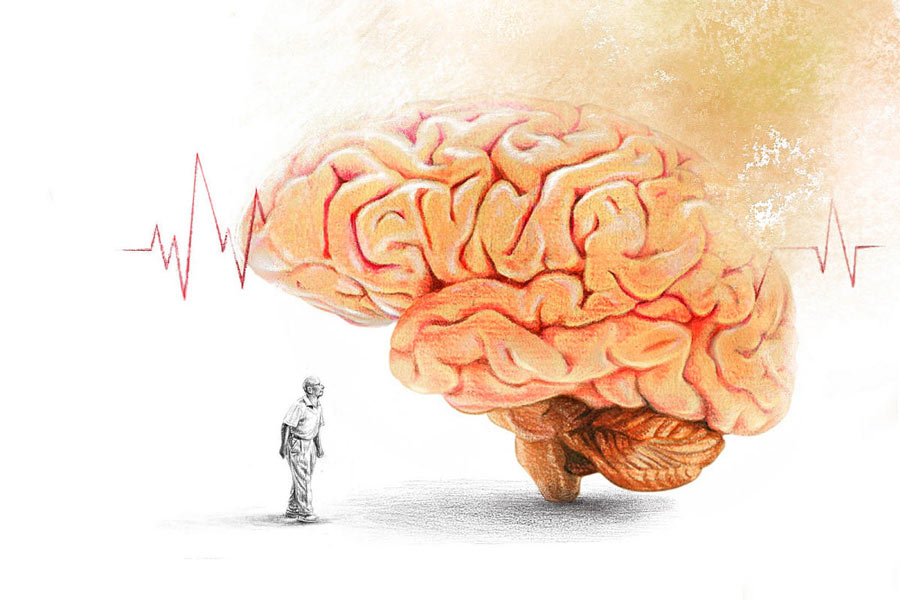

 
 <h1 align=center>স্মৃতিভ্রম</h1>
<h2 align=center>সৌরদীপ্ত সেন</h2> ডাকসাইটে উকিল অখিলেশ চৌধুরী প্রায় তিরিশ বছর ধরে অনেক বাঘা বাঘা আসামিকে কাঁদিয়ে ছেড়েছেন। সরকার পক্ষ-বিরোধী গোষ্ঠী, মাফিয়া-জালিয়াত, ঘুষ-হুমকি— কিছুই ওঁকে টলাতে পারেনি কখনও।

সেই অখিলেশবাবু যখন বাজারে এসে শুধু বাঁধাকপি কিনে বাড়ি ফিরে গিয়ে বিলের হাঁ-করা মুখটা দেখলেন, তখন বুঝলেন যে তাঁর বয়সটা সত্যিই বেড়ে গিয়েছে।

এক দশক আগে অবসরপ্রাপ্ত অখিলেশবাবু বিপত্নীক। ছেলে শুভময়ের জন্মের সময়েই তিনি স্ত্রী মৃণালিনীকে হারান। অখিলেশবাবু বাবা-মায়ের দায়িত্ব একই সঙ্গে পালন করে ছেলেকে মানুষ করেছেন। আজ শুভময় একটি বিদেশি ব্যাঙ্কের উচ্চপদস্থ কর্মী। পরিবার নিয়ে সিঙ্গাপুরেই পাকাপাকি ভাবে থাকে। নানা কাজের চাপ ও ছেলের পড়াশোনার ব্যস্ততা থাকায় বছরে এক বারের বেশি আসা হয় না কলকাতায়। বিদেশি চালচলনে অভ্যস্ত হয়ে গেলে কলকাতায় আসাটা যে বেশ কষ্টকর, সেটা অখিলেশবাবু বোঝেন। দোতলা বাড়িতে থাকেন তিনি আর বিলে।

ছেলের প্রথম  বিদেশযাত্রার সময়ে অখিলেশবাবুর দেখাশোনার জন্য তাঁর বাড়িতে আসে বিলে। ভাল নাম বিবেক সাহা, অখিলেশবাবুর পুরনো রাঁধুনি মন্মথর ছেলে। টুকিটাকি ফাইফরমাশ, অল্পবিস্তর সেক্রেটারির কাজ, বাজার-হাট সব কিছুর দায়িত্বই বিলে নিয়ে নিয়েছিল নিজের ঘাড়ে। অখিলেশবাবু তখনও কর্মরত। সদাব্যস্ত অখিলেশবাবুকে সময় মতো খাওয়াদাওয়া করানো, বাড়ির জিনিসপত্রের হিসাব রাখা, বিল জমা দেওয়া, সব কিছুই বিলের হাতে এসে যায়। সেই থেকে বিলে হয়ে ওঠে পরিবারের এক সদস্য।

শনি-রবিবার নিজেই বাজার করেন অখিলেশবাবু। আজও সে রকমই কথা ছিল। কিন্তু বাজারের ফর্দের আলু-পেঁয়াজ-কুমড়ো বাদ দিয়ে অখিলেশবাবু শুধু বাঁধাকপি কেন আনলেন সেটা বিলে বুঝল না।

অখিলেশবাবু বুঝলেন।

*****

ঘটনার কয়েক দিন পর বাড়িতে এলেন তাঁর উকিল বন্ধু সুকেশ মিশ্র। তাঁর অনেক দিনের পরিচিত। একটি গুরুত্বপূর্ণ কেস নিয়ে তাঁর সঙ্গে আলোচনা করতে এসেছেন।

সাতটা নাগাদ ঢুকলেন সুকেশ। টেবিলের উপর গ্লাসের অনেকটা জল খেয়ে কপালের ঘাম মুছলেন। কেসের ইতিবৃত্তান্ত শুনিয়ে বললেন, “ক্লায়েন্টের গাড়ির নম্বর বেলেঘাটা ক্রসিংয়ের সিসিটিভিতে ধরা পড়েছে, চৌধুরী। জানি না আর কত দিন কেসটা টানতে পারব।”

অখিলেশবাবু কী বলবেন ভেবে নিয়েছেন, কিন্তু হঠাৎ তাঁর চোখের সামনেটা যেন দুলে উঠল। ঘরের বাতিগুলোর ভোল্টেজ হঠাৎ কমে গেলে যেমন চোখের উপর এক ফালি ছায়া নেমে আসে বলে মনে হয়, তেমনটাই মনে হতে লাগল।  

অখিলেশবাবু ফ্যালফ্যাল করে তাকিয়ে রইলেন, কথাগুলো যেন অনেক দূর থেকে আসছে। আর সামনের ভদ্রলোকের মুখ, বাচনভঙ্গি খুব চেনা হলেও তিনি কিছুতেই নামটা মনে করতে পারছেন না।

অখিলেশবাবুর গলাটা খুব শুকনো মনে হতে লাগল, কিন্তু তিনি কিছু করতে পারলেন না। কারণ গলা শুকিয়ে গেলে কী করতে হয় সেটাও তিনি হঠাৎ মনে করতে পারছেন না!

বিলেই খাওয়াদাওয়া করিয়ে ঘুম পাড়িয়ে দিল অখিলেশবাবুকে।

অখিলেশবাবু কোনও মতে বিলেকে ডেকেছিলেন। বিলে এসে সুকেশবাবুকে দরজা অবধি এগিয়ে দেয়। সুকেশ পরদিন ফোনও করেছিলেন, অখিলেশবাবুর শরীরের খবর নিলেন। অখিলেশবাবু নিজেই কথা বললেন, ফোনে যতটুকু সম্ভব পরামর্শও দিলেন। কথাবার্তা সারার পর মনটা ভাল লাগল অখিলেশবাবুর। সুকেশ তাঁর অনেক দিনের বন্ধু, তাঁকে সাহায্য করতে পেরে তিনি নিশ্চিন্ত বোধ করলেন।

তবে কথা শেষ করে ফোনের হ্যান্ডসেটটা ঠিক জায়গায় না রেখে জল-ভর্তি গ্লাসটার সামনে রেখে চলে গেলেন বাগানে। 

*****

“এক বার ডাক্তার দেখাবেন?”

বিলের প্রশ্নের কী উত্তর দেবেন, বুঝলেন না অখিলেশবাবু। সুকেশ মিশ্র কেস জিতে গেলেও, গত কয়েক মাসে অনেক বার অনেক রকম ভুল হয়েছে অখিলেশবাবুর। এক সময় মোটা মোটা আইনের বইগুলো গুলে খেয়েছিলেন। ভারতীয় দণ্ডবিধির কোন আইনের কোন ধারায় কী শাস্তি হবে, তা ছিল তাঁর নখদর্পণে। আর এখন সেই অখিলেশবাবু স্নান করে গিজ়ার বন্ধ করতে ভুলে যান, জামার উপর সোয়েটার পরতে ভুলে যান। লাইটের সুইচ, বেসিনের কল, জলের গ্লাসের ঢাকনা, বাথরুমের দরজা বন্ধ— অনেক কিছুই মনে করে করতে পারেন না।

কিন্তু একেবারে সব কিছু ভোলেননি। শুভময়ের সঙ্গে মাসে এক-দু’বার ভিডিয়ো চ্যাট হয়, তাঁর নাতি রনোর সঙ্গে অনেক ক্ষণ গল্প হয়, তিনি বৌমা স্বস্তিকার মা-বাবার খবর নেন। ওদের কাজকর্ম কেমন চলছে, কবে দেশে আসবে— অনেক কিছু নিয়েই কথা বলতে তাঁর অসুবিধে হয় না।

অবশ্য তাঁর সর্বক্ষণের সঙ্গী হিসেবে বিলে সদাই প্রস্তুত। ছেলেটা বড় ভাল। কতই বা বয়স হবে, তিরিশ-বত্রিশ? উচ্চ মাধ্যমিক অবধি পড়েছে, কিন্তু চাকরি জোটাতে পারেনি। বিলের সঙ্গে অনেক গল্প করেন তিনি।

“তুই যে আর পড়লি না বিলে, আমি না থাকলে তখন কী করবি?”

“আমার ভাই আছে না, কলেজ স্ট্রিটে বইয়ের ব্যবসা করে? সেখানেই ঢুকে যাব।”

আর কিছু বলেন না অখিলেশবাবু। মন্মথ মারা যাওয়ায় গ্রামের পাট চুকিয়ে দুই ভাই-ই এখন কলকাতায়। মাঝে মাঝে বিলের ভাই আসে এ বাড়িতে, দেশ-বিদেশের কিছু উল্লেখযোগ্য কেসের বই নিয়ে আসে।

এ রকমই এক বিকেলে অনেক ক্ষণ গল্প করার পর বিলে নিজের ঘরে চলে গেলে, অনেক ভেবেও অখিলেশবাবু মনে করতে পারলেন না মন্মথ তাঁর কাছে কী কাজ করত।

*****

অখিলেশবাবু অনেকটা রোগা আর একটু চুপচাপও হয়ে গেছেন ইদানীং। এর মধ্যে বিলেই পাড়ার ডাক্তার কৌশিক সেনগুপ্তকে সব জানিয়ে ডেকে এনেছিল। কৌশিকের বাবা অখিলেশবাবুর বন্ধু ছিলেন।

“কাকু, আজকাল কি আর বেরোন না বাইরে?”

“বিকেলে পার্কের দিকে হেঁটে আসি যে।”

“কোন পার্কটায় বলুন তো?”

ফ্যালফেলে দৃষ্টি নিয়ে তাকালেন অখিলেশবাবু, কিছুটা আঁচ পেয়ে গেল কৌশিক।

“কেসের ব্যাপারে কথা বলতে লোকজন আসে নাকি এখনও?”

সে রকম দরকারে আসে না কেউ খুব একটা। অ্যাডভোকেট অখিলেশ চৌধুরী এখন প্রায় হারিয়ে গেছেন বললেই চলে।

“মাঝে মাঝে আসে।”

“আচ্ছা। শুভময় যেন কোথায় আছে এখন?”

জানলার দিকে তাকিয়ে আটকে গেলেন অখিলেশবাবু। চোখের দৃষ্টি আবার অন্য রকম। ইচ্ছে করেই এ রকম প্রশ্ন করছিল কৌশিক, যা বোঝার সে বুঝে গিয়েছে।

*****

শুভময়রা কলকাতায় এসেছে।

ছেলে-বৌমা এ বাড়িতে এলেও অল্প দিনে তাদের অনেক কাজ সারতে হয়। রনোকে ওরা রেখে যায় দাদুর সঙ্গে। আজ সে রকমই একটা দিন, তাই দাদু-নাতির অনেকটা সময় এক সঙ্গে কাটানো হল। কয়েক দিনের জন্য রনোকে পেয়েছেন, যতটা সম্ভব সময় কাটাতে চান তিনি।

বিকেলে বিলের সঙ্গে রনোকে মাঠে খেলতে পাঠিয়ে অখিলেশবাবু রাস্তায় বেরোলেন।

রাতে খাবার আসরে সবাই এক সঙ্গে বসলে, দু’খানা প্যাকেট রাখা হল টেবিলে। একটি বিকেলে বেরিয়ে অখিলেশবাবুর আনা, অন্যটি শুভরা এনেছে।

“রনো, দাদু তোমার জন্য একটা জিনিস এনেছে,” চকচকে চোখে বলে উঠলেন অখিলেশবাবু।

লাফিয়ে এল রনো, প্যাকেটের উপর হামলে পড়ল।

অখিলেশবাবু শুভদের দিকে ফিরলেন, “পিৎজ়া এনেছি। তোরা নাকি ওকে খেতেই দিস না, আজ বারণ করিস না।”

“কিন্তু আমরা তো রাতের খাবার নিয়ে এলাম।”

“ওটাও থাক। দাদু পিৎজ়া খাবে, কি দাদু, ঠিক আছে তো?”

রনো কিছু বলল না, তার মুখ শুকনো। প্যাকেটের ভিতর কাগজের বাক্স থেকে পিৎজ়ার বদলে বেরোল কড়াপাকের সন্দেশ।

রেট্রোগ্রেড অ্যামনেশিয়া।

শুভময় চিন্তিত ছিল, বিলের সঙ্গে কথা বলে জেনেছিল সব। কৌশিক ডাক্তারের সঙ্গেও দেখা করেছিল। কিন্তু আজকের এই গতিশীল ছুটে বেড়ানোর যুগে দুঃখ পেয়ে হাপিত্যেশ করার সময় নেই। ব্যস্ত সময় কারও জন্য থেমেও থাকে না। তাই মনে একরাশ চিন্তা নিয়েই শুভরা ফিরতি প্লেনে উঠেছিল।

*****

বিলে ঢুকল ঘরে। অখিলেশবাবুর জন্য ফল কেটে এনেছে সে।

“খেয়েছিস?”

“আপনার সঙ্গেই তো খেলাম। আপনি ফলগুলো খান, তার পর ওষুধগুলো খাবেন।”

“হ্যাঁ রে বিলে, এই যে আমি ভুলে যাচ্ছি সব কিছু, এটাকে কী বলে জানিস?”

“বয়স বাড়লে এ রকম হয়। শুনেছি আমার দাদু নাকি শেষ দিকে বাবাকেও চিনতে পারত না।”

“আমি এখন তিয়াত্তর, আরও কয়েক বছর এটা না হলেই ভাল হত। ব্যাপারটাই কেমন যেন ভয়ঙ্কর, জানিস? চোখের সামনে যেন হঠাৎ সব কিছু ঘোলাটে হয়ে যায়, মাথার ভিতরটা পুরো ফাঁকা। খুব অসহায় লাগে রে, সে দিন আমার নাতিটাকে পছন্দের খাবারটাও খাওয়াতে পারলাম না।”

“এক দিকে ভালই হয়েছে। সন্ধেবেলা ফুচকা খেয়েছিল। তার পর ও সব খেলে আর দেখতে হত না, দোষ এসে পড়ত আপনার ঘাড়ে। তবে আমি কিন্তু বেশ খেয়েছি।”

“তোর ভাল লেগেছে?”

“আমার প্রিয় সন্দেশ যে! সে বার বইমেলা গিয়ে খাওয়ালেন, চার-পাঁচখানা খেলাম, মনে নেই?”

দীর্ঘশ্বাস ফেললেন অখিলেশবাবু, “আচ্ছা, এই আধপাগল বুড়োটাকে নিয়ে তুই যে থাকিস, তোর হাঁসফাঁস লাগে না? একঘেয়েমির বিরক্তি আসে না মনে?”

হাসল বিলে, “আধা-অনাথ ছেলেটাকেও তো স্যর আপনি মাথার উপর ছাদ দিলেন, কম্পিউটার শেখালেন, দু’বেলা খাবারদাবারের বন্দোবস্ত করলেন, আপনিও তো ধৈর্য হারাননি কখনও। আমাকে দিন প্লেটটা, ওষুধ আনছি।”

বিলে চলে গেল। অখিলেশবাবু জানলার সামনে বসে রইলেন। তাঁর চোখ বেয়ে একটু জল গড়াল, কিন্তু রুমালটা কোথায় রেখেছেন মনে করতে পারলেন না।

*****

মাসখানেক পরের ঘটনা। বসন্ত এসেছে। ঠান্ডাটা এখন বেশ উপভোগ্য, রোদটাও চমৎকার। গাছে গাছে নতুন পাতা, ফুলের নতুন কুঁড়ি দেখা দিয়েছে।

অখিলেশবাবু এখন প্রায় শয্যাশায়ী, শারীরিক ক্লান্তিটা ক্রমশ প্রকট হয়ে উঠছে। বিলের ফোন পেয়ে এক সকালে চলে এল শুভময়, আপাতত সে একাই এসেছে। শেষ কয়েক মাস ভিডিয়ো চ্যাটে ছেলের সঙ্গে কথা পর্যন্ত বলতে পারেননি অখিলেশবাবু।

শুভময়কে চিনতে পারলেন অখিলেশবাবু, “কবে এলি?”

“সকালে। কেমন আছ?”

“পড়াশোনা কেমন চলছে?”

কথাটা শুনে চোয়াল শক্ত হল শুভর, “ভালই।”

এটাই ছিল এক কালের বিশিষ্ট আইনজীবী অখিলেশ চৌধুরীর বলা শেষ কথা। এর দু’দিনের মাথায় হৃদরোগে আক্রান্ত হয়ে হাসপাতালে ভর্তি হয়েছিলেন অখিলেশবাবু। আর ফেরেননি।

দুঃসংবাদ পেয়ে রনোকে নিয়ে চলে এসেছিল স্বস্তিকাও। বাবার কাজকর্ম মিটে গেলে, এক সকালে যখন শুভময়, বিলে এবং বাড়িটার ভবিষ্যৎ নিয়ে ভাবছিল, তখনই হঠাৎ আগাম কোনও খবর না দিয়েই সুকেশ মিশ্রর আবির্ভাব হল।

“কালকে ফোন করেছিলাম, বিলে বলল আপনি ফিরে যাচ্ছেন। তাই মনে করলাম আজ এখানে এসে কাজটা করে দিয়ে দায়িত্ব থেকে মুক্তি পেয়ে যাই।”

উপস্থিত সকলের চোখে প্রশ্ন, বিলেও অবাক।

“কাজ?”

হাতের ফাইল থেকে একটা সাধারণ দেখতে সিল-করা খাম বের করলেন সুকেশবাবু, “দেখুন আমি চৌধুরীর জুনিয়র, কিন্তু আমাদের জান-পহেচান অনেক দিনের। লাস্ট টাইম আপনারা চলে যাওয়ার পর, একটা চিট্‌ঠি তিনি আমাকে দিয়েছিলেন। এতদিন আপনারা বিজ়ি থাকায় আসিনি আমি, আজ আমাকে ফ্রি করে দিন।”

চিঠি? কিসের ব্যাপারে মুখে না বলে এ রকম রহস্যময় চিঠি রেখে যাবেন অখিলেশবাবু?

“চৌধুরীর ইচ্ছেয় এই চিট্‌ঠি এখনও খোলা নেই, আপনারা সিল দেখতে পাচ্ছেন। ওঁর মৃত্যুর পর আমাকে এই চিঠি খুলতে বলেছিল। ফেমিলির সবাই যখন এখানে প্রেজ়েন্ট আছেন, আমি এটা খুলে আপনাকে হ্যান্ডওভার দিয়ে দেব।”

ঘরে এখন পিন পড়লেও আওয়াজ হবে।

সকলের অনুমতি নিয়ে খাম ছিঁড়লেন সুকেশ মিশ্র। সাদামাটা রুল-টানা প্যাডের কাগজ ছিঁড়ে লেখা কিছু একটা বেরোল তার ভিতর থেকে। চিঠিতে কী লেখা তা কেউ জানে না, তবে আইনানুসারে সই করা এই চিঠিও মূল্য রাখে বইকি।

সুকেশ মিশ্র বাংলা পড়তে পারেন না, চিঠি খুলে তাই টেবিলের উপর রেখে দিলেন। গোলটেবিল ঘিরে দাঁড়ানো বিলে, শুভময় আর স্বস্তিকা সকলেই পরিষ্কার পড়তে পারছিল রুল-টানা কাগজের উপর গোটা গোটা অক্ষরে কাঁপা-কাঁপা হাতে লেখা লাইনগুলো।

“আমার ছেলে আমার প্রয়োজনে যে ভাবে আত্মত্যাগ করেছে, তা হয়তো আজকের যুগের কোনও ছেলেমেয়েই বাপ-মায়ের জন্য করে না। সময়ে-অসময়ে নিজের কাজকর্ম, পরিবার, সুখস্বাচ্ছন্দ্যকে জলাঞ্জলি দিয়ে আমার অসুস্থতা, আমার দরকারকেই প্রাধান্য দিয়ে এসেছে। তাকে বঞ্চিত করে আমি শান্তি পাব না। আমি আমার সমস্ত বিষয়সম্পত্তি সজ্ঞানে এবং অবিভক্ত ভাবে আমার এবং আমার স্ত্রী স্বর্গীয়া মৃণালিনী চৌধুরীর একমাত্র পুত্র শ্রীবিবেক সাহাকে দিয়ে গেলাম।”