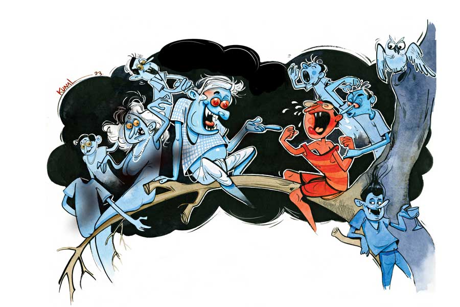

 
 <h1 align=center>হঠাৎ ভূত</h1>
<h2 align=center>রঞ্জনকুমার বন্দ্যোপাধ্যায়</h2> হঠাৎ ভূত হয়ে গেলাম। বেমক্কা এ রকম ভূত হয়ে যাব, ভাবতে পারিনি। দিব্যি ঘুরেটুরে বেড়াচ্ছিলাম। কোনও ঝুটঝামেলা ছিল না। হঠাৎ পাওয়া সম্পত্তির টাকায় জীবনটাকে সাজিয়ে নিচ্ছিলাম। কিন্তু ভাগ্যে সইল না। অনভ্যাসের চন্দন, কপাল চড়চড় করে। আমার মতো দিন আনি দিন খাই-এর ভাগ্যে এত সুখ সয়? আমারও সহ্য হল না।

তা হলে খুলেই বলি ব্যাপারটা। লেখাপড়া খুব একটা হয়নি আমার। হবে কী করে? আমি যখন হাঁটতে শিখিনি, তখনই তো আমার মদ্যপ বাপ লিভার পচিয়ে ফেলে। তার পর বিস্তর যন্ত্রণা পেয়ে এবং দিয়ে আমাদের ছেড়ে ‘টা টা বাই বাই’ করে পরপারে হাঁটা লাগায়। নিরুপায় হয়ে মা-কে চার-পাঁচটা বাড়ির কাজ ধরতে হয়। বোঝাই যাচ্ছে খুব কষ্টে আমার জীবন কাটার কথা। কাটছিলও তাই। মা উদয়াস্ত পরিশ্রম করে আমাদের মুখের গ্রাস জোগাড় করত। কিন্তু এত ধকল সইল না! ফলে আমি সেয়ানা হতে না হতেই মা-ও বাবার পদাঙ্ক অনুসরণ করল।

এ পর্যন্ত ঠিকই ছিল। কিন্তু হঠাৎ গল্পে মোচড়। আমি যখন চব্বিশ, তখন পড়ে পাওয়া চোদ্দো আনার মতো নিঃসন্তান মামার একমাত্র ওয়ারিশান হিসেবে মামার সম্পত্তির উত্তরাধিকারী হয়ে বসলাম। অনেকটা লটারি পাওয়ার মতো। মামার সম্পত্তির পরিমাণ প্রচুর। কলকাতায় একটা প্রাসাদোপম বাড়িতে তিনি থাকতেন। বাড়ির একটা সাহেবি নামও দিয়েছিলেন বেশ। ‘নেস্ট’। ভাবলাম যাক বাবা! এত দিনে নিশ্চিন্ত হওয়া গেল। আর বিশেষ খাটাখাটনি করতে হবে না। বেশ পায়ের উপর পা তুলেই কেটে যাবে বাকি জীবনটা। কিন্তু তখন কি আর জানি যে ‘কপালে নেইকো ঘি’— সব ঠকঠকানিই বৃথা!

কোথা থেকে ভুঁইফোঁড় এক মামাতো ভাইয়ের উদয় হল। নাম বললে সত্যময়। এই সত্যময়কে আমার চব্বিশ বছরের জীবনে তার আগে কোনও দিন দেখিনি। সে এসেই দাবি করলে, সে নাকি আমার একমাত্র মামার একমাত্র জীবিত সন্তান। বোঝো ঠেলা! তার মা আরতি নাকি মামার প্রথম পক্ষের স্ত্রী। শুনেছিলাম তিনি আর বেঁচে নেই। মামা তাকে তাড়িয়ে দেওয়ার বছরখানেকের মধ্যেই তাঁর ইহলীলা সাঙ্গ হয়। মামা পরে আমার বর্তমান মামি সুলেখাকে বিয়ে করেন। তবে এই মুখপোড়া সত্যময়ের কোথায় এবং কখন জন্ম হয়, সে ব্যাপারে ইতিহাস নির্বাক। অন্তত আমি জানি না। মামাও জানতেন কি না সন্দেহ। তবে সে হারামজাদার দাবি, মামার একমাত্র সন্তান হওয়ার অসংখ্য প্রমাণ তার ঝোলায় আছে। যথাসময়ে পেশ করবে।

মামার দ্বিতীয় পক্ষ সুলেখামামির দাম্পত্য জীবনের মেয়াদ ছিল মাত্র দু’বছর। বিয়ের বছর খানেকের মধ্যেই তাঁর গল ব্লাডারে ক্যানসার ধরা পড়ে। এ দিকে প্রথম পক্ষের মামিকে তাড়িয়ে দিলেও তাঁকে নাকি ডিভোর্স-টিভোর্স কিছুই দেননি মামা। অপদার্থ আর কাকে বলে! তাই বলা যেতে পারে আইনত সত্যময়ই এখন পুরো সম্পত্তির মালিক। পুরো ব্যাপারটা এমন ঘেঁটে রয়েছে যে, আমার পক্ষে নিশ্চিন্তে সম্পত্তি ভোগ করা খুব একটা সুবিধের হবে না।

অলপ্পেয়ে সত্যময়কে দেখলেই তখন সারা পৃথিবীর কটু কথা আমার জিভের ডগায় নাচানাচি শুরু করে দিত।

*****

শুধু আড়াল থেকে মুন্ডুপাত করে মন শান্ত হল না। বাঘ তখন রক্তের গন্ধ পেয়েছে। আমি হাঘরে পাবলিক। বেমক্কা টাকার গন্ধ পেয়ে আর ছাড়তে মন চায় না। বেশ বুঝতে পারছিলাম, আইনের পথে গেলে সম্পত্তির কানাকড়িও মিলবে না। সব গ্রাস করবে ওই ঊনপাঁজুরে সত্য। তাই কী আর করি, ধরলাম গিয়ে সাদা পার্টির নেতা ভুলুদাকে। ভুলুদাও ঝোপ বুঝে কোপ মারলেন। কড়কড়ে দশটি হাজার পকেটে পুরে পান চিবোতে চিবোতে বললেন, “চুপচাপ চেপে বসে থাক।”

“আমি চেপে বসলে কী হবে? অনামুখো সত্যময় তো আর বসে থাকবে না ভুলুদা!”

“আরে, রাখ তোর সত্যময়! ভুলু শর্মাকে যখন বলেছিস, ধরে নে কাজ হয়ে গেছে। ব্যাক ডেটে তোর মামার উইল তৈরি করে তার প্রবেট নেওয়া আমার বাঁয় হাত কা খেল। আর সেই উইলে একমাত্র ওয়ারিশান থাকবি তুই। তখন দেখবি সত্যময় মিথ্যেময় হয়ে গেছে। তবে হ্যাঁ, তিন পার্সেন্ট আমার। তার কমে হবে না।”

“তিন পার্সেন্ট?” অবাক হয়ে জিজ্ঞেস করি।

“আকাশ থেকে পড়লি যে। লাখ লাখ টাকার সম্পত্তি বাগাবি, তার খরচ নেই? এ টাকা তো দেশের কাজে লাগবে। দু’পার্সেন্ট আমার, পার্টি ফান্ডে এক পার্সেন্ট।”

রাজি হয়ে গেলাম।

*****

তখনও বুঝিনি যে বাবারও বাবা আছে। আমার রাইভ্যাল মড়াখেকো সত্য আবার আমার এক কাঠি উপরে। সে কালো পার্টির নেতা টুলুদাকে পঞ্চাশ হাজার দিয়ে বসে আছে তত ক্ষণে। সম্পত্তি হাতে এলে কী ‘ডিল’ হয়েছে, সে খবরটা পাইনি তখনও। তবে কানাঘুষোয় শুনেছিলাম, টুলুদা নাকি কী সব ছক কষেছেন— স্যাঁকরার ঠুকঠাক নয়, একেবারে কামারের এক ঘা। মানে কোর্ট-ফোর্টে তিনি মোটেই বিশ্বাসী নন। শুধু শুধু সময় নষ্ট। তার চেয়ে ‘ধর তক্তা মার পেরেক’, মানে একেবারে খালাস করে দেওয়াই ভাল। আর তার ফল হল এই যে, দিনকয়েকের মধ্যেই অন্ধকার এক রাস্তায় ট্রাকের ধাক্কায় আমি ভূতদশা প্রাপ্ত হলাম। আমার টু-হুইলারটা একেবারে দুমড়ে-মুচড়ে ধ্বংসস্তূপে পরিণত হয়েছিল। আমাকেও চেনা যাচ্ছিল না। ও দিকে ঘাতক লরিও ভাগলবা। ঘটনাটা এমন জায়গায় ঘটে, যেখানে সিসিটিভি ছিল না, কিংবা থাকলেও অকেজো করে রাখা হয়েছিল।

ছকটা ভালই কষেছিল টুলুদা।

*****

বাড়ির সামনের বেলগাছে চেপে জুলজুল করে তাকিয়ে দেখলাম, ঘটা করে শ্রাদ্ধ হচ্ছে আমার। শ্রাদ্ধ করছে আমারই এক দূর সম্পর্কের ভাইপো। তাকে কোথা থেকে খুঁজে আনা হয়েছে। ব্যবস্থাপনায় সত্যময় ঘোষ। সাদা পাজামা-পাঞ্জাবি পরে হাত জোড় করে দুঃখ-দুঃখ মুখে দাঁড়িয়ে নিমন্ত্রিতদের আপ্যায়নে ব্যস্ত। সঙ্গে ওর বৌ সোনালি। পরনে দামি শাড়ি। গা-ভর্তি গয়না। এ সব অনুষ্ঠানে এত গয়না কে পরে? মুখ বিষণ্ণ হলেও শরীরী ভাষায় আনন্দের বান ডেকেছে।

নিয়মভঙ্গের দিন তো রীতিমতো মোচ্ছব। তোপসে ফ্রাই আর পাকা রুইয়ের কালিয়া খেয়ে ঢেকুর তুলতে তুলতে ফিরল নিমন্ত্রিতের দল। হালার পো হালা সত্যময় আমার মামার টাকায় ভূতভোজন করাচ্ছে। ভুলুদাকে দেখলাম টুলুদাকে সিগারেট ধরিয়ে দিচ্ছেন। টুলুদা পকেট থেকে বার করে হজমিগুলি দিচ্ছেন ভুলুদাকে। অর্থাৎ হিন্দি-চিনি ভাই ভাই! গা জ্বলে যাচ্ছিল আমার।

ঠিক করলাম, ভূত হয়েছি তো কী হয়েছে! ঢ্যামনা সত্যকে ছাড়ব না। আচ্ছা করে মালুম পাইয়ে দেব। এমন ভয় দেখাব যে, হার্টফেল করতে বাধ্য হবে সে। তার পর তো সে চলে আসবে আমার কব্জায়।

ইতিমধ্যে আমি একটা দল পাকিয়েছি। তাতে পেতনি, শাঁকচুন্নি, মামদো, স্কন্ধকাটা, একানড়ে থেকে শুরু করে কে নেই! আসলে একা কিছু করা যায় না। প্রতিশোধ নিতে হলে দল চাই। এই সহজ সত্যটা অনেক দিন আগেই শিখে গিয়েছিলাম আমি। আমার দুঃখের কথা শুনে সবাই বললে, বেম্মদত্যি দাদার কাছে যেতে। সেই এখন ভূত সমাজের পান্ডা। খুবই বিচক্ষণ ভূত। আমার ইচ্ছে ছিল না। কারণ, যতই হোক সেও তো অশরীরী। সে আর বাড়তি কী করবে! সেই তো আমাদেরই ভয় দেখাতে হবে শেষ পর্যন্ত। ভেবেছিলাম দলের সবাই মিলে একযোগে ভয় দেখালে হাড়বজ্জাত সত্যময় অক্কা পেতে বাধ্য। কিন্তু বেম্মদত্যি দাদাকে না জানিয়ে কেউ কিছু করতে রাজি নয়। অগত্যা গেলাম বেম্মদত্যিদাদার কাছে।

সব শুনে বেম্মদত্যি দাদা বললে,“বয়স তো বেশি নয়, তা কোন যুগে পড়ে আছ চাঁদ! শোনো ছোকরা, ভয় দেখিয়ে সব সময় কাজ হয় না। আজকালকার মানুষগুলো সব নচ্ছার। ভয় পাওয়া দূরের কথা, ভূতে বিশ্বাসই করতে চায় না। ও দিকে আবার ভূতের গল্প ছাড়া কিছু চায় না। বইমেলায় গেলেই দেখতে পাবে হন্যে হয়ে সব ভূতের গল্পের বই খুঁজছে। সব দু’মুখো সাপের দল!”

বেম্মদত্যি দাদার কথা শুনে খুব দমে গেলাম। তা হলে উপায়? শয়তান সত্যময়ের কোনও শাস্তি হবে না? খুন করেও পার পেয়ে যাবে শেষ পর্যন্ত? আমি বললাম, “দাদা, একটা কিছু করুন। এ আর সহ্য হয় না।”

বেম্মদত্যি ভুরু কুঁচকে বললে, “দেখো ভাই, দুনিয়ায় আজকাল সিস্টেম পাল্টে গেছে। অন্যায় করে এখন কেউ শাস্তি পায় না। অপরাধীরা বুক ফুলিয়ে ঘুরে বেড়ায়। ওদেরই যুগ। যারা সৎ, তারাই বরং এখন মুখ লুকিয়ে থাকে। আজকাল ভাল করে টিকে থাকতে হলে ক্রাইম করতেই হবে, তা না হলে না খেয়ে মরা ছাড়া গতি নেই। বেশি বাড়াবাড়ি করলে তোমার মতো অবস্থা হবে। দেয়ালে ছবি হয়ে থাকতে হবে। তোমার শ্রাদ্ধে লোকে রুই তোপসে সাঁটাবে, তুমি লুচির মতো ফুলবে।”

“কী হবে তা হলে?” আমি জিজ্ঞেস করি, “লাখ লাখ টাকার সম্পত্তি তো পেলামই না, উলটে বেঘোরে প্রাণটা গেল।”

“খুব আফসোস দেখছি? সম্পত্তি চাও তুমি?”

বেম্মদত্যি দাদার কথায় আমি নড়েচড়ে বসি।

“ইয়ে... মানে...” আমতা আমতা করি আমি।

“কী হল? ঘাবড়ে গেলে না কি?”

“না মানে, তা কী করে সম্ভব? আমি তো এখন ভূত। ভূতেদের তো স্থাবর-অস্থাবর কোনও সম্পত্তিই থাকতে পারে না। নইলে কি আর বনে-বাদাড়ে, গাছের উপর কিংবা পোড়ো বাড়িতে দিন কাটাতে হয়?”

“সে আমি বুঝব। তুমি শুধু বলো তোমার মামার সম্পত্তি চাও কি না।”

“আপনি সত্যি বলছেন? সব আমার হবে?”

“একদম। আমি কথা দিচ্ছি। রক্তপাত হবে না, কোর্ট-কাছারি হবে না। অথচ পুরো সম্পত্তির মালিক হয়ে যাবে তুমি। পুরোটাই টাইমিংয়ের ব্যাপার। সে আমি বললে লাইন ক্লিয়ার পেতে অসুবিধে হবে না।”

“বলেন কী! এ তো গাছে না উঠতেই এক কাঁদি। কিন্তু লাইন ক্লিয়ারের ব্যাপারটা তো ঠিক...”

“সব বুঝতে যেয়ো না চাঁদু। আম খেতে চেয়েছ আম খাও।”

*****

এর পরে যা ঘটল তা একেবারে রূপকথার মতো। মাসকয়েক পরের কথা। অনেক রাত। আমি তখন বেলগাছে বিশ্রাম নিচ্ছি। হঠাৎ সোনালির চিৎকারে শেষরাতে ঘুম ভেঙে যায় সত্যময়ের। সোনালির প্রসববেদনা উঠেছে। আগে থেকে সব ঠিক করাই ছিল। সোনালিকে নিয়ে অ্যাম্বুল্যান্স ছুটল মুনল্যান্ড নার্সিং হোমের দিকে। সোনালির মাথার কাছে বসে সত্যময় চিয়ার-আপ করতে লাগল। এই সময় প্রসূতির মন প্রফুল্ল রাখা দরকার। আমি বেলগাছের উপর বসে পা দুলিয়ে এ সব রঙ্গতামাশা দেখছি। হঠাৎ ঝড়ের মতো বেম্মদত্যি দাদার আবির্ভাব। সে এসে বললে, ‘এ কী! এখনও বসে আছ? আচ্ছা বেআক্কেলে তো! যাও যাও শিগগিরি যাও...”

আমি তো হতভম্ব! জিজ্ঞেস করি, “কোথায় যাব?”

“তাও বলে দিতে হবে? তোমাকে নিয়ে আর পারা যায় না। যাও মুনল্যান্ড নার্সিং হোমে যাও। সব ব্যবস্থা করা আছে। আমার কথায় এলাকার সমস্ত ভূত ডিম্যান্ড ছেড়ে সরে গেছে। তোমাকে সত্যময়ের ছেলে হয়ে জন্মাতে হবে যে। নইলে সম্পত্তি জুটবে কী করে?”

কী আশ্চর্য! এই ছিল বেম্মদত্যিদাদার মনে? বাঃ! বেড়ে প্ল্যান কষেছে তো! আমি একটু কিন্তু-কিন্তু করছি দেখে আমাকে ভাবার কোনও অবকাশ না দিয়ে বেম্মদত্যিদাদা আমার চুল ধরে উড়িয়ে নিয়ে চলল নার্সিং হোমের দিকে। আমি যখন নার্সিং হোমে পৌঁছলাম, তত ক্ষণে ডক্টর নার্স সকলেই রেডি।

জানলার বাইরে দাঁড়িয়ে কী মনে হতে বেম্মদত্যি দাদাকে পেন্নাম করলাম। বেম্মদত্যি আঙুলে পৈতে জড়িয়ে মাথায় হাত রাখলেন, বললেন, “যাত্রা শুভ হোক। আর দেরি কোরো না।”

নতুন জন্মের দিকে যেতে যেতে বললাম, “আশীব্বাদ করুন, যেন জাতিস্মর না হই। আগের জন্মের স্মৃতি থাকলে অলম্বুষ সত্যময়টাকে বাপ বলে ডাকতে পারব না।”

অন্ধকার থেকে মৃদু হাসির সঙ্গে ‘তথাস্তু’ শব্দটা ভেসে এল।