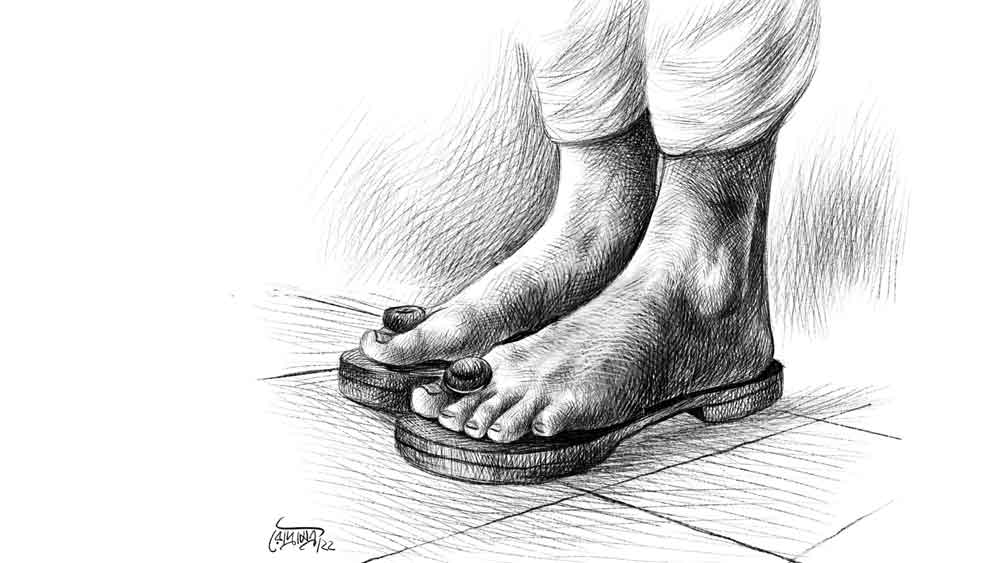

 
 <h1 align=center>হরিহরের পাদুকা</h1>
<h2 align=center>মেঘনা রায়</h2> কাস্টম্সের টেবিল থেকে বারবারই চোখাচোখি হয়ে যাচ্ছে ওই ব্যক্তির সঙ্গে। কিছুতেই কাজে মন বসাতে পারছি না। আমার চোখ ক্ষণিকের জন্য তাঁর মুখমণ্ডল থেকে ঘুরে ফিরে সেই পদযুগলে গিয়েই স্থির হচ্ছে। তাঁর ধূলিমলিন দারিদ্রলাঞ্ছিত পদযুগল মহার্ঘ কালো গ্রানাইটের মেঝের ওপর বিপন্ন হয়ে একটুখানি আড়াল খুঁজতে ব্যস্ত। লম্বা লাইনের ধার বরাবর ওঁর পাদুকাজোড়ার  দিকে নজর দিয়ে  মনে হল ভাগ্যিস ওঁর কাছে একটা টিকিট  আছে! নইলে এমন চটি এর আগে কি কখনও আলপনা এঁকেছে নেতাজি সুভাষচন্দ্র বসু আন্তর্জাতিক বিমান বন্দরের সূক্ষ্ম অভিজাত প্রায়-অদৃশ্য ধূলিকণায়? চাকরির শুরুর দিকে বেশ কিছু হিউম্যান সাইকোলজির বই পড়তে হয়েছিল। তার মধ্যে একটা ছিল ‘হাউ টু রিড আ পার্সন লাইক আ বুক’। মানে একটা মানুষ কে কেমন করে বইয়ের মতো পড়ে ফেলা যায়, আর এই পড়ে ফেলার সময় সেই মানুষ কী করে একটা বাস্তব চরিত্র হয়ে ওঠে। এই বিমানবন্দরের সীমাশুল্ক বিভাগের চাকরি করতে এসেছিলাম দলে দলে পরিযায়ী  মানুষ দেখতে পাব বলে। অন্য কোনও চাকরিতে এমন সুযোগ পেতাম না। সেই থেকে  মানুষকে জানা আমার একটা নেশা হয়ে  গিয়ে মনকে পুরোপুরি দখল করে বসল।

সিঙ্গাপুর এয়ারলাইন্সের এসসি৪৯৪ ফ্লাইটের জয়েনিং চলছে বেশ জোর কদমে। তিনি লাইনের লেজের দিকে একটু বেজার মুখে জড়সড় হয়ে দাঁড়িয়ে আছেন মূর্তিমানটি হয়ে। কাজের ফাঁকে ফাঁকে তাঁকে অপাঙ্গে দেখছি, আর শান্তিনিকেতন এক্সপ্রেসের কামরার বাউলের সেই গান যেন উড়ে উড়ে বেড়াচ্ছে গোটা লাউঞ্জ জুড়ে ‘হিতাক তোকে মানাইছে না রে, ইক্কেবারে মানাইছে না রে...’

ওঁর দিকে ঠারেঠোরে আমি যে নজর রাখছি সেটা উনিও বেশ ভালই বুঝতে পারছেন। আমার কৌতূহলী চোখ তাঁকে যে নজরে রেখেছে, এটা বুঝতে পেরেই তিনি যেন একটু নড়েচড়ে উঠলেন। অমনি তার বেমানান পাদুকাজোড়াও আরও লজ্জাবনত হয়ে গেল। মনে হল চোখের সামনে হরিহর দাঁড়িয়ে আছেন, তাঁর পায়ে-খড়মে পথের পাঁচালীর ধুলো। আমার মন ভেতরে বুড়বুড়ি কেটে বলছে তোমার সামনে তল্পিতল্পাসমেত গোটা একটা  মহাদেশ দাঁড়িয়ে, আর তুমি কলম্বাস হবে না! নিজের কৌতূহল আর দমিয়ে রাখতে পারলাম না। কারণ বেশ অনেক ক্ষণ ধরেই দেখছি ওঁর সামনে দিয়ে ওঁকে টপকে সবাই ইমিগ্রেশন সেরে ক্লিয়ার হয়ে যাচ্ছে, অথচ উনি নট নড়নচড়ন। এগোতেই পারছেন না। এমন চলতে থাকলে উনি ফ্লাইট মিস করবেন। অগত্যা একটা ব্রেক নিয়ে  সুগতকে টেবিলে ম্যানেজ করে কাউন্টার ছেড়ে ভদ্রলোকের দিকে এগিয়ে যেতেই উনি আশঙ্কা, জড়তা-সঙ্কোচে এবং অপরাধ বোধে জর্জরিত মুখে বাউন্ডারি লাইনের শেষে একেবারে ফুলস্টপ হয়ে দাঁড়িয়ে গেলেন।

আমি গলায় খানিক মাখন মাখিয়ে জিজ্ঞেস করলাম, “বলুন, আপনার জন্য কী করতে পারি স্যর?”

জানতাম শতকরা নব্বই ভাগ ক্ষেত্রে এই প্রশ্ন অ্যান্টিবায়োটিকের কাজ করে। এ ক্ষেত্রেও ব্যাতিক্রম হল না।  আমার কথা শুনে এ বার ওঁর চোখ ভাষা খুঁজে পেল। মুখের সংগ্রামী পেশিগুলি ফের তাদের যোগ্যতা প্রমাণে সচেষ্ট হল।

তিনি একটু জড়তা কাটিয়ে এ বার মোক্ষম প্রশ্নটি করে বসলেন, “তা আজ্ঞে প্লেনে চড়াটা ঠিক কখন হবে? আর প্লেনটা আছেই বা কোথায়?”

আমি মুখে হাসি এনে বললাম, “আপনার নাম কি আমি জানতে পারি? আপনি যাচ্ছেন কোথায়?”

বললেন, “আজ্ঞে যাব বিলেত। নাম শ্রীতিলকনাথ চক্রবর্তী।”

আমি বললাম, “বাঃ বেশ। তা সিঙ্গাপুর হয়ে যাচ্ছেন?”

উনি বললেন, “না, তা কেন? আমি সিঙ্গাপুর অবধিই যাব। ওই পর্যন্তই আমার টিকিট কাটা।”

ভদ্রলোককে আমি বিলেত কথার মানে বোঝাতে গিয়ে গল্পের নটেগাছটি এত তাড়াতাড়ি মুড়োতে চাইলাম না।  বরং পাসপোর্টটি দেখতে চাইলাম। সঙ্গে সঙ্গে উনি বুকের কাছে ধরা সস্তার ফোমের ব্যাগ থেকে চেন খুলে নীল বইটি আমার  হাতে দিয়ে বললেন, “দুর্গাপুজো করাতে নিয়ে যাচ্ছে ওখানকার বাঙালিরা।”

পাসপোর্টের পাতা উল্টে দেখলাম সে সদ্য কৌমার্য হারিয়েছে। নীল কাগজে প্রথম স্ট্যাম্প ইমিগ্রেশন দপ্তরের। পরেরটি আমরা দেব।

আমি একটু বেশি ক্ষণ ধরেই বোধহয় ওঁর মুখের দিকে হাঁ করে তাকিয়েছিলাম। তাই উনি বলতে শুরু করলেন, “সত্যি বলতে, এই রাজপুরীতে আমাদের মতো লোকের কি ঢোকা সাজে? বিলেত তো আমি যাব নাই ঠিক করেছিলাম। কিন্তু পালের গোদা আমার পরিবার আর ওই ছেলেমেয়েগুলো আমায় বিলেতফেরত করার তালে এমন আতান্তরে ফেলে দিল যে, না এসে আর উপায় রইল না।”

ঠিক এই সময় ওঁকে এক মিনিটের বিরতি দিয়ে আমাদের ক্যান্টিন থেকে এক কাপ কফি এনে দিলাম। উনি যেন প্রাণ ফিরে পেলেন। কফির টোটকা কাজে লেগেছে জেনেই জিজ্ঞেস করলাম, “স্যর কী করেন আপনি?”

উনি বললেন, “পুজোআচ্চাই করি। তা থেকেই আমার পরিবারের গ্রাসাচ্ছাদন। দেবদেবীর সেবার জন্য আমাকে বেশ কয়েক মাইল ঘুরে ঘুরে কাজ করতে হয়।”

আমি জিজ্ঞেস করলাম, “কিসে করে ঘোরাঘুরি করেন আপনি?”

উনি বললেন, “ফালতু পয়সা খরচ করার বান্দা এই চক্কোত্তি নয়, হেঁটেই যাতায়াত করি।”

তত ক্ষণে কফি শেষ। উনি দেখি হাতে হাত ঘষছেন। হেসে বললাম, “কফির দাম দিতে হবে না স্যর, এটা আপনার জন্য কমপ্লিমেন্টারি।”

তাও উনি একটু কিন্তু কিন্তু করলেন। তার পর বললেন, “আচ্ছা এই এয়ারপোর্ট থেকে সিঙ্গাপুরের আকাশের রাস্তাটা কি গড়িয়ার ওপর দিয়ে গেছে?”

আমি বললাম, “আপনি কি এরোপ্লেনের রুটের কথা বলছেন?”

“হ্যাঁ, হ্যাঁ, ঠিক ধরেছেন। একটু জেনে বলুন না গড়িয়ার ওপর দিয়ে গেছে কি না?”

বুঝলাম, আমি মেয়ে বলে উনি ঠিক আমার জ্ঞানের ওপর ভরসা করতে পারছেন না। একটা সময় তুমুল কৌতূহল ছিল প্লেন নিয়ে। প্রচুর জ্ঞান আহরণ করেছিলাম। উত্তরটা ভাগ্যিস জানা ছিল। তাই ইতিবাচক ঘাড় নাড়তেই চক্কোত্তিবাবু একটু ম্লান হেসে নিচু স্বরে বললেন, “পরিবারের সবাই ছাদে দাঁড়িয়ে থেকে লাল গামছা নাড়বে বলেছে।”

আমি বললাম, “কিন্তু এত উঁচু থেকে আপনি নিজের বাড়ি চিনতে পারবেন তো?”

উনি নেকটাই ঠিক করার মতো করে শালগ্রাম শিলার ঝুলিটা বুকের কাছে ধরে বললেন, “নিজের ভদ্রাসন চিনতে পারব না! আচ্ছা মা, তুমি বলো তো দেড়টায় ছাড়লে গড়িয়ায় ক’টায় পৌঁছবে প্লেনটা? ঘণ্টাখানেক নিশ্চয়ই? কারণ আকাশে তো আর জ্যাম নেই। আমি আসার সময় ৪৫বি বাসে এলাম, পাক্কা দু’ঘণ্টা লেগেছে।”

আমি খুশি হলাম। উনি এখন বেশ স্বচ্ছন্দ হয়েছেন। ‘মা’ বলে সম্বোধন করছেন। এবার একটু কেজো গলায় বললাম, “সাত মিনিট। আর যদি  আপনি টেল উইন্ডো পান, তা হলে আরও আগে।”

উনি ফ্যালফ্যাল করে কিছু ক্ষণ তাকিয়ে, তার পর চকচকে চোখে বললেন, “মাদুগ্গার কৃপায় একটা অভিজ্ঞতা হচ্ছে বটে। হয়তো পুজো-আচ্চা করার সময় মনের কোণে কখনও বাসনাকুসুম ফুটেছিল। কম দেবদেবীর তো আর আরাধনা করিনি গোটা জীবনে।”

ওঁর সঙ্গে অনেক ক্ষণ কথা বলছি, তাই কোলিগরা চোখ টিপে ইশারা করল! সিকিওরিটির বেড়া পেরিয়ে ওঁকে নিয়ে অতিকায় সিঙ্গাপুর এয়ারক্র্যাফটের সামনে দাঁড়ালাম। তিলকনাথবাবুর পাদু’টি যেন থমকে যাচ্ছে। বিস্মিত দৃষ্টি নিয়ে বললেন এটা এরোপ্লেন? উড়োজাহাজ?”

আমি বললাম, “ইয়েস স্যর! এ বার উঠে পড়ুন।”

সিঁড়ির ঠিক সামনে এসে উনি বললেন, “একটু বলে দেবে মা, আমায় যেন জানালার ধারে বসতে দেয়? খোলা জানলা দিয়ে...”

এ বার আমি ওঁর বাসনাকুসুম অচিরেই বিনষ্ট করলাম। বললাম, “আপনার উইন্ডো সিটই আছে। আর প্লেনের জানলা খোলা যায় না।”

উনি সহসা চোখ বন্ধ করে সিঁড়ির পাশে দাঁড়িয়ে বললেন, “যদি কিছু মনে না করো তা হলে ‘বিপদুদ্ধার স্তোত্র’টা একটু আউড়ে নেব মা?”

বলেই আমার উত্তরের অপেক্ষা না করেই ‘বিপদুদ্ধার স্তোত্র’ পাঠ করতে শুরু করে দিলেন! কপালে হাত ঠেকিয়ে ‘মা ভৈ...’ বলার সঙ্গে সঙ্গে দু’জন ক্রু এসে দু’ হাতে ধরে ওঁকে একটানে সিঁড়িতে উঠিয়ে নিল। গল্পের সম্ভাবনাময় চরিত্র চক্কোত্তিমশাই তল্পিতল্পাসমেত প্লেনে চড়ে বিলেতযাত্রা শুরু করলেন। এমন সহজ সরল চরিত্র চলে যাওয়ায় আমি একটু বিমর্ষই হয়ে গেলাম। একটু দুশ্চিন্তার খোঁচাও থাকল মনের ভেতর। সহজসরল মানুষটা এই প্রথম এত দূর একা একা যাচ্ছেন...

 

চক্কোত্তি মশাইয়ের স্তোত্রপাঠের জোর ছিল, নইলে দ্বাদশীর দিন ভরদুপুরে সিঙ্গাপুর ফ্লাইট থেকে অমন ঋজু ভাবে তাঁকে নামতে দেখি! ওঁর ফেরার দিন আমার জানা ছিল। উনি তো আমার কাছে মনে রেখে দেওয়ার মতো জলজ্যান্ত চরিত্র। উঁচু সিঁড়ি থেকেই আমায় দেখে উনি এমন ভাবে হাত নাড়লেন, যেন মনে হল উনি সিঙ্গাপুর থেকে পুজো নয়, গ্রুমিংয়ের ক্র্যাশ কোর্স করে ফিরছেন। কাছে আসতেই ওঁর পায়ের দিকে নজর করে দেখি শ্রীচরণে হরিহরের সেই পাদুকাজোড়া ভ্যানিশ! হালফ্যাশানের সিঙ্গাপুরি চটি। পোশাকপরিচ্ছদও ধোপদুরস্ত। কাঁধেও ঝুলন্ত একটি আধুনিক ব্যাগ। প্লেন থেকে নেমে মাটিতে পা রেখেই চক্কোত্তিমশাই ভ্রু তুলে ঘাড় কাত করে আত্মপ্রত্যয়ের সুরে বললেন, “সব ভাল তো?”

আমি একটু থতমত খেয়ে আমার পিছনে দাঁড়ানো কাউকে বলছেন কি না ভাবলাম, হয়তো কেউ ওঁকে নিতে এসেছেন! দেখলাম না, উনি আমাকেই বলছেন। সিঙ্গাপুরি বাতাসে কি মানুষ এত তাড়াতাড়ি কেতাদুরস্ত হয়? নিশ্চয়ই হয়। নইলে চক্কোত্তি পুরুতের কণ্ঠস্বরে এমন আত্মবিশ্বাস এল কী করে। উনি বলতে শুরু করেছেন, “সে একটা দেশ দেখে এলাম বটে! যেমন ঘরবাড়ি তেমন পরিছন্ন রাস্তাঘাট, যেন ভাত বেড়ে দিলেও খাওয়া যাবে। এই না হলে বিলেত!”

অ্যারাইভাল হলে ইমিগ্রেশন কাউন্টারে লম্বা লাইন। তাই বিলেতফেরত চক্কোত্তিমশাইয়ের পাসপোর্টটি হাতে নিয়ে পুলিশঅফিসারের কাছে ওঁকে রিলেটিভ বলে পরিচয় দিয়ে সোজা কাস্টম্সের উঠোনে এনে ফেললাম।  চক্কোত্তিবাবু বললেন, কাস্টম্সকে দেখানোর মতো তাঁর তেমন কিছুই নেই। তার পর কী ভেবে বললেন, “তুমিই দেখে নাও মা।”

খুব কৌতূহল নিয়ে ওঁর নতুন ব্যাগ ফাঁক করে দেখি পুজো করে উনি পেয়েছেন চারটি তাঁতের শাড়ি, একজোড়া সিল্কের পট্টবস্ত্র আর নামাবলি। এক সেট সাবান, শ্যাম্পুর দুটো শিশি, একটি বডি স্প্রে, আলতা, সিঁদুর, গামছা আরও কিছু টুকিটাকি। এগুলো ছাড়াও ব্যাগে রয়েছে একটা পিচবোর্ডের বাক্স। 

বললাম, “এই বাক্সে বৈদ্যুতিন কিছু নেই তো?”

উনি লম্বা জিভ বার করে বললেন, “ভেবেছিলাম ফেলেই আসব,
কিন্তু এত কালের সঙ্গী, সন্তানের মতো, তাই  ছেড়ে আসতে পারলাম না গো মা! ঘরের ছেলেকে ঘরেই ফিরিয়ে আনলাম।”

আমরা সবাই হুমড়ি খেয়ে দেখলাম ওই বাক্সে ওঁর সেই হরিহরের পাদুকাজোড়া শোভা পাচ্ছে।

কেন যেন মনটা খুব ভাল হয়ে গেল। মনে হল, কিছু জিনিসের সঙ্গে এত কিছু জড়িয়ে থাকে যে, সেগুলো কোথাও ফেলে আসা উচিত নয়।

 

ভোরের ফ্লাইটে থাইল্যান্ড যাচ্ছি। অনেক বছর হয়ে গেল অবসর নিয়েছি। তাই পাসপোর্ট খুলে গল্প পাঠের ইতি ঘটেছে বহু দিন। কাস্টম্‌সের স্মার্ট মেয়েগুলোকে খুব কাছ থেকে দেখছি। নিজেকে যেন ওদের  মধ্যেই খুঁজে পাচ্ছি। বিশ্বায়নের দুরন্ত গতিতে বদলে গেছে সব কিছু। এরোপ্লেন এখন সাধারণ মানুষের নাগালের মধ্যে। খুব মামুলি পোশাকে, এমনকি হাওয়াই চটি পরেও লোকে দিব্যি প্লেনের সিঁড়িতে পা রাখছে এখন। সেই স্টেটাস আর নেই। দিন পাল্টেছে, যুগ পাল্টেছে। তবুও নিপাট ভোরের আকাশে পুঁটিমাছের মতো প্লেন  দেখলে এখনও মনে মনে ভাবি, এখনও কি কোনও বিমান-অনভিজ্ঞ সরল পুরোহিত উইন্ডো সিটে বসে নিজের ভদ্রাসন খোঁজেন? ভবিষ্যতে পা রাখলেও পরম যত্নে ধরে রাখেন অতীতের শেকড়? কে জানে!